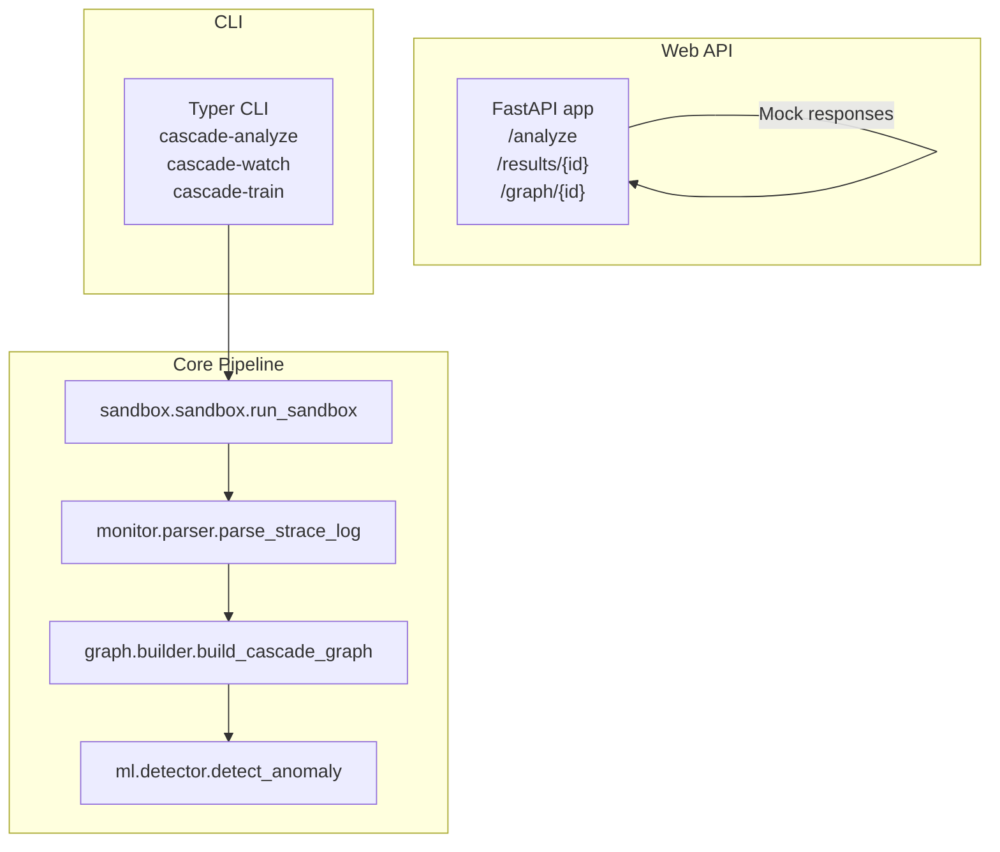
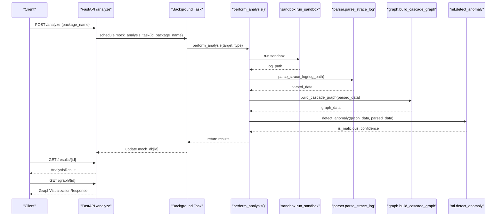
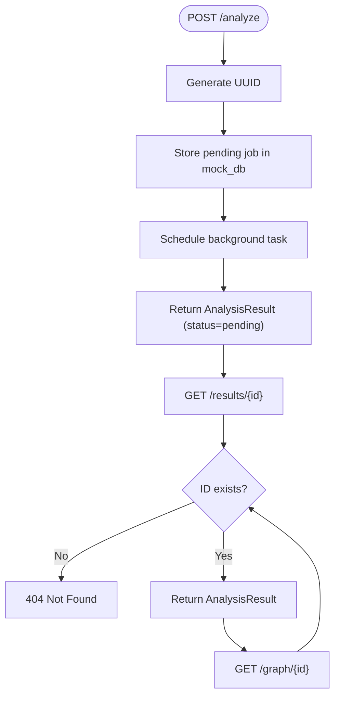
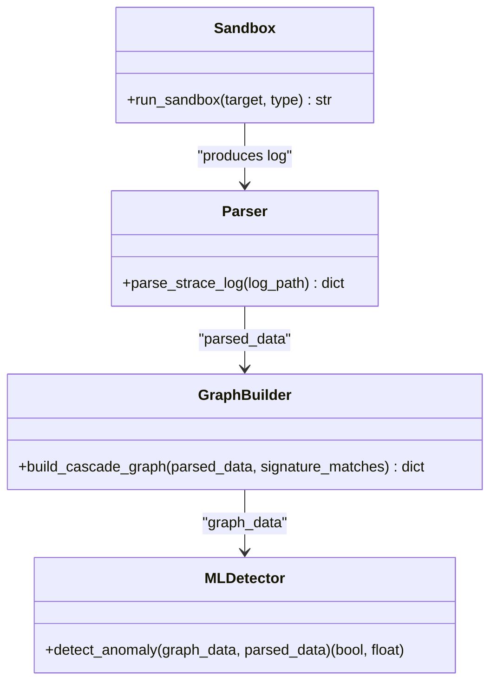
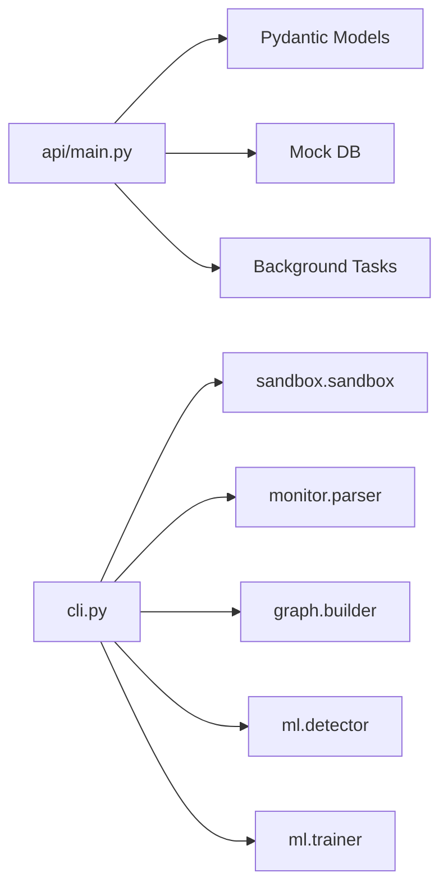

# API Reference

<cite>
**Referenced Files in This Document**
- [api/main.py](file://TraceTree/api/main.py)
- [cli.py](file://TraceTree/cli.py)
- [pyproject.toml](file://TraceTree/pyproject.toml)
- [setup.py](file://TraceTree/setup.py)
- [README.md](file://TraceTree/README.md)
- [sandbox/sandbox.py](file://TraceTree/sandbox/sandbox.py)
- [graph/builder.py](file://TraceTree/graph/builder.py)
- [ml/detector.py](file://TraceTree/ml/detector.py)
- [monitor/parser.py](file://TraceTree/monitor/parser.py)
- [monitor/signatures.py](file://TraceTree/monitor/signatures.py)
- [monitor/timeline.py](file://TraceTree/monitor/timeline.py)
- [ml/trainer.py](file://TraceTree/ml/trainer.py)
- [data/signatures.json](file://TraceTree/data/signatures.json)
- [data/malicious_packages.txt](file://TraceTree/data/malicious_packages.txt)
- [data/clean_packages.txt](file://TraceTree/data/clean_packages.txt)
</cite>

## Table of Contents
1. [Introduction](#introduction)
2. [Project Structure](#project-structure)
3. [Core Components](#core-components)
4. [Architecture Overview](#architecture-overview)
5. [Detailed Component Analysis](#detailed-component-analysis)
6. [Dependency Analysis](#dependency-analysis)
7. [Performance Considerations](#performance-considerations)
8. [Troubleshooting Guide](#troubleshooting-guide)
9. [Conclusion](#conclusion)
10. [Appendices](#appendices)

## Introduction
This document provides a comprehensive API reference for TraceTree’s web API interface and programmatic access patterns. It covers:
- FastAPI endpoint structure, HTTP methods, URL patterns, request/response schemas, and authentication requirements
- Programmatic integration as a Python library, including module imports, function calls, and custom analysis workflows
- API response formats, error handling strategies, and data serialization options
- Examples of webhook integration, CI/CD pipeline integration, and automated security scanning workflows
- The relationship between the CLI and underlying API functions
- Rate limiting considerations, versioning information, and backwards compatibility notes

## Project Structure
TraceTree exposes a FastAPI application for web-based analysis and a rich CLI for interactive and batch operations. The web API is intentionally stubbed to return mock data and serves as a placeholder for future integration with the full sandbox pipeline. The CLI orchestrates the end-to-end analysis pipeline (sandbox, parsing, graphing, ML detection) and can be used programmatically.

**Diagram sources**
- [api/main.py:10-129](file://TraceTree/api/main.py#L10-L129)
- [cli.py:181-259](file://TraceTree/cli.py#L181-L259)
- [sandbox/sandbox.py:175-335](file://TraceTree/sandbox/sandbox.py#L175-L335)
- [monitor/parser.py:340-679](file://TraceTree/monitor/parser.py#L340-L679)
- [graph/builder.py:8-196](file://TraceTree/graph/builder.py#L8-L196)
- [ml/detector.py:235-299](file://TraceTree/ml/detector.py#L235-L299)

**Section sources**
- [api/main.py:10-129](file://TraceTree/api/main.py#L10-L129)
- [cli.py:24-800](file://TraceTree/cli.py#L24-L800)

## Core Components
- Web API (FastAPI)
  - Endpoints:
    - POST /analyze: Submits a package analysis job and returns a pending result
    - GET /results/{analysis_id}: Retrieves analysis results by ID
    - GET /graph/{analysis_id}: Returns a graph visualization for the analysis
  - Request/Response Schemas:
    - AnalysisRequest: package_name (string), pypi_url (optional string)
    - AnalysisResult: id (string), status (string), package_name (string), verdict (optional string), confidence_score (optional float)
    - Graph visualization: nodes (array of GraphNode), edges (array of GraphEdge)
  - Authentication: Not implemented in the stub; CORS enabled for development
- CLI
  - Commands:
    - cascade-analyze: Run sandbox → parse → graph → ML pipeline
    - cascade-watch: Watch a repository and trigger on-demand scans
    - cascade-train: Train ML model using curated datasets
  - Programmatic entry points:
    - analyze(): orchestrates the full pipeline
    - perform_analysis(): helper to run sandbox → parse → graph → ML and return structured results

**Section sources**
- [api/main.py:37-118](file://TraceTree/api/main.py#L37-L118)
- [cli.py:261-371](file://TraceTree/cli.py#L261-L371)
- [cli.py:181-259](file://TraceTree/cli.py#L181-L259)

## Architecture Overview
The web API is a thin facade around the CLI’s analysis pipeline. The CLI performs:
1. Sandbox execution (Docker)
2. Syscall parsing (strace)
3. Signature matching and temporal pattern detection
4. Graph construction (NetworkX/Cytoscape JSON)
5. ML anomaly detection

**Diagram sources**
- [api/main.py:78-95](file://TraceTree/api/main.py#L78-L95)
- [api/main.py:97-118](file://TraceTree/api/main.py#L97-L118)
- [cli.py:181-259](file://TraceTree/cli.py#L181-L259)
- [sandbox/sandbox.py:175-335](file://TraceTree/sandbox/sandbox.py#L175-L335)
- [monitor/parser.py:340-679](file://TraceTree/monitor/parser.py#L340-L679)
- [graph/builder.py:8-196](file://TraceTree/graph/builder.py#L8-L196)
- [ml/detector.py:235-299](file://TraceTree/ml/detector.py#L235-L299)

## Detailed Component Analysis

### Web API Endpoints
- POST /analyze
  - Purpose: Submit a package for analysis
  - Request body: AnalysisRequest
  - Response: AnalysisResult
  - Behavior: Generates a UUID, stores a pending job in memory, schedules a background task, returns immediately
- GET /results/{analysis_id}
  - Purpose: Poll for results
  - Path parameter: analysis_id (string)
  - Response: AnalysisResult
  - Errors: 404 if ID not found
- GET /graph/{analysis_id}
  - Purpose: Retrieve graph visualization
  - Path parameter: analysis_id (string)
  - Response: GraphVisualizationResponse
  - Errors: 404 if ID not found
- GET /
  - Purpose: Redirect to the frontend dashboard mounted under /app
- Frontend mounting
  - Static files served under /app if a frontend directory exists

**Diagram sources**
- [api/main.py:78-95](file://TraceTree/api/main.py#L78-L95)
- [api/main.py:97-118](file://TraceTree/api/main.py#L97-L118)

**Section sources**
- [api/main.py:78-129](file://TraceTree/api/main.py#L78-L129)

### Request and Response Schemas
- AnalysisRequest
  - package_name: string
  - pypi_url: string (optional)
- AnalysisResult
  - id: string
  - status: string
  - package_name: string
  - verdict: string (optional)
  - confidence_score: number (optional)
- GraphNodeData
  - id: string
  - label: string
  - type: string
- GraphNode
  - data: GraphNodeData
- GraphEdgeData
  - source: string
  - target: string
  - label: string
- GraphEdge
  - data: GraphEdgeData
- GraphVisualizationResponse
  - nodes: array of GraphNode
  - edges: array of GraphEdge

**Section sources**
- [api/main.py:37-67](file://TraceTree/api/main.py#L37-L67)

### Authentication and Security
- CORS: Enabled for development with allow_origins set to "*" and allow_credentials set to false
- Authentication: Not implemented in the web API stub
- Recommendations:
  - Add API key or JWT-based authentication for production
  - Enforce HTTPS and secure cookies
  - Implement rate limiting and input validation

**Section sources**
- [api/main.py:10-24](file://TraceTree/api/main.py#L10-L24)

### Error Handling
- 404 Not Found: Returned when an analysis ID is not present in the mock database
- Background tasks: Placeholder; actual implementation would surface errors via stored state or external queues

**Section sources**
- [api/main.py:92-95](file://TraceTree/api/main.py#L92-L95)

### Programmatic Access (Library Integration)
- Module imports and entry points:
  - From the CLI module:
    - analyze(): main command entry point
    - perform_analysis(): core pipeline helper
  - From sandbox:
    - run_sandbox(target, target_type): executes target in Docker, returns log path
  - From monitor:
    - parse_strace_log(log_path): parses strace output into structured events
  - From graph:
    - build_cascade_graph(parsed_data, signature_matches): builds NetworkX graph and returns Cytoscape JSON
  - From ml:
    - detect_anomaly(graph_data, parsed_data): returns (is_malicious, confidence)
- Typical workflow:
  - run_sandbox(target, type)
  - parse_strace_log(log_path)
  - build_cascade_graph(parsed_data)
  - detect_anomaly(graph_data, parsed_data)

**Diagram sources**
- [sandbox/sandbox.py:175-335](file://TraceTree/sandbox/sandbox.py#L175-L335)
- [monitor/parser.py:340-679](file://TraceTree/monitor/parser.py#L340-L679)
- [graph/builder.py:8-196](file://TraceTree/graph/builder.py#L8-L196)
- [ml/detector.py:235-299](file://TraceTree/ml/detector.py#L235-L299)

**Section sources**
- [cli.py:181-259](file://TraceTree/cli.py#L181-L259)
- [sandbox/sandbox.py:175-335](file://TraceTree/sandbox/sandbox.py#L175-L335)
- [monitor/parser.py:340-679](file://TraceTree/monitor/parser.py#L340-L679)
- [graph/builder.py:8-196](file://TraceTree/graph/builder.py#L8-L196)
- [ml/detector.py:235-299](file://TraceTree/ml/detector.py#L235-L299)

### CLI Relationship to API Functions
- The CLI commands cascade-analyze, cascade-watch, and cascade-train orchestrate the same pipeline used by the web API
- The web API endpoints are stubs; the real analysis is performed by the CLI’s helper functions
- To integrate the web API with the real pipeline, replace the mock background task with calls to perform_analysis()

**Section sources**
- [cli.py:261-371](file://TraceTree/cli.py#L261-L371)
- [api/main.py:68-76](file://TraceTree/api/main.py#L68-L76)

### Data Serialization Options
- Graph output format:
  - Nodes and edges conform to Cytoscape-compatible JSON
  - Includes severity, signature tags, and temporal edge metadata
- Model artifacts:
  - Pickled scikit-learn model saved as ml/model.pkl
  - Can be downloaded from Google Cloud Storage bucket cascade-analyzer-models

**Section sources**
- [graph/builder.py:142-195](file://TraceTree/graph/builder.py#L142-L195)
- [ml/detector.py:108-146](file://TraceTree/ml/detector.py#L108-L146)

### API Response Formats
- AnalysisResult: includes id, status, package_name, optional verdict and confidence_score
- GraphVisualizationResponse: includes nodes and edges arrays with data payloads
- Temporal and signature results are integrated into the graph and parsed data structures used by the CLI

**Section sources**
- [api/main.py:41-67](file://TraceTree/api/main.py#L41-L67)
- [graph/builder.py:142-195](file://TraceTree/graph/builder.py#L142-L195)

### Error Handling Strategies
- 404 for invalid analysis IDs
- Sandbox failures return empty strings; callers should handle missing logs gracefully
- Parser and graph builders return empty or partial structures on failure; callers should validate presence of required fields

**Section sources**
- [api/main.py:92-95](file://TraceTree/api/main.py#L92-L95)
- [sandbox/sandbox.py:322-335](file://TraceTree/sandbox/sandbox.py#L322-L335)

### Examples

#### Webhook Integration
- Use GET /results/{id} to poll for completion and retrieve verdict
- Use GET /graph/{id} to render the execution graph in a frontend dashboard

**Section sources**
- [api/main.py:91-118](file://TraceTree/api/main.py#L91-L118)

#### CI/CD Pipeline Integration
- Run cascade-analyze on pull requests or scheduled scans
- Publish graph JSON and ML confidence to artifact storage for review
- Fail builds when is_malicious is true and confidence exceeds thresholds

**Section sources**
- [cli.py:261-371](file://TraceTree/cli.py#L261-L371)

#### Automated Security Scanning Workflows
- Periodically scan dependencies using cascade-analyze and cascade-watch
- Integrate with repository hooks to auto-start watchers after git clone

**Section sources**
- [cli.py:669-800](file://TraceTree/cli.py#L669-L800)

## Dependency Analysis
- Web API depends on:
  - Pydantic models for request/response validation
  - In-memory mock database for job tracking
  - Background tasks for asynchronous processing
- CLI depends on:
  - Docker SDK for sandbox execution
  - NetworkX for graph construction
  - scikit-learn for anomaly detection
  - Rich for CLI UX

**Diagram sources**
- [api/main.py:10-14](file://TraceTree/api/main.py#L10-L14)
- [cli.py:181-259](file://TraceTree/cli.py#L181-L259)
- [sandbox/sandbox.py:175-335](file://TraceTree/sandbox/sandbox.py#L175-L335)
- [graph/builder.py:8-196](file://TraceTree/graph/builder.py#L8-L196)
- [ml/detector.py:235-299](file://TraceTree/ml/detector.py#L235-L299)
- [ml/trainer.py:15-99](file://TraceTree/ml/trainer.py#L15-L99)

**Section sources**
- [pyproject.toml:14-24](file://TraceTree/pyproject.toml#L14-L24)
- [setup.py:19-29](file://TraceTree/setup.py#L19-L29)

## Performance Considerations
- Sandbox execution time varies by target type; timeouts are enforced per target
- Graph construction and ML inference scale with event volume; consider batching and caching
- Model loading is cached in memory; clear cache when updating models
- Frontend serving under /app is static; ensure proper caching headers

**Section sources**
- [sandbox/sandbox.py:259-269](file://TraceTree/sandbox/sandbox.py#L259-L269)
- [ml/detector.py:17-21](file://TraceTree/ml/detector.py#L17-L21)

## Troubleshooting Guide
- Docker not installed or unreachable:
  - The CLI checks Docker preflight and exits with guidance
- Sandbox produces no strace output:
  - Logs are filtered for noise; verify target type and execution path
- Model loading failures:
  - Falls back to IsolationForest baseline; ensure model.pkl exists or is downloadable from GCS
- API returns 404:
  - Verify analysis_id exists in the mock database

**Section sources**
- [cli.py:73-110](file://TraceTree/cli.py#L73-L110)
- [sandbox/sandbox.py:338-376](file://TraceTree/sandbox/sandbox.py#L338-L376)
- [ml/detector.py:108-146](file://TraceTree/ml/detector.py#L108-L146)
- [api/main.py:92-95](file://TraceTree/api/main.py#L92-L95)

## Conclusion
The web API provides a stable contract for submitting analysis jobs and retrieving results, while the CLI offers a complete, production-ready analysis pipeline. The API is currently stubbed and intended to wrap the CLI’s pipeline in the future. For production deployments, add authentication, rate limiting, and integrate the real sandbox pipeline into the background task.

## Appendices

### Versioning and Compatibility
- Project version: 1.0.0
- Backward compatibility:
  - ML detector supports older models via feature truncation and severity-based adjustments
  - Parser and graph builder maintain stable event structures for downstream consumers

**Section sources**
- [pyproject.toml:7](file://TraceTree/pyproject.toml#L7)
- [ml/detector.py:254-262](file://TraceTree/ml/detector.py#L254-L262)

### Data and Training Artifacts
- Behavioral signatures: loaded from data/signatures.json
- Training datasets: data/malicious_packages.txt and data/clean_packages.txt
- Model training: cascade-train command trains a RandomForestClassifier and uploads to GCS

**Section sources**
- [data/signatures.json:1-246](file://TraceTree/data/signatures.json#L1-L246)
- [data/malicious_packages.txt:1-33](file://TraceTree/data/malicious_packages.txt#L1-L33)
- [data/clean_packages.txt:1-33](file://TraceTree/data/clean_packages.txt#L1-L33)
- [ml/trainer.py:15-99](file://TraceTree/ml/trainer.py#L15-L99)