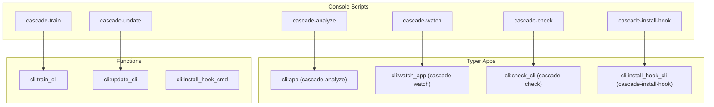
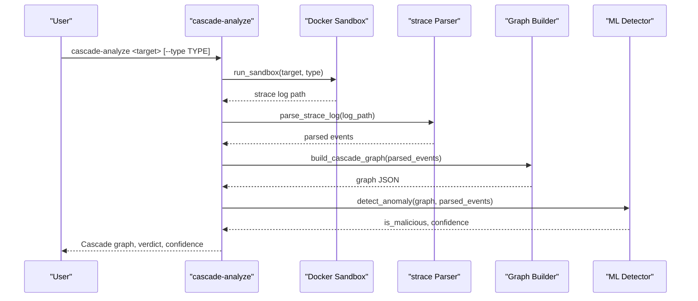
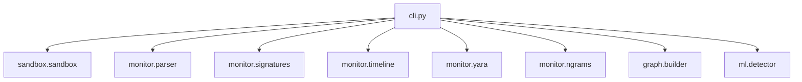

# CLI Commands Reference

<cite>
**Referenced Files in This Document**
- [cli.py](file://cli.py)
- [cli.py](file://TraceTree/cli.py)
- [README.md](file://README.md)
- [README.md](file://TraceTree/README.md)
- [pyproject.toml](file://pyproject.toml)
- [pyproject.toml](file://TraceTree/pyproject.toml)
- [install_hook.py](file://hooks/install_hook.py)
- [install_hook.sh](file://hooks/install_hook.sh)
- [shell_hook.sh](file://hooks/shell_hook.sh)
- [setup.py](file://setup.py)
- [setup.py](file://TraceTree/setup.py)
</cite>

## Table of Contents
1. [Introduction](#introduction)
2. [Project Structure](#project-structure)
3. [Core Components](#core-components)
4. [Architecture Overview](#architecture-overview)
5. [Detailed Component Analysis](#detailed-component-analysis)
6. [Dependency Analysis](#dependency-analysis)
7. [Performance Considerations](#performance-considerations)
8. [Troubleshooting Guide](#troubleshooting-guide)
9. [Conclusion](#conclusion)
10. [Appendices](#appendices)

## Introduction
This document provides comprehensive CLI documentation for all TraceTree command-line interface commands. It covers the primary analysis command cascade-analyze and its subcommands, along with standalone commands for repository monitoring (cascade-watch), quick scans (cascade-check), shell integration (cascade-install-hook), model training (cascade-train), and model updates (cascade-update). For each command, you will find detailed syntax, parameter options, examples with actual command usage, and expected output formats. The document also explains command combinations, chaining patterns, and the relationship between commands in the analysis pipeline.

## Project Structure
TraceTree exposes multiple console scripts that map to distinct Typer applications and functions. The primary entry point is cascade-analyze, which registers the main CLI app. Additional commands are exposed as separate Typer apps or functions to support top-level invocation.

**Diagram sources**
- [pyproject.toml:26-32](file://pyproject.toml#L26-L32)
- [setup.py:30-38](file://setup.py#L30-L38)

**Section sources**
- [pyproject.toml:26-32](file://pyproject.toml#L26-L32)
- [setup.py:30-38](file://setup.py#L30-L38)

## Core Components
This section documents each CLI command with its syntax, options, examples, and expected outputs.

### cascade-analyze
Primary command for behavioral cascade analysis. Supports multiple target types and bulk analysis.

- Command syntax
  - cascade-analyze <target> [--type TYPE] [--url URL] [--sarif PATH]
- Options
  - --type, -t TYPE: Force target type. Allowed values: pip, npm, dmg, exe, bulk. If omitted, type is inferred from target.
  - --url, -u URL: Optional URL for private dependencies.
  - --sarif, -s PATH: Output SARIF report to the specified file path.
- Target inference rules
  - If target is a file with extension .dmg, type is inferred as dmg.
  - If target is a file with extension .exe or .msi, type is inferred as exe.
  - If target is a file named package.json, type is inferred as bulk-npm.
  - If target is a file named requirements.txt, type is inferred as bulk-pip.
  - Otherwise, type defaults to pip.
- Behavior
  - Runs sandbox → parse → graph → ML pipeline.
  - Supports bulk analysis via bulk-pip and bulk-npm files.
  - Generates a cascade graph, lists flagged behaviors, signature matches, temporal patterns, YARA matches (when available), and syscall n-gram fingerprints.
  - Prints a final verdict (MALICIOUS or CLEAN) with confidence percentage.
  - Optionally exports a SARIF report.
- Examples
  - Analyze a PyPI package: cascade-analyze requests
  - Analyze an npm package: cascade-analyze package.json
  - Analyze a DMG or EXE: cascade-analyze suspicious_app.dmg
  - Bulk analysis: cascade-analyze requirements.txt
  - Force target type: cascade-analyze ./some_file --type pip
- Expected output
  - Welcome banner and quick start tips.
  - Progress steps: sandboxing, parsing, graphing, detecting.
  - Cascade graph panel with root processes and edges.
  - Panels for flagged behaviors, behavioral signatures, temporal patterns, YARA matches, and syscall n-gram fingerprints.
  - Final verdict panel with confidence score.
  - Optional SARIF report export message.

**Section sources**
- [cli.py:305-482](file://cli.py#L305-L482)
- [cli.py:111-124](file://cli.py#L111-L124)
- [README.md:178-203](file://README.md#L178-L203)

### cascade-analyze mcp
MCP (Model Context Protocol) server security analysis.

- Command syntax
  - cascade-analyze mcp --npm PACKAGE [--path PATH] [--allow-network] [--transport TRANSPORT] [--port PORT] [--output OUTPUT] [--delay SECONDS] [--timeout SECONDS]
- Options
  - --npm, -n PACKAGE: NPM package name (e.g., @modelcontextprotocol/server-github).
  - --path, -p PATH: Local path to an MCP server project.
  - --allow-network: Allow outbound network from the sandbox.
  - --transport, -t TRANSPORT: Force transport: stdio or http.
  - --port PORT: Port for HTTP/SSE transport.
  - --output, -o OUTPUT: Output format: report (Rich console) or json.
  - --delay SECONDS: Seconds between tool calls during analysis.
  - --timeout SECONDS: Maximum seconds for the analysis session.
- Behavior
  - Resolves target from either --npm or --path.
  - Runs MCP server in a sandbox, simulates client handshake and tool discovery, invokes tools with safe synthetic arguments, and runs adversarial probes.
  - Extracts MCP-specific features and performs rule-based threat classification.
  - Generates a report (Rich console or JSON).
- Examples
  - Analyze an npm MCP server: cascade-analyze mcp --npm @modelcontextprotocol/server-github
  - Analyze a local MCP server project: cascade-analyze mcp --path ./my-mcp-server
  - Allow network: cascade-analyze mcp --npm @modelcontextprotocol/server-github --allow-network
  - Force transport: cascade-analyze mcp --npm some-package --transport stdio
  - JSON output: cascade-analyze mcp --npm some-package --output json

**Section sources**
- [cli.py:563-743](file://cli.py#L563-L743)
- [README.md:265-285](file://README.md#L265-L285)

### cascade-watch
Standalone session guardian for repository monitoring.

- Command syntax
  - cascade-watch <repo> [--check FILE_OR_COMMAND] [--output OUTPUT]
- Options
  - --check, -c FILE_OR_COMMAND: On-demand deep scan of a specific file or command.
  - --output, -o OUTPUT: Output format: report (Rich console) or json.
- Behavior
  - Starts a background watcher for the specified repository path or URL.
  - Displays a spider mascot and polls status in a loop.
  - Enforces a single watcher per directory via a lockfile.
  - Supports optional on-demand check.
- Examples
  - Watch a directory: cascade-watch ./my-project
  - On-demand scan: cascade-watch ./my-project --check setup.py
  - Watch a URL: cascade-watch https://github.com/user/repo.git

**Section sources**
- [cli.py:835-1000](file://cli.py#L835-L1000)
- [README.md:211-221](file://README.md#L211-L221)

### cascade-check
Quick on-demand scan of a specific file or command.

- Command syntax
  - cascade-check <file_or_command> [--output OUTPUT]
- Options
  - --output, -o OUTPUT: Output format: report (Rich console) or json.
- Behavior
  - Performs a one-off sandbox analysis for the specified file or command.
  - Infers target type from file extension or manifest names.
  - Prints a final verdict and flagged behaviors.
- Examples
  - Quick check a file: cascade-check setup.py
  - Quick check an EXE: cascade-check ./payload.exe

**Section sources**
- [cli.py:1003-1102](file://cli.py#L1003-L1102)
- [README.md:223-230](file://README.md#L223-L230)

### cascade-install-hook
Installs a shell hook to automatically run cascade-watch after every git clone.

- Command syntax
  - cascade-install-hook
- Behavior
  - Detects the user’s shell (bash/zsh), copies the hook script to ~/.local/share/tracetree/hooks/, and appends a source line to ~/.bashrc or ~/.zshrc.
  - The hook script wraps git clone to start cascade-watch in the background and logs to /tmp/tracetree_<reponame>.log.
- Examples
  - Install the hook: cascade-install-hook

**Section sources**
- [cli.py:1105-1131](file://cli.py#L1105-L1131)
- [install_hook.py:71-119](file://install_hook.py#L71-L119)
- [install_hook.sh:1-60](file://install_hook.sh#L1-60)
- [shell_hook.sh:1-93](file://shell_hook.sh#L1-L93)
- [README.md:232-240](file://README.md#L232-L240)

### cascade-train
Interactive training pipeline for model training.

- Command syntax
  - cascade-train
- Behavior
  - Prompts for a MalwareBazaar API key (optional).
  - If provided, ingests samples from MalwareBazaar and runs each through the sandbox pipeline.
  - Trains a RandomForestClassifier on extracted features and saves to ml/model.pkl.
  - Attempts to upload to Google Cloud Storage (requires authenticated google-cloud-storage).
- Examples
  - Train with online data: export MALWAREBAZAAR_AUTH_KEY="your-key" && cascade-train
  - Train with local data only: cascade-train

**Section sources**
- [cli.py:501-560](file://cli.py#L501-L560)
- [README.md:242-255](file://README.md#L242-L255)

### cascade-update
Downloads the latest pre-trained model from Google Cloud Storage.

- Command syntax
  - cascade-update
- Behavior
  - Downloads the latest pre-trained model from the cascade-analyzer-models bucket (anonymous access).
  - Falls back to the IsolationForest baseline if the download fails.
- Examples
  - Update model: cascade-update

**Section sources**
- [cli.py:557-561](file://cli.py#L557-L561)
- [README.md:257-263](file://README.md#L257-L263)

## Architecture Overview
The CLI orchestrates a multi-stage analysis pipeline: sandboxing, parsing, graph building, and anomaly detection. Some commands integrate additional components like signature matching, temporal pattern detection, YARA scanning, and MCP-specific analysis.

**Diagram sources**
- [cli.py:196-303](file://cli.py#L196-L303)

## Detailed Component Analysis

### cascade-analyze Subcommands and Options
- Subcommands
  - mcp: MCP server security analysis with transport, port, and output options.
  - watch: Session guardian invoked via cascade-watch.
  - check: Quick on-demand scan invoked via cascade-check.
- Options summary
  - --type, -t: Target type inference or override.
  - --url, -u: Private dependency URL.
  - --sarif, -s: SARIF report output path.
  - --npm, -n: NPM package for MCP analysis.
  - --path, -p: Local path for MCP analysis.
  - --allow-network: Allow outbound network in sandbox.
  - --transport, -t: Transport type for MCP (stdio or http).
  - --port PORT: Port for HTTP/SSE transport.
  - --output, -o: Output format (report or json).
  - --delay SECONDS: Tool call delay for MCP.
  - --timeout SECONDS: Analysis session timeout for MCP.
  - --check, -c: On-demand scan for watch.
  - --type-a, --type-b: Target type overrides for diff.

**Section sources**
- [cli.py:305-482](file://cli.py#L305-L482)
- [cli.py:563-743](file://cli.py#L563-L743)
- [cli.py:835-1000](file://cli.py#L835-L1000)
- [cli.py:1003-1102](file://cli.py#L1003-L1102)
- [cli.py:1133-1224](file://cli.py#L1133-L1224)

### Command Combinations and Chaining Patterns
- Repository monitoring and quick checks
  - Use cascade-watch to continuously monitor a repository and cascade-check for on-demand scans.
  - Example: cascade-watch ./my-project --check setup.py
- Shell integration
  - Install the shell hook to automatically start cascade-watch after every git clone.
  - Example: cascade-install-hook
- Model lifecycle
  - Train a model with cascade-train and update with cascade-update.
  - Example: cascade-train; cascade-update
- Bulk analysis
  - Use cascade-analyze with bulk-pip or bulk-npm files to analyze multiple targets.
  - Example: cascade-analyze requirements.txt

**Section sources**
- [cli.py:835-1000](file://cli.py#L835-L1000)
- [cli.py:1003-1102](file://cli.py#L1003-L1102)
- [cli.py:501-560](file://cli.py#L501-L560)
- [cli.py:557-561](file://cli.py#L557-L561)

### Argument Precedence and Validation
- Target type precedence
  - Explicit --type overrides automatic inference.
  - Automatic inference considers file extensions and manifest names.
- Docker preflight
  - All commands requiring sandboxing check for Docker availability and connectivity before proceeding.
- Session guards
  - cascade-watch enforces a single watcher per directory via a lockfile mechanism.

**Section sources**
- [cli.py:111-124](file://cli.py#L111-L124)
- [cli.py:74-110](file://cli.py#L74-L110)
- [cli.py:869-881](file://cli.py#L869-L881)

## Dependency Analysis
The CLI relies on several modules for parsing, graph construction, machine learning, and MCP analysis.

**Diagram sources**
- [cli.py:196-303](file://cli.py#L196-L303)

**Section sources**
- [cli.py:196-303](file://cli.py#L196-L303)

## Performance Considerations
- Docker overhead: All sandboxed analyses incur container startup and teardown costs.
- strace tracing: Full syscall tracing with timestamps and multi-process following increases runtime.
- Bulk analysis: Processing multiple targets sequentially; consider batching or parallelization externally if needed.
- MCP analysis: Additional overhead from client simulation, tool discovery, and adversarial probing.

## Troubleshooting Guide
- Docker not installed or unreachable
  - Symptom: Preflight check fails with installation and startup guidance.
  - Resolution: Install Docker for your OS and start the Docker daemon.
- Session already running
  - Symptom: A watcher is already active for the directory.
  - Resolution: Stop the existing watcher or use cascade-check for on-demand scans.
- Sandbox failure
  - Symptom: Sandbox failed — check that Docker is running.
  - Resolution: Verify Docker is installed and reachable.
- Missing install script
  - Symptom: Install script not found.
  - Resolution: Ensure you are running the installer from the project root.

**Section sources**
- [cli.py:74-110](file://cli.py#L74-L110)
- [cli.py:870-881](file://cli.py#L870-L881)
- [cli.py:1070-1073](file://cli.py#L1070-L1073)
- [cli.py:1114-1131](file://cli.py#L1114-L1131)

## Conclusion
TraceTree’s CLI provides a comprehensive toolkit for behavioral analysis across multiple target types and environments. The commands integrate seamlessly with Docker-based sandboxing, strace-based parsing, and machine learning-based anomaly detection. Users can chain commands for continuous monitoring, automate repository watching via shell hooks, and maintain models with training and update capabilities.

## Appendices

### Command Reference Summary
- cascade-analyze: Primary analysis with target type inference and SARIF export.
- cascade-watch: Repository monitoring with on-demand checks.
- cascade-check: Quick on-demand scans.
- cascade-install-hook: Shell integration for automatic watcher activation.
- cascade-train: Interactive model training pipeline.
- cascade-update: Model update from cloud storage.

**Section sources**
- [pyproject.toml:26-32](file://pyproject.toml#L26-L32)
- [setup.py:30-38](file://setup.py#L30-L38)