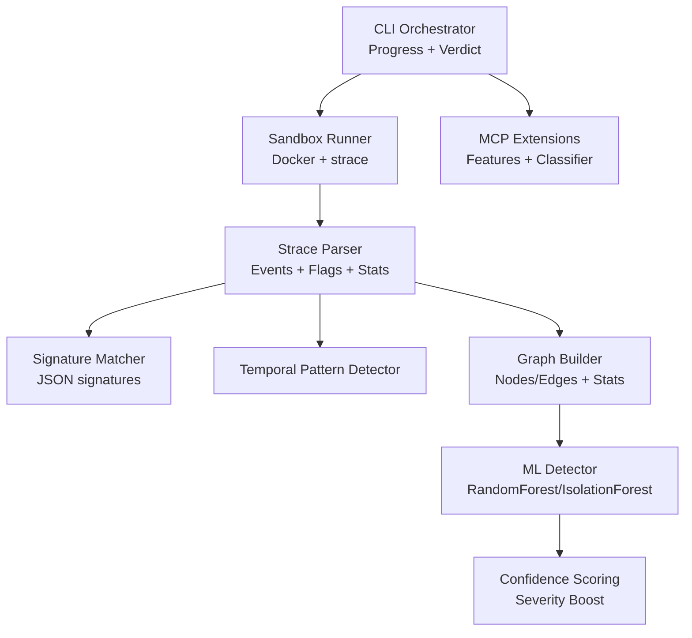
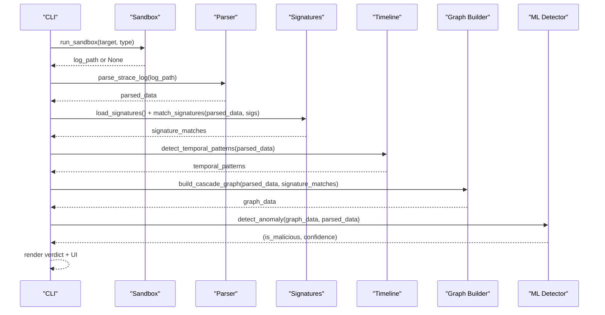
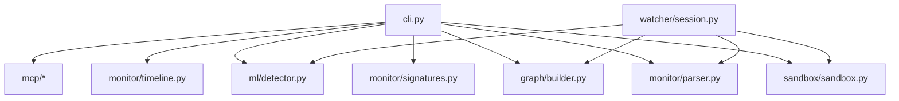

# Analysis Pipeline Steps

<cite>
**Referenced Files in This Document**
- [cli.py](file://TraceTree/cli.py)
- [sandbox.py](file://TraceTree/sandbox/sandbox.py)
- [parser.py](file://TraceTree/monitor/parser.py)
- [signatures.py](file://TraceTree/monitor/signatures.py)
- [timeline.py](file://TraceTree/monitor/timeline.py)
- [builder.py](file://TraceTree/graph/builder.py)
- [detector.py](file://TraceTree/ml/detector.py)
- [trainer.py](file://TraceTree/ml/trainer.py)
- [session.py](file://TraceTree/watcher/session.py)
- [spider.py](file://TraceTree/mascot/spider.py)
- [features.py](file://TraceTree/mcp/features.py)
- [classifier.py](file://TraceTree/mcp/classifier.py)
- [mcp_sandbox.py](file://TraceTree/mcp/sandbox.py)
- [signatures.json](file://TraceTree/data/signatures.json)
</cite>

## Table of Contents
1. [Introduction](#introduction)
2. [Project Structure](#project-structure)
3. [Core Components](#core-components)
4. [Architecture Overview](#architecture-overview)
5. [Detailed Component Analysis](#detailed-component-analysis)
6. [Dependency Analysis](#dependency-analysis)
7. [Performance Considerations](#performance-considerations)
8. [Troubleshooting Guide](#troubleshooting-guide)
9. [Conclusion](#conclusion)
10. [Appendices](#appendices)

## Introduction
This document describes the complete analysis pipeline executed by cascade-analyze, covering sandbox execution, strace log capture and parsing, behavioral signature matching, temporal pattern detection, graph construction, machine learning anomaly detection, and confidence scoring. It also documents the Progress tracking system, error handling, fallback mechanisms, data flow between components, and performance considerations for large-scale analysis.

## Project Structure
The pipeline is organized into modular components:
- CLI orchestration and progress tracking
- Sandbox execution (Docker-based)
- Strace log parsing and feature extraction
- Behavioral signature matching
- Temporal pattern detection
- Graph construction (NetworkX/Cytoscape JSON)
- Machine learning anomaly detection with severity boosting
- MCP-specific extensions (sandbox, features, classification)
- Watcher session and mascot UI

**Diagram sources**
- [cli.py:181-259](file://TraceTree/cli.py#L181-L259)
- [sandbox.py:175-335](file://TraceTree/sandbox/sandbox.py#L175-L335)
- [parser.py:340-679](file://TraceTree/monitor/parser.py#L340-L679)
- [signatures.py:86-115](file://TraceTree/monitor/signatures.py#L86-L115)
- [timeline.py:298-331](file://TraceTree/monitor/timeline.py#L298-L331)
- [builder.py:8-195](file://TraceTree/graph/builder.py#L8-L195)
- [detector.py:235-299](file://TraceTree/ml/detector.py#L235-L299)
- [features.py:32-206](file://TraceTree/mcp/features.py#L32-L206)
- [classifier.py:61-96](file://TraceTree/mcp/classifier.py#L61-L96)

**Section sources**
- [cli.py:181-259](file://TraceTree/cli.py#L181-L259)
- [sandbox.py:175-335](file://TraceTree/sandbox/sandbox.py#L175-L335)

## Core Components
- CLI orchestrator coordinates the pipeline, manages progress, and renders results.
- Sandbox runner builds and runs Docker containers with strace instrumentation.
- Parser converts strace logs into structured events with severity and flags.
- Signature matcher applies behavioral patterns from JSON.
- Temporal analyzer detects time-based patterns in ordered events.
- Graph builder constructs a NetworkX graph and exports Cytoscape-compatible JSON.
- ML detector uses a trained model and severity boosting to compute a confidence score.
- MCP extensions add server-type detection, feature extraction, and rule-based classification.

**Section sources**
- [cli.py:181-259](file://TraceTree/cli.py#L181-L259)
- [sandbox.py:175-335](file://TraceTree/sandbox/sandbox.py#L175-L335)
- [parser.py:340-679](file://TraceTree/monitor/parser.py#L340-L679)
- [signatures.py:86-115](file://TraceTree/monitor/signatures.py#L86-L115)
- [timeline.py:298-331](file://TraceTree/monitor/timeline.py#L298-L331)
- [builder.py:8-195](file://TraceTree/graph/builder.py#L8-L195)
- [detector.py:235-299](file://TraceTree/ml/detector.py#L235-L299)
- [features.py:32-206](file://TraceTree/mcp/features.py#L32-L206)
- [classifier.py:61-96](file://TraceTree/mcp/classifier.py#L61-L96)

## Architecture Overview
The pipeline follows a linear, stage-gated flow with best-effort fallbacks and robust error handling. Each stage produces artifacts consumed by downstream stages, culminating in a final verdict and confidence score.

**Diagram sources**
- [cli.py:181-259](file://TraceTree/cli.py#L181-L259)
- [sandbox.py:175-335](file://TraceTree/sandbox/sandbox.py#L175-L335)
- [parser.py:340-679](file://TraceTree/monitor/parser.py#L340-L679)
- [signatures.py:86-115](file://TraceTree/monitor/signatures.py#L86-L115)
- [timeline.py:298-331](file://TraceTree/monitor/timeline.py#L298-L331)
- [builder.py:8-195](file://TraceTree/graph/builder.py#L8-L195)
- [detector.py:235-299](file://TraceTree/ml/detector.py#L235-L299)

## Detailed Component Analysis

### Sandbox Initialization and Container Setup
- The sandbox runner builds a Docker image if missing and runs a containerized analysis with strace -f tracing.
- For pip/npm targets, it downloads and installs packages offline or globally, disables networking by default, and traces syscalls.
- For DMG/EXE targets, it mounts the artifact and traces extraction or Wine execution with noise filtering.
- The MCP sandbox variant builds a specialized container with transport-specific startup scripts and extracts logs.

Key behaviors:
- Image build on demand with caching.
- Container lifecycle management (start, wait, kill on timeout).
- Log extraction and filtering (e.g., Wine noise removal).
- MCP-specific transport modes (stdio vs HTTP) and server info extraction.

**Section sources**
- [sandbox.py:175-335](file://TraceTree/sandbox/sandbox.py#L175-L335)
- [mcp_sandbox.py:41-146](file://TraceTree/mcp/sandbox.py#L41-L146)

### Strace Log Capture and Parsing
- Parser reconstructs multi-line strace entries, normalizes timestamps, and builds event streams with severity weights.
- Tracks process lineage, network destinations, file accesses, and sensitive path patterns.
- Flags suspicious chains (e.g., reverse shell, credential theft) and computes total severity.

Parsed event structure:
- Event fields: pid, type, target, severity, details, timestamp, sequence_id, relative_ms.
- Additional fields: processes (per-PID metadata), parent_map, flags, network_destinations, total_severity_score, has_timestamps, event_count.

**Section sources**
- [parser.py:340-679](file://TraceTree/monitor/parser.py#L340-L679)

### Behavioral Signature Matching
- Loads signatures from data/signatures.json and matches unordered or ordered sequences of syscalls with conditions.
- Supports conditions like external connect, shell execve, non-standard binary, sensitive file access, protocol ports, and memory protection flags.
- Returns matched signatures with evidence and matched_events for tagging.

Signature format highlights:
- name, description, severity, syscalls, files, network.sequence, confidence_boost.

**Section sources**
- [signatures.py:86-115](file://TraceTree/monitor/signatures.py#L86-L115)
- [signatures.json:1-246](file://TraceTree/data/signatures.json#L1-L246)

### Temporal Pattern Detection
- Detects time-based patterns from ordered events: credential theft, rapid file enumeration, burst process spawn, delayed payload, and connect-then-shell.
- Uses sliding windows and thresholds to identify suspicious bursts and gaps.

Pattern outputs:
- pattern_name, severity, description, start_time_ms, end_time_ms, time_window_ms, evidence_events.

**Section sources**
- [timeline.py:298-331](file://TraceTree/monitor/timeline.py#L298-L331)

### Graph Construction
- Builds a NetworkX directed graph from parsed events:
  - Nodes: process, network, file, syscall-specific types.
  - Edges: syscall labels, severity weights, signature tags, temporal edges within a time window.
- Converts to Cytoscape JSON with nodes/edges and statistics (node_count, edge_count, network_conn_count, file_read_count, total_severity, max_severity, suspicious_network_count, sensitive_file_count, signature_match_count, temporal_edge_count).

**Section sources**
- [builder.py:8-195](file://TraceTree/graph/builder.py#L8-L195)

### Machine Learning Anomaly Detection and Confidence Scoring
- Extracts a fixed-length feature vector from graph stats and parsed data.
- Loads a trained RandomForest model if available locally or from GCS; falls back to IsolationForest baseline.
- Applies severity-boost adjustments: critical/ high/medium thresholds, temporal pattern boosts, and individual sensitive indicators.

Confidence adjustment logic:
- Critical severity overrides to malicious with high confidence.
- High/medium severity boosts confidence; multiple temporal patterns can flip verdict.
- Caps confidence at 99.9%.

**Section sources**
- [detector.py:29-68](file://TraceTree/ml/detector.py#L29-L68)
- [detector.py:108-146](file://TraceTree/ml/detector.py#L108-L146)
- [detector.py:180-232](file://TraceTree/ml/detector.py#L180-L232)
- [detector.py:235-299](file://TraceTree/ml/detector.py#L235-L299)

### MCP-Specific Extensions
- MCP sandbox runs the server under strace with transport-specific startup and server info extraction.
- Feature extraction groups syscalls by tool-call activity, tracks unexpected outbound connections, DNS lookups, shell invocations, sensitive path access, and adversarial behavior deltas.
- Rule-based classifier triggers threats: COMMAND_INJECTION, CREDENTIAL_EXFILTRATION, COVERT_NETWORK_CALL, PATH_TRAVERSAL, EXCESSIVE_PROCESS_SPAWNING, PROMPT_INJECTION_VECTOR.
- Risk score computed from threat severities and counts.

**Section sources**
- [mcp_sandbox.py:41-146](file://TraceTree/mcp/sandbox.py#L41-L146)
- [features.py:32-206](file://TraceTree/mcp/features.py#L32-L206)
- [classifier.py:61-96](file://TraceTree/mcp/classifier.py#L61-L96)
- [classifier.py:239-267](file://TraceTree/mcp/classifier.py#L239-L267)

### Progress Tracking System
- CLI uses Rich Progress with SpinnerColumn and TextColumn to visualize pipeline stages.
- Each stage updates task descriptions with success/failure markers and emits UI panels for cascade graph, flagged behaviors, matched signatures, temporal patterns, and final verdict.

**Section sources**
- [cli.py:298-371](file://TraceTree/cli.py#L298-L371)

### Error Handling and Fallback Mechanisms
- Docker preflight checks and graceful failure messages.
- Best-effort stages: signature matching and temporal analysis are wrapped in try/except and continue if they fail.
- Sandbox returns empty string/log_path on failure; pipeline aborts early with zero confidence.
- MCP sandbox requires a successful log; otherwise analysis stops.
- ML detector falls back to IsolationForest baseline if model loading fails.
- Watcher session gracefully handles sandbox failures and continues with subsequent targets.

**Section sources**
- [cli.py:73-109](file://TraceTree/cli.py#L73-L109)
- [cli.py:214-216](file://TraceTree/cli.py#L214-L216)
- [cli.py:234-235](file://TraceTree/cli.py#L234-L235)
- [detector.py:117-146](file://TraceTree/ml/detector.py#L117-L146)
- [session.py:284-348](file://TraceTree/watcher/session.py#L284-L348)

### Data Flow Between Components
- Parsed event structures: events[], flags[], processes{}, parent_map{}.
- Graph JSON: nodes[].data.id, label, type, severity, signature_tags; edges[].data.source/target/label/severity/temporal/time_delta_ms; stats{}.
- Feature vectors: [node_count, edge_count, network_conn_count, file_read_count, execve_count, total_severity, suspicious_network_count, sensitive_file_count, max_severity, temporal_pattern_count].
- MCP features: grouped by tool-call activity, adversarial deltas, baseline comparisons.

**Section sources**
- [parser.py:340-679](file://TraceTree/monitor/parser.py#L340-L679)
- [builder.py:141-195](file://TraceTree/graph/builder.py#L141-L195)
- [detector.py:29-68](file://TraceTree/ml/detector.py#L29-L68)
- [features.py:63-206](file://TraceTree/mcp/features.py#L63-L206)

### Example Pipeline Failures and Recovery Strategies
- Docker not installed or unreachable: preflight exits with installation guidance.
- Sandbox build fails: prints build error and returns empty log path; pipeline aborts.
- Parser fails: returns empty parsed data; pipeline proceeds to graph stage with zero confidence.
- Signature matching fails: logs and continues without signature tags.
- Temporal analysis fails: logs and continues without temporal patterns.
- ML model load fails: trains IsolationForest baseline and continues.
- MCP sandbox fails: aborts analysis and prints failure message.

Recovery strategies:
- Retry after fixing Docker daemon.
- Inspect logs directory for partial artifacts.
- Continue with severity-boost adjustments when ML is unavailable.
- Use CLI bulk mode to analyze multiple targets and skip failing ones.

**Section sources**
- [cli.py:73-109](file://TraceTree/cli.py#L73-L109)
- [sandbox.py:205-211](file://TraceTree/sandbox/sandbox.py#L205-L211)
- [cli.py:214-216](file://TraceTree/cli.py#L214-L216)
- [cli.py:234-235](file://TraceTree/cli.py#L234-L235)
- [detector.py:117-146](file://TraceTree/ml/detector.py#L117-L146)

## Dependency Analysis
The pipeline exhibits layered dependencies:
- CLI depends on sandbox, parser, signatures, timeline, graph builder, and ML detector.
- MCP extensions depend on sandbox, parser, graph builder, and ML detector.
- Watcher session orchestrates sandbox → parse → graph → ML with thread safety and queueing.

**Diagram sources**
- [cli.py:181-259](file://TraceTree/cli.py#L181-L259)
- [session.py:15-18](file://TraceTree/watcher/session.py#L15-L18)

**Section sources**
- [cli.py:181-259](file://TraceTree/cli.py#L181-L259)
- [session.py:15-18](file://TraceTree/watcher/session.py#L15-L18)

## Performance Considerations
- Container timeouts: pip/npm targets 60s, DMG 120s, EXE 180s; adjust based on artifact complexity.
- strace verbosity: tune -s and -yy to balance detail and overhead.
- Feature vector size: current 10 features; adding more increases ML inference cost.
- Model caching: in-memory cache avoids repeated unpickling; clear cache after updates.
- Batch training: trainer.py processes packages sequentially; consider parallelization for large datasets.
- Watcher threading: background thread with queue for continuous monitoring; ensure adequate CPU/memory resources.

[No sources needed since this section provides general guidance]

## Troubleshooting Guide
Common issues and resolutions:
- Docker SDK missing: install docker Python package and restart.
- Docker daemon not running: start Docker Desktop/daemon and retry.
- Sandbox build fails: check Dockerfile permissions and network connectivity.
- Empty strace logs: verify artifact existence and strace availability in container.
- Parser errors: inspect log file for malformed entries; ensure strace -t for timestamps.
- Signature matching disabled: confirm signatures.json exists and is valid JSON.
- Temporal analysis disabled: ensure logs include timestamps; otherwise patterns are skipped.
- ML model load failure: verify model.pkl presence or allow GCS download; clear cache after update.
- MCP sandbox timeout: increase timeout option; verify server readiness.

**Section sources**
- [cli.py:73-109](file://TraceTree/cli.py#L73-L109)
- [sandbox.py:205-211](file://TraceTree/sandbox/sandbox.py#L205-L211)
- [detector.py:117-146](file://TraceTree/ml/detector.py#L117-L146)

## Conclusion
The cascade-analyze pipeline integrates sandbox execution, structured parsing, behavioral signatures, temporal analysis, graph construction, and ML anomaly detection with robust error handling and fallbacks. The modular design enables MCP-specific extensions and continuous monitoring via the watcher session, while the progress tracking and UI provide actionable insights and confidence scores for final verdicts.

## Appendices

### Appendix A: Training Pipeline
- Trainer loads clean and malicious package lists, executes sandbox, parses logs, builds graphs, extracts features, trains RandomForest, saves model, and syncs to GCS.

**Section sources**
- [trainer.py:15-99](file://TraceTree/ml/trainer.py#L15-L99)

### Appendix B: Watcher Session and Mascot
- SessionWatcher runs in a background thread, monitors repository changes, performs sandbox analysis, and exposes status and results via queue and lock-protected state.
- Spider mascot renders animated ASCII art for UI feedback.

**Section sources**
- [session.py:29-418](file://TraceTree/watcher/session.py#L29-L418)
- [spider.py:1-77](file://TraceTree/mascot/spider.py#L1-L77)