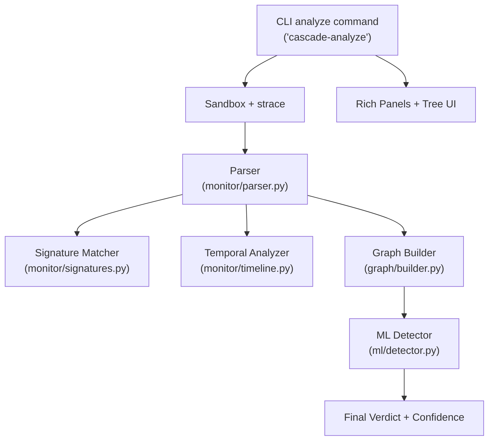
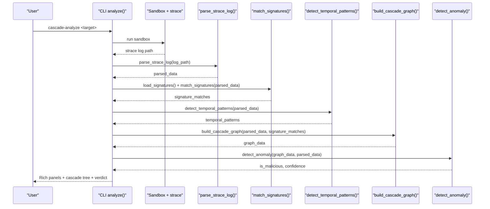
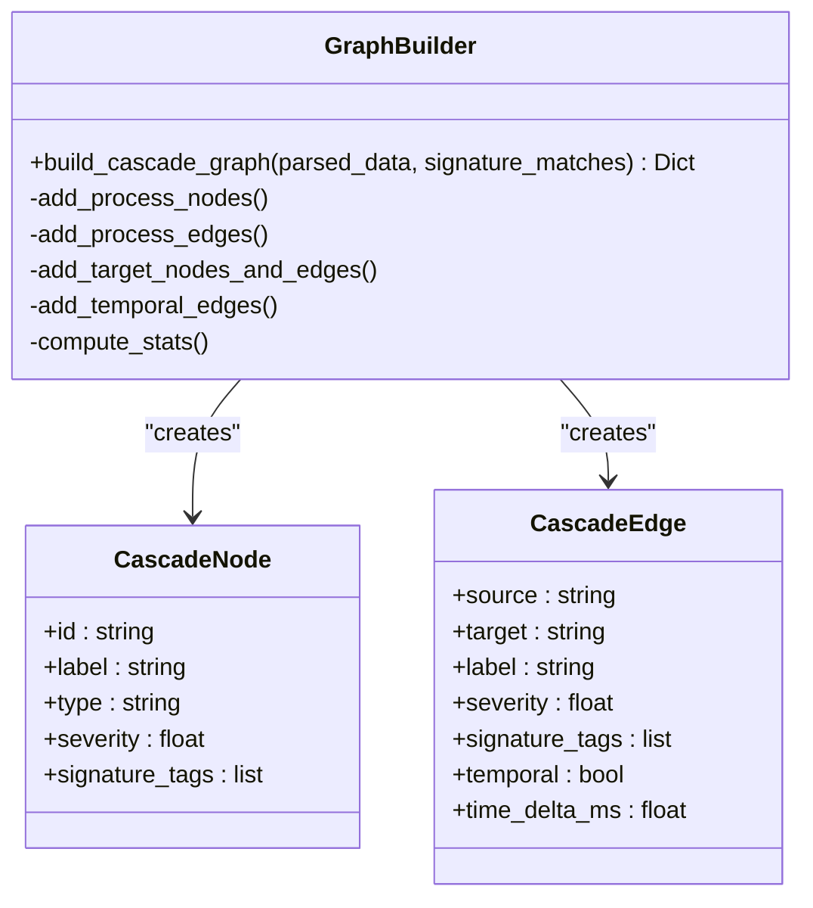
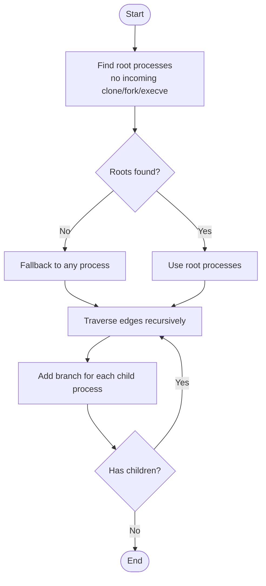
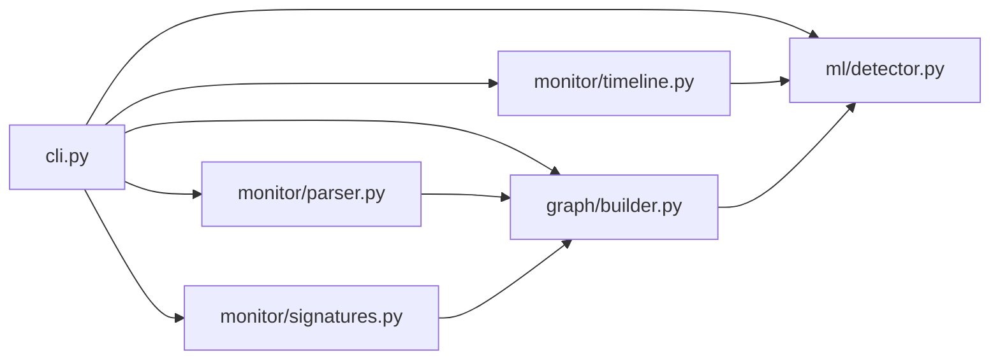

# Output Interpreter

<cite>
**Referenced Files in This Document**
- [cli.py](file://TraceTree/cli.py)
- [parser.py](file://TraceTree/monitor/parser.py)
- [signatures.py](file://TraceTree/monitor/signatures.py)
- [timeline.py](file://TraceTree/monitor/timeline.py)
- [builder.py](file://TraceTree/graph/builder.py)
- [detector.py](file://TraceTree/ml/detector.py)
- [signatures.json](file://TraceTree/data/signatures.json)
- [README.md](file://TraceTree/README.md)
- [spider.py](file://TraceTree/mascot/spider.py)
</cite>

## Table of Contents
1. [Introduction](#introduction)
2. [Project Structure](#project-structure)
3. [Core Components](#core-components)
4. [Architecture Overview](#architecture-overview)
5. [Detailed Component Analysis](#detailed-component-analysis)
6. [Dependency Analysis](#dependency-analysis)
7. [Performance Considerations](#performance-considerations)
8. [Troubleshooting Guide](#troubleshooting-guide)
9. [Conclusion](#conclusion)
10. [Appendices](#appendices)

## Introduction
This document explains how to interpret the cascade-analyze command outputs produced by the TraceTree runtime behavioral analysis system. It covers:
- Cascade graph visualization: node types (process, network, file), edge labels, and color coding
- Flagged behaviors from raw parser output
- Behavioral signatures with severity levels and evidence collection
- Temporal execution patterns with pattern descriptions
- Final verdict generation with confidence scores
- Rich console formatting, panel layouts, and visual indicators
- Example output scenarios: clean results, suspicious behavior detections, and malicious verdicts
- Cascade tree construction algorithm and process lineage representation
- Output customization options and alternative output formats

## Project Structure
The cascade-analyze pipeline integrates sandboxing, syscall tracing, parsing, signature matching, temporal analysis, graph construction, and anomaly detection. The CLI orchestrates the end-to-end workflow and renders the final output.

**Diagram sources**
- [cli.py:261-371](file://TraceTree/cli.py#L261-L371)
- [parser.py:340-679](file://TraceTree/monitor/parser.py#L340-L679)
- [signatures.py:86-115](file://TraceTree/monitor/signatures.py#L86-L115)
- [timeline.py:298-331](file://TraceTree/monitor/timeline.py#L298-L331)
- [builder.py:8-195](file://TraceTree/graph/builder.py#L8-L195)
- [detector.py:235-299](file://TraceTree/ml/detector.py#L235-L299)

**Section sources**
- [README.md:9-41](file://TraceTree/README.md#L9-L41)
- [cli.py:261-371](file://TraceTree/cli.py#L261-L371)

## Core Components
- CLI orchestration and Rich UI rendering
- Parser: syscall extraction, severity scoring, and destination classification
- Signature matcher: behavioral patterns with evidence
- Temporal analyzer: time-windowed patterns
- Graph builder: process, file, and network nodes with edges
- ML detector: anomaly detection with severity boosting

**Section sources**
- [cli.py:181-259](file://TraceTree/cli.py#L181-L259)
- [parser.py:340-679](file://TraceTree/monitor/parser.py#L340-L679)
- [signatures.py:86-115](file://TraceTree/monitor/signatures.py#L86-L115)
- [timeline.py:298-331](file://TraceTree/monitor/timeline.py#L298-L331)
- [builder.py:8-195](file://TraceTree/graph/builder.py#L8-L195)
- [detector.py:235-299](file://TraceTree/ml/detector.py#L235-L299)

## Architecture Overview
The cascade-analyze pipeline transforms a target into a syscall trace, parses it into structured events, detects behavioral signatures and temporal patterns, constructs a cascade graph, and applies ML anomaly detection to produce a final verdict with confidence.

**Diagram sources**
- [cli.py:181-259](file://TraceTree/cli.py#L181-L259)
- [parser.py:340-679](file://TraceTree/monitor/parser.py#L340-L679)
- [signatures.py:86-115](file://TraceTree/monitor/signatures.py#L86-L115)
- [timeline.py:298-331](file://TraceTree/monitor/timeline.py#L298-L331)
- [builder.py:8-195](file://TraceTree/graph/builder.py#L8-L195)
- [detector.py:235-299](file://TraceTree/ml/detector.py#L235-L299)

## Detailed Component Analysis

### Cascade Graph Visualization
The cascade graph is built from parsed syscall events and rendered as a Rich Tree and a Cytoscape-style JSON. Nodes represent processes, files, and network destinations; edges represent syscall relationships and temporal adjacency.

- Node types and attributes:
  - Process nodes: label is the command name; type is "process"
  - File nodes: label is the path; type is "file"; severity reflects sensitivity
  - Network nodes: label is the destination; type is "network"; severity from destination classification
  - Other syscall nodes: type equals the syscall name (e.g., "execve", "connect", "mprotect")

- Edge labels and semantics:
  - clone: parent-to-child process lineage
  - connect, openat, sendto, socket, execve, dup2, mmap, mprotect, chmod, unlink, unlinkat, read, write, getaddrinfo, getuid, geteuid, getcwd, pipe, pipe2, fork, vfork: edges from process to target node
  - temporal: edges between consecutive same-PID events within a 5-second window

- Color coding and styling in the Rich Tree:
  - Process nodes: magenta label with edge label in dim
  - Network nodes: red label with red dim edge label
  - File nodes: white label with dim white edge label
  - Root process nodes are marked "(root)"

- Graph statistics included:
  - Node count, edge count, network connection count, file read count, execve count, total severity, max severity, suspicious network count, sensitive file count, signature match count, temporal edge count

**Diagram sources**
- [builder.py:8-195](file://TraceTree/graph/builder.py#L8-L195)

**Section sources**
- [builder.py:8-195](file://TraceTree/graph/builder.py#L8-L195)
- [cli.py:125-179](file://TraceTree/cli.py#L125-L179)

### Raw Parser Output and Flagged Behaviors
The parser extracts syscall events, assigns severity, classifies destinations, and flags suspicious activities. Flagged behaviors are presented as bullet lists in a Rich Panel.

- Severity weights and flags:
  - Unexpected binary execve increases severity and flags
  - Sensitive file access (e.g., /etc/shadow, .ssh/, .aws/) flags
  - Executable memory mapping with PROT_EXEC flags
  - Raw socket creation or sendto flags
  - dup2 after connect flags reverse shell pattern
  - Credential theft chain detection across clone/execve/openat

- Network destination classification:
  - safe_registry: known package registry CDNs
  - known_benign: standard web ports to unknown hosts
  - suspicious: cloud metadata, private IPs, suspicious ports
  - unknown: default risk

- Flagged behaviors panel:
  - Displays a list of suspicious footprints
  - If none, shows a green message indicating no suspicious footprints

**Section sources**
- [parser.py:11-45](file://TraceTree/monitor/parser.py#L11-L45)
- [parser.py:250-316](file://TraceTree/monitor/parser.py#L250-L316)
- [parser.py:477-596](file://TraceTree/monitor/parser.py#L477-L596)
- [parser.py:654-669](file://TraceTree/monitor/parser.py#L654-L669)
- [cli.py:317-320](file://TraceTree/cli.py#L317-L320)

### Behavioral Signatures Matching
Behavioral signatures are defined in a JSON file and matched against parsed events. Each match includes evidence and severity.

- Signature definitions:
  - reverse_shell: connect → dup2 → execve /bin/sh
  - container_escape: openat of host-level paths or sockets
  - credential_theft: sensitive file read → external connect within 5s
  - typosquat_exfil: secret read → connect to paste/file share host
  - process_injection: mprotect PROT_EXEC → non-standard execve
  - crypto_miner: clone → clone → connect to mining pool port
  - dns_tunneling: getaddrinfo + sendto + socket on port 53/5353
  - persistence_cron: crontab path openat → write

- Matching logic:
  - Unordered: required syscalls present + file/network patterns satisfied
  - Ordered: sequence of (syscall, condition) must appear in order
  - Evidence: human-readable descriptions of triggering events
  - Severity: 1–10 scale; higher indicates stronger maliciousness

- Presentation:
  - Severity icons: red for ≥8, yellow for ≥5, green otherwise
  - Summary includes pattern name, severity, description, and evidence snippets

**Section sources**
- [signatures.json:1-246](file://TraceTree/data/signatures.json#L1-L246)
- [signatures.py:86-115](file://TraceTree/monitor/signatures.py#L86-L115)
- [signatures.py:196-236](file://TraceTree/monitor/signatures.py#L196-L236)
- [cli.py:322-339](file://TraceTree/cli.py#L322-L339)

### Temporal Execution Patterns
Temporal patterns detect suspicious time-based sequences from timestamped events.

- Patterns and windows:
  - connect_then_shell: external connect → execve /bin/sh within 3s
  - credential_scan_then_exfil: sensitive file read → external connect within 5s
  - delayed_payload: >10s gap followed by burst of suspicious activity
  - rapid_file_enumeration: 10+ file opens within 1s
  - burst_process_spawn: 5+ clone/execve within 2s

- Presentation:
  - Severity icons and time window formatting
  - Human-readable summaries with pattern names and descriptions

**Section sources**
- [timeline.py:298-331](file://TraceTree/monitor/timeline.py#L298-L331)
- [timeline.py:100-281](file://TraceTree/monitor/timeline.py#L100-L281)
- [cli.py:341-349](file://TraceTree/cli.py#L341-L349)

### Final Verdict Generation and Confidence Scores
The final verdict combines ML anomaly detection with severity scoring and temporal pattern boosts.

- ML model:
  - RandomForestClassifier if available; otherwise IsolationForest baseline
  - Features: node count, edge count, network connections, file reads, execve count, total severity, suspicious networks, sensitive files, max severity, temporal pattern count

- Severity boosting:
  - Critical threshold: total severity ≥ 30 → always malicious
  - High threshold: +30% confidence; may flip clean to malicious
  - Medium threshold: +10% confidence
  - Each temporal pattern: +15% confidence; multiple patterns may flip verdict
  - Each sensitive file/suspicious network: +5% confidence
  - Confidence capped at 99.9%

- Presentation:
  - Large centered panel: "CLEAN" or "MALICIOUS"
  - Confidence percentage in styled text
  - Summary line listing matched signatures and temporal patterns

**Section sources**
- [detector.py:235-299](file://TraceTree/ml/detector.py#L235-L299)
- [detector.py:170-232](file://TraceTree/ml/detector.py#L170-L232)
- [cli.py:351-370](file://TraceTree/cli.py#L351-L370)

### Rich Console Formatting, Panels, and Visual Indicators
The CLI uses Rich to render a polished, readable output with consistent styling and layout.

- Panels:
  - Cascade Graph panel with title and border
  - Flagged Behaviors panel with dynamic border color
  - Behavioral Signatures panel with yellow border
  - Temporal Patterns panel with cyan border
  - Final Verdict panel with colored border matching verdict

- Tree UI:
  - Recursive build of Rich Tree from graph JSON
  - Color-coded branches for process, network, file nodes
  - Root markers "(root)" for top-level processes

- Text styling:
  - Verdict text bold white on red/green backgrounds
  - Severity icons (🔴, 🟡, 🟢) for signatures and patterns
  - Dim styles for edge labels and secondary info

- Additional UI elements:
  - Welcome banner with gradient text
  - Progress bars with spinner and task descriptions
  - Spider mascot panel for watch/check modes

**Section sources**
- [cli.py:27-66](file://TraceTree/cli.py#L27-L66)
- [cli.py:125-179](file://TraceTree/cli.py#L125-L179)
- [cli.py:317-370](file://TraceTree/cli.py#L317-L370)
- [spider.py:4-59](file://TraceTree/mascot/spider.py#L4-L59)

### Example Output Scenarios
Below are representative scenarios interpreted from the code’s output rendering logic.

- Clean result:
  - Cascade Graph panel shows process lineage and benign network/file nodes
  - Flagged Behaviors panel reports no suspicious footprints
  - Behavioral Signatures panel absent or empty
  - Temporal Patterns panel absent or empty
  - Final Verdict panel shows "CLEAN" with moderate confidence
  - Summary line indicates no signatures or temporal patterns

- Suspicious behavior detections:
  - Flagged Behaviors panel lists suspicious footprints (e.g., unexpected binary execve, sensitive file access)
  - Behavioral Signatures panel lists matched patterns with severity icons and evidence snippets
  - Temporal Patterns panel lists detected time-based patterns with severity icons and time windows
  - Final Verdict panel shows "CLEAN" with elevated confidence due to severity boosting

- Malicious verdict:
  - Behavioral Signatures panel highlights high-severity patterns (e.g., reverse_shell, credential_theft)
  - Temporal Patterns panel highlights critical patterns (e.g., connect_then_shell)
  - Final Verdict panel shows "MALICIOUS" with high confidence
  - Summary line enumerates matched signatures and temporal patterns

**Section sources**
- [cli.py:317-370](file://TraceTree/cli.py#L317-L370)
- [README.md:125-174](file://TraceTree/README.md#L125-L174)

### Cascade Tree Construction Algorithm
The cascade tree is a hierarchical representation of process lineage derived from the parsed data.

- Root selection:
  - Roots are processes with no incoming clone/fork/execve edges
  - If none found, fallback to any process node

- Tree building:
  - Recursively traverse edges from each root
  - For each process node, add children whose parent ID matches the current node ID
  - Color-code branches by node type (process, network, file)
  - Mark root processes with "(root)"

- Rendering:
  - Rich Tree with styled labels and dimmed edge labels
  - Nested indentation reflects process hierarchy

**Diagram sources**
- [cli.py:154-179](file://TraceTree/cli.py#L154-L179)
- [cli.py:125-152](file://TraceTree/cli.py#L125-L152)

**Section sources**
- [cli.py:125-179](file://TraceTree/cli.py#L125-L179)

### Output Customization and Alternative Formats
- Output format for MCP subcommand:
  - console (default): Rich panels and tables
  - json: JSON serialization of the MCP report

- Other CLI options:
  - cascade-watch supports JSON output for on-demand checks
  - cascade-analyze supports bulk analysis via bulk files

**Section sources**
- [cli.py:442-443](file://TraceTree/cli.py#L442-L443)
- [cli.py:680-684](file://TraceTree/cli.py#L680-L684)

## Dependency Analysis
The cascade-analyze pipeline depends on a tight integration among modules. The CLI orchestrates the flow, while parser, signatures, timeline, graph builder, and detector form the analysis backbone.

**Diagram sources**
- [cli.py:181-259](file://TraceTree/cli.py#L181-L259)
- [parser.py:340-679](file://TraceTree/monitor/parser.py#L340-L679)
- [signatures.py:86-115](file://TraceTree/monitor/signatures.py#L86-L115)
- [timeline.py:298-331](file://TraceTree/monitor/timeline.py#L298-L331)
- [builder.py:8-195](file://TraceTree/graph/builder.py#L8-L195)
- [detector.py:235-299](file://TraceTree/ml/detector.py#L235-L299)

**Section sources**
- [cli.py:181-259](file://TraceTree/cli.py#L181-L259)

## Performance Considerations
- Graph construction scales with event count and signature coverage; temporal edges add O(n) edges within time windows
- ML inference cost is low due to fixed-size feature vectors
- Signature matching and temporal analysis are linear in event count
- Consider disabling temporal analysis for very large traces if performance is constrained

## Troubleshooting Guide
- Docker preflight failures:
  - Missing Docker SDK or unreachable Docker daemon triggers a detailed error panel with OS-specific installation guidance
- Sandbox failures:
  - If sandbox returns no log, the pipeline aborts early with a red progress message
- Parser failures:
  - Exceptions during parsing are caught and reported; pipeline continues with partial results
- Signature and temporal analysis failures:
  - Best-effort execution with fallbacks; warnings are printed and analysis proceeds

**Section sources**
- [cli.py:73-109](file://TraceTree/cli.py#L73-L109)
- [cli.py:200-216](file://TraceTree/cli.py#L200-L216)
- [cli.py:225-235](file://TraceTree/cli.py#L225-L235)

## Conclusion
The cascade-analyze output presents a comprehensive, interpretable view of runtime behavior. The cascade graph reveals process lineage and system call relationships, while flagged behaviors, signatures, and temporal patterns provide contextual evidence. The final verdict combines ML insights with severity-weighted heuristics and confidence boosting, enabling clear decisions with quantified certainty.

## Appendices

### Appendix A: Node Types and Edge Labels
- Node types:
  - process: command name
  - file: file path
  - network: destination (IP:port)
  - syscall nodes: syscall name (e.g., execve, connect, mprotect)
- Edge labels:
  - clone, connect, openat, sendto, socket, execve, dup2, mmap, mprotect, chmod, unlink, unlinkat, read, write, getaddrinfo, getuid, geteuid, getcwd, pipe, pipe2, fork, vfork
  - temporal: intra-process adjacency within 5s

**Section sources**
- [builder.py:50-110](file://TraceTree/graph/builder.py#L50-L110)
- [builder.py:111-140](file://TraceTree/graph/builder.py#L111-L140)

### Appendix B: Severity Levels and Evidence Collection
- Severity levels:
  - 1–10 scale; higher indicates stronger maliciousness
- Evidence collection:
  - Signatures: list of human-readable event descriptions
  - Temporal patterns: list of triggering events and time windows

**Section sources**
- [signatures.py:474-487](file://TraceTree/monitor/signatures.py#L474-L487)
- [timeline.py:334-352](file://TraceTree/monitor/timeline.py#L334-L352)

### Appendix C: Network Destination Categories and Risk Scores
- Categories:
  - safe_registry: 0.0
  - known_benign: 0.5
  - suspicious: 8.0–9.0
  - unknown: 3.0

**Section sources**
- [parser.py:250-316](file://TraceTree/monitor/parser.py#L250-L316)