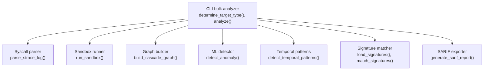
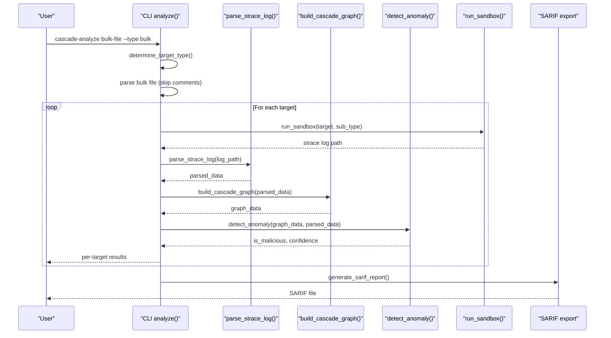
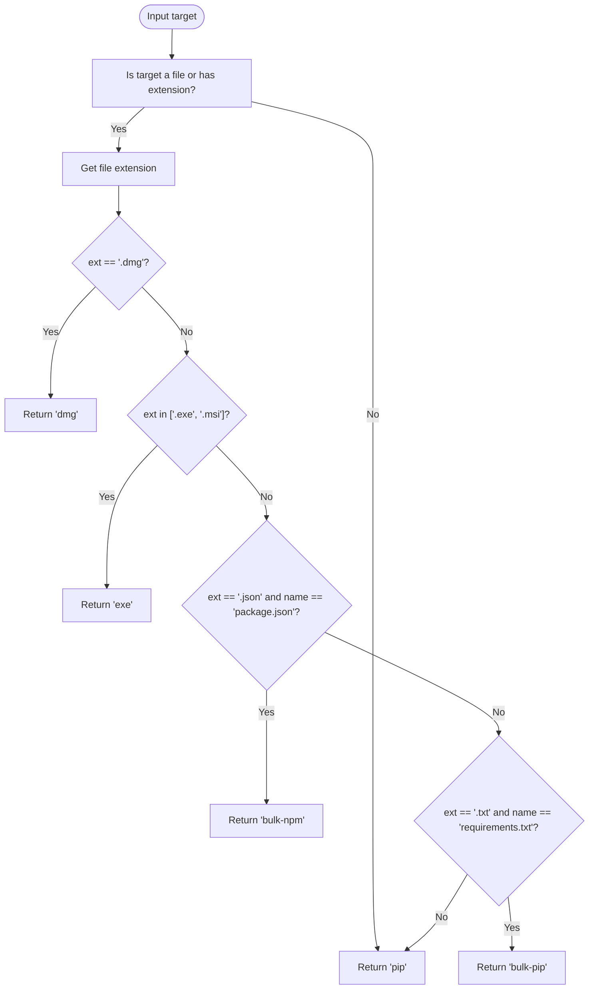
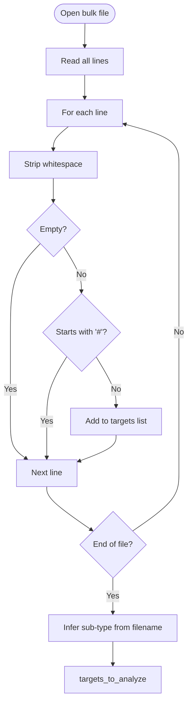
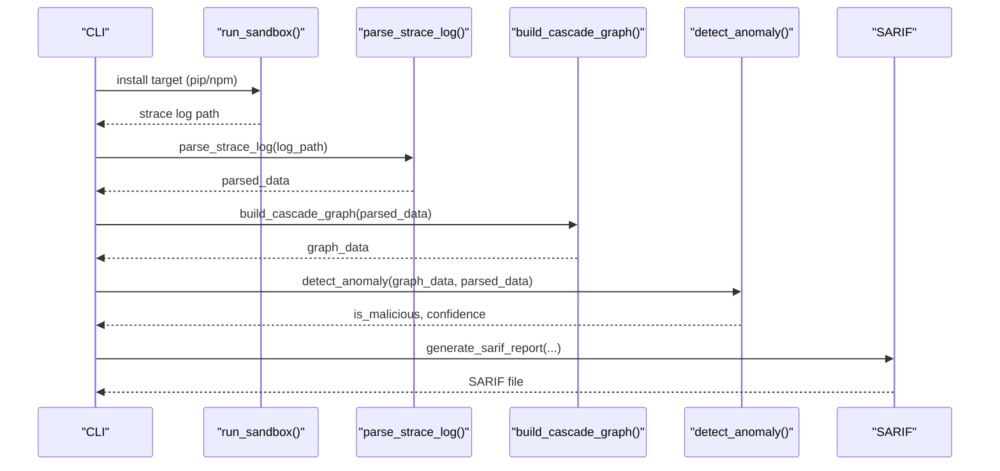
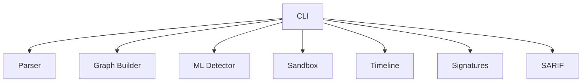

# Bulk Analysis Mode

<cite>
**Referenced Files in This Document**
- [cli.py](file://TraceTree/cli.py)
- [parser.py](file://TraceTree/monitor/parser.py)
- [builder.py](file://TraceTree/graph/builder.py)
- [detector.py](file://TraceTree/ml/detector.py)
- [sandbox.py](file://TraceTree/sandbox/sandbox.py)
- [timeline.py](file://TraceTree/monitor/timeline.py)
- [signatures.py](file://TraceTree/monitor/signatures.py)
- [sarif.py](file://TraceTree/monitor/sarif.py)
</cite>

## Table of Contents
1. [Introduction](#introduction)
2. [Project Structure](#project-structure)
3. [Core Components](#core-components)
4. [Architecture Overview](#architecture-overview)
5. [Detailed Component Analysis](#detailed-component-analysis)
6. [Dependency Analysis](#dependency-analysis)
7. [Performance Considerations](#performance-considerations)
8. [Troubleshooting Guide](#troubleshooting-guide)
9. [Conclusion](#conclusion)

## Introduction
This document explains bulk analysis mode for processing large dependency lists in both pip and npm ecosystems. It covers automatic target type detection for bulk-pip and bulk-npm, file parsing mechanisms for requirements.txt and package.json, the line-by-line processing pipeline, comment handling, error tolerance for invalid entries, target type inference based on filename patterns, practical examples for large-scale processing, mixed-content handling, timeouts for bulk operations, progress reporting, error aggregation, and individual target result reporting. It also addresses performance considerations, memory management, and concurrency strategies.

## Project Structure
Bulk analysis mode is implemented primarily in the CLI module, with supporting components for parsing, graph construction, ML detection, sandbox execution, and temporal pattern detection. The key files are:
- CLI bulk processing and target type detection
- Parser for strace logs
- Graph builder for behavioral graphs
- ML detector for anomaly scoring
- Sandbox runner for pip/npm installations
- Temporal pattern detection
- Signature matching
- SARIF report generation

**Diagram sources**
- [cli.py:111-123](file://TraceTree/cli.py#L111-L123)
- [cli.py:261-371](file://TraceTree/cli.py#L261-L371)
- [parser.py:340-680](file://TraceTree/monitor/parser.py#L340-L680)
- [sandbox.py:175-335](file://TraceTree/sandbox/sandbox.py#L175-L335)
- [builder.py:8-196](file://TraceTree/graph/builder.py#L8-L196)
- [detector.py:235-300](file://TraceTree/ml/detector.py#L235-L300)
- [timeline.py:298-332](file://TraceTree/monitor/timeline.py#L298-L332)
- [signatures.py:57-116](file://TraceTree/monitor/signatures.py#L57-L116)
- [sarif.py:196-227](file://TraceTree/monitor/sarif.py#L196-L227)

**Section sources**
- [cli.py:111-123](file://TraceTree/cli.py#L111-L123)
- [cli.py:261-371](file://TraceTree/cli.py#L261-L371)

## Core Components
- Target type detection: Automatic identification of bulk-pip and bulk-npm based on file extensions and filenames.
- Bulk file parsing: Line-by-line processing of requirements.txt and package.json, with comment handling and error tolerance.
- Pipeline orchestration: Progress reporting, sandbox execution, parsing, graph construction, ML detection, and result rendering.
- Error handling: Best-effort processing with graceful degradation and warnings for invalid entries.
- Reporting: Per-target results, SARIF export, and console summaries.

**Section sources**
- [cli.py:111-123](file://TraceTree/cli.py#L111-L123)
- [cli.py:278-371](file://TraceTree/cli.py#L278-L371)
- [parser.py:340-680](file://TraceTree/monitor/parser.py#L340-L680)
- [builder.py:8-196](file://TraceTree/graph/builder.py#L8-L196)
- [detector.py:235-300](file://TraceTree/ml/detector.py#L235-L300)
- [timeline.py:298-332](file://TraceTree/monitor/timeline.py#L298-L332)
- [signatures.py:57-116](file://TraceTree/monitor/signatures.py#L57-L116)
- [sarif.py:196-227](file://TraceTree/monitor/sarif.py#L196-L227)

## Architecture Overview
Bulk analysis mode follows a deterministic pipeline:
- Determine target type from the input (bulk-pip, bulk-npm, or explicit pip/npm).
- Parse bulk file into a list of targets, skipping comments and empty lines.
- For each target, run sandbox, parse strace, build graph, detect anomalies, and render results.
- Aggregate per-target results and optionally export SARIF.

**Diagram sources**
- [cli.py:261-371](file://TraceTree/cli.py#L261-L371)
- [parser.py:340-680](file://TraceTree/monitor/parser.py#L340-L680)
- [builder.py:8-196](file://TraceTree/graph/builder.py#L8-L196)
- [detector.py:235-300](file://TraceTree/ml/detector.py#L235-L300)
- [sandbox.py:175-335](file://TraceTree/sandbox/sandbox.py#L175-L335)
- [sarif.py:196-227](file://TraceTree/monitor/sarif.py#L196-L227)

## Detailed Component Analysis

### Automatic Target Type Detection
The function determines whether the input is a bulk-pip, bulk-npm, or single pip/npm target:
- bulk-pip: file with .txt extension and name requirements.txt
- bulk-npm: file with .json extension and name package.json
- pip: default fallback for single pip targets
- exe/dmg: additional target types handled elsewhere

**Diagram sources**
- [cli.py:111-123](file://TraceTree/cli.py#L111-L123)

**Section sources**
- [cli.py:111-123](file://TraceTree/cli.py#L111-L123)

### Bulk File Parsing Mechanisms
Bulk processing reads a file line-by-line and:
- Strips whitespace
- Skips empty lines
- Skips lines starting with comment markers
- Infers sub-type for bulk items based on filename presence of package.json (npm) or otherwise pip

**Diagram sources**
- [cli.py:323-341](file://TraceTree/cli.py#L323-L341)

**Section sources**
- [cli.py:323-341](file://TraceTree/cli.py#L323-L341)

### Line-by-Line Processing Pipeline
For each target, the pipeline executes:
- Sandbox: Install or trace the package in a controlled environment
- Parse: Reassemble multi-line strace entries and extract events
- Graph: Build a directed graph of processes, network, and files
- ML: Compute anomaly score and confidence
- Report: Render results and optionally export SARIF

**Diagram sources**
- [cli.py:297-371](file://TraceTree/cli.py#L297-L371)
- [sandbox.py:175-335](file://TraceTree/sandbox/sandbox.py#L175-L335)
- [parser.py:340-680](file://TraceTree/monitor/parser.py#L340-L680)
- [builder.py:8-196](file://TraceTree/graph/builder.py#L8-L196)
- [detector.py:235-300](file://TraceTree/ml/detector.py#L235-L300)
- [sarif.py:196-227](file://TraceTree/monitor/sarif.py#L196-L227)

**Section sources**
- [cli.py:297-371](file://TraceTree/cli.py#L297-L371)
- [sandbox.py:175-335](file://TraceTree/sandbox/sandbox.py#L175-L335)
- [parser.py:340-680](file://TraceTree/monitor/parser.py#L340-L680)
- [builder.py:8-196](file://TraceTree/graph/builder.py#L8-L196)
- [detector.py:235-300](file://TraceTree/ml/detector.py#L235-L300)
- [sarif.py:196-227](file://TraceTree/monitor/sarif.py#L196-L227)

### Comment Handling and Error Tolerance
- Comments: Lines starting with # are ignored during bulk parsing.
- Invalid entries: The pipeline continues processing subsequent lines; failures are logged and do not halt the entire batch.
- Parser robustness: The parser handles malformed or incomplete strace entries gracefully and still produces structured output.

**Section sources**
- [cli.py:323-341](file://TraceTree/cli.py#L323-L341)
- [parser.py:169-224](file://TraceTree/monitor/parser.py#L169-L224)

### Target Type Inference Based on Filename Patterns
- If the bulk file contains package.json, sub-type is inferred as npm.
- Otherwise, sub-type is pip.
- This inference ensures correct sandboxing and parsing logic for each ecosystem.

**Section sources**
- [cli.py:331-333](file://TraceTree/cli.py#L331-L333)

### Practical Examples

#### Large Dependency Lists
- Use bulk-pip with requirements.txt to process hundreds of pip packages.
- Use bulk-npm with package.json to process npm dependency sets.
- The CLI iterates targets sequentially, reporting progress per target.

#### Mixed Content Files
- The bulk parser ignores comments and empty lines, allowing mixed content files to be processed reliably.
- Invalid entries are tolerated; the system proceeds to analyze remaining valid targets.

#### Managing Analysis Timeouts
- Sandbox execution enforces timeouts:
  - pip: default 60s
  - dmg: default 120s
  - exe: default 180s
- Exceeded timeouts trigger a timeout error and continue with subsequent targets.

**Section sources**
- [cli.py:323-341](file://TraceTree/cli.py#L323-L341)
- [sandbox.py:259-269](file://TraceTree/sandbox/sandbox.py#L259-L269)

### Progress Reporting, Error Aggregation, and Individual Target Results
- Progress: Rich progress bars show each stage (sandbox, parse, graph, detect).
- Error aggregation: Exceptions are caught and logged; the system continues with remaining targets.
- Individual results: For each target, the CLI prints a cascade tree, flagged behaviors, matched signatures, temporal patterns, and a final verdict with confidence.

**Section sources**
- [cli.py:297-371](file://TraceTree/cli.py#L297-L371)
- [cli.py:460-481](file://TraceTree/cli.py#L460-L481)

## Dependency Analysis
Bulk analysis mode depends on several modules:
- CLI orchestrates bulk detection, parsing, and reporting.
- Parser reassembles strace logs and extracts events.
- Graph builder constructs a directed graph from parsed events.
- ML detector computes anomaly scores and confidence.
- Sandbox runner executes installs in containers with strace tracing.
- Temporal pattern detection identifies suspicious time-based sequences.
- Signature matcher applies behavioral rules to detected events.
- SARIF exporter generates standardized reports.

**Diagram sources**
- [cli.py:261-371](file://TraceTree/cli.py#L261-L371)
- [parser.py:340-680](file://TraceTree/monitor/parser.py#L340-L680)
- [builder.py:8-196](file://TraceTree/graph/builder.py#L8-L196)
- [detector.py:235-300](file://TraceTree/ml/detector.py#L235-L300)
- [sandbox.py:175-335](file://TraceTree/sandbox/sandbox.py#L175-L335)
- [timeline.py:298-332](file://TraceTree/monitor/timeline.py#L298-L332)
- [signatures.py:57-116](file://TraceTree/monitor/signatures.py#L57-L116)
- [sarif.py:196-227](file://TraceTree/monitor/sarif.py#L196-L227)

**Section sources**
- [cli.py:261-371](file://TraceTree/cli.py#L261-L371)
- [parser.py:340-680](file://TraceTree/monitor/parser.py#L340-L680)
- [builder.py:8-196](file://TraceTree/graph/builder.py#L8-L196)
- [detector.py:235-300](file://TraceTree/ml/detector.py#L235-L300)
- [sandbox.py:175-335](file://TraceTree/sandbox/sandbox.py#L175-L335)
- [timeline.py:298-332](file://TraceTree/monitor/timeline.py#L298-L332)
- [signatures.py:57-116](file://TraceTree/monitor/signatures.py#L57-L116)
- [sarif.py:196-227](file://TraceTree/monitor/sarif.py#L196-L227)

## Performance Considerations
- Sequential processing: Targets are processed one-by-one, avoiding concurrency overhead.
- Memory management: The parser reads logs line-by-line and reconstructs multi-line entries; it does not load entire logs into memory unnecessarily.
- Timeout controls: Sandbox timeouts prevent runaway processes and ensure timely completion of bulk scans.
- Model caching: The ML detector caches the model in memory to reduce repeated I/O and unpickling costs.
- Best-effort processing: Signature matching and temporal pattern detection are wrapped in try/except blocks to avoid blocking the pipeline.

[No sources needed since this section provides general guidance]

## Troubleshooting Guide
- Bulk file not found: The CLI prints an error and exits early for bulk-pip/bulk-npm modes.
- Sandbox failures: If sandbox execution fails or produces minimal logs, the CLI skips that target and continues.
- Parser errors: The parser is resilient to malformed lines; exceptions are caught and logged.
- Model loading: If the local model is missing or corrupted, the system falls back to a baseline model and attempts to download from GCS.
- SARIF export: Export failures are caught and reported without halting the pipeline.

**Section sources**
- [cli.py:282-285](file://TraceTree/cli.py#L282-L285)
- [cli.py:204-216](file://TraceTree/cli.py#L204-L216)
- [cli.py:478-480](file://TraceTree/cli.py#L478-L480)
- [detector.py:108-147](file://TraceTree/ml/detector.py#L108-L147)
- [sandbox.py:322-335](file://TraceTree/sandbox/sandbox.py#L322-L335)

## Conclusion
Bulk analysis mode provides a robust, scalable way to analyze large dependency lists for both pip and npm ecosystems. Automatic target type detection, tolerant file parsing, and a resilient pipeline ensure reliable processing even with mixed content and invalid entries. With progress reporting, per-target results, and optional SARIF export, operators can efficiently triage and investigate suspicious packages at scale.