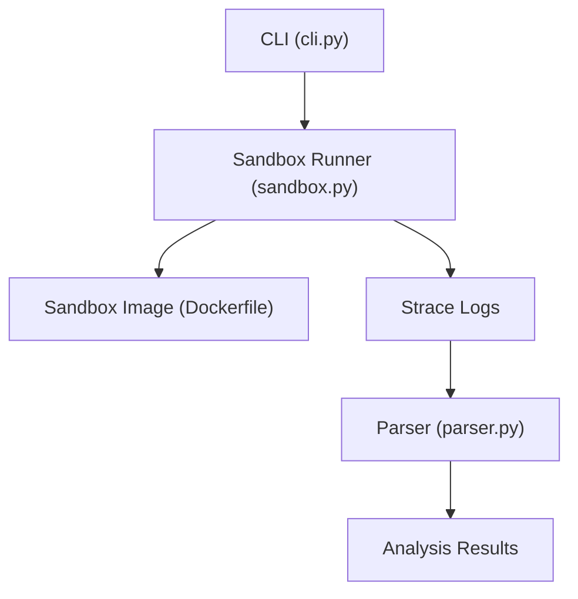
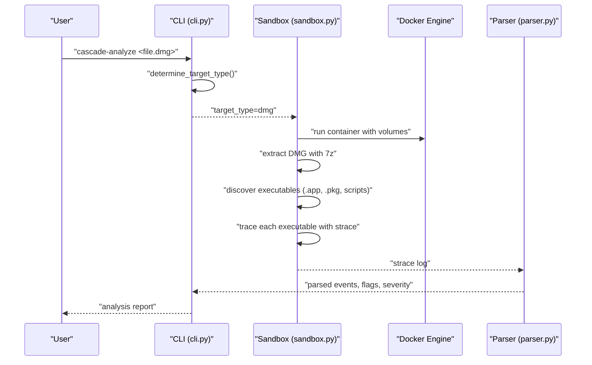
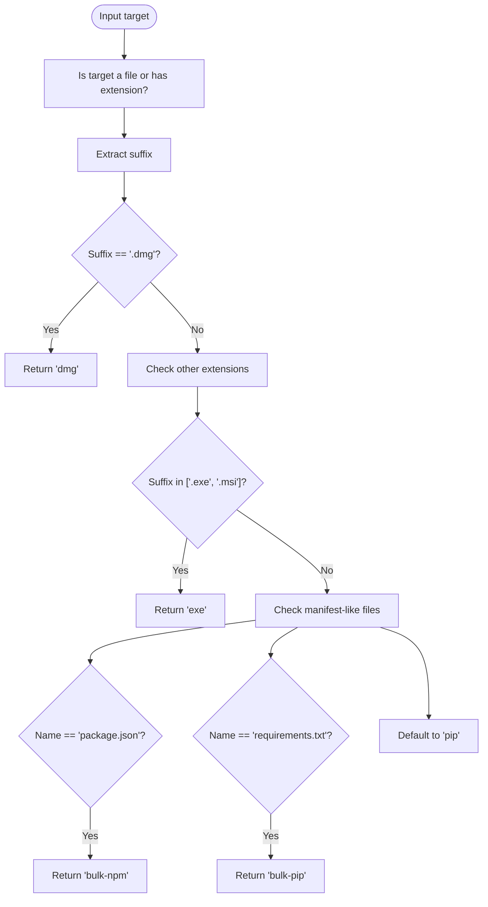
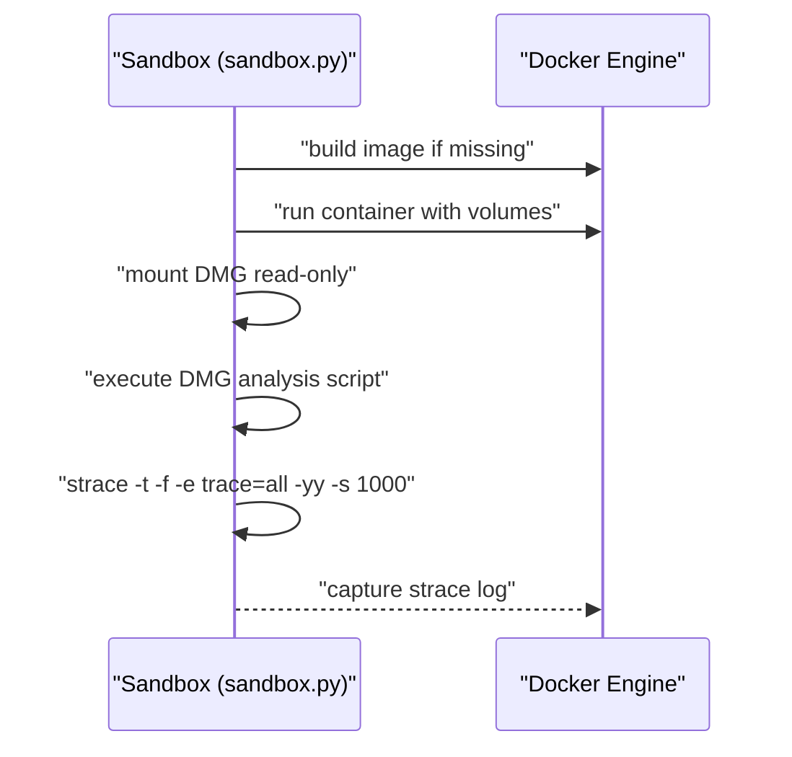
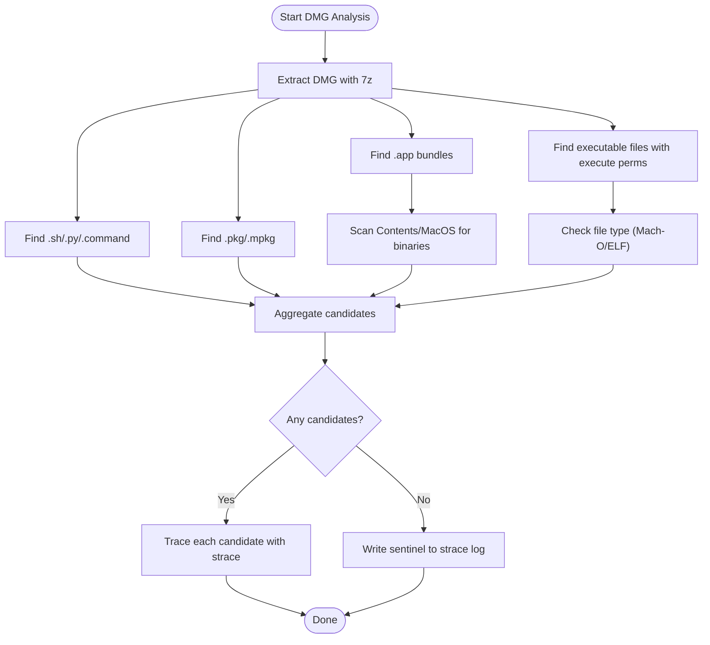
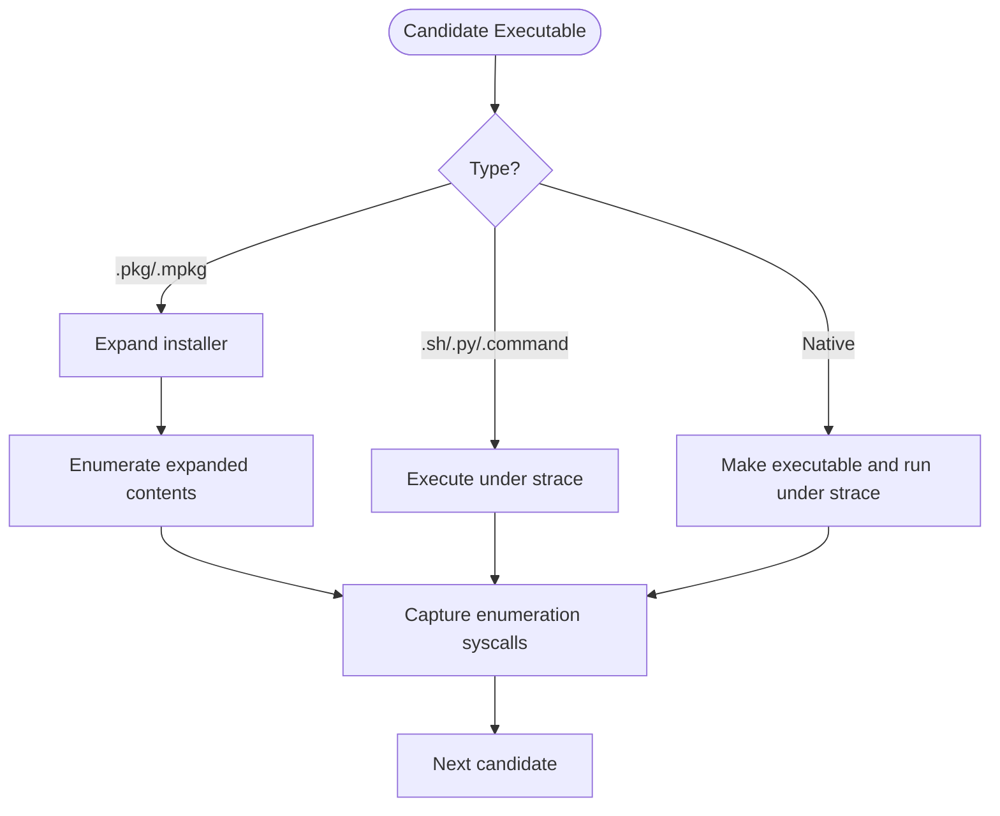
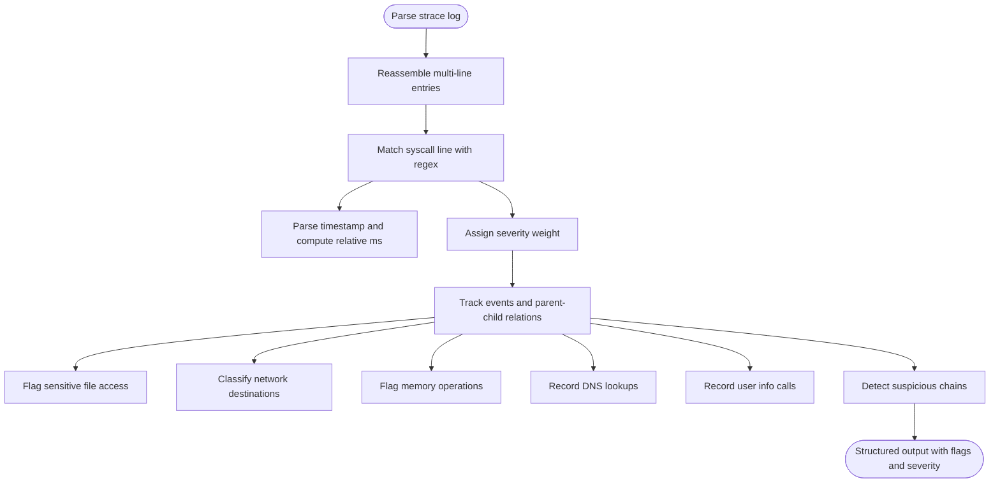
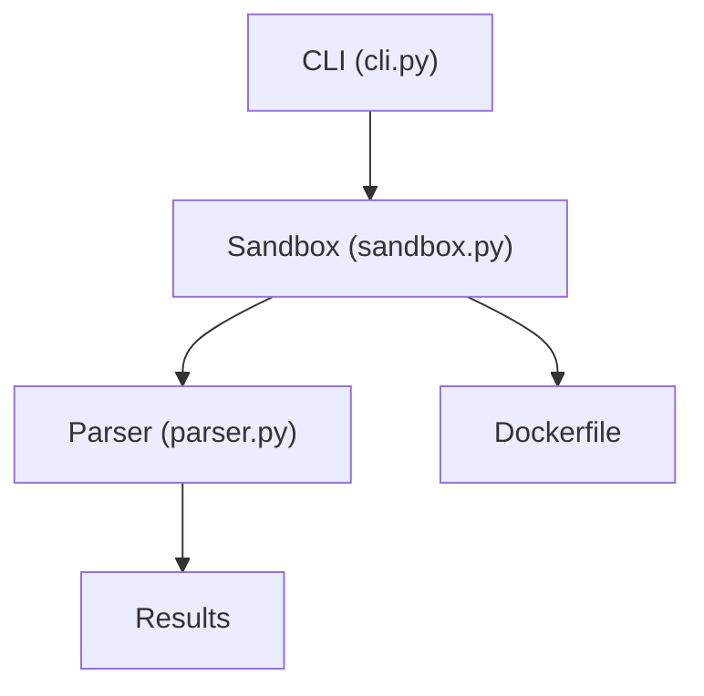

# DMG File Analysis

<cite>
**Referenced Files in This Document**
- [cli.py](file://TraceTree/cli.py)
- [sandbox.py](file://TraceTree/sandbox/sandbox.py)
- [parser.py](file://TraceTree/monitor/parser.py)
- [Dockerfile](file://TraceTree/sandbox/Dockerfile)
- [README.md](file://README.md)
</cite>

## Table of Contents
1. [Introduction](#introduction)
2. [Project Structure](#project-structure)
3. [Core Components](#core-components)
4. [Architecture Overview](#architecture-overview)
5. [Detailed Component Analysis](#detailed-component-analysis)
6. [Dependency Analysis](#dependency-analysis)
7. [Performance Considerations](#performance-considerations)
8. [Troubleshooting Guide](#troubleshooting-guide)
9. [Conclusion](#conclusion)
10. [Appendices](#appendices)

## Introduction
This document explains how DMG file analysis is implemented in the project, focusing on automatic detection of .dmg targets, specialized sandbox execution parameters for macOS disk images, the DMG extraction and mount-point management process, and binary analysis within the mounted filesystem. It also covers strace log parsing differences for DMG analysis, highlighting macOS-specific syscalls and how they are interpreted. Practical examples demonstrate analyzing macOS applications, system utilities, and third-party software distributed as DMG files. Finally, it documents limitations and cross-platform considerations for DMG analysis, including Windows and Linux compatibility constraints, and outlines security considerations for analyzing potentially malicious DMG files with proper sandbox isolation.

## Project Structure
The DMG analysis pipeline integrates several modules:
- CLI determines the target type and orchestrates analysis.
- Sandbox builds and runs a Docker container with strace and extraction tools.
- Parser interprets strace logs and flags suspicious behavior.
- Dockerfile defines the sandbox image with strace, p7zip-full, and other tools.

**Diagram sources**
- [cli.py:110-124](file://TraceTree/cli.py#L110-L124)
- [sandbox.py:175-335](file://TraceTree/sandbox/sandbox.py#L175-L335)
- [parser.py:340-680](file://TraceTree/monitor/parser.py#L340-L680)
- [Dockerfile:1-11](file://TraceTree/sandbox/Dockerfile#L1-L11)

**Section sources**
- [cli.py:110-124](file://TraceTree/cli.py#L110-L124)
- [sandbox.py:175-335](file://TraceTree/sandbox/sandbox.py#L175-L335)
- [parser.py:340-680](file://TraceTree/monitor/parser.py#L340-L680)
- [Dockerfile:1-11](file://TraceTree/sandbox/Dockerfile#L1-L11)

## Core Components
- Automatic target type detection for .dmg files in the CLI.
- Specialized sandbox execution parameters for DMG analysis.
- DMG extraction and filesystem traversal to locate executables.
- Binary analysis within the extracted filesystem using strace.
- Strace log parsing tailored to DMG analysis and macOS-specific syscalls.

**Section sources**
- [cli.py:110-124](file://TraceTree/cli.py#L110-L124)
- [sandbox.py:175-335](file://TraceTree/sandbox/sandbox.py#L175-L335)
- [parser.py:340-680](file://TraceTree/monitor/parser.py#L340-L680)

## Architecture Overview
The DMG analysis architecture follows a deterministic flow: CLI decides target type, sandbox container runs extraction and tracing, and the parser interprets the resulting strace logs.

**Diagram sources**
- [cli.py:110-124](file://TraceTree/cli.py#L110-L124)
- [sandbox.py:175-335](file://TraceTree/sandbox/sandbox.py#L175-L335)
- [parser.py:340-680](file://TraceTree/monitor/parser.py#L340-L680)

## Detailed Component Analysis

### Automatic Detection Logic for .dmg Targets
The CLI determines the target type by inspecting the file extension. For .dmg files, it returns the "dmg" target type, enabling the sandbox to prepare specialized execution parameters.

**Diagram sources**
- [cli.py:110-124](file://TraceTree/cli.py#L110-L124)

**Section sources**
- [cli.py:110-124](file://TraceTree/cli.py#L110-L124)

### Specialized Sandbox Execution Parameters for DMG
The sandbox prepares a Docker container with:
- A dedicated image built from the provided Dockerfile.
- Volume mounting of the DMG file into the container.
- strace tracing with full process tree (-f), timestamps (-t), and maximum argument length (-s 1000).
- Network isolation by disabling the eth0 interface prior to execution.

Key behaviors:
- Mounts the DMG file read-only at /tmp/target.dmg.
- Uses a DMG-specific analysis script that extracts with 7z and discovers executables.
- Applies a 120-second timeout for DMG analysis.

**Diagram sources**
- [sandbox.py:175-335](file://TraceTree/sandbox/sandbox.py#L175-L335)
- [Dockerfile:1-11](file://TraceTree/sandbox/Dockerfile#L1-L11)

**Section sources**
- [sandbox.py:175-335](file://TraceTree/sandbox/sandbox.py#L175-L335)
- [Dockerfile:1-11](file://TraceTree/sandbox/Dockerfile#L1-L11)

### DMG Extraction and Executable Discovery
The DMG analysis script performs:
- Extraction using 7z into /tmp/dmg_extracted.
- Discovery of executables across multiple categories:
  - Scripts: .sh, .py, .command
  - Packages: .pkg, .mpkg
  - macOS bundles: .app directories
  - Bare executables: files with execute permissions and Mach-O/ELF signatures
- If no executables are found, the script writes a sentinel message to the strace log and exits early.

**Diagram sources**
- [sandbox.py:20-112](file://TraceTree/sandbox/sandbox.py#L20-L112)

**Section sources**
- [sandbox.py:20-112](file://TraceTree/sandbox/sandbox.py#L20-L112)

### Binary Analysis Within the Mounted Filesystem
For each discovered executable:
- .pkg/.mpkg installers are expanded and their contents enumerated to capture filesystem activity.
- Scripts (.sh, .py, .command) are executed under strace to capture syscalls.
- Native binaries are made executable and executed under strace to capture syscalls.
- If no syscalls are captured from direct execution, the extraction process itself is traced to ensure meaningful logs.

**Diagram sources**
- [sandbox.py:77-104](file://TraceTree/sandbox/sandbox.py#L77-L104)

**Section sources**
- [sandbox.py:77-104](file://TraceTree/sandbox/sandbox.py#L77-L104)

### Strace Log Parsing Differences for DMG Analysis
The parser handles multi-line strace entries, both [pid] and bare-pid formats, and timestamped logs. For DMG analysis, the parser focuses on:
- Process creation (clone, fork, vfork), execve, and parent-child relationships.
- File access (openat, read, write, unlink, chmod) with sensitivity scoring.
- Network connections (connect, sendto, socket) with destination classification.
- Memory operations (mmap, mprotect) with emphasis on PROT_EXEC.
- DNS resolution (getaddrinfo) and user info (getuid/geteuid/getcwd).
- Reverse shell indicators (dup2 after connect) and credential theft chains.

**Diagram sources**
- [parser.py:169-224](file://TraceTree/monitor/parser.py#L169-L224)
- [parser.py:226-680](file://TraceTree/monitor/parser.py#L226-L680)

**Section sources**
- [parser.py:169-224](file://TraceTree/monitor/parser.py#L169-L224)
- [parser.py:226-680](file://TraceTree/monitor/parser.py#L226-L680)

### Practical Examples for DMG Analysis
Examples of analyzing macOS applications, system utilities, and third-party software distributed as DMG files:
- macOS Applications: The .app bundle discovery scans Contents/MacOS for Mach-O binaries and traces them under strace.
- System Utilities: Scripts (.sh, .py, .command) and .pkg/.mpkg installers are executed under strace to capture filesystem and network behavior.
- Third-party Software: Bare executables with execute permissions and Mach-O/ELF signatures are identified and traced.

These examples rely on the sandbox’s DMG extraction and executable discovery logic, and the parser’s severity-weighted scoring and signature matching.

**Section sources**
- [sandbox.py:20-112](file://TraceTree/sandbox/sandbox.py#L20-L112)
- [parser.py:340-680](file://TraceTree/monitor/parser.py#L340-L680)

### Security Considerations and Sandbox Isolation
Security measures for DMG analysis include:
- Network isolation: The eth0 interface is disabled before execution to block outbound connections while still logging them.
- Container capabilities: NET_ADMIN is granted to manage networking, but the container remains isolated otherwise.
- Timeout enforcement: DMG analysis runs with a 120-second timeout to prevent hangs.
- Early termination: If no executables are found, the script writes a sentinel message and exits quickly.
- Robust error handling: The sandbox checks container exit codes and logs stderr for diagnostics.

**Section sources**
- [sandbox.py:175-335](file://TraceTree/sandbox/sandbox.py#L175-L335)

## Dependency Analysis
The DMG analysis pipeline depends on:
- CLI for target type detection.
- Sandbox for container orchestration and strace execution.
- Parser for log interpretation and flagging.
- Dockerfile for the sandbox image definition.

**Diagram sources**
- [cli.py:110-124](file://TraceTree/cli.py#L110-L124)
- [sandbox.py:175-335](file://TraceTree/sandbox/sandbox.py#L175-L335)
- [parser.py:340-680](file://TraceTree/monitor/parser.py#L340-L680)
- [Dockerfile:1-11](file://TraceTree/sandbox/Dockerfile#L1-L11)

**Section sources**
- [cli.py:110-124](file://TraceTree/cli.py#L110-L124)
- [sandbox.py:175-335](file://TraceTree/sandbox/sandbox.py#L175-L335)
- [parser.py:340-680](file://TraceTree/monitor/parser.py#L340-L680)
- [Dockerfile:1-11](file://TraceTree/sandbox/Dockerfile#L1-L11)

## Performance Considerations
- Extraction speed: 7z extraction performance depends on DMG compression and size.
- Executable discovery: Finding .app bundles and Mach-O binaries scales with filesystem depth and file count.
- Tracing overhead: strace -f and -t add overhead; timeouts prevent indefinite execution.
- Parser throughput: Multi-line reassembly and regex matching scale with log size.

[No sources needed since this section provides general guidance]

## Troubleshooting Guide
Common issues and resolutions:
- DMG not found: The sandbox reports an error if the DMG path does not exist.
- Extraction failures: If 7z extraction fails, the script writes a sentinel message and exits early.
- No executables found: The script writes a sentinel message and exits early.
- Sandbox errors: The sandbox prints stderr diagnostics when container exit codes are non-zero.
- Parser failures: The CLI catches exceptions during parsing and returns empty results.

**Section sources**
- [sandbox.py:230-246](file://TraceTree/sandbox/sandbox.py#L230-L246)
- [sandbox.py:274-281](file://TraceTree/sandbox/sandbox.py#L274-L281)
- [cli.py:214-216](file://TraceTree/cli.py#L214-L216)

## Conclusion
The DMG analysis pipeline provides a robust, automated approach to extracting and tracing executables from macOS DMG images. By leveraging Docker-based sandboxing, strace tracing, and a severity-weighted parser, it identifies suspicious behavior patterns and delivers actionable insights. While DMG analysis is limited by the Linux execution environment and the reliance on 7z extraction, it remains a practical solution for analyzing macOS applications, system utilities, and third-party software distributed as DMG files.

[No sources needed since this section summarizes without analyzing specific files]

## Appendices

### Cross-Platform Considerations and Limitations
- strace is Linux-specific; macOS and Windows require Docker’s Linux VM, limiting visibility into native syscalls.
- Wine-based EXE analysis is best-effort; Windows-specific syscalls translate to Linux syscalls, potentially masking platform-specific behavior.
- DMG extraction relies on 7z; encrypted or uncommon formats may fail.
- Scripts and .app bundles are executed in a Linux container; macOS-specific behavior (launchd, Keychain, etc.) will not execute.

**Section sources**
- [README.md:330-339](file://README.md#L330-L339)