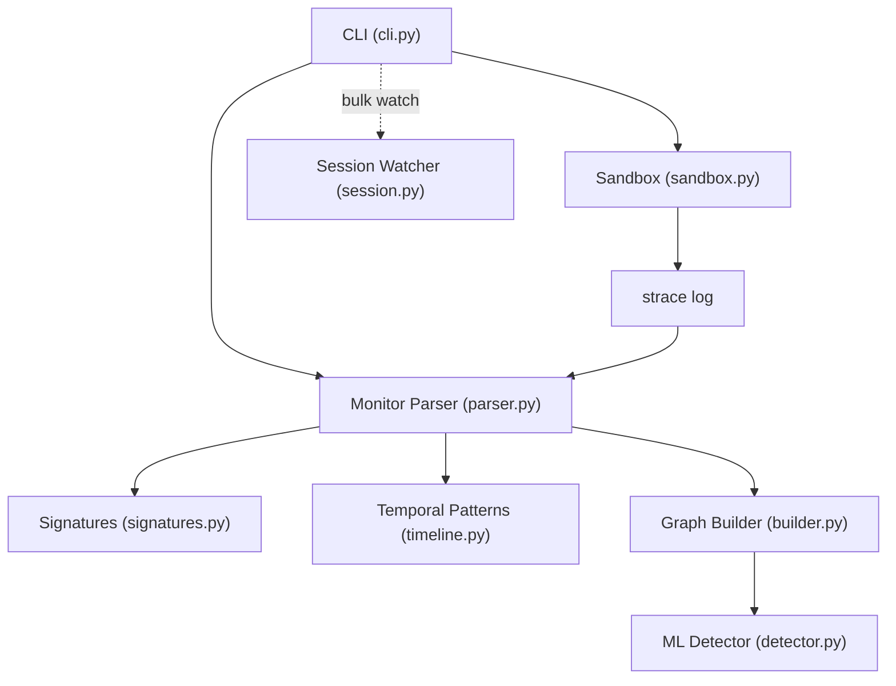
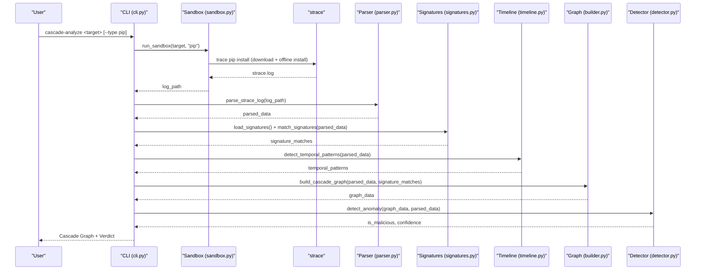
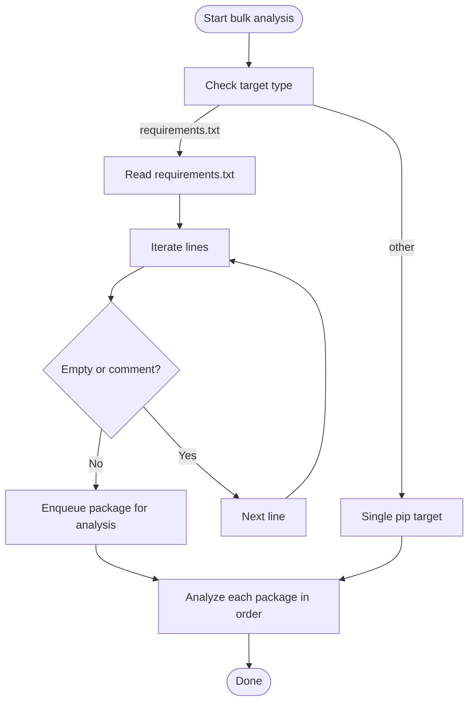
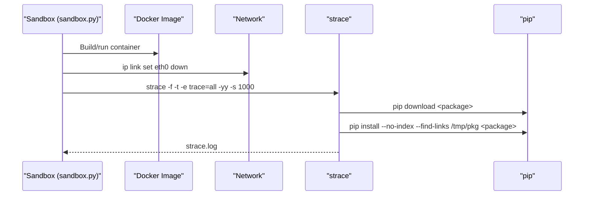
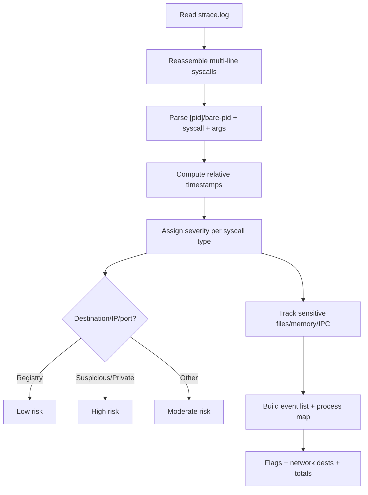
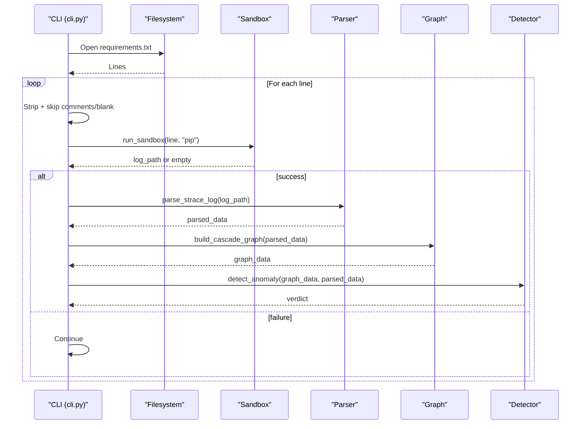
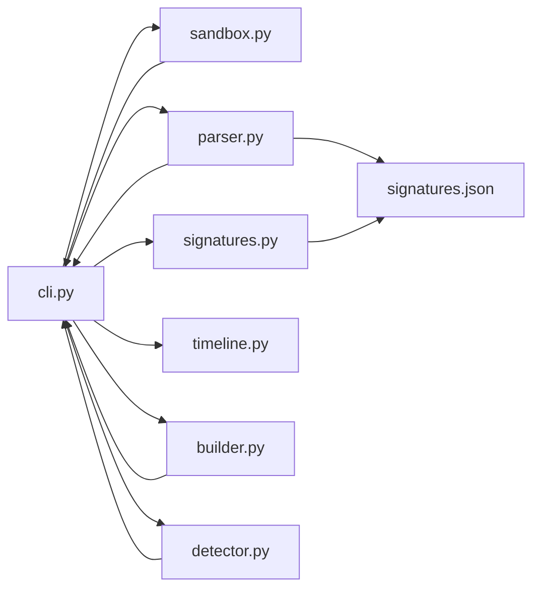

# Python Package Analysis (pip)

<cite>
**Referenced Files in This Document**
- [cli.py](file://TraceTree/cli.py)
- [sandbox.py](file://TraceTree/sandbox/sandbox.py)
- [parser.py](file://TraceTree/monitor/parser.py)
- [signatures.py](file://TraceTree/monitor/signatures.py)
- [timeline.py](file://TraceTree/monitor/timeline.py)
- [builder.py](file://TraceTree/graph/builder.py)
- [detector.py](file://TraceTree/ml/detector.py)
- [session.py](file://TraceTree/watcher/session.py)
- [signatures.json](file://TraceTree/data/signatures.json)
- [README.md](file://TraceTree/README.md)
</cite>

## Table of Contents
1. [Introduction](#introduction)
2. [Project Structure](#project-structure)
3. [Core Components](#core-components)
4. [Architecture Overview](#architecture-overview)
5. [Detailed Component Analysis](#detailed-component-analysis)
6. [Dependency Analysis](#dependency-analysis)
7. [Performance Considerations](#performance-considerations)
8. [Troubleshooting Guide](#troubleshooting-guide)
9. [Conclusion](#conclusion)
10. [Appendices](#appendices)

## Introduction
This document explains how TraceTree performs behavioral analysis of Python packages using the pip target type. It covers automatic target type detection for requirements.txt, the bulk analysis pipeline for requirements.txt, sandbox execution parameters for pip packages (virtual environment simulation, dependency resolution, and Python interpreter setup), strace log parsing specifics for Python package installations, and practical examples for analyzing popular packages such as requests, django, flask, and numpy. Cross-platform considerations, virtual environment isolation, and dependency chain traversal are also addressed.

## Project Structure
The Python package analysis pipeline spans several modules:
- CLI orchestrator determines target type and coordinates the pipeline
- Sandbox executes pip operations under strace in an isolated container
- Monitor parses strace logs and classifies suspicious behavior
- Graph constructs a directed execution graph enriched with severity and signature tags
- ML detector combines model predictions with severity and temporal signals
- Watcher supports bulk discovery and analysis of requirements.txt

**Diagram sources**
- [cli.py](file://TraceTree/cli.py)
- [sandbox.py](file://TraceTree/sandbox/sandbox.py)
- [parser.py](file://TraceTree/monitor/parser.py)
- [signatures.py](file://TraceTree/monitor/signatures.py)
- [timeline.py](file://TraceTree/monitor/timeline.py)
- [builder.py](file://TraceTree/graph/builder.py)
- [detector.py](file://TraceTree/ml/detector.py)
- [session.py](file://TraceTree/watcher/session.py)

**Section sources**
- [README.md](file://TraceTree/README.md)

## Core Components
- Target type determination: Automatic detection for .txt files named requirements.txt and bulk-pip mode
- Sandbox execution: pip download with network, then pip install --no-index with network disabled
- Strace parsing: Multi-line syscall assembly, timestamp handling, severity scoring, destination classification
- Signature matching: Eight behavioral patterns with ordered and unordered matching
- Temporal analysis: Five time-based patterns from timestamped event streams
- Graph construction: Process, network, and file nodes with temporal edges
- ML detection: Supervised model or IsolationForest baseline with severity boosting

**Section sources**
- [cli.py](file://TraceTree/cli.py)
- [sandbox.py](file://TraceTree/sandbox/sandbox.py)
- [parser.py](file://TraceTree/monitor/parser.py)
- [signatures.py](file://TraceTree/monitor/signatures.py)
- [timeline.py](file://TraceTree/monitor/timeline.py)
- [builder.py](file://TraceTree/graph/builder.py)
- [detector.py](file://TraceTree/ml/detector.py)

## Architecture Overview
The runtime behavior of pip-installed Python packages is captured by tracing syscalls with strace, parsing the resulting logs, and applying rule-based and ML-based classification.

**Diagram sources**
- [cli.py](file://TraceTree/cli.py)
- [sandbox.py](file://TraceTree/sandbox/sandbox.py)
- [parser.py](file://TraceTree/monitor/parser.py)
- [signatures.py](file://TraceTree/monitor/signatures.py)
- [timeline.py](file://TraceTree/monitor/timeline.py)
- [builder.py](file://TraceTree/graph/builder.py)
- [detector.py](file://TraceTree/ml/detector.py)

## Detailed Component Analysis

### Target Type Detection and Bulk Pip Pipeline
- Automatic detection:
  - If the target is a .txt file named requirements.txt, the target type is bulk-pip
  - Otherwise, default is pip
- Bulk pipeline for requirements.txt:
  - Reads the file line-by-line
  - Skips blank lines and comments (starting with #)
  - Treats each non-empty, non-comment line as a pip package to analyze
  - Progress reporting is handled per target with a Rich progress bar

**Diagram sources**
- [cli.py](file://TraceTree/cli.py)

**Section sources**
- [cli.py](file://TraceTree/cli.py)

### Sandbox Execution Parameters for Pip
- Image and isolation:
  - Uses a Docker image built from the sandbox directory
  - Drops the network interface (ip link set eth0 down) prior to installation
- Execution steps:
  - pip download <package> --dest /tmp/pkg
  - pip install --no-index --find-links /tmp/pkg <package>
- strace configuration:
  - -f to follow child processes
  - -t to include timestamps for temporal analysis
  - -e trace=all to capture all syscalls
  - -yy to resolve AF_UNIX sockets
  - -s 1000 to increase buffer size for long arguments
- Container behavior:
  - Timeout varies by target type (pip: default, exe: higher)
  - Filters wine noise for EXE targets (not applicable to pip)
  - Returns a strace log path or empty string on failure

**Diagram sources**
- [sandbox.py](file://TraceTree/sandbox/sandbox.py)

**Section sources**
- [sandbox.py](file://TraceTree/sandbox/sandbox.py)

### Strace Log Parsing Differences for Python Package Installations
- Multi-line reassembly:
  - Reassembles wrapped syscall lines until a return value marker is found
  - Supports both [pid] and bare-pid formats
- Timestamp handling:
  - Converts timestamps to relative milliseconds for temporal analysis
- Syscall coverage:
  - Processes: clone, fork, vfork, execve
  - Network: connect, sendto, socket, getaddrinfo
  - Files: openat, read, write, unlink, unlinkat, chmod
  - Memory: mmap, mprotect
  - IPC: pipe, pipe2
- Severity scoring:
  - Base weights for each syscall type
  - Elevated severity for unexpected binaries, sensitive file access, PROT_EXEC, suspicious ports, private IPs
- Destination classification:
  - Safe registry (PyPI/npm/CDN) vs suspicious/private IPs vs unknown
- Signature and temporal analysis:
  - Signature matching engine applies eight behavioral patterns
  - Temporal analyzer detects time-based patterns from timestamped events

**Diagram sources**
- [parser.py](file://TraceTree/monitor/parser.py)
- [signatures.py](file://TraceTree/monitor/signatures.py)
- [timeline.py](file://TraceTree/monitor/timeline.py)

**Section sources**
- [parser.py](file://TraceTree/monitor/parser.py)
- [signatures.py](file://TraceTree/monitor/signatures.py)
- [timeline.py](file://TraceTree/monitor/timeline.py)

### Practical Examples: Analyzing Popular Python Packages
- requests:
  - Expected behavior: pip download + install, network to PyPI CDN, file access to Python stdlib and caches
  - Typical flags: none; low severity; benign network destinations
- django:
  - Larger dependency graph; potential native extensions; elevated file and network activity
  - Classifier may detect increased execve and file operations; benign destinations
- flask:
  - Moderate dependency size; primarily pure-Python; standard network and file access patterns
- numpy:
  - Heavier footprint; native builds; more file operations and potential memory mappings
  - Classifier may reflect higher node/edge counts and severity

These examples illustrate how the pipeline surfaces benign behavior for well-known packages while retaining sensitivity to anomalies.

**Section sources**
- [README.md](file://TraceTree/README.md)

### Bulk Analysis Mode for requirements.txt
- Line-by-line processing:
  - Skips blank lines and comments
  - Treats each valid line as a separate pip target
- Error handling:
  - On sandbox failure, continues to the next line
  - On parse/graph/ML failures, logs and proceeds
- Progress reporting:
  - Rich progress bars per target
  - Final cascade graph and verdict per analyzed package

**Diagram sources**
- [cli.py](file://TraceTree/cli.py)
- [sandbox.py](file://TraceTree/sandbox/sandbox.py)
- [parser.py](file://TraceTree/monitor/parser.py)
- [builder.py](file://TraceTree/graph/builder.py)
- [detector.py](file://TraceTree/ml/detector.py)

**Section sources**
- [cli.py](file://TraceTree/cli.py)

### Cross-Platform Considerations, Virtual Environment Isolation, and Dependency Chain Traversal
- Cross-platform:
  - strace runs inside a Linux container; macOS/Windows require Docker to emulate Linux
  - Wine-based EXE analysis is best-effort; native Windows syscalls are not traceable
- Virtual environment simulation:
  - The sandbox simulates a clean Python environment with pip and strace
  - Network is dropped before installation to avoid live downloads during analysis
- Dependency chain traversal:
  - The graph builder attaches process lineage (clone/fork) and syscall targets
  - Temporal edges connect consecutive events from the same PID within a fixed window
  - Signature tagging propagates to nodes and edges referenced by matched events

**Section sources**
- [README.md](file://TraceTree/README.md)
- [sandbox.py](file://TraceTree/sandbox/sandbox.py)
- [builder.py](file://TraceTree/graph/builder.py)

## Dependency Analysis
The following diagram shows key module dependencies and their roles in the Python package analysis pipeline.

**Diagram sources**
- [cli.py](file://TraceTree/cli.py)
- [sandbox.py](file://TraceTree/sandbox/sandbox.py)
- [parser.py](file://TraceTree/monitor/parser.py)
- [signatures.py](file://TraceTree/monitor/signatures.py)
- [timeline.py](file://TraceTree/monitor/timeline.py)
- [builder.py](file://TraceTree/graph/builder.py)
- [detector.py](file://TraceTree/ml/detector.py)
- [signatures.json](file://TraceTree/data/signatures.json)

**Section sources**
- [cli.py](file://TraceTree/cli.py)
- [sandbox.py](file://TraceTree/sandbox/sandbox.py)
- [parser.py](file://TraceTree/monitor/parser.py)
- [signatures.py](file://TraceTree/monitor/signatures.py)
- [timeline.py](file://TraceTree/monitor/timeline.py)
- [builder.py](file://TraceTree/graph/builder.py)
- [detector.py](file://TraceTree/ml/detector.py)
- [signatures.json](file://TraceTree/data/signatures.json)

## Performance Considerations
- Container build and reuse:
  - First-run builds the sandbox image; subsequent runs reuse it
- Timeout tuning:
  - Pip analysis defaults to a conservative timeout; EXE analysis allows longer
- strace overhead:
  - -s 1000 reduces truncation; -f ensures child processes are traced
- Model inference:
  - Feature vector is compact; IsolationForest fallback avoids heavy model loading
- I/O and parsing:
  - Multi-line reassembly and timestamp conversion are linear in event count

[No sources needed since this section provides general guidance]

## Troubleshooting Guide
- Docker prerequisites:
  - Ensure Docker is installed and running; CLI checks connectivity and provides OS-specific guidance
- Sandbox failures:
  - Empty or minimal strace logs trigger warnings; verify target type and package name
- Parser errors:
  - Parser gracefully handles missing files and returns empty structures
- Signature and temporal analysis:
  - Signature matching and temporal detection are best-effort; failures are logged and pipeline continues
- Watcher session conflicts:
  - Session watcher uses a lockfile; only one watcher per directory is allowed

**Section sources**
- [cli.py](file://TraceTree/cli.py)
- [sandbox.py](file://TraceTree/sandbox/sandbox.py)
- [parser.py](file://TraceTree/monitor/parser.py)
- [session.py](file://TraceTree/watcher/session.py)

## Conclusion
TraceTree’s pip analysis pipeline reliably captures and evaluates the runtime behavior of Python packages. By combining sandboxed execution, comprehensive strace parsing, signature and temporal analysis, and severity-weighted ML detection, it provides actionable insights into benign versus suspicious package behavior. The bulk requirements.txt pipeline scales analysis across multiple packages with robust error handling and progress reporting.

[No sources needed since this section summarizes without analyzing specific files]

## Appendices

### Appendix A: Behavioral Signature Patterns (Overview)
- reverse_shell: connect → dup2 → execve /bin/sh
- container_escape: openat of /proc/1/, /sys/fs/cgroup, /var/run/docker.sock
- credential_theft: openat sensitive files → external connect
- typosquat_exfil: secret read (.env, .npmrc) → connect to pastebin/file.io/transfer.sh
- process_injection: mprotect PROT_EXEC → execve of non-standard binary
- crypto_miner: clone → clone → connect to mining pool port
- dns_tunneling: getaddrinfo + sendto + socket on port 53/5353
- persistence_cron: openat of crontab path → write

**Section sources**
- [signatures.json](file://TraceTree/data/signatures.json)