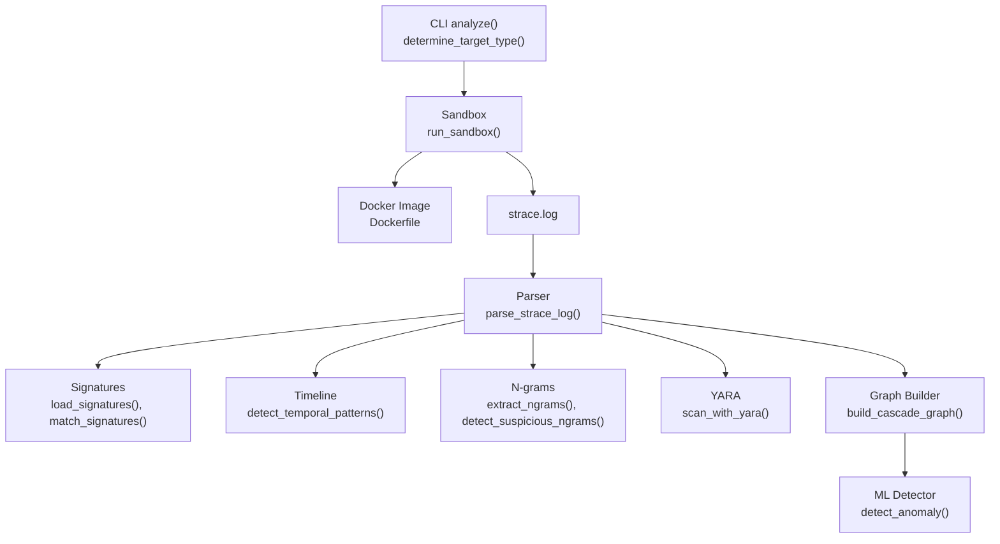
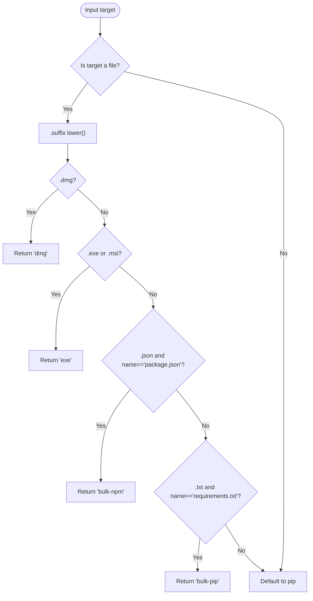
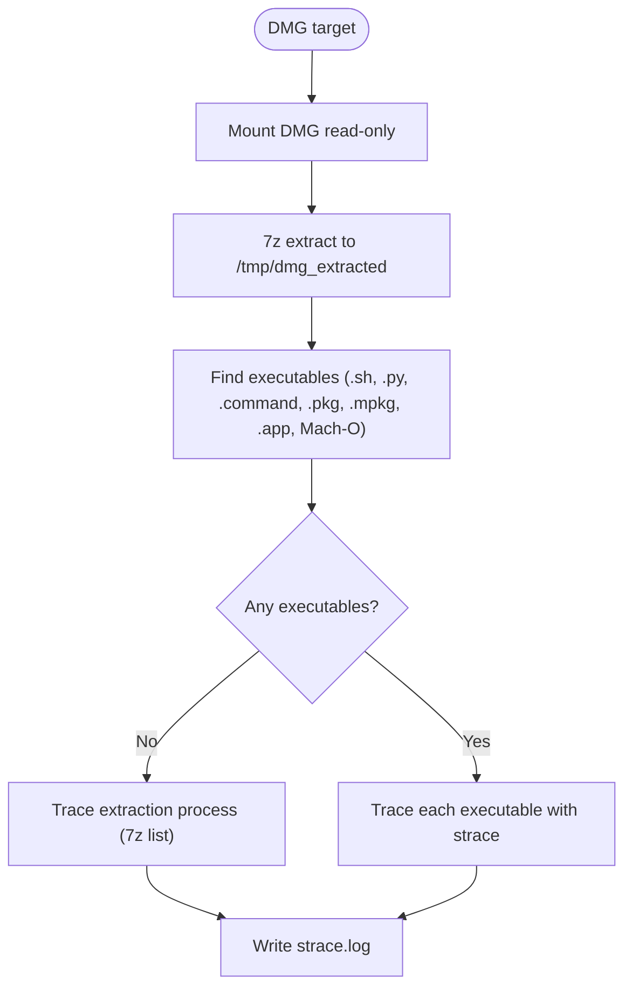
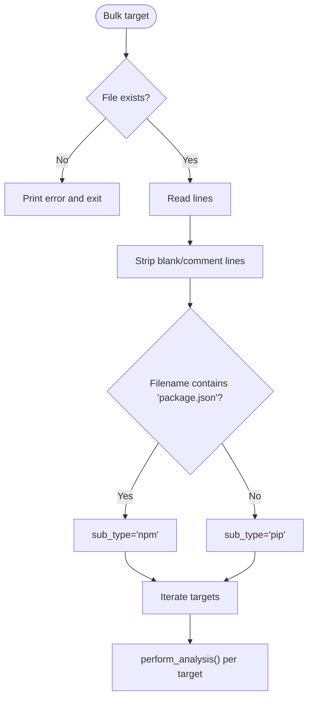
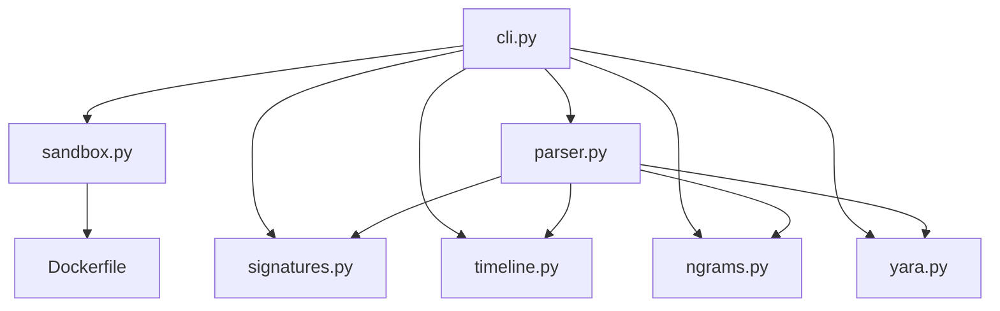

# Target Types Analysis

<cite>
**Referenced Files in This Document**
- [cli.py](file://TraceTree/cli.py)
- [sandbox.py](file://TraceTree/sandbox/sandbox.py)
- [parser.py](file://TraceTree/monitor/parser.py)
- [signatures.py](file://TraceTree/monitor/signatures.py)
- [timeline.py](file://TraceTree/monitor/timeline.py)
- [ngrams.py](file://TraceTree/monitor/ngrams.py)
- [yara.py](file://TraceTree/monitor/yara.py)
- [Dockerfile](file://sandbox/Dockerfile)
- [session.py](file://TraceTree/watcher/session.py)
</cite>

## Table of Contents
1. [Introduction](#introduction)
2. [Project Structure](#project-structure)
3. [Core Components](#core-components)
4. [Architecture Overview](#architecture-overview)
5. [Detailed Component Analysis](#detailed-component-analysis)
6. [Dependency Analysis](#dependency-analysis)
7. [Performance Considerations](#performance-considerations)
8. [Troubleshooting Guide](#troubleshooting-guide)
9. [Conclusion](#conclusion)
10. [Appendices](#appendices)

## Introduction
This document explains target type analysis for the cascade-analyze command. It focuses on the four primary target types: pip packages, npm packages, DMG files, and Windows EXE files. It documents automatic target type detection, manual overrides, and the end-to-end analysis pipeline for each type, including sandbox execution parameters, strace log parsing differences, and specialized signature matching. Practical examples and cross-platform considerations are included, along with bulk analysis modes for requirements.txt and package.json.

## Project Structure
The target type logic and analysis pipeline span CLI orchestration, sandbox execution, and post-processing modules:
- CLI determines target type and orchestrates bulk processing
- Sandbox executes target-specific commands inside a Docker container
- Parser normalizes strace logs; signatures, timeline, and ngrams apply specialized matching
- YARA scans for known patterns; SARIF export supports reporting



**Diagram sources**
- [cli.py:111-124](file://TraceTree/cli.py#L111-L124)
- [cli.py:305-482](file://TraceTree/cli.py#L305-L482)
- [sandbox.py:175-335](file://TraceTree/sandbox/sandbox.py#L175-L335)
- [Dockerfile:1-11](file://sandbox/Dockerfile#L1-L11)
- [parser.py:342-400](file://TraceTree/monitor/parser.py#L342-L400)
- [signatures.py:57-115](file://TraceTree/monitor/signatures.py#L57-L115)
- [timeline.py:1-120](file://TraceTree/monitor/timeline.py#L1-L120)
- [ngrams.py:189-217](file://TraceTree/monitor/ngrams.py#L189-L217)
- [yara.py:124-174](file://TraceTree/monitor/yara.py#L124-L174)

**Section sources**
- [cli.py:111-124](file://TraceTree/cli.py#L111-L124)
- [cli.py:305-482](file://TraceTree/cli.py#L305-L482)
- [sandbox.py:175-335](file://TraceTree/sandbox/sandbox.py#L175-L335)
- [Dockerfile:1-11](file://sandbox/Dockerfile#L1-L11)
- [parser.py:342-400](file://TraceTree/monitor/parser.py#L342-L400)
- [signatures.py:57-115](file://TraceTree/monitor/signatures.py#L57-L115)
- [timeline.py:1-120](file://TraceTree/monitor/timeline.py#L1-L120)
- [ngrams.py:189-217](file://TraceTree/monitor/ngrams.py#L189-L217)
- [yara.py:124-174](file://TraceTree/monitor/yara.py#L124-L174)

## Core Components
- Automatic target type detection:
  - Pip packages: default for non-file targets
  - DMG files: .dmg suffix
  - Windows EXE: .exe or .msi suffix
  - Bulk npm: package.json filename with .json extension
  - Bulk pip: requirements.txt filename with .txt extension
- Manual override: --type parameter forces a specific analyzer type
- Bulk analysis:
  - Reads lines from bulk files, skipping comments and blank lines
  - Infers sub-type from filenames for bulk mode
- Pipeline stages:
  - Sandbox execution
  - strace log parsing
  - Behavioral signatures, temporal patterns, YARA rules, n-gram fingerprinting
  - Graph construction and anomaly detection

**Section sources**
- [cli.py:111-124](file://TraceTree/cli.py#L111-L124)
- [cli.py:323-352](file://TraceTree/cli.py#L323-L352)
- [cli.py:278-296](file://TraceTree/cli.py#L278-L296)

## Architecture Overview
The cascade-analyze command follows a deterministic pipeline per target type. The sandbox enforces network isolation, captures syscalls, and writes a standardized strace.log consumed by downstream analyzers.

```mermaid
sequenceDiagram
participant User as "User"
participant CLI as "CLI analyze()"
participant SAN as "Sandbox run_sandbox()"
participant IMG as "Docker Image"
participant LOG as "strace.log"
participant PAR as "Parser parse_strace_log()"
participant SIG as "Signatures match_signatures()"
participant TL as "Timeline detect_temporal_patterns()"
participant YR as "YARA scan_with_yara()"
participant NG as "N-grams extract/detect"
participant GR as "Graph build_cascade_graph()"
participant ML as "ML detect_anomaly()"
User->>CLI : cascade-analyze target [--type]
CLI->>CLI : determine_target_type()/bulk processing
CLI->>SAN : run_sandbox(target, type)
SAN->>IMG : container run (strace + target-specific steps)
IMG-->>SAN : exit code + strace.log
SAN-->>CLI : log path
CLI->>PAR : parse_strace_log(log_path)
PAR-->>CLI : parsed_data
CLI->>SIG : load_signatures() + match_signatures()
CLI->>TL : detect_temporal_patterns()
CLI->>YR : scan_with_yara()
CLI->>NG : extract_ngrams() + detect_suspicious_ngrams()
CLI->>GR : build_cascade_graph(parsed_data)
GR-->>CLI : graph_data
CLI->>ML : detect_anomaly(graph_data, parsed_data)
ML-->>CLI : verdict + confidence
CLI-->>User : results + SARIF (optional)
```

**Diagram sources**
- [cli.py:305-482](file://TraceTree/cli.py#L305-L482)
- [sandbox.py:175-335](file://TraceTree/sandbox/sandbox.py#L175-L335)
- [parser.py:342-400](file://TraceTree/monitor/parser.py#L342-L400)
- [signatures.py:57-115](file://TraceTree/monitor/signatures.py#L57-L115)
- [timeline.py:1-120](file://TraceTree/monitor/timeline.py#L1-L120)
- [ngrams.py:189-217](file://TraceTree/monitor/ngrams.py#L189-L217)
- [yara.py:124-174](file://TraceTree/monitor/yara.py#L124-L174)

## Detailed Component Analysis

### Automatic Target Type Detection
- Logic checks whether the target is a file path and inspects suffix and filename:
  - .dmg → dmg
  - .exe or .msi → exe
  - package.json → bulk-npm
  - requirements.txt → bulk-pip
  - Otherwise defaults to pip
- Manual override: --type parameter forces a specific analyzer type



**Diagram sources**
- [cli.py:111-124](file://TraceTree/cli.py#L111-L124)

**Section sources**
- [cli.py:111-124](file://TraceTree/cli.py#L111-L124)

### Pip Packages Analysis
- Sandbox execution:
  - Download package to /tmp/pkg
  - Disable networking (ip link set eth0 down)
  - Trace pip install with strace -f -t -e trace=all -yy -s 1000
- Resource monitoring:
  - Pre/post install memory and disk usage, file count recorded
- Parser:
  - Handles multi-line syscall entries, timestamps, and PID formats
- Specialized matching:
  - Behavioral signatures, temporal patterns, YARA rules, n-gram fingerprinting
- Cross-platform:
  - Uses Python slim image; installs strace, curl, iproute2, Node.js, npm, wine64, p7zip-full

```mermaid
sequenceDiagram
participant CLI as "CLI"
participant SAN as "Sandbox"
participant IMG as "Python slim image"
participant LOG as "strace.log"
participant PAR as "Parser"
participant SIG as "Signatures"
participant TL as "Timeline"
participant YR as "YARA"
participant NG as "N-grams"
CLI->>SAN : run_sandbox(target, "pip")
SAN->>IMG : pip download + pip install (strace traced)
IMG-->>SAN : exit + strace.log
SAN-->>CLI : log path
CLI->>PAR : parse_strace_log()
PAR-->>CLI : parsed_data
CLI->>SIG : match_signatures()
CLI->>TL : detect_temporal_patterns()
CLI->>YR : scan_with_yara()
CLI->>NG : extract_ngrams() + detect_suspicious_ngrams()
```

**Diagram sources**
- [sandbox.py:217-252](file://TraceTree/sandbox/sandbox.py#L217-L252)
- [parser.py:342-400](file://TraceTree/monitor/parser.py#L342-L400)
- [signatures.py:57-115](file://TraceTree/monitor/signatures.py#L57-L115)
- [timeline.py:1-120](file://TraceTree/monitor/timeline.py#L1-L120)
- [ngrams.py:189-217](file://TraceTree/monitor/ngrams.py#L189-L217)
- [Dockerfile:1-11](file://sandbox/Dockerfile#L1-L11)

**Section sources**
- [sandbox.py:217-252](file://TraceTree/sandbox/sandbox.py#L217-L252)
- [parser.py:342-400](file://TraceTree/monitor/parser.py#L342-L400)
- [Dockerfile:1-11](file://sandbox/Dockerfile#L1-L11)

### NPM Packages Analysis
- Sandbox execution:
  - Dry-run npm install to resolve dependencies
  - Disable networking
  - Trace npm install with strace -f -t -e trace=all -yy -s 1000
- Parser and specialized matching:
  - Same post-processing pipeline as pip
- Cross-platform:
  - Node.js and npm preinstalled in sandbox image

```mermaid
sequenceDiagram
participant CLI as "CLI"
participant SAN as "Sandbox"
participant IMG as "Python slim image"
participant LOG as "strace.log"
participant PAR as "Parser"
participant SIG as "Signatures"
participant TL as "Timeline"
participant YR as "YARA"
participant NG as "N-grams"
CLI->>SAN : run_sandbox(target, "npm")
SAN->>IMG : npm install (dry-run + traced)
IMG-->>SAN : exit + strace.log
SAN-->>CLI : log path
CLI->>PAR : parse_strace_log()
PAR-->>CLI : parsed_data
CLI->>SIG : match_signatures()
CLI->>TL : detect_temporal_patterns()
CLI->>YR : scan_with_yara()
CLI->>NG : extract_ngrams() + detect_suspicious_ngrams()
```

**Diagram sources**
- [sandbox.py:223-228](file://TraceTree/sandbox/sandbox.py#L223-L228)
- [parser.py:342-400](file://TraceTree/monitor/parser.py#L342-L400)
- [signatures.py:57-115](file://TraceTree/monitor/signatures.py#L57-L115)
- [timeline.py:1-120](file://TraceTree/monitor/timeline.py#L1-L120)
- [ngrams.py:189-217](file://TraceTree/monitor/ngrams.py#L189-L217)
- [Dockerfile:1-11](file://sandbox/Dockerfile#L1-L11)

**Section sources**
- [sandbox.py:223-228](file://TraceTree/sandbox/sandbox.py#L223-L228)
- [Dockerfile:1-11](file://sandbox/Dockerfile#L1-L11)

### DMG Files Analysis
- Sandbox execution:
  - Mounts DMG read-only inside container
  - Extracts with 7z; enumerates executables (.sh, .py, .command, .pkg, .mpkg, .app, Mach-O binaries)
  - Traces each executable; falls back to tracing extraction if no executables found
- Parser:
  - Same strace parsing logic applies
- Specialized matching:
  - Signatures, temporal patterns, YARA, n-grams applied uniformly
- Cross-platform:
  - Requires 7z and related tools installed in sandbox image



**Diagram sources**
- [sandbox.py:229-243](file://TraceTree/sandbox/sandbox.py#L229-L243)
- [sandbox.py:20-112](file://TraceTree/sandbox/sandbox.py#L20-L112)
- [parser.py:342-400](file://TraceTree/monitor/parser.py#L342-L400)

**Section sources**
- [sandbox.py:229-243](file://TraceTree/sandbox/sandbox.py#L229-L243)
- [sandbox.py:20-112](file://TraceTree/sandbox/sandbox.py#L20-L112)
- [Dockerfile:1-11](file://sandbox/Dockerfile#L1-L11)

### Windows EXE Files Analysis
- Sandbox execution:
  - Requires wine64; mounts EXE read-only
  - Runs under strace with timeout to avoid GUI hangs
  - Filters wine initialization noise from strace output
- Parser:
  - Same strace parsing logic applies
- Specialized matching:
  - Signatures, temporal patterns, YARA, n-grams applied uniformly
- Cross-platform:
  - wine64 and related tools installed in sandbox image

```mermaid
sequenceDiagram
participant CLI as "CLI"
participant SAN as "Sandbox"
participant IMG as "Python slim image"
participant LOG as "strace.log"
participant FILT as "_filter_wine_noise()"
participant PAR as "Parser"
participant SIG as "Signatures"
participant TL as "Timeline"
participant YR as "YARA"
participant NG as "N-grams"
CLI->>SAN : run_sandbox(target, "exe")
SAN->>IMG : mount EXE + wine64 strace (timeout)
SAN->>FILT : filter wine noise
IMG-->>SAN : exit + strace.log
SAN-->>CLI : log path
CLI->>PAR : parse_strace_log()
PAR-->>CLI : parsed_data
CLI->>SIG : match_signatures()
CLI->>TL : detect_temporal_patterns()
CLI->>YR : scan_with_yara()
CLI->>NG : extract_ngrams() + detect_suspicious_ngrams()
```

**Diagram sources**
- [sandbox.py:237-243](file://TraceTree/sandbox/sandbox.py#L237-L243)
- [sandbox.py:338-376](file://TraceTree/sandbox/sandbox.py#L338-L376)
- [parser.py:342-400](file://TraceTree/monitor/parser.py#L342-L400)
- [signatures.py:57-115](file://TraceTree/monitor/signatures.py#L57-L115)
- [timeline.py:1-120](file://TraceTree/monitor/timeline.py#L1-L120)
- [ngrams.py:189-217](file://TraceTree/monitor/ngrams.py#L189-L217)
- [Dockerfile:1-11](file://sandbox/Dockerfile#L1-L11)

**Section sources**
- [sandbox.py:237-243](file://TraceTree/sandbox/sandbox.py#L237-L243)
- [sandbox.py:338-376](file://TraceTree/sandbox/sandbox.py#L338-L376)
- [Dockerfile:1-11](file://sandbox/Dockerfile#L1-L11)

### Bulk Analysis Modes
- Bulk npm:
  - --type bulk or --type bulk-npm with package.json
  - Reads lines, strips comments and blank lines
  - Infers sub-type from filename
- Bulk pip:
  - --type bulk or --type bulk-pip with requirements.txt
  - Reads lines, strips comments and blank lines
  - Infers sub-type from filename
- Watcher integration:
  - Discoverer recognizes requirements.txt and package.json for repository scanning



**Diagram sources**
- [cli.py:323-352](file://TraceTree/cli.py#L323-L352)
- [cli.py:278-296](file://TraceTree/cli.py#L278-L296)
- [session.py:350-375](file://TraceTree/watcher/session.py#L350-L375)

**Section sources**
- [cli.py:323-352](file://TraceTree/cli.py#L323-L352)
- [cli.py:278-296](file://TraceTree/cli.py#L278-L296)
- [session.py:350-375](file://TraceTree/watcher/session.py#L350-L375)

### Practical Examples
- Python packages:
  - requests: pip install with strace tracing; resource usage recorded
  - django: pip install with strace tracing; resource usage recorded
- NPM packages:
  - @babel/core: npm install traced; dry-run then install
  - express: npm install traced; dry-run then install
- macOS DMG:
  - Open a .dmg, extract with 7z, enumerate executables, trace each
- Windows EXE:
  - Mount EXE, run under wine64 with strace, filter wine noise

Note: These examples describe the execution flow and outputs; refer to the pipeline diagrams for specifics.

**Section sources**
- [sandbox.py:217-252](file://TraceTree/sandbox/sandbox.py#L217-L252)
- [sandbox.py:223-228](file://TraceTree/sandbox/sandbox.py#L223-L228)
- [sandbox.py:229-243](file://TraceTree/sandbox/sandbox.py#L229-L243)
- [sandbox.py:338-376](file://TraceTree/sandbox/sandbox.py#L338-L376)

## Dependency Analysis
- CLI depends on sandbox execution and post-processing modules
- Sandbox depends on Docker runtime and the sandbox image
- Parser is shared across all target types
- Specialized analyzers (signatures, timeline, ngrams, yara) consume parsed data
- Dockerfile defines the execution environment with strace, curl, iproute2, Node.js, npm, wine64, p7zip-full



**Diagram sources**
- [cli.py:305-482](file://TraceTree/cli.py#L305-L482)
- [sandbox.py:175-335](file://TraceTree/sandbox/sandbox.py#L175-L335)
- [Dockerfile:1-11](file://sandbox/Dockerfile#L1-L11)
- [parser.py:342-400](file://TraceTree/monitor/parser.py#L342-L400)
- [signatures.py:57-115](file://TraceTree/monitor/signatures.py#L57-L115)
- [timeline.py:1-120](file://TraceTree/monitor/timeline.py#L1-L120)
- [ngrams.py:189-217](file://TraceTree/monitor/ngrams.py#L189-L217)
- [yara.py:124-174](file://TraceTree/monitor/yara.py#L124-L174)

**Section sources**
- [cli.py:305-482](file://TraceTree/cli.py#L305-L482)
- [sandbox.py:175-335](file://TraceTree/sandbox/sandbox.py#L175-L335)
- [Dockerfile:1-11](file://sandbox/Dockerfile#L1-L11)
- [parser.py:342-400](file://TraceTree/monitor/parser.py#L342-L400)
- [signatures.py:57-115](file://TraceTree/monitor/signatures.py#L57-L115)
- [timeline.py:1-120](file://TraceTree/monitor/timeline.py#L1-L120)
- [ngrams.py:189-217](file://TraceTree/monitor/ngrams.py#L189-L217)
- [yara.py:124-174](file://TraceTree/monitor/yara.py#L124-L174)

## Performance Considerations
- Timeouts:
  - EXE: 180s
  - DMG: 120s
  - Pip/NPM: 60s
- Resource monitoring:
  - Pip/NPM pipeline records peak memory, disk usage, and installed file counts
- Parser efficiency:
  - Multi-line syscall reassembly and timestamp/PID normalization reduce overhead
- Specialized analyzers:
  - Signature matching, temporal pattern detection, YARA scanning, and n-gram extraction are best-effort and designed to minimize latency

[No sources needed since this section provides general guidance]

## Troubleshooting Guide
- Docker prerequisites:
  - Docker SDK must be installed; Docker must be running
  - On macOS/Linux/Windows, start Docker Desktop/daemon as appropriate
- Sandbox failures:
  - Image build errors, container run exceptions, timeouts, and non-zero exit codes are handled with diagnostic messages
  - For EXE, wine64 must be available; otherwise, logs indicate “WINE64 NOT AVAILABLE”
- Empty or minimal logs:
  - DMG: “NO EXECUTABLES FOUND” indicates no executables discovered
  - EXE: “NO STRACE OUTPUT” suggests immediate crash or no syscalls captured
- Parser issues:
  - Multi-line syscall entries and PID/timestamp formats are supported; malformed logs may require inspection
- YARA availability:
  - If yara-python is missing, a fallback regex-based scanner is used

**Section sources**
- [cli.py:74-110](file://TraceTree/cli.py#L74-L110)
- [sandbox.py:189-211](file://TraceTree/sandbox/sandbox.py#L189-L211)
- [sandbox.py:317-355](file://TraceTree/sandbox/sandbox.py#L317-L355)
- [sandbox.py:309-320](file://TraceTree/sandbox/sandbox.py#L309-L320)
- [parser.py:169-223](file://TraceTree/monitor/parser.py#L169-L223)

## Conclusion
The cascade-analyze command provides a unified, sandboxed pipeline for analyzing pip, npm, DMG, and EXE targets. Automatic target type detection and manual overrides enable flexible analysis, while bulk modes streamline repository-wide scanning. The post-processing suite of signatures, temporal patterns, YARA rules, and n-gram fingerprinting delivers comprehensive behavioral insights. Cross-platform execution is supported through a Docker-based environment with strace and essential tools.

[No sources needed since this section summarizes without analyzing specific files]

## Appendices

### Cross-Platform Considerations
- Execution environment:
  - Python slim image with strace, curl, iproute2, Node.js, npm, wine64, p7zip-full, cabextract
- Network isolation:
  - eth0 disabled in sandbox to prevent outbound traffic during installs
- Wine filtering:
  - Wine initialization noise is filtered from EXE traces to reduce false positives

**Section sources**
- [Dockerfile:1-11](file://sandbox/Dockerfile#L1-L11)
- [sandbox.py:338-376](file://TraceTree/sandbox/sandbox.py#L338-L376)

### Dependency Resolution and Execution Environment Setup
- Pip:
  - Offline install using downloaded wheels from /tmp/pkg
- NPM:
  - Global dry-run then install; no audit/fund for speed
- DMG:
  - 7z extraction; executable discovery across bundle structures
- EXE:
  - wine64 execution under strace with timeout and noise filtering

**Section sources**
- [sandbox.py:217-252](file://TraceTree/sandbox/sandbox.py#L217-L252)
- [sandbox.py:223-228](file://TraceTree/sandbox/sandbox.py#L223-L228)
- [sandbox.py:229-243](file://TraceTree/sandbox/sandbox.py#L229-L243)
- [sandbox.py:338-376](file://TraceTree/sandbox/sandbox.py#L338-L376)