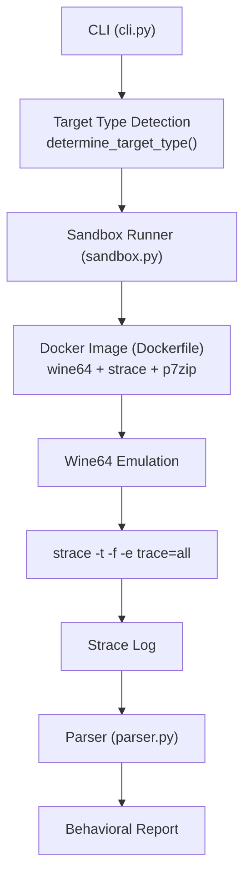
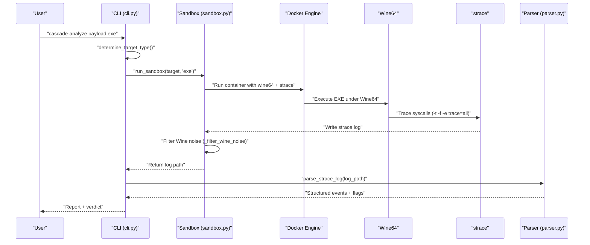
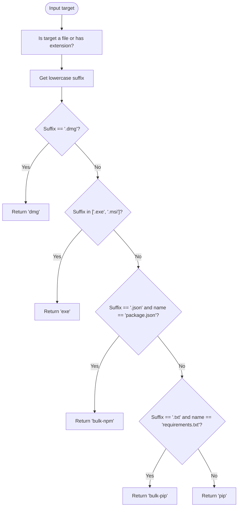
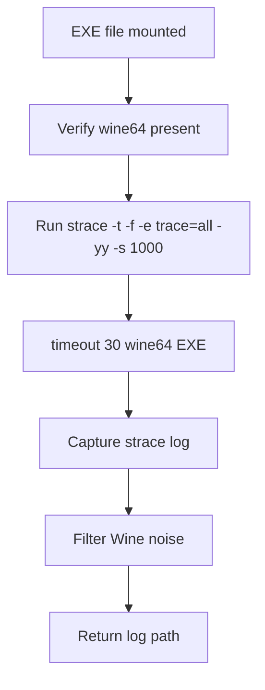
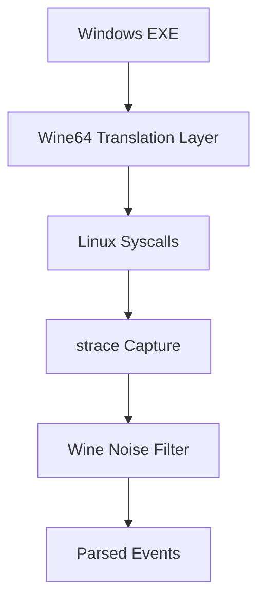
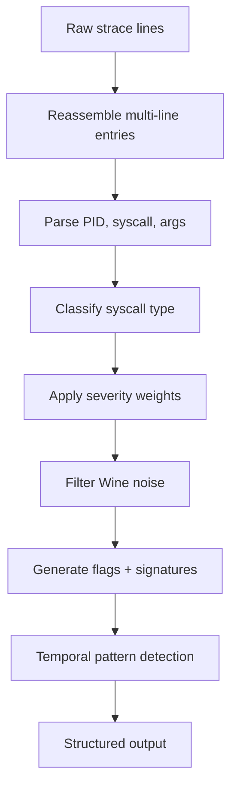
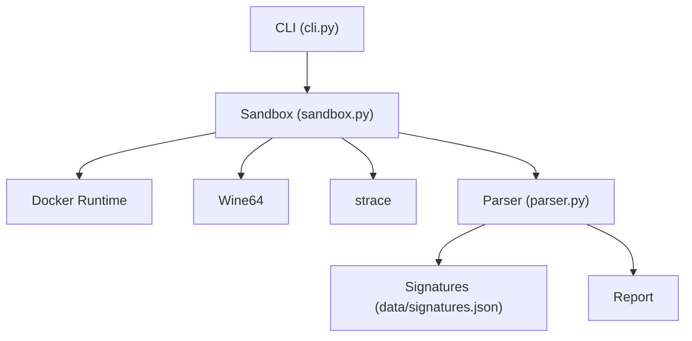

# Windows EXE Analysis

<cite>
**Referenced Files in This Document**
- [cli.py](file://TraceTree/cli.py)
- [sandbox.py](file://TraceTree/sandbox/sandbox.py)
- [Dockerfile](file://TraceTree/sandbox/Dockerfile)
- [parser.py](file://TraceTree/monitor/parser.py)
- [README.md](file://TraceTree/README.md)
- [signatures.json](file://TraceTree/data/signatures.json)
</cite>

## Table of Contents
1. [Introduction](#introduction)
2. [Project Structure](#project-structure)
3. [Core Components](#core-components)
4. [Architecture Overview](#architecture-overview)
5. [Detailed Component Analysis](#detailed-component-analysis)
6. [Dependency Analysis](#dependency-analysis)
7. [Performance Considerations](#performance-considerations)
8. [Troubleshooting Guide](#troubleshooting-guide)
9. [Conclusion](#conclusion)
10. [Appendices](#appendices)

## Introduction
This document explains how the project analyzes Windows executables (EXE) and installers (MSI) using a Dockerized sandbox with Wine64 emulation and strace-based syscall tracing. It covers the automatic target type detection logic, Wine64 setup, Windows syscall translation, environment simulation, strace log parsing specifics for Windows binaries, practical analysis examples, limitations, cross-platform considerations, and security practices for isolating potentially malicious Windows executables.

## Project Structure
The Windows EXE analysis pipeline integrates CLI orchestration, sandbox execution, Wine64 emulation, and strace parsing. The key modules are:
- CLI determines target type and orchestrates analysis
- Sandbox executes targets in a Docker container with Wine64 and strace
- Parser interprets strace logs and flags suspicious behavior
- Data assets define behavioral signatures and thresholds

**Diagram sources**
- [cli.py:111-123](file://TraceTree/cli.py#L111-L123)
- [sandbox.py:184-246](file://TraceTree/sandbox/sandbox.py#L184-L246)
- [Dockerfile:1-11](file://TraceTree/sandbox/Dockerfile#L1-11)
- [parser.py:340-680](file://TraceTree/monitor/parser.py#L340-L680)

**Section sources**
- [cli.py:111-123](file://TraceTree/cli.py#L111-L123)
- [sandbox.py:184-246](file://TraceTree/sandbox/sandbox.py#L184-L246)
- [Dockerfile:1-11](file://TraceTree/sandbox/Dockerfile#L1-11)
- [parser.py:340-680](file://TraceTree/monitor/parser.py#L340-L680)

## Core Components
- Target type detection: Automatically selects “exe” for .exe and .msi files.
- Sandbox execution: Mounts the EXE/MSI into the container, runs under Wine64 with strace -f tracing, and applies a 30-second timeout.
- Wine64 filtering: Post-processes strace logs to remove initialization noise while preserving suspicious syscalls.
- Strace parsing: Multi-line reassembly, PID handling, syscall categorization, and severity scoring.

**Section sources**
- [cli.py:111-123](file://TraceTree/cli.py#L111-L123)
- [sandbox.py:118-177](file://TraceTree/sandbox/sandbox.py#L118-L177)
- [sandbox.py:338-375](file://TraceTree/sandbox/sandbox.py#L338-L375)
- [parser.py:169-224](file://TraceTree/monitor/parser.py#L169-L224)

## Architecture Overview
The Windows EXE analysis architecture is a Dockerized sandbox that emulates Windows binaries on Linux using Wine64, traces all syscalls with strace, and parses the resulting logs to detect suspicious behavior.

**Diagram sources**
- [cli.py:261-372](file://TraceTree/cli.py#L261-L372)
- [sandbox.py:184-246](file://TraceTree/sandbox/sandbox.py#L184-L246)
- [sandbox.py:338-375](file://TraceTree/sandbox/sandbox.py#L338-L375)
- [parser.py:340-680](file://TraceTree/monitor/parser.py#L340-L680)

## Detailed Component Analysis

### Automatic Target Type Detection
The CLI’s determine_target_type() function inspects the file extension to select the appropriate analyzer:
- .exe and .msi are mapped to “exe”
- .dmg is mapped to “dmg”
- Other extensions default to “pip”

**Diagram sources**
- [cli.py:111-123](file://TraceTree/cli.py#L111-L123)

**Section sources**
- [cli.py:111-123](file://TraceTree/cli.py#L111-L123)

### Wine64 Emulation Setup and Execution Parameters
The sandbox executes Windows binaries under Wine64 with strace tracing:
- Wine64 availability is verified before execution
- The target is mounted read-only into the container
- strace runs with -t (timestamps), -f (follow children), -e trace=all, -yy (resolve FDs), -s 1000 (max arg size)
- A 30-second timeout prevents GUI apps from hanging indefinitely
- Wine stderr is redirected to a separate file to avoid polluting the strace log

**Diagram sources**
- [sandbox.py:118-177](file://TraceTree/sandbox/sandbox.py#L118-L177)

**Section sources**
- [sandbox.py:118-177](file://TraceTree/sandbox/sandbox.py#L118-L177)
- [Dockerfile:1-11](file://TraceTree/sandbox/Dockerfile#L1-11)

### Windows System Call Translation and Environment Simulation
- Wine64 translates Windows syscalls to Linux syscalls, so the strace logs reflect Linux-level syscalls rather than Windows-native syscalls.
- Wine initializes a Windows-like environment (prefix, DLL loading, registry emulation), which generates noise in strace logs.
- The analysis filters out typical Wine initialization noise while preserving suspicious syscalls (e.g., non-Wine connect/execve).

**Diagram sources**
- [sandbox.py:338-375](file://TraceTree/sandbox/sandbox.py#L338-L375)
- [parser.py:340-680](file://TraceTree/monitor/parser.py#L340-L680)

**Section sources**
- [sandbox.py:338-375](file://TraceTree/sandbox/sandbox.py#L338-L375)
- [parser.py:340-680](file://TraceTree/monitor/parser.py#L340-L680)

### Strace Log Parsing Differences for Windows Executables
The parser handles multi-line strace entries and supports both [pid] and bare-pid formats. For Windows binaries executed under Wine64:
- Wine initialization syscalls are filtered out to reduce noise
- Suspicious syscalls (connect, execve, openat, mprotect, etc.) are weighted and flagged
- Network destinations are categorized as safe, benign, suspicious, or unknown
- Temporal patterns and behavioral signatures are evaluated

**Diagram sources**
- [parser.py:169-224](file://TraceTree/monitor/parser.py#L169-L224)
- [parser.py:340-680](file://TraceTree/monitor/parser.py#L340-L680)
- [sandbox.py:338-375](file://TraceTree/sandbox/sandbox.py#L338-L375)

**Section sources**
- [parser.py:169-224](file://TraceTree/monitor/parser.py#L169-L224)
- [parser.py:340-680](file://TraceTree/monitor/parser.py#L340-L680)
- [sandbox.py:338-375](file://TraceTree/sandbox/sandbox.py#L338-L375)

### Practical Examples
- Analyze a Windows application installer (MSI) by passing the file path; the CLI auto-detects “exe” and runs it under Wine64.
- Analyze a third-party EXE utility with the same approach; the sandbox mounts the file and traces all syscalls.
- For system utilities distributed as EXE, the same pipeline applies—Wine64 executes the binary and strace captures behavior.

**Section sources**
- [cli.py:261-372](file://TraceTree/cli.py#L261-L372)
- [sandbox.py:184-246](file://TraceTree/sandbox/sandbox.py#L184-L246)

### Limitations and Cross-Platform Considerations
- Wine64 is best-effort: Windows-specific behavior (registry, COM, Windows APIs) may not translate to visible Linux syscalls.
- GUI applications that wait for user input will timeout after 30 seconds.
- The sandbox runs on Linux inside Docker; macOS/Windows hosts run a Linux VM, which affects syscall fidelity.
- Wine initialization noise is filtered, but some benign Wine activity may be removed.

**Section sources**
- [README.md:330-347](file://TraceTree/README.md#L330-L347)
- [sandbox.py:338-375](file://TraceTree/sandbox/sandbox.py#L338-L375)

### Security Considerations and Sandbox Isolation
- Network isolation: The sandbox drops the network interface before execution to prevent outbound connections.
- Container isolation: The container runs with restricted capabilities and no privileged access.
- Input sanitization: The sandbox uses shell quoting and read-only mounts to mitigate injection risks.
- Timeout enforcement: Prevents indefinite hangs, especially for GUI apps.
- Wine stderr separation: Captures Wine noise separately to avoid masking suspicious activity.

**Section sources**
- [sandbox.py:248-281](file://TraceTree/sandbox/sandbox.py#L248-L281)
- [sandbox.py:118-177](file://TraceTree/sandbox/sandbox.py#L118-L177)
- [README.md:330-347](file://TraceTree/README.md#L330-L347)

## Dependency Analysis
The Windows EXE analysis depends on:
- Docker runtime for containerization
- Wine64 for Windows binary emulation
- strace for syscall tracing
- Parser for event extraction and classification
- Signature database for behavioral matching

**Diagram sources**
- [cli.py:261-372](file://TraceTree/cli.py#L261-L372)
- [sandbox.py:184-246](file://TraceTree/sandbox/sandbox.py#L184-L246)
- [parser.py:340-680](file://TraceTree/monitor/parser.py#L340-L680)
- [signatures.json:1-246](file://TraceTree/data/signatures.json#L1-L246)

**Section sources**
- [cli.py:261-372](file://TraceTree/cli.py#L261-L372)
- [sandbox.py:184-246](file://TraceTree/sandbox/sandbox.py#L184-L246)
- [parser.py:340-680](file://TraceTree/monitor/parser.py#L340-L680)
- [signatures.json:1-246](file://TraceTree/data/signatures.json#L1-L246)

## Performance Considerations
- Wine64 overhead: Emulation introduces latency; filtering Wine noise reduces log size and improves parsing throughput.
- strace verbosity: Using -e trace=all increases log volume; selective filtering helps manage performance.
- Timeout tuning: 30 seconds is a balance between capturing meaningful behavior and avoiding hangs; adjust based on target type.

[No sources needed since this section provides general guidance]

## Troubleshooting Guide
Common issues and resolutions:
- Wine64 not installed: The sandbox checks for wine64 and reports “WINE64 NOT AVAILABLE.”
- File not found or empty: The sandbox validates existence and size and returns appropriate messages.
- No strace output: Indicates immediate crash or lack of visible syscalls; review Wine stderr.
- Sandbox stderr diagnostics: The runner prints container stderr for troubleshooting.

**Section sources**
- [sandbox.py:132-143](file://TraceTree/sandbox/sandbox.py#L132-L143)
- [sandbox.py:168-174](file://TraceTree/sandbox/sandbox.py#L168-L174)
- [sandbox.py:271-281](file://TraceTree/sandbox/sandbox.py#L271-L281)

## Conclusion
Windows EXE analysis leverages Wine64 emulation and strace tracing within a Dockerized sandbox to detect suspicious behavior across syscalls, network activity, and file operations. The pipeline includes automatic target type detection, Wine noise filtering, and robust parsing with severity weighting and signature matching. While Wine64 provides broad compatibility, it is best-effort and may miss Windows-specific nuances. Proper sandbox isolation and timeouts ensure safe and efficient analysis of potentially malicious Windows binaries.

[No sources needed since this section summarizes without analyzing specific files]

## Appendices

### Appendix A: Behavioral Signatures Relevant to Windows EXE Analysis
- Reverse shell: connect → dup2 → execve /bin/sh
- Credential theft: sensitive file read → external connect
- Process injection: mprotect PROT_EXEC → execve of non-standard binary
- Crypto miner: high process spawning + mining pool connection
- DNS tunneling: getaddrinfo + sendto + socket on port 53/5353
- Persistence (cron): writing to crontab or cron spool
- Container escape: accessing host-level paths or mounting

**Section sources**
- [signatures.json:1-246](file://TraceTree/data/signatures.json#L1-L246)

### Appendix B: Supported Targets and Notes
- EXE files: Run under wine64 with strace -t -f and a 30-second timeout. Wine initialization noise is filtered from the strace log.

**Section sources**
- [README.md:95-103](file://TraceTree/README.md#L95-L103)