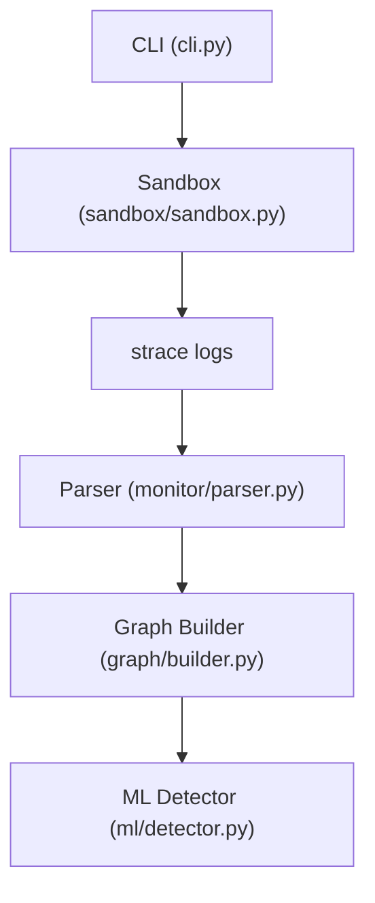
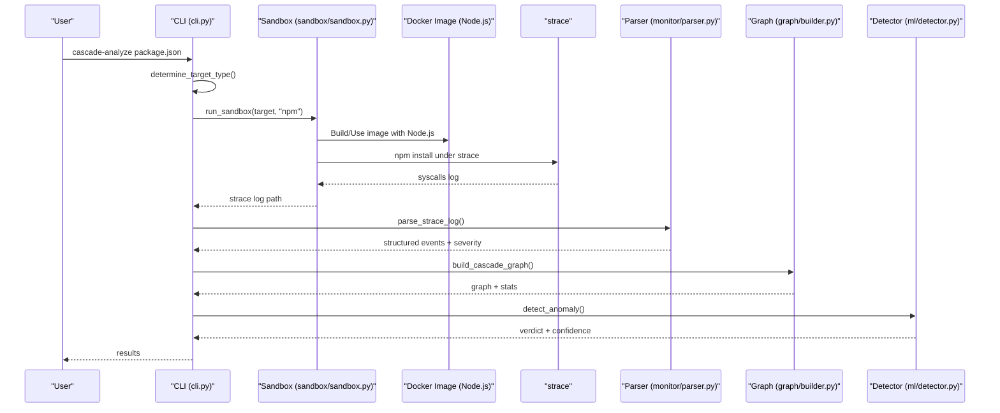
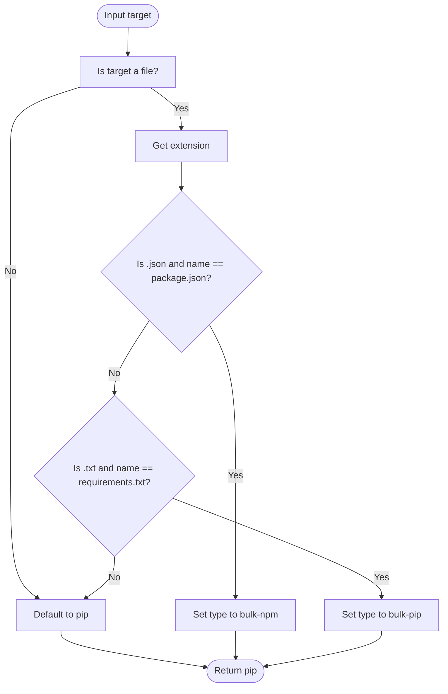
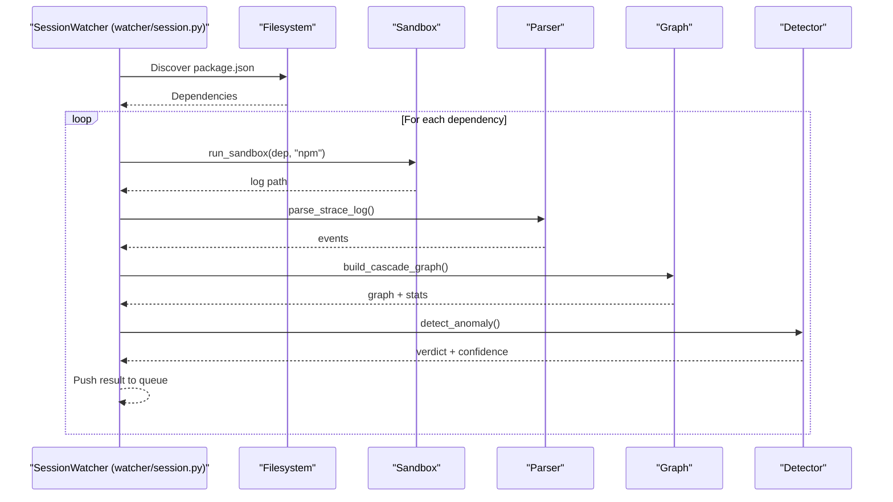
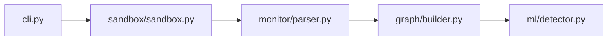

# npm Package Analysis

<cite>
**Referenced Files in This Document**
- [README.md](file://README.md)
- [cli.py](file://cli.py)
- [sandbox.py](file://sandbox/sandbox.py)
- [parser.py](file://monitor/parser.py)
- [session.py](file://watcher/session.py)
- [Dockerfile](file://sandbox/Dockerfile)
- [builder.py](file://graph/builder.py)
- [detector.py](file://ml/detector.py)
</cite>

## Table of Contents
1. [Introduction](#introduction)
2. [Project Structure](#project-structure)
3. [Core Components](#core-components)
4. [Architecture Overview](#architecture-overview)
5. [Detailed Component Analysis](#detailed-component-analysis)
6. [Dependency Analysis](#dependency-analysis)
7. [Performance Considerations](#performance-considerations)
8. [Troubleshooting Guide](#troubleshooting-guide)
9. [Conclusion](#conclusion)
10. [Appendices](#appendices)

## Introduction
This document explains how npm package analysis is implemented in the repository, focusing on:
- Automatic detection of npm targets using the CLI’s target-type determination logic
- The bulk analysis pipeline for package.json files
- Sandbox execution parameters for npm packages, including Node.js environment setup, network handling, and registry interaction simulation
- Strace log parsing specifics for npm installations, including distinctions between npm, node-gyp, Python compilation, and network syscalls
- Practical examples for analyzing popular npm packages
- Cross-platform considerations, Node.js version compatibility, and native module compilation scenarios

## Project Structure
The npm analysis pipeline spans several modules:
- CLI orchestrator determines target type and coordinates bulk analysis
- Sandbox executes npm installs in a Docker container with strace
- Parser interprets strace logs into structured events and severity scores
- Graph builder constructs a NetworkX/Cytoscape graph for visualization and ML consumption
- ML detector combines model predictions with severity and temporal signals

**Diagram sources**
- [cli.py:111-124](file://cli.py#L111-L124)
- [sandbox.py:177-230](file://sandbox/sandbox.py#L177-L230)
- [parser.py:342-682](file://monitor/parser.py#L342-L682)
- [builder.py:8-196](file://graph/builder.py#L8-L196)
- [detector.py:235-300](file://ml/detector.py#L235-L300)

**Section sources**
- [README.md:95-123](file://README.md#L95-L123)
- [cli.py:111-124](file://cli.py#L111-L124)
- [sandbox.py:177-230](file://sandbox/sandbox.py#L177-L230)
- [parser.py:342-682](file://monitor/parser.py#L342-L682)
- [builder.py:8-196](file://graph/builder.py#L8-L196)
- [detector.py:235-300](file://ml/detector.py#L235-L300)

## Core Components
- Target type detection: The CLI determines whether a target is an npm package manifest (package.json) and routes it to the npm pipeline.
- Sandbox execution: The sandbox builds a Node.js-enabled image, performs an npm install under strace, and drops network connectivity after a dry-run.
- Strace parsing: The parser reconstructs multi-line syscalls, classifies network destinations, flags sensitive file access, and computes severity scores.
- Graph and ML: The graph encodes process, file, and network nodes with severity and signature tags; the ML detector augments model predictions with severity and temporal signals.

**Section sources**
- [cli.py:111-124](file://cli.py#L111-L124)
- [sandbox.py:177-230](file://sandbox/sandbox.py#L177-L230)
- [parser.py:342-682](file://monitor/parser.py#L342-L682)
- [builder.py:8-196](file://graph/builder.py#L8-L196)
- [detector.py:235-300](file://ml/detector.py#L235-L300)

## Architecture Overview
The npm analysis architecture integrates Docker-based sandboxing, strace instrumentation, and behavioral analysis.

**Diagram sources**
- [cli.py:111-124](file://cli.py#L111-L124)
- [sandbox.py:177-230](file://sandbox/sandbox.py#L177-L230)
- [parser.py:342-682](file://monitor/parser.py#L342-L682)
- [builder.py:8-196](file://graph/builder.py#L8-L196)
- [detector.py:235-300](file://ml/detector.py#L235-L300)

## Detailed Component Analysis

### Target Type Detection for npm
- The CLI’s target-type detection logic identifies a file named package.json and assigns it to the “bulk-npm” category, enabling bulk analysis of npm dependencies.
- Bulk mode reads a manifest file and iterates over dependencies, invoking the npm pipeline for each.

**Diagram sources**
- [cli.py:111-124](file://cli.py#L111-L124)

**Section sources**
- [cli.py:111-124](file://cli.py#L111-L124)

### Sandbox Execution Parameters for npm
- The sandbox builds a Node.js-enabled image and runs npm install under strace. Network is dropped after a dry-run to simulate restricted environments.
- The sandbox supports timeouts tailored to the target type and extracts the strace log for downstream analysis.

Key sandbox behaviors for npm:
- Node.js and npm presence in the image
- Dry-run to resolve dependencies without network
- Network drop via interface manipulation
- strace -f with comprehensive syscall tracing
- Log extraction and filtering for EXE mode (not applicable to npm)

**Section sources**
- [sandbox.py:177-230](file://sandbox/sandbox.py#L177-L230)
- [Dockerfile:1-11](file://sandbox/Dockerfile#L1-L11)

### Strace Log Parsing Differences for npm Installations
The parser reconstructs multi-line syscalls, classifies network destinations, and flags suspicious behavior. For npm installs, the following syscall categories are most relevant:
- Process creation/execve: npm, node, and build tools
- File access/openat: Node.js cache, npm cache, and temporary build artifacts
- Network/connect: Registry and CDN endpoints
- Memory/syscalls: mmap/mprotect for JIT or native module loading
- DNS/getaddrinfo: Resolution of registry domains

Distinctions by subsystem:
- npm vs node-gyp vs Python compilation vs network syscalls
  - npm: execve of npm/node; connect to known registry ranges; openat of npm cache
  - node-gyp/Python: execve of Python or node-gyp; potential compile syscalls
  - network: connect to registry ranges is treated as benign; others are scored accordingly

Severity and flags:
- Execve of unexpected binaries triggers severity adjustments
- Access to sensitive files (e.g., .env, .npmrc) increases severity
- Suspicious network destinations (private IPs, cloud metadata, suspicious ports) elevate risk
- Dup2 after connect indicates reverse shell patterns
- Raw sockets and DNS lookups are tracked for behavioral profiling

**Section sources**
- [parser.py:342-682](file://monitor/parser.py#L342-L682)

### Bulk Analysis Pipeline for package.json
The watcher discovers package.json files and extracts dependencies for analysis:
- Reads dependencies and devDependencies
- Iterates over each dependency and runs the npm sandbox pipeline
- Streams results and maintains a session state

**Diagram sources**
- [session.py:350-395](file://watcher/session.py#L350-L395)
- [session.py:277-327](file://watcher/session.py#L277-L327)

**Section sources**
- [session.py:350-395](file://watcher/session.py#L350-L395)
- [session.py:277-327](file://watcher/session.py#L277-L327)

### Practical Examples: Analyzing Popular npm Packages
- @babel/core: Typical npm install with transitive dependencies; expect node, npm, and build tools in execve; registry connections benign; sensitive file access unlikely unless misconfigured
- express: Pure JS dependency; minimal native build; focus on registry traffic and file cache usage
- react: No native build; primarily network and cache syscalls
- webpack: May trigger node-gyp for native dependencies; watch for Python and node-gyp execves and compile-related syscalls

Guidance:
- Use the CLI to force npm analysis for package.json manifests
- Review flagged behaviors and temporal patterns for suspicious sequences
- Combine ML confidence with severity and signature matches for a robust verdict

**Section sources**
- [README.md:95-123](file://README.md#L95-L123)
- [cli.py:264-375](file://cli.py#L264-L375)

### Cross-Platform Considerations and Node.js Compatibility
- The sandbox runs inside a Linux container; macOS/Windows require Docker to emulate Linux
- Node.js and npm are installed in the sandbox image; ensure compatibility with the target package’s engines field
- Native module compilation (node-gyp/Python) is supported; monitor execve of Python and node-gyp and associated compile syscalls
- Network restrictions apply uniformly; registry endpoints are classified as benign to avoid false positives

**Section sources**
- [README.md:330-339](file://README.md#L330-L339)
- [Dockerfile:1-11](file://sandbox/Dockerfile#L1-L11)
- [parser.py:84-122](file://monitor/parser.py#L84-L122)

## Dependency Analysis
The npm analysis pipeline depends on:
- CLI for orchestration and target-type routing
- Sandbox for containerized execution and strace capture
- Parser for syscall reconstruction and classification
- Graph builder for event graph construction
- ML detector for anomaly classification and confidence adjustment

**Diagram sources**
- [cli.py:182-262](file://cli.py#L182-L262)
- [sandbox.py:177-230](file://sandbox/sandbox.py#L177-L230)
- [parser.py:342-682](file://monitor/parser.py#L342-L682)
- [builder.py:8-196](file://graph/builder.py#L8-L196)
- [detector.py:235-300](file://ml/detector.py#L235-L300)

**Section sources**
- [cli.py:182-262](file://cli.py#L182-L262)
- [sandbox.py:177-230](file://sandbox/sandbox.py#L177-L230)
- [parser.py:342-682](file://monitor/parser.py#L342-L682)
- [builder.py:8-196](file://graph/builder.py#L8-L196)
- [detector.py:235-300](file://ml/detector.py#L235-L300)

## Performance Considerations
- strace -f tracing increases overhead; the sandbox applies targeted syscall tracing for MCP servers but uses broader tracing for npm installs
- Container timeouts vary by target type; npm installs are generally faster than EXE analysis
- Severity scoring and temporal pattern detection provide quick heuristics to reduce reliance on ML for early decisions

[No sources needed since this section provides general guidance]

## Troubleshooting Guide
Common issues and resolutions:
- Docker not running: The CLI checks for Docker availability and provides OS-specific guidance
- Sandbox failures: Inspect returned log paths and container exit codes; review stderr logs for diagnostics
- Empty or minimal strace logs: Indicates no syscalls were captured; verify target type and manifest correctness
- Unexpected benign registry flags: Registry destinations are intentionally treated as benign; adjust expectations accordingly

**Section sources**
- [cli.py:74-111](file://cli.py#L74-L111)
- [sandbox.py:257-344](file://sandbox/sandbox.py#L257-L344)
- [parser.py:246-318](file://monitor/parser.py#L246-L318)

## Conclusion
The npm package analysis pipeline leverages a Node.js-enabled sandbox, comprehensive strace instrumentation, and behavioral analysis to detect suspicious npm installations. The CLI’s target-type detection and bulk analysis capabilities enable scalable analysis of package manifests, while the parser and graph pipeline provide actionable insights. Severity-weighted scoring and temporal pattern detection enhance ML predictions, yielding robust verdicts for popular packages like @babel/core, express, react, and webpack.

[No sources needed since this section summarizes without analyzing specific files]

## Appendices

### Appendix A: Supported Targets and npm Notes
- npm packages are supported with Node.js in the sandbox image and network dropped after a dry-run
- Bulk analysis supports both requirements.txt and package.json manifests

**Section sources**
- [README.md:95-123](file://README.md#L95-L123)