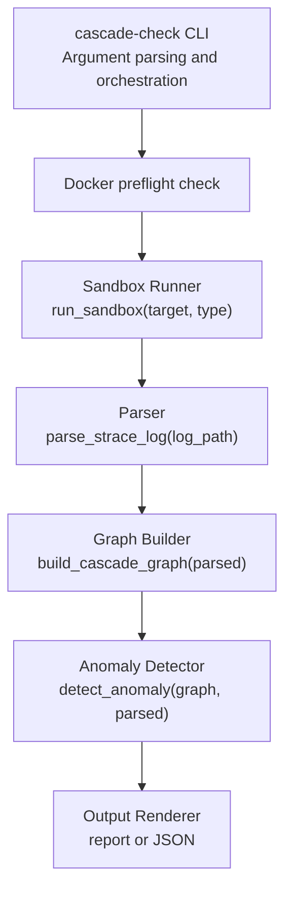
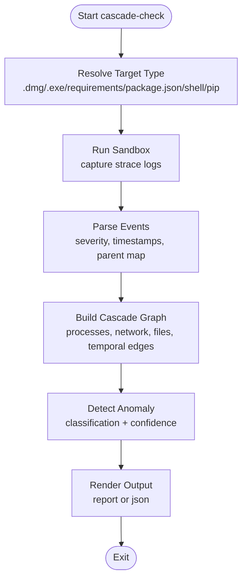
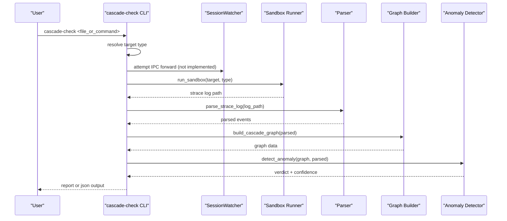

# Cascade-Check Command

<cite>
**Referenced Files in This Document**
- [cli.py](file://cli.py)
- [session.py](file://watcher/session.py)
- [sandbox.py](file://sandbox/sandbox.py)
- [parser.py](file://monitor/parser.py)
- [builder.py](file://graph/builder.py)
- [shell_hook.sh](file://hooks/shell_hook.sh)
- [setup.py](file://setup.py)
- [pyproject.toml](file://pyproject.toml)
</cite>

## Table of Contents
1. [Introduction](#introduction)
2. [Command Syntax and Options](#command-syntax-and-options)
3. [Architecture Overview](#architecture-overview)
4. [Core Components](#core-components)
5. [Processing Logic](#processing-logic)
6. [Integration with SessionWatcher](#integration-with-sessionwatcher)
7. [Output Formats](#output-formats)
8. [Practical Examples](#practical-examples)
9. [Comparison: cascade-check vs cascade-watch](#comparison-cascade-check-vs-cascade-watch)
10. [Troubleshooting Guide](#troubleshooting-guide)
11. [Conclusion](#conclusion)

## Introduction
The cascade-check command provides a quick on-demand analysis of specific files or commands within a repository. It enables rapid triage by performing a focused sandbox → parse → graph → anomaly detection pipeline without starting a full monitoring session. This makes it ideal for investigating individual files, specific commands, or problem areas identified during ongoing monitoring.

## Command Syntax and Options
- Command: `cascade-check <file_or_command> [--output report|json]`
- Arguments:
  - `file_or_command`: Path to a file or command to analyze. Accepts absolute or relative paths.
- Options:
  - `--output`, `-o`: Output format selector.
    - `report` (default): Rich console report with formatted panels and spider mascot.
    - `json`: Structured JSON output for programmatic consumption.

The command supports multiple target types inferred from the file extension or manifest:
- `.dmg`: macOS disk image analysis
- `.exe/.msi`: Windows executable analysis under Wine
- `requirements.txt`: Python pip package installation
- `package.json`: Node.js npm package installation
- Shell scripts (`.sh`, `.bash`) and other executables
- Default fallback: Python pip installation

**Section sources**
- [cli.py:1247-1258](file://cli.py#L1247-L1258)
- [cli.py:1013-1018](file://cli.py#L1013-L1018)
- [cli.py:1051-1069](file://cli.py#L1051-L1069)

## Architecture Overview
The cascade-check command executes a streamlined version of the full analysis pipeline. It leverages the same underlying modules but avoids the overhead of a persistent monitoring session.

**Diagram sources**
- [cli.py:1013-1018](file://cli.py#L1013-L1018)
- [cli.py:1070-1082](file://cli.py#L1070-L1082)
- [sandbox.py:184-200](file://sandbox/sandbox.py#L184-L200)
- [parser.py:1-200](file://monitor/parser.py#L1-L200)
- [builder.py:8-196](file://graph/builder.py#L8-L196)

## Core Components
- CLI Entrypoint: Parses arguments, resolves target type, and orchestrates the analysis.
- Sandbox Runner: Executes the target in a Docker sandbox and captures syscalls via strace.
- Parser: Converts raw strace logs into structured event data with severity and temporal attributes.
- Graph Builder: Constructs a directed graph of processes, network connections, and file operations.
- Anomaly Detector: Applies machine learning classification to determine maliciousness.
- Output Renderer: Produces either a rich console report or JSON for automation.

**Section sources**
- [cli.py:1013-1018](file://cli.py#L1013-L1018)
- [cli.py:1070-1082](file://cli.py#L1070-L1082)
- [sandbox.py:184-200](file://sandbox/sandbox.py#L184-L200)
- [parser.py:1-200](file://monitor/parser.py#L1-L200)
- [builder.py:8-196](file://graph/builder.py#L8-L196)

## Processing Logic
The cascade-check command follows a deterministic flow for on-demand analysis:

Key behaviors:
- If a SessionWatcher is already active for the current directory, the command falls back to a one-off analysis (IPC forwarding is not yet implemented).
- The pipeline mirrors the full analysis but runs in a single-threaded, non-blocking manner appropriate for ad-hoc checks.

**Diagram sources**
- [cli.py:1013-1018](file://cli.py#L1013-L1018)
- [cli.py:1051-1069](file://cli.py#L1051-L1069)
- [cli.py:1070-1082](file://cli.py#L1070-L1082)

**Section sources**
- [cli.py:1013-1018](file://cli.py#L1013-L1018)
- [cli.py:1051-1069](file://cli.py#L1051-L1069)
- [cli.py:1070-1082](file://cli.py#L1070-L1082)

## Integration with SessionWatcher
While cascade-check performs a one-off analysis, it integrates conceptually with the SessionWatcher infrastructure:

- SessionGuardian: Provides on-demand scanning capability via `SessionWatcher.check_path(...)`, which runs a focused sandbox → parse → graph → ML pipeline and returns structured results.
- cascade-check Behavior: When invoked, it attempts to forward the check to an active watcher (not implemented) and falls back to a local one-off run. This preserves the same underlying pipeline used by the watch command’s deep scans.

**Diagram sources**
- [cli.py:1013-1018](file://cli.py#L1013-L1018)
- [cli.py:1051-1069](file://cli.py#L1051-L1069)
- [cli.py:1070-1082](file://cli.py#L1070-L1082)
- [session.py:128-196](file://watcher/session.py#L128-L196)

**Section sources**
- [cli.py:1013-1018](file://cli.py#L1013-L1018)
- [session.py:128-196](file://watcher/session.py#L128-L196)

## Output Formats
- report (default): Rich console output with:
  - Final verdict panel (MALICIOUS or CLEAN) with confidence percentage
  - Flagged behaviors summary
  - Spider mascot rendering
  - Horizontal separator for readability
- json: Structured JSON containing:
  - Classification result (malicious, confidence)
  - Parsed events and graph statistics
  - Log path reference

The JSON output is useful for automation, CI/CD integration, or external tooling that consumes structured data.

**Section sources**
- [cli.py:1083-1102](file://cli.py#L1083-L1102)
- [cli.py:1094-1102](file://cli.py#L1094-L1102)

## Practical Examples
- Check a Python setup script:
  - `cascade-check setup.py --output report`
- Analyze a Node.js project manifest:
  - `cascade-check package.json --output json`
- Investigate a Windows installer:
  - `cascade-check installer.exe --output report`
- Validate a shell script:
  - `cascade-check scripts/deploy.sh --output json`
- Focus on a specific file within a repository:
  - `cascade-check src/utils/helpers.py --output report`

These examples demonstrate how cascade-check targets differ file types and returns either a human-readable report or machine-parseable JSON.

**Section sources**
- [cli.py:1051-1069](file://cli.py#L1051-L1069)
- [cli.py:1083-1102](file://cli.py#L1083-L1102)

## Comparison: cascade-check vs cascade-watch
- cascade-check:
  - Purpose: On-demand, targeted analysis of specific files or commands
  - Scope: Single-run, no persistent session
  - Output: report or json
  - Best for: Rapid triage, spot checks, incident response
- cascade-watch:
  - Purpose: Continuous monitoring of a repository with background analysis
  - Scope: Persistent session with discovery of packages and streaming results
  - Output: report or json (via --output)
  - Best for: Live monitoring, continuous security posture

Use cascade-check for immediate, isolated investigations. Use cascade-watch when you need ongoing surveillance of a repository and want to leverage the SessionWatcher’s discovery and result streaming capabilities.

**Section sources**
- [cli.py:1232-1244](file://cli.py#L1232-L1244)
- [cli.py:835-851](file://cli.py#L835-L851)
- [session.py:128-196](file://watcher/session.py#L128-L196)

## Troubleshooting Guide
- Docker not available or unreachable:
  - The command performs a preflight check and exits with guidance if Docker is missing or the daemon is not running.
  - Resolution: Install Docker for your platform and start the Docker service.
- Sandbox failure:
  - If the sandbox cannot produce a strace log, the command reports an error and suggests verifying Docker availability.
  - Resolution: Ensure Docker is healthy and retry.
- Active session conflict:
  - If a SessionWatcher is already running for the current directory, the command informs you and suggests using cascade-check for on-demand scanning.
  - Resolution: Stop the existing watcher or run cascade-check for a focused investigation.

**Section sources**
- [cli.py:74-111](file://cli.py#L74-L111)
- [cli.py:1070-1074](file://cli.py#L1070-L1074)
- [cli.py:870-882](file://cli.py#L870-L882)

## Conclusion
The cascade-check command delivers a fast, focused analysis workflow by leveraging the same robust pipeline used by cascade-watch. It supports multiple target types, flexible output formats, and integrates conceptually with the SessionWatcher infrastructure. Prefer cascade-check for quick investigations and cascade-watch for continuous repository monitoring.