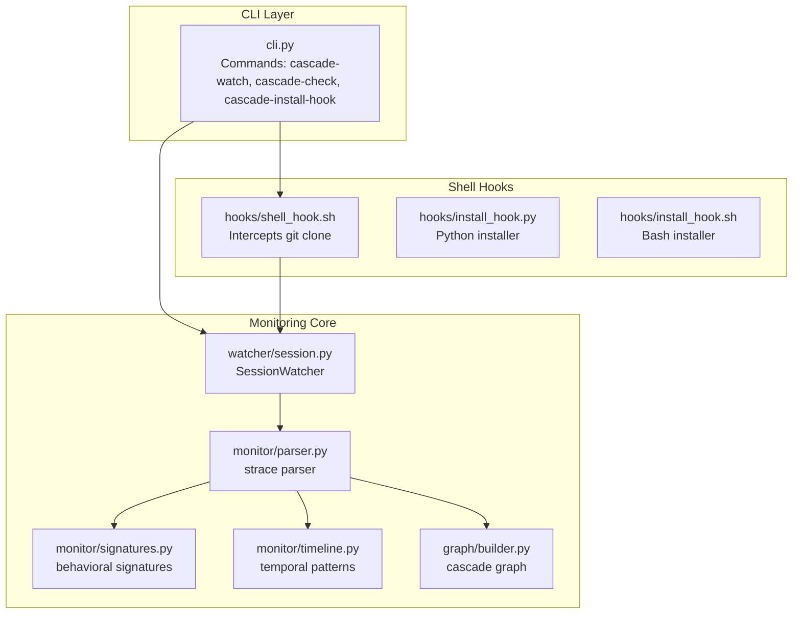
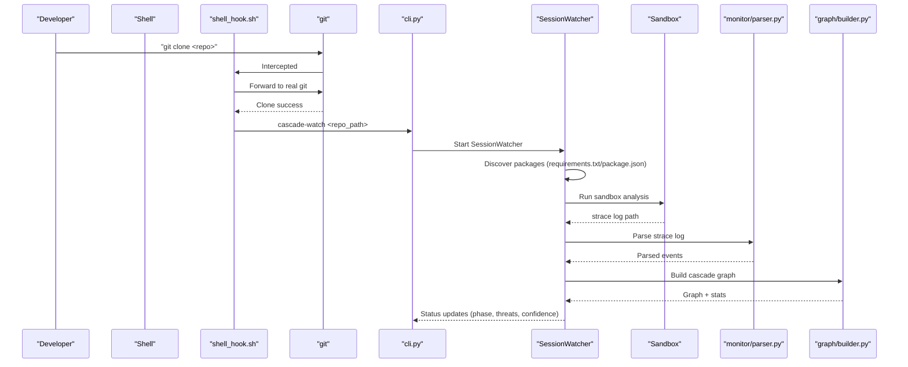
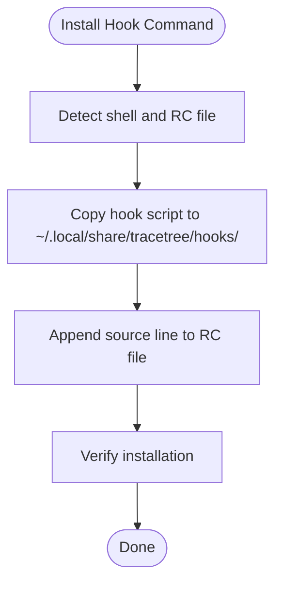
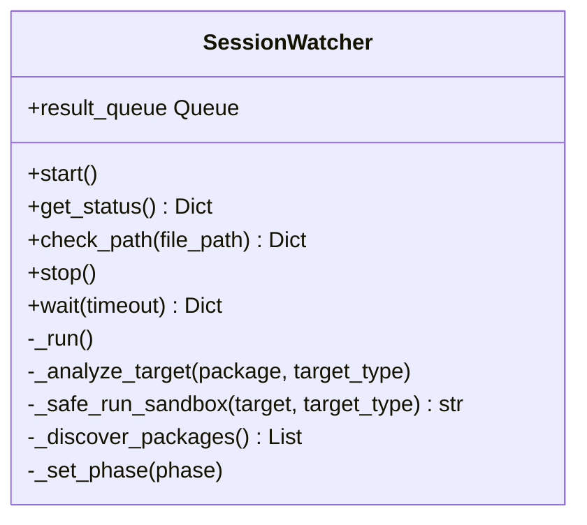
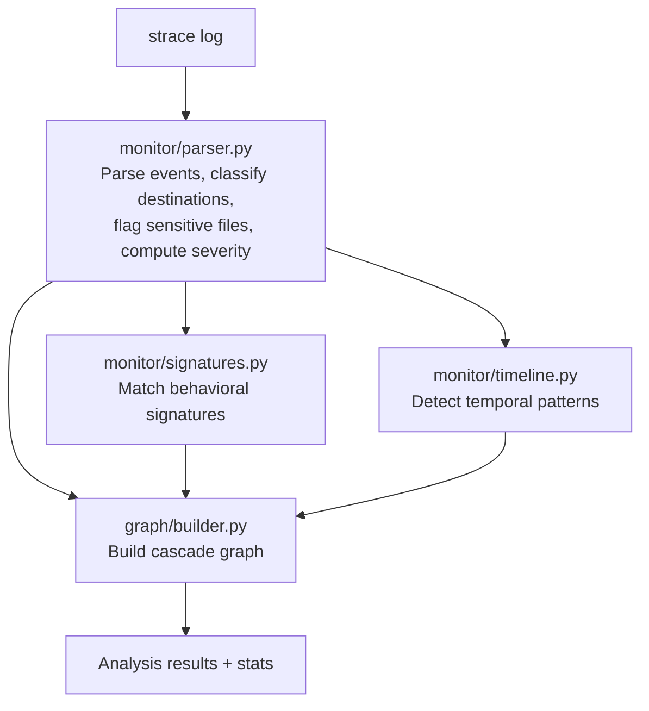
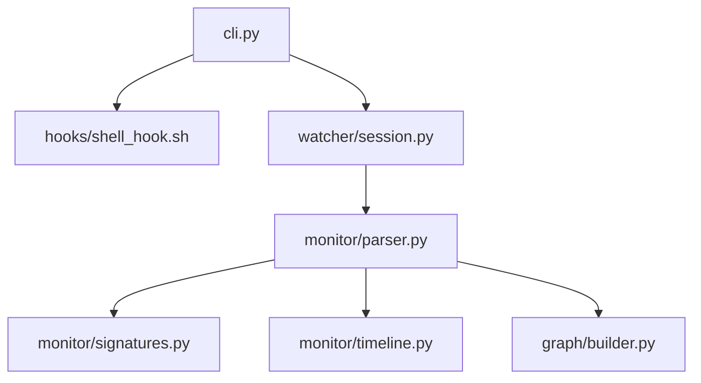

# Automatic Monitoring Capabilities

<cite>
**Referenced Files in This Document**
- [cli.py](file://cli.py)
- [hooks/install_hook.py](file://hooks/install_hook.py)
- [hooks/install_hook.sh](file://hooks/install_hook.sh)
- [hooks/shell_hook.sh](file://hooks/shell_hook.sh)
- [watcher/session.py](file://watcher/session.py)
- [monitor/parser.py](file://monitor/parser.py)
- [monitor/signatures.py](file://monitor/signatures.py)
- [monitor/timeline.py](file://monitor/timeline.py)
- [graph/builder.py](file://graph/builder.py)
- [README.md](file://README.md)
</cite>

## Table of Contents
1. [Introduction](#introduction)
2. [Project Structure](#project-structure)
3. [Core Components](#core-components)
4. [Architecture Overview](#architecture-overview)
5. [Detailed Component Analysis](#detailed-component-analysis)
6. [Dependency Analysis](#dependency-analysis)
7. [Performance Considerations](#performance-considerations)
8. [Troubleshooting Guide](#troubleshooting-guide)
9. [Conclusion](#conclusion)

## Introduction
This document explains the automatic monitoring capabilities enabled by the cascade-install-hook command. It details how the hook system intercepts and monitors repository activities, including git operations, package installations, and dependency resolution. It also documents the integration with the SessionWatcher system for continuous monitoring, practical monitoring scenarios, configuration options, filtering capabilities, notification mechanisms, performance considerations, and monitoring scope customization.

## Project Structure
The monitoring system spans several modules:
- CLI entry points for cascade-watch, cascade-check, and cascade-install-hook
- Shell hook installation and interception logic
- SessionWatcher for continuous repository monitoring
- Monitoring pipeline: parser, signatures, timeline, graph builder, and ML detector
- Sandbox orchestration for runtime tracing

**Diagram sources**
- [cli.py:1-1274](file://cli.py#L1-L1274)
- [hooks/shell_hook.sh:1-93](file://hooks/shell_hook.sh#L1-L93)
- [hooks/install_hook.py:1-129](file://hooks/install_hook.py#L1-L129)
- [hooks/install_hook.sh:1-60](file://hooks/install_hook.sh#L1-L60)
- [watcher/session.py:1-418](file://watcher/session.py#L1-L418)
- [monitor/parser.py:1-682](file://monitor/parser.py#L1-L682)
- [monitor/signatures.py:1-488](file://monitor/signatures.py#L1-L488)
- [monitor/timeline.py:1-353](file://monitor/timeline.py#L1-L353)
- [graph/builder.py:1-196](file://graph/builder.py#L1-L196)

**Section sources**
- [README.md:306-329](file://README.md#L306-L329)

## Core Components
- cascade-install-hook: Installs a shell hook that runs cascade-watch automatically after every git clone.
- cascade-watch: Runs the SessionWatcher to continuously monitor a repository directory for package manifests and triggers sandbox analysis.
- cascade-check: Performs on-demand scans of specific files or commands.
- SessionWatcher: Background daemon that discovers packages, runs sandbox analysis, parses strace logs, builds graphs, and classifies anomalies.
- Parser: Parses strace logs, extracts events, classifies destinations, flags sensitive files, and computes severity scores.
- Signatures: Matches parsed events against behavioral signatures.
- Timeline: Detects temporal patterns from timestamped event streams.
- Graph Builder: Constructs a NetworkX directed graph with process, file, and network nodes and temporal edges.

**Section sources**
- [cli.py:1105-1131](file://cli.py#L1105-L1131)
- [cli.py:835-1001](file://cli.py#L835-L1001)
- [cli.py:1003-1103](file://cli.py#L1003-L1103)
- [watcher/session.py:29-418](file://watcher/session.py#L29-L418)
- [monitor/parser.py:342-682](file://monitor/parser.py#L342-L682)
- [monitor/signatures.py:57-488](file://monitor/signatures.py#L57-L488)
- [monitor/timeline.py:298-353](file://monitor/timeline.py#L298-L353)
- [graph/builder.py:8-196](file://graph/builder.py#L8-L196)

## Architecture Overview
The automatic monitoring architecture integrates shell hooks with the SessionWatcher to intercept repository cloning and continuously monitor for package installations and dependency changes.

**Diagram sources**
- [hooks/shell_hook.sh:27-86](file://hooks/shell_hook.sh#L27-L86)
- [cli.py:835-1001](file://cli.py#L835-L1001)
- [watcher/session.py:237-396](file://watcher/session.py#L237-L396)
- [monitor/parser.py:342-682](file://monitor/parser.py#L342-L682)
- [graph/builder.py:8-196](file://graph/builder.py#L8-L196)

## Detailed Component Analysis

### Shell Hook Installation and Interception
The cascade-install-hook command installs a shell hook that wraps the git command to automatically start the SessionWatcher after successful git clone operations. The installer supports both Python and Bash variants to detect shells and append the appropriate source line to the user’s shell RC file.

Key behaviors:
- Detects shell (bash/zsh) and determines RC file path
- Copies hook script to ~/.local/share/tracetree/hooks/
- Appends a source line to the RC file
- Wraps git to intercept clone operations and start cascade-watch in the background

**Diagram sources**
- [hooks/install_hook.py:29-119](file://hooks/install_hook.py#L29-L119)
- [hooks/install_hook.sh:10-59](file://hooks/install_hook.sh#L10-L59)

**Section sources**
- [cli.py:1105-1131](file://cli.py#L1105-L1131)
- [hooks/install_hook.py:1-129](file://hooks/install_hook.py#L1-L129)
- [hooks/install_hook.sh:1-60](file://hooks/install_hook.sh#L1-L60)
- [hooks/shell_hook.sh:1-93](file://hooks/shell_hook.sh#L1-L93)

### SessionWatcher Integration and Continuous Monitoring
The SessionWatcher runs in a background daemon thread and continuously monitors a repository directory for package manifests. It discovers packages by scanning for requirements.txt, package.json, setup.py, and pyproject.toml, then runs sandbox analysis for each target. Results are exposed via get_status() and a result queue.

Key behaviors:
- Background thread with phase tracking (idle, cloning, sandboxing, analyzing, done, error, stopped)
- Lockfile-based session management to prevent concurrent watchers
- On-demand check_path() for targeted scans
- Result queue for push-style notifications

**Diagram sources**
- [watcher/session.py:29-418](file://watcher/session.py#L29-L418)

**Section sources**
- [watcher/session.py:1-418](file://watcher/session.py#L1-L418)
- [cli.py:835-1001](file://cli.py#L835-L1001)

### Monitoring Pipeline: Parser, Signatures, Timeline, Graph
The monitoring pipeline transforms strace logs into actionable insights:
- Parser: Multi-line strace reassembly, syscall classification, destination categorization, sensitive file detection, severity scoring, and timestamp handling
- Signatures: Pattern matching against behavioral signatures with evidence collection
- Timeline: Detection of temporal patterns from timestamped event streams
- Graph Builder: Construction of NetworkX graphs with process, file, and network nodes and temporal edges

**Diagram sources**
- [monitor/parser.py:342-682](file://monitor/parser.py#L342-L682)
- [monitor/signatures.py:86-488](file://monitor/signatures.py#L86-L488)
- [monitor/timeline.py:298-353](file://monitor/timeline.py#L298-L353)
- [graph/builder.py:8-196](file://graph/builder.py#L8-L196)

**Section sources**
- [monitor/parser.py:1-682](file://monitor/parser.py#L1-L682)
- [monitor/signatures.py:1-488](file://monitor/signatures.py#L1-L488)
- [monitor/timeline.py:1-353](file://monitor/timeline.py#L1-L353)
- [graph/builder.py:1-196](file://graph/builder.py#L1-L196)

### Practical Monitoring Scenarios
- Automatic analysis of new commits: The shell hook triggers cascade-watch after git clone, enabling continuous monitoring of newly cloned repositories.
- Dependency changes: SessionWatcher discovers package manifests and runs sandbox analysis on detected dependencies.
- Package installations: The monitoring pipeline captures installation behavior, flags suspicious syscalls, and classifies anomalies.

**Section sources**
- [hooks/shell_hook.sh:27-86](file://hooks/shell_hook.sh#L27-L86)
- [watcher/session.py:350-395](file://watcher/session.py#L350-L395)
- [cli.py:835-1001](file://cli.py#L835-L1001)

### Monitoring Configuration Options and Filtering
Configuration and filtering capabilities include:
- Session lock management to prevent concurrent watchers per directory
- On-demand scanning via cascade-check for targeted analysis
- Behavioral signature matching with severity thresholds and evidence collection
- Temporal pattern detection with configurable windows and severities
- Graph statistics and signature tagging for downstream analysis

**Section sources**
- [cli.py:767-821](file://cli.py#L767-L821)
- [monitor/signatures.py:86-488](file://monitor/signatures.py#L86-L488)
- [monitor/timeline.py:298-353](file://monitor/timeline.py#L298-L353)
- [graph/builder.py:8-196](file://graph/builder.py#L8-L196)

### Notification Mechanisms
Notification mechanisms include:
- Live status polling with phase indicators and confidence scores
- Result queue for push-style updates
- Terminal-based spider mascot feedback
- Structured output panels for flagged behaviors, temporal patterns, and final verdicts

**Section sources**
- [watcher/session.py:116-127](file://watcher/session.py#L116-L127)
- [watcher/session.py:407-418](file://watcher/session.py#L407-L418)
- [cli.py:935-1001](file://cli.py#L935-L1001)

## Dependency Analysis
The monitoring system exhibits clear separation of concerns:
- CLI orchestrates commands and user interactions
- Shell hooks provide transparent interception of git operations
- SessionWatcher encapsulates monitoring logic and state
- Monitoring pipeline modules operate independently but cooperatively
- Graph builder depends on parsed data and signature matches

**Diagram sources**
- [cli.py:1-1274](file://cli.py#L1-L1274)
- [hooks/shell_hook.sh:1-93](file://hooks/shell_hook.sh#L1-L93)
- [watcher/session.py:1-418](file://watcher/session.py#L1-L418)
- [monitor/parser.py:1-682](file://monitor/parser.py#L1-L682)
- [monitor/signatures.py:1-488](file://monitor/signatures.py#L1-L488)
- [monitor/timeline.py:1-353](file://monitor/timeline.py#L1-L353)
- [graph/builder.py:1-196](file://graph/builder.py#L1-L196)

**Section sources**
- [cli.py:1-1274](file://cli.py#L1-L1274)
- [watcher/session.py:1-418](file://watcher/session.py#L1-L418)

## Performance Considerations
- Background daemon threads keep the main application responsive
- Lockfile-based session management prevents resource contention
- Sandbox timeouts limit resource usage per analysis
- Graph construction and ML inference are optimized for throughput
- strace timestamps enable efficient temporal pattern detection

[No sources needed since this section provides general guidance]

## Troubleshooting Guide
Common issues and resolutions:
- Docker not installed or unreachable: Preflight checks require Docker availability
- Session already running: Use cascade-check for on-demand scans or stop the existing watcher
- Sandbox failures: Verify Docker is running and the sandbox image is built
- Parser errors: Ensure strace logs are readable and contain expected syscall entries

**Section sources**
- [cli.py:74-111](file://cli.py#L74-L111)
- [cli.py:869-881](file://cli.py#L869-L881)
- [watcher/session.py:328-348](file://watcher/session.py#L328-L348)
- [monitor/parser.py:378-387](file://monitor/parser.py#L378-L387)

## Conclusion
The cascade-install-hook command enables seamless automatic monitoring by integrating shell hooks with the SessionWatcher system. This integration intercepts git clone operations, launches continuous monitoring, and applies a comprehensive analysis pipeline to detect suspicious package installations and dependency changes. The modular design, robust configuration options, and notification mechanisms provide a powerful foundation for runtime behavioral analysis across diverse repository environments.