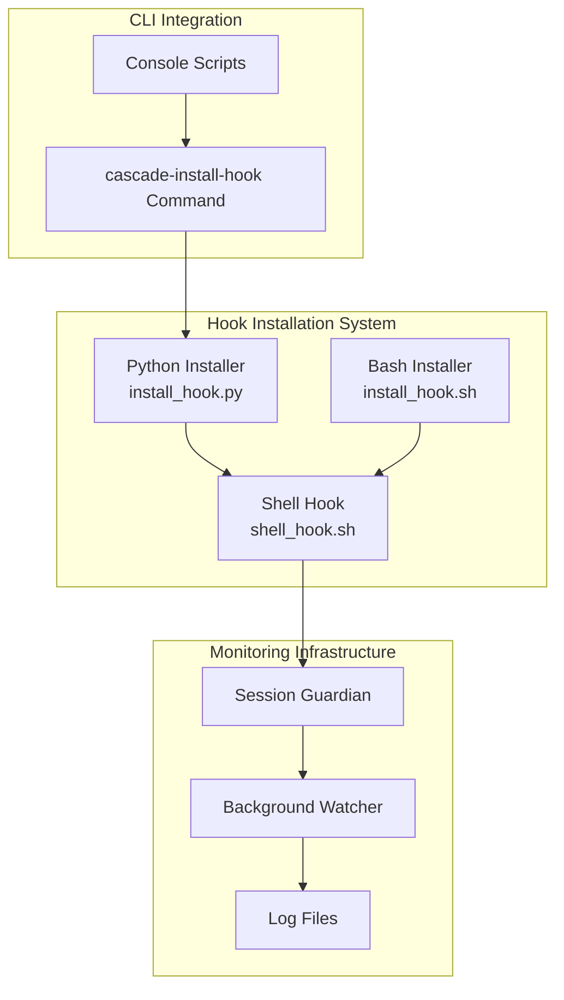
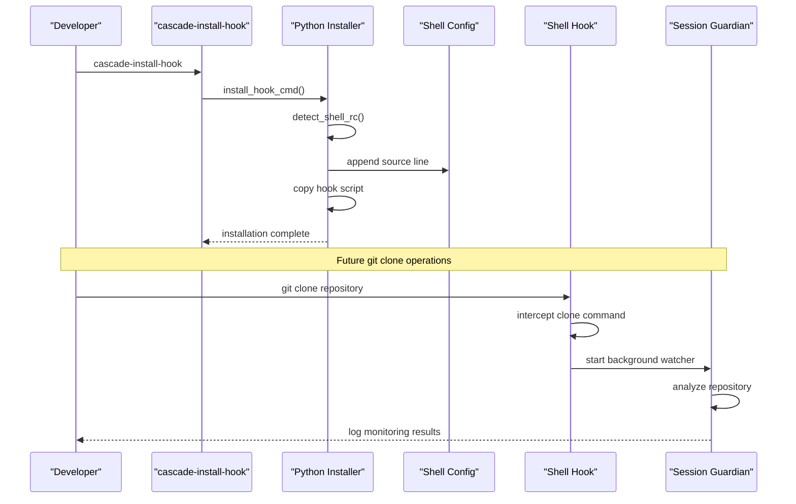
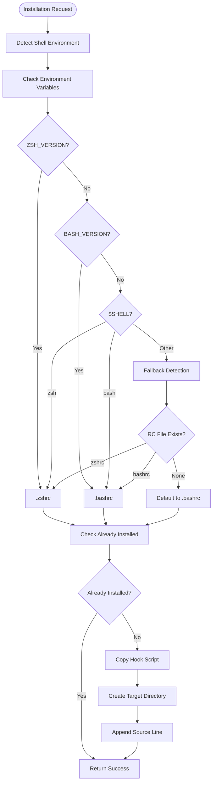
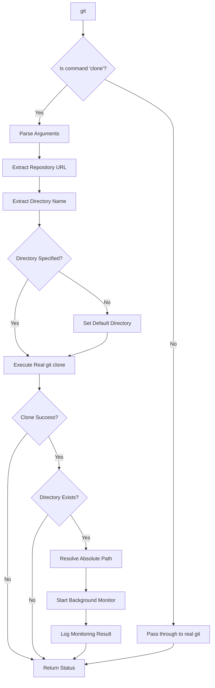

# Hook Installation Process

<cite>
**Referenced Files in This Document**
- [install_hook.py](file://hooks/install_hook.py)
- [install_hook.sh](file://hooks/install_hook.sh)
- [shell_hook.sh](file://hooks/shell_hook.sh)
- [cli.py](file://cli.py)
- [setup.py](file://setup.py)
- [README.md](file://README.md)
</cite>

## Table of Contents
1. [Introduction](#introduction)
2. [Project Structure](#project-structure)
3. [Core Components](#core-components)
4. [Architecture Overview](#architecture-overview)
5. [Detailed Component Analysis](#detailed-component-analysis)
6. [Installation Workflow](#installation-workflow)
7. [Verification and Troubleshooting](#verification-and-troubleshooting)
8. [Integration with TraceTree Monitoring System](#integration-with-tracetree-monitoring-system)
9. [Practical Installation Scenarios](#practical-installation-scenarios)
10. [Performance Considerations](#performance-considerations)
11. [Troubleshooting Guide](#troubleshooting-guide)
12. [Conclusion](#conclusion)

## Introduction

The TraceTree hook installation process establishes automatic repository monitoring through a sophisticated shell integration system. This system automatically monitors newly cloned repositories by intercepting `git clone` commands and launching background analysis sessions. The installation process involves three key components: a Python-based installer for cross-platform compatibility, a Bash shell hook that wraps the `git` command, and a comprehensive monitoring system that tracks package installations and runtime behavior.

The hook installation creates a seamless monitoring experience where developers receive immediate visibility into package installations and potential security risks without manual intervention. This automated approach significantly reduces the cognitive load on security analysts while maintaining comprehensive coverage of the development workflow.

## Project Structure

The hook installation system is organized around a modular architecture that separates concerns between installation, shell integration, and monitoring capabilities:



**Diagram sources**
- [install_hook.py:1-129](file://hooks/install_hook.py#L1-L129)
- [install_hook.sh:1-60](file://hooks/install_hook.sh#L1-L60)
- [shell_hook.sh:1-93](file://hooks/shell_hook.sh#L1-L93)
- [cli.py:1260-1270](file://cli.py#L1260-L1270)

**Section sources**
- [install_hook.py:1-129](file://hooks/install_hook.py#L1-L129)
- [install_hook.sh:1-60](file://hooks/install_hook.sh#L1-L60)
- [shell_hook.sh:1-93](file://hooks/shell_hook.sh#L1-L93)
- [cli.py:1260-1270](file://cli.py#L1260-L1270)

## Core Components

The hook installation system consists of three primary components that work together to provide seamless repository monitoring:

### Python Cross-Platform Installer
The Python installer provides robust cross-platform support for both macOS and Linux systems. It automatically detects the user's shell environment, copies the hook script to a standardized location, and appends the appropriate source line to the user's shell configuration file.

### Bash Shell Integration
The shell hook script wraps the `git` command to intercept `git clone` operations. When a repository is cloned, the hook automatically launches a background monitoring session that tracks package installations and runtime behavior.

### Console Script Integration
The system integrates seamlessly with the TraceTree CLI through dedicated console scripts that provide intuitive command-line interfaces for installation and monitoring.

**Section sources**
- [install_hook.py:71-119](file://hooks/install_hook.py#L71-L119)
- [shell_hook.sh:7-89](file://hooks/shell_hook.sh#L7-L89)
- [cli.py:1260-1270](file://cli.py#L1260-L1270)

## Architecture Overview

The hook installation architecture follows a layered approach that ensures compatibility across different shell environments while maintaining robust functionality:



**Diagram sources**
- [cli.py:1105-1131](file://cli.py#L1105-L1131)
- [install_hook.py:71-119](file://hooks/install_hook.py#L71-L119)
- [shell_hook.sh:27-86](file://hooks/shell_hook.sh#L27-L86)

The architecture ensures that installation is transparent to the user while providing comprehensive monitoring capabilities for all repository cloning activities.

## Detailed Component Analysis

### Python Installer Implementation

The Python installer provides sophisticated shell detection and installation capabilities:



**Diagram sources**
- [install_hook.py:29-59](file://hooks/install_hook.py#L29-L59)
- [install_hook.py:62-68](file://hooks/install_hook.py#L62-L68)
- [install_hook.py:71-119](file://hooks/install_hook.py#L71-L119)

The installer follows a hierarchical detection approach, prioritizing environment variables, shell path detection, and fallback mechanisms to ensure compatibility across diverse shell configurations.

### Shell Hook Activation Mechanism

The shell hook implements a sophisticated wrapper function that intercepts `git clone` operations while preserving all other `git` functionality:



**Diagram sources**
- [shell_hook.sh:27-86](file://hooks/shell_hook.sh#L27-L86)

The hook maintains a state variable to prevent multiple installations and includes comprehensive error handling for missing dependencies or unavailable commands.

**Section sources**
- [install_hook.py:29-119](file://hooks/install_hook.py#L29-L119)
- [shell_hook.sh:7-89](file://hooks/shell_hook.sh#L7-L89)

## Installation Workflow

The installation workflow follows a systematic approach that ensures reliable deployment across different environments:

### Step 1: Command Registration
The installation process begins with the registration of the `cascade-install-hook` command through the console scripts system. This integration allows users to invoke the installer directly from the command line.

### Step 2: Shell Detection and Validation
The installer performs comprehensive shell detection by checking environment variables, shell path information, and fallback mechanisms. This multi-layered approach ensures compatibility across various shell configurations and system setups.

### Step 3: Hook Script Deployment
The installer copies the shell hook script to a standardized location in the user's home directory (`~/.local/share/tracetree/hooks/`) and makes it executable. This centralized location simplifies maintenance and updates.

### Step 4: Configuration Integration
The installer appends a source line to the appropriate shell configuration file (`.bashrc` or `.zshrc`) with a distinctive marker for easy identification and future updates.

### Step 5: Verification and Activation
The installer verifies the installation by checking for the presence of the hook script and configuration entries, then provides clear instructions for activating the changes.

**Section sources**
- [cli.py:1105-1131](file://cli.py#L1105-L1131)
- [install_hook.py:71-119](file://hooks/install_hook.py#L71-L119)
- [install_hook.sh:10-59](file://hooks/install_hook.sh#L10-L59)

## Verification and Troubleshooting

### Installation Verification Process

The system provides multiple verification mechanisms to ensure successful installation:

1. **Shell Configuration Check**: The installer verifies that the appropriate source line exists in the detected shell configuration file
2. **Script Location Validation**: Confirmation that the hook script is properly copied to the target directory
3. **Executable Permissions**: Verification that the hook script has proper execute permissions
4. **Environment Compatibility**: Testing that required dependencies (git, cascade-watch) are available

### Common Installation Failures and Solutions

#### Shell Detection Issues
**Problem**: The installer cannot detect the user's shell environment
**Solution**: Manually specify the shell configuration file or source the hook script directly

#### Permission Denied Errors
**Problem**: Insufficient permissions to modify shell configuration files
**Solution**: Use appropriate privileges or manually edit the configuration file

#### Missing Dependencies
**Problem**: Required tools (git, cascade-watch) are not available
**Solution**: Install the missing dependencies or ensure they are in the system PATH

#### Conflicting Installations
**Problem**: Multiple hook installations causing conflicts
**Solution**: Remove duplicate entries and reinstall using the official installer

**Section sources**
- [install_hook.py:80-90](file://hooks/install_hook.py#L80-L90)
- [install_hook.py:62-68](file://hooks/install_hook.py#L62-L68)

## Integration with TraceTree Monitoring System

The hook installation seamlessly integrates with the broader TraceTree monitoring ecosystem:

### Session Management
The shell hook triggers the session guardian component that manages background monitoring sessions for each repository. The system maintains session locks to prevent concurrent monitoring of the same repository.

### Log Management
All monitoring activities are logged to timestamped files in the `/tmp` directory, allowing for comprehensive analysis and debugging of monitored activities.

### Resource Tracking
The monitoring system tracks resource usage during package installations, providing insights into memory consumption, disk usage, and file system changes.

### Background Processing
The system utilizes background processes to minimize impact on the user's development workflow while maintaining continuous monitoring capabilities.

**Section sources**
- [shell_hook.sh:77-78](file://hooks/shell_hook.sh#L77-L78)
- [cli.py:767-800](file://cli.py#L767-L800)

## Practical Installation Scenarios

### Development Environment Setup

For individual developers, the installation process is straightforward and requires minimal configuration:

1. **Basic Installation**: Run `cascade-install-hook` to automatically configure the shell integration
2. **Manual Verification**: Check that the hook script exists in `~/.local/share/tracetree/hooks/`
3. **Activation**: Source the shell configuration file or open a new terminal session

### CI/CD Pipeline Integration

For automated environments, the installation can be integrated into pipeline scripts:

```bash
# Add to CI pipeline setup
pip install -e .
cascade-install-hook
```

This approach ensures that all automated builds benefit from the monitoring capabilities without manual intervention.

### Multi-User Environments

In shared development environments, administrators can deploy the hook system centrally:

1. **System-wide Installation**: Deploy the hook system to a common location
2. **User Configuration**: Configure individual user preferences and permissions
3. **Centralized Management**: Monitor and manage hook installations across multiple users

**Section sources**
- [README.md:232-241](file://README.md#L232-L241)
- [cli.py:1105-1131](file://cli.py#L1105-L1131)

## Performance Considerations

The hook installation system is designed with performance optimization in mind:

### Minimal Runtime Overhead
The shell hook introduces negligible overhead to normal `git` operations, only intercepting and processing `git clone` commands specifically.

### Efficient Background Processing
Monitoring sessions are launched as background processes that minimize impact on the development workflow while maintaining comprehensive coverage.

### Resource-Efficient Logging
Log files are managed efficiently to prevent excessive disk usage while providing sufficient information for analysis and debugging.

### Scalable Architecture
The system scales effectively across multiple concurrent installations and monitoring sessions without significant performance degradation.

## Troubleshooting Guide

### Installation Issues

**Problem**: Installation fails with shell detection errors
**Solution**: Verify shell environment variables and ensure proper shell configuration file permissions

**Problem**: Hook script not found after installation
**Solution**: Check the target directory (`~/.local/share/tracetree/hooks/`) and verify file permissions

**Problem**: Changes not taking effect after installation
**Solution**: Source the shell configuration file or restart the terminal session

### Runtime Issues

**Problem**: Monitoring not triggered after repository cloning
**Solution**: Verify that the hook script is properly sourced and that the `cascade-watch` command is available

**Problem**: Excessive logging or disk usage
**Solution**: Review log file locations and implement appropriate log rotation policies

**Problem**: Performance impact on development workflow
**Solution**: Adjust monitoring settings and consider selective monitoring for specific repository types

### Advanced Troubleshooting

For complex issues, the system provides diagnostic capabilities:

1. **Installation Logs**: Review installation logs for detailed error information
2. **Hook Debugging**: Enable verbose logging in the hook script for detailed operation tracking
3. **System Integration**: Verify that all required dependencies are properly installed and configured

**Section sources**
- [install_hook.py:80-119](file://hooks/install_hook.py#L80-L119)
- [shell_hook.sh:77-78](file://hooks/shell_hook.sh#L77-L78)

## Conclusion

The TraceTree hook installation system provides a comprehensive solution for automatic repository monitoring that seamlessly integrates into existing development workflows. Through its cross-platform installer, sophisticated shell integration, and robust monitoring infrastructure, the system delivers valuable security insights without disrupting developer productivity.

The modular architecture ensures maintainability and extensibility, while the comprehensive verification and troubleshooting capabilities provide reliable operation across diverse environments. Whether deployed in individual development environments, CI/CD pipelines, or multi-user systems, the hook installation process establishes a foundation for continuous security monitoring that adapts to evolving development practices.

The system's emphasis on performance optimization and minimal operational overhead ensures that security monitoring becomes a transparent part of the development process, enabling teams to maintain security posture without sacrificing development velocity.