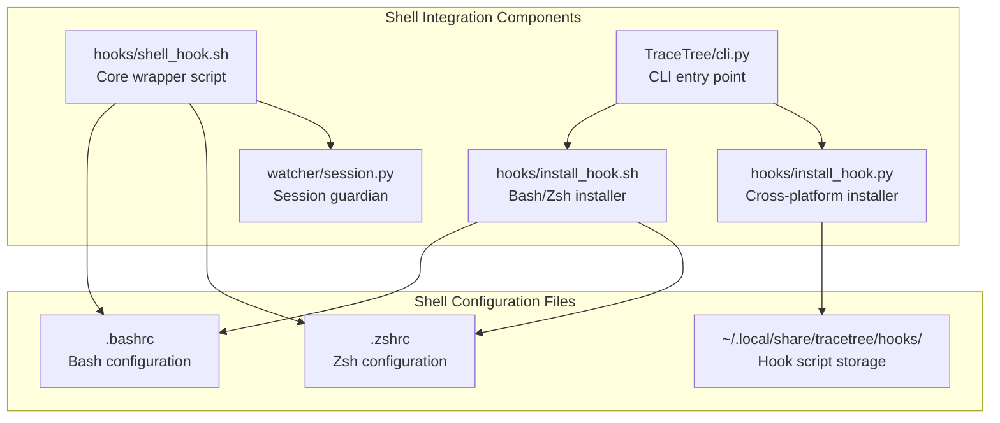
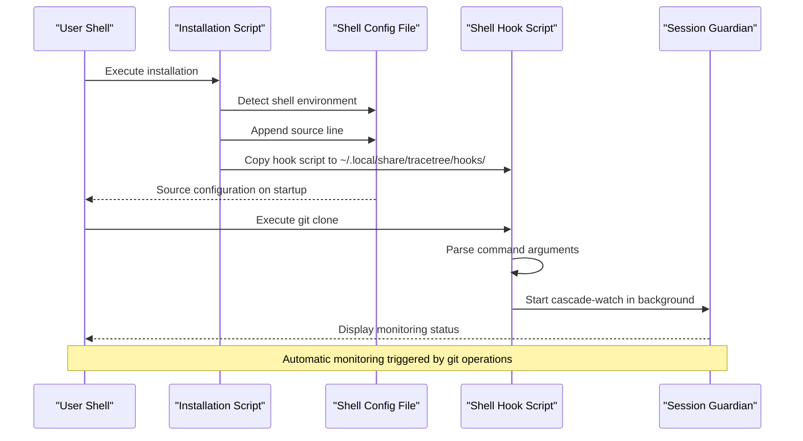
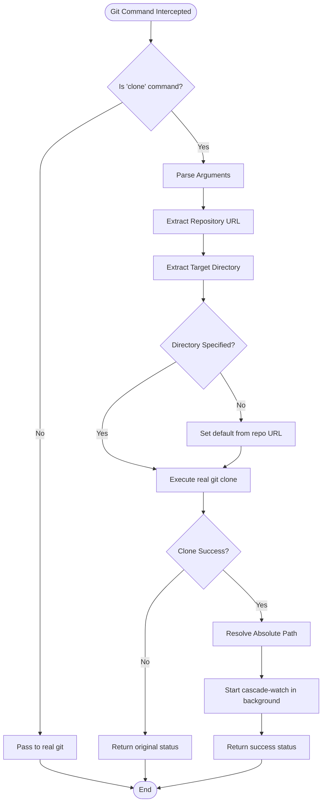
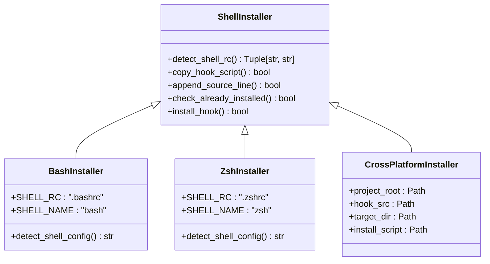
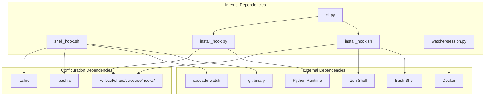

# Shell Integration Support

<cite>
**Referenced Files in This Document**
- [shell_hook.sh](file://hooks/shell_hook.sh)
- [install_hook.sh](file://hooks/install_hook.sh)
- [install_hook.py](file://hooks/install_hook.py)
- [cli.py](file://TraceTree/cli.py)
- [session.py](file://watcher/session.py)
- [README.md](file://README.md)
</cite>

## Table of Contents
1. [Introduction](#introduction)
2. [Project Structure](#project-structure)
3. [Core Components](#core-components)
4. [Architecture Overview](#architecture-overview)
5. [Detailed Component Analysis](#detailed-component-analysis)
6. [Dependency Analysis](#dependency-analysis)
7. [Performance Considerations](#performance-considerations)
8. [Troubleshooting Guide](#troubleshooting-guide)
9. [Conclusion](#conclusion)

## Introduction
This document provides comprehensive documentation for TraceTree's shell integration support across different platforms and shells. The system centers around a shell hook mechanism that automatically monitors git operations and package installations to trigger runtime behavioral analysis. The implementation supports bash and zsh environments through a unified shell-agnostic approach, with explicit detection and installation mechanisms for each shell type.

The shell integration consists of three primary components:
- A shell-agnostic wrapper script that intercepts git clone operations
- Platform-aware installation scripts for bash and zsh
- A cross-platform Python installer that detects shell environments and manages configuration files

## Project Structure
The shell integration functionality is organized within the hooks directory and integrates with the main CLI application:

**Diagram sources**
- [shell_hook.sh:1-93](file://hooks/shell_hook.sh#L1-L93)
- [install_hook.sh:1-60](file://hooks/install_hook.sh#L1-L60)
- [install_hook.py:1-129](file://hooks/install_hook.py#L1-L129)
- [cli.py:937-1008](file://TraceTree/cli.py#L937-L1008)

**Section sources**
- [shell_hook.sh:1-93](file://hooks/shell_hook.sh#L1-L93)
- [install_hook.sh:1-60](file://hooks/install_hook.sh#L1-L60)
- [install_hook.py:1-129](file://hooks/install_hook.py#L1-L129)
- [cli.py:937-1008](file://TraceTree/cli.py#L937-L1008)

## Core Components
The shell integration system comprises three fundamental components that work together to provide seamless automatic monitoring:

### Shell Hook Script (shell_hook.sh)
The core wrapper script that intercepts git clone operations and automatically starts the session guardian. It implements a sophisticated git command wrapper that:
- Detects when git clone is executed with various option combinations
- Parses command-line arguments to extract repository URLs and target directories
- Resolves absolute paths for the cloned repository
- Launches the session guardian in the background using cascade-watch
- Provides user feedback through terminal output

### Bash/Zsh Installation Script (install_hook.sh)
A shell-specific installer that:
- Detects the current shell using environment variables and fallback mechanisms
- Creates the hook script directory in the user's home directory
- Copies the shell hook script to the standardized location
- Appends the appropriate source line to the detected shell configuration file
- Handles both bash (.bashrc) and zsh (.zshrc) configuration files

### Cross-Platform Python Installer (install_hook.py)
A Python-based installer that:
- Detects shell environments through environment variable checks
- Provides fallback detection using the SHELL environment variable
- Creates the hook script directory structure
- Copies the hook script with proper permissions
- Appends installation markers and source lines to configuration files
- Handles both bash and zsh environments with platform-specific paths

**Section sources**
- [shell_hook.sh:7-89](file://hooks/shell_hook.sh#L7-L89)
- [install_hook.sh:10-27](file://hooks/install_hook.sh#L10-L27)
- [install_hook.py:29-59](file://hooks/install_hook.py#L29-L59)

## Architecture Overview
The shell integration architecture implements a layered approach to provide automatic monitoring across different shell environments:

**Diagram sources**
- [install_hook.sh:32-52](file://hooks/install_hook.sh#L32-L52)
- [install_hook.py:71-119](file://hooks/install_hook.py#L71-L119)
- [shell_hook.sh:27-86](file://hooks/shell_hook.sh#L27-L86)

The architecture ensures that:
- Shell detection occurs at installation time for persistent configuration
- Hook scripts are stored in a centralized location for easy management
- Automatic monitoring is triggered by specific git operations without manual intervention
- Cross-platform compatibility is maintained through environment variable detection

## Detailed Component Analysis

### Shell Hook Implementation Analysis
The shell hook implementation demonstrates sophisticated shell scripting techniques for command interception and argument parsing:

**Diagram sources**
- [shell_hook.sh:27-86](file://hooks/shell_hook.sh#L27-L86)

Key implementation characteristics:
- **Command Interception**: The script defines a git function that wraps the real git binary, intercepting only clone operations
- **Argument Parsing**: Sophisticated argument parsing handles various git clone options including depth, branch, origin, and configuration parameters
- **Path Resolution**: Automatic directory resolution using basename extraction from repository URLs
- **Background Execution**: Non-blocking watcher startup using nohup and background processes
- **Error Handling**: Graceful fallback when cascade-watch is unavailable or clone operations fail

**Section sources**
- [shell_hook.sh:27-86](file://hooks/shell_hook.sh#L27-L86)

### Installation Mechanisms Analysis
The installation system provides multiple approaches for different use cases and environments:

**Diagram sources**
- [install_hook.sh:10-27](file://hooks/install_hook.sh#L10-L27)
- [install_hook.py:29-59](file://hooks/install_hook.py#L29-L59)

The installation system implements robust shell detection through multiple mechanisms:
- **Environment Variable Detection**: Checks ZSH_VERSION and BASH_VERSION environment variables
- **Fallback Detection**: Uses SHELL environment variable to determine default shell
- **File Existence Validation**: Verifies configuration file existence before modification
- **Idempotent Operations**: Prevents duplicate installations through marker-based detection

**Section sources**
- [install_hook.sh:10-27](file://hooks/install_hook.sh#L10-L27)
- [install_hook.py:29-69](file://hooks/install_hook.py#L29-L69)

### Cross-Platform Compatibility Analysis
The system maintains cross-platform compatibility through environment variable-based detection and standardized file paths:

| Platform | Environment Variables | Configuration Files | Installation Method |
|----------|----------------------|-------------------|-------------------|
| macOS | ZSH_VERSION, BASH_VERSION | ~/.zshrc, ~/.bashrc | Both shell-specific and Python-based |
| Linux | ZSH_VERSION, BASH_VERSION | ~/.zshrc, ~/.bashrc | Both shell-specific and Python-based |
| Windows | Not directly supported | N/A | Use WSL or Cygwin for shell integration |

The Python installer provides enhanced compatibility by:
- Using pathlib for cross-platform path handling
- Implementing fallback detection mechanisms
- Creating standardized directory structures
- Handling encoding and permission differences

**Section sources**
- [install_hook.py:35-59](file://hooks/install_hook.py#L35-L59)
- [install_hook.sh:11-26](file://hooks/install_hook.sh#L11-L26)

## Dependency Analysis
The shell integration system exhibits minimal coupling with external dependencies while maintaining strong internal cohesion:

**Diagram sources**
- [shell_hook.sh:14-24](file://hooks/shell_hook.sh#L14-L24)
- [install_hook.sh:39-45](file://hooks/install_hook.sh#L39-L45)
- [install_hook.py:100-106](file://hooks/install_hook.py#L100-L106)

The dependency structure ensures:
- **Minimal External Coupling**: Only depends on git and cascade-watch availability
- **Shell Independence**: Works across different shell environments through environment variable detection
- **Configuration Isolation**: Uses standardized paths for hook script storage
- **Runtime Flexibility**: Allows for dynamic shell detection and configuration

**Section sources**
- [shell_hook.sh:14-24](file://hooks/shell_hook.sh#L14-L24)
- [install_hook.sh:39-45](file://hooks/install_hook.sh#L39-L45)
- [install_hook.py:100-106](file://hooks/install_hook.py#L100-L106)

## Performance Considerations
The shell integration system is designed for minimal performance impact:

### Startup Overhead
- **Hook Loading**: The shell hook script initializes only when sourced, adding negligible startup overhead
- **Command Interception**: Git command interception occurs only for clone operations, avoiding performance impact on other git commands
- **Background Processes**: Watcher processes run asynchronously, not blocking the main shell session

### Memory and Resource Usage
- **Script Size**: The hook script is compact (under 100 lines) with minimal memory footprint
- **Background Execution**: Watcher processes are started with nohup, ensuring they don't interfere with shell sessions
- **Temporary Files**: Log files are created in /tmp with unique identifiers to prevent conflicts

### Scalability Considerations
- **Concurrent Operations**: Multiple git clone operations can trigger concurrent watcher processes
- **Resource Limits**: Each watcher process operates independently with its own resource allocation
- **Cleanup Mechanisms**: Proper cleanup of temporary files and background processes

## Troubleshooting Guide

### Common Installation Issues
**Problem**: Installation script cannot detect shell environment
- **Solution**: Verify ZSH_VERSION or BASH_VERSION environment variables are set
- **Alternative**: Check SHELL environment variable points to correct shell binary
- **Manual Fix**: Source the hook script directly using `source ~/.local/share/tracetree/hooks/shell_hook.sh`

**Problem**: Hook script not found in configuration
- **Solution**: Verify ~/.local/share/tracetree/hooks/shell_hook.sh exists
- **Check Permissions**: Ensure the hook script is executable (chmod +x)
- **Path Verification**: Confirm the source line in shell configuration points to correct location

**Problem**: Git clone operations not triggering watchers
- **Solution**: Verify cascade-watch is available in PATH
- **Check Installation**: Ensure hook script is properly sourced in shell configuration
- **Debug Mode**: Test with verbose output to identify interception failures

### Environment Variable Handling
The system relies on several environment variables for proper operation:
- **ZSH_VERSION**: Indicates zsh shell environment
- **BASH_VERSION**: Indicates bash shell environment  
- **SHELL**: Contains path to default shell binary
- **HOME**: Used for determining user home directory

**Section sources**
- [install_hook.sh:33-36](file://hooks/install_hook.sh#L33-L36)
- [install_hook.py:36-39](file://hooks/install_hook.py#L36-L39)

### Platform-Specific Considerations
**macOS Specific**:
- Ensure proper PATH configuration for cascade-watch
- Verify Xcode command line tools are installed for development dependencies
- Check Homebrew installation for package management tools

**Linux Specific**:
- Verify Docker service is running for sandbox analysis
- Ensure proper permissions for /tmp directory access
- Check systemd or init system for background process management

**Windows Compatibility**:
- Native Windows shell integration is not supported
- Use WSL or Cygwin for shell integration capabilities
- PowerShell users should use WSL for full functionality

## Conclusion
The TraceTree shell integration system provides a robust, cross-platform solution for automatic monitoring of git operations and package installations. Through its layered architecture of shell-agnostic wrappers, platform-aware installation mechanisms, and cross-platform Python-based installers, the system delivers seamless integration across different shell environments while maintaining minimal performance impact.

The implementation successfully addresses key challenges including:
- **Cross-shell compatibility** through environment variable detection
- **Automatic monitoring** without manual intervention through git command interception
- **Platform independence** via standardized configuration and installation procedures
- **Robust error handling** with graceful fallback mechanisms

Future enhancements could include PowerShell integration for native Windows support and additional shell environments for broader compatibility. The current implementation provides a solid foundation for automated security monitoring in development workflows across diverse computing environments.