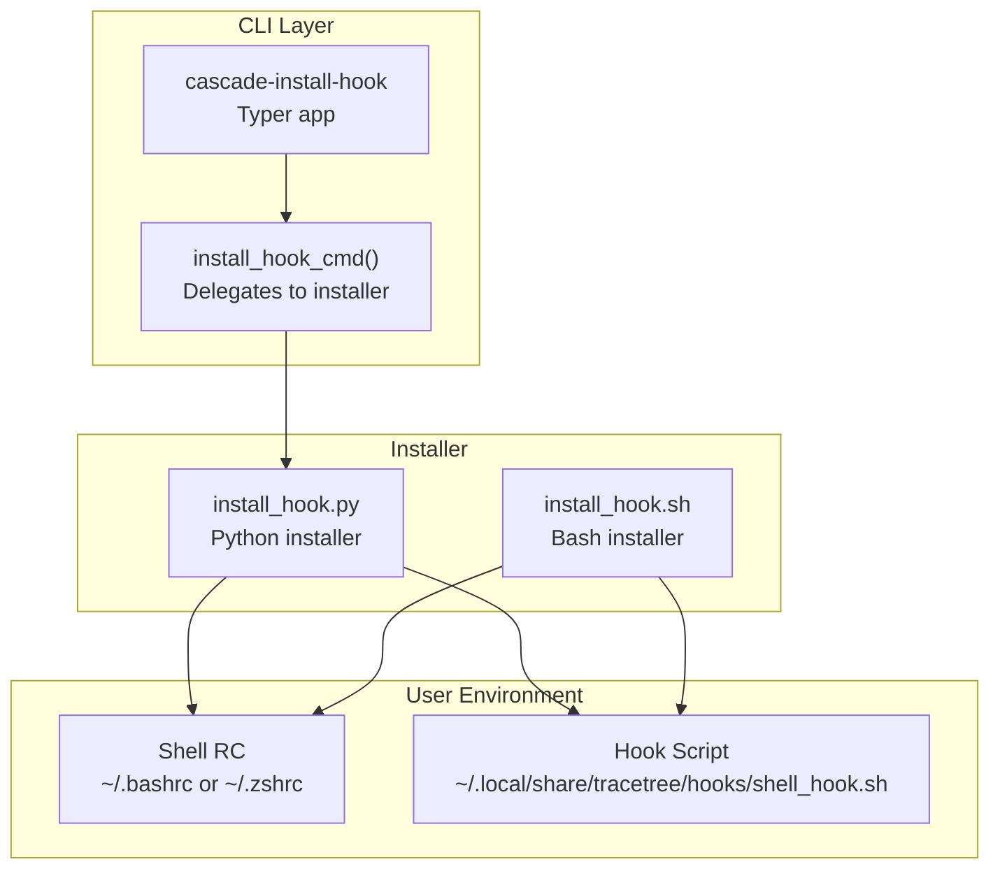
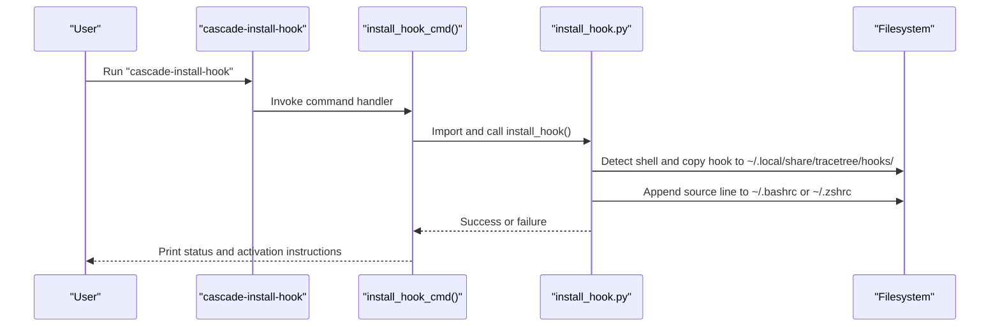
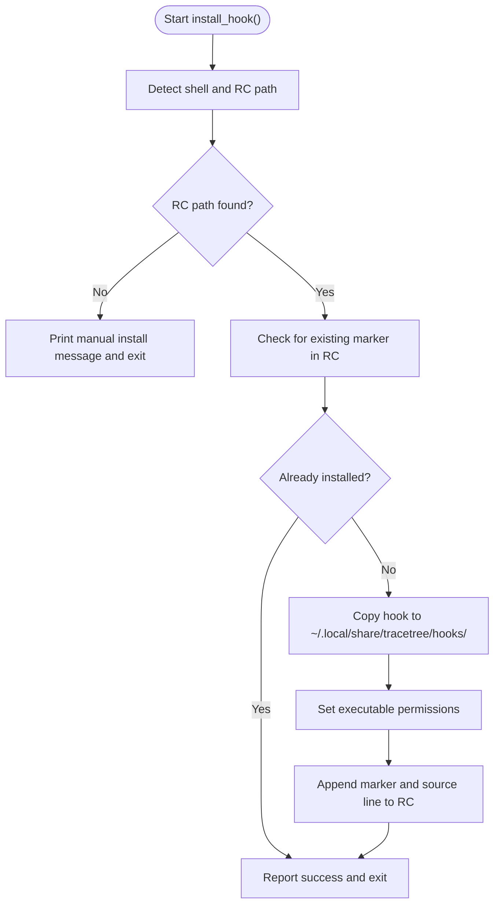
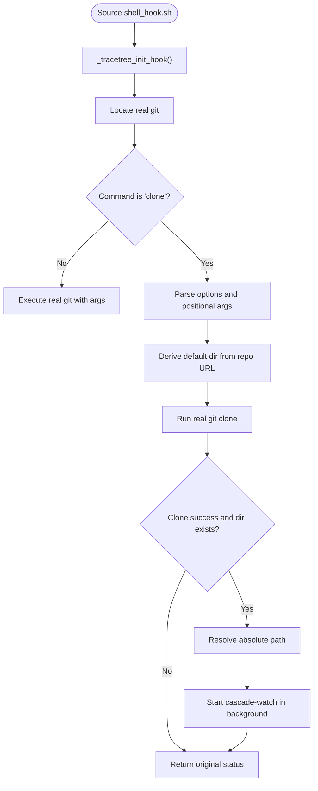
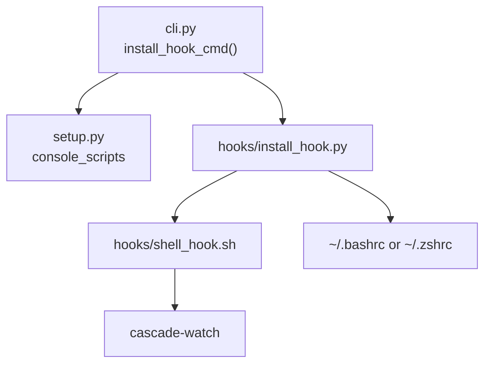

# Troubleshooting and Configuration

<cite>
**Referenced Files in This Document**
- [cli.py](file://cli.py)
- [install_hook.py](file://hooks/install_hook.py)
- [install_hook.sh](file://hooks/install_hook.sh)
- [shell_hook.sh](file://hooks/shell_hook.sh)
- [setup.py](file://setup.py)
- [README.md](file://README.md)
</cite>

## Table of Contents
1. [Introduction](#introduction)
2. [Project Structure](#project-structure)
3. [Core Components](#core-components)
4. [Architecture Overview](#architecture-overview)
5. [Detailed Component Analysis](#detailed-component-analysis)
6. [Dependency Analysis](#dependency-analysis)
7. [Performance Considerations](#performance-considerations)
8. [Troubleshooting Guide](#troubleshooting-guide)
9. [Conclusion](#conclusion)
10. [Appendices](#appendices)

## Introduction
This document provides comprehensive troubleshooting and configuration guidance for the cascade-install-hook command. It explains how the shell hook integrates with your shell, how to diagnose installation issues, and how to customize behavior for different environments. It also covers platform-specific steps for macOS, Linux, and Windows, and outlines diagnostic procedures to verify successful installation and operation.

## Project Structure
The cascade-install-hook command is implemented as a console script entry point that delegates to a dedicated installer. The installer supports both Python and Bash variants and writes the hook into a standard location under the user’s home directory.

**Diagram sources**
- [cli.py:1105-1131](file://cli.py#L1105-L1131)
- [install_hook.py:71-119](file://hooks/install_hook.py#L71-L119)
- [install_hook.sh:10-59](file://hooks/install_hook.sh#L10-L59)

**Section sources**
- [cli.py:1105-1131](file://cli.py#L1105-L1131)
- [setup.py:30-39](file://setup.py#L30-L39)
- [README.md:232-241](file://README.md#L232-L241)

## Core Components
- cascade-install-hook CLI: A dedicated Typer app registered as a console script that invokes the installer.
- Python installer: Detects shell, copies the hook script to a standard location, and appends a source line to the appropriate shell RC file.
- Bash installer: Alternative installer that performs the same steps using Bash primitives.
- Shell hook: A sourced script that intercepts git clone and starts cascade-watch in the background.

Key behaviors:
- Automatic shell detection (bash/zsh) using environment variables and $SHELL.
- Idempotent installation checks to avoid duplicate entries.
- Standardized installation path under ~/.local/share/tracetree/hooks/.
- Logging and activation instructions printed upon success.

**Section sources**
- [cli.py:1105-1131](file://cli.py#L1105-L1131)
- [install_hook.py:29-59](file://hooks/install_hook.py#L29-L59)
- [install_hook.py:71-119](file://hooks/install_hook.py#L71-L119)
- [install_hook.sh:10-59](file://hooks/install_hook.sh#L10-L59)
- [shell_hook.sh:27-89](file://hooks/shell_hook.sh#L27-L89)

## Architecture Overview
The cascade-install-hook command orchestrates a seamless integration between the CLI, installer, and shell environment.

**Diagram sources**
- [cli.py:1105-1131](file://cli.py#L1105-L1131)
- [install_hook.py:71-119](file://hooks/install_hook.py#L71-L119)

## Detailed Component Analysis

### Python Installer (install_hook.py)
Responsibilities:
- Detect shell and RC file path.
- Check for existing installation markers.
- Copy hook script to ~/.local/share/tracetree/hooks/ and set executable permissions.
- Append a marker and source line to the detected RC file.
- Provide user-friendly success and activation instructions.

Common issues and resolutions:
- Hook script not found: Ensure you run the installer from the project root where hooks/shell_hook.sh exists.
- Shell detection failure: Manually source the hook or set ZSH_VERSION/BASH_VERSION appropriately.
- Already installed: The installer detects existing markers and reports success without duplication.

**Diagram sources**
- [install_hook.py:29-59](file://hooks/install_hook.py#L29-L59)
- [install_hook.py:71-119](file://hooks/install_hook.py#L71-L119)

**Section sources**
- [install_hook.py:29-59](file://hooks/install_hook.py#L29-L59)
- [install_hook.py:71-119](file://hooks/install_hook.py#L71-L119)

### Bash Installer (install_hook.sh)
Responsibilities:
- Mirror the Python installer’s logic using Bash.
- Detect shell, ensure RC file exists, check for duplicates, copy hook, set permissions, and append source line.

Common issues and resolutions:
- Missing RC file: The installer touches the file to ensure existence.
- Unsupported shell: Prints a warning and exits; install manually.

**Section sources**
- [install_hook.sh:10-59](file://hooks/install_hook.sh#L10-L59)

### Shell Hook (shell_hook.sh)
Responsibilities:
- Intercept git clone to start cascade-watch in the background.
- Verify prerequisites (presence of cascade-watch).
- Log watcher startup and output to /tmp/tracetree_<repo>.log.

Interception logic:
- Stores the real git path.
- Defines a git() wrapper that triggers only for git clone.
- Parses clone arguments, determines destination directory, runs real git clone, and starts cascade-watch in background.

**Diagram sources**
- [shell_hook.sh:27-89](file://hooks/shell_hook.sh#L27-L89)

**Section sources**
- [shell_hook.sh:27-89](file://hooks/shell_hook.sh#L27-L89)

### CLI Entrypoint (cli.py)
Responsibilities:
- Register cascade-install-hook as a console script via setup.py.
- Provide install_hook_cmd() that validates the presence of the installer and executes it.

Behavior:
- Inserts the hooks directory into sys.path and imports the Python installer.
- Handles exceptions and prints user-friendly errors.

**Section sources**
- [cli.py:1105-1131](file://cli.py#L1105-L1131)
- [setup.py:30-39](file://setup.py#L30-L39)

## Dependency Analysis
The cascade-install-hook command relies on a small set of dependencies and environment assumptions.

**Diagram sources**
- [cli.py:1105-1131](file://cli.py#L1105-L1131)
- [setup.py:30-39](file://setup.py#L30-L39)
- [install_hook.py:71-119](file://hooks/install_hook.py#L71-L119)
- [shell_hook.sh:21-24](file://hooks/shell_hook.sh#L21-L24)

**Section sources**
- [cli.py:1105-1131](file://cli.py#L1105-L1131)
- [setup.py:30-39](file://setup.py#L30-L39)

## Performance Considerations
- The installer performs minimal filesystem operations and is fast.
- The shell hook introduces negligible overhead for non-clone git commands.
- Background cascade-watch startup uses nohup and redirection; ensure sufficient disk space in /tmp for logs.

## Troubleshooting Guide

### Common Installation Issues and Solutions
- Hook script not found during install:
  - Cause: Running the installer from outside the project root.
  - Fix: Change to the project root where hooks/shell_hook.sh resides.
  - Evidence: The installer prints a message instructing to run from the project root.

- Shell detection fails:
  - Cause: Unset or unsupported shell environment variables.
  - Fix: Set ZSH_VERSION or BASH_VERSION appropriately, or run the Bash installer.
  - Evidence: The installer prints a manual install suggestion with the source command.

- Already installed:
  - Cause: Duplicate marker in RC file.
  - Fix: No action needed; the installer reports success and avoids duplication.

- Permission denied when writing to RC or copying hook:
  - Cause: Insufficient permissions to modify RC or create directories under the home folder.
  - Fix: Ensure write permissions to ~/.bashrc or ~/.zshrc and that ~/.local/share exists.

- Path conflicts:
  - Cause: Conflicting source lines or hook locations.
  - Fix: Remove duplicate entries from RC; the installer appends a unique marker to prevent duplicates.

- Shell compatibility:
  - Cause: Using a non-bash/zsh shell.
  - Fix: Switch to bash or zsh, or source the hook manually in your shell’s RC file.

**Section sources**
- [install_hook.py:80-83](file://hooks/install_hook.py#L80-L83)
- [install_hook.py:87-90](file://hooks/install_hook.py#L87-L90)
- [install_hook.py:94-97](file://hooks/install_hook.py#L94-L97)
- [install_hook.sh:32-36](file://hooks/install_hook.sh#L32-L36)

### Platform-Specific Steps

- macOS:
  - Ensure bash or zsh is your login shell.
  - The installer writes to ~/.bashrc or ~/.zshrc depending on detection.
  - If using zsh, confirm that ~/.zshrc exists or will be created.

- Linux:
  - Same as macOS; the installer writes to ~/.bashrc or ~/.zshrc.
  - Confirm that ~/.local/share/tracetree/hooks exists and is writable.

- Windows:
  - The installer is designed for bash/zsh environments. If using Windows Subsystem for Linux (WSL), follow the Linux steps.
  - For PowerShell or Command Prompt, source the hook manually in your shell’s RC file and ensure cascade-watch is available.

**Section sources**
- [install_hook.py:29-59](file://hooks/install_hook.py#L29-L59)
- [install_hook.sh:10-27](file://hooks/install_hook.sh#L10-L27)

### Verification Procedures
- Confirm installation:
  - Check that ~/.local/share/tracetree/hooks/shell_hook.sh exists and is executable.
  - Verify that ~/.bashrc or ~/.zshrc contains the unique marker and a source line pointing to the hook.
  - Re-source your RC file or open a new terminal.

- Test hook behavior:
  - Run a git clone in a new terminal and observe the background cascade-watch startup and log file creation in /tmp named tracetree_<repo>.log.
  - Ensure cascade-watch is available on PATH.

- Diagnose failures:
  - Review printed messages from the installer for hints.
  - Check for permission errors or missing prerequisites (e.g., cascade-watch availability).

**Section sources**
- [install_hook.py:100-119](file://hooks/install_hook.py#L100-L119)
- [shell_hook.sh:77-78](file://hooks/shell_hook.sh#L77-L78)
- [README.md:232-241](file://README.md#L232-L241)

### Configuration Options and Customization
- Monitoring scope:
  - The hook only intercepts git clone and starts cascade-watch in the newly created directory. There are no command-line flags to customize this behavior in the installer or hook itself.

- Integration preferences:
  - The installer appends a unique marker to RC to avoid duplicates.
  - The hook exports the git function to make it available in subshells.

- Customization examples:
  - Manual sourcing: Add a source line to your shell’s RC file pointing to ~/.local/share/tracetree/hooks/shell_hook.sh.
  - Alternate shell: Use the Bash installer to ensure proper shell detection and RC updates.

Note: The installer and hook do not expose runtime configuration flags. Behavior is deterministic and designed for minimal friction.

**Section sources**
- [install_hook.py:20-21](file://hooks/install_hook.py#L20-L21)
- [install_hook.py:109-111](file://hooks/install_hook.py#L109-L111)
- [shell_hook.sh:88](file://hooks/shell_hook.sh#L88)

## Conclusion
The cascade-install-hook command provides a streamlined way to integrate TraceTree’s session guardian into your development workflow. By detecting your shell, installing the hook to a standard location, and appending a source line to your RC file, it enables automatic monitoring after git clones. Use the verification procedures to confirm successful installation and consult the troubleshooting section for platform-specific and environment-related issues.

## Appendices

### Diagnostic Checklist
- Installer ran without errors and printed success.
- Hook script exists at ~/.local/share/tracetree/hooks/shell_hook.sh.
- RC file contains the unique marker and a source line.
- New terminal shows cascade-watch startup after git clone.
- Log file appears in /tmp named tracetree_<repo>.log.

### Related References
- CLI entry point registration for cascade-install-hook.
- README describes the hook’s behavior and installation summary.

**Section sources**
- [setup.py:30-39](file://setup.py#L30-L39)
- [README.md:232-241](file://README.md#L232-L241)