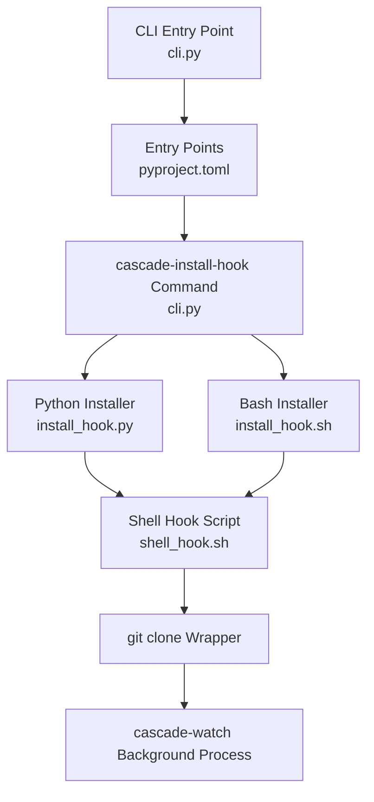
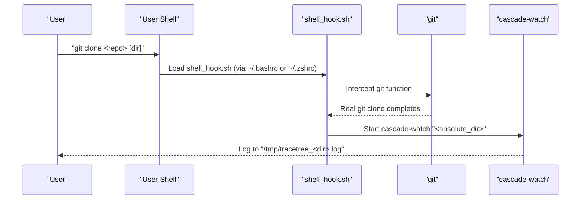
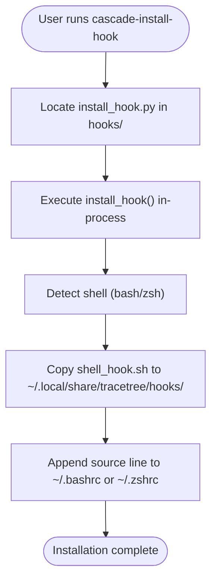
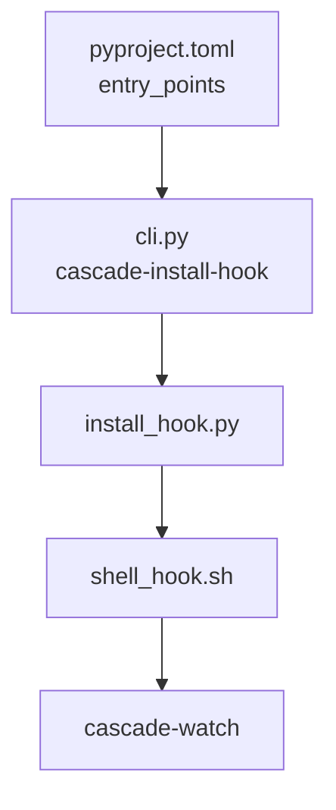

# cascade-install-hook Command

<cite>
**Referenced Files in This Document**
- [README.md](file://README.md)
- [cli.py](file://TraceTree/cli.py)
- [pyproject.toml](file://TraceTree/pyproject.toml)
- [install_hook.py](file://TraceTree/hooks/install_hook.py)
- [install_hook.sh](file://TraceTree/hooks/install_hook.sh)
- [shell_hook.sh](file://TraceTree/hooks/shell_hook.sh)
</cite>

## Table of Contents
1. [Introduction](#introduction)
2. [Project Structure](#project-structure)
3. [Core Components](#core-components)
4. [Architecture Overview](#architecture-overview)
5. [Detailed Component Analysis](#detailed-component-analysis)
6. [Dependency Analysis](#dependency-analysis)
7. [Performance Considerations](#performance-considerations)
8. [Troubleshooting Guide](#troubleshooting-guide)
9. [Conclusion](#conclusion)
10. [Appendices](#appendices)

## Introduction
The cascade-install-hook command enables automatic repository monitoring by installing a shell hook that triggers the session guardian after every git clone operation. This document explains how to install the hook across different shells and operating systems, how the hook system works, and how to integrate it into development environments and CI/CD pipelines. It also covers configuration options, security considerations, and troubleshooting steps.

## Project Structure
The cascade-install-hook capability is implemented as part of the TraceTree CLI and relies on shell integration scripts located under the hooks directory. The CLI registers the cascade-install-hook command and delegates installation to a Python-based installer that detects the user’s shell and writes the appropriate configuration.

**Diagram sources**
- [cli.py:937-1009](file://TraceTree/cli.py#L937-L1009)
- [pyproject.toml:26-32](file://TraceTree/pyproject.toml#L26-L32)
- [install_hook.py:71-119](file://TraceTree/hooks/install_hook.py#L71-L119)
- [install_hook.sh:1-59](file://TraceTree/hooks/install_hook.sh#L1-L59)
- [shell_hook.sh:1-93](file://TraceTree/hooks/shell_hook.sh#L1-L93)

**Section sources**
- [README.md:232-241](file://README.md#L232-L241)
- [cli.py:937-1009](file://TraceTree/cli.py#L937-L1009)
- [pyproject.toml:26-32](file://TraceTree/pyproject.toml#L26-L32)

## Core Components
- cascade-install-hook command: A CLI subcommand that installs the shell hook.
- Python installer (install_hook.py): Detects shell, copies hook script, and appends sourcing to the appropriate RC file.
- Bash installer (install_hook.sh): Alternative installer that performs the same steps in Bash.
- Shell hook (shell_hook.sh): Wraps git clone to start cascade-watch automatically.

Key behaviors:
- Automatic detection of bash or zsh via environment variables and $SHELL.
- Installation target: ~/.local/share/tracetree/hooks/shell_hook.sh.
- Adds a marker and source line to ~/.bashrc or ~/.zshrc.
- Only intercepts git clone; other git commands pass through unchanged.

**Section sources**
- [cli.py:937-1009](file://TraceTree/cli.py#L937-L1009)
- [install_hook.py:29-59](file://TraceTree/hooks/install_hook.py#L29-L59)
- [install_hook.sh:10-27](file://TraceTree/hooks/install_hook.sh#L10-L27)
- [shell_hook.sh:27-88](file://TraceTree/hooks/shell_hook.sh#L27-L88)

## Architecture Overview
The cascade-install-hook command orchestrates installation of a shell integration that augments the user’s interactive shell. When the user runs git clone, the wrapper function intercepts the command, clones the repository, and launches the session guardian in the background.

**Diagram sources**
- [shell_hook.sh:27-88](file://TraceTree/hooks/shell_hook.sh#L27-L88)
- [README.md:232-241](file://README.md#L232-L241)

## Detailed Component Analysis

### cascade-install-hook Command
The command is registered as cascade-install-hook and implemented as a Typer subcommand. It locates the Python installer script in the hooks directory and executes it in-process, printing results to the console.

**Diagram sources**
- [cli.py:937-1009](file://TraceTree/cli.py#L937-L1009)
- [install_hook.py:71-119](file://TraceTree/hooks/install_hook.py#L71-L119)

**Section sources**
- [cli.py:937-1009](file://TraceTree/cli.py#L937-L1009)
- [pyproject.toml:32-32](file://TraceTree/pyproject.toml#L32-L32)

### Python Installer (install_hook.py)
Responsibilities:
- Detect shell via environment variables and $SHELL.
- Verify the presence of the shell hook script.
- Check if the hook is already installed in the RC file.
- Create target directory and copy the hook script.
- Append a marker and source line to the appropriate RC file.

Behavioral notes:
- Uses pathlib for cross-platform path handling.
- Creates ~/.local/share/tracetree/hooks with proper permissions.
- Prints helpful messages and exits with non-zero status on failure.

**Section sources**
- [install_hook.py:29-59](file://TraceTree/hooks/install_hook.py#L29-L59)
- [install_hook.py:71-119](file://TraceTree/hooks/install_hook.py#L71-L119)

### Bash Installer (install_hook.sh)
Responsibilities:
- Detect shell similarly to the Python installer.
- Ensure the RC file exists.
- Check for existing installation markers.
- Copy shell_hook.sh to ~/.local/share/tracetree/hooks/.
- Append the source line and marker to the RC file.

**Section sources**
- [install_hook.sh:10-59](file://TraceTree/hooks/install_hook.sh#L10-L59)

### Shell Hook (shell_hook.sh)
Responsibilities:
- Initialize once per shell session.
- Wrap the git command to intercept clone operations.
- Parse git clone arguments to extract repository URL and optional directory.
- Launch cascade-watch in the background upon successful clone.
- Pass through all other git commands to the real git.

Interception logic:
- Only responds to git clone.
- Skips recognized options and their values.
- Defaults directory name from the repository URL if omitted.
- Starts cascade-watch with nohup and redirects output to a temporary log file.

**Section sources**
- [shell_hook.sh:7-89](file://TraceTree/hooks/shell_hook.sh#L7-L89)

## Dependency Analysis
The cascade-install-hook command depends on:
- CLI registration via pyproject.toml entry points.
- Presence of hooks directory and shell_hook.sh.
- Availability of cascade-watch on PATH for automatic monitoring.

**Diagram sources**
- [pyproject.toml:26-32](file://TraceTree/pyproject.toml#L26-L32)
- [cli.py:937-1009](file://TraceTree/cli.py#L937-L1009)
- [install_hook.py:71-119](file://TraceTree/hooks/install_hook.py#L71-L119)
- [shell_hook.sh:22-24](file://TraceTree/hooks/shell_hook.sh#L22-L24)

**Section sources**
- [pyproject.toml:26-32](file://TraceTree/pyproject.toml#L26-L32)
- [cli.py:937-1009](file://TraceTree/cli.py#L937-L1009)

## Performance Considerations
- The shell hook introduces minimal overhead: a single function wrapper around git and a background process startup.
- cascade-watch runs detached and logs to a temporary file; it does not block the user’s shell.
- Argument parsing for git clone is linear in the number of arguments and options.

## Troubleshooting Guide
Common installation issues and resolutions:
- Shell detection fails:
  - Cause: Environment variables not set or unsupported shell.
  - Resolution: Manually source the hook script from the copied location.
- Hook already installed:
  - Symptom: Message indicating the hook is already installed.
  - Action: Confirm the RC file contains the expected source line and marker.
- Missing shell_hook.sh:
  - Cause: Running installer from outside the project root.
  - Resolution: Execute from the TraceTree project root so the installer can locate hooks/shell_hook.sh.
- cascade-watch not found:
  - Cause: cascade-watch not installed or not on PATH.
  - Resolution: Install the TraceTree package and ensure cascade-watch is available.

Operational checks:
- Verify the RC file contains the marker and source line appended by the installer.
- Confirm the hook script exists at ~/.local/share/tracetree/hooks/shell_hook.sh.
- Test that git clone triggers cascade-watch by checking the log file in /tmp.

**Section sources**
- [install_hook.py:80-90](file://TraceTree/hooks/install_hook.py#L80-L90)
- [install_hook.sh:32-36](file://TraceTree/hooks/install_hook.sh#L32-L36)
- [shell_hook.sh:22-24](file://TraceTree/hooks/shell_hook.sh#L22-L24)

## Conclusion
The cascade-install-hook command provides a seamless way to enable automatic repository monitoring by integrating with the user’s shell. Once installed, every git clone operation triggers the session guardian, allowing continuous observation of newly cloned repositories. The implementation is robust across bash and zsh, with clear installation and troubleshooting procedures.

## Appendices

### Installation Instructions by Shell and OS
- Bash:
  - Run cascade-install-hook to append the source line to ~/.bashrc.
  - Open a new terminal or source ~/.bashrc to activate.
- Zsh:
  - Run cascade-install-hook to append the source line to ~/.zshrc.
  - Open a new terminal or source ~/.zshrc to activate.
- Fish and PowerShell:
  - The Python and Bash installers focus on bash and zsh. For Fish and PowerShell, manually add a sourcing mechanism to the respective configuration files pointing to ~/.local/share/tracetree/hooks/shell_hook.sh.

### Automatic Monitoring Behavior
- Trigger: git clone.
- Action: Clone repository, resolve absolute directory, start cascade-watch in background, and log to /tmp/tracetree_<dir>.log.
- Pass-through: All other git commands are forwarded to the real git.

### Security Considerations
- The hook only intercepts git clone and does not modify repository contents.
- cascade-watch runs detached; ensure logs are reviewed periodically.
- Keep the hook script updated with the latest version from the project.

### Practical Setup Examples
- Development environment:
  - Install the hook once, then every git clone automatically starts monitoring.
- CI/CD pipelines:
  - Add cascade-install-hook to the CI job setup to enable monitoring of cloned repositories.
  - Ensure cascade-watch is installed and available on PATH in the CI environment.

**Section sources**
- [README.md:232-241](file://README.md#L232-L241)
- [shell_hook.sh:67-78](file://TraceTree/hooks/shell_hook.sh#L67-L78)