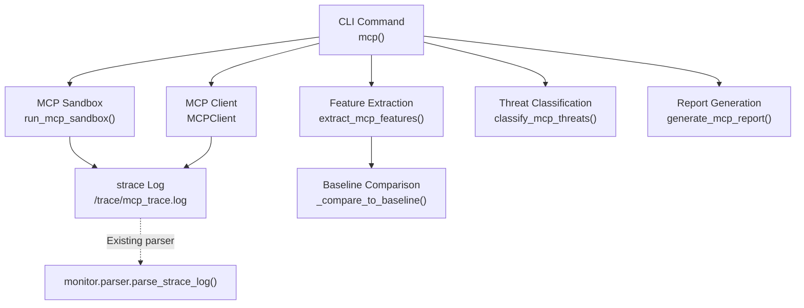
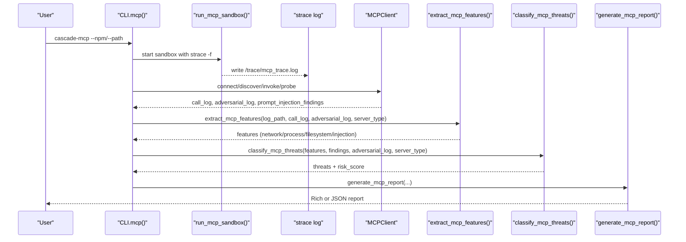
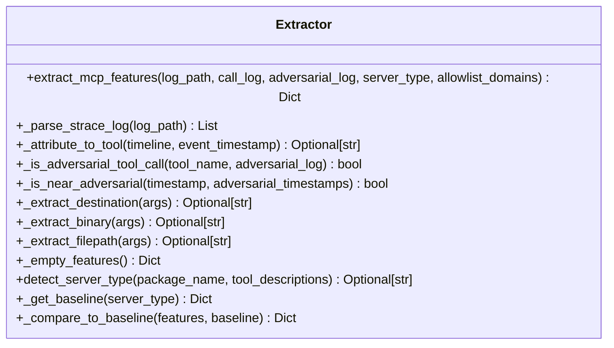
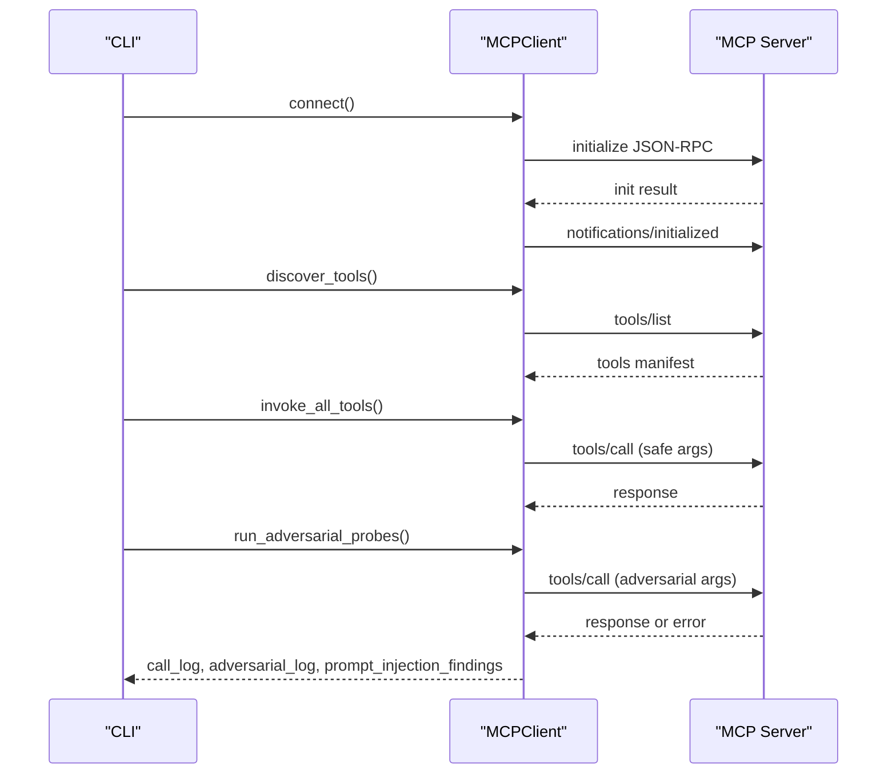
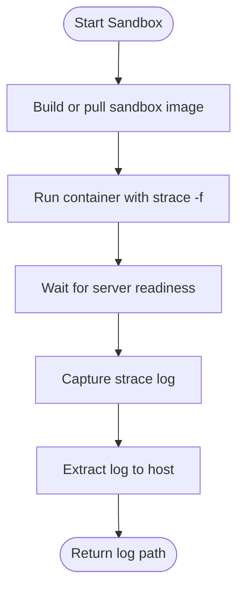
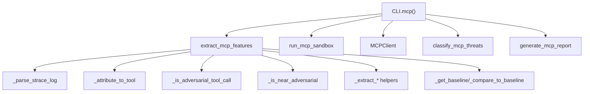

# MCP Feature Extraction

<cite>
**Referenced Files in This Document**
- [features.py](file://mcp/features.py)
- [client.py](file://mcp/client.py)
- [sandbox.py](file://mcp/sandbox.py)
- [parser.py](file://monitor/parser.py)
- [report.py](file://mcp/report.py)
- [cli.py](file://cli.py)
- [__init__.py](file://mcp/__init__.py)
- [test_sandbox_injection.py](file://tests/mcp/test_sandbox_injection.py)
</cite>

## Table of Contents
1. [Introduction](#introduction)
2. [Project Structure](#project-structure)
3. [Core Components](#core-components)
4. [Architecture Overview](#architecture-overview)
5. [Detailed Component Analysis](#detailed-component-analysis)
6. [Dependency Analysis](#dependency-analysis)
7. [Performance Considerations](#performance-considerations)
8. [Troubleshooting Guide](#troubleshooting-guide)
9. [Conclusion](#conclusion)
10. [Appendices](#appendices)

## Introduction
This document explains the MCP-specific feature extraction pipeline implemented in the TraceTree codebase. It focuses on the extract_mcp_features function, which parses strace logs produced by an MCP server sandbox to extract behavioral features grouped by tool-call activity. It covers server type detection, tool call frequency analysis, parameter pattern recognition, and behavioral signature mapping. It also documents integration with strace logs, feature engineering techniques for MCP protocols, baseline comparison methodologies, feature vector construction, normalization strategies, and correlations with security threats. Finally, it provides examples of extracted features, their significance in threat detection, and guidance for performance optimization and extending custom MCP features.

## Project Structure
The MCP feature extraction lives primarily in the mcp module, with integration points across sandboxing, client simulation, and reporting. The CLI orchestrates the full pipeline, invoking the sandbox, client, feature extraction, classification, and report generation.

**Diagram sources**
- [cli.py:563-744](file://cli.py#L563-L744)
- [sandbox.py:41-327](file://mcp/sandbox.py#L41-L327)
- [features.py:32-206](file://mcp/features.py#L32-L206)
- [client.py:18-473](file://mcp/client.py#L18-L473)
- [report.py:27-322](file://mcp/report.py#L27-L322)
- [parser.py:342-682](file://monitor/parser.py#L342-L682)

**Section sources**
- [cli.py:563-744](file://cli.py#L563-L744)
- [__init__.py:1-22](file://mcp/__init__.py#L1-L22)

## Core Components
- extract_mcp_features: Parses strace logs and builds MCP-specific features keyed by tool-call activity (network, process, filesystem, injection response), plus baseline comparisons and adversarial deltas.
- detect_server_type: Heuristically detects the MCP server type from package name and tool descriptions to enable baseline comparisons.
- MCPClient: Simulates an MCP client to connect to servers, discover tools, invoke them with safe synthetic arguments, and run adversarial probes.
- run_mcp_sandbox: Runs the MCP server in a Docker sandbox with strace -f instrumentation and restricted networking.
- generate_mcp_report: Produces a structured report including tool manifests, per-tool syscall summaries, threat detections, adversarial probe results, risk scores, and baseline comparisons.

**Section sources**
- [features.py:32-206](file://mcp/features.py#L32-L206)
- [features.py:387-422](file://mcp/features.py#L387-L422)
- [client.py:18-473](file://mcp/client.py#L18-L473)
- [sandbox.py:41-327](file://mcp/sandbox.py#L41-L327)
- [report.py:27-322](file://mcp/report.py#L27-L322)

## Architecture Overview
The MCP feature extraction pipeline integrates with TraceTree’s broader runtime behavioral analysis. The CLI coordinates:
- Sandbox execution with strace -f capturing syscalls
- Client handshake and tool invocation to attribute syscalls to specific tool calls
- Feature extraction keyed by tool-call timelines
- Threat classification and risk scoring
- Report generation

**Diagram sources**
- [cli.py:563-744](file://cli.py#L563-L744)
- [sandbox.py:41-327](file://mcp/sandbox.py#L41-L327)
- [features.py:32-206](file://mcp/features.py#L32-L206)
- [client.py:18-473](file://mcp/client.py#L18-L473)
- [report.py:27-322](file://mcp/report.py#L27-L322)

## Detailed Component Analysis

### extract_mcp_features: Server Type Detection, Tool Call Frequency, Parameter Pattern Recognition, Behavioral Signature Mapping
- Server type detection: detect_server_type infers server type from package name and tool descriptions to enable baseline comparisons.
- Tool call frequency analysis: _attribute_to_tool maps strace event timestamps to tool names using proportional mapping between strace counters and wall-clock timestamps from call_log.
- Parameter pattern recognition: _extract_binary and _extract_filepath parse execve and openat/stat/access arguments to identify suspicious targets and sensitive paths.
- Behavioral signature mapping: _parse_strace_log converts strace lines into structured events with pid, syscall, args, and timestamp; subsequent passes classify network, process, and filesystem behaviors; adversarial comparison computes syscall deltas and shell spawn flags.

Key feature categories:
- Network behavior: unexpected outbound connections, DNS lookups during tool calls, connection counts per tool call, unique destinations.
- Process behavior: child process spawns, shell invocations, unexpected binary executions, execve targets.
- Filesystem behavior: reads outside working directory, sensitive path accesses, writes during read-only tool calls.
- Injection response: behavior change on adversarial input, shell spawn on injection, adversarial syscall delta.
- General: total syscalls, syscall counts, events attributed to tools.

Baseline comparison: _compare_to_baseline compares extracted features against KNOWN_BASELINES to flag deviations.

Normalization strategies:
- Sets converted to lists for JSON serialization.
- Counts normalized by tool-call frequency via connection_count_per_tool_call and events_by_tool aggregation.

Correlation with security threats:
- Unexpected network connections and DNS lookups during tool calls correlate with covert channels and C2.
- Shell invocations and shell spawn on injection correlate with command injection.
- Sensitive path reads correlate with credential theft.
- Excessive process spawning correlates with instability or malicious intent.

Examples of extracted features and significance:
- unexpected_outbound_connections: indicates unauthorized egress; high values increase risk.
- dns_lookups_during_tool_call: suggests data exfiltration via DNS tunneling.
- shell_invoked: indicates potential command injection via unsafe argument handling.
- reads_sensitive_paths: indicates credential or secret exposure.
- adversarial_syscall_delta: quantifies behavioral drift under adversarial input.

Complementarity to traditional behavioral analysis:
- MCP features focus on protocol-specific behaviors (tool invocation, parameter handling, injection probes) and server type baselines, while TraceTree’s general parser emphasizes broader syscall chains and severity weighting.

**Section sources**
- [features.py:32-206](file://mcp/features.py#L32-L206)
- [features.py:209-238](file://mcp/features.py#L209-L238)
- [features.py:241-276](file://mcp/features.py#L241-L276)
- [features.py:278-310](file://mcp/features.py#L278-L310)
- [features.py:387-422](file://mcp/features.py#L387-L422)
- [features.py:429-473](file://mcp/features.py#L429-L473)

#### Class Diagram: Feature Extraction Internals

**Diagram sources**
- [features.py:32-206](file://mcp/features.py#L32-L206)
- [features.py:209-238](file://mcp/features.py#L209-L238)
- [features.py:241-276](file://mcp/features.py#L241-L276)
- [features.py:278-310](file://mcp/features.py#L278-L310)
- [features.py:387-422](file://mcp/features.py#L387-L422)
- [features.py:429-473](file://mcp/features.py#L429-L473)

### MCPClient: Transport, Tool Discovery, Safe Arguments, Adversarial Probes
- Transport detection and handshakes: auto-detects stdio vs HTTP/SSE; performs JSON-RPC initialize and notifications.
- Tool discovery: calls tools/list and scans tool manifests for prompt injection patterns.
- Safe synthetic arguments: generates safe defaults based on JSON schema to avoid unintended side effects.
- Adversarial probes: injects payloads into string parameters and records server responses and crashes.

Accessors expose call_log, adversarial_log, and prompt_injection_findings for downstream feature extraction and classification.

**Section sources**
- [client.py:18-473](file://mcp/client.py#L18-L473)

#### Sequence Diagram: MCPClient Lifecycle

**Diagram sources**
- [client.py:78-195](file://mcp/client.py#L78-L195)
- [client.py:112-184](file://mcp/client.py#L112-L184)
- [client.py:423-473](file://mcp/client.py#L423-L473)

### run_mcp_sandbox: Instrumentation, Networking, and Logging
- Builds a Docker sandbox image if missing, runs the MCP server with strace -f capturing a curated set of syscalls, and restricts network connectivity by default.
- Supports stdio and HTTP/SSE transports, writing server_info.txt with transport and port for client-side orchestration.
- Extracts the strace log to logs/ and returns the host path for downstream analysis.

**Section sources**
- [sandbox.py:41-327](file://mcp/sandbox.py#L41-L327)

#### Flowchart: Sandbox Execution and Log Extraction

**Diagram sources**
- [sandbox.py:41-146](file://mcp/sandbox.py#L41-L146)
- [sandbox.py:274-327](file://mcp/sandbox.py#L274-L327)

### Baseline Comparison Methodologies and KNOWN_BASELINES
- KNOWN_BASELINES define expected syscalls and network/process/file behaviors per server type (filesystem, github, postgres, fetch, shell).
- _compare_to_baseline flags deviations such as unexpected network connections, process spawning, sensitive path reads, and shell invocations.

**Section sources**
- [features.py:341-384](file://mcp/features.py#L341-L384)
- [features.py:429-473](file://mcp/features.py#L429-L473)

### Integration with monitor.parser: Strace Parsing
- The existing monitor.parser.parse_strace_log handles general syscall parsing, severity weighting, and network destination classification. While extract_mcp_features uses its own lightweight parser tailored to MCP, the two parsers share similar patterns for multi-line reassembly and argument extraction.

**Section sources**
- [parser.py:342-682](file://monitor/parser.py#L342-L682)
- [features.py:209-238](file://mcp/features.py#L209-L238)

### Feature Vector Construction, Normalization, and Correlation with Security Threats
- Feature vector construction:
  - Network: connection_count_per_tool_call, unique_destinations, dns_lookups_during_tool_call.
  - Process: child_process_spawned, shell_invoked, execve_targets.
  - Filesystem: reads_outside_working_dir, reads_sensitive_paths, writes_during_readonly_tool.
  - Injection response: adversarial_syscall_delta, behavior_change_on_adversarial_input, shell_spawned_on_injection.
  - General: total_syscalls, syscall_counts, events_by_tool.
- Normalization strategies:
  - Sets converted to lists for JSON serialization.
  - Tool-call-frequency normalization via connection_count_per_tool_call and events_by_tool aggregation.
- Correlation with security threats:
  - Command injection: shell spawn on injection and adversarial syscall delta.
  - Credential theft: sensitive path accesses with subsequent network connections.
  - Covert channels: unexpected outbound connections and DNS lookups during tool calls.
  - Path traversal: reads outside working directory and sensitive path accesses.
  - Excessive process spawning: ratio of spawned processes to tool calls.

**Section sources**
- [features.py:63-92](file://mcp/features.py#L63-L92)
- [features.py:180-206](file://mcp/features.py#L180-L206)
- [features.py:429-473](file://mcp/features.py#L429-L473)

### Threat Classification and Risk Scoring
- classify_mcp_threats evaluates features against rule-based categories and returns triggered threats with evidence.
- compute_risk_score aggregates threat severities and counts to derive a risk rating.

**Section sources**
- [classifier.py:61-96](file://mcp/classifier.py#L61-L96)
- [classifier.py:129-236](file://mcp/classifier.py#L129-L236)
- [classifier.py:239-268](file://mcp/classifier.py#L239-L268)

### Report Generation and Interpretation
- generate_mcp_report produces either a Rich console report or a JSON report containing tool manifests, per-tool syscall summaries, threat detections, adversarial probe results, features, and baseline comparisons.
- Interpretation guidance:
  - High unexpected outbound connections or DNS lookups during tool calls warrant immediate review.
  - Shell invocations or shell spawn on injection strongly suggest command injection vulnerabilities.
  - Sensitive path accesses coupled with network activity indicate credential theft risk.
  - Excessive process spawning relative to tool calls suggests instability or malicious behavior.

**Section sources**
- [report.py:27-322](file://mcp/report.py#L27-L322)

## Dependency Analysis
- extract_mcp_features depends on:
  - strace log parsing (_parse_strace_log)
  - tool-call attribution (_attribute_to_tool)
  - adversarial timestamp handling (_is_adversarial_tool_call, _is_near_adversarial)
  - argument extraction helpers (_extract_destination, _extract_binary, _extract_filepath)
  - baseline comparison helpers (_get_baseline, _compare_to_baseline)
- MCPClient depends on:
  - JSON-RPC transport (stdio or HTTP/SSE)
  - safe argument generation and adversarial injection
  - prompt injection scanning
- CLI orchestrates:
  - sandbox execution
  - client simulation
  - feature extraction
  - classification
  - report generation

**Diagram sources**
- [features.py:32-206](file://mcp/features.py#L32-L206)
- [client.py:18-473](file://mcp/client.py#L18-L473)
- [cli.py:563-744](file://cli.py#L563-L744)

**Section sources**
- [features.py:32-206](file://mcp/features.py#L32-L206)
- [client.py:18-473](file://mcp/client.py#L18-L473)
- [cli.py:563-744](file://cli.py#L563-L744)

## Performance Considerations
- Strace filtering: run_mcp_sandbox instruments only a curated set of syscalls to reduce log volume and improve parsing performance.
- Lightweight parsing: extract_mcp_features uses a compact regex-based parser tailored to MCP features, avoiding heavy graph construction.
- Tool-call attribution: proportional mapping between strace counters and wall-clock timestamps minimizes overhead.
- Baseline comparison: precomputed KNOWN_BASELINES enable quick deviation checks without expensive ML inference.
- Output serialization: sets converted to lists and counts aggregated by tool reduce JSON size and improve downstream processing.

[No sources needed since this section provides general guidance]

## Troubleshooting Guide
Common issues and resolutions:
- Docker not available or unreachable: The CLI checks for Docker SDK and daemon availability and exits with actionable messages.
- Sandbox fails to produce strace log: run_mcp_sandbox returns None and logs warnings; verify transport and port configuration.
- MCP server not reachable: MCPClient.connect may fail for HTTP/SSE; the CLI continues with strace-only analysis.
- Adversarial probes cause server crashes: recorded in adversarial_log; use risk_score computation to assess severity.
- JSON serialization errors: _empty_features and report cleaning ensure serializable outputs.

**Section sources**
- [cli.py:74-111](file://cli.py#L74-L111)
- [sandbox.py:63-146](file://mcp/sandbox.py#L63-L146)
- [sandbox.py:274-327](file://mcp/sandbox.py#L274-L327)
- [client.py:78-95](file://mcp/client.py#L78-L95)
- [report.py:91-101](file://mcp/report.py#L91-L101)

## Conclusion
The MCP feature extraction pipeline in TraceTree provides a focused, protocol-aware approach to behavioral analysis of MCP servers. By attributing syscalls to tool calls, detecting server types, and comparing behavior to known baselines, it identifies command injection, credential theft, covert channels, path traversal, excessive process spawning, and prompt injection vectors. Combined with TraceTree’s general behavioral analysis, it offers a robust, multi-layered defense against MCP-related threats.

[No sources needed since this section summarizes without analyzing specific files]

## Appendices

### Example Feature Interpretation and Threat Mapping
- unexpected_outbound_connections: Elevated value indicates unauthorized egress; investigate allowlist_domains and network policies.
- dns_lookups_during_tool_call: Suggests DNS tunneling; consider blocking DNS on tool call boundaries.
- shell_invoked: Indicates unsafe argument handling; remediate by validating and sanitizing inputs.
- reads_sensitive_paths: Signals credential exposure; audit file permissions and access controls.
- adversarial_syscall_delta: Quantifies behavioral drift; higher deltas increase likelihood of injection vulnerabilities.

[No sources needed since this section provides general guidance]

### Extension Possibilities for Custom MCP Features
- Add new server types: Extend KNOWN_BASELINES with expected syscalls and policy flags.
- Introduce new behavioral categories: Expand extract_mcp_features to capture additional syscall patterns (e.g., memory mapping, IPC).
- Enhance parameter pattern recognition: Improve _extract_binary and _extract_filepath to handle more complex argument structures.
- Dynamic allowlists: Implement domain allowlists per server type and tool invocation contexts.
- Integration with ML detectors: Feed extracted features into TraceTree’s ML pipeline for anomaly detection.

[No sources needed since this section provides general guidance]