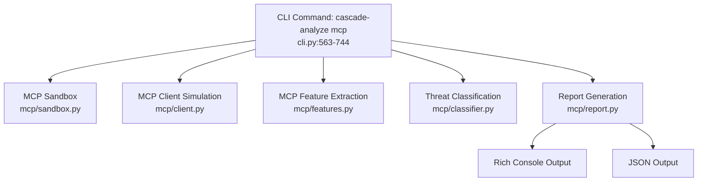
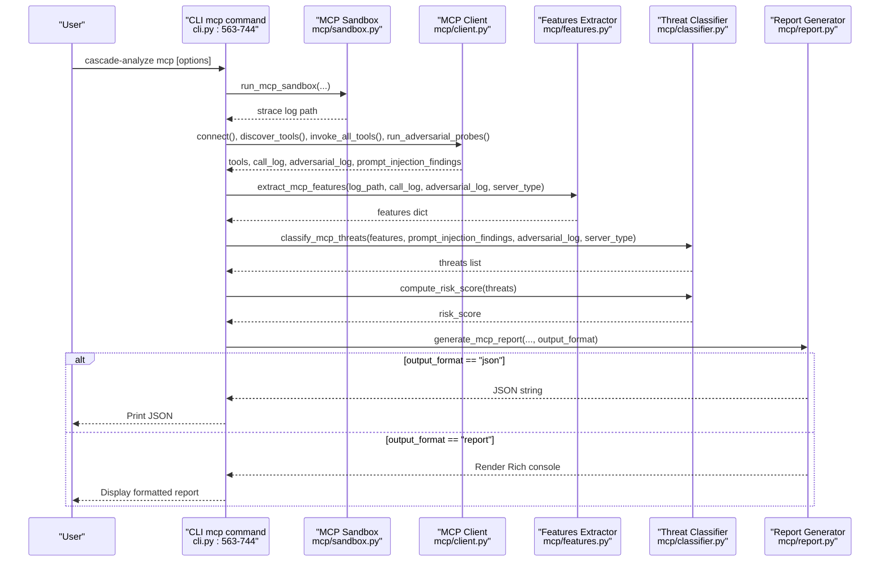
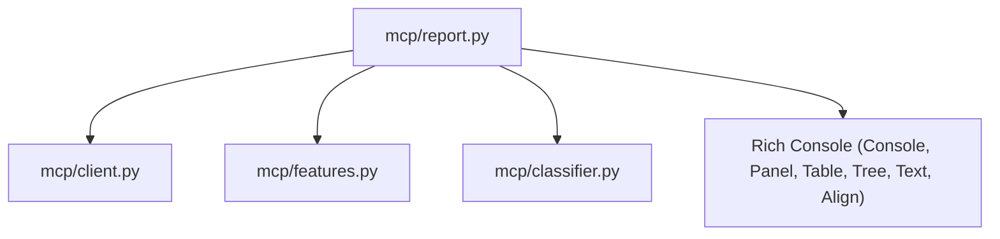

# MCP Report Generation

<cite>
**Referenced Files in This Document**
- [report.py](file://mcp/report.py)
- [classifier.py](file://mcp/classifier.py)
- [features.py](file://mcp/features.py)
- [client.py](file://mcp/client.py)
- [sandbox.py](file://mcp/sandbox.py)
- [cli.py](file://cli.py)
- [README.md](file://README.md)
</cite>

## Table of Contents
1. [Introduction](#introduction)
2. [Project Structure](#project-structure)
3. [Core Components](#core-components)
4. [Architecture Overview](#architecture-overview)
5. [Detailed Component Analysis](#detailed-component-analysis)
6. [Dependency Analysis](#dependency-analysis)
7. [Performance Considerations](#performance-considerations)
8. [Troubleshooting Guide](#troubleshooting-guide)
9. [Conclusion](#conclusion)
10. [Appendices](#appendices)

## Introduction
This document explains the MCP (Model Context Protocol) report generation and output formatting system in TraceTree. It focuses on the generate_mcp_report function, detailing the report structure, output format options (Rich console vs JSON), and how MCP-specific findings, threat classifications, risk scores, and comparative analysis results are presented. It also covers the report template system, customizable output formats, export capabilities, examples of report outputs, interpretation guidelines, integration with external systems, customization options, automated reporting workflows, and quality assurance measures for report accuracy.

## Project Structure
The MCP report generation is part of the mcp module and integrates with the broader TraceTree analysis pipeline. The CLI orchestrates the MCP analysis workflow and delegates report generation to the mcp/report module.

**Diagram sources**
- [cli.py:563-744](file://cli.py#L563-L744)
- [sandbox.py:1-327](file://mcp/sandbox.py#L1-L327)
- [client.py:1-473](file://mcp/client.py#L1-L473)
- [features.py:1-473](file://mcp/features.py#L1-L473)
- [classifier.py:1-268](file://mcp/classifier.py#L1-L268)
- [report.py:1-322](file://mcp/report.py#L1-L322)

**Section sources**
- [README.md:265-305](file://README.md#L265-L305)
- [cli.py:563-744](file://cli.py#L563-L744)

## Core Components
- generate_mcp_report: Main entry point for report generation. Supports two output modes: Rich console and JSON.
- _generate_json_report: Produces a machine-readable JSON report with cleaned features and structured sections.
- _generate_rich_report: Renders a human-friendly Rich console report with panels, tables, trees, and colored risk indicators.
- MCPClient: Simulates an MCP client to discover tools, invoke them safely, run adversarial probes, and detect prompt injection vectors.
- MCP feature extraction: Parses strace logs and extracts MCP-specific features for network behavior, process behavior, filesystem behavior, injection response, and baseline comparisons.
- Threat classification: Applies rule-based checks to derive MCP-specific threat categories and compute a risk score.

**Section sources**
- [report.py:27-133](file://mcp/report.py#L27-L133)
- [client.py:1-473](file://mcp/client.py#L1-L473)
- [features.py:32-206](file://mcp/features.py#L32-L206)
- [classifier.py:61-96](file://mcp/classifier.py#L61-L96)

## Architecture Overview
The MCP analysis pipeline produces a structured report by combining:
- Target metadata (package name, server type)
- Tool manifest (discovered tools, schemas, descriptions)
- Prompt injection scan results
- Per-tool syscall summary
- Threat detections with evidence
- Adversarial probe results
- Overall risk score
- Baseline comparison to known server baselines

**Diagram sources**
- [cli.py:563-744](file://cli.py#L563-L744)
- [sandbox.py:41-146](file://mcp/sandbox.py#L41-L146)
- [client.py:78-184](file://mcp/client.py#L78-L184)
- [features.py:32-206](file://mcp/features.py#L32-L206)
- [classifier.py:61-96](file://mcp/classifier.py#L61-L96)
- [report.py:27-73](file://mcp/report.py#L27-L73)

## Detailed Component Analysis

### Report Generation Function: generate_mcp_report
- Purpose: Generate a structured MCP security report in either Rich console or JSON format.
- Inputs:
  - target: analyzed package or path
  - server_type: detected server type (filesystem, github, postgres, fetch, shell)
  - tools: tool manifest from tools/list
  - features: MCP features extracted from strace
  - threats: MCP-specific threat detections with evidence
  - prompt_injection_findings: prompt injection scan results
  - adversarial_log: adversarial probe results
  - risk_score: overall risk rating (low/medium/high/critical)
  - baseline_comparison: deviation flags compared to known baseline
  - is_malicious: ML classifier verdict
  - ml_confidence: ML classifier confidence percentage
  - output_format: "report" for Rich console, "json" for machine-readable
- Behavior:
  - If output_format is "json", returns a JSON string via _generate_json_report.
  - Otherwise, renders a Rich console report via _generate_rich_report and returns an empty string.

**Section sources**
- [report.py:27-73](file://mcp/report.py#L27-L73)

### JSON Report Generation: _generate_json_report
- Purpose: Produce a machine-readable JSON report suitable for automation and external integrations.
- Key transformations:
  - Cleans features for JSON serialization by filtering out non-serializable types and reducing event objects to counts.
  - Builds per-tool syscall summaries with total syscall counts and syscall categories.
  - Truncates adversarial probe responses to a fixed length for readability.
  - Normalizes risk_score to uppercase and includes ML verdict and confidence.
- Output structure includes:
  - target, server_type, risk_score, ml_verdict, ml_confidence
  - tool_manifest
  - prompt_injection_scan
  - per_tool_syscall_summary
  - threat_detections
  - adversarial_probe_results
  - features
  - baseline_comparison

**Section sources**
- [report.py:76-133](file://mcp/report.py#L76-L133)

### Rich Console Report Generation: _generate_rich_report
- Purpose: Render a human-friendly, visually structured report using Rich panels, tables, and trees.
- Sections:
  - Header with target and server type
  - Overall risk score panel with colored borders and styles based on risk level
  - ML Verdict panel (TraceTree ML analysis) with confidence percentage
  - Tool Manifest table with tool name, description, and parameters
  - Prompt Injection Scan tree with findings grouped by tool and location
  - Per-Tool Syscall Summary table with totals and categories
  - Threat Detections tree with severity icons and evidence
  - Adversarial Probe Results table with tool, payload, crash status, and truncated response
  - Baseline Comparison tree with deviations or within-baseline status
- Formatting:
  - Uses colored styles for risk levels (green/yellow/orange3/red)
  - Panels with titles and borders for each section
  - Trees and tables for hierarchical and tabular data presentation

**Section sources**
- [report.py:136-299](file://mcp/report.py#L136-L299)

### MCP Client: Prompt Injection and Adversarial Probes
- Prompt Injection Detection:
  - Scans tool names, descriptions, and parameter descriptions for zero-width characters and prompt injection language patterns.
  - Reports findings with tool name, location, and evidence snippets.
- Adversarial Probes:
  - Re-invokes each tool with injection payloads and records whether the server crashes or responds unexpectedly.
  - Stores probe records with tool name, payload, arguments, response, and crash status.

**Section sources**
- [client.py:423-473](file://mcp/client.py#L423-L473)
- [client.py:147-184](file://mcp/client.py#L147-L184)

### MCP Feature Extraction: extract_mcp_features
- Purpose: Parse strace logs and extract MCP-specific behavioral features.
- Categories:
  - Network behavior: unexpected outbound connections, DNS lookups during tool calls, per-tool connection counts, unique destinations
  - Process behavior: child processes spawned, shell invocations, unexpected binary executions, execve targets
  - Filesystem behavior: reads outside working directory, sensitive path accesses, writes during read-only tool calls
  - Injection response: behavior change under adversarial input, shell spawn during injection, adversarial syscall delta
  - General: total syscalls, syscall counts, events attributed to tools
- Baseline Comparison:
  - Detects server type from package name and tool descriptions.
  - Compares features against known baselines for five server types (filesystem, github, postgres, fetch, shell) and reports deviations.

**Section sources**
- [features.py:32-206](file://mcp/features.py#L32-L206)
- [features.py:387-422](file://mcp/features.py#L387-L422)
- [features.py:429-472](file://mcp/features.py#L429-L472)

### Threat Classification: classify_mcp_threats and compute_risk_score
- Threat Categories:
  - COMMAND_INJECTION: shell spawned during adversarial probe, significant syscall pattern change, server crashes under probes
  - CREDENTIAL_EXFILTRATION: sensitive path accesses followed by network connections
  - COVERT_NETWORK_CALL: unexpected outbound connections or DNS lookups during tool calls
  - PATH_TRAVERSAL: reads outside working directory and sensitive path accesses
  - EXCESSIVE_PROCESS_SPAWNING: disproportionate child processes relative to tool calls
  - PROMPT_INJECTION_VECTOR: prompt injection patterns and zero-width characters in tool descriptions
- Risk Score Computation:
  - Computes risk from the maximum threat severity and threat count thresholds.

**Section sources**
- [classifier.py:21-58](file://mcp/classifier.py#L21-L58)
- [classifier.py:99-127](file://mcp/classifier.py#L99-L127)
- [classifier.py:239-267](file://mcp/classifier.py#L239-L267)

### MCP Sandbox: run_mcp_sandbox
- Purpose: Run MCP servers in a Docker sandbox with strace -f instrumentation.
- Capabilities:
  - Supports both stdio and HTTP/SSE transports
  - Blocks network by default or allows it based on configuration
  - Mounts local projects read-only
  - Builds and runs the sandbox image, waits for completion or timeout, and extracts the strace log

**Section sources**
- [sandbox.py:41-146](file://mcp/sandbox.py#L41-L146)

### CLI Integration: cascade-analyze mcp
- Orchestrates the entire MCP analysis workflow:
  - Preflight checks for Docker
  - Sandbox execution
  - Strace parsing and graph/ML integration
  - MCP client simulation (connect, discover tools, invoke, adversarial probes)
  - Feature extraction and threat classification
  - Report generation with selected output format
- Options:
  - --npm/--path: target selection
  - --allow-network: allow outbound network
  - --transport/--port: transport and port configuration
  - --output/-o: output format ("report" or "json")
  - --delay/--timeout: tool delay and analysis timeout

**Section sources**
- [cli.py:563-744](file://cli.py#L563-L744)
- [README.md:265-285](file://README.md#L265-L285)

## Dependency Analysis
The report generation depends on:
- MCPClient for tools, call logs, adversarial logs, and prompt injection findings
- extract_mcp_features for MCP-specific features and baseline comparison
- classify_mcp_threats and compute_risk_score for threat detections and risk score
- Rich console components for rendering the Rich report

**Diagram sources**
- [report.py:14-24](file://mcp/report.py#L14-L24)
- [client.py:1-473](file://mcp/client.py#L1-L473)
- [features.py:1-473](file://mcp/features.py#L1-L473)
- [classifier.py:1-268](file://mcp/classifier.py#L1-L268)

**Section sources**
- [report.py:14-24](file://mcp/report.py#L14-L24)

## Performance Considerations
- JSON report generation:
  - Feature cleaning reduces object sizes by converting event objects to counts, minimizing serialization overhead.
  - Response truncation limits adversarial probe result sizes.
- Rich report generation:
  - Tables and trees are constructed iteratively; large adversarial logs are truncated to a fixed number of rows.
  - Risk score computation and syscall category extraction are linear-time operations on event counts.
- I/O:
  - Sandbox extraction writes logs to disk; ensure adequate disk space and permissions.

[No sources needed since this section provides general guidance]

## Troubleshooting Guide
- Docker not available or unreachable:
  - The CLI checks for Docker and exits with guidance if unavailable.
- Sandbox fails to produce a strace log:
  - The CLI aborts MCP analysis early if the sandbox does not produce a log.
- MCP client cannot connect:
  - In stdio mode, the CLI proceeds with strace-only analysis; in HTTP mode, connection failures halt client steps.
- Large adversarial logs:
  - Rich report limits adversarial probe results to a fixed number of rows; JSON output includes all records.

**Section sources**
- [cli.py:74-111](file://cli.py#L74-L111)
- [cli.py:631-636](file://cli.py#L631-L636)
- [cli.py:688-691](file://cli.py#L688-L691)
- [report.py:268-277](file://mcp/report.py#L268-L277)

## Conclusion
The MCP report generation system integrates tightly with TraceTree’s sandboxed analysis pipeline to deliver actionable insights about MCP server security. It supports both human-readable Rich console reports and machine-readable JSON for automation. The system captures MCP-specific behaviors, threat classifications, risk scoring, and baseline comparisons, enabling robust security assessments and seamless integration with external systems.

[No sources needed since this section summarizes without analyzing specific files]

## Appendices

### Report Structure and Output Formats
- Rich Console Report:
  - Header with target and server type
  - Risk score panel with colored styling
  - ML Verdict panel
  - Tool Manifest table
  - Prompt Injection Scan tree
  - Per-Tool Syscall Summary table
  - Threat Detections tree
  - Adversarial Probe Results table
  - Baseline Comparison tree
- JSON Report:
  - Top-level fields: target, server_type, risk_score, ml_verdict, ml_confidence
  - Structured sections: tool_manifest, prompt_injection_scan, per_tool_syscall_summary, threat_detections, adversarial_probe_results, features, baseline_comparison

**Section sources**
- [report.py:136-299](file://mcp/report.py#L136-L299)
- [report.py:76-133](file://mcp/report.py#L76-L133)

### Interpretation Guidelines
- Risk Score:
  - Low/Medium/High/Critical derived from threat severity and count thresholds.
- Threat Categories:
  - COMMAND_INJECTION: shell execution under adversarial input
  - CREDENTIAL_EXFILTRATION: sensitive file access followed by network connection
  - COVERT_NETWORK_CALL: unexpected outbound connections or DNS lookups during tool calls
  - PATH_TRAVERSAL: reads outside working directory and sensitive paths
  - EXCESSIVE_PROCESS_SPAWNING: disproportionate child processes
  - PROMPT_INJECTION_VECTOR: prompt injection patterns and zero-width characters
- Baseline Comparison:
  - Deviations indicate behavior outside expected patterns for the detected server type.

**Section sources**
- [classifier.py:21-58](file://mcp/classifier.py#L21-L58)
- [classifier.py:239-267](file://mcp/classifier.py#L239-L267)
- [features.py:429-472](file://mcp/features.py#L429-L472)

### Integration with External Systems
- JSON output can be consumed by external systems for automated reporting, dashboards, or CI/CD pipelines.
- The CLI supports JSON output via the --output option.

**Section sources**
- [cli.py](file://cli.py#L570)
- [report.py:61-66](file://mcp/report.py#L61-L66)

### Customization Options
- Output format: switch between Rich console and JSON using the --output option.
- Transport and port: configure MCP transport and port for HTTP/SSE scenarios.
- Network policy: allow network access when legitimate for the server type.
- Tool delay and timeout: adjust timing for adversarial probing and sandbox runtime.

**Section sources**
- [cli.py:563-572](file://cli.py#L563-L572)
- [sandbox.py:41-48](file://mcp/sandbox.py#L41-L48)

### Automated Reporting Workflows
- Use the CLI with JSON output to integrate MCP analysis into automated pipelines.
- Combine with external logging and artifact storage for persistent reporting.

**Section sources**
- [cli.py](file://cli.py#L570)
- [report.py:61-66](file://mcp/report.py#L61-L66)

### Quality Assurance Measures
- JSON serialization cleanup prevents non-serializable types.
- Response truncation ensures consistent report sizes.
- Baseline comparison validates behavior against known server types.
- Risk score computation provides a standardized severity metric.

**Section sources**
- [report.py:91-101](file://mcp/report.py#L91-L101)
- [report.py:120-128](file://mcp/report.py#L120-L128)
- [features.py:429-472](file://mcp/features.py#L429-L472)
- [classifier.py:239-267](file://mcp/classifier.py#L239-L267)