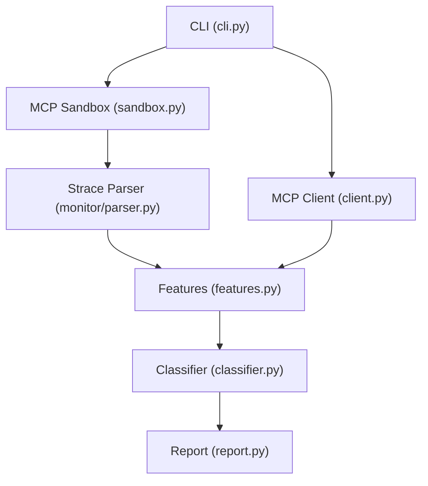
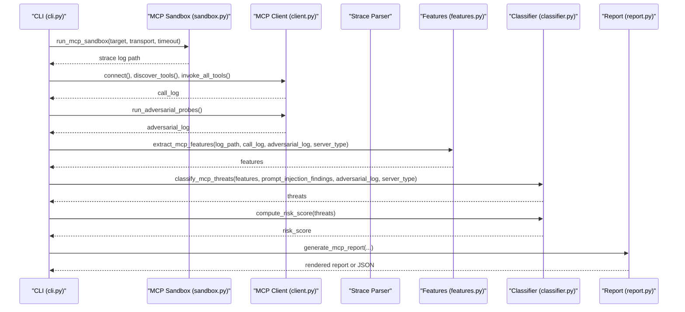
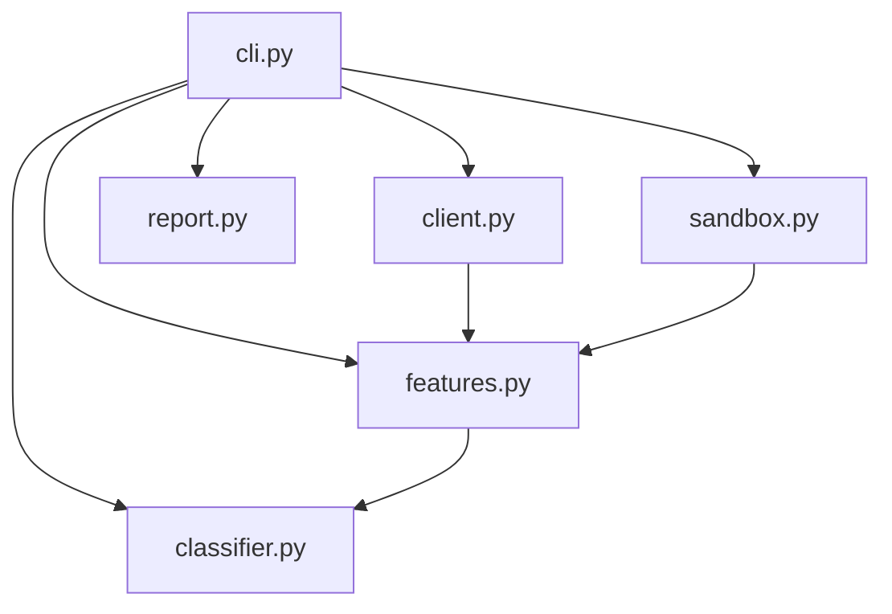

# MCP Threat Classification

<cite>
**Referenced Files in This Document**
- [classifier.py](file://mcp/classifier.py)
- [features.py](file://mcp/features.py)
- [client.py](file://mcp/client.py)
- [report.py](file://mcp/report.py)
- [sandbox.py](file://mcp/sandbox.py)
- [cli.py](file://cli.py)
- [README.md](file://README.md)
</cite>

## Table of Contents
1. [Introduction](#introduction)
2. [Project Structure](#project-structure)
3. [Core Components](#core-components)
4. [Architecture Overview](#architecture-overview)
5. [Detailed Component Analysis](#detailed-component-analysis)
6. [Dependency Analysis](#dependency-analysis)
7. [Performance Considerations](#performance-considerations)
8. [Troubleshooting Guide](#troubleshooting-guide)
9. [Conclusion](#conclusion)

## Introduction
This document explains the MCP (Model Context Protocol) threat classification system implemented in the TraceTree project. It focuses on the classify_mcp_threats function, detailing rule-based threat detection, risk scoring, and classification categories for MCP security vulnerabilities. It also covers integration with extracted features, prompt injection detection, adversarial probe analysis, and server type considerations. The document outlines risk score computation methodology, threat severity assessment, baseline comparison techniques, examples of threat classifications, scoring interpretations, decision-making criteria, false positive mitigation, classification accuracy evaluation, and customization options for threat categories.

## Project Structure
The MCP threat classification system is part of the TraceTree runtime behavioral analysis pipeline. It operates alongside sandboxing, feature extraction, adversarial probing, and reporting. The MCP module consists of:
- Classifier: rule-based threat detection and risk scoring
- Features: MCP-specific feature extraction and server type detection
- Client: simulated MCP client for tool discovery, invocation, and adversarial probing
- Report: Rich console and JSON report generation
- Sandbox: Docker sandbox for MCP server execution with strace instrumentation

**Diagram sources**
- [cli.py:564-744](file://cli.py#L564-L744)
- [sandbox.py:41-146](file://mcp/sandbox.py#L41-L146)
- [client.py:18-473](file://mcp/client.py#L18-L473)
- [features.py:32-206](file://mcp/features.py#L32-L206)
- [classifier.py:61-96](file://mcp/classifier.py#L61-L96)
- [report.py:27-74](file://mcp/report.py#L27-L74)

**Section sources**
- [README.md:265-320](file://README.md#L265-L320)
- [cli.py:564-744](file://cli.py#L564-L744)

## Core Components
- classify_mcp_threats: Evaluates extracted MCP features against rule-based threat categories and returns triggered threats with evidence.
- compute_risk_score: Aggregates threat severity and count to derive an overall risk rating.
- extract_mcp_features: Parses strace logs and extracts MCP-specific features including network behavior, process behavior, filesystem behavior, and injection response metrics.
- MCPClient: Simulates an MCP client to discover tools, invoke them with safe synthetic arguments, and run adversarial probes.
- generate_mcp_report: Produces a structured report including tool manifest, prompt injection scan results, per-tool syscall summaries, threat detections, adversarial probe results, risk score, and baseline comparison.

**Section sources**
- [classifier.py:61-268](file://mcp/classifier.py#L61-L268)
- [features.py:32-473](file://mcp/features.py#L32-L473)
- [client.py:18-473](file://mcp/client.py#L18-L473)
- [report.py:27-322](file://mcp/report.py#L27-L322)

## Architecture Overview
The MCP threat classification pipeline integrates with the broader TraceTree runtime analysis:
- Sandbox: Runs the MCP server in a Docker container with strace -f instrumentation.
- Client Simulation: Performs JSON-RPC 2.0 handshake, discovers tools, invokes them safely, and runs adversarial probes.
- Feature Extraction: Parses strace logs and extracts MCP-specific features grouped by tool-call activity.
- Threat Classification: Applies rule-based checks to detect six threat categories and computes risk score.
- Reporting: Generates Rich console or JSON reports with all analysis artifacts.

**Diagram sources**
- [cli.py:615-743](file://cli.py#L615-L743)
- [sandbox.py:41-146](file://mcp/sandbox.py#L41-L146)
- [client.py:78-184](file://mcp/client.py#L78-L184)
- [features.py:32-206](file://mcp/features.py#L32-L206)
- [classifier.py:61-96](file://mcp/classifier.py#L61-L96)
- [report.py:27-74](file://mcp/report.py#L27-L74)

## Detailed Component Analysis

### Rule-Based Threat Categories and Checks
The classifier defines six threat categories with severity levels and specific checks:
- COMMAND_INJECTION: Shell process spawned during or near adversarial probe; significant change in syscall pattern under adversarial input; server crashes under adversarial probes.
- CREDENTIAL_EXFILTRATION: Credential-related files accessed; network connection shortly after credential file access.
- COVERT_NETWORK_CALL: Unexpected outbound connections; DNS lookups during tool call.
- PATH_TRAVERSAL: Reads outside working directory; sensitive file access.
- EXCESSIVE_PROCESS_SPAWNING: Child processes spawned across tool calls exceeding thresholds.
- PROMPT_INJECTION_VECTOR: Tool descriptions or parameter descriptions contain zero-width characters or prompt injection language patterns.

Evidence collection is performed per category using dedicated check functions that inspect extracted features and adversarial logs.

**Section sources**
- [classifier.py:21-58](file://mcp/classifier.py#L21-L58)
- [classifier.py:129-236](file://mcp/classifier.py#L129-L236)

### Risk Score Computation Methodology
The compute_risk_score function derives an overall risk rating from the list of triggered threats:
- Severity mapping: low=1, medium=2, high=3, critical=4.
- Decision thresholds:
  - Critical: max severity >= 4 OR threat count >= 4
  - High: max severity >= 3 OR threat count >= 3
  - Medium: max severity >= 2 OR threat count >= 2
  - Low: otherwise

This scoring scheme prioritizes the presence of critical threats and the number of threats detected.

**Section sources**
- [classifier.py:239-268](file://mcp/classifier.py#L239-L268)

### Integration with Extracted Features
The extract_mcp_features function parses strace logs and builds a comprehensive feature set:
- Network behavior: unexpected outbound connections, DNS lookups during tool calls, connection counts per tool call, unique destinations.
- Process behavior: child processes spawned, shell invocations, unexpected binary executions, execve targets.
- Filesystem behavior: reads outside working directory, sensitive file access, writes during read-only tool calls.
- Injection response: behavior change under adversarial input, shell spawn during injection, adversarial syscall delta.
- General: total syscalls, syscall counts, events attributed to tools.
- Baseline comparison: compares observed behavior to known server baselines for filesystem, GitHub, Postgres, fetch, and shell servers.

The function also detects server type from package name and tool descriptions, enabling baseline comparisons.

**Section sources**
- [features.py:32-206](file://mcp/features.py#L32-L206)
- [features.py:337-473](file://mcp/features.py#L337-L473)
- [features.py:387-422](file://mcp/features.py#L387-L422)

### Prompt Injection Detection
The MCP client scans tool names, descriptions, and parameter descriptions for:
- Zero-width characters
- Prompt injection language patterns (e.g., “ignore previous instructions”, “disregard”, “system:”)

Findings are collected with tool name, location, and text samples for inclusion in the threat classification and report.

**Section sources**
- [client.py:423-473](file://mcp/client.py#L423-L473)

### Adversarial Probe Analysis
The MCP client performs adversarial probing by:
- Discovering tools and invoking them with safe synthetic arguments.
- Re-invoking each tool with injection payloads (e.g., shell command injection, path traversal, script injection).
- Recording probe outcomes including whether the server crashed or responded abnormally.

These adversarial logs inform injection response metrics and command injection detection.

**Section sources**
- [client.py:147-184](file://mcp/client.py#L147-L184)
- [client.py:32-49](file://mcp/client.py#L32-L49)

### Server Type Considerations and Baseline Comparison
The system auto-detects server type from the package name and tool descriptions. Known baselines define expected syscalls, network allowances, process spawning policies, sensitive read permissions, and write path restrictions. The baseline comparison flags deviations such as unexpected network connections, process spawning, sensitive path access, and shell binary invocations.

**Section sources**
- [features.py:387-422](file://mcp/features.py#L387-L422)
- [features.py:429-473](file://mcp/features.py#L429-L473)

### Example Threat Classifications and Scoring Interpretations
- COMMAND_INJECTION: Evidence includes shell spawn during injection, significant syscall delta under adversarial input, and server crashes under probes. Risk: critical.
- CREDENTIAL_EXFILTRATION: Evidence includes access to credential-related files and subsequent network connections. Risk: critical.
- COVERT_NETWORK_CALL: Evidence includes unexpected outbound connections and DNS lookups during tool calls. Risk: high.
- PATH_TRAVERSAL: Evidence includes reads outside working directory and sensitive path access. Risk: high.
- EXCESSIVE_PROCESS_SPAWNING: Evidence includes disproportionate child process count relative to tool calls. Risk: medium.
- PROMPT_INJECTION_VECTOR: Evidence includes zero-width characters and prompt injection language in tool descriptions. Risk: high.

Risk score interpretation:
- Critical: indicates severe or numerous threats requiring immediate action.
- High: indicates significant risks warranting investigation.
- Medium: indicates moderate risks requiring review.
- Low: indicates minimal risk.

**Section sources**
- [classifier.py:129-236](file://mcp/classifier.py#L129-L236)
- [classifier.py:239-268](file://mcp/classifier.py#L239-L268)

### Decision-Making Criteria
- Severity-driven: prioritize critical threats; a single critical threat elevates risk to critical.
- Threshold-driven: cumulative threat count thresholds determine risk tiers.
- Evidence-driven: each threat category requires specific evidence from features or adversarial logs.

**Section sources**
- [classifier.py:239-268](file://mcp/classifier.py#L239-L268)

### False Positive Mitigation
- Baseline comparison: deviations are flagged only when they exceed expectations for the detected server type.
- Adversarial validation: shell spawns and syscall deltas under adversarial input reduce false positives by confirming anomalous behavior.
- Prompt injection filtering: zero-width characters and injection patterns are explicitly checked to avoid benign matches.

**Section sources**
- [features.py:429-473](file://mcp/features.py#L429-L473)
- [classifier.py:129-151](file://mcp/classifier.py#L129-L151)
- [client.py:423-473](file://mcp/client.py#L423-L473)

### Classification Accuracy Evaluation
- The MCP module is rule-based and does not include built-in accuracy metrics or evaluation harnesses.
- Integration with the broader TraceTree pipeline (ML anomaly detection, signature matching, temporal analysis) provides complementary signals for accuracy assessment.

**Section sources**
- [README.md:43-82](file://README.md#L43-L82)

### Customization Options for Threat Categories
- New categories: Extend THREAT_CATEGORIES with name, severity, and description; add a corresponding check function and integrate into _check_threat.
- Severity tuning: Adjust thresholds in compute_risk_score to reflect organizational risk tolerance.
- Evidence rules: Modify category-specific check functions to refine detection heuristics.
- Baseline customization: Extend KNOWN_BASELINES with new server types and expected behaviors.

**Section sources**
- [classifier.py:21-58](file://mcp/classifier.py#L21-L58)
- [classifier.py:99-127](file://mcp/classifier.py#L99-L127)
- [classifier.py:239-268](file://mcp/classifier.py#L239-L268)
- [features.py:341-384](file://mcp/features.py#L341-L384)

## Dependency Analysis
The MCP threat classification depends on:
- CLI orchestration for sandboxing, client simulation, feature extraction, classification, and reporting.
- MCP sandbox for containerized execution and strace instrumentation.
- MCP client for tool discovery, invocation, and adversarial probing.
- Feature extraction for MCP-specific metrics and baseline comparison.
- Classifier for rule-based threat detection and risk scoring.
- Report generator for structured output.

**Diagram sources**
- [cli.py:615-743](file://cli.py#L615-L743)
- [sandbox.py:41-146](file://mcp/sandbox.py#L41-L146)
- [client.py:18-473](file://mcp/client.py#L18-L473)
- [features.py:32-206](file://mcp/features.py#L32-L206)
- [classifier.py:61-96](file://mcp/classifier.py#L61-L96)
- [report.py:27-74](file://mcp/report.py#L27-L74)

**Section sources**
- [cli.py:615-743](file://cli.py#L615-L743)

## Performance Considerations
- Feature extraction: Parsing strace logs and attributing events to tools scales with event count; ensure efficient timestamp mapping and feature aggregation.
- Adversarial probing: Running multiple probes per tool increases runtime; tune tool_delay and probe count for balance.
- Baseline comparison: Comparisons are lightweight but depend on feature completeness; ensure robust feature extraction for accurate deviations.
- Reporting: Rich console rendering is slower than JSON; use JSON output for automation and batch processing.

[No sources needed since this section provides general guidance]

## Troubleshooting Guide
- Sandbox failures: Verify Docker is installed and running; confirm the sandbox image is built and accessible.
- Client connectivity: For HTTP transport, ensure the endpoint responds; for stdio transport, verify the server command is correct.
- Missing strace logs: Confirm strace instrumentation and log extraction succeeded; check container logs for errors.
- Empty threat detections: Validate that adversarial probes were executed and prompt injection scan found suspicious patterns; ensure features were extracted and server type detection succeeded.
- Baseline mismatches: Confirm server_type detection and baseline availability; adjust allowlists or baselines as needed.

**Section sources**
- [cli.py:75-111](file://cli.py#L75-L111)
- [sandbox.py:63-84](file://mcp/sandbox.py#L63-L84)
- [client.py:238-264](file://mcp/client.py#L238-L264)
- [features.py:312-334](file://mcp/features.py#L312-L334)

## Conclusion
The MCP threat classification system provides a robust, rule-based approach to identifying security vulnerabilities in Model Context Protocol servers. By integrating adversarial probing, prompt injection detection, and baseline comparisons, it offers actionable insights with interpretable risk scores. The modular design allows easy customization of threat categories, severity thresholds, and baselines to align with organizational security posture and operational context.