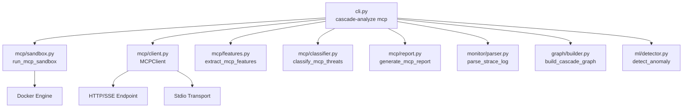
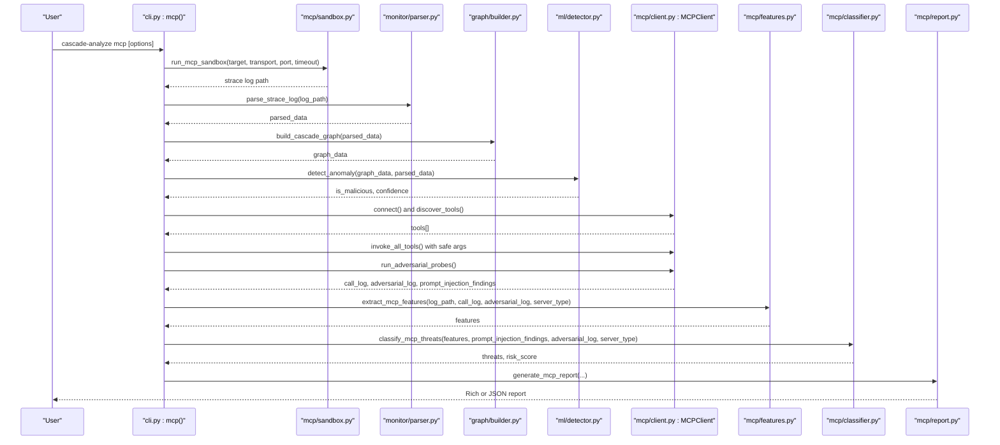
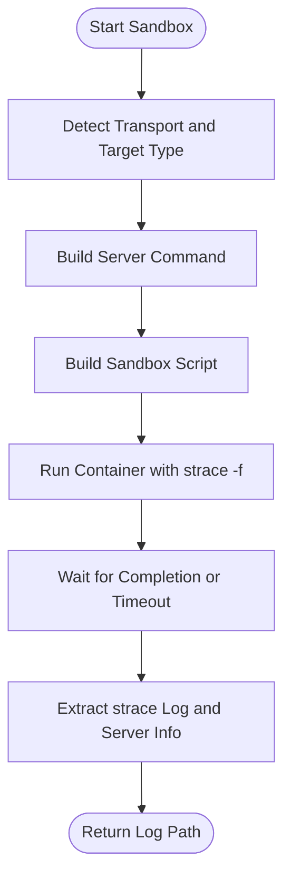
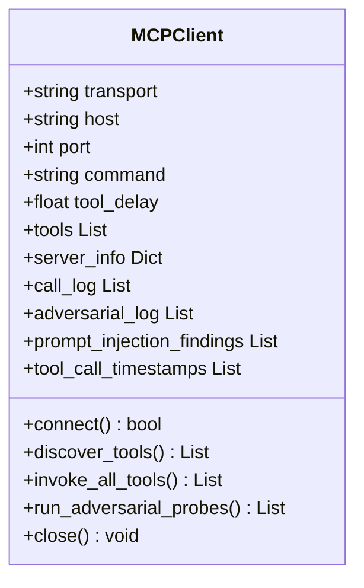
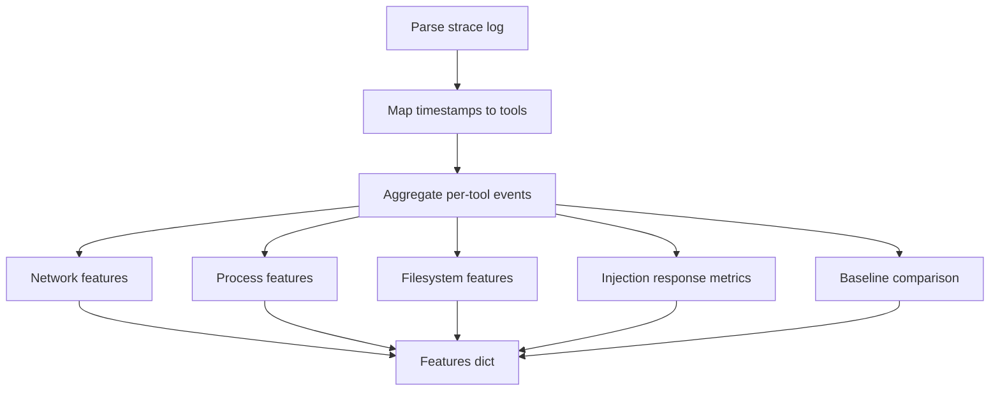
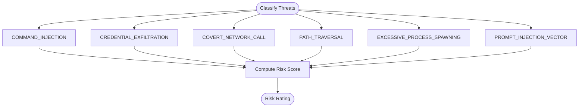
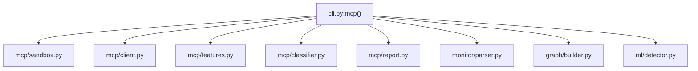

# cascade-mcp Command

<cite>
**Referenced Files in This Document**
- [cli.py](file://cli.py)
- [mcp/__init__.py](file://mcp/__init__.py)
- [mcp/client.py](file://mcp/client.py)
- [mcp/features.py](file://mcp/features.py)
- [mcp/classifier.py](file://mcp/classifier.py)
- [mcp/report.py](file://mcp/report.py)
- [mcp/sandbox.py](file://mcp/sandbox.py)
- [README.md](file://README.md)
- [tests/mcp/test_sandbox_injection.py](file://tests/mcp/test_sandbox_injection.py)
</cite>

## Table of Contents
1. [Introduction](#introduction)
2. [Project Structure](#project-structure)
3. [Core Components](#core-components)
4. [Architecture Overview](#architecture-overview)
5. [Detailed Component Analysis](#detailed-component-analysis)
6. [Dependency Analysis](#dependency-analysis)
7. [Performance Considerations](#performance-considerations)
8. [Troubleshooting Guide](#troubleshooting-guide)
9. [Conclusion](#conclusion)
10. [Appendices](#appendices)

## Introduction
The cascade-mcp command specializes TraceTree’s runtime behavioral analysis pipeline to evaluate Model Context Protocol (MCP) servers for security risks. It runs an MCP server in a sandboxed Docker container, simulates an MCP client to discover and invoke tools, injects adversarial probes, extracts MCP-specific features from the syscall trace, classifies threats, and generates a structured report. It supports both npm packages and local projects, with flexible transport modes (stdio/http), network permissions, and output formats.

## Project Structure
The MCP analysis is implemented as a cohesive module under the mcp/ directory, integrated into the main CLI as a dedicated subcommand. The command orchestrates sandboxing, parsing, graphing, ML classification, MCP client simulation, feature extraction, threat classification, and reporting.

**Diagram sources**
- [cli.py:564-744](file://cli.py#L564-L744)
- [mcp/sandbox.py:41-146](file://mcp/sandbox.py#L41-L146)
- [mcp/client.py:18-358](file://mcp/client.py#L18-L358)
- [mcp/features.py:32-206](file://mcp/features.py#L32-L206)
- [mcp/classifier.py:61-268](file://mcp/classifier.py#L61-L268)
- [mcp/report.py:27-322](file://mcp/report.py#L27-L322)

**Section sources**
- [cli.py:564-744](file://cli.py#L564-L744)
- [README.md:265-305](file://README.md#L265-L305)

## Core Components
- CLI subcommand: cascade-analyze mcp with options for npm package, local path, network permissions, transport mode, port, output format, tool call delay, and analysis timeout.
- MCP sandbox: Docker-based containerization with strace -f instrumentation, network controls, and transport-specific server startup.
- MCP client: Simulated JSON-RPC 2.0 client that performs handshake, discovers tools, invokes with safe synthetic arguments, and runs adversarial probes.
- Feature extraction: MCP-specific syscall features grouped by tool-call activity, including network, process, filesystem, and injection response metrics.
- Threat classification: Rule-based categories with severity and risk scoring methodology.
- Reporting: Rich console and JSON output with tool manifest, per-tool syscall summaries, threat detections, adversarial probe results, and baseline comparisons.

**Section sources**
- [cli.py:564-744](file://cli.py#L564-L744)
- [mcp/sandbox.py:41-146](file://mcp/sandbox.py#L41-L146)
- [mcp/client.py:18-358](file://mcp/client.py#L18-L358)
- [mcp/features.py:32-206](file://mcp/features.py#L32-L206)
- [mcp/classifier.py:61-268](file://mcp/classifier.py#L61-L268)
- [mcp/report.py:27-322](file://mcp/report.py#L27-L322)

## Architecture Overview
The cascade-mcp workflow integrates MCP-specific steps into TraceTree’s standard pipeline:

**Diagram sources**
- [cli.py:615-744](file://cli.py#L615-L744)
- [mcp/sandbox.py:41-146](file://mcp/sandbox.py#L41-L146)
- [mcp/client.py:78-184](file://mcp/client.py#L78-L184)
- [mcp/features.py:32-206](file://mcp/features.py#L32-L206)
- [mcp/classifier.py:61-268](file://mcp/classifier.py#L61-L268)
- [mcp/report.py:27-74](file://mcp/report.py#L27-L74)

## Detailed Component Analysis

### Command Syntax and Options
- --npm: Analyze an npm package by installing globally and launching via npx.
- --path: Analyze a local MCP server project by mounting the directory and attempting common start commands.
- --allow-network: Permit outbound network traffic by skipping network blocking in the sandbox.
- --transport: Force transport mode. Values: stdio or http. Auto-detected if omitted.
- --port: TCP port for HTTP/SSE transport. Defaults to 3000.
- --output: Output format. Values: report (Rich console) or json.
- --delay: Seconds between tool calls during analysis (default 2.0).
- --timeout: Maximum seconds for the sandbox session (default 60).

Security implications:
- Network blocking is enabled by default to prevent covert channels and exfiltration during analysis.
- Stdio transport runs the server under strace and communicates via named pipes; HTTP transport starts the server and allows external MCP client connections.

Practical examples:
- Analyze an npm MCP server: cascade-analyze mcp --npm @modelcontextprotocol/server-github
- Analyze a local project: cascade-analyze mcp --path ./my-mcp-server
- Allow network: cascade-analyze mcp --npm @modelcontextprotocol/server-github --allow-network
- Force HTTP transport: cascade-analyze mcp --npm some-package --transport http --port 3000
- JSON output: cascade-analyze mcp --npm some-package --output json

**Section sources**
- [cli.py:564-573](file://cli.py#L564-L573)
- [cli.py:584-595](file://cli.py#L584-L595)
- [README.md:269-285](file://README.md#L269-L285)

### MCP Sandbox
The MCP sandbox builds or pulls a sandbox image, prepares a container with strace -f instrumentation, and runs the server under controlled conditions:
- Strace captures execve, open/openat, read/write, connect/socket/sendto/recvfrom, fork/clone, unlink/rename/chmod, stat/lstat/access/mkdir, bind/listen/accept, setsockopt/getsockopt/shutdown, and more.
- Network: Disabled by default (ip link set eth0 down) unless --allow-network is set.
- Volumes: For local projects, the directory is mounted read-only at /mcp-server.
- Transport-specific startup:
  - HTTP: Starts the server in background, writes server_info.txt with PID, port, and transport.
  - Stdio: Starts the server under strace with FIFOs for stdin/stdout/stderr.
- Timeout: Enforced by killing the container after the specified duration.

**Diagram sources**
- [mcp/sandbox.py:41-146](file://mcp/sandbox.py#L41-L146)
- [mcp/sandbox.py:148-232](file://mcp/sandbox.py#L148-L232)
- [mcp/sandbox.py:235-271](file://mcp/sandbox.py#L235-L271)
- [mcp/sandbox.py:274-327](file://mcp/sandbox.py#L274-L327)

**Section sources**
- [mcp/sandbox.py:41-146](file://mcp/sandbox.py#L41-L146)
- [mcp/sandbox.py:148-232](file://mcp/sandbox.py#L148-L232)
- [mcp/sandbox.py:235-271](file://mcp/sandbox.py#L235-L271)
- [mcp/sandbox.py:274-327](file://mcp/sandbox.py#L274-L327)

### MCP Client Simulation
The MCP client simulates a real MCP client:
- Transport auto-detection: stdio if a command is provided, otherwise http.
- Connection verification: For HTTP, checks SSE endpoint availability.
- Handshake: JSON-RPC 2.0 initialize with protocol version and client info, followed by notifications/initialized.
- Tool discovery: tools/list and scans tool descriptions for prompt injection patterns and zero-width characters.
- Safe synthetic invocation: Generates arguments based on JSON schema (strings=test_value, numbers=0, booleans=false, arrays=[], objects={}).
- Adversarial probes: Iterates over predefined payloads and injects into the first string field of tool arguments; records whether the server crashes or responds differently.
- Logging: Maintains call_log, adversarial_log, and prompt_injection_findings for downstream analysis.

**Diagram sources**
- [mcp/client.py:18-358](file://mcp/client.py#L18-L358)

**Section sources**
- [mcp/client.py:78-184](file://mcp/client.py#L78-L184)
- [mcp/client.py:229-358](file://mcp/client.py#L229-L358)

### MCP-Specific Feature Extraction
The feature extractor parses the strace log and aggregates behavior per tool call:
- Network: Unexpected outbound connections, DNS lookups during tool calls, per-tool connection counts, unique destinations.
- Process: Child process spawns, shell invocations, unexpected binary executions, execve targets.
- Filesystem: Reads outside working directory, sensitive path accesses, writes during read-only tool calls.
- Injection response: Behavior change under adversarial input, shell spawn during injection, adversarial syscall delta.
- Baseline comparison: Compares observed behavior to known server baselines (filesystem, github, postgres, fetch, shell).

**Diagram sources**
- [mcp/features.py:32-206](file://mcp/features.py#L32-L206)
- [mcp/features.py:209-238](file://mcp/features.py#L209-L238)
- [mcp/features.py:387-422](file://mcp/features.py#L387-L422)
- [mcp/features.py:429-473](file://mcp/features.py#L429-L473)

**Section sources**
- [mcp/features.py:32-206](file://mcp/features.py#L32-L206)
- [mcp/features.py:209-238](file://mcp/features.py#L209-L238)
- [mcp/features.py:387-422](file://mcp/features.py#L387-L422)
- [mcp/features.py:429-473](file://mcp/features.py#L429-L473)

### Threat Classification and Risk Scoring
Rule-based categories with severity and evidence:
- COMMAND_INJECTION: Shell spawned during adversarial probe, significant syscall delta, server crashes under probes.
- CREDENTIAL_EXFILTRATION: Credential-related file access followed by network connections.
- COVERT_NETWORK_CALL: Unexpected outbound connections and DNS lookups during tool calls.
- PATH_TRAVERSAL: Reads outside working directory and sensitive path accesses.
- EXCESSIVE_PROCESS_SPAWNING: Child processes far exceeding tool call count.
- PROMPT_INJECTION_VECTOR: Zero-width characters and prompt injection language in tool descriptions.

Risk scoring:
- Aggregates maximum severity and threat count thresholds to rate overall risk as low, medium, high, or critical.

**Diagram sources**
- [mcp/classifier.py:61-268](file://mcp/classifier.py#L61-L268)

**Section sources**
- [mcp/classifier.py:61-268](file://mcp/classifier.py#L61-L268)

### Reporting
Two output modes:
- Rich console: Panels, tables, and trees summarizing risk score, ML verdict, tool manifest, prompt injection scan, per-tool syscall summary, threat detections, adversarial probe results, and baseline comparison.
- JSON: Structured report with cleaned features, tool manifest, prompt injection scan, per-tool syscall counts, threat detections, adversarial probe results, and baseline comparison.

**Section sources**
- [mcp/report.py:27-322](file://mcp/report.py#L27-L322)

## Dependency Analysis
The cascade-mcp subcommand composes multiple modules and integrates with the standard pipeline:

**Diagram sources**
- [cli.py:606-614](file://cli.py#L606-L614)
- [mcp/__init__.py:9-21](file://mcp/__init__.py#L9-L21)

**Section sources**
- [cli.py:606-614](file://cli.py#L606-L614)
- [mcp/__init__.py:9-21](file://mcp/__init__.py#L9-L21)

## Performance Considerations
- Tool call delay: Increasing --delay reduces stress on the server and MCP client, minimizing timeouts and flaky adversarial probes.
- Timeout: Tune --timeout to accommodate server startup and tool invocation durations; too short may abort analysis prematurely.
- Transport mode: HTTP transport may incur slight overhead compared to stdio, but enables external client connectivity.
- Network permissions: Blocking network traffic reduces analysis time and avoids noisy connections, improving signal-to-noise in feature extraction.

[No sources needed since this section provides general guidance]

## Troubleshooting Guide
Common issues and resolutions:
- Docker not installed or unreachable: The CLI checks Docker preflight and exits with guidance if unavailable.
- Sandbox fails to produce a trace log: The analysis aborts early if no strace log is found.
- Transport mismatch: If --transport is not set, auto-detection chooses stdio when a command is provided and http otherwise. For HTTP, ensure the server exposes an SSE endpoint and the port is correct.
- Network blocked unexpectedly: Use --allow-network to permit outbound connections for servers that legitimately require internet access.
- Adversarial probes cause instability: Reduce --delay or increase --timeout to allow more time for server stability.
- Port injection concerns: The sandbox and command builders sanitize inputs and quote arguments to prevent shell injection.

Security hardening:
- The sandbox disables network by default and runs as a non-root user.
- Inputs for npm package names and ports are sanitized before shell interpolation.
- Transport and port values are quoted when embedded in server_info.txt.

**Section sources**
- [cli.py:74-111](file://cli.py#L74-L111)
- [cli.py:631-636](file://cli.py#L631-L636)
- [mcp/sandbox.py:63-72](file://mcp/sandbox.py#L63-L72)
- [mcp/sandbox.py:162-163](file://mcp/sandbox.py#L162-L163)
- [tests/mcp/test_sandbox_injection.py:4-50](file://tests/mcp/test_sandbox_injection.py#L4-L50)

## Conclusion
The cascade-mcp command extends TraceTree’s robust behavioral analysis pipeline to MCP servers. By combining sandboxed execution, MCP client simulation, adversarial probing, MCP-specific feature extraction, and rule-based threat classification, it provides actionable insights into server behavior, risk exposure, and deviations from expected baselines. Its flexible transport modes, network controls, and output formats make it suitable for both automated and interactive security assessments.

[No sources needed since this section summarizes without analyzing specific files]

## Appendices

### Practical Examples
- Analyze an npm MCP GitHub server:
  - cascade-analyze mcp --npm @modelcontextprotocol/server-github
- Analyze a local MCP server project:
  - cascade-analyze mcp --path ./my-mcp-server
- Allow network for legitimate external dependencies:
  - cascade-analyze mcp --npm @modelcontextprotocol/server-github --allow-network
- Force HTTP transport and specify port:
  - cascade-analyze mcp --npm some-package --transport http --port 3000
- Generate JSON report for CI/automation:
  - cascade-analyze mcp --npm some-package --output json

**Section sources**
- [README.md:269-285](file://README.md#L269-L285)