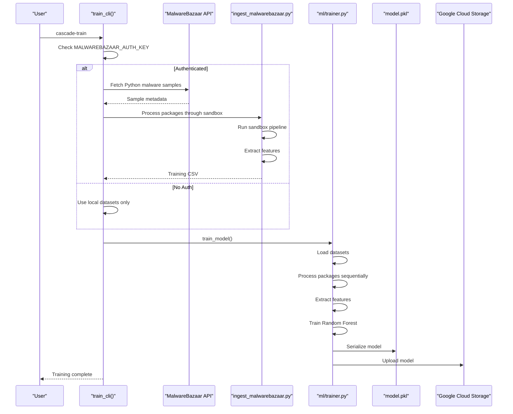
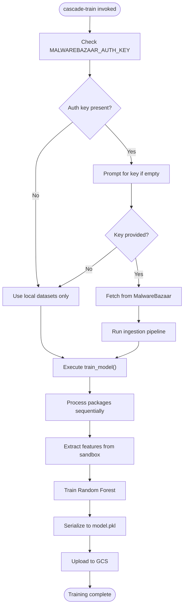
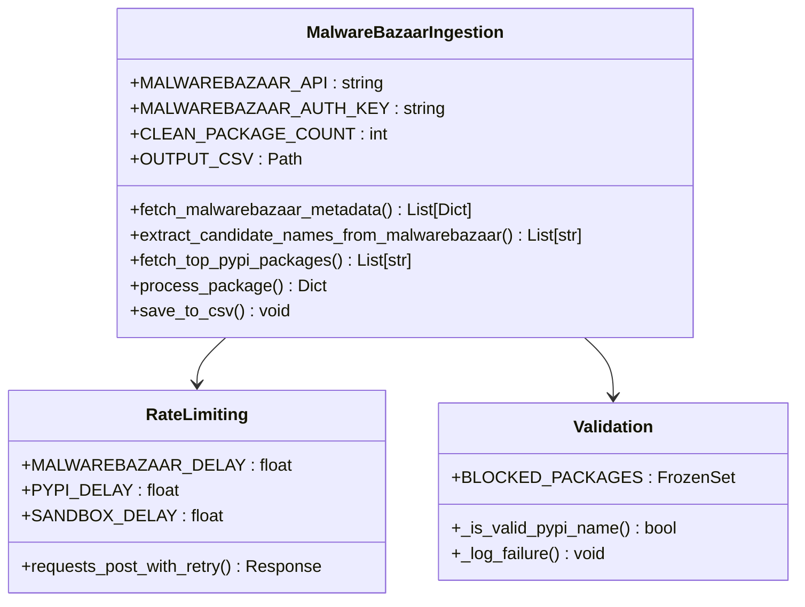
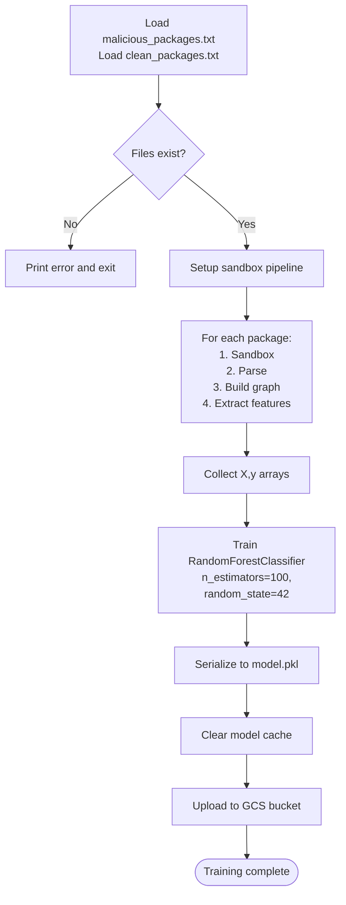
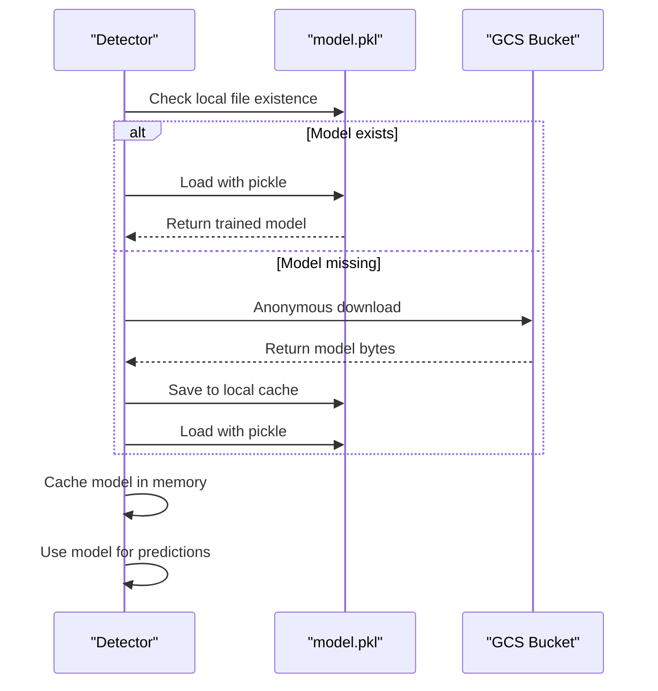
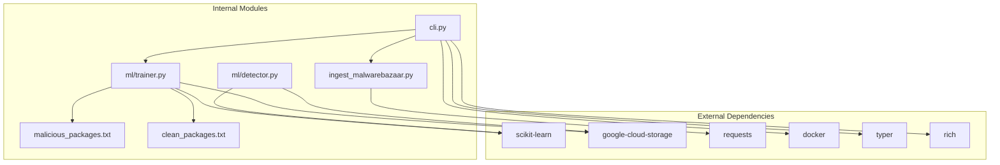

# cascade-train Command

<cite>
**Referenced Files in This Document**
- [cli.py](file://cli.py)
- [ingest_malwarebazaar.py](file://ingest_malwarebazaar.py)
- [ml/trainer.py](file://ml/trainer.py)
- [ml/detector.py](file://ml/detector.py)
- [data/malicious_packages.txt](file://data/malicious_packages.txt)
- [data/clean_packages.txt](file://data/clean_packages.txt)
- [pyproject.toml](file://pyproject.toml)
- [README.md](file://README.md)
</cite>

## Table of Contents
1. [Introduction](#introduction)
2. [Project Structure](#project-structure)
3. [Core Components](#core-components)
4. [Architecture Overview](#architecture-overview)
5. [Detailed Component Analysis](#detailed-component-analysis)
6. [Dependency Analysis](#dependency-analysis)
7. [Performance Considerations](#performance-considerations)
8. [Troubleshooting Guide](#troubleshooting-guide)
9. [Conclusion](#conclusion)

## Introduction
The cascade-train command orchestrates a complete machine learning model training pipeline for behavioral malware detection. It integrates with MalwareBazaar for live dataset ingestion and combines it with local cached data to train a supervised Random Forest classifier. The command provides interactive authentication for MalwareBazaar access, falls back to local datasets when authentication is unavailable, and manages the entire training pipeline from data collection to model serialization.

## Project Structure
The training system spans several key modules that work together to create a robust machine learning pipeline:

```mermaid
graph TB
subgraph "CLI Layer"
CLI[cli.py<br/>Command Entry Point]
TrainCLI[train_cli()<br/>Interactive Training]
end
subgraph "Data Ingestion"
MB[MalwareBazaar<br/>Live Dataset]
Ingest[ingest_malwarebazaar.py<br/>Data Pipeline]
end
subgraph "Training Engine"
Trainer[ml/trainer.py<br/>Model Training]
Detector[ml/detector.py<br/>Model Loading]
end
subgraph "Dataset Sources"
Malicious[data/malicious_packages.txt<br/>Curated Malicious]
Clean[data/clean_packages.txt<br/>Clean Packages]
end
subgraph "Model Storage"
Model[model.pkl<br/>Serialized Model]
GCS[Google Cloud Storage<br/>Remote Cache]
end
CLI --> TrainCLI
TrainCLI --> MB
TrainCLI --> Ingest
TrainCLI --> Trainer
Trainer --> Malicious
Trainer --> Clean
Trainer --> Model
Trainer --> GCS
Detector --> Model
Detector --> GCS
```

**Diagram sources**
- [cli.py:501-561](file://cli.py#L501-L561)
- [ingest_malwarebazaar.py:460-619](file://ingest_malwarebazaar.py#L460-L619)
- [ml/trainer.py:15-99](file://ml/trainer.py#L15-L99)
- [ml/detector.py:108-163](file://ml/detector.py#L108-L163)

**Section sources**
- [cli.py:501-561](file://cli.py#L501-L561)
- [pyproject.toml:26-32](file://pyproject.toml#L26-L32)

## Core Components

### MalwareBazaar Integration
The training pipeline integrates with MalwareBazaar through a dedicated ingestion script that handles API authentication, rate limiting, and data processing:

- **Authentication Management**: Supports both authenticated and anonymous access via environment variables
- **Rate Limiting**: Implements configurable delays between API requests to respect service limits
- **Data Processing**: Converts raw API responses into structured training data with feature extraction
- **Failure Handling**: Comprehensive logging and retry mechanisms for robust operation

### Local Dataset Management
The system maintains curated local datasets for reliable offline training:

- **Malicious Package List**: Curated collection of known malicious package names
- **Clean Package List**: Balanced selection of legitimate packages for training
- **Automatic Validation**: Ensures dataset integrity and prevents training on invalid packages

### Training Pipeline
The core training engine implements a supervised learning approach:

- **Sequential Processing**: Processes packages one at a time to maintain consistent feature extraction
- **Feature Engineering**: Extracts 10-dimensional feature vectors from execution graphs
- **Model Training**: Uses Random Forest with 100 estimators and fixed random state
- **Model Persistence**: Serializes trained models to pickle format for deployment

**Section sources**
- [ingest_malwarebazaar.py:58-87](file://ingest_malwarebazaar.py#L58-L87)
- [ml/trainer.py:9-36](file://ml/trainer.py#L9-L36)
- [ml/trainer.py:69-84](file://ml/trainer.py#L69-L84)

## Architecture Overview



**Diagram sources**
- [cli.py:521-556](file://cli.py#L521-L556)
- [ingest_malwarebazaar.py:460-619](file://ingest_malwarebazaar.py#L460-L619)
- [ml/trainer.py:15-99](file://ml/trainer.py#L15-L99)

## Detailed Component Analysis

### CLI Training Entrypoint
The cascade-train command serves as the primary interface for the training pipeline:



**Diagram sources**
- [cli.py:501-556](file://cli.py#L501-L556)

The training entrypoint implements several key features:
- **Interactive Authentication**: Prompts users for MalwareBazaar credentials when not found in environment
- **Graceful Degradation**: Continues training using only local datasets if authentication fails
- **Progress Reporting**: Provides real-time feedback on training progress
- **Error Recovery**: Handles various failure scenarios without terminating the entire pipeline

**Section sources**
- [cli.py:521-556](file://cli.py#L521-L556)

### MalwareBazaar Data Ingestion
The ingestion system provides comprehensive support for live dataset collection:



**Diagram sources**
- [ingest_malwarebazaar.py:58-87](file://ingest_malwarebazaar.py#L58-L87)
- [ingest_malwarebazaar.py:112-180](file://ingest_malwarebazaar.py#L112-L180)
- [ingest_malwarebazaar.py:251-324](file://ingest_malwarebazaar.py#L251-L324)

The ingestion pipeline implements sophisticated data processing:
- **Multi-source Collection**: Combines curated malicious packages with live MalwareBazaar samples
- **Name Extraction**: Heuristic parsing of file names to derive package candidates
- **Quality Filtering**: Validates package names against PyPI naming conventions and blocked lists
- **Robust Processing**: Handles timeouts, rate limits, and partial failures gracefully

**Section sources**
- [ingest_malwarebazaar.py:112-180](file://ingest_malwarebazaar.py#L112-L180)
- [ingest_malwarebazaar.py:251-324](file://ingest_malwarebazaar.py#L251-L324)

### Training Engine Implementation
The core training engine implements a supervised learning pipeline:



**Diagram sources**
- [ml/trainer.py:15-99](file://ml/trainer.py#L15-L99)

The training engine provides:
- **Balanced Dataset Creation**: Combines malicious and clean packages with explicit labels
- **Consistent Feature Extraction**: Uses the same feature extraction pipeline as the detection system
- **Model Serialization**: Persists trained models for immediate deployment
- **Remote Synchronization**: Automatically uploads models to Google Cloud Storage

**Section sources**
- [ml/trainer.py:15-99](file://ml/trainer.py#L15-L99)

### Model Loading and Integration
The detection system provides seamless model loading and integration:



**Diagram sources**
- [ml/detector.py:108-163](file://ml/detector.py#L108-L163)

The model loading system implements:
- **Fallback Mechanisms**: Graceful degradation from trained models to IsolationForest baselines
- **Anonymous Access**: Downloads models from public GCS buckets without authentication
- **In-Memory Caching**: Prevents repeated disk I/O and unpickling overhead
- **Version Compatibility**: Handles models trained on different feature sets

**Section sources**
- [ml/detector.py:108-163](file://ml/detector.py#L108-L163)

## Dependency Analysis



**Diagram sources**
- [pyproject.toml:14-24](file://pyproject.toml#L14-L24)
- [cli.py:15-26](file://cli.py#L15-L26)

The dependency structure supports:
- **Modular Design**: Clear separation between training and inference components
- **External Service Integration**: Pluggable support for cloud storage and external APIs
- **Development Flexibility**: Easy switching between local and cloud-based workflows

**Section sources**
- [pyproject.toml:14-24](file://pyproject.toml#L14-L24)

## Performance Considerations

### Training Pipeline Optimization
The training system implements several performance optimizations:

- **Sequential Processing**: Packages are processed one at a time to prevent resource contention
- **Feature Vector Size**: 10-dimensional feature vectors balance model complexity with training speed
- **Model Complexity**: Random Forest with 100 estimators provides good performance with reasonable training time
- **Memory Management**: In-memory caching reduces repeated disk I/O operations

### Data Processing Efficiency
The ingestion pipeline optimizes data collection:

- **Rate Limiting**: Configurable delays prevent API throttling and improve reliability
- **Batch Processing**: Multiple packages processed per batch to maximize throughput
- **Error Resilience**: Partial failures don't halt the entire pipeline
- **Resource Cleanup**: Proper cleanup of temporary files and logs

## Troubleshooting Guide

### Authentication Issues
Common problems with MalwareBazaar authentication:

**Problem**: Missing or invalid authentication key
- **Solution**: Export MALWAREBAZAAR_AUTH_KEY environment variable
- **Alternative**: Run without authentication to use local datasets only

**Problem**: Rate limiting from API requests
- **Solution**: Wait for Retry-After header duration or reduce request frequency
- **Prevention**: Use authenticated requests to increase rate limits

### Training Data Quality
Issues with training dataset quality:

**Problem**: Empty or corrupted dataset files
- **Solution**: Verify data/malicious_packages.txt and data/clean_packages.txt exist
- **Verification**: Check package names follow PyPI naming conventions

**Problem**: Insufficient training samples
- **Solution**: Increase CLEAN_PACKAGE_COUNT environment variable
- **Monitoring**: Check ingestion logs for failure rates

### Model Training Failures
Common training pipeline issues:

**Problem**: Feature extraction failures
- **Solution**: Check sandbox execution logs for package-specific issues
- **Debugging**: Review individual package processing failures

**Problem**: Model serialization errors
- **Solution**: Verify write permissions to ml/ directory
- **Validation**: Test model loading with ml/detector.py

**Section sources**
- [cli.py:521-556](file://cli.py#L521-L556)
- [ingest_malwarebazaar.py:92-96](file://ingest_malwarebazaar.py#L92-L96)
- [ml/trainer.py:23-25](file://ml/trainer.py#L23-L25)

## Conclusion

The cascade-train command provides a comprehensive solution for training machine learning models for behavioral malware detection. Its integration with MalwareBazaar enables access to live, real-world samples while maintaining robust fallback capabilities using curated local datasets. The system's modular design, comprehensive error handling, and performance optimizations make it suitable for both development and production environments.

Key strengths of the implementation include:
- **Flexible Authentication**: Supports both authenticated and anonymous access modes
- **Robust Data Processing**: Handles API limitations and partial failures gracefully
- **Seamless Integration**: Direct integration with the detection pipeline
- **Production Ready**: Automatic model serialization and cloud synchronization

The training system provides a solid foundation for continuous model improvement through regular retraining with fresh data from MalwareBazaar, ensuring the detection system stays current with evolving malware tactics.