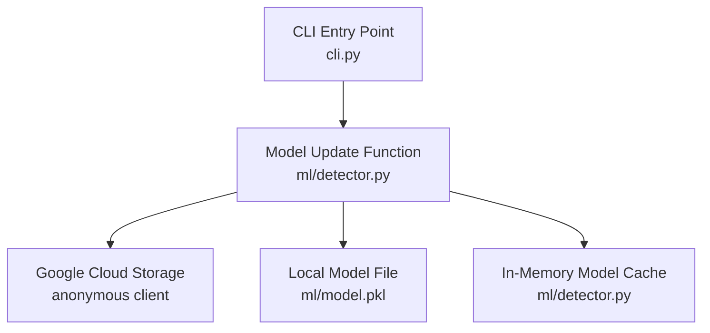
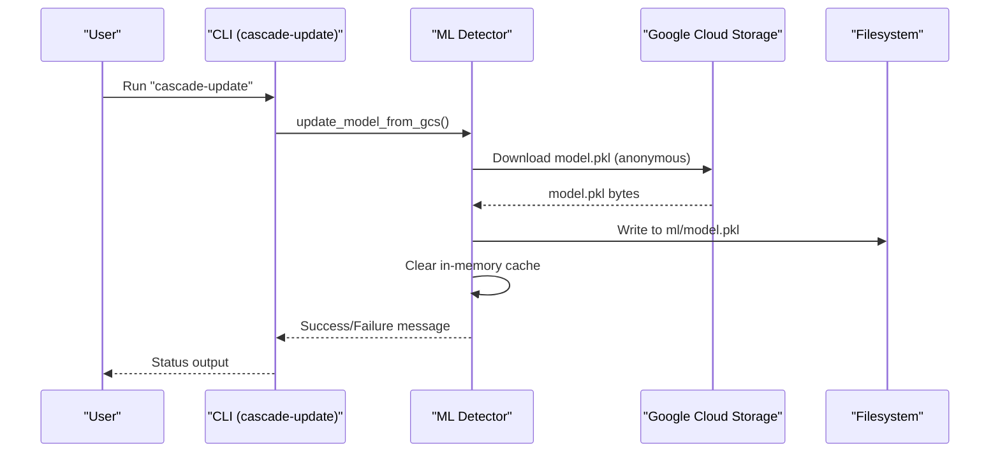
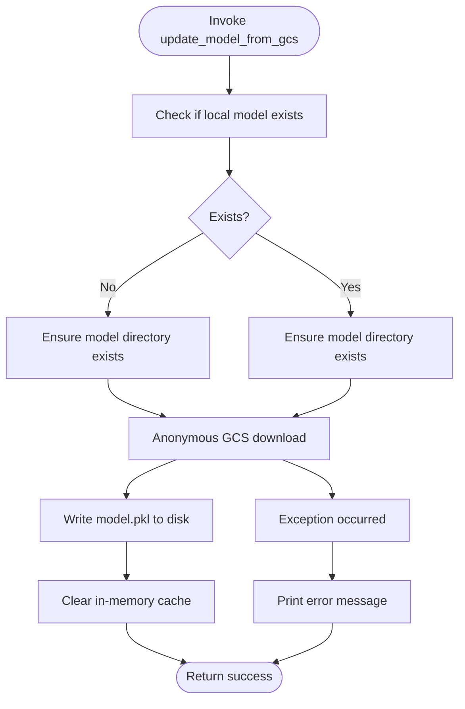
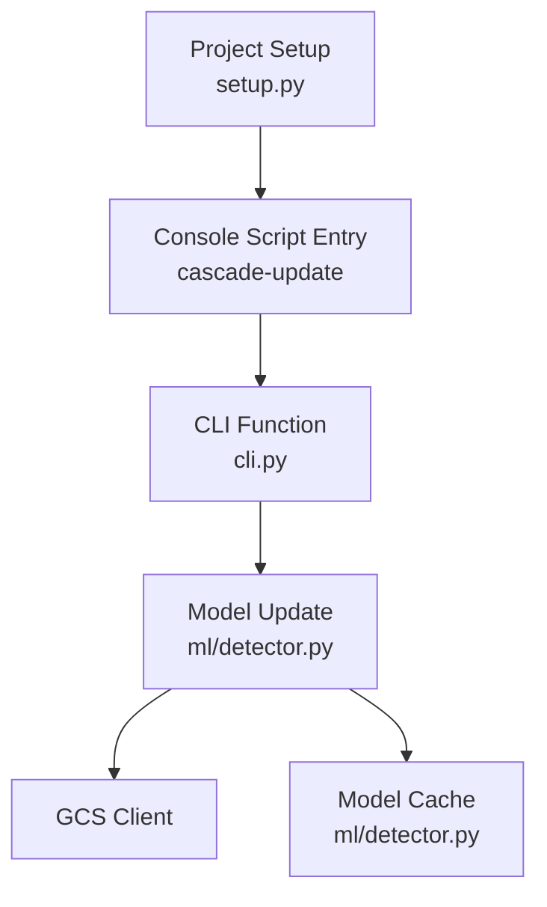

# cascade-update Command

<cite>
**Referenced Files in This Document**
- [cli.py](file://cli.py)
- [detector.py](file://ml/detector.py)
- [trainer.py](file://ml/trainer.py)
- [setup.py](file://setup.py)
- [README.md](file://README.md)
- [clean_packages.txt](file://data/clean_packages.txt)
- [malicious_packages.txt](file://data/malicious_packages.txt)
</cite>

## Table of Contents
1. [Introduction](#introduction)
2. [Project Structure](#project-structure)
3. [Core Components](#core-components)
4. [Architecture Overview](#architecture-overview)
5. [Detailed Component Analysis](#detailed-component-analysis)
6. [Dependency Analysis](#dependency-analysis)
7. [Performance Considerations](#performance-considerations)
8. [Troubleshooting Guide](#troubleshooting-guide)
9. [Conclusion](#conclusion)
10. [Appendices](#appendices)

## Introduction
The cascade-update command enables automatic retrieval and replacement of the local machine learning model from a public Google Cloud Storage location. This ensures that analyses performed by the ML detection pipeline remain current with the latest trained model, improving accuracy and reducing false positives/negatives over time. The command performs an anonymous fetch from a predefined bucket, replaces the local model file, and invalidates the in-memory model cache so subsequent analyses use the updated model immediately.

## Project Structure
The cascade-update command is exposed via the CLI entry point and delegates to the ML detector module for the actual update operation. The model itself is a pickled scikit-learn estimator stored alongside the ML module.

**Diagram sources**
- [cli.py](file://cli.py)
- [detector.py](file://ml/detector.py)

**Section sources**
- [cli.py](file://cli.py)
- [detector.py](file://ml/detector.py)

## Core Components
- CLI command registration: The cascade-update console script is registered in the project setup and routes to a dedicated CLI function that calls the model update routine.
- Model update routine: Fetches the latest model from a public GCS bucket using an anonymous client, writes it to the local model path, and clears the in-memory cache.
- ML detector integration: The ML detector lazily loads the model from disk or GCS and caches it in memory; the update routine invalidates this cache to ensure immediate use of the new model.

Key behaviors:
- Anonymous GCS access: Uses an anonymous client to download the model from a public bucket.
- Local replacement: Overwrites the existing model file on disk.
- Cache invalidation: Clears the in-memory cache so future detections use the updated model.

**Section sources**
- [setup.py](file://setup.py)
- [cli.py](file://cli.py)
- [detector.py](file://ml/detector.py)

## Architecture Overview
The cascade-update command participates in a broader ML-driven analysis pipeline. The update operation occurs outside the runtime analysis path but affects all subsequent detections by ensuring the latest model is used.

**Diagram sources**
- [cli.py](file://cli.py)
- [detector.py](file://ml/detector.py)

## Detailed Component Analysis

### CLI Integration and Command Registration
- The cascade-update console script is registered in the project’s setup metadata and maps to a CLI function that invokes the model update routine.
- The CLI function imports the update function from the ML detector module and executes it.

Practical usage:
- Run the command to refresh the model: cascade-update

Operational notes:
- The command does not require credentials because it uses anonymous access to GCS.
- On failure, the command prints a diagnostic message and does not alter the existing model.

**Section sources**
- [setup.py](file://setup.py)
- [cli.py](file://cli.py)

### Model Update Mechanism
- Anonymous GCS fetch: The update routine creates an anonymous client and downloads the model from a predefined bucket.
- Local replacement: Writes the downloaded model to the local model path, ensuring the parent directory exists.
- Cache invalidation: Clears the in-memory model cache to force subsequent detections to reload the updated model.

**Diagram sources**
- [detector.py](file://ml/detector.py)

**Section sources**
- [detector.py](file://ml/detector.py)

### Integration with the ML Detection Pipeline
- Lazy loading: The ML detector lazily loads the model from disk or GCS and caches it in memory.
- Subsequent detections: After an update, the next detection triggers a fresh load of the updated model from disk, bypassing the previous cache.
- Backward compatibility: The detector supports models trained on differing numbers of features; the update routine does not change this behavior.

Impact on analysis:
- Updated models improve detection accuracy by incorporating newly learned patterns.
- The severity-boost system and temporal pattern detection remain unaffected by the update; they operate on the same feature vectors derived from the analysis pipeline.

**Section sources**
- [detector.py](file://ml/detector.py)

### Model Versioning and Rollback
- Versioning: The model is a single file stored at a fixed path and named consistently. There is no explicit version metadata embedded in the file itself.
- Rollback capability: The update routine replaces the local model file. To roll back, users can restore a previously saved copy of the model file from backup. Alternatively, rerunning the update will replace it again with the latest version.

Note: The project does not implement an automated rollback mechanism; manual intervention is required.

**Section sources**
- [detector.py](file://ml/detector.py)

### Practical Examples

- Development environment:
  - Refresh the model after pulling updates: cascade-update
  - Verify the model was updated by running a subsequent analysis; the detector will load the new model automatically.

- Production environment:
  - Pre-deployment: Run cascade-update to ensure the latest model is present before performing scans.
  - Scheduled maintenance: Integrate cascade-update into deployment scripts or cron jobs to keep models current.
  - Disaster recovery: Maintain backups of the model file so rollback is possible if needed.

- Integration with training pipeline:
  - The training pipeline saves the model locally and uploads it to the same GCS location used by cascade-update, ensuring consistency between training and inference.

**Section sources**
- [README.md](file://README.md)
- [trainer.py](file://ml/trainer.py)

### Update Frequency Recommendations
- Development: Update the model before each major analysis session to incorporate the latest training.
- CI/CD: Schedule periodic updates (e.g., nightly) to maintain currency with evolving threat patterns.
- Production: Align update cadence with model retraining cycles; ensure updates occur during low-traffic windows.

[No sources needed since this section provides general guidance]

### Network Connectivity Requirements
- Internet access: Required to reach the public GCS endpoint.
- Firewall: Must allow outbound HTTPS to the GCS domain.
- Proxy: If behind a corporate proxy, configure the environment accordingly for the GCS client.

[No sources needed since this section provides general guidance]

### Troubleshooting Update Failures
Common issues and resolutions:
- Network connectivity errors: Verify outbound access to GCS and retry the command.
- GCS client exceptions: The command logs the error and continues without modifying the model.
- Model load failures: If the downloaded model is corrupted, the detector falls back to a baseline model; re-run the update to replace it.

Operational tips:
- Re-run cascade-update to retry the download.
- Confirm the model file exists and is readable after a successful update.
- If using a proxy, ensure the environment is configured for the GCS client.

**Section sources**
- [detector.py](file://ml/detector.py)

## Dependency Analysis
The cascade-update command depends on:
- CLI entry point registration for the cascade-update script.
- The ML detector module for the update routine and model caching.
- Google Cloud Storage client for anonymous downloads.

**Diagram sources**
- [setup.py](file://setup.py)
- [cli.py](file://cli.py)
- [detector.py](file://ml/detector.py)

**Section sources**
- [setup.py](file://setup.py)
- [cli.py](file://cli.py)
- [detector.py](file://ml/detector.py)

## Performance Considerations
- Network latency: The update operation involves a single file download; performance is primarily bound by network speed.
- Disk I/O: Writing the model file is fast; ensure sufficient disk space and permissions.
- Memory footprint: Clearing the cache avoids stale model data in memory; subsequent detections trigger a fresh load.

[No sources needed since this section provides general guidance]

## Troubleshooting Guide
- Command fails with network errors:
  - Check outbound connectivity to GCS.
  - Retry after resolving network issues.

- Model not updated:
  - Verify the model file path exists and is writable.
  - Re-run the command and review the printed messages.

- Unexpected behavior after update:
  - Confirm the detector is loading the updated model by triggering a new analysis.
  - Check for any custom model paths or environment overrides.

**Section sources**
- [detector.py](file://ml/detector.py)

## Conclusion
The cascade-update command provides a straightforward mechanism to keep the ML model current by fetching the latest version from a public GCS bucket and replacing the local model file. Combined with cache invalidation, it ensures that subsequent analyses benefit from improved detection accuracy. While the project does not implement automated rollback, manual backups enable controlled rollbacks when necessary. Integrating cascade-update into development and production workflows helps maintain model freshness and enhances overall analysis reliability.

[No sources needed since this section summarizes without analyzing specific files]

## Appendices

### Appendix A: Training Pipeline Relationship
- The training pipeline generates and uploads the model to the same GCS location used by cascade-update, ensuring that updates align with the latest training results.

**Section sources**
- [trainer.py](file://ml/trainer.py)

### Appendix B: Datasets Used for Training
- Clean and malicious package lists are used to construct supervised training data for the model.

**Section sources**
- [clean_packages.txt](file://data/clean_packages.txt)
- [malicious_packages.txt](file://data/malicious_packages.txt)