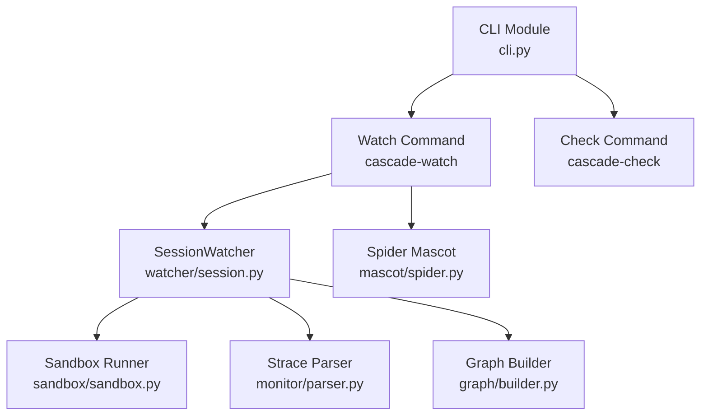
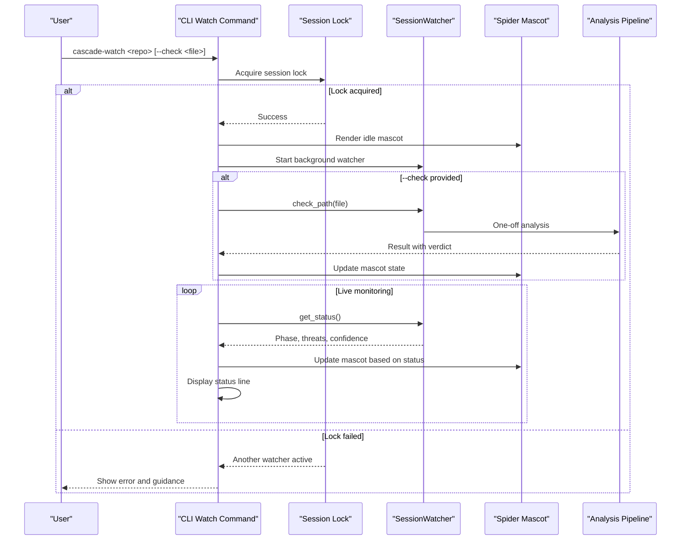
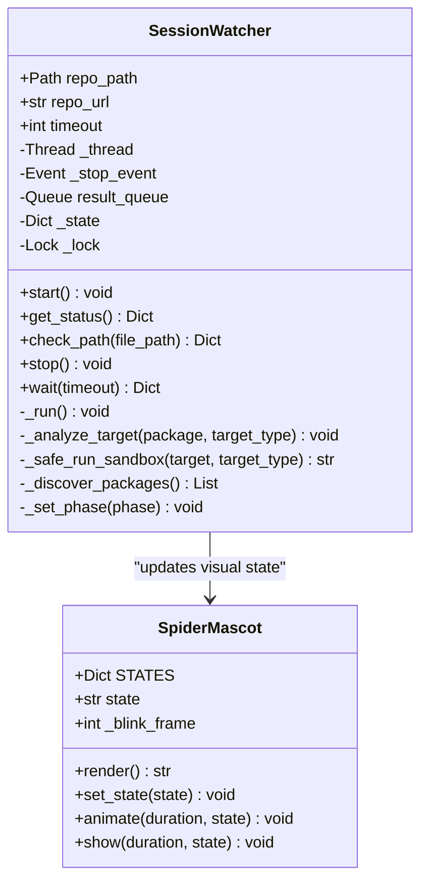
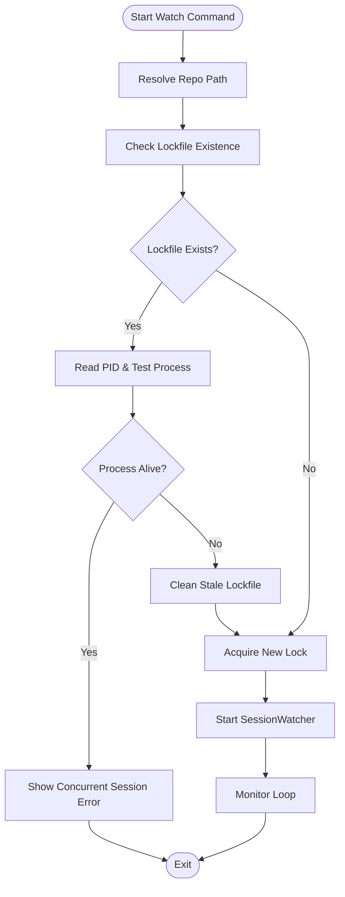
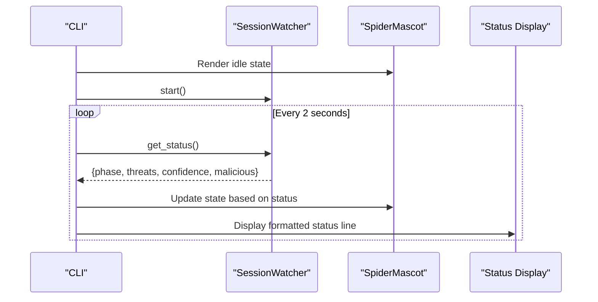
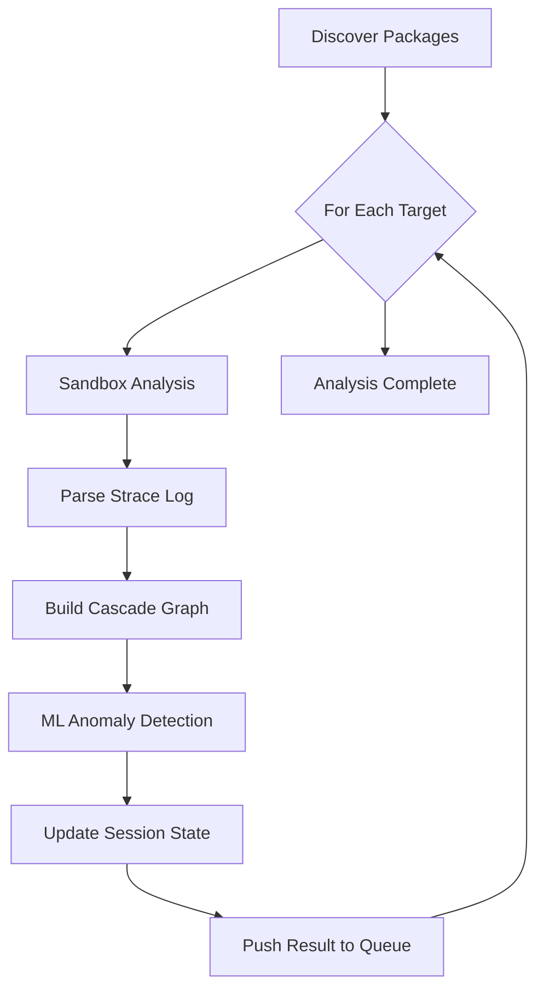
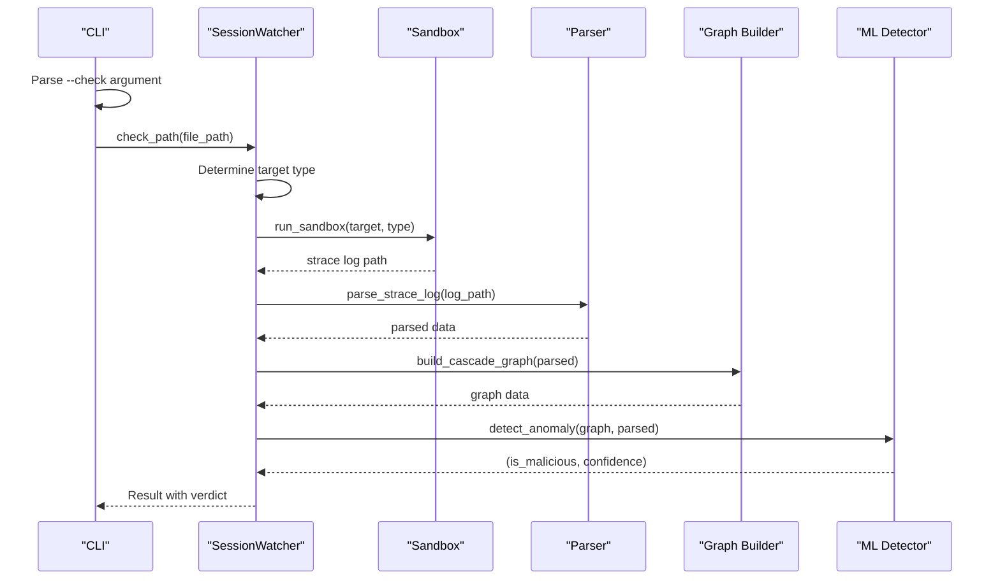
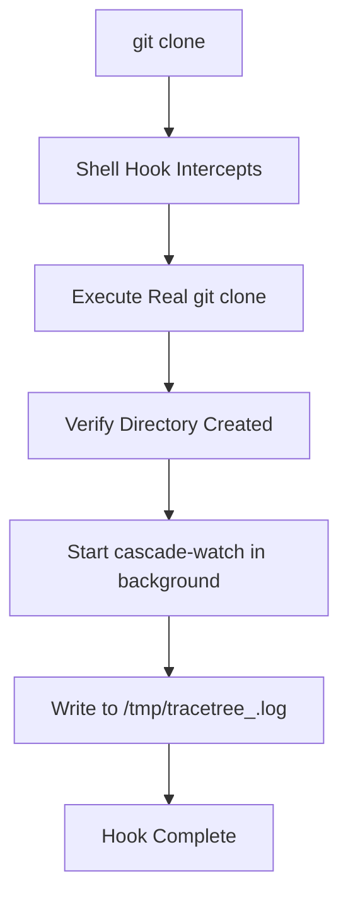
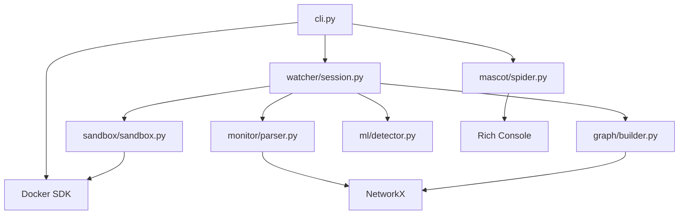

# cascade-watch Command

<cite>
**Referenced Files in This Document**
- [cli.py](file://cli.py)
- [watcher/session.py](file://watcher/session.py)
- [mascot/spider.py](file://mascot/spider.py)
- [hooks/shell_hook.sh](file://hooks/shell_hook.sh)
- [README.md](file://README.md)
- [sandbox/sandbox.py](file://sandbox/sandbox.py)
- [monitor/parser.py](file://monitor/parser.py)
- [graph/builder.py](file://graph/builder.py)
</cite>

## Table of Contents
1. [Introduction](#introduction)
2. [Project Structure](#project-structure)
3. [Core Components](#core-components)
4. [Architecture Overview](#architecture-overview)
5. [Detailed Component Analysis](#detailed-component-analysis)
6. [Dependency Analysis](#dependency-analysis)
7. [Performance Considerations](#performance-considerations)
8. [Troubleshooting Guide](#troubleshooting-guide)
9. [Conclusion](#conclusion)

## Introduction
The cascade-watch command provides continuous repository monitoring by running a session guardian that watches a local repository directory or Git URL and performs background sandbox analysis on discovered package manifests. It integrates with SessionWatcher for background analysis, threat detection, and confidence scoring, and presents a live status interface with a spider mascot visualization.

## Project Structure
The cascade-watch command is implemented as a standalone Typer app with a primary entry point in the CLI module. It coordinates with the SessionWatcher class for background analysis and the Spider mascot for live status visualization.

**Diagram sources**
- [cli.py:974-986](file://cli.py#L974-L986)
- [watcher/session.py:29-53](file://watcher/session.py#L29-L53)
- [mascot/spider.py:4-40](file://mascot/spider.py#L4-L40)

**Section sources**
- [cli.py:974-1012](file://cli.py#L974-L1012)
- [README.md:211-222](file://README.md#L211-L222)

## Core Components
The cascade-watch command consists of several key components:

- **Session Guardian**: A background watcher that monitors repository directories and runs sandbox analysis on discovered packages
- **Session Locking**: Process-level locking to prevent concurrent watchers for the same directory
- **Live Status Interface**: Real-time status updates with spider mascot visualization
- **On-Demand Scanning**: Optional immediate analysis of specific files or commands
- **Shell Hook Integration**: Automatic watcher startup after git clone operations

**Section sources**
- [cli.py:670-835](file://cli.py#L670-L835)
- [watcher/session.py:29-53](file://watcher/session.py#L29-L53)
- [hooks/shell_hook.sh:26-89](file://hooks/shell_hook.sh#L26-L89)

## Architecture Overview
The cascade-watch command implements a layered architecture with clear separation of concerns:

**Diagram sources**
- [cli.py:670-835](file://cli.py#L670-L835)
- [watcher/session.py:96-127](file://watcher/session.py#L96-L127)
- [mascot/spider.py:25-40](file://mascot/spider.py#L25-L40)

## Detailed Component Analysis

### Session Guardian Implementation
The SessionWatcher class provides the core background monitoring functionality:

**Diagram sources**
- [watcher/session.py:29-53](file://watcher/session.py#L29-L53)
- [mascot/spider.py:4-40](file://mascot/spider.py#L4-L40)

#### Session Locking Mechanism
The session guardian implements process-level locking to prevent concurrent watchers:

**Diagram sources**
- [cli.py:625-656](file://cli.py#L625-L656)

**Section sources**
- [cli.py:625-656](file://cli.py#L625-L656)
- [watcher/session.py:29-53](file://watcher/session.py#L29-L53)

### Live Monitoring Interface
The live monitoring interface provides real-time status updates with visual feedback:

**Diagram sources**
- [cli.py:770-800](file://cli.py#L770-L800)
- [mascot/spider.py:25-40](file://mascot/spider.py#L25-L40)

#### Status Reporting and Visual States
The spider mascot provides visual feedback for different analysis states:
- **Idle**: Blinking animation indicating readiness
- **Scanning**: Alert state during on-demand checks
- **Success**: Positive state when no threats detected
- **Warning**: Alert state when malicious activity detected

**Section sources**
- [cli.py:770-835](file://cli.py#L770-L835)
- [mascot/spider.py:4-40](file://mascot/spider.py#L4-L40)

### Analysis Pipeline Integration
The SessionWatcher integrates with the complete analysis pipeline:

**Diagram sources**
- [watcher/session.py:277-327](file://watcher/session.py#L277-L327)
- [sandbox/sandbox.py:177-200](file://sandbox/sandbox.py#L177-L200)
- [monitor/parser.py:182-200](file://monitor/parser.py#L182-L200)
- [graph/builder.py:8-31](file://graph/builder.py#L8-L31)

**Section sources**
- [watcher/session.py:277-327](file://watcher/session.py#L277-L327)
- [sandbox/sandbox.py:177-200](file://sandbox/sandbox.py#L177-L200)
- [monitor/parser.py:182-200](file://monitor/parser.py#L182-L200)
- [graph/builder.py:8-31](file://graph/builder.py#L8-L31)

### On-Demand Check Functionality
The --check option enables immediate analysis of specific files or commands:

**Diagram sources**
- [cli.py:738-770](file://cli.py#L738-L770)
- [watcher/session.py:128-196](file://watcher/session.py#L128-L196)

**Section sources**
- [cli.py:738-770](file://cli.py#L738-L770)
- [watcher/session.py:128-196](file://watcher/session.py#L128-L196)

### Shell Hook Integration
The shell hook system provides automatic watcher startup after git clone operations:

**Diagram sources**
- [hooks/shell_hook.sh:26-89](file://hooks/shell_hook.sh#L26-L89)

**Section sources**
- [hooks/shell_hook.sh:26-89](file://hooks/shell_hook.sh#L26-L89)
- [README.md:232-241](file://README.md#L232-L241)

## Dependency Analysis
The cascade-watch command has the following key dependencies:

**Diagram sources**
- [cli.py:15-26](file://cli.py#L15-L26)
- [watcher/session.py:15-18](file://watcher/session.py#L15-L18)
- [graph/builder.py:1](file://graph/builder.py#L1)

**Section sources**
- [cli.py:15-26](file://cli.py#L15-L26)
- [watcher/session.py:15-18](file://watcher/session.py#L15-L18)
- [graph/builder.py:1](file://graph/builder.py#L1)

## Performance Considerations
The cascade-watch command implements several performance optimizations:

- **Background Thread Execution**: All analysis runs in a daemon thread to keep the CLI responsive
- **Efficient Status Polling**: Status updates occur every 2 seconds to balance responsiveness with resource usage
- **Session Locking**: Prevents redundant analysis by ensuring only one watcher per directory
- **Timeout Management**: Individual sandbox runs have configurable timeouts to prevent hangs
- **Queue-Based Results**: Asynchronous result delivery prevents blocking operations

## Troubleshooting Guide

### Common Issues and Solutions

**Docker Not Available**
- **Symptom**: Error about Docker SDK not being installed
- **Solution**: Install Docker Python SDK or start Docker daemon

**Concurrent Session Error**
- **Symptom**: "A watcher is already active for this directory"
- **Solution**: Stop the existing watcher or use cascade-check for on-demand analysis

**Sandbox Analysis Failures**
- **Symptom**: Sandbox failed messages
- **Solution**: Verify Docker is running and has sufficient resources allocated

**Permission Denied Errors**
- **Symptom**: Permission errors when accessing repository files
- **Solution**: Ensure proper file permissions and directory access rights

**Session Lock Cleanup**
- **Symptom**: Stale lockfile preventing new watchers
- **Solution**: Manually remove lockfiles from `/tmp/tracetree_sessions/`

**Section sources**
- [cli.py:706-716](file://cli.py#L706-L716)
- [cli.py:802-808](file://cli.py#L802-L808)
- [watcher/session.py:208-217](file://watcher/session.py#L208-L217)

## Conclusion
The cascade-watch command provides a comprehensive solution for continuous repository monitoring with robust session management, live status visualization, and integrated threat detection. Its modular architecture ensures scalability and maintainability while providing immediate value through on-demand scanning capabilities and shell hook integration for seamless workflow enhancement.