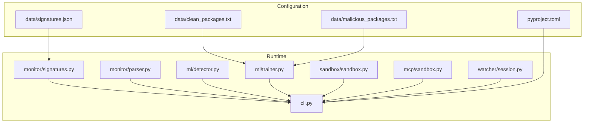
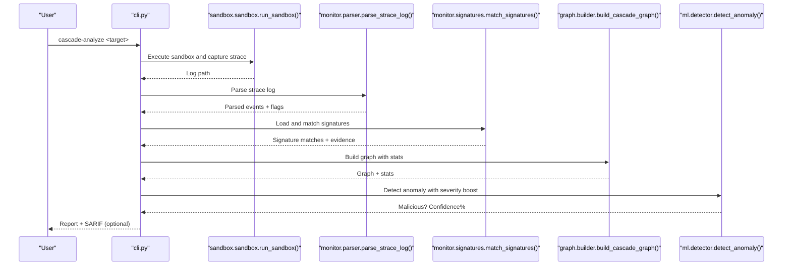
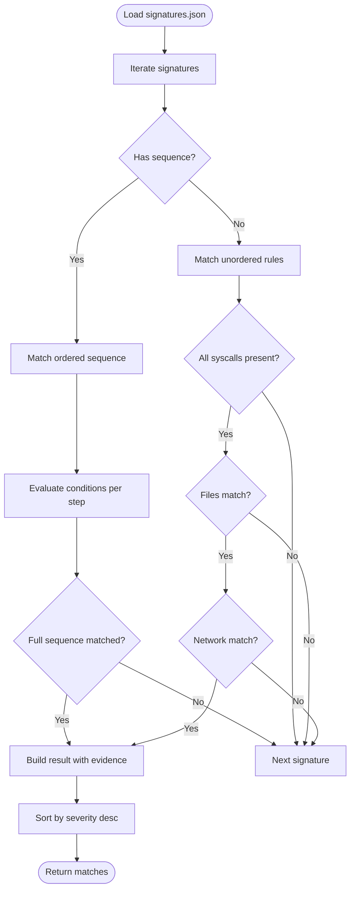
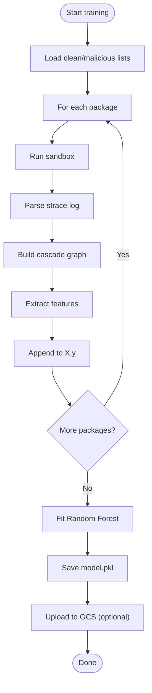
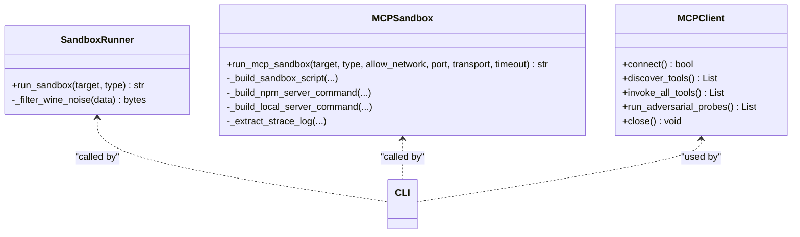
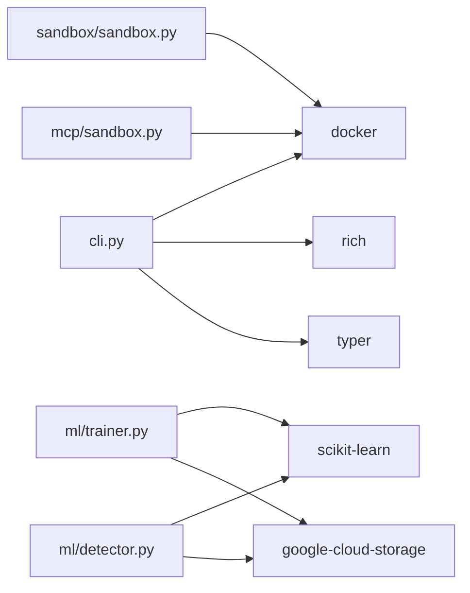

# Configuration and Customization

<cite>
**Referenced Files in This Document**
- [signatures.json](file://data/signatures.json)
- [signatures.py](file://monitor/signatures.py)
- [parser.py](file://monitor/parser.py)
- [detector.py](file://ml/detector.py)
- [trainer.py](file://ml/trainer.py)
- [sandbox.py](file://sandbox/sandbox.py)
- [mcp/sandbox.py](file://mcp/sandbox.py)
- [client.py](file://mcp/client.py)
- [cli.py](file://cli.py)
- [session.py](file://watcher/session.py)
- [pyproject.toml](file://pyproject.toml)
- [clean_packages.txt](file://data/clean_packages.txt)
- [malicious_packages.txt](file://data/malicious_packages.txt)
</cite>

## Table of Contents
1. [Introduction](#introduction)
2. [Project Structure](#project-structure)
3. [Core Components](#core-components)
4. [Architecture Overview](#architecture-overview)
5. [Detailed Component Analysis](#detailed-component-analysis)
6. [Dependency Analysis](#dependency-analysis)
7. [Performance Considerations](#performance-considerations)
8. [Troubleshooting Guide](#troubleshooting-guide)
9. [Conclusion](#conclusion)
10. [Appendices](#appendices)

## Introduction
This document explains how to configure and customize TraceTree’s behavioral signature definitions, machine learning model configuration, and environment settings. It covers:
- The eight behavioral patterns defined in data/signatures.json, including severity levels, required syscalls, file patterns, and network conditions
- Model configuration options for training data management, hyperparameters, and performance optimization
- Environment configuration for Docker, resource allocation, logging, and sandbox customization
- Guidance for creating custom signatures, adjusting severity thresholds, and extending detection capabilities
- Configuration file formats, validation rules, and troubleshooting common configuration issues

## Project Structure
TraceTree organizes configuration and customization across several modules:
- Behavioral signatures: data/signatures.json and monitor/signatures.py
- Parser and severity scoring: monitor/parser.py
- ML model and thresholds: ml/detector.py and ml/trainer.py
- Sandboxing environments: sandbox/sandbox.py and mcp/sandbox.py
- CLI orchestration and environment: cli.py and pyproject.toml
- Watcher and session management: watcher/session.py
- Training datasets: data/clean_packages.txt and data/malicious_packages.txt

**Diagram sources**
- [cli.py](file://cli.py)
- [signatures.json](file://data/signatures.json)
- [signatures.py](file://monitor/signatures.py)
- [parser.py](file://monitor/parser.py)
- [detector.py](file://ml/detector.py)
- [trainer.py](file://ml/trainer.py)
- [sandbox.py](file://sandbox/sandbox.py)
- [mcp/sandbox.py](file://mcp/sandbox.py)
- [session.py](file://watcher/session.py)
- [pyproject.toml](file://pyproject.toml)
- [clean_packages.txt](file://data/clean_packages.txt)
- [malicious_packages.txt](file://data/malicious_packages.txt)

**Section sources**
- [cli.py](file://cli.py)
- [pyproject.toml](file://pyproject.toml)

## Core Components
This section focuses on configuration surfaces and customization points.

- Behavioral signatures
  - Located in data/signatures.json
  - Loaded and matched in monitor/signatures.py
  - Supports ordered sequences, unordered sets, file patterns, and network rules
  - Severity levels and confidence boosts influence detection outcomes

- Parser and severity scoring
  - Parses strace logs in monitor/parser.py
  - Assigns severity weights to syscalls and flags suspicious behavior
  - Provides network destination classification and sensitive file detection

- Machine learning model
  - Features extracted in ml/detector.py
  - Threshold-based severity boosting and anomaly detection
  - Training pipeline in ml/trainer.py using supervised datasets

- Sandboxes
  - General-purpose sandbox in sandbox/sandbox.py
  - MCP-specific sandbox in mcp/sandbox.py with configurable transport and network policies
  - CLI exposes options for timeouts, network allowances, and transport modes

- Datasets
  - Training data managed via data/clean_packages.txt and data/malicious_packages.txt
  - Trainer consumes these lists to build supervised datasets

**Section sources**
- [signatures.json](file://data/signatures.json)
- [signatures.py](file://monitor/signatures.py)
- [parser.py](file://monitor/parser.py)
- [detector.py](file://ml/detector.py)
- [trainer.py](file://ml/trainer.py)
- [sandbox.py](file://sandbox/sandbox.py)
- [mcp/sandbox.py](file://mcp/sandbox.py)
- [clean_packages.txt](file://data/clean_packages.txt)
- [malicious_packages.txt](file://data/malicious_packages.txt)

## Architecture Overview
The configuration-driven detection pipeline integrates signature matching, severity scoring, temporal analysis, and ML classification.

**Diagram sources**
- [cli.py](file://cli.py)
- [sandbox.py](file://sandbox/sandbox.py)
- [parser.py](file://monitor/parser.py)
- [signatures.py](file://monitor/signatures.py)
- [builder.py](file://graph/builder.py)
- [detector.py](file://ml/detector.py)

## Detailed Component Analysis

### Behavioral Signature Definitions
TraceTree defines eight behavioral patterns in data/signatures.json. Each signature includes:
- name: Unique identifier
- description: Human-readable explanation
- severity: Integer scale indicating threat severity
- syscalls: Required syscall types
- files: File path patterns to match
- network: Ports and known hosts to flag
- sequence: Optional ordered (syscall, condition) steps
- confidence_boost: Additional confidence multiplier applied during scoring

Signature matching logic:
- Unordered signatures require presence of all syscalls and at least one file/network rule match
- Ordered signatures enforce a sequence of steps with optional conditions (e.g., external connections, shell binaries, sensitive files)
- Evidence collection includes human-readable descriptions and matched events

**Diagram sources**
- [signatures.py](file://monitor/signatures.py)
- [signatures.json](file://data/signatures.json)

**Section sources**
- [signatures.json](file://data/signatures.json)
- [signatures.py](file://monitor/signatures.py)

### Model Configuration and Training
Training data management:
- Supervised dataset construction uses data/clean_packages.txt and data/malicious_packages.txt
- Trainer iterates packages, executes sandbox, parses logs, builds graphs, and trains a Random Forest model
- Model caching and GCS synchronization enable distributed model updates

Hyperparameters and optimization:
- Random Forest configured with fixed parameters in trainer.py
- Feature vector includes graph statistics and parsed event counts
- Zero-shot fallback uses Isolation Forest trained on hardcoded baselines

Thresholds and severity boosting:
- Severity thresholds adjust confidence scores and can override ML predictions
- Temporal patterns and sensitive/suspicious indicators add confidence increments

**Diagram sources**
- [trainer.py](file://ml/trainer.py)
- [detector.py](file://ml/detector.py)
- [clean_packages.txt](file://data/clean_packages.txt)
- [malicious_packages.txt](file://data/malicious_packages.txt)

**Section sources**
- [trainer.py](file://ml/trainer.py)
- [detector.py](file://ml/detector.py)
- [clean_packages.txt](file://data/clean_packages.txt)
- [malicious_packages.txt](file://data/malicious_packages.txt)

### Environment Configuration
Docker and sandbox customization:
- General sandbox (sandbox/sandbox.py) supports pip, npm, dmg, exe, and shell targets
- MCP sandbox (mcp/sandbox.py) supports stdio and HTTP transports, network blocking, and configurable timeouts
- Both sandboxes rely on Docker SDK and build images on demand

Resource allocation and logging:
- Resource usage (memory, disk, file count) is captured and appended to logs as comments
- Logging leverages rich console and standard logging facilities
- CLI orchestrates Docker preflight checks and displays warnings/errors

**Diagram sources**
- [sandbox.py](file://sandbox/sandbox.py)
- [mcp/sandbox.py](file://mcp/sandbox.py)
- [client.py](file://mcp/client.py)
- [cli.py](file://cli.py)

**Section sources**
- [sandbox.py](file://sandbox/sandbox.py)
- [mcp/sandbox.py](file://mcp/sandbox.py)
- [client.py](file://mcp/client.py)
- [cli.py](file://cli.py)

### Creating Custom Signatures
Steps to define a new signature:
1. Extend data/signatures.json with a new signature object containing:
   - name, description, severity
   - syscalls array
   - files array (optional)
   - network object with ports and/or known_hosts (optional)
   - sequence array of (syscall, condition) tuples (optional)
   - confidence_boost (optional)
2. Validate JSON structure and ensure:
   - severity is an integer within expected bounds
   - syscalls are supported syscall names
   - sequence steps reference valid syscall names and conditions
   - network ports are integers; known_hosts are domain strings
3. Test signature by running analysis; review evidence and matched_events in results

Conditions supported in sequence steps:
- external: non-loopback, non-registry network destinations
- shell: execve of common shell binaries
- non_standard: execve of non-benign binaries
- sensitive: access to sensitive file patterns
- secret: access to secret file patterns
- cron_path: writes to crontab-related paths
- pool_port: connect to known mining pool ports
- exfil_host: connect to known paste/file-share hosts
- PROT_EXEC: mprotect with executable flag
- null/None: always matches

**Section sources**
- [signatures.json](file://data/signatures.json)
- [signatures.py](file://monitor/signatures.py)

### Adjusting Severity Thresholds and Confidence Boost
Severity thresholds and confidence adjustments:
- Thresholds in ml/detector.py influence confidence boosting and potential verdict overrides
- Total severity, sensitive file counts, suspicious network counts, and temporal pattern counts contribute to adjusted confidence
- Critical threshold forces malicious classification; high/medium thresholds increase confidence

Recommendations:
- Increase critical threshold to reduce false positives
- Decrease thresholds to improve sensitivity
- Combine with temporal pattern detection for stronger signals

**Section sources**
- [detector.py](file://ml/detector.py)

### Extending Detection Capabilities
Extend detection by:
- Adding new syscall categories to monitor/parser.py severity weights and classification logic
- Introducing new signature conditions in monitor/signatures.py
- Incorporating additional features in ml/detector.py feature mapping
- Expanding training datasets in data/clean_packages.txt and data/malicious_packages.txt

**Section sources**
- [parser.py](file://monitor/parser.py)
- [signatures.py](file://monitor/signatures.py)
- [detector.py](file://ml/detector.py)
- [clean_packages.txt](file://data/clean_packages.txt)
- [malicious_packages.txt](file://data/malicious_packages.txt)

## Dependency Analysis
External dependencies and runtime requirements:
- Docker SDK for Python is required for sandboxing
- Google Cloud Storage client for model synchronization
- Rich and Typer for CLI UX and progress reporting
- Scikit-learn for Random Forest and Isolation Forest
- NetworkX for graph construction

**Diagram sources**
- [cli.py](file://cli.py)
- [trainer.py](file://ml/trainer.py)
- [detector.py](file://ml/detector.py)
- [sandbox.py](file://sandbox/sandbox.py)
- [mcp/sandbox.py](file://mcp/sandbox.py)
- [pyproject.toml](file://pyproject.toml)

**Section sources**
- [pyproject.toml](file://pyproject.toml)

## Performance Considerations
- Model training: Use balanced datasets and consider feature selection to reduce training time
- Sandbox timeouts: Tune timeouts per target type (EXE/DMG longer than pip/npm)
- Resource monitoring: Enable resource data capture to identify heavy packages and optimize container limits
- Severity boosting: Apply thresholds judiciously to balance precision and recall

## Troubleshooting Guide
Common configuration issues and resolutions:
- Docker not installed or unreachable
  - Ensure Docker SDK is installed and daemon is running
  - CLI performs preflight checks and provides OS-specific installation guidance

- Sandbox image build failures
  - Verify Docker is running and has sufficient resources
  - Re-run with elevated privileges if required

- Empty or invalid strace logs
  - Check for “NO EXECUTABLES FOUND”, “WINE64 NOT AVAILABLE”, or “EMPTY FILE” markers
  - Validate target type and path correctness

- Model loading errors
  - Confirm model.pkl exists or allow automatic GCS sync
  - Clear model cache if stale model is cached

- Signature parsing errors
  - Validate signatures.json syntax and required fields
  - Ensure sequence steps reference valid syscall names and conditions

**Section sources**
- [cli.py](file://cli.py)
- [sandbox.py](file://sandbox/sandbox.py)
- [detector.py](file://ml/detector.py)
- [signatures.py](file://monitor/signatures.py)

## Conclusion
TraceTree’s configuration and customization framework centers on three pillars:
- Behavioral signatures that encode known attack patterns with explicit conditions and severity
- A robust ML pipeline with tunable thresholds and performance safeguards
- Flexible sandbox environments with Docker-based isolation and resource visibility

By understanding these components and their interplay, you can tailor detection to your environment, extend coverage with custom signatures, and optimize performance through dataset and model tuning.

## Appendices

### Configuration File Formats and Validation Rules
- data/signatures.json
  - Required fields: name, description, severity, syscalls
  - Optional fields: files, network, sequence, confidence_boost
  - Validation: JSON schema compliance; sequence steps must reference valid syscall names and conditions

- data/clean_packages.txt and data/malicious_packages.txt
  - Plain text lists of package names
  - Validation: Non-empty entries; duplicates are acceptable

- pyproject.toml
  - Defines project metadata, dependencies, and CLI entry points
  - Validation: Standard setuptools configuration

**Section sources**
- [signatures.json](file://data/signatures.json)
- [clean_packages.txt](file://data/clean_packages.txt)
- [malicious_packages.txt](file://data/malicious_packages.txt)
- [pyproject.toml](file://pyproject.toml)