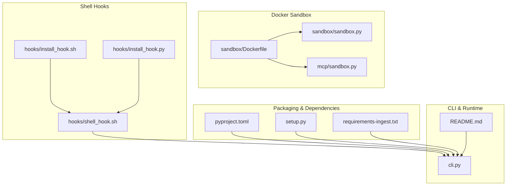
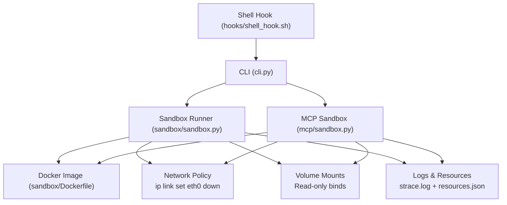
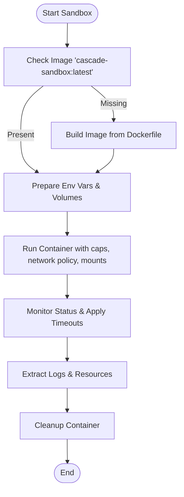
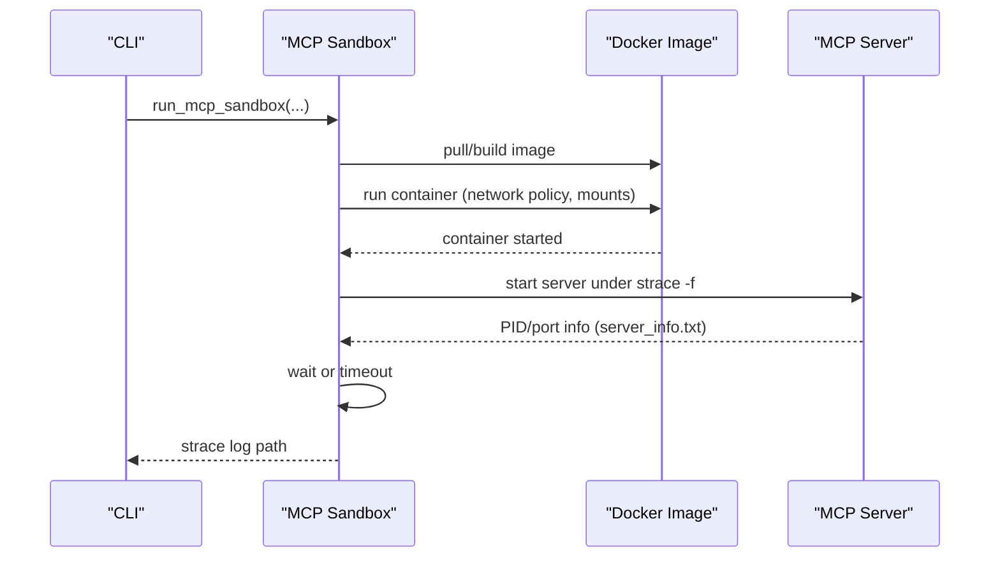
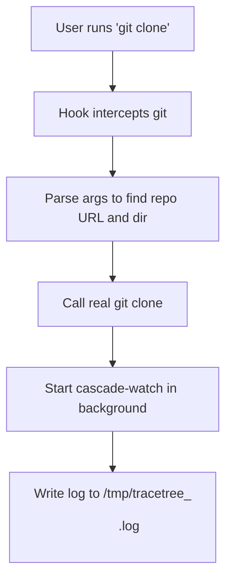
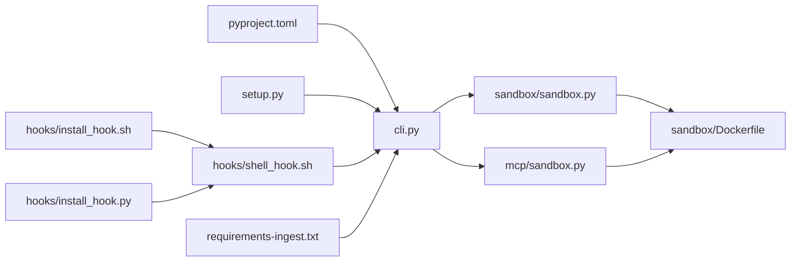

# Environment Settings

<cite>
**Referenced Files in This Document**
- [Dockerfile](file://sandbox/Dockerfile)
- [sandbox.py](file://sandbox/sandbox.py)
- [mcp/sandbox.py](file://mcp/sandbox.py)
- [shell_hook.sh](file://hooks/shell_hook.sh)
- [install_hook.sh](file://hooks/install_hook.sh)
- [install_hook.py](file://hooks/install_hook.py)
- [pyproject.toml](file://pyproject.toml)
- [setup.py](file://setup.py)
- [cli.py](file://cli.py)
- [README.md](file://README.md)
- [requirements-ingest.txt](file://requirements-ingest.txt)
</cite>

## Table of Contents
1. [Introduction](#introduction)
2. [Project Structure](#project-structure)
3. [Core Components](#core-components)
4. [Architecture Overview](#architecture-overview)
5. [Detailed Component Analysis](#detailed-component-analysis)
6. [Dependency Analysis](#dependency-analysis)
7. [Performance Considerations](#performance-considerations)
8. [Troubleshooting Guide](#troubleshooting-guide)
9. [Conclusion](#conclusion)

## Introduction
This document explains TraceTree’s environment configuration with a focus on Docker sandbox settings, resource allocation, and system integration. It covers:
- Docker image building, network isolation, volume mounting, and container runtime behavior
- Environment variable configuration, path settings, and dependency management via pyproject.toml and setup.py
- Shell hook integration for git repository monitoring and automatic analysis triggers
- Logging configuration, debug mode hints, and performance tuning parameters
- Security considerations for sandbox isolation, resource quotas, and cleanup procedures
- Troubleshooting environment-specific issues and validating system requirements

## Project Structure
TraceTree organizes environment-related configuration across several modules:
- Docker sandbox definitions and orchestration
- Shell hooks for automatic repository watching
- Dependency declarations for Python packaging and runtime
- CLI-level environment checks and timeouts

**Diagram sources**
- [Dockerfile](file://sandbox/Dockerfile)
- [sandbox.py](file://sandbox/sandbox.py)
- [mcp/sandbox.py](file://mcp/sandbox.py)
- [shell_hook.sh](file://hooks/shell_hook.sh)
- [install_hook.sh](file://hooks/install_hook.sh)
- [install_hook.py](file://hooks/install_hook.py)
- [pyproject.toml](file://pyproject.toml)
- [setup.py](file://setup.py)
- [requirements-ingest.txt](file://requirements-ingest.txt)
- [cli.py](file://cli.py)
- [README.md](file://README.md)

**Section sources**
- [Dockerfile](file://sandbox/Dockerfile)
- [sandbox.py](file://sandbox/sandbox.py)
- [mcp/sandbox.py](file://mcp/sandbox.py)
- [shell_hook.sh](file://hooks/shell_hook.sh)
- [install_hook.sh](file://hooks/install_hook.sh)
- [install_hook.py](file://hooks/install_hook.py)
- [pyproject.toml](file://pyproject.toml)
- [setup.py](file://setup.py)
- [requirements-ingest.txt](file://requirements-ingest.txt)
- [cli.py](file://cli.py)
- [README.md](file://README.md)

## Core Components
- Docker sandbox image and runtime behavior
  - Image: python:3.11-slim with strace, curl, iproute2, Node.js, npm, wine64, p7zip-full, cabextract
  - Work directory: /sandbox
  - Default command: /bin/bash
- Sandbox orchestration
  - Builds or pulls the sandbox image, runs containers with network controls, mounts volumes, and enforces timeouts
  - Supports pip, npm, DMG, EXE, and shell targets with resource monitoring and filtering of noise
- MCP sandbox
  - Runs MCP servers in a sandbox with configurable network policy, transport modes, and timeouts
- Shell hooks
  - Intercepts git clone to start a background watcher and writes logs to /tmp
- Packaging and dependencies
  - pyproject.toml and setup.py define console scripts and runtime dependencies
  - requirements-ingest.txt lists ingestion-time dependencies

**Section sources**
- [Dockerfile](file://sandbox/Dockerfile)
- [sandbox.py](file://sandbox/sandbox.py)
- [mcp/sandbox.py](file://mcp/sandbox.py)
- [shell_hook.sh](file://hooks/shell_hook.sh)
- [install_hook.sh](file://hooks/install_hook.sh)
- [install_hook.py](file://hooks/install_hook.py)
- [pyproject.toml](file://pyproject.toml)
- [setup.py](file://setup.py)
- [requirements-ingest.txt](file://requirements-ingest.txt)

## Architecture Overview
The environment configuration centers on Docker-based sandboxing, with orchestration and monitoring integrated into the CLI and shell hooks.

**Diagram sources**
- [cli.py](file://cli.py)
- [sandbox.py](file://sandbox/sandbox.py)
- [mcp/sandbox.py](file://mcp/sandbox.py)
- [Dockerfile](file://sandbox/Dockerfile)
- [shell_hook.sh](file://hooks/shell_hook.sh)

## Detailed Component Analysis

### Docker Sandbox Configuration
- Image definition and tools
  - Base image: python:3.11-slim
  - Installed tools: strace, curl, iproute2, Node.js, npm, wine64, p7zip-full, cabextract
  - Working directory: /sandbox
  - Default command: /bin/bash
- Orchestration behavior
  - Image resolution: cascade-sandbox:latest
  - Build on demand if missing
  - Network isolation: drops eth0 interface before execution
  - Volume mounts:
    - pip/npm: none (offline install paths)
    - DMG/EXE: bind target file as read-only
    - Shell: bind containing directory and pass filename via environment
  - Environment variables:
    - TARGET for pip/npm/dmg/exe
    - TARGET_FILENAME for shell
  - Capabilities:
    - NET_ADMIN for network control
  - Timeouts:
    - EXE: 180s
    - DMG: 120s
    - Others: 60s
  - Resource monitoring:
    - Memory and disk usage measured around install/execution
    - Peak memory and disk usage appended to logs as comments
  - Noise filtering:
    - Wine initialization noise removed from EXE traces

**Diagram sources**
- [sandbox.py](file://sandbox/sandbox.py)
- [Dockerfile](file://sandbox/Dockerfile)

**Section sources**
- [Dockerfile](file://sandbox/Dockerfile)
- [sandbox.py](file://sandbox/sandbox.py)

### MCP Sandbox Configuration
- Image reuse: cascade-sandbox:latest
- Network policy:
  - Default: --network none (blocks outbound)
  - Optional: allow_network enables outbound via bridge
- Transport modes:
  - HTTP: server runs and external client connects
  - STDIO: server runs with FIFO pipes for stdin/stdout
- Timeouts:
  - Default 60s; configurable via timeout option
- Volume mounts:
  - Local MCP server path mounted read-only at /mcp-server
- Syscall tracing:
  - Limited to a curated set of syscalls for MCP analysis
- Output:
  - strace log path on host
  - server_info.txt with PID, port, and transport

**Diagram sources**
- [mcp/sandbox.py](file://mcp/sandbox.py)

**Section sources**
- [mcp/sandbox.py](file://mcp/sandbox.py)

### Shell Hook Integration
- Purpose: Intercept git clone to automatically start a background watcher
- Behavior:
  - Detects real git binary and cascade-watch availability
  - Wraps git clone to clone the repo and start cascade-watch in background
  - Writes logs to /tmp/tracetree_<repo>.log
- Installation:
  - install_hook.sh detects shell (bash/zsh) and appends a source line to ~/.bashrc or ~/.zshrc
  - install_hook.py provides a cross-platform installer that copies the hook to ~/.local/share/tracetree/hooks/ and appends the source line

**Diagram sources**
- [shell_hook.sh](file://hooks/shell_hook.sh)
- [install_hook.sh](file://hooks/install_hook.sh)
- [install_hook.py](file://hooks/install_hook.py)

**Section sources**
- [shell_hook.sh](file://hooks/shell_hook.sh)
- [install_hook.sh](file://hooks/install_hook.sh)
- [install_hook.py](file://hooks/install_hook.py)

### Environment Variables and Paths
- Environment variables passed to containers:
  - TARGET: pip/npm/dmg/exe target
  - TARGET_FILENAME: shell target filename
- Paths:
  - Sandbox workdir: /sandbox
  - Log output: logs/<target>_<type>_strace.log (host)
  - MCP log: logs/mcp_<name>_strace.log (host)
  - MCP server_info.txt: logs/mcp_<name>_server_info.txt (host)
  - Shell hook installation path: ~/.local/share/tracetree/hooks/shell_hook.sh
  - Temporary logs: /tmp/tracetree_<repo>.log

**Section sources**
- [sandbox.py](file://sandbox/sandbox.py)
- [mcp/sandbox.py](file://mcp/sandbox.py)
- [shell_hook.sh](file://hooks/shell_hook.sh)

### Dependency Management (pyproject.toml and setup.py)
- Packaging backend and metadata:
  - pyproject.toml defines build system, project metadata, and console scripts
  - setup.py mirrors install_requires and console scripts
- Runtime dependencies:
  - typer, rich, networkx, scikit-learn, fastapi, uvicorn, docker, google-cloud-storage, requests
- Scripts:
  - cascade-analyze, cascade-train, cascade-update, cascade-watch, cascade-check, cascade-install-hook
- Additional ingestion dependency:
  - requirements-ingest.txt pins requests

**Section sources**
- [pyproject.toml](file://pyproject.toml)
- [setup.py](file://setup.py)
- [requirements-ingest.txt](file://requirements-ingest.txt)

### Logging, Debugging, and Performance Tuning
- Logging
  - strace logs are extracted from containers and saved under logs/ with suffixes indicating target and type
  - MCP sandbox also extracts server_info.txt with PID, port, and transport
  - Resource usage is appended to logs as comments for pip/npm targets
- Debugging
  - CLI performs a Docker preflight check and prints OS-specific guidance if Docker is unreachable
  - Sandbox prints warnings and errors for unsupported types, missing files, and timeouts
- Performance tuning parameters
  - Target-specific timeouts:
    - EXE: 180s
    - DMG: 120s
    - Others: 60s
  - MCP timeout: configurable via --timeout
  - MCP transport: stdio or http
  - Network policy: allow_network toggles outbound connectivity

**Section sources**
- [sandbox.py](file://sandbox/sandbox.py)
- [mcp/sandbox.py](file://mcp/sandbox.py)
- [cli.py](file://cli.py)

### Security Considerations
- Network isolation
  - eth0 is dropped before pip/npm/DMG/EXE execution to block outbound connections
  - MCP sandbox defaults to --network none; can be overridden with allow_network
- Process isolation
  - Containers run with NET_ADMIN capability for network control; otherwise minimal capabilities
  - Read-only mounts reduce attack surface for mounted targets
- Resource quotas and cleanup
  - Timeouts enforce upper bounds on execution duration
  - Containers are force-removed in a finally block to ensure cleanup
- Noise filtering
  - Wine initialization noise is filtered from EXE traces to avoid false positives

**Section sources**
- [sandbox.py](file://sandbox/sandbox.py)
- [mcp/sandbox.py](file://mcp/sandbox.py)

## Dependency Analysis
The environment configuration ties together Docker orchestration, CLI runtime checks, and shell hooks.

**Diagram sources**
- [pyproject.toml](file://pyproject.toml)
- [setup.py](file://setup.py)
- [cli.py](file://cli.py)
- [sandbox.py](file://sandbox/sandbox.py)
- [mcp/sandbox.py](file://mcp/sandbox.py)
- [Dockerfile](file://sandbox/Dockerfile)
- [shell_hook.sh](file://hooks/shell_hook.sh)
- [install_hook.sh](file://hooks/install_hook.sh)
- [install_hook.py](file://hooks/install_hook.py)
- [requirements-ingest.txt](file://requirements-ingest.txt)

**Section sources**
- [pyproject.toml](file://pyproject.toml)
- [setup.py](file://setup.py)
- [cli.py](file://cli.py)
- [sandbox.py](file://sandbox/sandbox.py)
- [mcp/sandbox.py](file://mcp/sandbox.py)
- [Dockerfile](file://sandbox/Dockerfile)
- [shell_hook.sh](file://hooks/shell_hook.sh)
- [install_hook.sh](file://hooks/install_hook.sh)
- [install_hook.py](file://hooks/install_hook.py)
- [requirements-ingest.txt](file://requirements-ingest.txt)

## Performance Considerations
- Container startup overhead
  - First-run image build occurs automatically; subsequent runs reuse the image
- Timeouts
  - Tune --timeout for MCP sessions and target-specific timeouts for EXE/DMG as needed
- Network policy impact
  - Blocking eth0 prevents network-dependent steps from proceeding; ensure offline install paths are used for pip/npm
- Resource monitoring
  - Pip/npm targets measure peak memory and disk usage; consider filesystem limits in CI environments

[No sources needed since this section provides general guidance]

## Troubleshooting Guide
- Docker not installed or unreachable
  - The CLI performs a preflight check and prints OS-specific installation and startup instructions
- Docker SDK not importable
  - Install the docker Python package; the CLI will guide you accordingly
- Sandbox image build failures
  - Ensure Docker daemon is running and reachable; the sandbox module attempts to build the image if missing
- Target not found or invalid type
  - Verify file paths for DMG/EXE and shell targets; ensure they are within the workspace for shell targets
- Timeouts
  - EXE/DMG targets have stricter timeouts; adjust expectations or increase timeouts where appropriate
- MCP sandbox issues
  - Confirm allow_network setting if the server needs outbound connectivity
  - Verify transport mode and port configuration
- Shell hook not activating
  - Use cascade-install-hook or run install_hook.py to copy and source the hook script

**Section sources**
- [cli.py](file://cli.py)
- [sandbox.py](file://sandbox/sandbox.py)
- [mcp/sandbox.py](file://mcp/sandbox.py)
- [shell_hook.sh](file://hooks/shell_hook.sh)
- [install_hook.py](file://hooks/install_hook.py)

## Conclusion
TraceTree’s environment configuration emphasizes robust Docker sandboxing, strict network isolation, and automated repository monitoring via shell hooks. The pyproject.toml and setup.py files define consistent dependencies and entry points, while the CLI orchestrates preflight checks, timeouts, and resource monitoring. By leveraging these configurations, users can reliably analyze Python packages, npm modules, DMG images, EXE files, and MCP servers in a secure, repeatable environment.