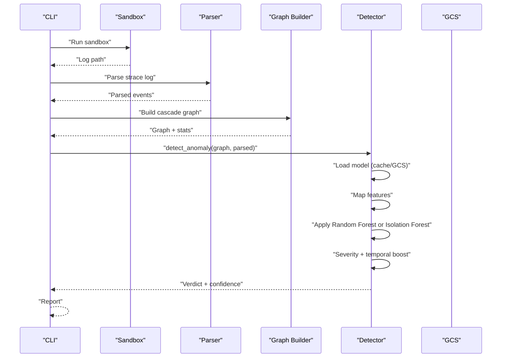
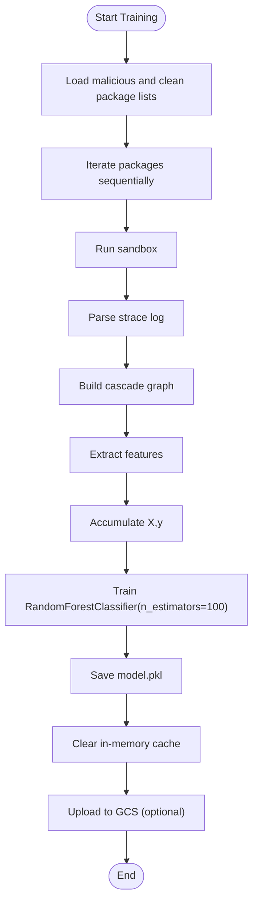
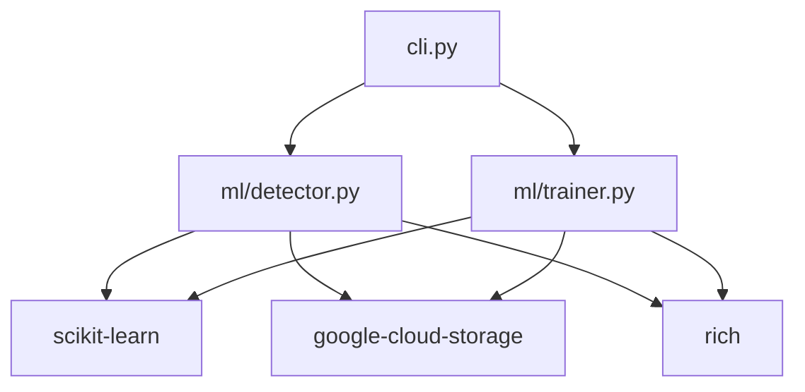

# Model Configuration

<cite>
**Referenced Files in This Document**
- [detector.py](file://TraceTree/ml/detector.py)
- [trainer.py](file://TraceTree/ml/trainer.py)
- [cli.py](file://TraceTree/cli.py)
- [README.md](file://TraceTree/README.md)
- [setup.py](file://TraceTree/setup.py)
- [malicious_packages.txt](file://TraceTree/data/malicious_packages.txt)
- [clean_packages.txt](file://TraceTree/data/clean_packages.txt)
- [ingest_malwarebazaar.py](file://TraceTree/ingest_malwarebazaar.py)
</cite>

## Table of Contents
1. [Introduction](#introduction)
2. [Project Structure](#project-structure)
3. [Core Components](#core-components)
4. [Architecture Overview](#architecture-overview)
5. [Detailed Component Analysis](#detailed-component-analysis)
6. [Dependency Analysis](#dependency-analysis)
7. [Performance Considerations](#performance-considerations)
8. [Troubleshooting Guide](#troubleshooting-guide)
9. [Conclusion](#conclusion)
10. [Appendices](#appendices)

## Introduction
This document explains the machine learning model configuration in TraceTree’s ml module, focusing on the integration of Random Forest and Isolation Forest. It covers:
- Model hyperparameters and feature engineering
- Training pipeline and dataset preparation
- Persistence/loading, versioning, and update procedures
- Detection threshold customization and sensitivity tuning
- Guidance for adding new algorithms and optimizing performance

## Project Structure
The machine learning stack resides primarily in the ml directory and integrates with the broader TraceTree pipeline:
- ml/detector.py: Feature extraction, anomaly detection, model loading, and severity boosting
- ml/trainer.py: Training pipeline, dataset ingestion, and model persistence
- data/malicious_packages.txt and data/clean_packages.txt: Labeled datasets for supervised training
- cli.py: Command-line entry points for training and updating models
- ingest_malwarebazaar.py: Optional online ingestion pipeline for additional training data
- setup.py: CLI entry points for cascade-train and cascade-update

```mermaid
graph TB
subgraph "ML Module"
D["ml/detector.py"]
T["ml/trainer.py"]
end
subgraph "Data"
MP["data/malicious_packages.txt"]
CP["data/clean_packages.txt"]
end
subgraph "CLI"
CLI["cli.py"]
end
subgraph "Ingestion"
MB["ingest_malwarebazaar.py"]
end
subgraph "External"
GCS["Google Cloud Storage"]
end
CLI --> T
CLI --> D
T --> MP
T --> CP
MB --> T
D --> GCS
```

**Diagram sources**
- [detector.py:108-163](file://TraceTree/ml/detector.py#L108-L163)
- [trainer.py:15-96](file://TraceTree/ml/trainer.py#L15-L96)
- [cli.py:373-433](file://TraceTree/cli.py#L373-L433)
- [malicious_packages.txt:1-33](file://TraceTree/data/malicious_packages.txt#L1-L33)
- [clean_packages.txt:1-33](file://TraceTree/data/clean_packages.txt#L1-L33)
- [ingest_malwarebazaar.py:460-618](file://TraceTree/ingest_malwarebazaar.py#L460-L618)

**Section sources**
- [detector.py:108-163](file://TraceTree/ml/detector.py#L108-L163)
- [trainer.py:15-96](file://TraceTree/ml/trainer.py#L15-L96)
- [cli.py:373-433](file://TraceTree/cli.py#L373-L433)
- [malicious_packages.txt:1-33](file://TraceTree/data/malicious_packages.txt#L1-L33)
- [clean_packages.txt:1-33](file://TraceTree/data/clean_packages.txt#L1-L33)
- [ingest_malwarebazaar.py:460-618](file://TraceTree/ingest_malwarebazaar.py#L460-L618)

## Core Components
- Feature extraction: Converts graph statistics and parsed syscall events into a numeric vector for the ML model.
- Random Forest classifier: Supervised model used when a trained model is available.
- Isolation Forest fallback: Zero-shot anomaly detection baseline using hardcoded clean-package profiles.
- Model persistence: Pickled model saved to ml/model.pkl and synchronized to Google Cloud Storage.
- Severity boosting: Confidence adjustment based on severity scores and temporal patterns.

Key implementation references:
- Feature extraction and mapping: [map_features:29-68](file://TraceTree/ml/detector.py#L29-L68)
- Isolation Forest baseline: [train_baseline_model:92-101](file://TraceTree/ml/detector.py#L92-L101)
- Model loading and caching: [get_ml_model:108-146](file://TraceTree/ml/detector.py#L108-L146)
- Model update from GCS: [update_model_from_gcs:149-163](file://TraceTree/ml/detector.py#L149-L163)
- Severity-boosted confidence: [_severity_adjusted_confidence:180-233](file://TraceTree/ml/detector.py#L180-L233)
- Detection pipeline: [detect_anomaly:235-299](file://TraceTree/ml/detector.py#L235-L299)

**Section sources**
- [detector.py:29-68](file://TraceTree/ml/detector.py#L29-L68)
- [detector.py:92-101](file://TraceTree/ml/detector.py#L92-L101)
- [detector.py:108-146](file://TraceTree/ml/detector.py#L108-L146)
- [detector.py:149-163](file://TraceTree/ml/detector.py#L149-L163)
- [detector.py:180-233](file://TraceTree/ml/detector.py#L180-L233)
- [detector.py:235-299](file://TraceTree/ml/detector.py#L235-L299)

## Architecture Overview
The ML pipeline integrates with the broader TraceTree analysis:
- Sandbox execution produces strace logs
- Parser extracts events and assigns severity
- Graph builder constructs a cascade graph with statistics
- Detector extracts features and applies Random Forest or Isolation Forest
- Severity and temporal signals boost final confidence



**Diagram sources**
- [cli.py:181-259](file://TraceTree/cli.py#L181-L259)
- [detector.py:108-146](file://TraceTree/ml/detector.py#L108-L146)
- [detector.py:235-299](file://TraceTree/ml/detector.py#L235-L299)

**Section sources**
- [cli.py:181-259](file://TraceTree/cli.py#L181-L259)
- [detector.py:108-146](file://TraceTree/ml/detector.py#L108-L146)
- [detector.py:235-299](file://TraceTree/ml/detector.py#L235-L299)

## Detailed Component Analysis

### Random Forest Configuration
- Hyperparameters used during training:
  - n_estimators: 100
  - random_state: 42
- No explicit max_depth or min_samples_split are configured in the training code; defaults apply.
- The model is persisted to ml/model.pkl and uploaded to Google Cloud Storage for distribution.

Implementation references:
- Training call site: [RandomForestClassifier instantiation](file://TraceTree/ml/trainer.py#L70)
- Persistence and upload: [save and GCS upload:73-96](file://TraceTree/ml/trainer.py#L73-L96)

**Section sources**
- [trainer.py:70-96](file://TraceTree/ml/trainer.py#L70-L96)

### Isolation Forest Baseline
- Purpose: Zero-shot fallback when no trained model is available.
- Hyperparameters:
  - n_estimators: 100
  - contamination: 0.01
  - random_state: 42
- Training data: Hardcoded clean-package baselines representing typical pip install profiles.

Implementation references:
- Baseline training: [train_baseline_model:92-101](file://TraceTree/ml/detector.py#L92-L101)
- Baseline profiles: [CLEAN_BASELINES:77-89](file://TraceTree/ml/detector.py#L77-L89)

**Section sources**
- [detector.py:92-101](file://TraceTree/ml/detector.py#L92-L101)
- [detector.py:77-89](file://TraceTree/ml/detector.py#L77-L89)

### Feature Engineering and Scaling
- Features extracted from graph and parsed data:
  - node_count, edge_count, network_conn_count, file_read_count, execve_count
  - total_severity, suspicious_network_count, sensitive_file_count, max_severity
  - temporal_pattern_count
- Implementation: [map_features:29-68](file://TraceTree/ml/detector.py#L29-L68)
- Scaling: No explicit feature scaling is performed in the current implementation.

Notes:
- The Isolation Forest baseline uses the same 10-dimensional vector as the supervised model.
- Backward compatibility: The detector truncates features to match the model’s n_features_in_.

**Section sources**
- [detector.py:29-68](file://TraceTree/ml/detector.py#L29-L68)
- [detector.py:254-262](file://TraceTree/ml/detector.py#L254-L262)

### Model Training Pipeline
- Dataset preparation:
  - Reads malicious and clean package lists from data/malicious_packages.txt and data/clean_packages.txt
  - Iterates through packages, running sandbox, parsing, graphing, and feature extraction
- Cross-validation and metrics:
  - No explicit train/test split or cross-validation is implemented in the current trainer.
  - No accuracy or performance metrics are computed or reported.
- Persistence and distribution:
  - Saves the trained model to ml/model.pkl
  - Optionally uploads to Google Cloud Storage bucket “cascade-analyzer-models”



**Diagram sources**
- [trainer.py:15-96](file://TraceTree/ml/trainer.py#L15-L96)
- [malicious_packages.txt:1-33](file://TraceTree/data/malicious_packages.txt#L1-L33)
- [clean_packages.txt:1-33](file://TraceTree/data/clean_packages.txt#L1-L33)

**Section sources**
- [trainer.py:15-96](file://TraceTree/ml/trainer.py#L15-L96)
- [malicious_packages.txt:1-33](file://TraceTree/data/malicious_packages.txt#L1-L33)
- [clean_packages.txt:1-33](file://TraceTree/data/clean_packages.txt#L1-L33)

### Model Persistence, Versioning, and Updates
- Persistence:
  - Trained model is pickled to ml/model.pkl
- Versioning:
  - No explicit version metadata is stored with the model in the current implementation.
- Update procedures:
  - cascade-update downloads the latest model.pkl from the public GCS bucket “cascade-analyzer-models”
  - The detector caches the model in memory; clearing the cache ensures the new model is loaded on next use.

References:
- Model saving: [persist model.pkl:73-82](file://TraceTree/ml/trainer.py#L73-L82)
- GCS upload: [upload to GCS:86-96](file://TraceTree/ml/trainer.py#L86-L96)
- Update from GCS: [update_model_from_gcs:149-163](file://TraceTree/ml/detector.py#L149-L163)
- Cache invalidation: [clear_model_cache:17-20](file://TraceTree/ml/detector.py#L17-L20)

**Section sources**
- [trainer.py:73-96](file://TraceTree/ml/trainer.py#L73-L96)
- [detector.py:149-163](file://TraceTree/ml/detector.py#L149-L163)
- [detector.py:17-20](file://TraceTree/ml/detector.py#L17-L20)

### Detection Thresholds and Sensitivity Tuning
- Severity-boost thresholds:
  - critical: 30.0
  - high: 15.0
  - medium: 5.0
- Confidence adjustments:
  - Critical threshold forces a malicious verdict with high confidence
  - High threshold boosts confidence by +30%; may flip a clean verdict to malicious
  - Medium threshold boosts confidence by +10%
  - Each temporal pattern adds +15% confidence; two or more patterns can flip a clean verdict
  - Sensitive file and suspicious network accesses add +5% each
- Isolation Forest confidence mapping:
  - Decision function is mapped to a 0–99.9% confidence scale

References:
- Thresholds: [_SEVERITY_BOOST_THRESHOLDS:173-177](file://TraceTree/ml/detector.py#L173-L177)
- Adjustment logic: [_severity_adjusted_confidence:180-233](file://TraceTree/ml/detector.py#L180-L233)
- Isolation Forest mapping: [decision_function mapping:277-281](file://TraceTree/ml/detector.py#L277-L281)

**Section sources**
- [detector.py:173-177](file://TraceTree/ml/detector.py#L173-L177)
- [detector.py:180-233](file://TraceTree/ml/detector.py#L180-L233)
- [detector.py:277-281](file://TraceTree/ml/detector.py#L277-L281)

### Integrating New ML Algorithms
- Current integration points:
  - RandomForestClassifier is used when a trained model is available
  - IsolationForest serves as a fallback
- Adding a new algorithm:
  - Extend the model loading logic to support the new algorithm type
  - Ensure feature dimensionality matches the model’s expectations
  - Implement confidence mapping analogous to Isolation Forest if needed
  - Update persistence and GCS upload logic to handle the new model format

References:
- Model selection and prediction: [detect_anomaly:264-281](file://TraceTree/ml/detector.py#L264-L281)

**Section sources**
- [detector.py:264-281](file://TraceTree/ml/detector.py#L264-L281)

## Dependency Analysis
- External libraries:
  - scikit-learn: RandomForestClassifier, IsolationForest
  - google-cloud-storage: GCS access for model synchronization
  - rich: CLI progress and console output
- Internal dependencies:
  - Sandbox, parser, and graph builder feed into feature extraction
  - CLI orchestrates training and updates



**Diagram sources**
- [setup.py:19-29](file://TraceTree/setup.py#L19-L29)
- [detector.py:1-11](file://TraceTree/ml/detector.py#L1-L11)
- [trainer.py:1-7](file://TraceTree/ml/trainer.py#L1-L7)
- [cli.py:373-433](file://TraceTree/cli.py#L373-L433)

**Section sources**
- [setup.py:19-29](file://TraceTree/setup.py#L19-L29)
- [detector.py:1-11](file://TraceTree/ml/detector.py#L1-L11)
- [trainer.py:1-7](file://TraceTree/ml/trainer.py#L1-L7)
- [cli.py:373-433](file://TraceTree/cli.py#L373-L433)

## Performance Considerations
- Training throughput:
  - The trainer processes packages sequentially; consider batching or parallelization for larger datasets
- Resource allocation:
  - Each sandbox run is resource-intensive; ensure adequate CPU and memory headroom
- Model inference:
  - Inference is lightweight; the main cost is feature extraction and graph building
- Monitoring:
  - Progress bars and console output provide runtime feedback during training and updates

[No sources needed since this section provides general guidance]

## Troubleshooting Guide
Common issues and remedies:
- Missing datasets:
  - Ensure data/malicious_packages.txt and data/clean_packages.txt exist and are readable
- GCS connectivity:
  - cascade-update requires network access to GCS; authentication is not required for anonymous fetch
- Model load failures:
  - If local model.pkl is corrupted, the detector falls back to Isolation Forest baseline
- Docker prerequisites:
  - Training and analysis require Docker to be installed and running

References:
- Dataset checks: [load_dataset:9-13](file://TraceTree/ml/trainer.py#L9-L13)
- Model fallback: [get_ml_model:119-146](file://TraceTree/ml/detector.py#L119-L146)
- Docker preflight: [check_docker_preflight:73-109](file://TraceTree/cli.py#L73-L109)

**Section sources**
- [trainer.py:9-13](file://TraceTree/ml/trainer.py#L9-L13)
- [detector.py:119-146](file://TraceTree/ml/detector.py#L119-L146)
- [cli.py:73-109](file://TraceTree/cli.py#L73-L109)

## Conclusion
TraceTree’s ML configuration centers on a supervised Random Forest model augmented by an Isolation Forest baseline and severity/temporal boosting. While the current implementation lacks explicit hyperparameter tuning and cross-validation, it provides a robust foundation for anomaly detection. The training pipeline, persistence, and update mechanisms are straightforward and extensible, enabling future enhancements such as scaling, cross-validation, and additional algorithms.

[No sources needed since this section summarizes without analyzing specific files]

## Appendices

### Appendix A: CLI Commands for Training and Updates
- cascade-train: Interactive training pipeline that ingests data and trains the model
- cascade-update: Downloads the latest model from GCS and refreshes the in-memory cache

References:
- CLI entry points: [setup.py entry_points:30-39](file://TraceTree/setup.py#L30-L39)
- Training CLI: [train_cli:373-427](file://TraceTree/cli.py#L373-L427)
- Update CLI: [update_cli:429-432](file://TraceTree/cli.py#L429-L432)

**Section sources**
- [setup.py:30-39](file://TraceTree/setup.py#L30-L39)
- [cli.py:373-432](file://TraceTree/cli.py#L373-L432)

### Appendix B: Online Data Ingestion (Optional)
- ingest_malwarebazaar.py can fetch additional samples from MalwareBazaar and clean packages from PyPI, then save a CSV for training
- After ingestion, run cascade-train to train a new model

References:
- Ingestion main: [ingest_malwarebazaar.py main:460-618](file://TraceTree/ingest_malwarebazaar.py#L460-L618)

**Section sources**
- [ingest_malwarebazaar.py:460-618](file://TraceTree/ingest_malwarebazaar.py#L460-L618)