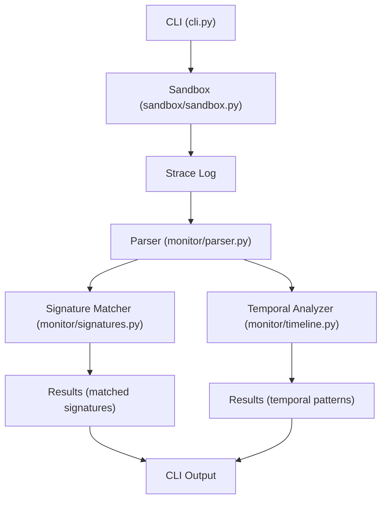
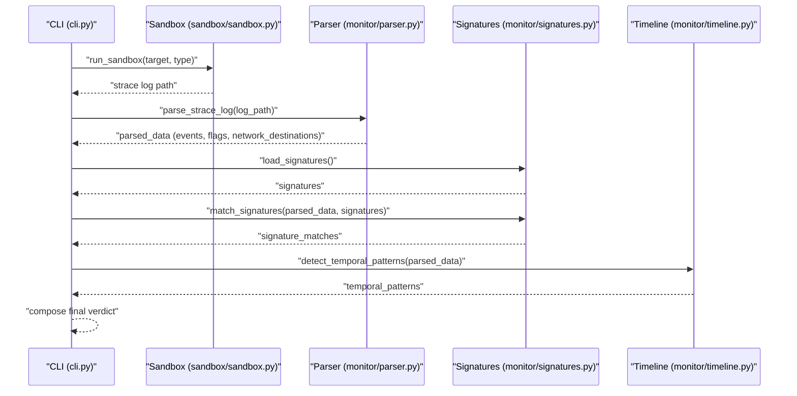
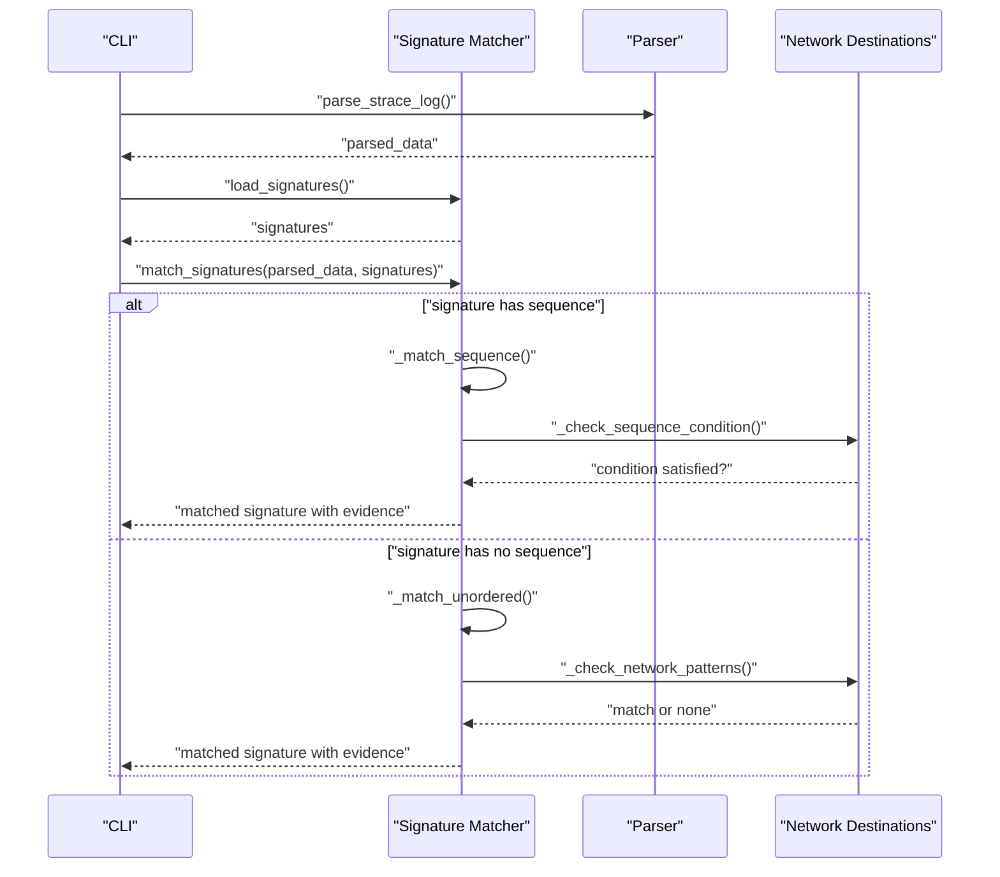
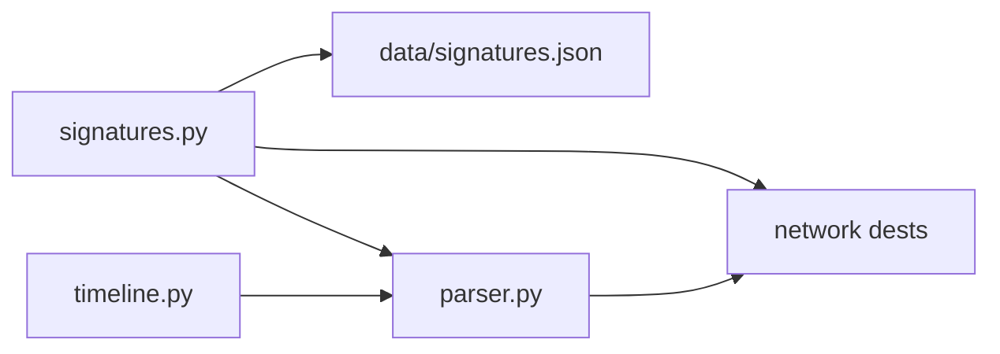

# Signature Definitions

<cite>
**Referenced Files in This Document**
- [data/signatures.json](file://data/signatures.json)
- [monitor/signatures.py](file://monitor/signatures.py)
- [monitor/parser.py](file://monitor/parser.py)
- [monitor/timeline.py](file://monitor/timeline.py)
- [cli.py](file://cli.py)
- [README.md](file://README.md)
</cite>

## Table of Contents
1. [Introduction](#introduction)
2. [Project Structure](#project-structure)
3. [Core Components](#core-components)
4. [Architecture Overview](#architecture-overview)
5. [Detailed Component Analysis](#detailed-component-analysis)
6. [Dependency Analysis](#dependency-analysis)
7. [Performance Considerations](#performance-considerations)
8. [Troubleshooting Guide](#troubleshooting-guide)
9. [Conclusion](#conclusion)
10. [Appendices](#appendices)

## Introduction
This document explains TraceTree’s behavioral signature definition system for the eight predefined detection patterns. It covers the structure of each signature, the matching algorithm (including temporal sequence analysis, syscall correlation, and evidence scoring), and guidance for creating custom signatures. It also addresses signature priority ordering, false positive mitigation, and performance impact considerations.

## Project Structure
The behavioral signature system is centered around:
- A JSON catalog of signatures
- A signature matcher that evaluates parsed syscall events
- A parser that converts strace logs into structured events with severity and network classification
- A temporal analyzer that detects time-based patterns
- A CLI that orchestrates the pipeline and displays results

**Diagram sources**
- [cli.py:196-303](file://cli.py#L196-L303)
- [sandbox/sandbox.py:184-428](file://sandbox/sandbox.py#L184-L428)
- [monitor/parser.py:342-682](file://monitor/parser.py#L342-L682)
- [monitor/signatures.py:86-116](file://monitor/signatures.py#L86-L116)
- [monitor/timeline.py:298-331](file://monitor/timeline.py#L298-L331)

**Section sources**
- [README.md:306-321](file://README.md#L306-L321)
- [cli.py:196-303](file://cli.py#L196-L303)

## Core Components
- Signature catalog: Eight predefined behavioral patterns defined in JSON with fields for name, description, severity, syscall requirements, file pattern matching, network conditions, sequence patterns, and confidence boost.
- Signature matcher: Loads signatures and applies two matching modes:
  - Unordered matching: presence of required syscalls plus at least one file or network condition match.
  - Ordered sequence matching: a sequence of (syscall, condition) pairs must appear in order (not necessarily consecutive) across the event stream.
- Parser: Converts strace logs into structured events with timestamps, severity weights, and network destination classifications.
- Temporal analyzer: Detects five time-based patterns from timestamped event streams.

**Section sources**
- [data/signatures.json:1-246](file://data/signatures.json#L1-L246)
- [monitor/signatures.py:57-116](file://monitor/signatures.py#L57-L116)
- [monitor/parser.py:342-682](file://monitor/parser.py#L342-L682)
- [monitor/timeline.py:298-331](file://monitor/timeline.py#L298-L331)

## Architecture Overview
The signature matching pipeline integrates with the broader analysis flow:

**Diagram sources**
- [cli.py:196-303](file://cli.py#L196-L303)
- [sandbox/sandbox.py:184-428](file://sandbox/sandbox.py#L184-L428)
- [monitor/parser.py:342-682](file://monitor/parser.py#L342-L682)
- [monitor/signatures.py:57-116](file://monitor/signatures.py#L57-L116)
- [monitor/timeline.py:298-331](file://monitor/timeline.py#L298-L331)

## Detailed Component Analysis

### Signature Catalog Structure
Each signature object includes:
- name: Unique identifier
- description: Human-readable summary
- severity: Integer from 1 to 10
- syscalls: List of required syscall types
- files: List of file path patterns to match
- network: Object with:
  - ports: List of numeric ports to flag
  - known_hosts: List of hostnames to flag
  - ip_patterns: Reserved for IP prefix patterns
- sequence: Optional ordered list of (syscall, condition) pairs
- confidence_boost: Numeric boost applied to final confidence

Supported sequence conditions include:
- external: Connect to non-loopback, non-registry IP
- shell: Execve of common shell binaries
- non_standard: Execve of a binary not in known benign binaries
- sensitive: Access to sensitive files (patterns)
- secret: Access to secret-related files (patterns)
- cron_path: Open/write to crontab-related paths
- pool_port: Connect to known mining pool ports
- exfil_host: Connect to known paste/file-share hosts
- PROT_EXEC: mprotect with PROT_EXEC flag
- null/None: Always matches

**Section sources**
- [data/signatures.json:1-246](file://data/signatures.json#L1-L246)
- [monitor/signatures.py:244-343](file://monitor/signatures.py#L244-L343)

### Matching Algorithm
Two matching modes are supported:

1) Unordered matching
- Checks that all required syscalls are present in the event list.
- If file patterns are specified, at least one file event must match.
- If network rules are specified, at least one connect event must satisfy the rule.
- Evidence lists the specific events that triggered the match.

2) Ordered sequence matching
- Validates that a sequence of (syscall, condition) appears in order across the event stream.
- For each step, the matcher checks the syscall type and condition against the current event.
- Evidence records the matched events and a step-by-step description.

Evidence scoring
- Each matched signature is returned with:
  - name, description, severity
  - evidence: human-readable list of triggering events
  - matched_events: the actual event dicts
  - confidence_boost: from the signature definition

Priority ordering
- Matches are sorted by severity descending before returning.

**Section sources**
- [monitor/signatures.py:86-116](file://monitor/signatures.py#L86-L116)
- [monitor/signatures.py:123-141](file://monitor/signatures.py#L123-L141)
- [monitor/signatures.py:143-194](file://monitor/signatures.py#L143-L194)
- [monitor/signatures.py:196-236](file://monitor/signatures.py#L196-L236)
- [monitor/signatures.py:474-487](file://monitor/signatures.py#L474-L487)

### Temporal Sequence Analysis
While signatures define ordered sequences, the temporal analyzer detects time-based patterns from the timestamped event stream:
- connect_then_shell: External connect followed by shell exec within 3 seconds
- credential_scan_then_exfil: Sensitive file read followed by external connect within 5 seconds
- delayed_payload: >10s gap followed by suspicious activity burst
- rapid_file_enumeration: 10+ file opens within 1 second
- burst_process_spawn: 5+ clone/execve within 2 seconds

These are independent of signature sequences and rely on relative timestamps.

**Section sources**
- [monitor/timeline.py:298-331](file://monitor/timeline.py#L298-L331)
- [monitor/timeline.py:100-131](file://monitor/timeline.py#L100-L131)
- [monitor/timeline.py:134-169](file://monitor/timeline.py#L134-L169)
- [monitor/timeline.py:172-206](file://monitor/timeline.py#L172-L206)
- [monitor/timeline.py:209-250](file://monitor/timeline.py#L209-L250)
- [monitor/timeline.py:253-281](file://monitor/timeline.py#L253-L281)

### Syscall Correlation and Network Classification
The parser assigns severity and classifies network destinations:
- Severity weights are defined per syscall type.
- Network destinations are categorized as safe_registry, known_benign, suspicious, or unknown, with risk scores.
- Sensitive file access is flagged based on patterns.

These classifications inform signature conditions (e.g., external, sensitive, non_standard).

**Section sources**
- [monitor/parser.py:11-45](file://monitor/parser.py#L11-L45)
- [monitor/parser.py:246-318](file://monitor/parser.py#L246-L318)
- [monitor/parser.py:321-340](file://monitor/parser.py#L321-L340)
- [monitor/parser.py:342-682](file://monitor/parser.py#L342-L682)

### Signature-by-Signature Breakdown

#### crypto_miner
- Purpose: Detect cryptocurrency mining via process spawning and mining pool connections.
- Structure:
  - severity: 8
  - syscalls: clone, fork, connect
  - sequence: clone → clone → connect(pool_port)
  - confidence_boost: 25.0
- Matching: Two process spawn syscalls followed by a connect to a known mining pool port.

**Section sources**
- [data/signatures.json:3-40](file://data/signatures.json#L3-L40)
- [monitor/signatures.py:244-343](file://monitor/signatures.py#L244-L343)

#### reverse_shell
- Purpose: Detect reverse shell setup via connect → dup2 → execve of shell.
- Structure:
  - severity: 10
  - syscalls: connect, dup2, execve
  - sequence: connect(external) → dup2 → execve(shell)
  - confidence_boost: 35.0
- Matching: External connect followed by dup2 and shell execve.

**Section sources**
- [data/signatures.json:41-70](file://data/signatures.json#L41-L70)
- [monitor/signatures.py:244-343](file://monitor/signatures.py#L244-L343)

#### credential_theft
- Purpose: Credential theft via sensitive file read followed by external network exfiltration.
- Structure:
  - severity: 9
  - syscalls: openat, connect
  - files: sensitive file patterns
  - sequence: openat(sensitive) → connect(external)
  - confidence_boost: 30.0
- Matching: Access to sensitive files followed by external connect.

**Section sources**
- [data/signatures.json:71-109](file://data/signatures.json#L71-L109)
- [monitor/signatures.py:244-343](file://monitor/signatures.py#L244-L343)

#### typosquat_exfil
- Purpose: Typosquatted package exfiltration via secret read to paste/file-share sites.
- Structure:
  - severity: 9
  - syscalls: openat, connect
  - files: secret-related patterns
  - network: known_hosts includes paste/file-share domains
  - sequence: openat(secret) → connect(exfil_host)
  - confidence_boost: 30.0
- Matching: Secret file read followed by connect to known exfil hosts.

**Section sources**
- [data/signatures.json:110-156](file://data/signatures.json#L110-L156)
- [monitor/signatures.py:244-343](file://monitor/signatures.py#L244-L343)

#### process_injection
- Purpose: Process injection via PROT_EXEC memory mapping followed by non-standard binary execution.
- Structure:
  - severity: 9
  - syscalls: mprotect, execve
  - sequence: mprotect(PROT_EXEC) → execve(non_standard)
  - confidence_boost: 30.0
- Matching: Executable memory mapping followed by non-standard binary execve.

**Section sources**
- [data/signatures.json:157-178](file://data/signatures.json#L157-L178)
- [monitor/signatures.py:244-343](file://monitor/signatures.py#L244-L343)

#### dns_tunneling
- Purpose: DNS tunneling via excessive DNS queries and raw socket exfiltration.
- Structure:
  - severity: 7
  - syscalls: getaddrinfo, sendto, socket
  - network: ports include 53, 5353
  - sequence: null (no ordered sequence)
  - confidence_boost: 20.0
- Matching: Presence of DNS and raw socket syscalls with suspicious ports.

**Section sources**
- [data/signatures.json:179-198](file://data/signatures.json#L179-L198)
- [monitor/signatures.py:244-343](file://monitor/signatures.py#L244-L343)

#### persistence_cron
- Purpose: Cron-based persistence via writing to crontab or cron spool.
- Structure:
  - severity: 7
  - syscalls: openat, write
  - files: crontab-related paths
  - sequence: openat(cron_path) → write
  - confidence_boost: 20.0
- Matching: Access to crontab paths followed by write.

**Section sources**
- [data/signatures.json:199-226](file://data/signatures.json#L199-L226)
- [monitor/signatures.py:244-343](file://monitor/signatures.py#L244-L343)

#### container_escape
- Purpose: Container escape attempts via access to host-level paths or mounts.
- Structure:
  - severity: 10
  - syscalls: openat
  - files: host-level paths (/proc/1/, /sys/fs/cgroup, /run/docker.sock)
  - sequence: null (no ordered sequence)
  - confidence_boost: 35.0
- Matching: Access to known host-level paths.

**Section sources**
- [data/signatures.json:227-244](file://data/signatures.json#L227-L244)
- [monitor/signatures.py:244-343](file://monitor/signatures.py#L244-L343)

### Sequence Diagram: Signature Matching Flow

**Diagram sources**
- [monitor/signatures.py:86-116](file://monitor/signatures.py#L86-L116)
- [monitor/signatures.py:123-141](file://monitor/signatures.py#L123-L141)
- [monitor/signatures.py:196-236](file://monitor/signatures.py#L196-L236)
- [monitor/signatures.py:244-343](file://monitor/signatures.py#L244-L343)

## Dependency Analysis
- Signature matcher depends on:
  - JSON catalog for signature definitions
  - Parser-provided events and network destinations
  - Known benign binaries and safe network prefixes for condition evaluation
- Parser provides:
  - Event list with types, targets, severity, and details
  - Network destination classifications
  - Timestamps for temporal analysis
- Temporal analyzer depends on parsed_data having timestamps.

**Diagram sources**
- [monitor/signatures.py:57-116](file://monitor/signatures.py#L57-L116)
- [monitor/parser.py:342-682](file://monitor/parser.py#L342-L682)
- [monitor/timeline.py:298-331](file://monitor/timeline.py#L298-L331)

**Section sources**
- [monitor/signatures.py:57-116](file://monitor/signatures.py#L57-L116)
- [monitor/parser.py:342-682](file://monitor/parser.py#L342-L682)
- [monitor/timeline.py:298-331](file://monitor/timeline.py#L298-L331)

## Performance Considerations
- Signature matching complexity:
  - Unordered matching: O(E*S + E*F + E*N) where E is events, S is required syscalls, F is file patterns, N is network rules.
  - Ordered sequence matching: O(E*S_len) where S_len is the length of the sequence.
- Temporal pattern detection: O(E^2) in worst-case sliding windows; optimized by early exits and thresholds.
- Parser overhead: Regex parsing and classification; minimal compared to matching.
- Recommendations:
  - Keep file and network pattern lists concise.
  - Prefer unordered matching when sequence is not strictly required.
  - Use confidence_boost judiciously to avoid overconfidence.
  - Ensure strace -t is enabled for temporal analysis.

[No sources needed since this section provides general guidance]

## Troubleshooting Guide
- No signatures matched:
  - Verify signatures file exists and is valid JSON.
  - Confirm required syscalls are present in the parsed events.
  - Check that file/network conditions are met (e.g., sensitive paths, external hosts).
- False positives:
  - Review benign binary and safe network lists.
  - Adjust severity thresholds or confidence_boost values.
  - Add stricter file or network conditions.
- Performance issues:
  - Reduce signature count or complexity.
  - Limit temporal pattern checks to timestamped logs.
  - Validate that strace output contains sufficient events.

**Section sources**
- [monitor/signatures.py:57-83](file://monitor/signatures.py#L57-L83)
- [monitor/parser.py:342-682](file://monitor/parser.py#L342-L682)

## Conclusion
TraceTree’s signature system combines precise syscall requirements, file and network pattern matching, and ordered sequence validation with robust temporal analysis. The eight predefined signatures cover critical attack vectors, while the modular design allows for easy extension and tuning. Proper validation and cautious confidence boosting help balance sensitivity and specificity.

[No sources needed since this section summarizes without analyzing specific files]

## Appendices

### Creating Custom Signatures
- JSON formatting:
  - Place the new signature object in the signatures array.
  - Include name, description, severity, syscalls, files, network, sequence, and confidence_boost.
- Validation rules:
  - severity must be an integer from 1 to 10.
  - syscalls must be valid syscall types recognized by the parser.
  - sequence entries must use supported conditions.
  - network must include ports and/or known_hosts as applicable.
- Integration with the pipeline:
  - Drop the JSON into the catalog path used by the matcher.
  - Ensure the CLI loads signatures and sorts by severity.
  - Optionally enable temporal analysis by running strace with -t.

**Section sources**
- [data/signatures.json:1-246](file://data/signatures.json#L1-L246)
- [monitor/signatures.py:57-116](file://monitor/signatures.py#L57-L116)
- [cli.py:242-251](file://cli.py#L242-L251)

### Signature Priority Ordering
- Matches are sorted by severity descending before returning.
- This ensures higher-risk patterns are highlighted first.

**Section sources**
- [monitor/signatures.py:113-115](file://monitor/signatures.py#L113-L115)

### False Positive Mitigation
- Use benign binary and safe network lists to contextualize events.
- Employ strict file and network conditions (e.g., specific hostnames or ports).
- Leverage temporal patterns to confirm suspicious timing.
- Tune confidence_boost to reflect domain-specific risk.

**Section sources**
- [monitor/signatures.py:32-50](file://monitor/signatures.py#L32-L50)
- [monitor/parser.py:85-122](file://monitor/parser.py#L85-L122)

### Performance Impact Considerations
- Signature matching scales linearly with event count and signature complexity.
- Temporal analysis adds quadratic complexity in the worst case.
- Keep patterns concise and leverage early exits in matching logic.

**Section sources**
- [monitor/signatures.py:143-194](file://monitor/signatures.py#L143-L194)
- [monitor/timeline.py:134-169](file://monitor/timeline.py#L134-L169)