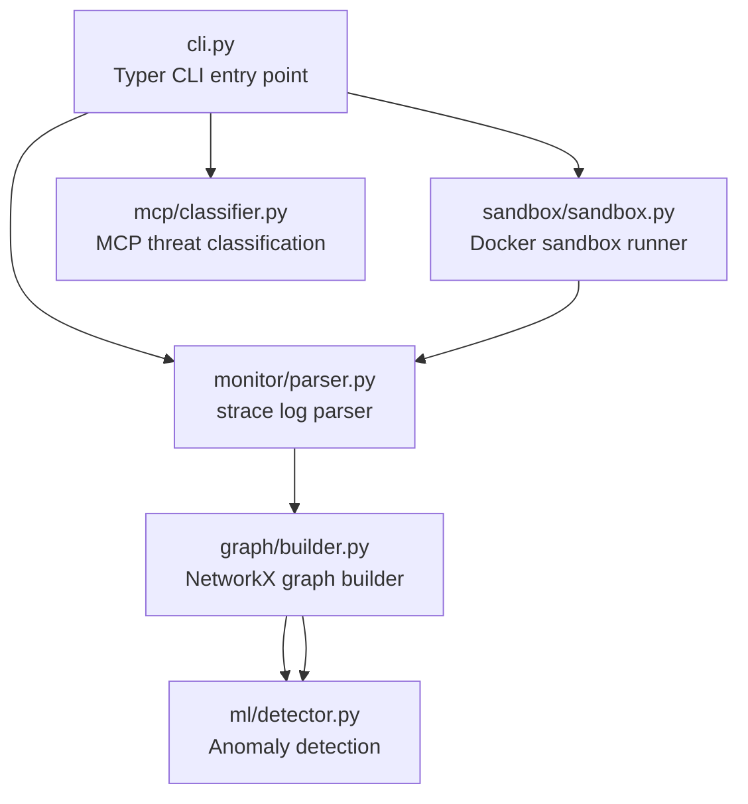
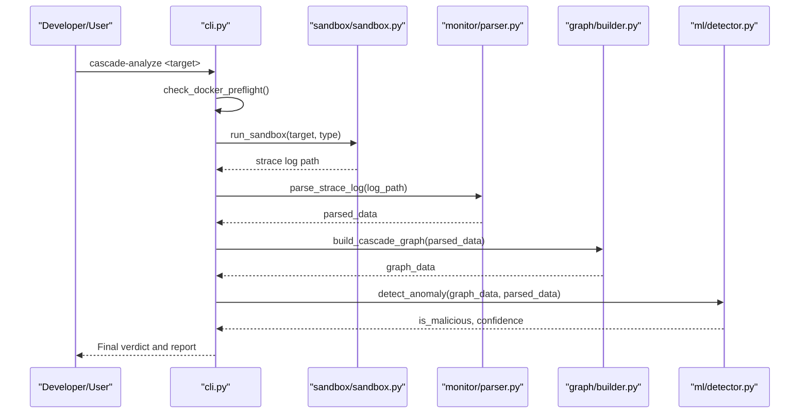
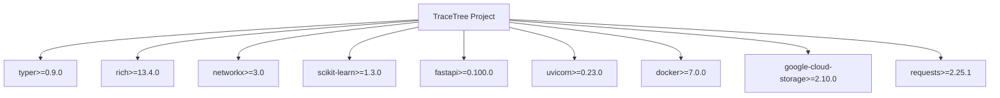

# Contributing and Development

<cite>
**Referenced Files in This Document**
- [README.md](file://README.md)
- [pyproject.toml](file://pyproject.toml)
- [setup.py](file://setup.py)
- [cli.py](file://cli.py)
- [sandbox/sandbox.py](file://sandbox/sandbox.py)
- [monitor/parser.py](file://monitor/parser.py)
- [graph/builder.py](file://graph/builder.py)
- [ml/detector.py](file://ml/detector.py)
- [mcp/classifier.py](file://mcp/classifier.py)
- [requirements-ingest.txt](file://requirements-ingest.txt)
- [tests/mcp/test_sandbox_injection.py](file://tests/mcp/test_sandbox_injection.py)
</cite>

## Table of Contents
1. [Introduction](#introduction)
2. [Project Structure](#project-structure)
3. [Core Components](#core-components)
4. [Architecture Overview](#architecture-overview)
5. [Development Environment Setup](#development-environment-setup)
6. [Code Contribution Workflow](#code-contribution-workflow)
7. [Testing Procedures](#testing-procedures)
8. [Extending Detection Capabilities](#extending-detection-capabilities)
9. [Extending Target Type Support](#extending-target-type-support)
10. [Improving Analysis Accuracy](#improving-analysis-accuracy)
11. [Release Process](#release-process)
12. [Community Guidelines and Maintainer Responsibilities](#community-guidelines-and-maintainer-responsibilities)
13. [Dependency Analysis](#dependency-analysis)
14. [Performance Considerations](#performance-considerations)
15. [Troubleshooting Guide](#troubleshooting-guide)
16. [Conclusion](#conclusion)

## Introduction
This document provides comprehensive guidance for contributing to TraceTree and developing new capabilities. It covers environment setup, code contribution procedures, testing, extending detection features, improving accuracy, and release processes. It also outlines community and maintainer responsibilities derived from the repository’s stated contribution policy.

## Project Structure
TraceTree is organized into modular components that implement sandboxing, syscall parsing, signature matching, temporal analysis, graph construction, machine learning classification, MCP server analysis, and CLI orchestration. The repository includes a dedicated Docker-based sandbox runtime and a CLI entry point that orchestrates the end-to-end pipeline.

**Diagram sources**
- [cli.py:1-1251](file://cli.py#L1-L1251)
- [sandbox/sandbox.py:1-447](file://sandbox/sandbox.py#L1-L447)
- [monitor/parser.py:1-682](file://monitor/parser.py#L1-L682)
- [graph/builder.py:1-196](file://graph/builder.py#L1-L196)
- [ml/detector.py:1-300](file://ml/detector.py#L1-L300)
- [mcp/classifier.py:1-268](file://mcp/classifier.py#L1-L268)

**Section sources**
- [README.md:1-348](file://README.md#L1-L348)
- [cli.py:1-1251](file://cli.py#L1-L1251)

## Core Components
- Sandbox: Builds and runs a Docker-based sandbox image, traces syscalls with strace, and returns a structured log for analysis.
- Parser: Parses strace logs, extracts events, assigns severity, flags suspicious activity, and classifies network destinations.
- Graph Builder: Constructs a NetworkX directed graph with process, file, and network nodes and adds temporal edges.
- ML Detector: Extracts features from parsed data and graph statistics, applies a supervised model or a zero-shot IsolationForest baseline, and computes a confidence score.
- MCP Classifier: Applies rule-based threat categories to MCP server behavior observed in the sandbox.
- CLI: Provides subcommands for analysis, training, updates, watching repositories, and installing hooks.

**Section sources**
- [README.md:306-328](file://README.md#L306-L328)
- [cli.py:1-1251](file://cli.py#L1-L1251)
- [sandbox/sandbox.py:184-406](file://sandbox/sandbox.py#L184-L406)
- [monitor/parser.py:342-682](file://monitor/parser.py#L342-L682)
- [graph/builder.py:8-196](file://graph/builder.py#L8-L196)
- [ml/detector.py:29-300](file://ml/detector.py#L29-L300)
- [mcp/classifier.py:61-268](file://mcp/classifier.py#L61-L268)

## Architecture Overview
The system integrates Docker sandboxing, strace-based syscall capture, and a multi-stage analysis pipeline combining rule-based signatures, temporal pattern detection, and ML anomaly detection. MCP server analysis augments this with adversarial probing and rule-based threat classification.

**Diagram sources**
- [cli.py:196-304](file://cli.py#L196-L304)
- [sandbox/sandbox.py:184-406](file://sandbox/sandbox.py#L184-L406)
- [monitor/parser.py:342-682](file://monitor/parser.py#L342-L682)
- [graph/builder.py:8-196](file://graph/builder.py#L8-L196)
- [ml/detector.py:235-300](file://ml/detector.py#L235-L300)

## Development Environment Setup
- Python version: Python 3.9+ is required.
- Docker: Must be installed and running; the CLI performs a preflight check and instructs users on installation and startup.
- Dependencies: Managed via pyproject.toml and setup.py. Core dependencies include Typer, Rich, NetworkX, scikit-learn, FastAPI, Uvicorn, Docker SDK, google-cloud-storage, and Requests.
- Installation: Install the package in editable mode to use CLI entry points.

Key environment requirements and installation steps are documented in the repository’s README and project configuration files.

**Section sources**
- [README.md:106-118](file://README.md#L106-L118)
- [pyproject.toml:10-24](file://pyproject.toml#L10-L24)
- [setup.py:19-29](file://setup.py#L19-L29)

## Code Contribution Workflow
- Fork the repository and create feature branches following a clear naming convention (e.g., feature/<brief-description>, fix/<issue>, docs/<area>).
- Keep changes focused and decoupled from existing modules as encouraged by the project’s contribution note.
- Submit pull requests with clear descriptions of the problem, solution, and impact.
- Ensure code passes linting and formatting standards consistent with the project’s tooling.
- Include tests where applicable and update documentation as needed.

The repository explicitly welcomes pull requests and encourages keeping new features decoupled from existing modules.

**Section sources**
- [README.md:340-343](file://README.md#L340-L343)

## Testing Procedures
- Unit tests: The repository includes a targeted test for MCP sandbox injection behavior. Expand tests to cover parser logic, graph building, ML feature extraction, and MCP threat classification.
- Integration tests: Validate the full pipeline from sandbox execution through parsing, graphing, and ML detection. Use representative strace logs and known-good/known-bad scenarios.
- Continuous integration: Configure automated checks for linting, formatting, unit tests, and integration tests. Ensure Docker availability in CI runners and mock or skip ML model downloads where appropriate.

Current test coverage includes MCP sandbox injection testing.

**Section sources**
- [tests/mcp/test_sandbox_injection.py:1-200](file://tests/mcp/test_sandbox_injection.py#L1-L200)

## Extending Detection Capabilities
- Behavioral signatures: Extend signature patterns and matching logic to detect new attack vectors. Update signature definitions and ensure evidence collection for matched events.
- Temporal patterns: Add new time-based pattern detectors leveraging timestamped event streams.
- Syscall severity scoring: Adjust severity weights for syscall types to improve sensitivity to emerging threats.
- Network destination classification: Expand classification rules for new suspicious destinations and ports.
- YARA and n-gram fingerprinting: Integrate YARA rule scanning and syscall n-gram analysis to complement existing detection methods.

These extensions align with the existing modules for signatures, temporal analysis, parser severity scoring, and n-gram fingerprinting.

**Section sources**
- [README.md:43-94](file://README.md#L43-L94)
- [monitor/parser.py:11-45](file://monitor/parser.py#L11-L45)
- [monitor/parser.py:246-318](file://monitor/parser.py#L246-L318)
- [cli.py:261-279](file://cli.py#L261-L279)

## Extending Target Type Support
- Current supported targets include PyPI packages, npm packages, DMG images, and EXE files. To add new target types:
  - Implement a new sandbox execution script within the sandbox container.
  - Add a new target type handler in the sandbox runner and ensure proper strace logging.
  - Update the CLI target type determination logic and add corresponding parsing and graphing support.
  - Validate with representative samples and document behavior differences.

The sandbox module demonstrates how new target types integrate with strace-based tracing and resource monitoring.

**Section sources**
- [README.md:95-103](file://README.md#L95-L103)
- [sandbox/sandbox.py:184-406](file://sandbox/sandbox.py#L184-L406)
- [cli.py:112-124](file://cli.py#L112-L124)

## Improving Analysis Accuracy
- Model training: Use the interactive training pipeline to ingest samples, run sandbox analysis, and train a supervised model. Consider expanding training datasets and introducing train/validation splits for robust evaluation.
- Zero-shot baselines: Enhance the IsolationForest baseline with richer clean-package baselines to improve zero-day detection.
- Feature engineering: Incorporate additional graph-level and event-level features to improve ML discrimination.
- Severity boosting: Tune thresholds and severity adjustments to reduce false positives while maintaining sensitivity to high-confidence threats.
- MCP analysis: Improve adversarial probing strategies and refine rule-based threat categories for better MCP server security assessment.

Training and update mechanisms are exposed via CLI commands and ML detector utilities.

**Section sources**
- [README.md:242-264](file://README.md#L242-L264)
- [cli.py:501-561](file://cli.py#L501-L561)
- [ml/detector.py:108-163](file://ml/detector.py#L108-L163)
- [mcp/classifier.py:61-96](file://mcp/classifier.py#L61-L96)

## Release Process
- Versioning: The project uses semantic versioning as indicated by the version field in project configuration.
- Changelog: Maintain a changelog that documents new features, bug fixes, breaking changes, and deprecations.
- Pre-release validation: Ensure all tests pass, Docker-based sandbox builds successfully, and ML model updates are available.
- Packaging: Publish the package to the distribution channel using standard Python packaging practices.
- Deployment: Announce releases with highlights and migration notes; update documentation and examples as needed.

Version and packaging metadata are defined in project configuration files.

**Section sources**
- [pyproject.toml:7](file://pyproject.toml#L7)
- [setup.py:14-16](file://setup.py#L14-L16)

## Community Guidelines and Maintainer Responsibilities
- Contributions: Pull requests are welcomed; maintain decoupled feature additions to preserve modularity.
- Communication: Engage constructively in discussions and code reviews.
- Quality: Uphold code quality, documentation completeness, and test coverage.
- Maintenance: Review and triage issues, provide timely feedback on PRs, and ensure releases are stable.

The repository explicitly invites contributions and emphasizes keeping features decoupled.

**Section sources**
- [README.md:340-343](file://README.md#L340-L343)

## Dependency Analysis
The project depends on several core libraries for CLI, visualization, graph processing, ML, container orchestration, cloud storage, and HTTP networking. The dependency lists are defined in both pyproject.toml and setup.py.

**Diagram sources**
- [pyproject.toml:14-24](file://pyproject.toml#L14-L24)
- [setup.py:19-29](file://setup.py#L19-L29)

**Section sources**
- [pyproject.toml:14-24](file://pyproject.toml#L14-L24)
- [setup.py:19-29](file://setup.py#L19-L29)

## Performance Considerations
- Docker overhead: Building and running containers introduces latency; optimize sandbox image caching and reuse where possible.
- strace verbosity: Large strace logs increase parsing and graph construction time; ensure efficient parsing and streaming where feasible.
- ML inference: Cache loaded models to avoid repeated I/O and unpickling; consider quantization or pruning for faster inference if needed.
- Graph size: Limit temporal windows and prune unnecessary edges to keep graph sizes manageable.

[No sources needed since this section provides general guidance]

## Troubleshooting Guide
- Docker preflight failures: The CLI checks for Docker availability and provides OS-specific installation and startup guidance. Ensure the Docker daemon is running before analysis.
- Sandbox failures: Inspect sandbox logs, verify target existence and permissions, and confirm required tools (wine64, 7z) are present in the sandbox image.
- Parser errors: Validate strace log format and timestamps; ensure logs are not truncated mid-syscall.
- ML model issues: Confirm model.pkl availability or allow automatic GCS download; clear model cache if stale.

**Section sources**
- [cli.py:74-111](file://cli.py#L74-L111)
- [sandbox/sandbox.py:184-406](file://sandbox/sandbox.py#L184-L406)
- [monitor/parser.py:342-682](file://monitor/parser.py#L342-L682)
- [ml/detector.py:108-163](file://ml/detector.py#L108-L163)

## Conclusion
This guide consolidates environment setup, contribution workflows, testing, and enhancement strategies for TraceTree. By following these procedures and leveraging the modular architecture, contributors can reliably extend detection capabilities, improve accuracy, and maintain a robust development lifecycle.