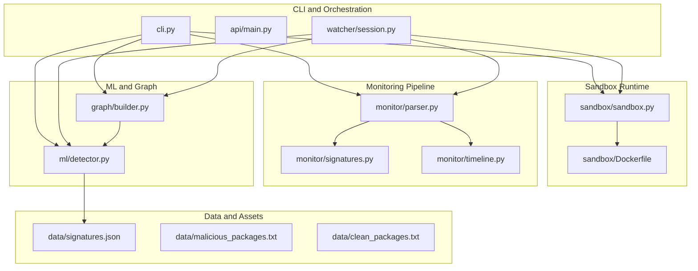
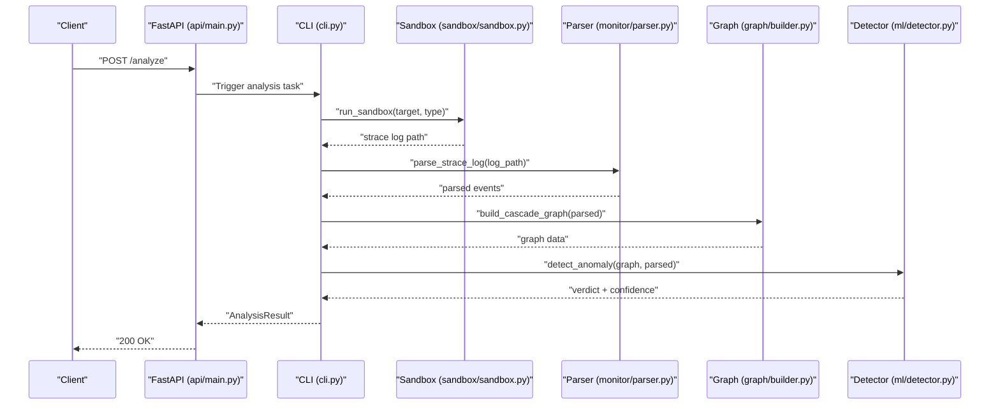
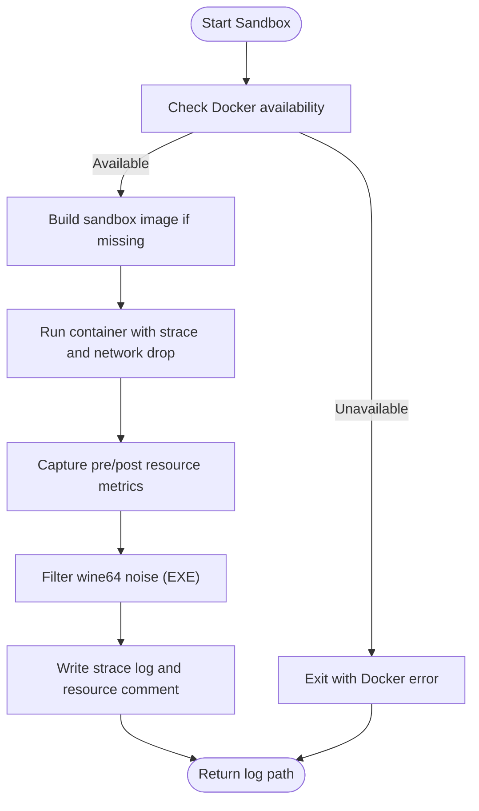
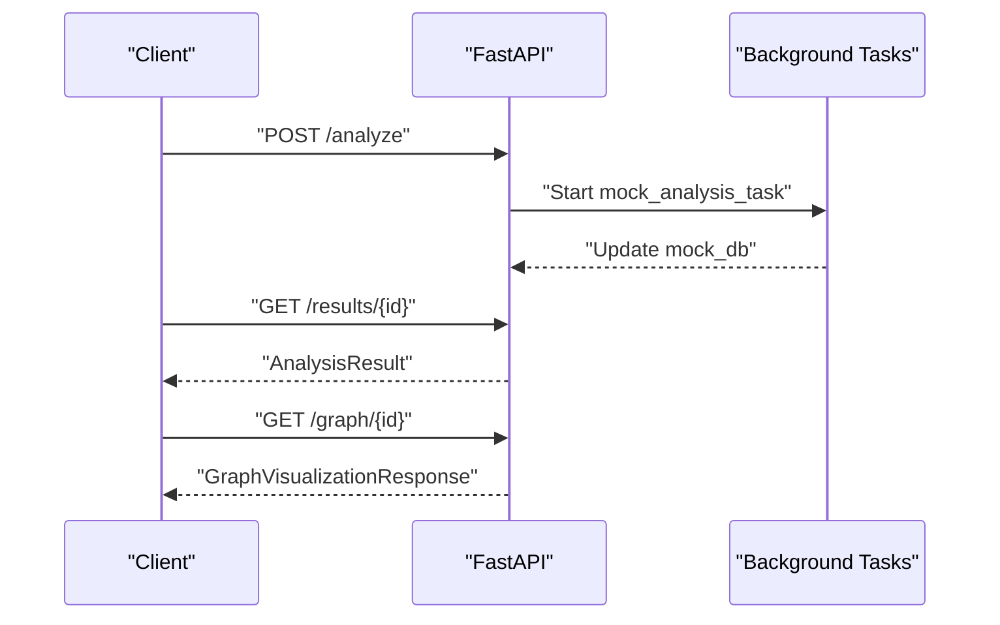
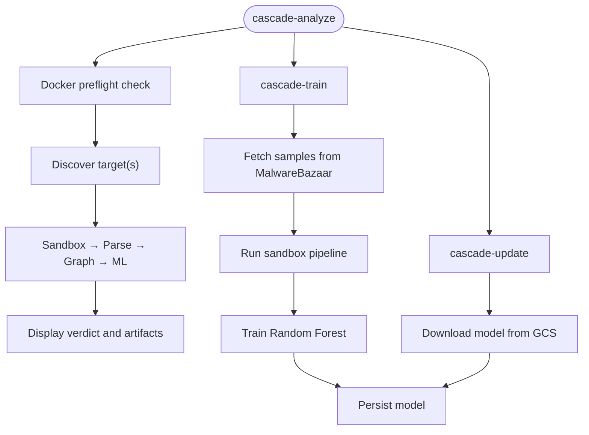
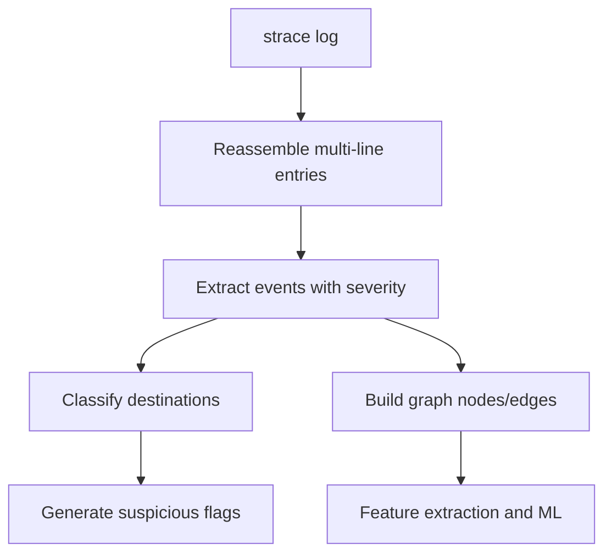
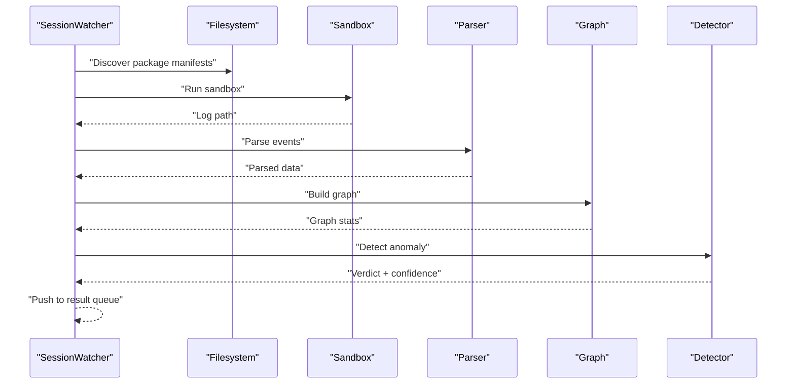
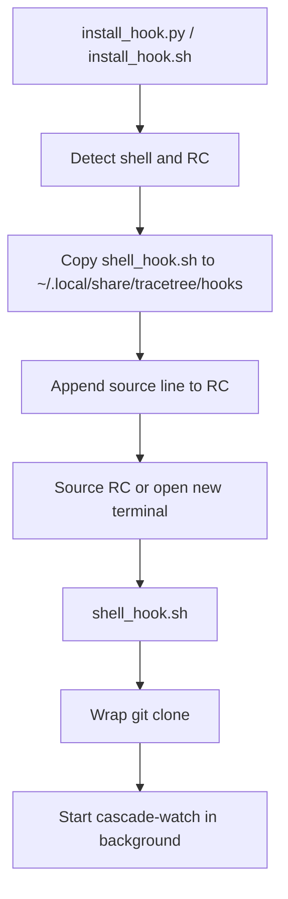
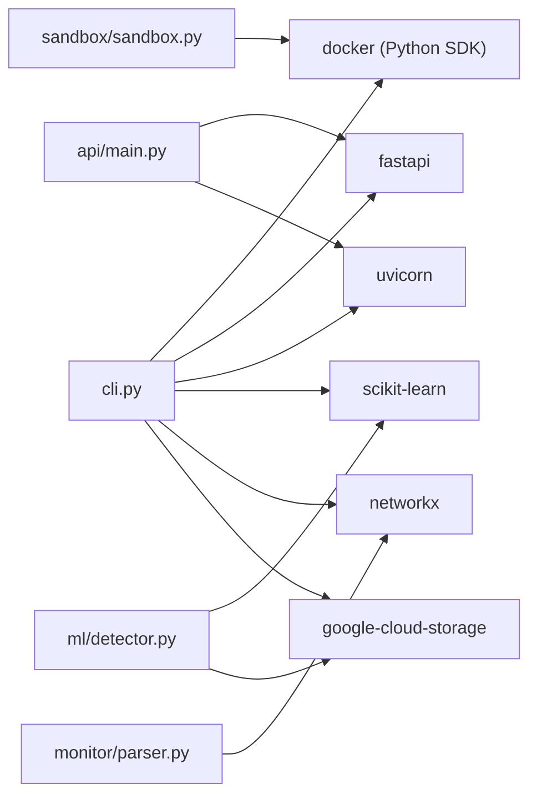

# Deployment and Operations

<cite>
**Referenced Files in This Document**
- [README.md](file://README.md)
- [pyproject.toml](file://pyproject.toml)
- [setup.py](file://setup.py)
- [requirements-ingest.txt](file://requirements-ingest.txt)
- [Dockerfile](file://sandbox/Dockerfile)
- [api/main.py](file://api/main.py)
- [cli.py](file://cli.py)
- [ingest_malwarebazaar.py](file://ingest_malwarebazaar.py)
- [signatures.json](file://data/signatures.json)
- [detector.py](file://ml/detector.py)
- [parser.py](file://monitor/parser.py)
- [session.py](file://watcher/session.py)
- [sandbox.py](file://sandbox/sandbox.py)
- [install_hook.py](file://hooks/install_hook.py)
- [install_hook.sh](file://hooks/install_hook.sh)
- [shell_hook.sh](file://hooks/shell_hook.sh)
</cite>

## Table of Contents
1. [Introduction](#introduction)
2. [Project Structure](#project-structure)
3. [Core Components](#core-components)
4. [Architecture Overview](#architecture-overview)
5. [Detailed Component Analysis](#detailed-component-analysis)
6. [Dependency Analysis](#dependency-analysis)
7. [Performance Considerations](#performance-considerations)
8. [Troubleshooting Guide](#troubleshooting-guide)
9. [Conclusion](#conclusion)
10. [Appendices](#appendices)

## Introduction
This document provides comprehensive deployment and operations guidance for TraceTree focused on production-grade deployment, scaling, and maintenance. It covers container orchestration approaches (Docker and Kubernetes), resource management, scaling strategies for high-volume analysis workloads, load balancing, performance optimization, model and signature updates, monitoring and logging, security hardening, troubleshooting, backup and recovery, disaster recovery, and operational metrics collection.

## Project Structure
TraceTree is organized into modular components:
- CLI entrypoints and orchestration
- Sandbox runtime and Docker image
- Monitoring pipeline (parser, signatures, timeline)
- Graph construction and ML anomaly detection
- API server (stubbed)
- Watcher for continuous monitoring
- Hooks for shell integration
- Data assets (signatures, training lists)

**Diagram sources**
- [cli.py:196-304](file://cli.py#L196-L304)
- [api/main.py:1-134](file://api/main.py#L1-L134)
- [watcher/session.py:29-418](file://watcher/session.py#L29-L418)
- [sandbox/sandbox.py:184-406](file://sandbox/sandbox.py#L184-L406)
- [monitor/parser.py:342-682](file://monitor/parser.py#L342-L682)
- [monitor/signatures.py:57-116](file://monitor/signatures.py#L57-L116)
- [ml/detector.py:29-68](file://ml/detector.py#L29-L68)
- [graph/builder.py](file://graph/builder.py)
- [data/signatures.json:1-246](file://data/signatures.json#L1-L246)

**Section sources**
- [README.md:1-348](file://README.md#L1-L348)
- [pyproject.toml:1-37](file://pyproject.toml#L1-L37)
- [setup.py:1-44](file://setup.py#L1-L44)

## Core Components
- CLI orchestrator: validates Docker prerequisites, orchestrates sandbox → parse → graph → ML pipeline, supports bulk analysis, MCP server analysis, and training/update workflows.
- Sandbox runtime: builds and runs the sandbox image, executes targets under strace, captures resource usage, and filters wine noise for EXE analysis.
- Monitoring pipeline: parses strace logs, classifies destinations, flags sensitive files, and extracts temporal patterns.
- ML detector: maps features to a numeric vector, loads a trained model or fallback, and adjusts confidence using severity and temporal signals.
- API server: FastAPI stub exposing endpoints for analysis submission and results retrieval.
- Watcher: background session guardian that discovers package manifests and continuously analyzes them.
- Hooks: shell integration to auto-start watcher after git clone.

**Section sources**
- [cli.py:74-111](file://cli.py#L74-L111)
- [cli.py:196-304](file://cli.py#L196-L304)
- [cli.py:501-561](file://cli.py#L501-L561)
- [sandbox/sandbox.py:184-406](file://sandbox/sandbox.py#L184-L406)
- [monitor/parser.py:342-682](file://monitor/parser.py#L342-L682)
- [ml/detector.py:29-68](file://ml/detector.py#L29-L68)
- [api/main.py:1-134](file://api/main.py#L1-L134)
- [watcher/session.py:29-418](file://watcher/session.py#L29-L418)
- [hooks/shell_hook.sh:1-93](file://hooks/shell_hook.sh#L1-L93)

## Architecture Overview
The system operates as a containerized sandbox with a layered analysis pipeline. The CLI or API triggers sandbox execution, capturing syscalls with strace. The monitoring pipeline transforms raw syscalls into structured events, applies behavioral signatures and temporal analysis, constructs a graph, and runs ML anomaly detection. Results are surfaced via CLI output, API endpoints, or background watcher queues.

**Diagram sources**
- [api/main.py:83-100](file://api/main.py#L83-L100)
- [cli.py:196-304](file://cli.py#L196-L304)
- [sandbox/sandbox.py:184-406](file://sandbox/sandbox.py#L184-L406)
- [monitor/parser.py:342-682](file://monitor/parser.py#L342-L682)
- [ml/detector.py:235-300](file://ml/detector.py#L235-L300)

## Detailed Component Analysis

### Docker and Sandbox Orchestration
- Image build and run: The sandbox builds a lightweight Python-based image with strace, Node.js, Wine, and extraction tools. It drops the container network interface prior to execution and enforces timeouts per target type.
- Resource monitoring: Captures peak memory and disk usage deltas and file counts, emitting them as a comment appended to the strace log for downstream consumption.
- Wine noise filtering: Filters out initialization noise from wine64 traces to reduce false positives while preserving suspicious syscalls.

**Diagram sources**
- [sandbox/sandbox.py:184-406](file://sandbox/sandbox.py#L184-L406)

**Section sources**
- [sandbox/Dockerfile:1-11](file://sandbox/Dockerfile#L1-L11)
- [sandbox/sandbox.py:226-247](file://sandbox/sandbox.py#L226-L247)
- [sandbox/sandbox.py:320-391](file://sandbox/sandbox.py#L320-L391)
- [sandbox/sandbox.py:409-447](file://sandbox/sandbox.py#L409-L447)

### API Server (Stubbed)
- FastAPI endpoints expose analysis submission and results retrieval with a mock database. Static UI is mounted under /app when available.
- CORS middleware is configured for development; production deployments should restrict origins and enable credentials appropriately.

**Diagram sources**
- [api/main.py:83-100](file://api/main.py#L83-L100)
- [api/main.py:102-123](file://api/main.py#L102-L123)

**Section sources**
- [api/main.py:1-134](file://api/main.py#L1-L134)

### CLI Orchestration and Training
- Preflight checks ensure Docker is installed and reachable.
- Full pipeline orchestration: sandbox → parse → signatures → temporal → graph → ML.
- Training and update workflows: fetch samples from MalwareBazaar, run sandbox pipeline, train model, and optionally sync model from GCS.

**Diagram sources**
- [cli.py:74-111](file://cli.py#L74-L111)
- [cli.py:196-304](file://cli.py#L196-L304)
- [ingest_malwarebazaar.py:460-618](file://ingest_malwarebazaar.py#L460-L618)
- [ml/detector.py:149-163](file://ml/detector.py#L149-L163)

**Section sources**
- [cli.py:74-111](file://cli.py#L74-L111)
- [cli.py:196-304](file://cli.py#L196-L304)
- [cli.py:501-561](file://cli.py#L501-L561)
- [ingest_malwarebazaar.py:1-619](file://ingest_malwarebazaar.py#L1-L619)
- [ml/detector.py:108-163](file://ml/detector.py#L108-L163)

### Monitoring and Signature Matching
- Parser: Reassembles multi-line strace entries, classifies destinations, flags sensitive files, and computes severity scores.
- Signatures: Loads behavioral patterns from JSON and matches against parsed events, supporting both unordered and ordered sequences.

**Diagram sources**
- [monitor/parser.py:182-221](file://monitor/parser.py#L182-L221)
- [monitor/parser.py:342-682](file://monitor/parser.py#L342-L682)
- [monitor/signatures.py:86-116](file://monitor/signatures.py#L86-L116)

**Section sources**
- [monitor/parser.py:1-682](file://monitor/parser.py#L1-L682)
- [monitor/signatures.py:1-488](file://monitor/signatures.py#L1-L488)
- [data/signatures.json:1-246](file://data/signatures.json#L1-L246)

### Watcher and Continuous Monitoring
- Background daemon thread periodically discovers package manifests and runs sandbox analysis.
- Provides status snapshots and a queue for streaming results.
- Lockfile prevents concurrent watchers for the same repository.

**Diagram sources**
- [watcher/session.py:237-327](file://watcher/session.py#L237-L327)
- [watcher/session.py:350-395](file://watcher/session.py#L350-L395)

**Section sources**
- [watcher/session.py:1-418](file://watcher/session.py#L1-L418)

### Shell Hooks for Auto-Monitoring
- Cross-platform installer detects shell and appends sourcing of the hook script to the appropriate RC file.
- Bash/Zsh hook wraps git clone to automatically start the watcher and log output.

**Diagram sources**
- [hooks/install_hook.py:71-120](file://hooks/install_hook.py#L71-L120)
- [hooks/install_hook.sh:1-60](file://hooks/install_hook.sh#L1-L60)
- [hooks/shell_hook.sh:1-93](file://hooks/shell_hook.sh#L1-L93)

**Section sources**
- [hooks/install_hook.py:1-129](file://hooks/install_hook.py#L1-L129)
- [hooks/install_hook.sh:1-60](file://hooks/install_hook.sh#L1-L60)
- [hooks/shell_hook.sh:1-93](file://hooks/shell_hook.sh#L1-L93)

## Dependency Analysis
Key runtime and build dependencies include Docker SDK, FastAPI/UVicorn, scikit-learn, NetworkX, and Google Cloud Storage client. The CLI exposes console scripts for analysis, training, updates, and watcher operations.

**Diagram sources**
- [pyproject.toml:14-24](file://pyproject.toml#L14-L24)
- [setup.py:19-29](file://setup.py#L19-L29)
- [cli.py:15-25](file://cli.py#L15-L25)
- [api/main.py:1-14](file://api/main.py#L1-L14)
- [ml/detector.py:1-11](file://ml/detector.py#L1-L11)
- [monitor/parser.py:1-4](file://monitor/parser.py#L1-L4)
- [sandbox/sandbox.py:11-14](file://sandbox/sandbox.py#L11-L14)

**Section sources**
- [pyproject.toml:1-37](file://pyproject.toml#L1-L37)
- [setup.py:1-44](file://setup.py#L1-L44)

## Performance Considerations
- Container resource limits: Enforce CPU/memory quotas for sandbox containers to prevent noisy-neighbor effects.
- Parallelization: Run multiple sandbox instances concurrently with bounded concurrency to match CPU and I/O capacity.
- I/O optimization: Persist logs and intermediate artifacts on fast local disks; offload to durable storage asynchronously.
- Model caching: The ML detector caches the model in memory to avoid repeated I/O and unpickling overhead.
- Timeouts: Tune sandbox timeouts per target type (pip ~60s, npm ~60s, dmg ~120s, exe ~180s) to balance completeness and throughput.
- Network isolation: Drop container network interfaces to reduce overhead and improve determinism.

[No sources needed since this section provides general guidance]

## Troubleshooting Guide
Common operational issues and remedies:
- Docker not running or unreachable: The CLI performs a preflight check and instructs users to install/start Docker per platform.
- Sandbox failures: Inspect container logs and stderr streams; verify target existence and permissions; ensure required tools (wine, 7z) are present in the sandbox image.
- Empty or minimal strace logs: For EXE targets, wine initialization noise is filtered; confirm suspicious syscalls are not being removed unintentionally.
- Model loading errors: The detector attempts to download a model from GCS if a local model is missing; otherwise, it falls back to an IsolationForest baseline.
- API stub behavior: The API returns mock data; wire it to the real pipeline for production.

**Section sources**
- [cli.py:74-111](file://cli.py#L74-L111)
- [sandbox/sandbox.py:319-330](file://sandbox/sandbox.py#L319-L330)
- [sandbox/sandbox.py:374-391](file://sandbox/sandbox.py#L374-L391)
- [ml/detector.py:108-163](file://ml/detector.py#L108-L163)
- [api/main.py:26-35](file://api/main.py#L26-L35)

## Conclusion
TraceTree’s production deployment relies on robust containerization, a deterministic sandbox runtime, and a layered analysis pipeline. By enforcing Docker prerequisites, tuning resource limits, leveraging model caching, and implementing continuous monitoring via the watcher and shell hooks, organizations can operate scalable, secure, and observable analysis workloads. Regular model and signature updates, combined with structured logging and metrics, enable effective maintenance and incident response.

[No sources needed since this section summarizes without analyzing specific files]

## Appendices

### Deployment Best Practices
- Container orchestration: Use Kubernetes with resource quotas, init-containers for image preheating, and PodDisruptionBudgets for steady-state operation.
- Secrets management: Store MalwareBazaar keys and GCS credentials in a secrets manager; mount as env vars or volumes.
- Persistent storage: Configure PVCs for logs and model artifacts; snapshot regularly.
- Health checks: Implement readiness/liveness probes for API and CLI services; monitor sandbox pod restarts.

[No sources needed since this section provides general guidance]

### Scaling Considerations
- Horizontal scaling: Deploy multiple replicas behind a load balancer; ensure stateless API pods and shared artifact storage.
- Queue-based ingestion: Offload analysis tasks to a message broker; workers pull jobs and execute sandbox runs.
- Target batching: Group small packages into bulk runs to amortize startup costs.
- GPU acceleration: Not applicable for current pipeline; focus on CPU-bound optimizations.

[No sources needed since this section provides general guidance]

### Maintenance Procedures
- Model updates: Periodically run the training pipeline and update the model; use cascade-update to sync from GCS.
- Signature updates: Review and update signatures.json; redeploy API/CLI with refreshed assets.
- System monitoring: Collect metrics on sandbox durations, resource usage, and ML confidence distributions; alert on anomalies.
- Log management: Centralize logs to a SIEM or log aggregator; retain for compliance and forensic analysis.

**Section sources**
- [cli.py:501-561](file://cli.py#L501-L561)
- [ml/detector.py:149-163](file://ml/detector.py#L149-L163)
- [data/signatures.json:1-246](file://data/signatures.json#L1-L246)

### Security Hardening Guidelines
- Least privilege: Run sandbox containers with minimal capabilities; drop unnecessary privileges.
- Image hygiene: Pin base images, scan for vulnerabilities, and rebuild on schedule.
- Network policies: Restrict API ingress; enforce egress policies for outbound connections.
- Secrets protection: Avoid embedding credentials; use managed identity or secret mounts.

[No sources needed since this section provides general guidance]

### Backup and Recovery
- Artifacts: Back up model files, logs, and training datasets to durable storage.
- Disaster recovery: Replicate stateful components across zones; automate failover testing.
- Immutable pipelines: Version sandboxes and dependencies; rollback quickly on regressions.

[No sources needed since this section provides general guidance]

### Operational Metrics Collection
- Throughput: Requests per second, average sandbox duration, queue depth.
- Resource utilization: CPU, memory, disk IO per sandbox container.
- Quality: ML confidence distribution, false positive/negative rates, signature coverage.
- Observability: Error rates, latency percentiles, log volume, API response codes.

[No sources needed since this section provides general guidance]