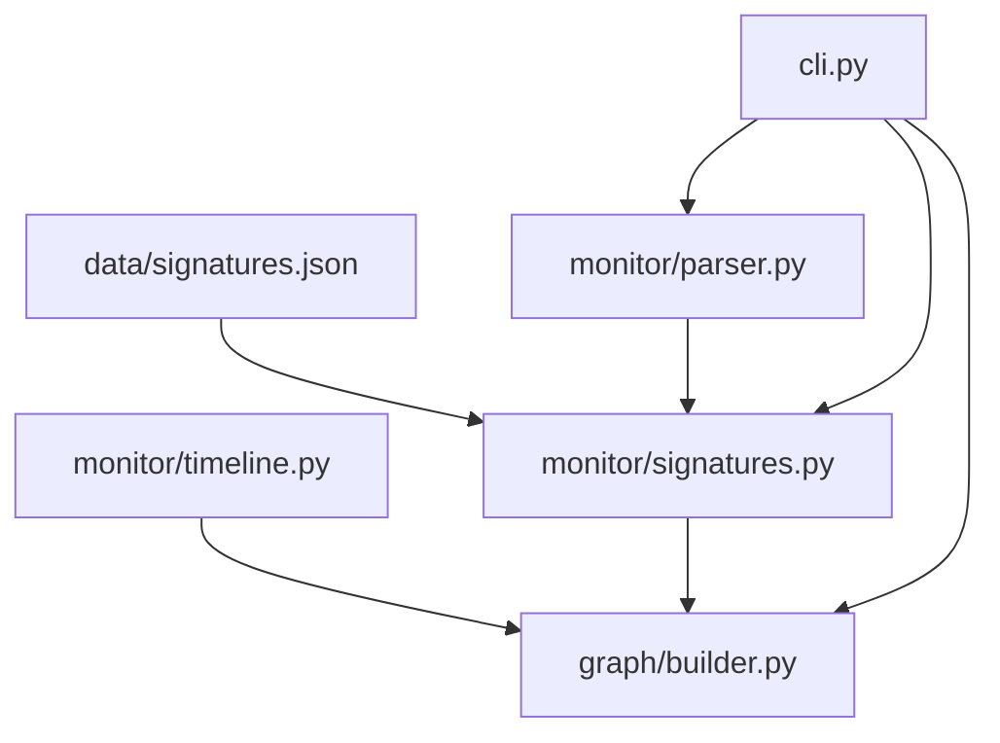
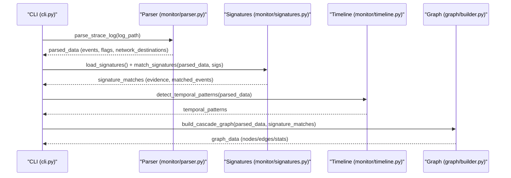
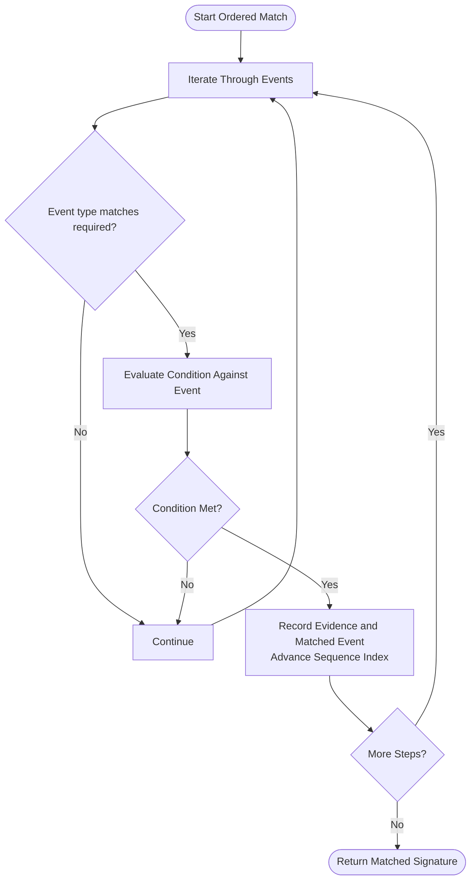
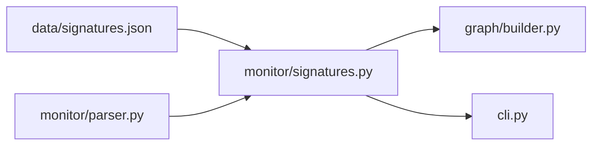

# Behavioral Signatures

<cite>
**Referenced Files in This Document**
- [data/signatures.json](file://data/signatures.json)
- [monitor/signatures.py](file://monitor/signatures.py)
- [monitor/parser.py](file://monitor/parser.py)
- [monitor/timeline.py](file://monitor/timeline.py)
- [README.md](file://README.md)
- [cli.py](file://cli.py)
- [graph/builder.py](file://graph/builder.py)
</cite>

## Table of Contents
1. [Introduction](#introduction)
2. [Project Structure](#project-structure)
3. [Core Components](#core-components)
4. [Architecture Overview](#architecture-overview)
5. [Detailed Component Analysis](#detailed-component-analysis)
6. [Dependency Analysis](#dependency-analysis)
7. [Performance Considerations](#performance-considerations)
8. [Troubleshooting Guide](#troubleshooting-guide)
9. [Conclusion](#conclusion)

## Introduction
This document explains TraceTree’s behavioral signature detection system that identifies suspicious behavior patterns across eight predefined signatures. It covers how the matching engine supports both unordered and ordered pattern matching, how syscall requirements, file pattern matching, and network destination analysis are validated, and how severity scoring and confidence boosts are computed. Practical examples from signatures.json illustrate how system call sequences trigger detections and how conditions like external connections, shell execution, and sensitive file access are evaluated.

## Project Structure
The behavioral signature system spans several modules:
- Signature definitions: data/signatures.json
- Matching engine: monitor/signatures.py
- Event parsing and classification: monitor/parser.py
- Temporal pattern analysis: monitor/timeline.py
- Graph construction: graph/builder.py
- CLI orchestration: cli.py
- High-level overview and capabilities: README.md

**Diagram sources**
- [data/signatures.json:1-246](file://data/signatures.json#L1-L246)
- [monitor/signatures.py:57-488](file://monitor/signatures.py#L57-L488)
- [monitor/parser.py:342-682](file://monitor/parser.py#L342-L682)
- [monitor/timeline.py:298-332](file://monitor/timeline.py#L298-L332)
- [graph/builder.py:8-196](file://graph/builder.py#L8-L196)
- [cli.py:196-304](file://cli.py#L196-L304)

**Section sources**
- [README.md:306-321](file://README.md#L306-L321)

## Core Components
- Signature definitions: Eight behavioral patterns with names, descriptions, severities, required syscalls, file patterns, network rules, optional ordered sequences, and confidence boosts.
- Matching engine: Loads signatures, parses strace events, and applies two matching modes:
  - Unordered: presence of required syscalls plus at least one file or network condition.
  - Ordered: a sequence of (syscall, condition) must appear in order (not necessarily consecutive).
- Parser: Extracts events, classifies network destinations, flags sensitive files, and assigns severity weights.
- Timeline: Detects time-based patterns from timestamped events.
- Graph: Builds a NetworkX graph enriched with signature tags and temporal edges.

**Section sources**
- [data/signatures.json:1-246](file://data/signatures.json#L1-L246)
- [monitor/signatures.py:57-488](file://monitor/signatures.py#L57-L488)
- [monitor/parser.py:342-682](file://monitor/parser.py#L342-L682)
- [monitor/timeline.py:298-332](file://monitor/timeline.py#L298-L332)
- [graph/builder.py:8-196](file://graph/builder.py#L8-L196)

## Architecture Overview
The signature detection pipeline integrates with the broader TraceTree analysis:

**Diagram sources**
- [cli.py:196-304](file://cli.py#L196-L304)
- [monitor/parser.py:342-682](file://monitor/parser.py#L342-L682)
- [monitor/signatures.py:57-488](file://monitor/signatures.py#L57-L488)
- [monitor/timeline.py:298-332](file://monitor/timeline.py#L298-L332)
- [graph/builder.py:8-196](file://graph/builder.py#L8-L196)

## Detailed Component Analysis

### Signature Definitions and Categories
The eight predefined signatures are defined in data/signatures.json and grouped into categories:
- Credential theft attempts: openat of sensitive files followed by external connect.
- Privilege escalation: mprotect with PROT_EXEC followed by non-standard execve.
- Persistence mechanisms: openat of crontab-related paths followed by write.
- Data exfiltration patterns: openat of secrets followed by connect to known paste/file-share hosts; crypto miner pattern with clone→clone→connect to mining ports; DNS tunneling with getaddrinfo + sendto + socket on port 53/5353; container escape via access to host-level paths; reverse shell chain connect→dup2→execve of shell.

Each signature includes:
- name: unique identifier
- description: human-readable summary
- severity: integer from 1 to 10
- syscalls: required syscall types
- files: file path patterns to match
- network: ports and known hosts to match
- sequence: ordered (syscall, condition) pairs or null for unordered
- confidence_boost: numeric boost applied to confidence

Practical examples from signatures.json:
- reverse_shell: connect → dup2 → execve of shell binary.
- credential_theft: openat of sensitive files → connect to external destination.
- typosquat_exfil: openat of .env/.npmrc/.aws/ssh → connect to paste/file-share hosts.
- process_injection: mprotect with PROT_EXEC → execve of non-standard binary.
- crypto_miner: clone → clone → connect to known mining ports.
- dns_tunneling: getaddrinfo + sendto + socket on port 53/5353.
- persistence_cron: openat of crontab paths → write.
- container_escape: openat of /proc/1/, /sys/fs/cgroup, /run/docker.sock.

**Section sources**
- [data/signatures.json:1-246](file://data/signatures.json#L1-L246)
- [README.md:45-71](file://README.md#L45-L71)

### Signature Matching Algorithm
The matching engine supports two modes:

- Unordered matching:
  - Validates that all required syscalls are present in the event stream.
  - If file patterns are specified, at least one event must match a file pattern.
  - If network rules are specified, at least one connect event must satisfy the network criteria.
  - Evidence lists the specific events that triggered the match.

- Ordered matching:
  - Validates that a sequence of (syscall, condition) appears in order across the event stream (not necessarily consecutive).
  - Each condition is evaluated against the event and network destination metadata:
    - external: connect to non-known-safe registry IP.
    - shell: execve of recognized shell binaries.
    - non_standard: execve of binary not in known benign set.
    - sensitive: openat of sensitive file patterns.
    - secret: openat of .env, .npmrc, .aws/credentials, .ssh/id_rsa.
    - cron_path: openat/write to crontab-related paths.
    - pool_port: connect to known mining pool ports (decimal or hex).
    - exfil_host: connect to known paste/file-share hosts or unknown external IPs.
    - PROT_EXEC: mprotect with PROT_EXEC flag.
    - null/None: always matches.

Evidence collection:
- For ordered matches, evidence includes a step-by-step description of each matched event and the condition met.
- For unordered matches, evidence includes the matched file/network events and the required syscalls observed.

Severity scoring:
- Severity is taken directly from the signature definition (1–10).
- Confidence boost is added to the final confidence calculation downstream in the pipeline.

**Section sources**
- [monitor/signatures.py:86-488](file://monitor/signatures.py#L86-L488)

### Syscall Requirement Checking
- Required syscalls are checked by verifying that each required type exists in the event set.
- For unordered matching, the presence of required syscalls is sufficient if no file/network rules are specified; otherwise, at least one file or network condition must also match.

**Section sources**
- [monitor/signatures.py:143-194](file://monitor/signatures.py#L143-L194)

### File Pattern Matching
- File patterns are matched against openat/read/write events by checking if any pattern substring is present in the target path.
- Evidence records the matched event and the pattern that matched.

**Section sources**
- [monitor/signatures.py:351-377](file://monitor/signatures.py#L351-L377)
- [monitor/parser.py:135-156](file://monitor/parser.py#L135-L156)

### Network Destination Analysis
- For unordered matching, if network rules are specified:
  - Ports: connect events whose port matches any configured port are considered.
  - Known hosts: connect events to known paste/file-share hosts are flagged.
  - Unknown external hosts: connect events to IPs not in known-safe prefixes are flagged.
- For ordered matching, conditions like external, exfil_host, and pool_port are evaluated using the event target and network destination details.

**Section sources**
- [monitor/signatures.py:384-448](file://monitor/signatures.py#L384-L448)
- [monitor/parser.py:246-318](file://monitor/parser.py#L246-L318)

### Sequence Matching Flow

**Diagram sources**
- [monitor/signatures.py:196-236](file://monitor/signatures.py#L196-L236)

### Condition Evaluation Details
- external: connect events where destination category is not a known-safe registry.
- shell: execve events targeting recognized shell binaries.
- non_standard: execve events targeting binaries not in known benign set.
- sensitive/secret: openat events matching sensitive or secret patterns.
- cron_path: openat/write events targeting crontab-related paths.
- pool_port: connect events with port matching known mining pool ports (supports decimal and hex).
- exfil_host: connect events to known paste/file-share hosts or unknown external IPs.
- PROT_EXEC: mprotect events with PROT_EXEC flag in details or target string.

**Section sources**
- [monitor/signatures.py:244-343](file://monitor/signatures.py#L244-L343)

### Severity Scoring and Confidence Boost
- Severity: taken from the signature definition (1–10).
- Confidence boost: added to the final confidence calculation downstream in the pipeline.
- Evidence: collected per matched signature to explain the triggering events.

**Section sources**
- [monitor/signatures.py:474-488](file://monitor/signatures.py#L474-L488)
- [data/signatures.json:1-246](file://data/signatures.json#L1-L246)

### Practical Examples from signatures.json
- reverse_shell: connect → dup2 → execve of shell; severity 10; confidence_boost 35.0.
- credential_theft: openat sensitive files → connect external; severity 9; confidence_boost 30.0.
- typosquat_exfil: openat secrets → connect to paste/file-share hosts; severity 9; confidence_boost 30.0.
- process_injection: mprotect PROT_EXEC → execve non-standard; severity 9; confidence_boost 30.0.
- crypto_miner: clone → clone → connect pool_port; severity 8; confidence_boost 25.0.
- dns_tunneling: getaddrinfo + sendto + socket on port 53/5353; severity 7; confidence_boost 20.0.
- persistence_cron: openat crontab path → write; severity 7; confidence_boost 20.0.
- container_escape: openat host-level paths; severity 10; confidence_boost 35.0.

**Section sources**
- [data/signatures.json:1-246](file://data/signatures.json#L1-L246)

## Dependency Analysis
The signature matching engine depends on:
- Parser-provided events and network destination classifications.
- Known benign and safe network prefixes/constants used for classification.
- Signature definitions loaded from data/signatures.json.

**Diagram sources**
- [data/signatures.json:1-246](file://data/signatures.json#L1-L246)
- [monitor/signatures.py:57-488](file://monitor/signatures.py#L57-L488)
- [monitor/parser.py:342-682](file://monitor/parser.py#L342-L682)
- [graph/builder.py:8-196](file://graph/builder.py#L8-L196)
- [cli.py:196-304](file://cli.py#L196-L304)

**Section sources**
- [monitor/signatures.py:25-51](file://monitor/signatures.py#L25-L51)
- [monitor/parser.py:84-122](file://monitor/parser.py#L84-L122)

## Performance Considerations
- Unordered matching: Early exit when required syscalls are missing; file/network checks short-circuit upon first match.
- Ordered matching: Single-pass linear scan with sequence index advancement; condition checks are lightweight string/lookup operations.
- Network classification: Uses prefix checks and known-safe sets for fast categorization.
- Evidence collection: Minimal overhead; only stores triggering events and descriptions.

[No sources needed since this section provides general guidance]

## Troubleshooting Guide
Common issues and resolutions:
- Signatures file not found or invalid JSON:
  - The loader logs a warning and returns an empty list; ensure data/signatures.json exists and is valid.
- Missing required syscalls:
  - Unordered matches require all specified syscalls; if absent, no match is produced.
- File or network conditions not met:
  - Unordered matches require at least one file or network condition; if none match, no match is produced.
- Ordered sequence not satisfied:
  - The sequence must appear in order; if any step fails the condition, the match fails.
- Network destination misclassification:
  - External vs. known-safe depends on known prefixes; ensure parser ran with strace -t for timestamps and that network destinations are present.

**Section sources**
- [monitor/signatures.py:57-83](file://monitor/signatures.py#L57-L83)
- [monitor/signatures.py:143-194](file://monitor/signatures.py#L143-L194)
- [monitor/signatures.py:196-236](file://monitor/signatures.py#L196-L236)
- [monitor/parser.py:246-318](file://monitor/parser.py#L246-L318)

## Conclusion
TraceTree’s behavioral signature detection system combines precise syscall requirement checking, file pattern matching, and network destination analysis to identify eight distinct threat categories. The matching engine supports both unordered and ordered pattern matching, collects actionable evidence, and integrates seamlessly with the broader analysis pipeline. The severity scoring and confidence boost mechanisms enable robust prioritization and downstream ML integration.