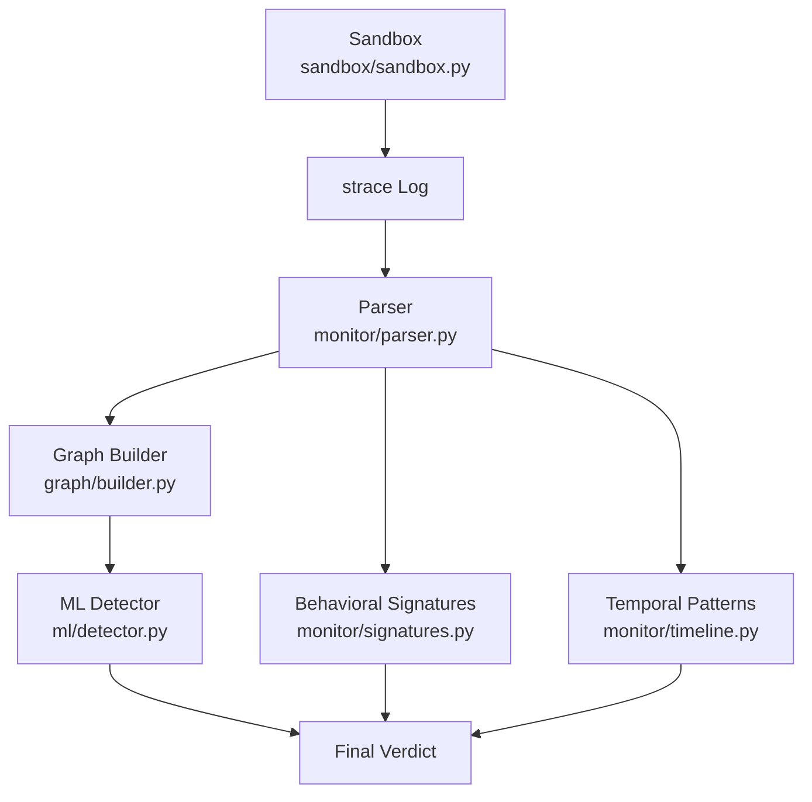
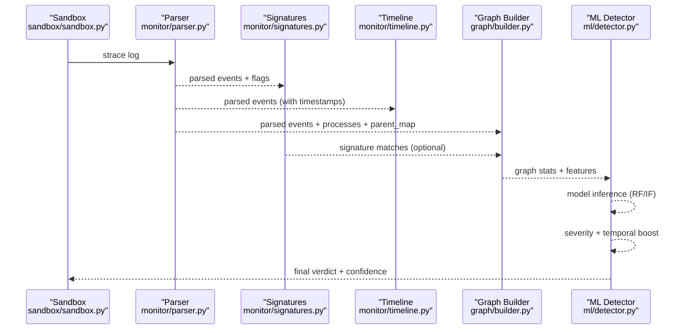
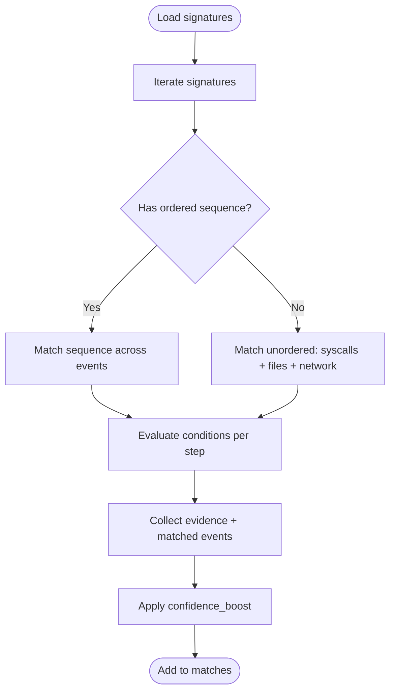
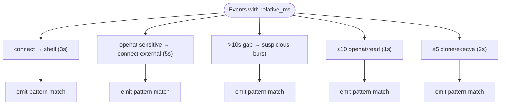
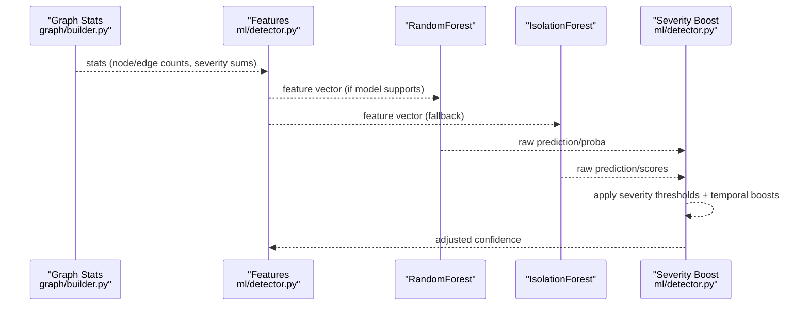
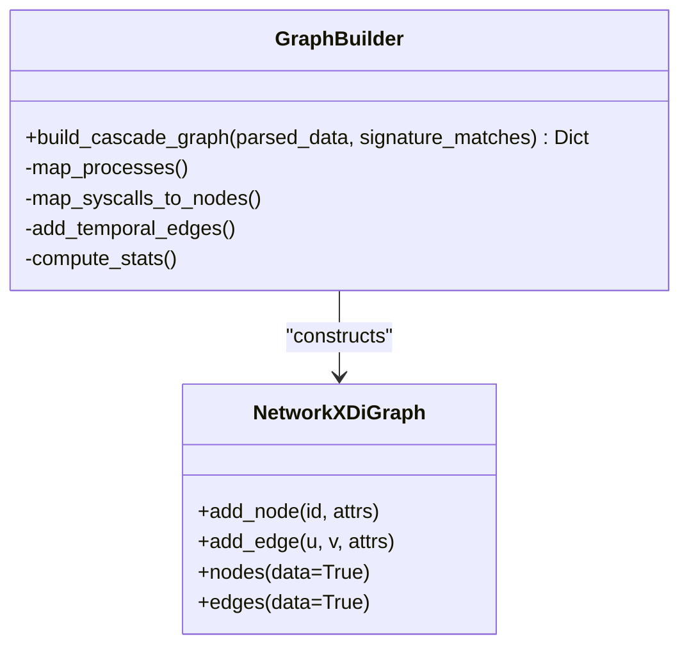
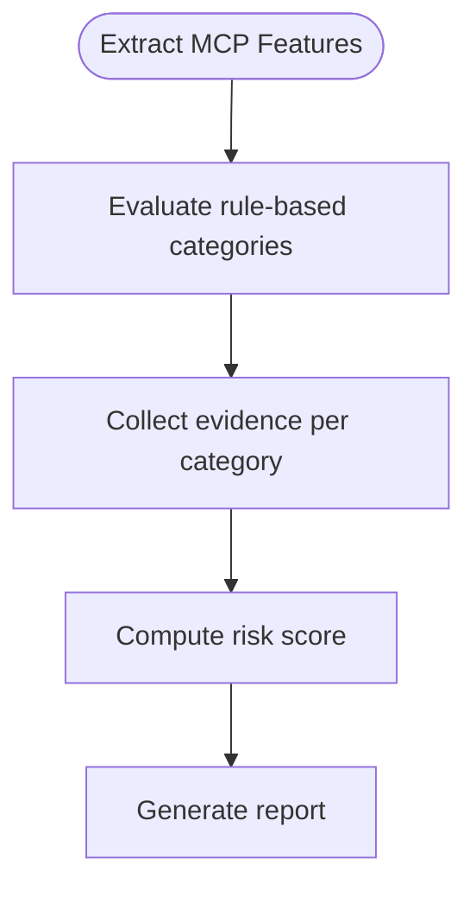
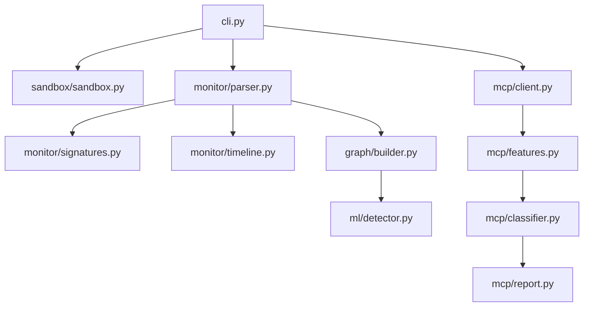

# Detection Systems

<cite>
**Referenced Files in This Document**
- [README.md](file://README.md)
- [cli.py](file://cli.py)
- [data/signatures.json](file://data/signatures.json)
- [monitor/parser.py](file://monitor/parser.py)
- [monitor/signatures.py](file://monitor/signatures.py)
- [monitor/timeline.py](file://monitor/timeline.py)
- [graph/builder.py](file://graph/builder.py)
- [ml/detector.py](file://ml/detector.py)
- [ml/trainer.py](file://ml/trainer.py)
- [sandbox/sandbox.py](file://sandbox/sandbox.py)
- [mcp/client.py](file://mcp/client.py)
- [mcp/features.py](file://mcp/features.py)
- [mcp/classifier.py](file://mcp/classifier.py)
- [mcp/report.py](file://mcp/report.py)
</cite>

## Table of Contents
1. [Introduction](#introduction)
2. [Project Structure](#project-structure)
3. [Core Components](#core-components)
4. [Architecture Overview](#architecture-overview)
5. [Detailed Component Analysis](#detailed-component-analysis)
6. [Dependency Analysis](#dependency-analysis)
7. [Performance Considerations](#performance-considerations)
8. [Troubleshooting Guide](#troubleshooting-guide)
9. [Conclusion](#conclusion)

## Introduction
This document explains TraceTree’s multi-layered detection systems that combine behavioral signature detection, temporal pattern recognition, machine learning anomaly detection, and graph-based analysis. It details:
- Eight behavioral signatures with severity levels and detection criteria
- Five temporal patterns derived from timestamped event streams
- Machine learning integration using Random Forest and Isolation Forest classifiers
- NetworkX graph construction from syscall traces with process, file, and network node modeling
- Severity scoring mechanisms, confidence calculations, and the relationship between detection layers

## Project Structure
TraceTree orchestrates a sandboxed runtime analysis pipeline:
- Sandbox execution with strace instrumentation
- Parser that converts strace logs into structured events with severity weights
- Behavioral signature matching against predefined patterns
- Temporal pattern detection from timestamped event streams
- NetworkX graph construction linking processes, files, and network destinations
- Machine learning anomaly detection using supervised and unsupervised models
- MCP-specific rule-based threat classification and reporting

**Diagram sources**
- [cli.py:182-262](file://cli.py#L182-L262)
- [sandbox/sandbox.py:177-344](file://sandbox/sandbox.py#L177-L344)
- [monitor/parser.py:342-681](file://monitor/parser.py#L342-L681)
- [monitor/signatures.py:57-115](file://monitor/signatures.py#L57-L115)
- [monitor/timeline.py:298-331](file://monitor/timeline.py#L298-L331)
- [graph/builder.py:8-195](file://graph/builder.py#L8-L195)
- [ml/detector.py:235-299](file://ml/detector.py#L235-L299)

**Section sources**
- [README.md:9-42](file://README.md#L9-L42)
- [cli.py:182-262](file://cli.py#L182-L262)

## Core Components
- Behavioral signatures: Defined in data/signatures.json and matched against parsed events using monitor/signatures.py. Each signature has a severity (1–10), required syscalls, file patterns, network rules, and optional ordered sequences.
- Temporal patterns: Detected from timestamped event streams using monitor/timeline.py. Patterns include credential theft sequences and delayed payload behaviors.
- Graph construction: Uses NetworkX to model processes, files, and network destinations; adds temporal edges between same-PID events within a fixed window.
- Machine learning: Extracts a 10-feature vector from graph and parsed data; uses RandomForestClassifier if available, otherwise an IsolationForest baseline; severity and temporal evidence boost confidence.
- MCP analysis: Rule-based classification of threats in MCP servers using mcp/classifier.py and mcp/features.py, with report generation via mcp/report.py.

**Section sources**
- [data/signatures.json:1-246](file://data/signatures.json#L1-L246)
- [monitor/signatures.py:57-115](file://monitor/signatures.py#L57-L115)
- [monitor/timeline.py:298-331](file://monitor/timeline.py#L298-L331)
- [graph/builder.py:8-195](file://graph/builder.py#L8-L195)
- [ml/detector.py:29-68](file://ml/detector.py#L29-L68)
- [mcp/classifier.py:20-96](file://mcp/classifier.py#L20-L96)
- [mcp/features.py:32-206](file://mcp/features.py#L32-L206)

## Architecture Overview
The detection pipeline integrates multiple layers:
- Input: strace logs from sandboxed execution
- Processing: parser, signature matcher, temporal analyzer, graph builder
- ML inference: feature extraction and anomaly detection
- Output: severity-weighted confidence, matched signatures, temporal patterns, and graph statistics

**Diagram sources**
- [cli.py:182-262](file://cli.py#L182-L262)
- [sandbox/sandbox.py:177-344](file://sandbox/sandbox.py#L177-L344)
- [monitor/parser.py:342-681](file://monitor/parser.py#L342-L681)
- [monitor/signatures.py:86-115](file://monitor/signatures.py#L86-L115)
- [monitor/timeline.py:298-331](file://monitor/timeline.py#L298-L331)
- [graph/builder.py:8-195](file://graph/builder.py#L8-L195)
- [ml/detector.py:235-299](file://ml/detector.py#L235-L299)

## Detailed Component Analysis

### Behavioral Signatures (Eight Patterns)
Each signature defines:
- name, description, severity (1–10)
- syscalls: required syscall types
- files: file path patterns to match
- network: ports and known hosts to flag
- sequence: ordered (syscall, condition) pairs to match across events
- confidence_boost: additive confidence boost when matched

Key patterns and criteria:
- crypto_miner: high process spawning + mining pool connection; severity 8
- reverse_shell: connect → dup2 → execve /bin/sh; severity 10
- credential_theft: sensitive file read → external network exfiltration; severity 9
- typosquat_exfil: secret read → upload to paste/file share site; severity 9
- process_injection: PROT_EXEC memory mapping → non-standard binary execution; severity 9
- dns_tunneling: excessive DNS queries + raw socket exfiltration; severity 7
- persistence_cron: writing to crontab or cron spool; severity 7
- container_escape: accessing host-level paths or mounts; severity 10

Conditions evaluated during matching:
- external: non-loopback, non-known-safe registry destination
- shell: execve of known shell binaries
- non_standard: execve of binary not in benign set
- sensitive/secret: file path matches sensitive/secret patterns
- cron_path: writes to crontab-related paths
- pool_port: connect to known mining pool ports
- exfil_host: connect to paste/file-share domains
- PROT_EXEC: mprotect with PROT_EXEC flag

**Diagram sources**
- [monitor/signatures.py:123-236](file://monitor/signatures.py#L123-L236)
- [monitor/signatures.py:244-343](file://monitor/signatures.py#L244-L343)
- [monitor/signatures.py:351-448](file://monitor/signatures.py#L351-L448)
- [data/signatures.json:1-246](file://data/signatures.json#L1-L246)

**Section sources**
- [data/signatures.json:1-246](file://data/signatures.json#L1-L246)
- [monitor/signatures.py:86-115](file://monitor/signatures.py#L86-L115)
- [monitor/signatures.py:196-236](file://monitor/signatures.py#L196-L236)
- [monitor/signatures.py:244-343](file://monitor/signatures.py#L244-L343)
- [monitor/signatures.py:384-448](file://monitor/signatures.py#L384-L448)

### Temporal Pattern Recognition (Five Patterns)
Patterns detected from timestamped event streams (requires strace -t):
- connect_then_shell: external connect → execve /bin/sh within 3 seconds; severity 10
- credential_scan_then_exfil: sensitive file read → external connect within 5 seconds; severity 9
- delayed_payload: >10s gap followed by burst of suspicious activity; severity 8
- rapid_file_enumeration: 10+ openat/read within 1 second; severity 7
- burst_process_spawn: 5+ clone/execve within 2 seconds; severity 7

**Diagram sources**
- [monitor/timeline.py:100-131](file://monitor/timeline.py#L100-L131)
- [monitor/timeline.py:134-169](file://monitor/timeline.py#L134-L169)
- [monitor/timeline.py:172-206](file://monitor/timeline.py#L172-L206)
- [monitor/timeline.py:209-250](file://monitor/timeline.py#L209-L250)
- [monitor/timeline.py:253-281](file://monitor/timeline.py#L253-L281)

**Section sources**
- [monitor/timeline.py:298-331](file://monitor/timeline.py#L298-L331)
- [monitor/timeline.py:100-281](file://monitor/timeline.py#L100-L281)

### Machine Learning Integration (Random Forest and Isolation Forest)
Feature extraction:
- 10 features: node_count, edge_count, network_conn_count, file_read_count, execve_count, total_severity, suspicious_network_count, sensitive_file_count, max_severity, temporal_pattern_count

Model selection and inference:
- RandomForestClassifier if available locally or downloadable from GCS
- IsolationForest fallback trained on hardcoded clean baselines
- Confidence adjusted by severity thresholds and temporal evidence

Severity-boost mechanism:
- Critical threshold: total_severity ≥ 30 → override to malicious, conf ~95%
- High threshold: total_severity ≥ 15 → boost confidence by +30%
- Medium threshold: total_severity ≥ 5 → boost confidence by +10%
- Each temporal pattern adds +15% confidence
- Each sensitive file or suspicious network access adds +5% confidence

**Diagram sources**
- [graph/builder.py:169-188](file://graph/builder.py#L169-L188)
- [ml/detector.py:29-68](file://ml/detector.py#L29-L68)
- [ml/detector.py:108-146](file://ml/detector.py#L108-L146)
- [ml/detector.py:180-232](file://ml/detector.py#L180-L232)
- [ml/detector.py:235-299](file://ml/detector.py#L235-L299)

**Section sources**
- [ml/detector.py:29-68](file://ml/detector.py#L29-L68)
- [ml/detector.py:108-146](file://ml/detector.py#L108-L146)
- [ml/detector.py:180-232](file://ml/detector.py#L180-L232)
- [ml/detector.py:235-299](file://ml/detector.py#L235-L299)
- [ml/trainer.py:15-83](file://ml/trainer.py#L15-L83)

### NetworkX Graph Construction from Syscall Traces
Nodes and edges:
- Processes: nodes per PID with label and severity
- Files: nodes for openat targets; sensitive files get higher severity
- Networks: nodes for connect/sendto/socket targets; severity from destination classification
- Edges: syscall relationships; temporal edges between same-PID events within a 5-second window

Graph statistics:
- node_count, edge_count, network_conn_count, file_read_count, total_severity, max_severity, suspicious_network_count, sensitive_file_count, signature_match_count, temporal_edge_count

**Diagram sources**
- [graph/builder.py:8-195](file://graph/builder.py#L8-L195)

**Section sources**
- [graph/builder.py:8-195](file://graph/builder.py#L8-L195)

### MCP-Specific Threat Classification
Rule-based categories:
- COMMAND_INJECTION: shell spawned under adversarial input
- CREDENTIAL_EXFILTRATION: secret read followed by network connection
- COVERT_NETWORK_CALL: unexpected outbound connection during tool call
- PATH_TRAVERSAL: reads outside working directory, especially sensitive paths
- EXCESSIVE_PROCESS_SPAWNING: disproportionate child processes
- PROMPT_INJECTION_VECTOR: zero-width chars or injection language in tool descriptions

Risk scoring:
- Aggregates threat severities and counts to compute overall risk (low/medium/high/critical)

**Diagram sources**
- [mcp/classifier.py:20-96](file://mcp/classifier.py#L20-L96)
- [mcp/classifier.py:129-236](file://mcp/classifier.py#L129-L236)
- [mcp/classifier.py:239-268](file://mcp/classifier.py#L239-L268)
- [mcp/features.py:32-206](file://mcp/features.py#L32-L206)
- [mcp/client.py:18-73](file://mcp/client.py#L18-L73)
- [mcp/report.py:27-73](file://mcp/report.py#L27-L73)

**Section sources**
- [mcp/classifier.py:20-96](file://mcp/classifier.py#L20-L96)
- [mcp/classifier.py:129-236](file://mcp/classifier.py#L129-L236)
- [mcp/classifier.py:239-268](file://mcp/classifier.py#L239-L268)
- [mcp/features.py:32-206](file://mcp/features.py#L32-L206)
- [mcp/client.py:18-73](file://mcp/client.py#L18-L73)
- [mcp/report.py:27-73](file://mcp/report.py#L27-L73)

## Dependency Analysis
Inter-module dependencies and control flow:

**Diagram sources**
- [cli.py:182-262](file://cli.py#L182-L262)
- [sandbox/sandbox.py:177-344](file://sandbox/sandbox.py#L177-L344)
- [monitor/parser.py:342-681](file://monitor/parser.py#L342-L681)
- [monitor/signatures.py:86-115](file://monitor/signatures.py#L86-L115)
- [monitor/timeline.py:298-331](file://monitor/timeline.py#L298-L331)
- [graph/builder.py:8-195](file://graph/builder.py#L8-L195)
- [ml/detector.py:235-299](file://ml/detector.py#L235-L299)
- [mcp/client.py:18-73](file://mcp/client.py#L18-L73)
- [mcp/features.py:32-206](file://mcp/features.py#L32-L206)
- [mcp/classifier.py:20-96](file://mcp/classifier.py#L20-L96)
- [mcp/report.py:27-73](file://mcp/report.py#L27-L73)

**Section sources**
- [cli.py:182-262](file://cli.py#L182-L262)

## Performance Considerations
- Feature dimensionality: The 10-feature vector balances expressiveness with computational cost; backward compatibility ensures older models can still be used by truncating features.
- Temporal windows: Fixed windows (e.g., 5s) bound sliding-window scans; thresholds (e.g., ≥10 openat within 1s) reduce false positives by requiring bursts.
- Model caching: In-memory model cache avoids repeated I/O; GCS sync enables remote updates.
- Parser robustness: Multi-line strace reassembly and timestamp parsing handle varied strace outputs; benign-path filtering reduces noise.

[No sources needed since this section provides general guidance]

## Troubleshooting Guide
Common issues and remedies:
- Missing signatures file: The loader logs a warning and returns empty; ensure data/signatures.json exists.
- Signature matching failures: Matching is best-effort; parser exceptions are caught and logged; verify strace content and event parsing.
- Temporal analysis disabled: Requires strace -t; if timestamps absent, temporal patterns are skipped.
- ML model loading: Falls back to IsolationForest baseline if local model is missing or GCS download fails; use cascade-update to refresh the model.
- Sandbox timeouts: DMG/EXE runs have stricter limits; ensure dependencies (wine64, 7z) are available in the sandbox image.
- MCP client connectivity: HTTP stdio mode may require explicit transport configuration; verify server readiness and port binding.

**Section sources**
- [monitor/signatures.py:74-83](file://monitor/signatures.py#L74-L83)
- [cli.py:222-238](file://cli.py#L222-L238)
- [ml/detector.py:108-146](file://ml/detector.py#L108-L146)
- [ml/detector.py:149-163](file://ml/detector.py#L149-L163)
- [sandbox/sandbox.py:268-277](file://sandbox/sandbox.py#L268-L277)
- [mcp/client.py:78-95](file://mcp/client.py#L78-L95)

## Conclusion
TraceTree’s detection systems integrate rule-based behavioral signatures, temporal pattern analysis, and graph-based machine learning to provide layered insights into potentially malicious behavior. Severity-weighted scoring and temporal evidence serve as strong boosters for anomaly detection confidence. The MCP-specific module extends the pipeline with rule-based threat classification and risk scoring, enabling comprehensive security analysis across diverse server types and attack vectors.