# Graph-Based Analysis

<cite>
**Referenced Files in This Document**
- [builder.py](file://TraceTree/graph/builder.py)
- [parser.py](file://TraceTree/monitor/parser.py)
- [signatures.py](file://TraceTree/monitor/signatures.py)
- [timeline.py](file://TraceTree/monitor/timeline.py)
- [detector.py](file://TraceTree/ml/detector.py)
- [trainer.py](file://TraceTree/ml/trainer.py)
- [features.py](file://TraceTree/mcp/features.py)
- [client.py](file://TraceTree/mcp/client.py)
- [sandbox.py](file://TraceTree/sandbox/sandbox.py)
- [main.py](file://TraceTree/api/main.py)
- [cli.py](file://TraceTree/cli.py)
- [signatures.json](file://TraceTree/data/signatures.json)
</cite>

## Table of Contents
1. [Introduction](#introduction)
2. [Project Structure](#project-structure)
3. [Core Components](#core-components)
4. [Architecture Overview](#architecture-overview)
5. [Detailed Component Analysis](#detailed-component-analysis)
6. [Dependency Analysis](#dependency-analysis)
7. [Performance Considerations](#performance-considerations)
8. [Troubleshooting Guide](#troubleshooting-guide)
9. [Conclusion](#conclusion)
10. [Appendices](#appendices)

## Introduction
This document explains TraceTree’s graph-based analysis system that constructs NetworkX graphs from syscall traces and detects behavioral anomalies. It focuses on:
- How the graph builder creates nodes for processes, files, and network connections with temporal edge weighting and signature propagation
- How the graph captures process lineage, file access dependencies, and network communication patterns
- How traversal and aggregation algorithms support signature detection, anomaly scoring, and temporal pattern recognition
- How graph features integrate with machine learning models to improve detection performance and interpretability

## Project Structure
The graph analysis pipeline spans several modules:
- Sandbox execution and syscall capture
- Event parsing and classification
- Behavioral signature matching
- Temporal pattern detection
- Graph construction and statistics
- Machine learning anomaly detection and model orchestration
- MCP-specific feature extraction and classification
- API and CLI entrypoints

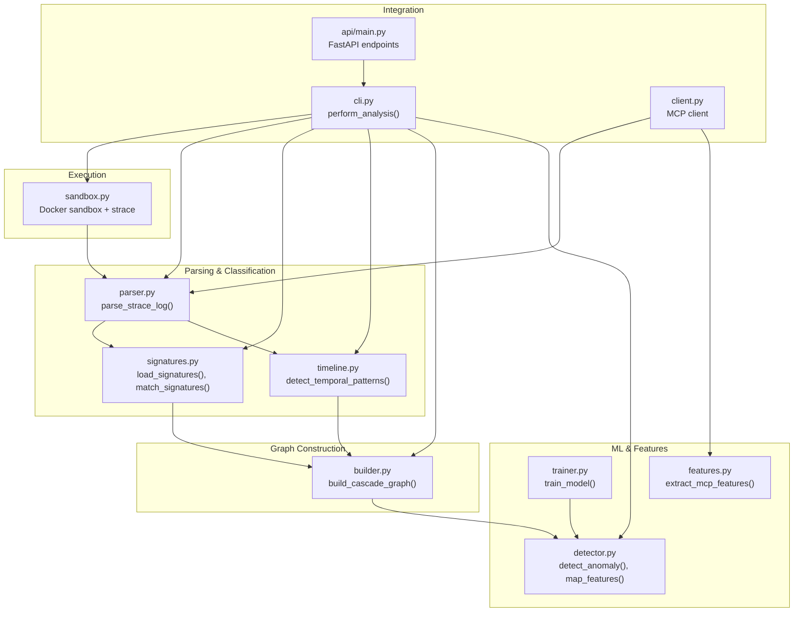

**Diagram sources**
- [sandbox.py:175-335](file://TraceTree/sandbox/sandbox.py#L175-L335)
- [parser.py:340-679](file://TraceTree/monitor/parser.py#L340-L679)
- [signatures.py:57-115](file://TraceTree/monitor/signatures.py#L57-L115)
- [timeline.py:298-331](file://TraceTree/monitor/timeline.py#L298-L331)
- [builder.py:8-195](file://TraceTree/graph/builder.py#L8-L195)
- [detector.py:29-299](file://TraceTree/ml/detector.py#L29-L299)
- [trainer.py:15-99](file://TraceTree/ml/trainer.py#L15-L99)
- [features.py:32-206](file://TraceTree/mcp/features.py#L32-L206)
- [cli.py:181-259](file://TraceTree/cli.py#L181-L259)
- [api/main.py:78-128](file://TraceTree/api/main.py#L78-L128)
- [client.py:18-195](file://TraceTree/mcp/client.py#L18-L195)

**Section sources**
- [cli.py:181-259](file://TraceTree/cli.py#L181-L259)
- [sandbox.py:175-335](file://TraceTree/sandbox/sandbox.py#L175-L335)
- [parser.py:340-679](file://TraceTree/monitor/parser.py#L340-L679)
- [signatures.py:57-115](file://TraceTree/monitor/signatures.py#L57-L115)
- [timeline.py:298-331](file://TraceTree/monitor/timeline.py#L298-L331)
- [builder.py:8-195](file://TraceTree/graph/builder.py#L8-L195)
- [detector.py:29-299](file://TraceTree/ml/detector.py#L29-L299)
- [trainer.py:15-99](file://TraceTree/ml/trainer.py#L15-L99)
- [features.py:32-206](file://TraceTree/mcp/features.py#L32-L206)
- [api/main.py:78-128](file://TraceTree/api/main.py#L78-L128)
- [client.py:18-195](file://TraceTree/mcp/client.py#L18-L195)

## Core Components
- Sandbox execution: Runs the target in a controlled environment and captures syscalls with strace.
- Parser: Reassembles multi-line strace entries, classifies destinations, flags suspicious events, and computes severity scores.
- Signature matcher: Loads behavioral patterns and matches them against parsed events.
- Temporal analyzer: Detects time-based patterns such as credential theft, rapid enumeration, and reverse shells.
- Graph builder: Creates a NetworkX directed graph with process, file, and network nodes; attaches severity and signature tags; adds temporal edges.
- ML detector: Aggregates graph and parsed features into a numeric vector and applies a supervised or fallback model with severity boosting.
- Trainer: Trains a Random Forest model on sandboxed packages and syncs it to cloud storage.
- MCP features: Extracts tool-call-centric features from MCP server traces for rule-based classification.
- CLI/API: Orchestrates the pipeline and exposes endpoints for analysis and graph visualization.

**Section sources**
- [sandbox.py:175-335](file://TraceTree/sandbox/sandbox.py#L175-L335)
- [parser.py:340-679](file://TraceTree/monitor/parser.py#L340-L679)
- [signatures.py:57-115](file://TraceTree/monitor/signatures.py#L57-L115)
- [timeline.py:298-331](file://TraceTree/monitor/timeline.py#L298-L331)
- [builder.py:8-195](file://TraceTree/graph/builder.py#L8-L195)
- [detector.py:29-299](file://TraceTree/ml/detector.py#L29-L299)
- [trainer.py:15-99](file://TraceTree/ml/trainer.py#L15-L99)
- [features.py:32-206](file://TraceTree/mcp/features.py#L32-L206)
- [cli.py:181-259](file://TraceTree/cli.py#L181-L259)
- [api/main.py:78-128](file://TraceTree/api/main.py#L78-L128)

## Architecture Overview
The system follows a staged pipeline:
1. Sandbox execution produces a strace log.
2. Parser converts logs into structured events with severity and classification.
3. Signature matcher enriches events with behavioral tags.
4. Temporal analyzer detects time-based patterns.
5. Graph builder constructs a NetworkX graph with nodes and weighted edges.
6. ML detector consumes graph and parsed features to produce anomaly verdicts.
7. CLI and API expose results and graph visualizations.

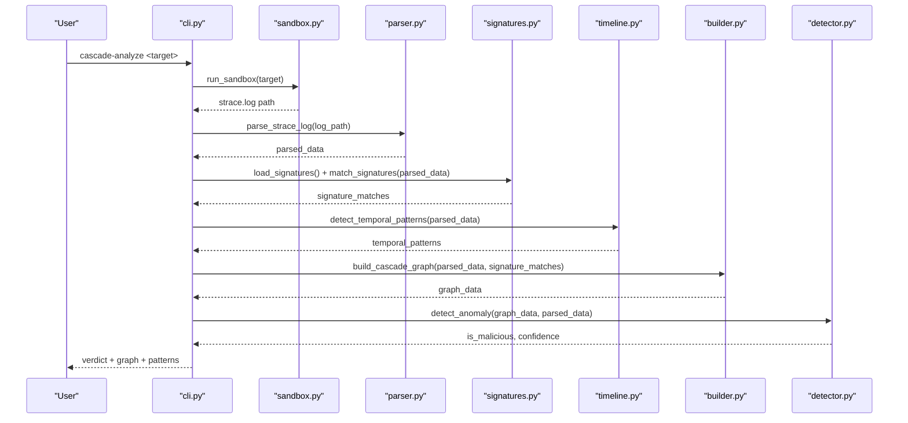

**Diagram sources**
- [cli.py:181-259](file://TraceTree/cli.py#L181-L259)
- [sandbox.py:175-335](file://TraceTree/sandbox/sandbox.py#L175-L335)
- [parser.py:340-679](file://TraceTree/monitor/parser.py#L340-L679)
- [signatures.py:86-115](file://TraceTree/monitor/signatures.py#L86-L115)
- [timeline.py:298-331](file://TraceTree/monitor/timeline.py#L298-L331)
- [builder.py:8-195](file://TraceTree/graph/builder.py#L8-L195)
- [detector.py:235-299](file://TraceTree/ml/detector.py#L235-L299)

## Detailed Component Analysis

### Graph Builder: Node Creation, Temporal Edges, and Signature Propagation
The graph builder constructs a NetworkX directed graph from parsed syscall events:
- Node types: process, network, file, and syscall-specific auxiliary nodes
- Severity weights propagate from events to nodes and edges
- Signature tags propagate from matched events to nodes and edges
- Temporal edges connect consecutive events from the same PID within a fixed time window

Key behaviors:
- Process nodes are created from parsed processes and linked via fork/clone lineage
- Network nodes are created for connect/sendto/socket events with destination categories and risk scores
- File nodes are created for openat/read/write/unlink with sensitivity flags
- Auxiliary nodes encode syscall semantics (e.g., execve, dup2, mmap)
- Temporal edges are added between events sorted by sequence_id within the time window

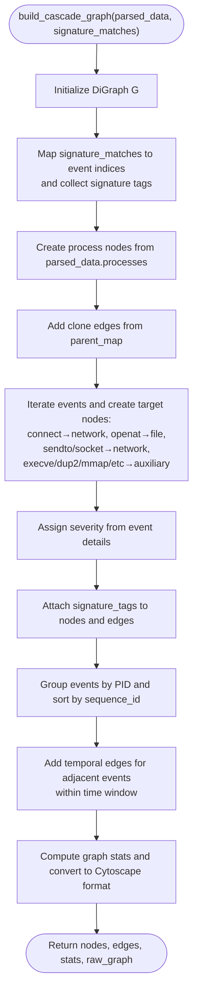

**Diagram sources**
- [builder.py:8-195](file://TraceTree/graph/builder.py#L8-L195)

**Section sources**
- [builder.py:8-195](file://TraceTree/graph/builder.py#L8-L195)

### Parser: Severity Classification and Destination Intelligence
The parser reassembles multi-line strace entries and classifies destinations and file paths:
- Severity weights are assigned per syscall type
- Destinations are categorized as safe registry, known benign, suspicious, or unknown with risk scores
- Sensitive file patterns trigger elevated severity
- Chains like clone→execve→openat sensitive file are flagged as credential theft

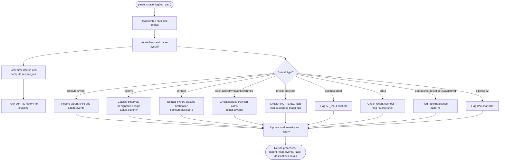

**Diagram sources**
- [parser.py:340-679](file://TraceTree/monitor/parser.py#L340-L679)

**Section sources**
- [parser.py:340-679](file://TraceTree/monitor/parser.py#L340-L679)

### Signature Matching Engine
The signature engine loads behavioral patterns and matches them against parsed events:
- Supports unordered and ordered (sequence) matching
- Conditions include external connections, shell binaries, sensitive files, protocol ports, and memory protections
- Evidence and matched events are collected for each signature

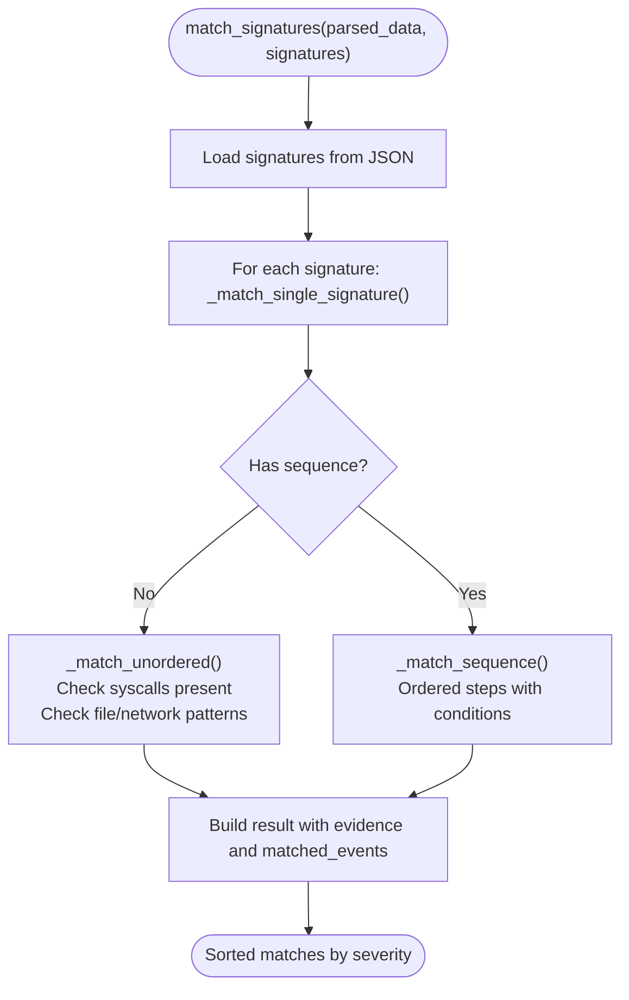

**Diagram sources**
- [signatures.py:86-115](file://TraceTree/monitor/signatures.py#L86-L115)
- [signatures.py:123-236](file://TraceTree/monitor/signatures.py#L123-L236)
- [signatures.py:244-343](file://TraceTree/monitor/signatures.py#L244-L343)
- [signatures.json:1-246](file://TraceTree/data/signatures.json#L1-L246)

**Section sources**
- [signatures.py:86-115](file://TraceTree/monitor/signatures.py#L86-L115)
- [signatures.py:123-236](file://TraceTree/monitor/signatures.py#L123-L236)
- [signatures.py:244-343](file://TraceTree/monitor/signatures.py#L244-L343)
- [signatures.json:1-246](file://TraceTree/data/signatures.json#L1-L246)

### Temporal Pattern Detection
The temporal analyzer detects time-based behavioral patterns:
- Credential theft: sensitive file read followed by external connection within a window
- Rapid file enumeration: many openat/read within a short time
- Burst process spawn: multiple forks/clones/execve within a short time
- Delayed payload: long gap then suspicious burst
- Connect-then-shell: external connect followed by shell exec within a window

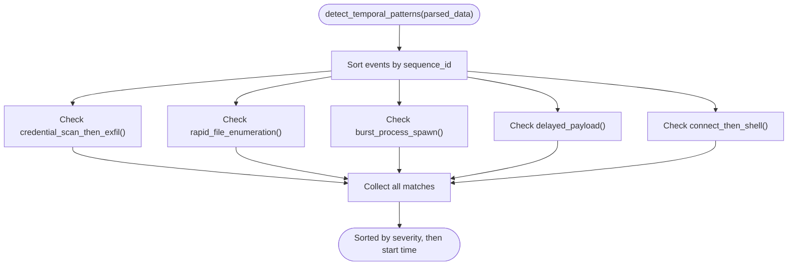

**Diagram sources**
- [timeline.py:298-331](file://TraceTree/monitor/timeline.py#L298-L331)
- [timeline.py:100-131](file://TraceTree/monitor/timeline.py#L100-L131)
- [timeline.py:134-169](file://TraceTree/monitor/timeline.py#L134-L169)
- [timeline.py:172-206](file://TraceTree/monitor/timeline.py#L172-L206)
- [timeline.py:209-250](file://TraceTree/monitor/timeline.py#L209-L250)
- [timeline.py:253-281](file://TraceTree/monitor/timeline.py#L253-L281)

**Section sources**
- [timeline.py:298-331](file://TraceTree/monitor/timeline.py#L298-L331)
- [timeline.py:100-131](file://TraceTree/monitor/timeline.py#L100-L131)
- [timeline.py:134-169](file://TraceTree/monitor/timeline.py#L134-L169)
- [timeline.py:172-206](file://TraceTree/monitor/timeline.py#L172-L206)
- [timeline.py:209-250](file://TraceTree/monitor/timeline.py#L209-L250)
- [timeline.py:253-281](file://TraceTree/monitor/timeline.py#L253-L281)

### Machine Learning Detector and Feature Extraction
The ML detector:
- Converts graph and parsed data into a numeric feature vector
- Applies a supervised Random Forest or fallback Isolation Forest
- Boosts confidence using severity thresholds and temporal pattern counts

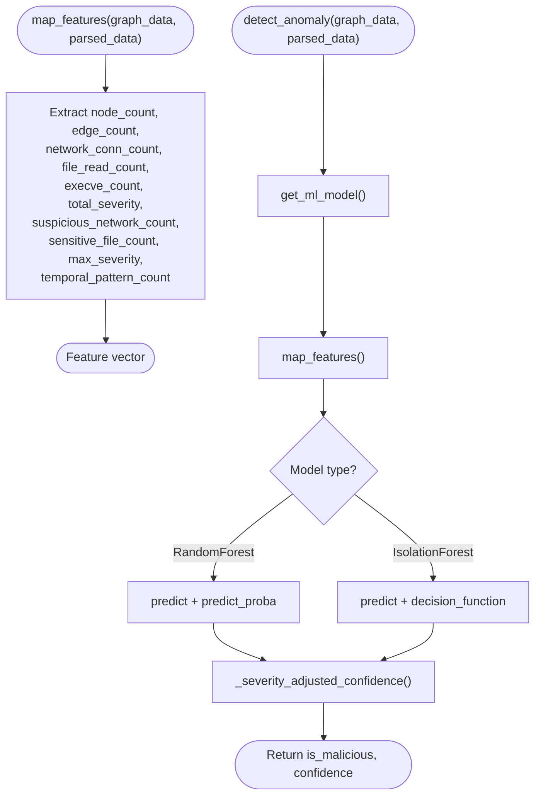

**Diagram sources**
- [detector.py:29-68](file://TraceTree/ml/detector.py#L29-L68)
- [detector.py:108-146](file://TraceTree/ml/detector.py#L108-L146)
- [detector.py:180-232](file://TraceTree/ml/detector.py#L180-L232)
- [detector.py:235-299](file://TraceTree/ml/detector.py#L235-L299)

**Section sources**
- [detector.py:29-68](file://TraceTree/ml/detector.py#L29-L68)
- [detector.py:108-146](file://TraceTree/ml/detector.py#L108-L146)
- [detector.py:180-232](file://TraceTree/ml/detector.py#L180-L232)
- [detector.py:235-299](file://TraceTree/ml/detector.py#L235-L299)

### MCP-Specific Features and Classification
The MCP analyzer:
- Parses strace logs with MCP-specific parsing
- Extracts features grouped by tool-call activity
- Compares observed behavior to known server baselines
- Classifies threats and computes risk scores

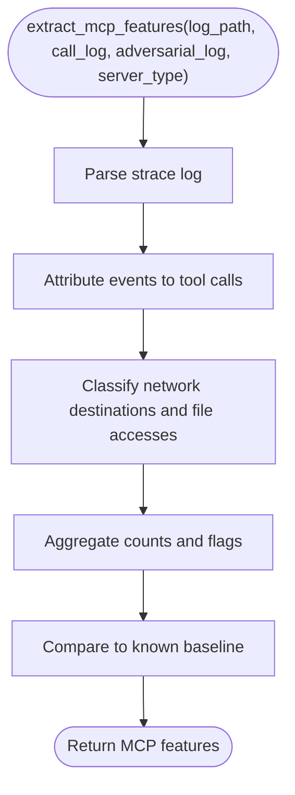

**Diagram sources**
- [features.py:32-206](file://TraceTree/mcp/features.py#L32-L206)
- [features.py:209-238](file://TraceTree/mcp/features.py#L209-L238)
- [features.py:429-472](file://TraceTree/mcp/features.py#L429-L472)

**Section sources**
- [features.py:32-206](file://TraceTree/mcp/features.py#L32-L206)
- [features.py:209-238](file://TraceTree/mcp/features.py#L209-L238)
- [features.py:429-472](file://TraceTree/mcp/features.py#L429-L472)

### Sandbox Execution and Pipeline Orchestration
The sandbox executes the target in a controlled environment and captures syscalls:
- Pipelines support pip, npm, DMG, and EXE targets
- strace is configured to capture full process trees with timestamps
- Wine noise filtering is applied for EXE analysis

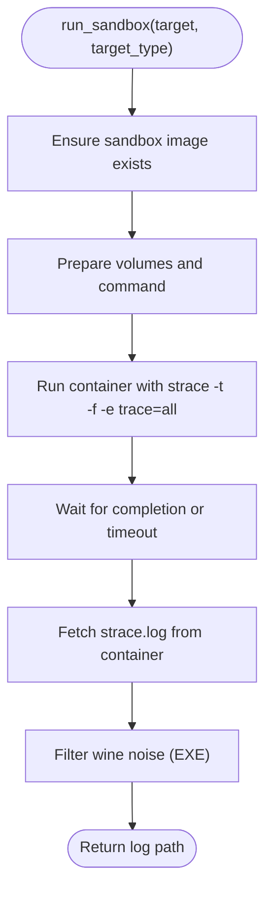

**Diagram sources**
- [sandbox.py:175-335](file://TraceTree/sandbox/sandbox.py#L175-L335)
- [sandbox.py:338-375](file://TraceTree/sandbox/sandbox.py#L338-L375)

**Section sources**
- [sandbox.py:175-335](file://TraceTree/sandbox/sandbox.py#L175-L335)
- [sandbox.py:338-375](file://TraceTree/sandbox/sandbox.py#L338-L375)

### API and CLI Integration
The CLI orchestrates the full pipeline and renders results, including:
- Cascade graph visualization
- Flagged behaviors and matched signatures
- Temporal patterns
- Final verdict and confidence

The API provides endpoints for asynchronous analysis and graph visualization.

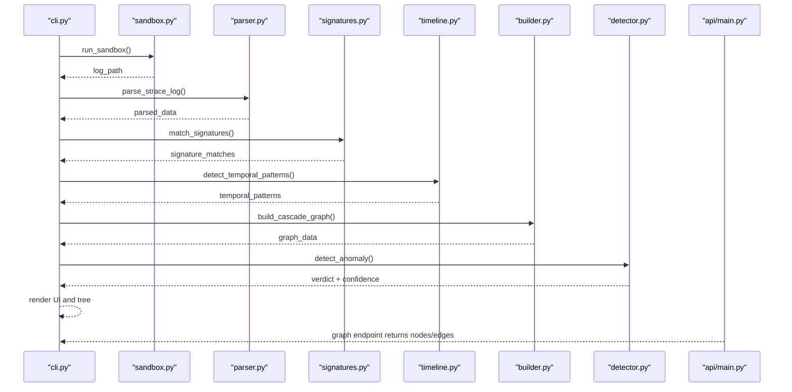

**Diagram sources**
- [cli.py:181-259](file://TraceTree/cli.py#L181-L259)
- [api/main.py:78-128](file://TraceTree/api/main.py#L78-L128)

**Section sources**
- [cli.py:181-259](file://TraceTree/cli.py#L181-L259)
- [api/main.py:78-128](file://TraceTree/api/main.py#L78-L128)

## Dependency Analysis
The graph builder depends on:
- Parsed events and parent_map from the parser
- Signature matches to propagate tags
- Timestamps to create temporal edges

The ML detector depends on:
- Graph stats and parsed stats (including temporal pattern counts)
- A trained model (Random Forest or Isolation Forest)

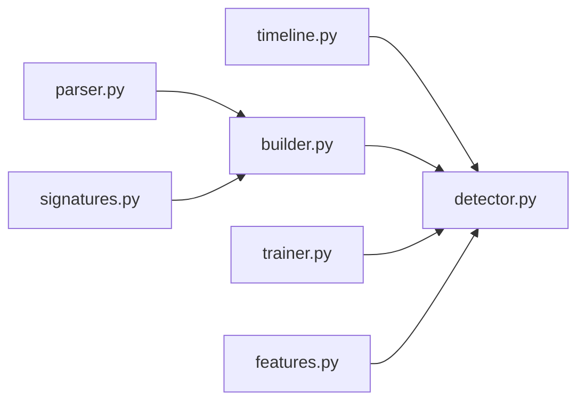

**Diagram sources**
- [builder.py:8-195](file://TraceTree/graph/builder.py#L8-L195)
- [parser.py:340-679](file://TraceTree/monitor/parser.py#L340-L679)
- [signatures.py:86-115](file://TraceTree/monitor/signatures.py#L86-L115)
- [timeline.py:298-331](file://TraceTree/monitor/timeline.py#L298-L331)
- [detector.py:235-299](file://TraceTree/ml/detector.py#L235-L299)
- [trainer.py:15-99](file://TraceTree/ml/trainer.py#L15-L99)
- [features.py:32-206](file://TraceTree/mcp/features.py#L32-L206)

**Section sources**
- [builder.py:8-195](file://TraceTree/graph/builder.py#L8-L195)
- [parser.py:340-679](file://TraceTree/monitor/parser.py#L340-L679)
- [signatures.py:86-115](file://TraceTree/monitor/signatures.py#L86-L115)
- [timeline.py:298-331](file://TraceTree/monitor/timeline.py#L298-L331)
- [detector.py:235-299](file://TraceTree/ml/detector.py#L235-L299)
- [trainer.py:15-99](file://TraceTree/ml/trainer.py#L15-L99)
- [features.py:32-206](file://TraceTree/mcp/features.py#L32-L206)

## Performance Considerations
- Graph construction scales with the number of events and nodes; grouping by PID and sorting by sequence_id ensures efficient temporal edge creation.
- Signature matching and temporal pattern detection iterate over events; keeping event lists sorted reduces redundant checks.
- ML inference uses a compact feature vector; caching models avoids repeated I/O.
- Docker sandbox timeouts prevent hangs; wine noise filtering reduces irrelevant syscall volume for EXE targets.

[No sources needed since this section provides general guidance]

## Troubleshooting Guide
Common issues and resolutions:
- Docker not installed or not running: The CLI checks Docker and exits with guidance.
- Sandbox fails to produce a log: The pipeline validates log size and content; empty or error messages indicate issues with the target or environment.
- Model loading failures: The detector falls back to an Isolation Forest baseline and attempts to download a model from cloud storage.
- Signature matching or temporal analysis exceptions: The CLI continues with partial results and logs warnings.

**Section sources**
- [cli.py:73-109](file://TraceTree/cli.py#L73-L109)
- [sandbox.py:310-335](file://TraceTree/sandbox/sandbox.py#L310-L335)
- [detector.py:108-146](file://TraceTree/ml/detector.py#L108-L146)
- [cli.py:218-235](file://TraceTree/cli.py#L218-L235)

## Conclusion
TraceTree’s graph-based analysis system transforms syscall traces into actionable insights by constructing NetworkX graphs enriched with severity, signature tags, and temporal edges. The combination of behavioral signatures, temporal pattern detection, and ML anomaly scoring yields robust detection capabilities with interpretable security insights. Integration with MCP-specific features and rule-based classification further strengthens the system’s ability to assess diverse threat surfaces.

[No sources needed since this section summarizes without analyzing specific files]

## Appendices

### Example Graph Structures for Attack Scenarios
Below are conceptual graph structures representing attack patterns. These illustrate how the graph builder encodes process lineage, file access dependencies, and network communication.

- Privilege escalation chain (conceptual)
  - Nodes: process nodes for the initial process and child processes
  - Edges: clone/clone-like edges forming a lineage; execve edges to escalate privileges
  - Temporal edges: connect successive events within the time window
  - Signature tags: propagated from matched escalation patterns

- Data exfiltration pipeline (conceptual)
  - Nodes: sensitive file nodes and external network nodes
  - Edges: openat/read to sensitive files; connect to external hosts
  - Temporal edges: rapid file enumeration followed by external connection
  - Signature tags: propagated from credential theft or typosquat exfil patterns

[No sources needed since this section provides conceptual diagrams]