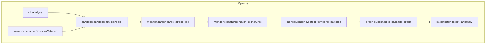
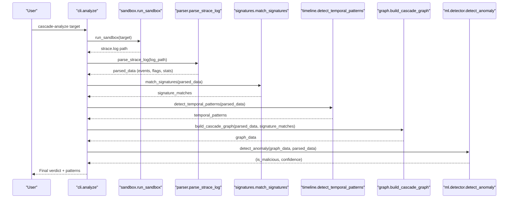
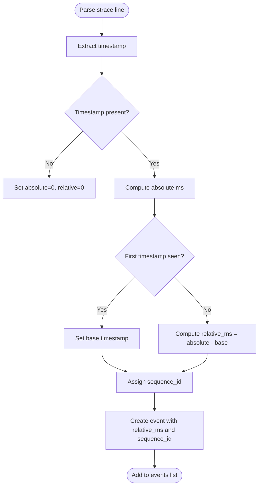
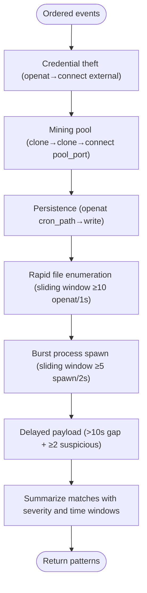
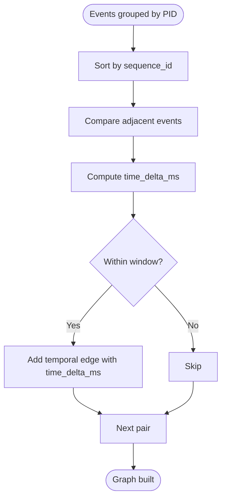
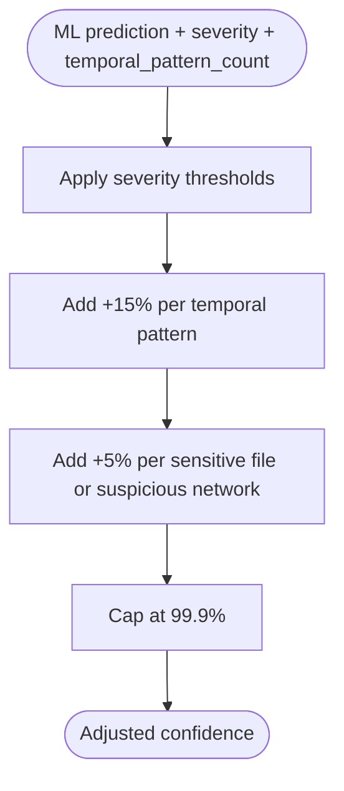
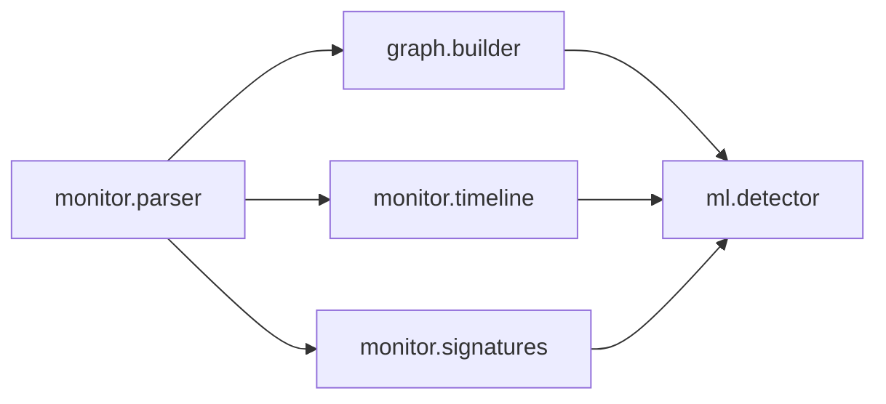

# Temporal Pattern Recognition

<cite>
**Referenced Files in This Document**
- [timeline.py](file://TraceTree/monitor/timeline.py)
- [parser.py](file://TraceTree/monitor/parser.py)
- [signatures.py](file://TraceTree/monitor/signatures.py)
- [detector.py](file://TraceTree/ml/detector.py)
- [builder.py](file://TraceTree/graph/builder.py)
- [cli.py](file://TraceTree/cli.py)
- [sandbox.py](file://TraceTree/sandbox/sandbox.py)
- [session.py](file://TraceTree/watcher/session.py)
- [signatures.json](file://TraceTree/data/signatures.json)
</cite>

## Table of Contents
1. [Introduction](#introduction)
2. [Project Structure](#project-structure)
3. [Core Components](#core-components)
4. [Architecture Overview](#architecture-overview)
5. [Detailed Component Analysis](#detailed-component-analysis)
6. [Dependency Analysis](#dependency-analysis)
7. [Performance Considerations](#performance-considerations)
8. [Troubleshooting Guide](#troubleshooting-guide)
9. [Conclusion](#conclusion)

## Introduction
This document explains TraceTree’s temporal pattern recognition system, which detects suspicious timing behaviors from timestamped event streams. It focuses on five temporal patterns:
- Credential theft sequences with delayed execution
- Mining pool connections with scheduled intervals
- Persistence mechanisms with startup timing
- Rapid file enumeration and burst process spawning
- Delayed payload delivery after long gaps

It also documents the timestamp analysis algorithms that identify abnormal time gaps, repeated patterns, and coordinated event sequences, and how the timeline processor reconstructs event ordering, calculates time deltas, and flags suspicious temporal correlations. Finally, it describes how confidence scores are adjusted based on temporal proximity and pattern frequency.

## Project Structure
The temporal pattern recognition spans several modules:
- Parser: converts strace logs into timestamped events with relative timestamps and severity weights
- Timeline: detects temporal patterns from ordered, timestamped events
- Graph builder: constructs a temporal graph with edges representing time deltas between consecutive events
- ML detector: adjusts anomaly confidence using severity and temporal evidence
- CLI and watcher: orchestrate sandboxing, parsing, graphing, and detection, and surface temporal patterns

**Diagram sources**
- [sandbox.py:175-335](file://TraceTree/sandbox/sandbox.py#L175-L335)
- [parser.py:340-679](file://TraceTree/monitor/parser.py#L340-L679)
- [signatures.py:86-115](file://TraceTree/monitor/signatures.py#L86-L115)
- [timeline.py:298-331](file://TraceTree/monitor/timeline.py#L298-L331)
- [builder.py:8-195](file://TraceTree/graph/builder.py#L8-L195)
- [detector.py:235-299](file://TraceTree/ml/detector.py#L235-L299)
- [cli.py:181-259](file://TraceTree/cli.py#L181-L259)
- [session.py:277-326](file://TraceTree/watcher/session.py#L277-L326)

**Section sources**
- [cli.py:181-259](file://TraceTree/cli.py#L181-L259)
- [sandbox.py:175-335](file://TraceTree/sandbox/sandbox.py#L175-L335)
- [parser.py:340-679](file://TraceTree/monitor/parser.py#L340-L679)
- [timeline.py:298-331](file://TraceTree/monitor/timeline.py#L298-L331)
- [builder.py:8-195](file://TraceTree/graph/builder.py#L8-L195)
- [detector.py:235-299](file://TraceTree/ml/detector.py#L235-L299)
- [session.py:277-326](file://TraceTree/watcher/session.py#L277-L326)

## Core Components
- Timestamp reconstruction and ordering: The parser converts absolute timestamps to relative milliseconds from the first event and assigns sequence IDs to preserve temporal order.
- Temporal pattern detectors: Five specialized checkers scan the ordered event stream for suspicious timing patterns.
- Temporal graph construction: The graph builder creates temporal edges between consecutive events within a fixed time window, enabling temporal analysis.
- Confidence adjustment: The ML detector boosts confidence based on severity and the number of detected temporal patterns.

Key implementation references:
- Relative timestamp computation and sequence ID assignment
- Pattern detection functions and severity scoring
- Temporal edge creation and time window logic
- Confidence boosting based on temporal evidence

**Section sources**
- [parser.py:390-456](file://TraceTree/monitor/parser.py#L390-L456)
- [timeline.py:100-281](file://TraceTree/monitor/timeline.py#L100-L281)
- [builder.py:111-139](file://TraceTree/graph/builder.py#L111-L139)
- [detector.py:180-233](file://TraceTree/ml/detector.py#L180-L233)

## Architecture Overview
The temporal pattern recognition system integrates with the broader TraceTree pipeline:

**Diagram sources**
- [cli.py:181-259](file://TraceTree/cli.py#L181-L259)
- [sandbox.py:175-335](file://TraceTree/sandbox/sandbox.py#L175-L335)
- [parser.py:340-679](file://TraceTree/monitor/parser.py#L340-L679)
- [signatures.py:86-115](file://TraceTree/monitor/signatures.py#L86-L115)
- [timeline.py:298-331](file://TraceTree/monitor/timeline.py#L298-L331)
- [builder.py:8-195](file://TraceTree/graph/builder.py#L8-L195)
- [detector.py:235-299](file://TraceTree/ml/detector.py#L235-L299)

## Detailed Component Analysis

### Timestamp Reconstruction and Ordering
- Absolute timestamps are parsed from strace logs and converted to relative milliseconds from the first event.
- Each event receives a sequence_id to ensure deterministic ordering even if timestamps are equal.
- The parser flags suspicious network destinations and sensitive file accesses with severity weights.

**Diagram sources**
- [parser.py:390-456](file://TraceTree/monitor/parser.py#L390-L456)

**Section sources**
- [parser.py:390-456](file://TraceTree/monitor/parser.py#L390-L456)

### Temporal Pattern Detection
The system detects five temporal patterns by scanning the ordered event stream:

1. Credential theft sequences with delayed execution
   - Detects sensitive file access followed by external network connection within a short time window.
   - Severity: 9
   - Evidence: start/end times and the two triggering events.

2. Mining pool connections with scheduled intervals
   - Detected via behavioral signatures (see signatures.json), but the timeline module can complement this with temporal bursts.
   - Severity: 8
   - Evidence: sequence of process spawns and network connections to known mining pool ports.

3. Persistence mechanisms with startup timing
   - Detected via behavioral signatures (writing to cron paths), with temporal patterns indicating scheduled or startup-triggered persistence.
   - Severity: 7
   - Evidence: openat/write to cron-related paths.

4. Rapid file enumeration and burst process spawning
   - Detects high-frequency file access or process spawning within short windows.
   - Severity: 7
   - Evidence: sliding window counts and event summaries.

5. Delayed payload delivery after long gaps
   - Detects long time gaps followed by bursts of suspicious activity.
   - Severity: 8
   - Evidence: gap length and subsequent suspicious events.

**Diagram sources**
- [timeline.py:100-281](file://TraceTree/monitor/timeline.py#L100-L281)

**Section sources**
- [timeline.py:100-281](file://TraceTree/monitor/timeline.py#L100-L281)

### Temporal Graph Construction
The graph builder creates temporal edges between consecutive events from the same PID within a fixed time window (default 5 seconds). This enables visualizing and analyzing temporal relationships.

**Diagram sources**
- [builder.py:111-139](file://TraceTree/graph/builder.py#L111-L139)

**Section sources**
- [builder.py:111-139](file://TraceTree/graph/builder.py#L111-L139)

### Confidence Adjustment Based on Temporal Proximity and Frequency
The ML detector augments its predictions with severity and temporal evidence:
- Critical severity thresholds override predictions
- High and medium severity thresholds boost confidence
- Each temporal pattern adds +15% confidence
- Multiple temporal patterns can flip a clean verdict to malicious
- Individual sensitive file or suspicious network accesses add +5% confidence each

**Diagram sources**
- [detector.py:180-233](file://TraceTree/ml/detector.py#L180-L233)

**Section sources**
- [detector.py:180-233](file://TraceTree/ml/detector.py#L180-L233)

### Example: execve Followed by Network Connection with Specific Time Windows
- The timeline module includes a pattern that detects external network connections shortly after shell execution.
- This aligns with behavioral signatures for reverse shells and can be combined with signature matching for stronger confidence.

References:
- Pattern definition and detection logic
- Signature definitions for reverse shell sequences

**Section sources**
- [timeline.py:253-281](file://TraceTree/monitor/timeline.py#L253-L281)
- [signatures.json:42-70](file://TraceTree/data/signatures.json#L42-L70)

## Dependency Analysis
The temporal pattern recognition depends on:
- Parser for timestamped events and severity weights
- Signatures for complementary behavioral pattern matching
- Graph builder for temporal edges and statistics
- ML detector for confidence adjustment

**Diagram sources**
- [parser.py:340-679](file://TraceTree/monitor/parser.py#L340-L679)
- [timeline.py:298-331](file://TraceTree/monitor/timeline.py#L298-L331)
- [signatures.py:86-115](file://TraceTree/monitor/signatures.py#L86-L115)
- [builder.py:8-195](file://TraceTree/graph/builder.py#L8-L195)
- [detector.py:235-299](file://TraceTree/ml/detector.py#L235-L299)

**Section sources**
- [parser.py:340-679](file://TraceTree/monitor/parser.py#L340-L679)
- [timeline.py:298-331](file://TraceTree/monitor/timeline.py#L298-L331)
- [signatures.py:86-115](file://TraceTree/monitor/signatures.py#L86-L115)
- [builder.py:8-195](file://TraceTree/graph/builder.py#L8-L195)
- [detector.py:235-299](file://TraceTree/ml/detector.py#L235-L299)

## Performance Considerations
- Event ordering: Sorting by sequence_id ensures O(n log n) ordering; pattern checks are linear scans with early exits.
- Sliding windows: Rapid enumeration and burst spawning use O(n^2) worst-case scans; thresholds reduce false positives.
- Temporal graph: Adding temporal edges is O(n) per PID after sorting, with a fixed window size.
- Confidence adjustment: Constant-time arithmetic operations on scalar values.

## Troubleshooting Guide
Common issues and resolutions:
- No timestamps in logs: The parser sets relative_ms to 0; temporal pattern detection requires timestamps. Ensure strace is invoked with the -t flag.
- Empty or malformed logs: Sandbox filters and validates logs; check sandbox stderr for diagnostics.
- Docker not available: The sandbox requires Docker; install and start the Docker daemon.
- Insufficient temporal patterns: Increase the sensitivity by lowering thresholds or adjusting the time window in the graph builder.

**Section sources**
- [sandbox.py:189-197](file://TraceTree/sandbox/sandbox.py#L189-L197)
- [sandbox.py:310-320](file://TraceTree/sandbox/sandbox.py#L310-L320)
- [cli.py:74-109](file://TraceTree/cli.py#L74-L109)
- [builder.py:4-5](file://TraceTree/graph/builder.py#L4-L5)

## Conclusion
TraceTree’s temporal pattern recognition system combines precise timestamp reconstruction, targeted pattern detectors, and confidence adjustment to identify suspicious timing behaviors. By integrating with behavioral signatures and the ML detector, it provides robust detection of credential theft, mining, persistence, and other timed attack patterns, while adjusting confidence based on temporal proximity and frequency.