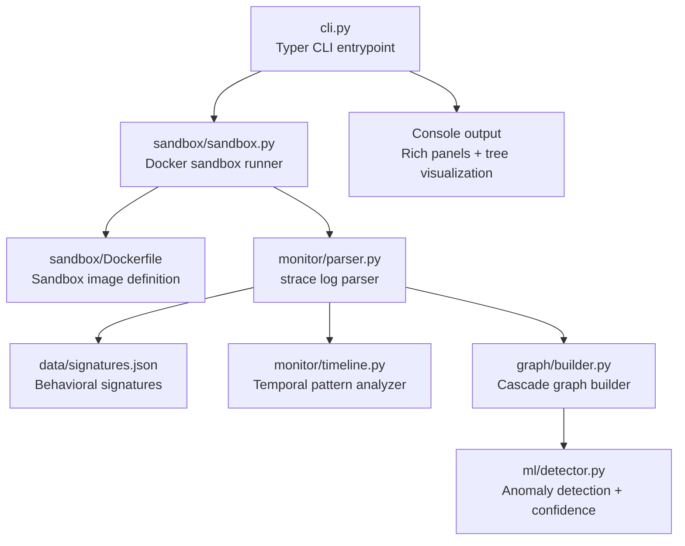
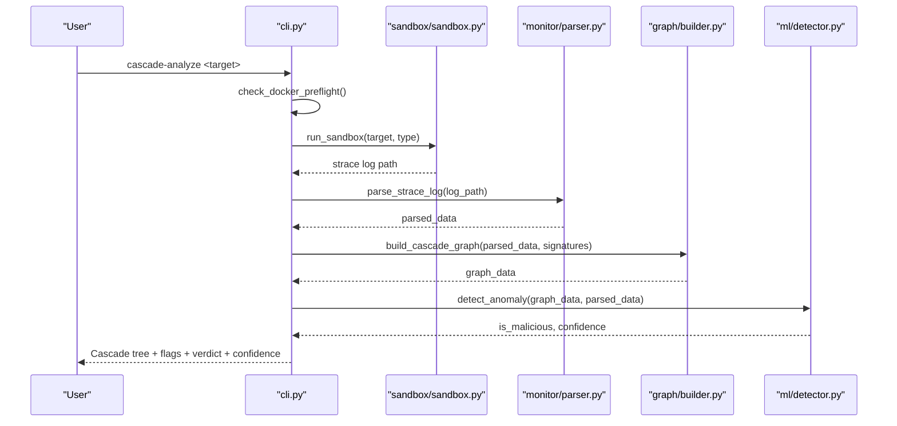
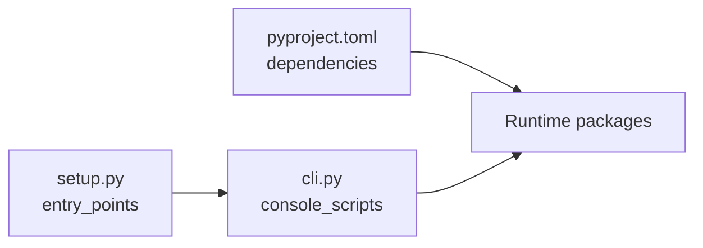

# Getting Started

<cite>
**Referenced Files in This Document**
- [README.md](file://README.md)
- [cli.py](file://cli.py)
- [setup.py](file://setup.py)
- [pyproject.toml](file://pyproject.toml)
- [sandbox/Dockerfile](file://sandbox/Dockerfile)
- [sandbox/sandbox.py](file://sandbox/sandbox.py)
- [monitor/parser.py](file://monitor/parser.py)
- [graph/builder.py](file://graph/builder.py)
- [ml/detector.py](file://ml/detector.py)
- [data/signatures.json](file://data/signatures.json)
- [hooks/install_hook.py](file://hooks/install_hook.py)
- [hooks/shell_hook.sh](file://hooks/shell_hook.sh)
</cite>

## Table of Contents
1. [Introduction](#introduction)
2. [Project Structure](#project-structure)
3. [Core Components](#core-components)
4. [Architecture Overview](#architecture-overview)
5. [Detailed Component Analysis](#detailed-component-analysis)
6. [Dependency Analysis](#dependency-analysis)
7. [Performance Considerations](#performance-considerations)
8. [Troubleshooting Guide](#troubleshooting-guide)
9. [Conclusion](#conclusion)
10. [Appendices](#appendices)

## Introduction
TraceTree performs runtime behavioral analysis of Python packages, npm packages, DMG images, and Windows EXE files by executing them in a sandboxed Docker container, tracing syscalls with strace, and classifying behavior using rule-based signatures, temporal pattern analysis, and machine learning anomaly detection. This guide helps you install TraceTree, prepare prerequisites, and complete your first analysis with practical examples and troubleshooting advice.

## Project Structure
At a high level, TraceTree is organized into modules that implement the sandbox, syscall parsing, graph construction, ML detection, and CLI orchestration. The CLI registers console scripts and coordinates the full pipeline.

**Diagram sources**
- [cli.py:305-482](file://cli.py#L305-L482)
- [sandbox/sandbox.py:184-428](file://sandbox/sandbox.py#L184-L428)
- [monitor/parser.py:342-682](file://monitor/parser.py#L342-L682)
- [graph/builder.py:8-196](file://graph/builder.py#L8-L196)
- [ml/detector.py:235-300](file://ml/detector.py#L235-L300)
- [data/signatures.json:1-246](file://data/signatures.json#L1-L246)

**Section sources**
- [README.md:104-124](file://README.md#L104-L124)
- [cli.py:25-73](file://cli.py#L25-L73)
- [pyproject.toml:26-32](file://pyproject.toml#L26-L32)

## Core Components
- CLI and orchestration: Registers console scripts, validates Docker preflight, and orchestrates sandbox → parse → graph → ML steps. It renders a cascade tree, flags suspicious behaviors, and prints a final verdict with confidence.
- Sandbox: Builds and runs the sandbox image, traces syscalls, drops network by default, and returns a strace log path.
- Parser: Parses strace logs, extracts events, flags suspicious activity, classifies network destinations, and computes severity.
- Graph builder: Constructs a NetworkX directed graph with process, file, and network nodes; adds temporal edges; and prepares Cytoscape-compatible JSON.
- ML detector: Extracts features, loads a trained model (or falls back to an IsolationForest baseline), and computes a severity-boosted confidence score.
- Signatures: Defines 8 behavioral patterns with severity and matching criteria.

**Section sources**
- [cli.py:305-482](file://cli.py#L305-L482)
- [sandbox/sandbox.py:184-428](file://sandbox/sandbox.py#L184-L428)
- [monitor/parser.py:342-682](file://monitor/parser.py#L342-L682)
- [graph/builder.py:8-196](file://graph/builder.py#L8-L196)
- [ml/detector.py:235-300](file://ml/detector.py#L235-L300)
- [data/signatures.json:1-246](file://data/signatures.json#L1-L246)

## Architecture Overview
The end-to-end pipeline executes a target in a Docker sandbox, traces syscalls, parses and analyzes the trace, builds a cascade graph, and applies ML and severity scoring to produce a final verdict.

**Diagram sources**
- [cli.py:313-482](file://cli.py#L313-L482)
- [sandbox/sandbox.py:184-428](file://sandbox/sandbox.py#L184-L428)
- [monitor/parser.py:342-682](file://monitor/parser.py#L342-L682)
- [graph/builder.py:8-196](file://graph/builder.py#L8-L196)
- [ml/detector.py:235-300](file://ml/detector.py#L235-L300)

## Detailed Component Analysis

### Prerequisites and Installation
- Prerequisites
  - Python 3.9+ (required)
  - Docker must be installed and running
- Installation
  - Clone the repository and install in editable mode using pip with the project’s setup configuration.
  - After installation, the CLI entry points are registered for immediate use.

Step-by-step installation and verification:
- Install prerequisites
  - Ensure Python 3.9+ is available on your system.
  - Install and start Docker (ensure the Docker daemon is reachable).
- Install the project
  - From the repository root, run the editable install to register console scripts.
- Verify installation
  - Run the CLI help to confirm the commands are available.

Common installation pitfalls:
- Missing Docker SDK: The CLI checks for Docker availability and exits with guidance if not installed.
- Docker not running: The preflight checks the Docker daemon and instructs you on OS-specific installation and startup steps.

**Section sources**
- [README.md:106-117](file://README.md#L106-L117)
- [cli.py:74-111](file://cli.py#L74-L111)
- [setup.py:19-39](file://setup.py#L19-L39)
- [pyproject.toml:14-24](file://pyproject.toml#L14-L24)

### First Analysis Walkthrough
Goal: Perform a basic cascade-analyze on two Python packages: a benign one and a known typosquat.

Steps:
- Analyze a benign package
  - Run the cascade-analyze command for a well-known package.
  - Observe the cascade tree, flagged behaviors, and final verdict.
- Analyze a known typosquat
  - Run the cascade-analyze command for a known malicious package.
  - Review behavioral signatures, temporal patterns, and the final verdict.

Expected output highlights:
- Cascade Graph panel: Visual tree of the install process and observed syscalls.
- Flagged Behaviors panel: Human-readable warnings derived from the parser.
- Behavioral Signatures panel: Detected patterns with severity and evidence.
- Temporal Execution Patterns panel: Time-based patterns if present.
- Final Verdict panel: CLEAN or MALICIOUS with a confidence percentage.
- Summary line: Comma-separated indicators of signatures, temporal patterns, and other detections.

Command examples:
- Analyze a Python package
  - Use the pip target type explicitly for clarity.
- Analyze an npm package
  - Point to a manifest file.
- Analyze DMG or EXE
  - Provide the file path with the appropriate target type.
- Bulk analysis
  - Provide a requirements or manifest file for batch processing.
- Force target type
  - Override automatic detection with explicit type flags.

**Section sources**
- [README.md:119-174](file://README.md#L119-L174)
- [cli.py:305-482](file://cli.py#L305-L482)
- [cli.py:112-124](file://cli.py#L112-L124)

### Output Format and Interpretation
- Cascade Graph
  - A Rich tree visualization of the install process and observed syscalls.
- Flagged Behaviors
  - Parser-derived warnings for suspicious activity.
- Behavioral Signatures
  - Matches against predefined patterns with severity and evidence summaries.
- Temporal Execution Patterns
  - Time-based behavioral patterns detected from timestamped events.
- Final Verdict
  - CLEAN or MALICIOUS with a confidence percentage.
- Summary Line
  - Concise concatenation of detected signatures, temporal patterns, and other features.

**Section sources**
- [cli.py:354-460](file://cli.py#L354-L460)
- [monitor/parser.py:342-682](file://monitor/parser.py#L342-L682)
- [data/signatures.json:1-246](file://data/signatures.json#L1-L246)

### Common Command Patterns and Variations
- Single target analysis
  - Pip package: cascade-analyze <package> --type pip
  - Npm package: cascade-analyze <manifest> --type npm
  - DMG/EXE: cascade-analyze <file> --type dmg|exe
- Bulk analysis
  - Pip: cascade-analyze requirements.txt --type bulk
  - Npm: cascade-analyze package.json --type bulk
- Force target type
  - --type pip|npm|dmg|exe
- Output options
  - SARIF export via dedicated option in the analyze command

**Section sources**
- [README.md:176-203](file://README.md#L176-L203)
- [cli.py:305-340](file://cli.py#L305-L340)

### Sandbox and System Dependencies
- Sandbox image
  - Built from a base Python slim image with strace, Node.js, npm, Wine, p7zip-full, and related tools.
- Network policy
  - The sandbox drops the container’s network interface before execution to block outbound connections while still logging them.
- Target-specific behavior
  - Pip: downloads and installs off-band, then traces install under strace.
  - Npm: installs under strace with network dropped after a dry-run.
  - DMG: extracts and traces executables/scripts; limited fidelity for macOS-specific behavior.
  - EXE: runs under Wine with a timeout and filters Wine initialization noise.

**Section sources**
- [sandbox/Dockerfile:1-11](file://sandbox/Dockerfile#L1-L11)
- [sandbox/sandbox.py:226-315](file://sandbox/sandbox.py#L226-L315)
- [README.md:95-102](file://README.md#L95-L102)

## Dependency Analysis
- Python version and packages
  - Requires Python 3.9+.
  - Declared dependencies include Typer, Rich, NetworkX, scikit-learn, FastAPI, Uvicorn, Docker SDK, Google Cloud Storage client, and Requests.
- Console scripts
  - Entry points for cascade-analyze, cascade-train, cascade-update, cascade-watch, cascade-check, and cascade-install-hook are registered.

**Diagram sources**
- [setup.py:30-39](file://setup.py#L30-L39)
- [pyproject.toml:14-24](file://pyproject.toml#L14-L24)

**Section sources**
- [setup.py:19-39](file://setup.py#L19-L39)
- [pyproject.toml:14-24](file://pyproject.toml#L14-L24)

## Performance Considerations
- Sandbox timeouts vary by target type to balance completeness and responsiveness.
- The ML detector uses a severity-boost mechanism to improve confidence without replacing the model’s judgment.
- Resource usage (memory, disk, file count) is captured and reported for transparency.

[No sources needed since this section provides general guidance]

## Troubleshooting Guide
- Docker preflight failures
  - Missing Docker SDK: The CLI prints a message and exits with guidance to install the Docker SDK.
  - Docker not running: The preflight detects the daemon state and provides OS-specific installation and startup instructions.
- Sandbox image build failures
  - The sandbox attempts to build the image on first run; failures are surfaced with error messages.
- Empty or minimal strace logs
  - The sandbox filters Wine initialization noise for EXE targets and reports warnings for missing executables or unsupported conditions.
- Resource usage insights
  - The CLI prints peak memory, disk usage, and file count installed during the sandbox run.

Initial checks:
- Confirm Docker is installed and the daemon is running.
- Re-run the analyze command to rebuild the sandbox image if needed.
- Review the sandbox stderr output for diagnostics when execution fails.

**Section sources**
- [cli.py:74-111](file://cli.py#L74-L111)
- [sandbox/sandbox.py:198-220](file://sandbox/sandbox.py#L198-L220)
- [sandbox/sandbox.py:333-356](file://sandbox/sandbox.py#L333-L356)
- [sandbox/sandbox.py:400-417](file://sandbox/sandbox.py#L400-L417)

## Conclusion
You are now ready to install TraceTree, verify prerequisites, and perform your first analyses. Use the provided commands to explore Python packages, npm packages, DMG images, and EXE files. Review the cascade graph, flagged behaviors, signatures, temporal patterns, and final verdict to understand the runtime behavior of targets. If you encounter issues, consult the troubleshooting section for Docker connectivity and sandbox-related problems.

[No sources needed since this section summarizes without analyzing specific files]

## Appendices

### Appendix A: Shell Hook Installation (Optional)
Automatically start the session guardian after cloning repositories:
- Install the shell hook to your shell’s RC file.
- The installer detects your shell and appends the hook source line.
- After sourcing the RC file or opening a new terminal, git clone triggers the watcher.

**Section sources**
- [hooks/install_hook.py:71-119](file://hooks/install_hook.py#L71-L119)
- [hooks/shell_hook.sh:1-93](file://hooks/shell_hook.sh#L1-L93)