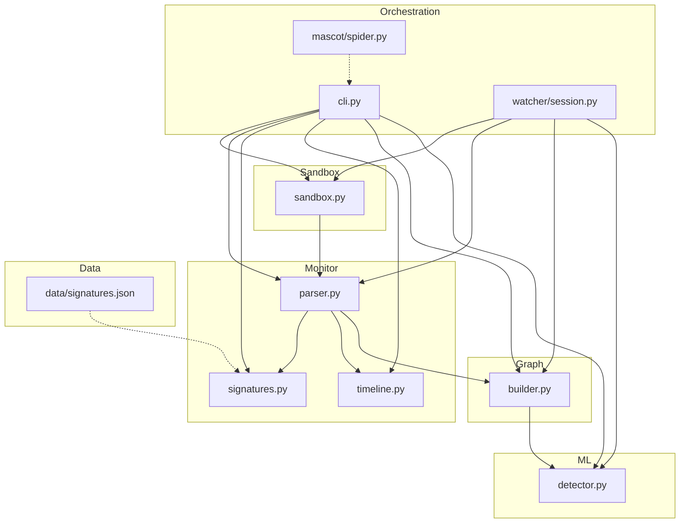
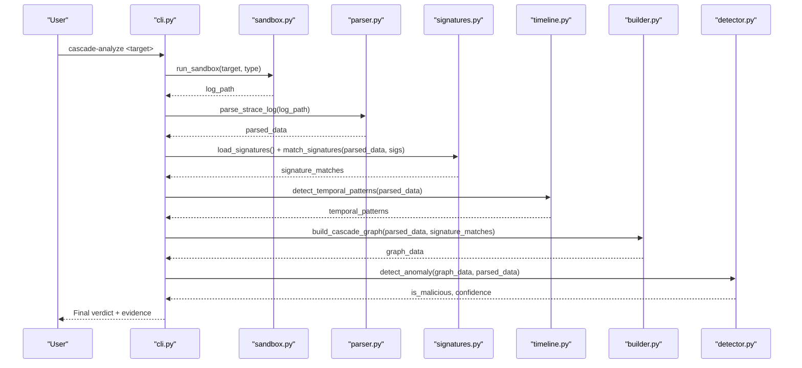
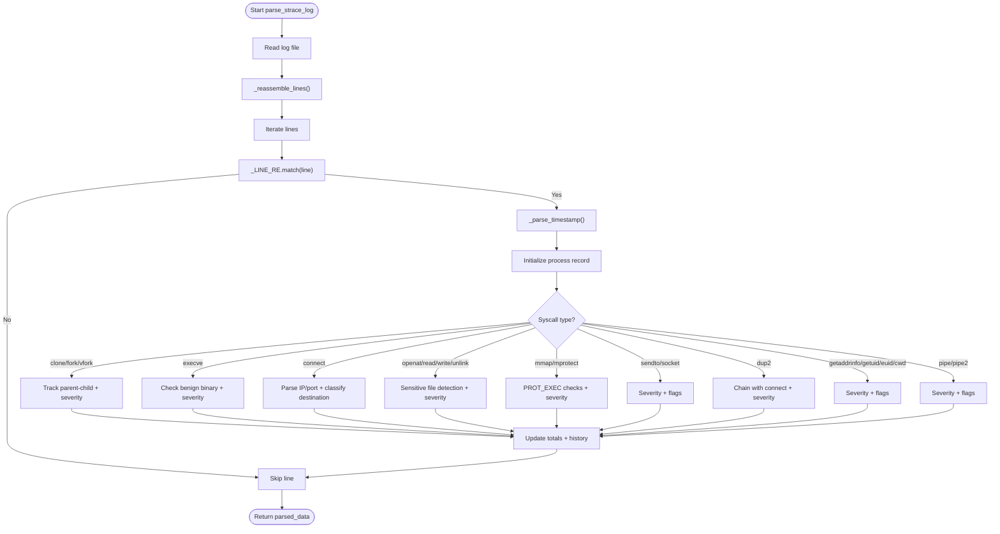
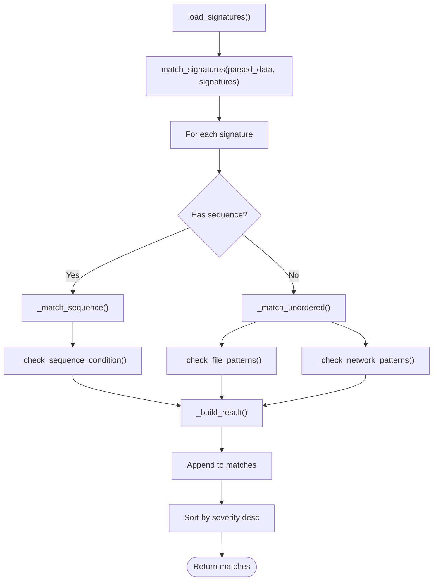
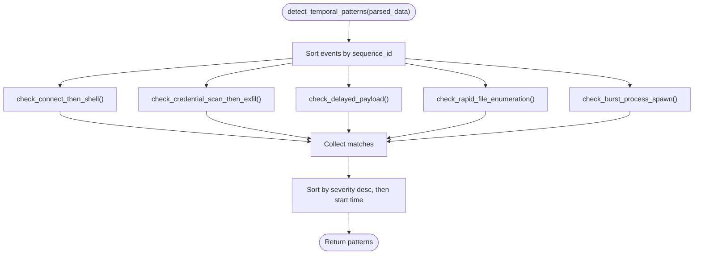
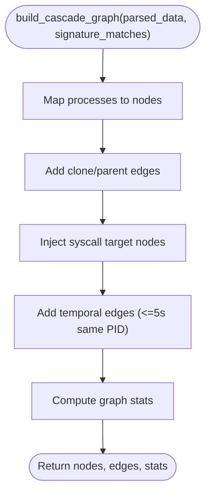
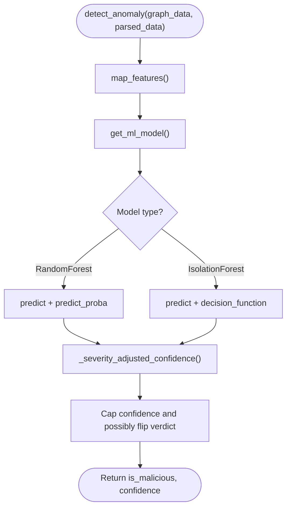
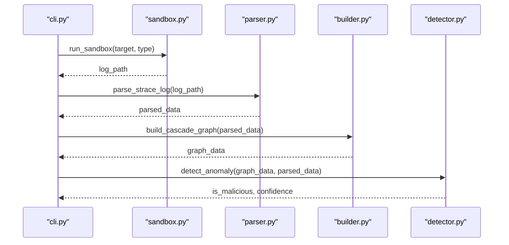
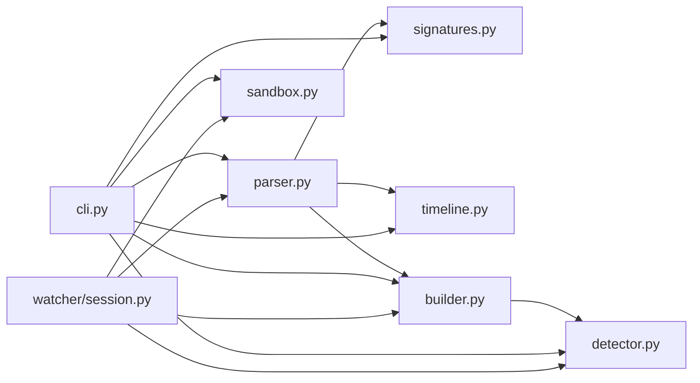

# Event Processing Pipeline

<cite>
**Referenced Files in This Document**
- [parser.py](file://TraceTree/monitor/parser.py)
- [signatures.py](file://TraceTree/monitor/signatures.py)
- [timeline.py](file://TraceTree/monitor/timeline.py)
- [detector.py](file://TraceTree/ml/detector.py)
- [builder.py](file://TraceTree/graph/builder.py)
- [cli.py](file://TraceTree/cli.py)
- [sandbox.py](file://TraceTree/sandbox/sandbox.py)
- [session.py](file://TraceTree/watcher/session.py)
- [spider.py](file://TraceTree/mascot/spider.py)
- [signatures.json](file://data/signatures.json)
- [README.md](file://TraceTree/README.md)
</cite>

## Table of Contents
1. [Introduction](#introduction)
2. [Project Structure](#project-structure)
3. [Core Components](#core-components)
4. [Architecture Overview](#architecture-overview)
5. [Detailed Component Analysis](#detailed-component-analysis)
6. [Dependency Analysis](#dependency-analysis)
7. [Performance Considerations](#performance-considerations)
8. [Troubleshooting Guide](#troubleshooting-guide)
9. [Conclusion](#conclusion)
10. [Appendices](#appendices)

## Introduction
This document explains TraceTree’s event processing pipeline with a focus on strace log parsing, event reconstruction, behavioral signature matching, and temporal analysis. It covers:
- Regex-based multi-line syscall reassembly
- Severity scoring and network destination classification
- Behavioral signature definitions and matching
- Temporal pattern detection for suspicious timing
- Practical workflows, custom signature creation, and performance optimization
- Memory management, parsing efficiency, and scalability for high-volume analysis

## Project Structure
The pipeline is composed of modular components orchestrated by the CLI and watcher systems:
- Sandbox execution and strace capture
- Parser for multi-line syscall reconstruction and severity scoring
- Signature matcher for behavioral patterns
- Temporal analyzer for time-based patterns
- Graph builder for process/file/network relationships and temporal edges
- ML detector for anomaly classification and confidence boosting
- CLI and watcher for orchestration and continuous monitoring

**Diagram sources**
- [sandbox.py:175-335](file://TraceTree/sandbox/sandbox.py#L175-L335)
- [parser.py:340-680](file://TraceTree/monitor/parser.py#L340-L680)
- [signatures.py:57-115](file://TraceTree/monitor/signatures.py#L57-L115)
- [timeline.py:298-331](file://TraceTree/monitor/timeline.py#L298-L331)
- [builder.py:8-195](file://TraceTree/graph/builder.py#L8-L195)
- [detector.py:29-300](file://TraceTree/ml/detector.py#L29-L300)
- [cli.py:181-259](file://TraceTree/cli.py#L181-L259)
- [session.py:29-417](file://TraceTree/watcher/session.py#L29-L417)
- [spider.py:1-77](file://TraceTree/mascot/spider.py#L1-L77)
- [signatures.json:1-246](file://data/signatures.json#L1-L246)

**Section sources**
- [README.md:306-329](file://TraceTree/README.md#L306-L329)

## Core Components
- Strace parser: Reassembles multi-line syscalls, extracts timestamps, assigns severity, classifies destinations, and flags suspicious events.
- Signature matcher: Loads behavioral patterns and matches parsed events against unordered or ordered sequences.
- Temporal analyzer: Detects time-based patterns from timestamped event streams.
- Graph builder: Constructs a NetworkX graph with process, file, and network nodes; adds temporal edges; computes statistics.
- ML detector: Extracts features, selects or downloads a model, and applies severity/temporal boosts to confidence.
- Sandbox: Runs targets in Docker, drops network, traces syscalls with strace, and returns logs.
- CLI and watcher: Orchestrate the pipeline, display results, and continuously monitor repositories.

**Section sources**
- [parser.py:11-680](file://TraceTree/monitor/parser.py#L11-L680)
- [signatures.py:57-487](file://TraceTree/monitor/signatures.py#L57-L487)
- [timeline.py:298-353](file://TraceTree/monitor/timeline.py#L298-L353)
- [builder.py:8-195](file://TraceTree/graph/builder.py#L8-L195)
- [detector.py:29-300](file://TraceTree/ml/detector.py#L29-L300)
- [sandbox.py:175-335](file://TraceTree/sandbox/sandbox.py#L175-L335)
- [cli.py:181-259](file://TraceTree/cli.py#L181-L259)
- [session.py:29-417](file://TraceTree/watcher/session.py#L29-L417)

## Architecture Overview
The pipeline transforms raw strace logs into actionable insights:
- Sandbox captures syscalls with timestamps and multi-process tracing.
- Parser reconstructs multi-line syscalls, normalizes PID formats, and enriches events with severity and destination classification.
- Signature matcher identifies known behavioral patterns; temporal analyzer detects suspicious timing.
- Graph builder creates a process-centric graph with temporal edges; ML detector combines graph features and severity signals to produce a final verdict.

**Diagram sources**
- [cli.py:181-259](file://TraceTree/cli.py#L181-L259)
- [sandbox.py:175-335](file://TraceTree/sandbox/sandbox.py#L175-L335)
- [parser.py:340-680](file://TraceTree/monitor/parser.py#L340-L680)
- [signatures.py:86-115](file://TraceTree/monitor/signatures.py#L86-L115)
- [timeline.py:298-331](file://TraceTree/monitor/timeline.py#L298-L331)
- [builder.py:8-195](file://TraceTree/graph/builder.py#L8-L195)
- [detector.py:235-299](file://TraceTree/ml/detector.py#L235-L299)

## Detailed Component Analysis

### Strace Log Parser
The parser handles:
- Multi-line syscall reassembly using continuation lines ending with return values
- Timestamp normalization and relative millisecond computation
- PID detection in both bracketed and bare forms
- Syscall categorization and severity assignment
- Network destination classification and sensitive file detection
- Chain detection across events (e.g., credential theft)

Key behaviors:
- Reassembly regex matches both timestamped and timestampless lines
- Severity weights are applied per syscall type and contextual flags
- Destination classification prioritizes suspicious patterns, then safe registries, then ports and benign categories
- Sensitive file detection uses pattern matching; benign paths are excluded from flags
- Reverse shell and memory injection indicators are flagged with elevated severity

**Diagram sources**
- [parser.py:169-223](file://TraceTree/monitor/parser.py#L169-L223)
- [parser.py:340-680](file://TraceTree/monitor/parser.py#L340-L680)

**Section sources**
- [parser.py:11-680](file://TraceTree/monitor/parser.py#L11-L680)

### Behavioral Signature Matching Engine
The engine:
- Loads patterns from a JSON file with severity, required syscalls, file patterns, network rules, and optional ordered sequences
- Supports unordered matching (presence of required syscalls + file/network patterns) and ordered sequence matching
- Provides condition checks for external connections, shells, non-standard binaries, sensitive files, secrets, cron paths, mining pools, paste sites, and PROT_EXEC
- Produces evidence with human-readable descriptions and matched events

**Diagram sources**
- [signatures.py:57-115](file://TraceTree/monitor/signatures.py#L57-L115)
- [signatures.py:123-236](file://TraceTree/monitor/signatures.py#L123-L236)
- [signatures.py:244-343](file://TraceTree/monitor/signatures.py#L244-L343)
- [signatures.py:351-448](file://TraceTree/monitor/signatures.py#L351-L448)
- [signatures.py:474-487](file://TraceTree/monitor/signatures.py#L474-L487)
- [signatures.json:1-246](file://data/signatures.json#L1-L246)

**Section sources**
- [signatures.py:57-487](file://TraceTree/monitor/signatures.py#L57-L487)
- [signatures.json:1-246](file://data/signatures.json#L1-L246)

### Temporal Analysis System
The temporal analyzer:
- Detects five time-based patterns from timestamped events
- Uses relative milliseconds computed by the parser
- Returns matches with severity, time windows, and evidence events
- Patterns include reverse shell setup, credential theft with exfiltration, delayed payload behavior, rapid file enumeration, and burst process spawning

**Diagram sources**
- [timeline.py:298-331](file://TraceTree/monitor/timeline.py#L298-L331)
- [timeline.py:100-131](file://TraceTree/monitor/timeline.py#L100-L131)
- [timeline.py:172-206](file://TraceTree/monitor/timeline.py#L172-L206)
- [timeline.py:209-250](file://TraceTree/monitor/timeline.py#L209-L250)
- [timeline.py:134-169](file://TraceTree/monitor/timeline.py#L134-L169)
- [timeline.py:253-281](file://TraceTree/monitor/timeline.py#L253-L281)

**Section sources**
- [timeline.py:298-353](file://TraceTree/monitor/timeline.py#L298-L353)

### Graph Construction and Statistics
The graph builder:
- Creates nodes for processes, files, and network destinations
- Adds edges for syscall targets and temporal edges between consecutive same-PID events within a window
- Computes statistics including severity sums, counts of suspicious networks and sensitive files, and signature match counts
- Tags nodes and edges with signature matches for downstream analysis

**Diagram sources**
- [builder.py:8-195](file://TraceTree/graph/builder.py#L8-L195)

**Section sources**
- [builder.py:8-195](file://TraceTree/graph/builder.py#L8-L195)

### Machine Learning Detection and Confidence Boosting
The ML detector:
- Extracts a 10-feature vector from graph and parsed data
- Loads a trained RandomForestClassifier if available, otherwise falls back to IsolationForest
- Applies severity thresholds and temporal pattern counts to boost confidence independently of the ML prediction
- Caps confidence at a maximum value and flips verdicts when severity or temporal signals are strong

**Diagram sources**
- [detector.py:29-300](file://TraceTree/ml/detector.py#L29-L300)
- [detector.py:180-232](file://TraceTree/ml/detector.py#L180-L232)

**Section sources**
- [detector.py:29-300](file://TraceTree/ml/detector.py#L29-L300)

### Sandbox and Orchestration
The sandbox:
- Builds a Docker image with strace, wine64, p7zip, and package managers
- Drops network interface before execution to capture outbound attempts
- Traces syscalls with multi-process and timestamp flags
- Filters wine noise for EXE analysis and returns a strace log

CLI and watcher:
- CLI orchestrates the pipeline, displays progress, and formats results
- Watcher continuously monitors repositories, discovers targets, and runs analyses in the background

**Diagram sources**
- [cli.py:181-259](file://TraceTree/cli.py#L181-L259)
- [sandbox.py:175-335](file://TraceTree/sandbox/sandbox.py#L175-L335)
- [parser.py:340-680](file://TraceTree/monitor/parser.py#L340-L680)
- [builder.py:8-195](file://TraceTree/graph/builder.py#L8-L195)
- [detector.py:235-299](file://TraceTree/ml/detector.py#L235-L299)

**Section sources**
- [sandbox.py:175-335](file://TraceTree/sandbox/sandbox.py#L175-L335)
- [cli.py:181-259](file://TraceTree/cli.py#L181-L259)
- [session.py:29-417](file://TraceTree/watcher/session.py#L29-L417)
- [spider.py:1-77](file://TraceTree/mascot/spider.py#L1-L77)

## Dependency Analysis
- Parser depends on regex patterns and severity maps; it is the foundation for all downstream components.
- Signature matcher depends on parser outputs and the signatures JSON.
- Temporal analyzer depends on parser outputs with timestamps.
- Graph builder depends on parser outputs and signature matches.
- ML detector depends on graph stats and parsed stats; it also depends on the presence of temporal patterns.
- CLI orchestrates all components and injects temporal pattern counts into parsed data for ML.
- Watcher composes sandbox, parser, graph, and ML components for continuous monitoring.

**Diagram sources**
- [cli.py:181-259](file://TraceTree/cli.py#L181-L259)
- [session.py:29-417](file://TraceTree/watcher/session.py#L29-L417)
- [parser.py:340-680](file://TraceTree/monitor/parser.py#L340-L680)
- [signatures.py:86-115](file://TraceTree/monitor/signatures.py#L86-L115)
- [timeline.py:298-331](file://TraceTree/monitor/timeline.py#L298-L331)
- [builder.py:8-195](file://TraceTree/graph/builder.py#L8-L195)
- [detector.py:235-299](file://TraceTree/ml/detector.py#L235-L299)
- [sandbox.py:175-335](file://TraceTree/sandbox/sandbox.py#L175-L335)

**Section sources**
- [cli.py:181-259](file://TraceTree/cli.py#L181-L259)
- [session.py:29-417](file://TraceTree/watcher/session.py#L29-L417)

## Performance Considerations
- Parsing efficiency
  - Single-pass line iteration with regex matching; minimal allocations by joining current parts and emitting assembled lines.
  - Timestamp parsing converts HH:MM:SS.ffffff to milliseconds once per event; relative timestamps derived from first event.
  - Regex reuse for syscall start detection and return value matching reduces overhead.
- Memory management
  - Assembled events stored temporarily; emitted when complete to avoid holding partial entries.
  - Process dictionaries and parent maps kept per PID; cleared after use.
  - Signature and temporal results are lists of lightweight dicts; evidence arrays are trimmed to avoid oversized payloads.
- Scalability
  - Graph construction scales with number of events and nodes; temporal edges limited to a fixed window.
  - ML detector uses a compact feature vector; model caching avoids repeated I/O.
  - Watcher uses a background thread and queues for non-blocking operation.
- I/O and Docker
  - Sandbox writes logs to disk; filtering removes noise for EXE analysis to reduce downstream parsing cost.
  - CLI progress bars and Rich rendering add minimal overhead compared to analysis time.

[No sources needed since this section provides general guidance]

## Troubleshooting Guide
Common issues and remedies:
- Docker not available
  - The sandbox requires Docker; missing or unreachable Docker causes failures early in the pipeline.
- Empty or minimal strace logs
  - For EXE analysis, wine initialization noise is filtered; if logs are empty, the target may not produce syscalls or may crash quickly.
- Signature matching skipped
  - JSON parsing errors or missing signatures file cause signature matching to be skipped; verify signatures.json validity.
- Temporal analysis disabled
  - Without timestamps, temporal patterns are not detected; ensure strace is run with timestamp flags.
- Model loading failures
  - Local model load or GCS download failures trigger fallback to IsolationForest; update model or check connectivity.
- Watcher conflicts
  - Session locks prevent multiple watchers for the same directory; stale locks are cleaned up automatically.

**Section sources**
- [sandbox.py:189-197](file://TraceTree/sandbox/sandbox.py#L189-L197)
- [sandbox.py:322-335](file://TraceTree/sandbox/sandbox.py#L322-L335)
- [signatures.py:74-83](file://TraceTree/monitor/signatures.py#L74-L83)
- [detector.py:108-146](file://TraceTree/ml/detector.py#L108-L146)
- [session.py:637-648](file://TraceTree/watcher/session.py#L637-L648)

## Conclusion
TraceTree’s event processing pipeline integrates robust strace parsing, behavioral signature matching, temporal analysis, and ML-based anomaly detection. The modular design enables efficient scaling, clear separation of concerns, and extensible pattern definition. By leveraging severity weighting, destination classification, and time-based pattern detection, the system provides actionable insights for runtime behavioral analysis across diverse target types.

[No sources needed since this section summarizes without analyzing specific files]

## Appendices

### Practical Event Processing Workflows
- Single-target analysis
  - Use the CLI to sandbox, parse, match signatures, detect temporal patterns, build the graph, and run ML detection.
- Bulk analysis
  - Provide a requirements.txt or package.json to analyze multiple targets sequentially.
- On-demand repository scanning
  - Use the watcher to continuously monitor a repository and run analyses in the background.

**Section sources**
- [cli.py:261-371](file://TraceTree/cli.py#L261-L371)
- [session.py:128-196](file://TraceTree/watcher/session.py#L128-L196)

### Custom Signature Creation
Steps to define a new behavioral signature:
- Define required syscalls, file patterns, and network rules
- Optionally define an ordered sequence of (syscall, condition) pairs
- Assign a severity level and optional confidence boost
- Save to data/signatures.json and reload signatures at runtime

Validation tips:
- Ensure syscall names are supported by the parser
- Use precise file path patterns and network conditions
- Test with representative benign and malicious traces

**Section sources**
- [signatures.json:1-246](file://data/signatures.json#L1-L246)
- [signatures.py:57-115](file://TraceTree/monitor/signatures.py#L57-L115)

### Performance Optimization Techniques
- Prefer ordered sequences for high-confidence, low false-positive matching
- Use signature tagging to reduce downstream matching cost
- Limit temporal windows to relevant timeframes
- Cache models and avoid repeated I/O
- Filter noise in EXE traces to reduce log size

**Section sources**
- [timeline.py:1-353](file://TraceTree/monitor/timeline.py#L1-L353)
- [detector.py:17-21](file://TraceTree/ml/detector.py#L17-L21)
- [sandbox.py:338-375](file://TraceTree/sandbox/sandbox.py#L338-L375)