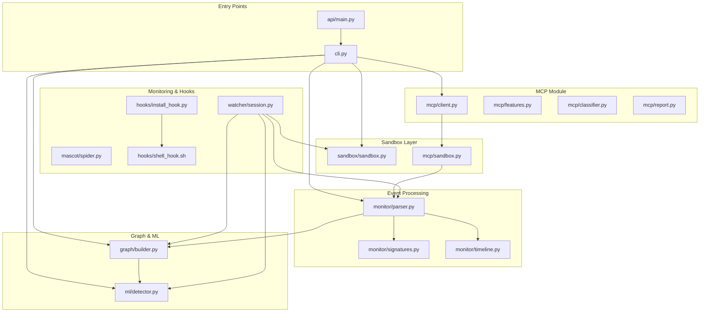
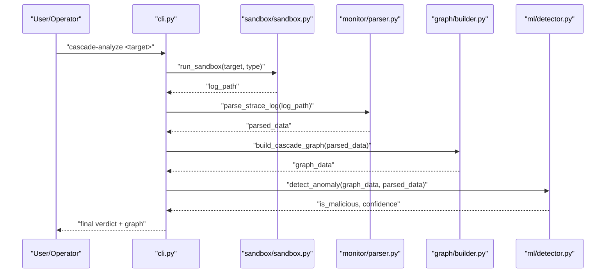
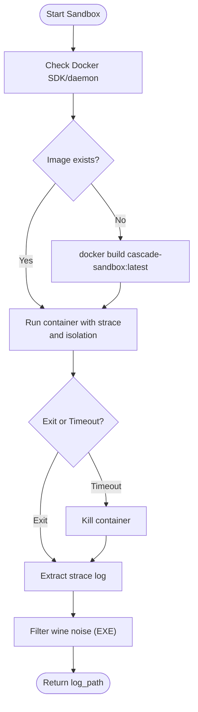
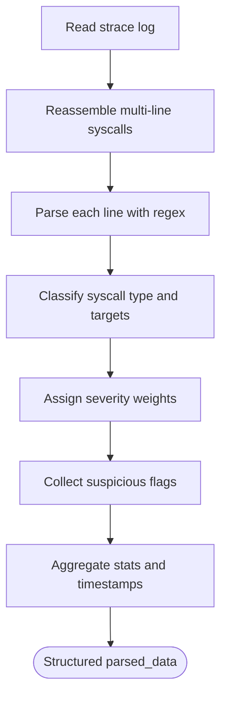
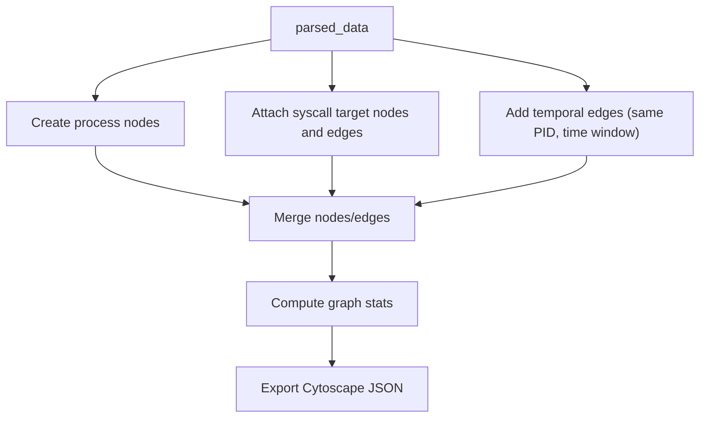
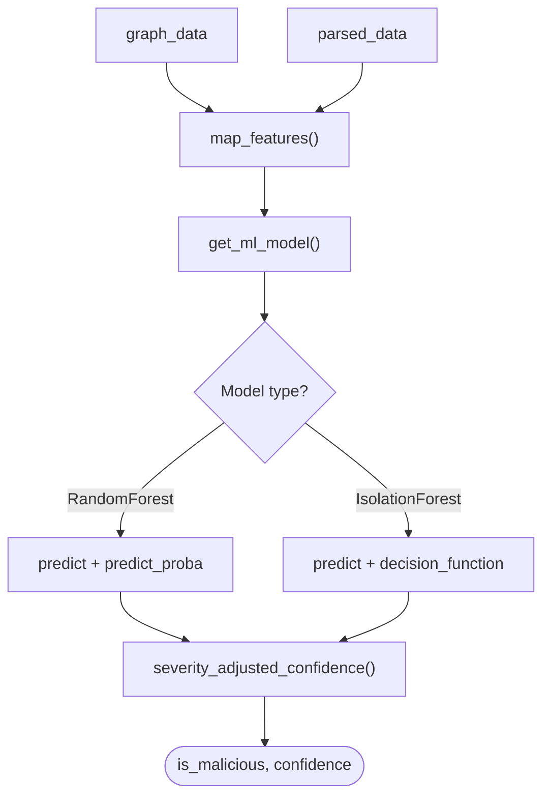
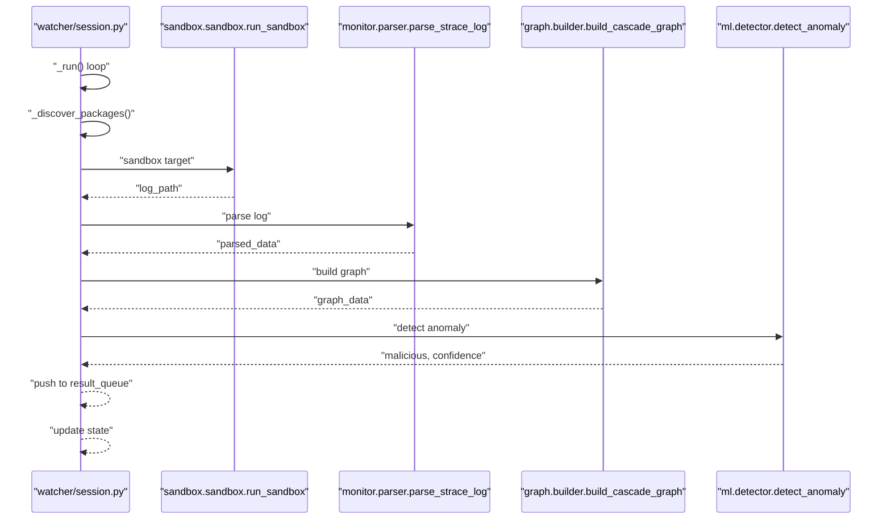
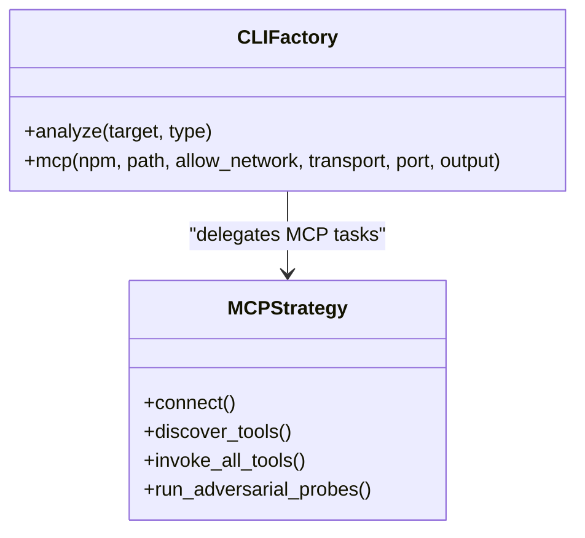
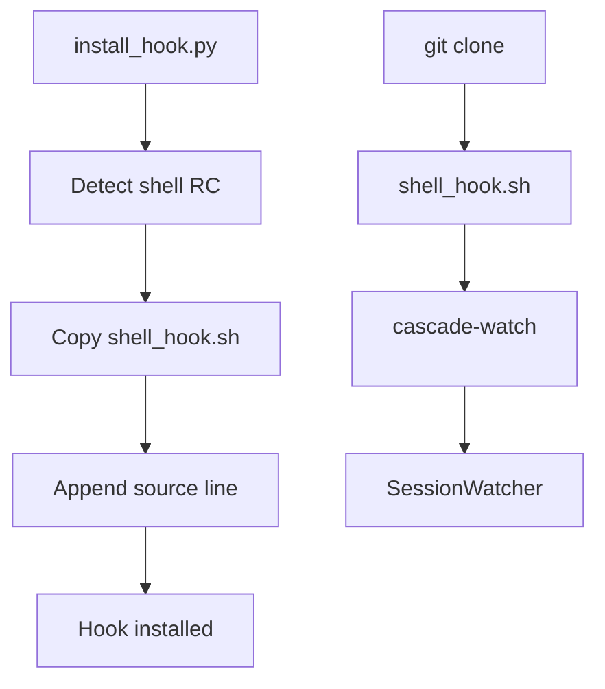
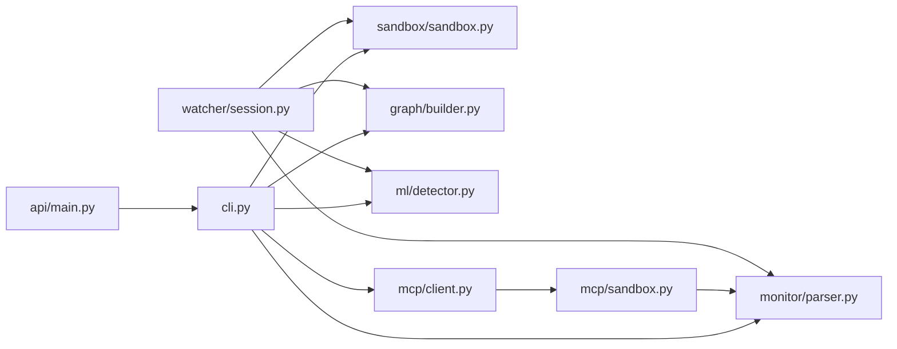

# Infrastructure and Architecture

<cite>
**Referenced Files in This Document**
- [README.md](file://README.md)
- [cli.py](file://cli.py)
- [api/main.py](file://api/main.py)
- [sandbox/sandbox.py](file://sandbox/sandbox.py)
- [mcp/sandbox.py](file://mcp/sandbox.py)
- [monitor/parser.py](file://monitor/parser.py)
- [graph/builder.py](file://graph/builder.py)
- [ml/detector.py](file://ml/detector.py)
- [watcher/session.py](file://watcher/session.py)
- [mascot/spider.py](file://mascot/spider.py)
- [hooks/install_hook.py](file://hooks/install_hook.py)
- [hooks/shell_hook.sh](file://hooks/shell_hook.sh)
- [mcp/client.py](file://mcp/client.py)
- [mcp/features.py](file://mcp/features.py)
- [mcp/classifier.py](file://mcp/classifier.py)
- [mcp/report.py](file://mcp/report.py)
</cite>

## Table of Contents
1. [Introduction](#introduction)
2. [Project Structure](#project-structure)
3. [Core Components](#core-components)
4. [Architecture Overview](#architecture-overview)
5. [Detailed Component Analysis](#detailed-component-analysis)
6. [Dependency Analysis](#dependency-analysis)
7. [Performance Considerations](#performance-considerations)
8. [Troubleshooting Guide](#troubleshooting-guide)
9. [Conclusion](#conclusion)
10. [Appendices](#appendices)

## Introduction
This document describes the infrastructure and system design of TraceTree’s modular pipeline architecture. It explains the end-to-end data flow from sandbox execution through parsing, signature matching, temporal analysis, graph construction, and machine learning detection. It also documents the Docker-based sandbox management system, event processing pipeline, NetworkX graph construction, model management, and operational aspects such as observer-style monitoring, factory-style component orchestration, and strategy-style pluggable analysis modules. Finally, it outlines infrastructure requirements, scalability considerations, and deployment topology for production environments.

## Project Structure
TraceTree is organized into cohesive functional areas:
- CLI and API entry points
- Sandbox execution (Docker-based)
- Event monitoring and parsing
- Signature and temporal analysis
- Graph construction with NetworkX
- Machine learning anomaly detection
- MCP server analysis (pluggable module)
- Real-time monitoring and session management
- Shell hooks and mascot UI

**Diagram sources**
- [cli.py:182-260](file://cli.py#L182-L260)
- [api/main.py:83-100](file://api/main.py#L83-L100)
- [sandbox/sandbox.py:177-344](file://sandbox/sandbox.py#L177-L344)
- [mcp/sandbox.py:41-146](file://mcp/sandbox.py#L41-L146)
- [monitor/parser.py:342-682](file://monitor/parser.py#L342-L682)
- [graph/builder.py:8-196](file://graph/builder.py#L8-L196)
- [ml/detector.py:235-300](file://ml/detector.py#L235-L300)
- [watcher/session.py:29-418](file://watcher/session.py#L29-L418)
- [mascot/spider.py:4-77](file://mascot/spider.py#L4-L77)
- [hooks/install_hook.py:71-129](file://hooks/install_hook.py#L71-L129)
- [hooks/shell_hook.sh:7-92](file://hooks/shell_hook.sh#L7-L92)
- [mcp/client.py:18-473](file://mcp/client.py#L18-L473)
- [mcp/features.py:32-473](file://mcp/features.py#L32-L473)
- [mcp/classifier.py:61-268](file://mcp/classifier.py#L61-L268)
- [mcp/report.py:27-322](file://mcp/report.py#L27-L322)

**Section sources**
- [README.md:306-327](file://README.md#L306-L327)
- [cli.py:262-373](file://cli.py#L262-L373)

## Core Components
- Sandbox execution: Docker-based containerization with strace instrumentation, network isolation, and multi-target support (pip, npm, DMG, EXE, shell scripts).
- Parser: Regex-based strace log parser supporting multi-line entries, timestamps, and severity-weighted event extraction.
- Signature matcher: Behavioral signature engine using patterns from data/signatures.json.
- Temporal analyzer: Time-windowed pattern detection leveraging timestamped events.
- Graph builder: NetworkX-based directed graph with process, file, and network nodes; temporal edges; and severity tagging.
- ML detector: Feature extraction and anomaly detection using RandomForest or IsolationForest with severity boosting.
- MCP module: Pluggable analysis for Model Context Protocol servers with client simulation, adversarial probing, and rule-based classification.
- Watcher: Observer-style session guardian with background thread, status queue, and on-demand checks.
- Hooks and mascot: Shell integration and ASCII mascot for UX.

**Section sources**
- [README.md:306-327](file://README.md#L306-L327)
- [sandbox/sandbox.py:177-344](file://sandbox/sandbox.py#L177-L344)
- [monitor/parser.py:342-682](file://monitor/parser.py#L342-L682)
- [graph/builder.py:8-196](file://graph/builder.py#L8-L196)
- [ml/detector.py:235-300](file://ml/detector.py#L235-L300)
- [watcher/session.py:29-418](file://watcher/session.py#L29-L418)
- [mcp/sandbox.py:41-146](file://mcp/sandbox.py#L41-L146)
- [mcp/client.py:18-473](file://mcp/client.py#L18-L473)
- [hooks/install_hook.py:71-129](file://hooks/install_hook.py#L71-L129)

## Architecture Overview
The system follows a modular pipeline with clear separation of concerns:
- Data acquisition: Docker sandbox executes targets under strace with network isolation.
- Data transformation: Parser converts raw strace logs into structured events with severity and temporal metadata.
- Pattern recognition: Signature and temporal analyzers produce behavioral flags and patterns.
- Graph construction: NetworkX graph encodes process, file, and network relationships with edges reflecting syscall semantics and temporal proximity.
- Decision fusion: ML detector consumes graph and parsed features, combining supervised and unsupervised signals with severity boosting.
- Observability: CLI, API, and watcher provide real-time monitoring and reporting.

**Diagram sources**
- [cli.py:182-260](file://cli.py#L182-L260)
- [sandbox/sandbox.py:177-344](file://sandbox/sandbox.py#L177-L344)
- [monitor/parser.py:342-682](file://monitor/parser.py#L342-L682)
- [graph/builder.py:8-196](file://graph/builder.py#L8-L196)
- [ml/detector.py:235-300](file://ml/detector.py#L235-L300)

## Detailed Component Analysis

### Sandbox Management System (Docker-based)
- Purpose: Execute targets in isolated containers with strace instrumentation and network isolation.
- Pipelines:
  - Generic sandbox: Supports pip, npm, shell scripts, DMG extraction, and EXE execution under wine64.
  - MCP sandbox: Starts MCP servers (stdio or HTTP/SSE), attaches strace, and extracts logs.
- Lifecycle:
  - Image build (lazy) and container run with capabilities and volume mounts.
  - Container waits for completion or timeout; logs are extracted and post-processed (wine noise filtering for EXE).
- Network isolation:
  - Default drops network interface; optional bridge network for allowed traffic.
- Multi-target support:
  - Target-specific scripts handle DMG extraction and EXE tracing with timeouts.

**Diagram sources**
- [sandbox/sandbox.py:177-344](file://sandbox/sandbox.py#L177-L344)
- [mcp/sandbox.py:41-146](file://mcp/sandbox.py#L41-L146)

**Section sources**
- [sandbox/sandbox.py:177-344](file://sandbox/sandbox.py#L177-L344)
- [mcp/sandbox.py:41-146](file://mcp/sandbox.py#L41-L146)
- [README.md:308-309](file://README.md#L308-L309)

### Event Processing Pipeline (Parser)
- Parses strace logs with multi-line reassembly, timestamp handling, and pid normalization.
- Extracts events for process, network, file, memory, and IPC categories.
- Computes severity weights, flags suspicious activities, classifies network destinations, and tracks sensitive file access.
- Produces structured data with timestamps, relative milliseconds, and aggregated statistics.

**Diagram sources**
- [monitor/parser.py:182-221](file://monitor/parser.py#L182-L221)
- [monitor/parser.py:227-244](file://monitor/parser.py#L227-L244)
- [monitor/parser.py:342-682](file://monitor/parser.py#L342-L682)

**Section sources**
- [monitor/parser.py:342-682](file://monitor/parser.py#L342-L682)

### Graph Construction (NetworkX)
- Builds a directed graph with nodes for processes, files, and network destinations.
- Edges encode syscall semantics (clone, execve, connect, openat, etc.) and severity.
- Adds temporal edges between consecutive events from the same PID within a fixed time window.
- Computes graph statistics (counts, severity totals, suspicious counts) and outputs Cytoscape-compatible JSON.

**Diagram sources**
- [graph/builder.py:8-196](file://graph/builder.py#L8-L196)

**Section sources**
- [graph/builder.py:8-196](file://graph/builder.py#L8-L196)

### Machine Learning Detector
- Feature extraction maps graph and parsed data into a fixed-size vector.
- Model loading supports local RandomForest or fallback IsolationForest trained on clean baselines.
- Severity-boost mechanism increases confidence thresholds for high-severity evidence and temporal patterns.
- Supports backward compatibility by truncating features to model expectations.

**Diagram sources**
- [ml/detector.py:29-68](file://ml/detector.py#L29-L68)
- [ml/detector.py:108-147](file://ml/detector.py#L108-L147)
- [ml/detector.py:180-233](file://ml/detector.py#L180-L233)
- [ml/detector.py:235-300](file://ml/detector.py#L235-L300)

**Section sources**
- [ml/detector.py:235-300](file://ml/detector.py#L235-L300)

### Observer Pattern for Real-Time Monitoring
- SessionWatcher runs in a background daemon thread, periodically discovering packages and running the analysis pipeline.
- Thread-safe state updates and a result queue enable push-style notifications.
- CLI and watcher provide live status updates and on-demand scans.

**Diagram sources**
- [watcher/session.py:237-327](file://watcher/session.py#L237-L327)
- [watcher/session.py:407-418](file://watcher/session.py#L407-L418)

**Section sources**
- [watcher/session.py:29-418](file://watcher/session.py#L29-L418)

### Factory and Strategy Patterns
- Factory-style orchestration: CLI composes pipeline steps and dispatches to appropriate modules based on target type.
- Strategy-style pluggability: MCP module encapsulates transport selection (stdio/http), client simulation, adversarial probing, and classification, enabling modular extension without altering core pipeline.

**Diagram sources**
- [cli.py:262-616](file://cli.py#L262-L616)
- [mcp/client.py:18-473](file://mcp/client.py#L18-L473)

**Section sources**
- [cli.py:262-616](file://cli.py#L262-L616)
- [mcp/client.py:18-473](file://mcp/client.py#L18-L473)

### Shell Hooks and Mascot
- Shell hook integrates with git clone to auto-start watcher sessions.
- Cross-platform installer detects shells and appends sourcing lines.
- Mascot provides animated ASCII feedback during analysis.

**Diagram sources**
- [hooks/install_hook.py:71-129](file://hooks/install_hook.py#L71-L129)
- [hooks/shell_hook.sh:7-92](file://hooks/shell_hook.sh#L7-L92)
- [mascot/spider.py:4-77](file://mascot/spider.py#L4-L77)

**Section sources**
- [hooks/install_hook.py:71-129](file://hooks/install_hook.py#L71-L129)
- [hooks/shell_hook.sh:7-92](file://hooks/shell_hook.sh#L7-L92)
- [mascot/spider.py:4-77](file://mascot/spider.py#L4-L77)

## Dependency Analysis
- CLI orchestrates the pipeline and delegates to sandbox, parser, graph builder, and ML detector.
- MCP module depends on sandbox, parser, and graph builder, then adds client simulation, feature extraction, classification, and reporting.
- Watcher composes the same pipeline for background monitoring.
- API provides a mock endpoint and static UI mounting for demonstration.

**Diagram sources**
- [cli.py:182-260](file://cli.py#L182-L260)
- [watcher/session.py:29-418](file://watcher/session.py#L29-L418)
- [api/main.py:83-100](file://api/main.py#L83-L100)

**Section sources**
- [cli.py:182-260](file://cli.py#L182-L260)
- [watcher/session.py:29-418](file://watcher/session.py#L29-L418)
- [api/main.py:83-100](file://api/main.py#L83-L100)

## Performance Considerations
- Containerization overhead: Prefer pre-built images and minimize rebuilds; leverage lazy image building on first run.
- strace I/O: Large logs increase parsing and graph construction costs; consider log filtering and targeted syscall capture.
- Graph scale: NetworkX operations scale with node/edge counts; temporal windows and signature tagging help prune irrelevant edges.
- ML inference: Feature vectors are small; caching models reduces repeated unpickling overhead.
- Concurrency: Background watcher uses threads; ensure proper resource limits and graceful shutdown.
- MCP analysis: HTTP vs stdio transport affects latency; stdio avoids network overhead but requires process management.

[No sources needed since this section provides general guidance]

## Troubleshooting Guide
- Docker preflight: CLI validates Docker availability and connectivity; missing SDK or daemon yields actionable messages.
- Sandbox failures: Image build errors, container timeouts, or missing target artifacts; logs and warnings guide remediation.
- Parser errors: Empty or malformed logs; wine noise filtering for EXE mitigates false negatives.
- Model loading: Local model missing triggers GCS download; fallback to IsolationForest baseline; cache invalidation helps refresh models.
- Watcher conflicts: Session locks prevent concurrent watchers; stale locks are cleaned up.
- API endpoint: Mock implementation returns demo data; ensure static UI is mounted for dashboard access.

**Section sources**
- [cli.py:74-111](file://cli.py#L74-L111)
- [sandbox/sandbox.py:191-200](file://sandbox/sandbox.py#L191-L200)
- [ml/detector.py:108-147](file://ml/detector.py#L108-L147)
- [watcher/session.py:622-656](file://watcher/session.py#L622-L656)
- [api/main.py:68-100](file://api/main.py#L68-L100)

## Conclusion
TraceTree’s architecture cleanly separates sandboxing, parsing, pattern recognition, graph construction, and ML detection into modular components. The Docker-based sandbox ensures reproducible and isolated executions, while the observer-style watcher enables continuous monitoring. The MCP module demonstrates pluggable analysis with strategy-style composition. Production deployments should focus on container image caching, log pruning, model caching, and controlled concurrency to maintain performance and reliability.

[No sources needed since this section summarizes without analyzing specific files]

## Appendices

### Infrastructure Requirements
- Host: Python 3.9+, Docker daemon running.
- Optional: GCS credentials for model downloads; MCP analysis may require Node.js or wine64 depending on target type.

**Section sources**
- [README.md:106-110](file://README.md#L106-L110)

### Scalability Considerations
- Horizontal scaling: Run multiple watcher instances per repository or queue-based workers for batch analysis.
- Resource quotas: Limit concurrent sandbox runs; enforce CPU/memory constraints via Docker.
- Caching: Persist model.pkl and prebuilt sandbox images; invalidate caches on updates.
- Observability: Use result queues and logs for monitoring; integrate with external metrics systems.

[No sources needed since this section provides general guidance]

### Deployment Topology (Production)
- Single-node deployment: CLI, watcher, and API on one host; Docker daemon on the same host.
- Multi-node deployment: Centralized API gateway with worker nodes running sandbox and analysis; shared artifact storage for logs and models.
- MCP analysis: Dedicated worker pools for HTTP vs stdio transports; network policies to restrict outbound connections.

[No sources needed since this section provides general guidance]