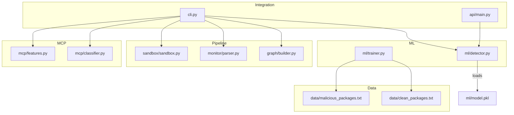
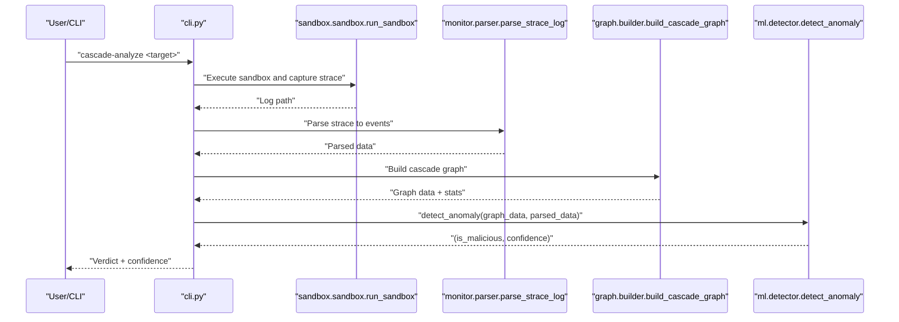
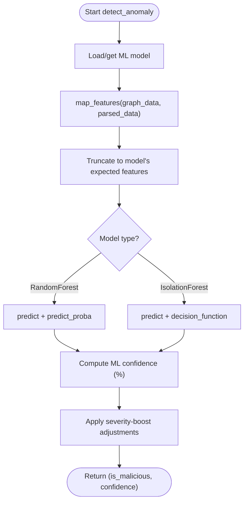
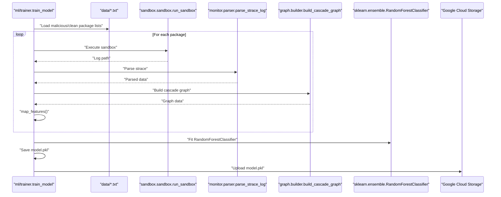
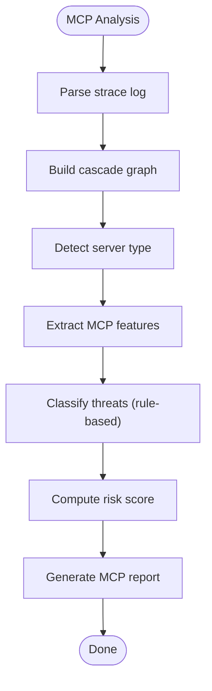
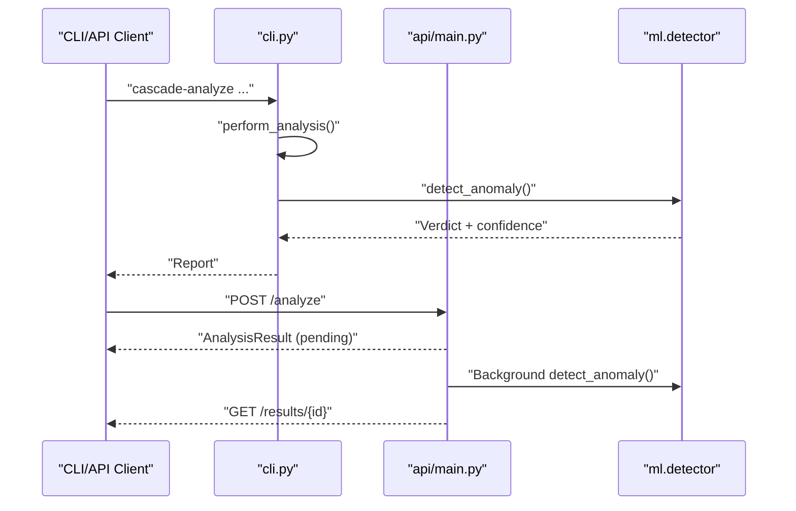
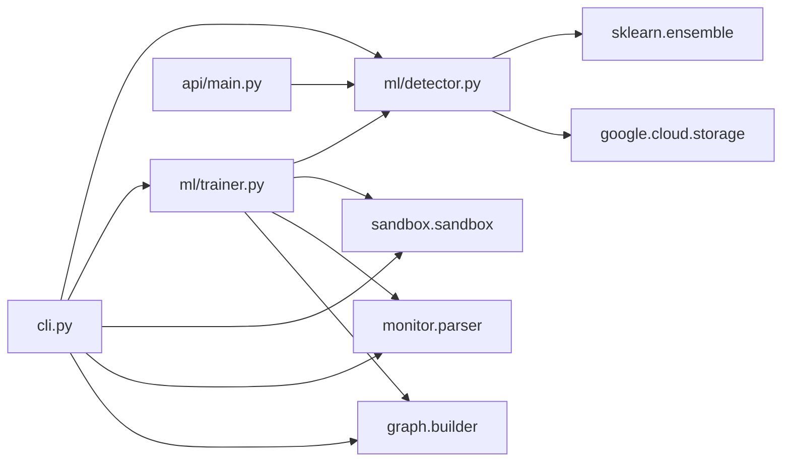

# Model Management

<cite>
**Referenced Files in This Document**
- [detector.py](file://ml/detector.py)
- [trainer.py](file://ml/trainer.py)
- [features.py](file://mcp/features.py)
- [classifier.py](file://mcp/classifier.py)
- [sandbox.py](file://sandbox/sandbox.py)
- [parser.py](file://monitor/parser.py)
- [builder.py](file://graph/builder.py)
- [cli.py](file://cli.py)
- [main.py](file://api/main.py)
- [malicious_packages.txt](file://data/malicious_packages.txt)
- [clean_packages.txt](file://data/clean_packages.txt)
</cite>

## Table of Contents
1. [Introduction](#introduction)
2. [Project Structure](#project-structure)
3. [Core Components](#core-components)
4. [Architecture Overview](#architecture-overview)
5. [Detailed Component Analysis](#detailed-component-analysis)
6. [Dependency Analysis](#dependency-analysis)
7. [Performance Considerations](#performance-considerations)
8. [Troubleshooting Guide](#troubleshooting-guide)
9. [Conclusion](#conclusion)
10. [Appendices](#appendices)

## Introduction
This document describes TraceTree’s machine learning model management system for anomaly detection and behavioral classification. It covers the model architecture (Random Forest and Isolation Forest), feature extraction pipelines, confidence scoring mechanisms, training workflow, model lifecycle management, and integration with the analysis pipeline. It also provides practical guidance for configuration, custom feature engineering, performance optimization, drift detection, and production deployment considerations.

## Project Structure
TraceTree organizes ML-related functionality primarily under the ml/ directory, with supporting modules for sandboxing, parsing, graph construction, MCP-specific features, and CLI/API integration.

**Diagram sources**
- [detector.py](file://ml/detector.py)
- [trainer.py](file://ml/trainer.py)
- [sandbox.py](file://sandbox/sandbox.py)
- [parser.py](file://monitor/parser.py)
- [builder.py](file://graph/builder.py)
- [features.py](file://mcp/features.py)
- [classifier.py](file://mcp/classifier.py)
- [cli.py](file://cli.py)
- [main.py](file://api/main.py)
- [malicious_packages.txt](file://data/malicious_packages.txt)
- [clean_packages.txt](file://data/clean_packages.txt)

**Section sources**
- [detector.py](file://ml/detector.py)
- [trainer.py](file://ml/trainer.py)
- [cli.py](file://cli.py)

## Core Components
- Machine Learning Detector: Implements feature extraction, anomaly detection, and confidence adjustment using a supervised Random Forest or an Isolation Forest fallback.
- Trainer: Orchestrates dataset preparation, sandbox execution, feature extraction, model training, and model publishing to cloud storage.
- MCP Feature Extraction and Classifier: Provides MCP-specific behavioral features and rule-based threat classification.
- Pipeline Modules: Sandbox execution, syscall parsing, and graph construction feed into the ML detector.
- CLI and API: Expose training, model updates, and inference endpoints.

Key responsibilities:
- Feature extraction: Numeric vectorization from graph and parsed syscall data.
- Confidence scoring: Combines ML predictions with severity and temporal evidence.
- Model lifecycle: Local caching, GCS synchronization, and fallback strategies.
- Training: Supervised learning on labeled packages with dataset management and cloud sync.

**Section sources**
- [detector.py](file://ml/detector.py)
- [trainer.py](file://ml/trainer.py)
- [features.py](file://mcp/features.py)
- [classifier.py](file://mcp/classifier.py)
- [sandbox.py](file://sandbox/sandbox.py)
- [parser.py](file://monitor/parser.py)
- [builder.py](file://graph/builder.py)

## Architecture Overview
The ML system integrates with the broader analysis pipeline to produce a final verdict and confidence score.

**Diagram sources**
- [cli.py](file://cli.py)
- [sandbox.py](file://sandbox/sandbox.py)
- [parser.py](file://monitor/parser.py)
- [builder.py](file://graph/builder.py)
- [detector.py](file://ml/detector.py)

## Detailed Component Analysis

### ML Detector: Feature Extraction, Models, and Confidence Scoring
- Feature extraction: Converts graph statistics and parsed syscall data into a numeric vector for the ML model. Includes counts and severity metrics derived from the graph and parsed events.
- Model selection: Loads a trained Random Forest if available locally or from GCS; falls back to an Isolation Forest trained on clean baselines.
- Confidence adjustment: Boosts ML confidence using severity thresholds, temporal patterns, and sensitive indicators, ensuring conservative decisions when severity is high.

**Diagram sources**
- [detector.py](file://ml/detector.py)

**Section sources**
- [detector.py](file://ml/detector.py)

### Trainer: Dataset Preparation, Hyperparameters, and Publishing
- Dataset preparation: Reads curated lists of malicious and clean packages from data/ and executes them in the sandbox sequentially.
- Feature extraction: Parses strace logs, builds cascade graphs, and extracts features for each sample.
- Model training: Fits a Random Forest with fixed hyperparameters and persists the model locally.
- Model publishing: Uploads the trained model to a shared GCS bucket for centralized distribution.

**Diagram sources**
- [trainer.py](file://ml/trainer.py)
- [sandbox.py](file://sandbox/sandbox.py)
- [parser.py](file://monitor/parser.py)
- [builder.py](file://graph/builder.py)
- [detector.py](file://ml/detector.py)

**Section sources**
- [trainer.py](file://ml/trainer.py)
- [malicious_packages.txt](file://data/malicious_packages.txt)
- [clean_packages.txt](file://data/clean_packages.txt)

### MCP-Specific Features and Rule-Based Classification
- MCP feature extraction: Parses strace logs to extract network behavior, process behavior, filesystem behavior, and injection response metrics, with support for adversarial probes and server type baselines.
- Rule-based classification: Applies predefined threat categories (e.g., command injection, credential exfiltration) and computes a risk score from triggered threats.

**Diagram sources**
- [features.py](file://mcp/features.py)
- [classifier.py](file://mcp/classifier.py)

**Section sources**
- [features.py](file://mcp/features.py)
- [classifier.py](file://mcp/classifier.py)

### Integration with CLI and API
- CLI: Provides commands to analyze packages, run training, update models from GCS, and perform MCP analysis. It orchestrates the full pipeline and prints rich, contextualized results.
- API: Exposes endpoints for asynchronous analysis submission and retrieval, with mock backend for demonstration.

**Diagram sources**
- [cli.py](file://cli.py)
- [main.py](file://api/main.py)
- [detector.py](file://ml/detector.py)

**Section sources**
- [cli.py](file://cli.py)
- [main.py](file://api/main.py)

## Dependency Analysis
The ML detector depends on scikit-learn models and Google Cloud Storage for model distribution. The trainer depends on sandbox execution, parsing, and graph building. The CLI coordinates all components and exposes training and update commands.

**Diagram sources**
- [detector.py](file://ml/detector.py)
- [trainer.py](file://ml/trainer.py)
- [cli.py](file://cli.py)
- [main.py](file://api/main.py)

**Section sources**
- [detector.py](file://ml/detector.py)
- [trainer.py](file://ml/trainer.py)
- [cli.py](file://cli.py)
- [main.py](file://api/main.py)

## Performance Considerations
- Model caching: The detector caches the loaded model in memory to avoid repeated deserialization. Clear the cache when updating the model to ensure fresh weights are used.
- Batch processing: During training, features are extracted sequentially. Consider batching and parallelizing sandbox executions for large-scale training.
- Strace parsing efficiency: Pre-compile regex patterns and minimize string allocations for very large logs.
- Model size: As noted in internal notes, large models increase I/O overhead; ensure model pruning and compression strategies if model size grows significantly.

Practical tips:
- Use the CLI training command to rebuild and publish models regularly.
- Monitor model freshness with the update command to pull the latest version from GCS.
- For production, prefer a managed inference service or containerized model server to reduce cold-start latency.

[No sources needed since this section provides general guidance]

## Troubleshooting Guide
Common issues and resolutions:
- Model loading failures: The detector attempts to load a local model.pkl; if unavailable or corrupted, it falls back to an Isolation Forest baseline. Use the update command to refresh the model from GCS.
- Training failures: Ensure dataset files exist and sandbox execution completes successfully. The trainer prints explicit errors when datasets are missing or feature extraction fails.
- GCS upload/download: Authentication is required for uploads; downloads use an anonymous client. Configure credentials for uploads if needed.

Operational checks:
- Verify Docker is running for sandbox execution.
- Confirm strace logs are generated and contain sufficient events.
- Validate that graph stats and parsed data include expected fields for the detector.

**Section sources**
- [detector.py](file://ml/detector.py)
- [trainer.py](file://ml/trainer.py)
- [sandbox.py](file://sandbox/sandbox.py)
- [parser.py](file://monitor/parser.py)
- [builder.py](file://graph/builder.py)

## Conclusion
TraceTree’s ML model management system combines a supervised Random Forest with an Isolation Forest fallback, robust feature extraction from syscall traces, and severity-aware confidence adjustment. The trainer automates dataset preparation, model training, and cloud publishing, while the CLI and API integrate seamlessly with the broader analysis pipeline. With proper caching, periodic retraining, and drift monitoring, the system delivers reliable anomaly detection and behavioral classification for production environments.

[No sources needed since this section summarizes without analyzing specific files]

## Appendices

### Practical Examples

- Model configuration
  - Use the CLI training command to train a new Random Forest model and publish it to GCS.
  - Update the deployed model from GCS using the update command to ensure all nodes use the latest version.
  - Reference: [train_cli](file://cli.py), [update_cli](file://cli.py), [update_model_from_gcs](file://ml/detector.py)

- Custom feature engineering
  - Extend the feature extraction function to incorporate additional graph or parsed data fields.
  - Reference: [map_features](file://ml/detector.py)

- Integration with the analysis pipeline
  - The CLI orchestrates sandboxing, parsing, graph building, and ML detection in a single workflow.
  - Reference: [perform_analysis](file://cli.py), [detect_anomaly](file://ml/detector.py)

- MCP-specific analysis
  - Use MCP feature extraction and rule-based classification to evaluate server behavior and compute risk scores.
  - Reference: [extract_mcp_features](file://mcp/features.py), [classify_mcp_threats](file://mcp/classifier.py)

- Drift detection and model lifecycle
  - Periodically retrain the model using the trainer and publish to GCS for centralized distribution.
  - Monitor model freshness and update nodes accordingly.
  - Reference: [train_model](file://ml/trainer.py), [get_ml_model](file://ml/detector.py)

**Section sources**
- [cli.py](file://cli.py)
- [detector.py](file://ml/detector.py)
- [trainer.py](file://ml/trainer.py)
- [features.py](file://mcp/features.py)
- [classifier.py](file://mcp/classifier.py)