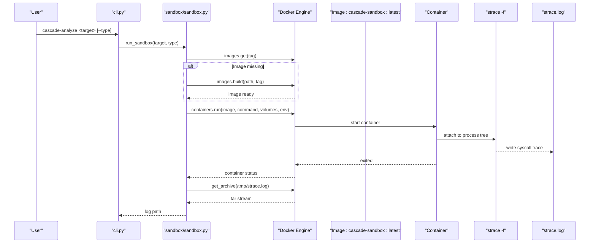
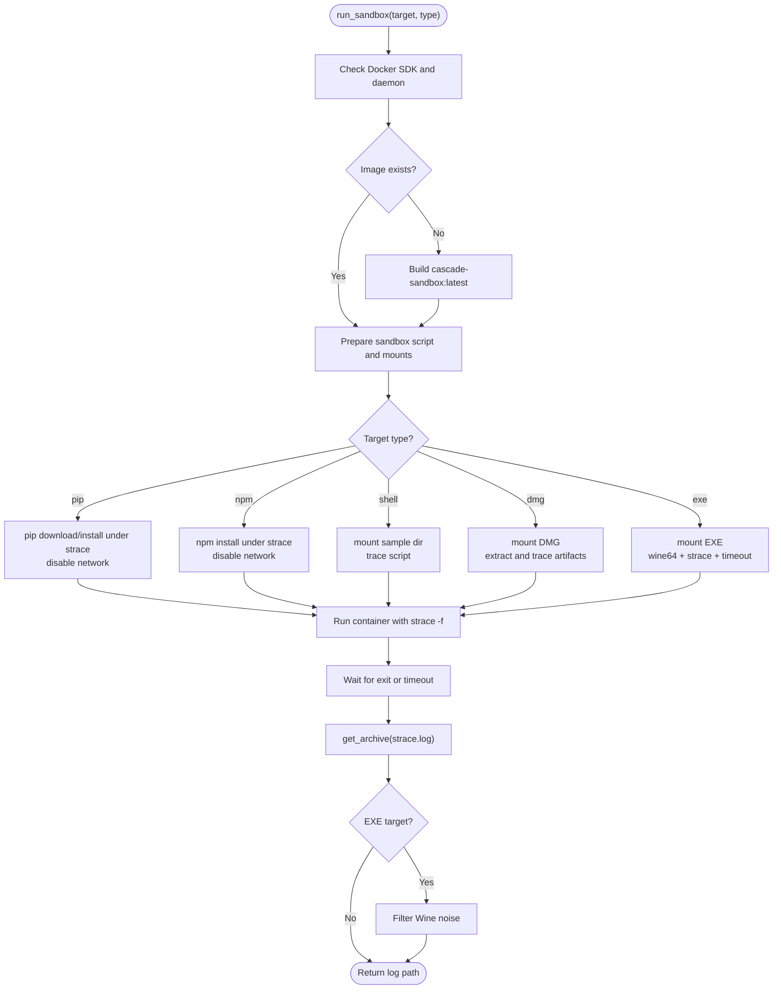
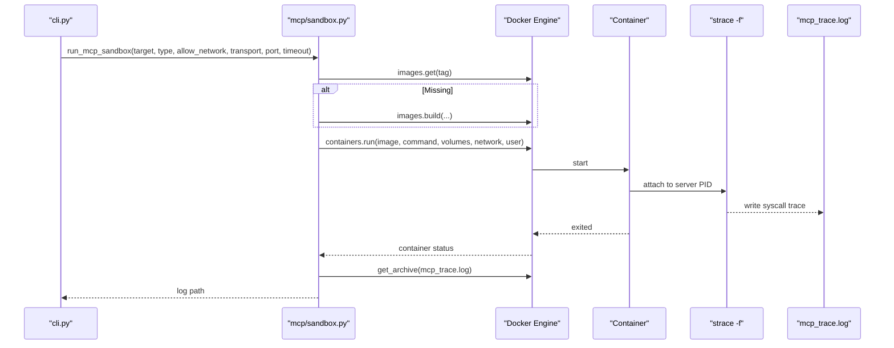
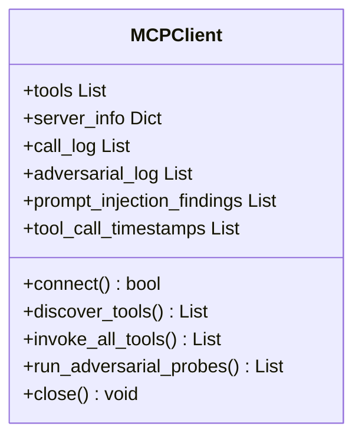
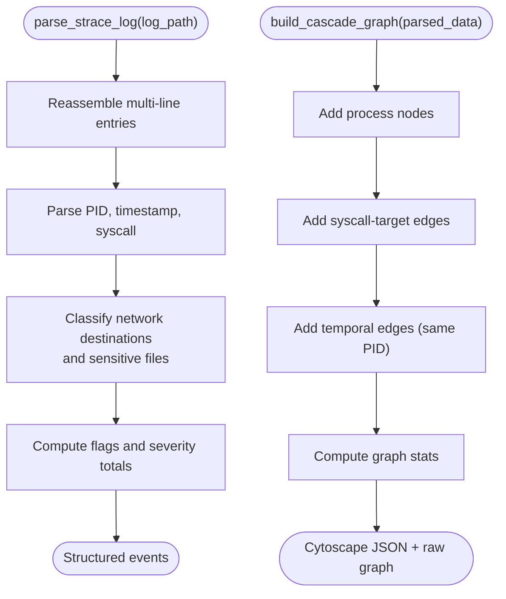
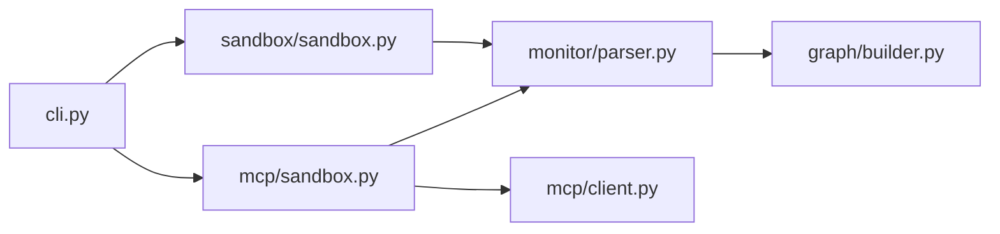

# Sandbox Management

<cite>
**Referenced Files in This Document**
- [sandbox/sandbox.py](file://sandbox/sandbox.py)
- [sandbox/Dockerfile](file://sandbox/Dockerfile)
- [mcp/sandbox.py](file://mcp/sandbox.py)
- [mcp/client.py](file://mcp/client.py)
- [cli.py](file://cli.py)
- [monitor/parser.py](file://monitor/parser.py)
- [graph/builder.py](file://graph/builder.py)
- [tests/mcp/test_sandbox_injection.py](file://tests/mcp/test_sandbox_injection.py)
- [README.md](file://README.md)
</cite>

## Table of Contents
1. [Introduction](#introduction)
2. [Project Structure](#project-structure)
3. [Core Components](#core-components)
4. [Architecture Overview](#architecture-overview)
5. [Detailed Component Analysis](#detailed-component-analysis)
6. [Dependency Analysis](#dependency-analysis)
7. [Performance Considerations](#performance-considerations)
8. [Troubleshooting Guide](#troubleshooting-guide)
9. [Conclusion](#conclusion)
10. [Appendices](#appendices)

## Introduction
This document explains TraceTree’s sandbox management system that orchestrates Docker-based containers to execute and analyze multi-target environments. It covers:
- Docker image building and container lifecycle management
- Network isolation and resource monitoring
- Multi-target execution: pip packages, npm packages, DMG extraction, and Windows EXE under Wine64
- Security model: capabilities, network restrictions, and process isolation
- Practical configuration, target handling, and troubleshooting
- Performance optimization and scaling guidance for production

## Project Structure
The sandbox system spans two primary modules:
- General-purpose sandbox for pip/npm/DMG/EXE targets
- MCP-specific sandbox for Model Context Protocol servers with strace-based tracing and JSON-RPC client simulation

```mermaid
graph TB
subgraph "CLI"
CLI["cli.py"]
end
subgraph "Sandbox"
SB["sandbox/sandbox.py"]
DF["sandbox/Dockerfile"]
end
subgraph "MCP Sandbox"
MCP_SB["mcp/sandbox.py"]
MCP_CLI["mcp/client.py"]
end
subgraph "Analysis Pipeline"
PARSER["monitor/parser.py"]
GRAPH["graph/builder.py"]
end
CLI --> SB
CLI --> MCP_SB
SB --> DF
MCP_SB --> DF
SB --> PARSER
MCP_SB --> PARSER
PARSER --> GRAPH
```

**Diagram sources**
- [cli.py:1-120](file://cli.py#L1-L120)
- [sandbox/sandbox.py:184-428](file://sandbox/sandbox.py#L184-L428)
- [sandbox/Dockerfile:1-11](file://sandbox/Dockerfile#L1-L11)
- [mcp/sandbox.py:41-146](file://mcp/sandbox.py#L41-L146)
- [mcp/client.py:18-473](file://mcp/client.py#L18-L473)
- [monitor/parser.py:342-682](file://monitor/parser.py#L342-L682)
- [graph/builder.py:8-196](file://graph/builder.py#L8-L196)

**Section sources**
- [README.md:306-329](file://README.md#L306-L329)

## Core Components
- General Sandbox Runner: orchestrates Docker image build, container run, strace tracing, and log retrieval for pip, npm, DMG, and EXE targets.
- MCP Sandbox Runner: runs MCP servers in a sandbox, attaches strace to the process tree, and simulates a JSON-RPC client to probe tools.
- Parser: converts strace logs into structured events with severity and temporal attributes.
- Graph Builder: constructs a NetworkX graph from parsed events for visualization and ML scoring.

Key responsibilities:
- Image provisioning and caching
- Target-type routing and volume mounting
- Network isolation via capability and interface manipulation
- Resource monitoring and filtering of Wine noise
- Safe command composition and injection prevention

**Section sources**
- [sandbox/sandbox.py:184-428](file://sandbox/sandbox.py#L184-L428)
- [mcp/sandbox.py:41-146](file://mcp/sandbox.py#L41-L146)
- [monitor/parser.py:342-682](file://monitor/parser.py#L342-L682)
- [graph/builder.py:8-196](file://graph/builder.py#L8-L196)

## Architecture Overview
The sandbox architecture enforces strict isolation and deterministic tracing:
- Docker image: Python slim base plus strace, Node.js, npm, Wine64, p7zip-full, and tools for binary analysis
- Container runtime: strace -f tracing with process tree capture; network disabled by dropping eth0 before execution
- Multi-target execution: pip/npm install, DMG extraction and execution, EXE execution under Wine64 with timeouts
- Post-execution: strace log retrieval, optional resource usage extraction, and Wine noise filtering



**Diagram sources**
- [cli.py:305-482](file://cli.py#L305-L482)
- [sandbox/sandbox.py:211-428](file://sandbox/sandbox.py#L211-L428)
- [sandbox/Dockerfile:1-11](file://sandbox/Dockerfile#L1-L11)

## Detailed Component Analysis

### General Sandbox Runner
Responsibilities:
- Determine target type and route to appropriate handler
- Build or reuse sandbox image
- Mount volumes for file targets (DMG/EXE)
- Drop network interface prior to execution
- Run strace -f and capture logs
- Retrieve logs and optional resource usage
- Filter Wine noise for EXE targets

Target types and behaviors:
- pip: downloads package, disables network, traces pip install, captures resource usage
- npm: dry-run to resolve, disables network, traces npm install, captures resource usage
- shell: validates path within workspace, mounts sample directory, traces script execution
- dmg: mounts DMG, executes strace on extracted artifacts (scripts, binaries, installers)
- exe: mounts EXE, runs under Wine64 with timeout, filters Wine initialization noise

Security controls:
- Capability NET_ADMIN added for network control
- Network disabled via ip link set eth0 down
- Volume mounts restricted to explicit paths
- Environment variables passed securely

Resource monitoring:
- Pre/post memory and disk usage captured for pip/npm
- Optional resource JSON embedded in log comments



**Diagram sources**
- [sandbox/sandbox.py:184-428](file://sandbox/sandbox.py#L184-L428)

**Section sources**
- [sandbox/sandbox.py:184-428](file://sandbox/sandbox.py#L184-L428)

### MCP Sandbox Runner
Purpose:
- Run MCP servers in a sandbox with strace -f
- Optionally allow network or block via network none
- Support stdio and HTTP/SSE transports
- Extract strace log and server info for downstream analysis

Key behaviors:
- Build or reuse sandbox image
- Compose server command based on npm or local path
- Construct sandbox script with transport-specific logic
- Run container with user-specified network policy
- Extract strace log and server_info.txt



**Diagram sources**
- [mcp/sandbox.py:41-146](file://mcp/sandbox.py#L41-L146)

**Section sources**
- [mcp/sandbox.py:41-146](file://mcp/sandbox.py#L41-L146)

### MCP Client Simulation
Role:
- Connects to MCP server (stdio or HTTP/SSE)
- Performs JSON-RPC 2.0 initialize handshake
- Discovers tools and invokes them with safe synthetic arguments
- Sends adversarial probes and records findings
- Provides prompt injection scans and tool call attribution

Security posture:
- Validates transport selection and endpoint reachability
- Generates safe defaults for tool arguments
- Applies injection payloads to detect vulnerabilities
- Emits findings for rule-based classification



**Diagram sources**
- [mcp/client.py:18-473](file://mcp/client.py#L18-L473)

**Section sources**
- [mcp/client.py:18-473](file://mcp/client.py#L18-L473)

### Parser and Graph Builder
Parser:
- Reassembles multi-line strace entries
- Parses timestamps and PID formats
- Classifies network destinations and sensitive file accesses
- Flags suspicious chains (e.g., reverse shell, credential theft)
- Computes severity-weighted totals

Graph Builder:
- Converts parsed events into a NetworkX directed graph
- Adds temporal edges for same-PID events within a window
- Tags nodes/edges with signature matches and severities
- Produces Cytoscape-compatible JSON and statistics



**Diagram sources**
- [monitor/parser.py:342-682](file://monitor/parser.py#L342-L682)
- [graph/builder.py:8-196](file://graph/builder.py#L8-L196)

**Section sources**
- [monitor/parser.py:342-682](file://monitor/parser.py#L342-L682)
- [graph/builder.py:8-196](file://graph/builder.py#L8-L196)

## Dependency Analysis
- CLI orchestrates both sandbox runners and the analysis pipeline
- Sandbox runners depend on Docker SDK for image build and container lifecycle
- Parser and Graph Builder form the analysis backbone
- MCP client depends on requests for HTTP transport and subprocess for stdio



**Diagram sources**
- [cli.py:196-304](file://cli.py#L196-L304)
- [sandbox/sandbox.py:184-428](file://sandbox/sandbox.py#L184-L428)
- [mcp/sandbox.py:41-146](file://mcp/sandbox.py#L41-L146)
- [monitor/parser.py:342-682](file://monitor/parser.py#L342-L682)
- [graph/builder.py:8-196](file://graph/builder.py#L8-L196)
- [mcp/client.py:18-473](file://mcp/client.py#L18-L473)

**Section sources**
- [cli.py:196-304](file://cli.py#L196-L304)

## Performance Considerations
- Image caching: Reuse of cascade-sandbox:latest avoids repeated builds
- Network drop timing: Disabling eth0 before execution reduces overhead and prevents unwanted egress
- Timeout tuning: Different target types use different timeouts (pip/npm: 60s, dmg: 120s, exe: 180s)
- Resource monitoring: Lightweight pre/post measurements minimize overhead
- Wine noise filtering: Reduces log size and improves signal-to-noise ratio for EXE analysis
- Scaling: Run multiple containers concurrently with proper queueing and resource limits; consider Docker resource constraints and cgroups

[No sources needed since this section provides general guidance]

## Troubleshooting Guide
Common issues and resolutions:
- Docker SDK not installed or daemon unreachable
  - Ensure docker Python SDK is installed and Docker daemon is running
  - The CLI performs a preflight check and provides OS-specific guidance
- Image build failures
  - Verify Docker has network access and sufficient disk space
  - Re-run after fixing Docker connectivity
- Target not found or path traversal errors
  - Pip/npm targets must be valid package identifiers
  - Shell targets must reside within the workspace root
  - DMG/EXE targets must exist and be readable
- Wine64 not available
  - The EXE analyzer checks for wine64 presence and reports “WINE64 NOT AVAILABLE”
- Timeouts
  - EXE targets timeout after 30s; GUI apps may require manual intervention
  - DMG analysis may exceed 120s depending on extraction complexity
- Empty or minimal logs
  - Some targets produce no syscalls; the sandbox writes diagnostic messages indicating the cause
- Network restrictions
  - Network is disabled by default; enable with allow_network for legitimate outbound access

**Section sources**
- [cli.py:74-111](file://cli.py#L74-L111)
- [sandbox/sandbox.py:198-220](file://sandbox/sandbox.py#L198-L220)
- [sandbox/sandbox.py:280-315](file://sandbox/sandbox.py#L280-L315)
- [sandbox/sandbox.py:306-312](file://sandbox/sandbox.py#L306-L312)
- [sandbox/sandbox.py:335-351](file://sandbox/sandbox.py#L335-L351)
- [sandbox/sandbox.py:398-406](file://sandbox/sandbox.py#L398-L406)

## Conclusion
TraceTree’s sandbox management system provides a robust, secure, and repeatable framework for analyzing diverse targets in isolation. By combining Docker containerization, strace-based syscall tracing, and structured analysis, it enables detection of suspicious behavior across Python, Node.js, macOS DMG, and Windows EXE targets. The MCP module extends this capability to protocol servers with JSON-RPC client simulation and rule-based threat classification. For production deployments, focus on image caching, resource limits, and careful timeout tuning to balance accuracy and throughput.

[No sources needed since this section summarizes without analyzing specific files]

## Appendices

### Security Model Summary
- Capabilities: NET_ADMIN granted for network control
- Network: eth0 disabled via ip link set eth0 down
- Volumes: Explicit bind mounts for file targets only
- User: Containers run as root for MCP sandbox; general sandbox uses default user
- Process isolation: strace -f traces entire process tree

**Section sources**
- [sandbox/sandbox.py:319-327](file://sandbox/sandbox.py#L319-L327)
- [mcp/sandbox.py:108-117](file://mcp/sandbox.py#L108-L117)

### Practical Configuration Examples
- Analyze a pip package
  - Command: cascade-analyze <package>
  - Behavior: pip download/install under strace; network disabled before install
- Analyze an npm package
  - Command: cascade-analyze package.json
  - Behavior: npm install under strace; network disabled after dry-run
- Analyze a DMG
  - Command: cascade-analyze <file.dmg> --type dmg
  - Behavior: 7z extraction; strace on scripts, binaries, and installers
- Analyze an EXE
  - Command: cascade-analyze <payload.exe> --type exe
  - Behavior: wine64 execution under strace with 30s timeout; Wine noise filtered
- MCP server analysis
  - Command: cascade-analyze mcp --npm <package> [--allow-network] [--transport stdio|http] [--port 3000]
  - Behavior: sandbox with strace -f; JSON-RPC client simulates tool discovery and probes

**Section sources**
- [cli.py:305-482](file://cli.py#L305-L482)
- [README.md:95-103](file://README.md#L95-L103)

### Injection Prevention Tests (MCP)
- Validates shell quoting and safe port handling
- Ensures transport and server info are safely echoed without shell expansion

**Section sources**
- [tests/mcp/test_sandbox_injection.py:1-57](file://tests/mcp/test_sandbox_injection.py#L1-L57)