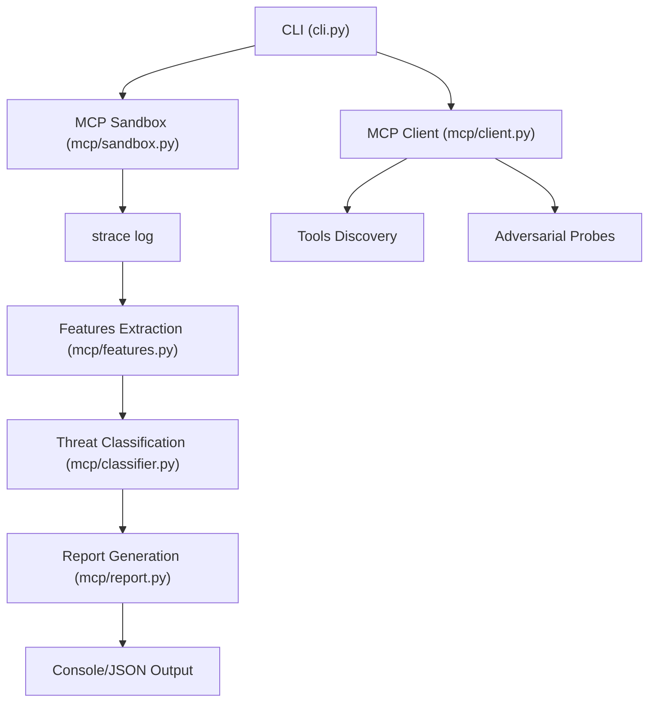
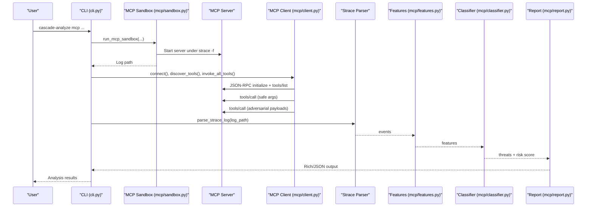
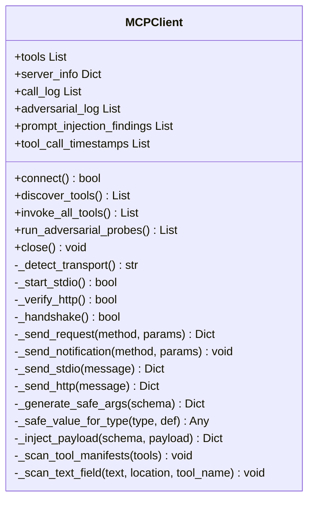
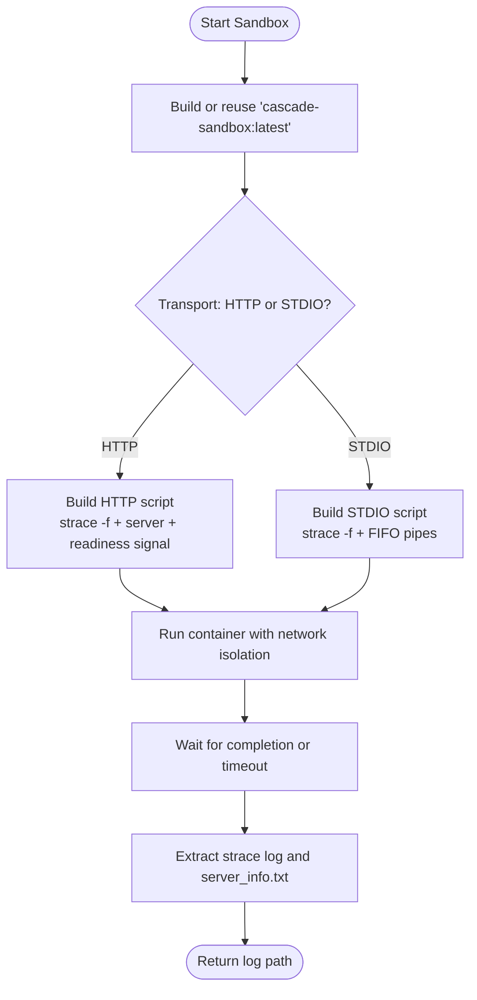
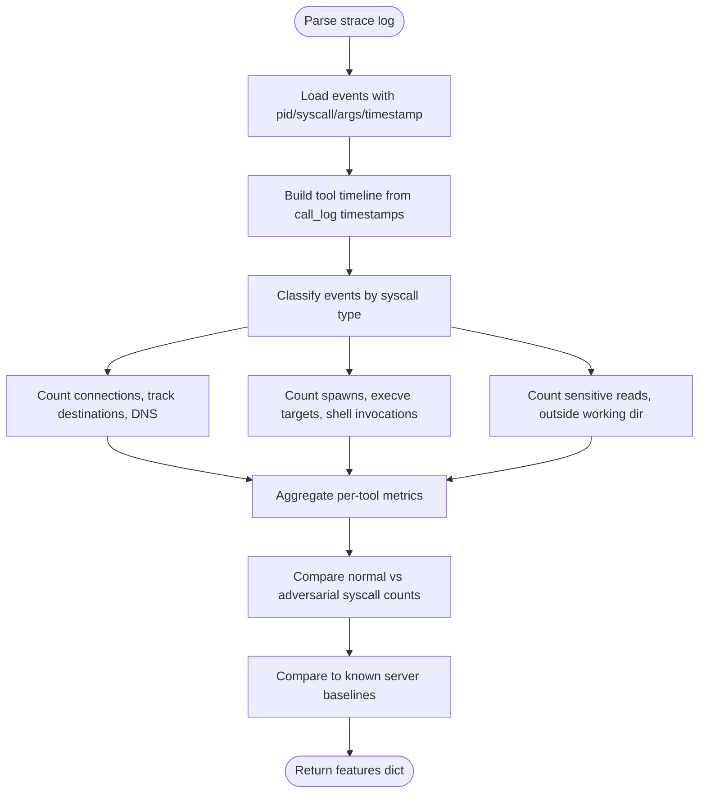
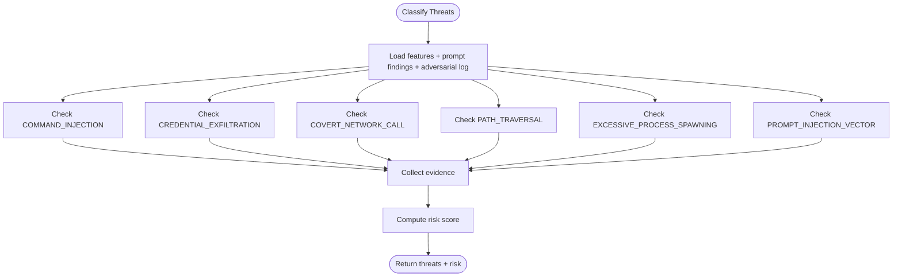
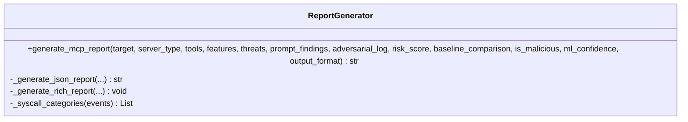
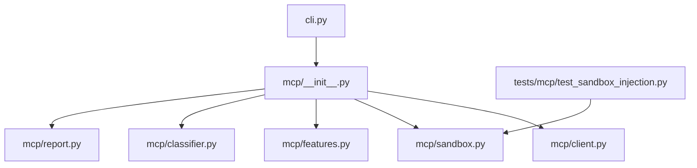

# MCP Client Simulation and Tool Discovery

<cite>
**Referenced Files in This Document**
- [client.py](file://mcp/client.py)
- [features.py](file://mcp/features.py)
- [classifier.py](file://mcp/classifier.py)
- [sandbox.py](file://mcp/sandbox.py)
- [report.py](file://mcp/report.py)
- [__init__.py](file://mcp/__init__.py)
- [cli.py](file://cli.py)
- [README.md](file://README.md)
- [test_sandbox_injection.py](file://tests/mcp/test_sandbox_injection.py)
- [Dockerfile](file://sandbox/Dockerfile)
</cite>

## Table of Contents
1. [Introduction](#introduction)
2. [Project Structure](#project-structure)
3. [Core Components](#core-components)
4. [Architecture Overview](#architecture-overview)
5. [Detailed Component Analysis](#detailed-component-analysis)
6. [Dependency Analysis](#dependency-analysis)
7. [Performance Considerations](#performance-considerations)
8. [Troubleshooting Guide](#troubleshooting-guide)
9. [Conclusion](#conclusion)
10. [Appendices](#appendices)

## Introduction
This document explains the MCP client simulation and tool discovery system within TraceTree. It focuses on how a simulated JSON-RPC client connects to MCP servers, discovers tools, invokes them safely, and runs adversarial probes to uncover vulnerabilities. It documents the MCP-specific feature extraction pipeline that captures per-tool network connections, shell invocations, and sensitive file operations, and presents the rule-based threat classification for six categories: COMMAND_INJECTION, CREDENTIAL_EXFILTRATION, COVERT_NETWORK_CALL, PATH_TRAVERSAL, EXCESSIVE_PROCESS_SPAWNING, and PROMPT_INJECTION_VECTOR. The guide also provides examples of simulating client interactions with different MCP server implementations and analyzing the resulting behavioral patterns.

## Project Structure
The MCP module is organized into cohesive components that orchestrate sandboxing, client simulation, feature extraction, classification, and reporting. The CLI integrates these components into a single workflow for analyzing MCP servers.

**Diagram sources**
- [cli.py:564-744](file://cli.py#L564-L744)
- [sandbox.py:41-146](file://mcp/sandbox.py#L41-L146)
- [client.py:78-195](file://mcp/client.py#L78-L195)
- [features.py:32-206](file://mcp/features.py#L32-L206)
- [classifier.py:61-96](file://mcp/classifier.py#L61-L96)
- [report.py:27-74](file://mcp/report.py#L27-L74)

**Section sources**
- [README.md:265-320](file://README.md#L265-L320)
- [__init__.py:9-21](file://mcp/__init__.py#L9-L21)

## Core Components
- MCPClient: Simulates a JSON-RPC 2.0 client to connect to MCP servers, perform the initialize handshake, discover tools, invoke them with safe synthetic arguments, and run adversarial probes.
- MCP Sandbox: Runs MCP servers in a Docker container with strace -f instrumentation, network isolation, and controlled environment.
- Feature Extraction: Parses strace logs and extracts MCP-specific features grouped by tool-call activity.
- Threat Classifier: Applies rule-based checks to identify six threat categories.
- Report Generator: Produces Rich console or JSON reports summarizing tools, findings, and risk.

**Section sources**
- [client.py:18-73](file://mcp/client.py#L18-L73)
- [sandbox.py:41-146](file://mcp/sandbox.py#L41-L146)
- [features.py:32-206](file://mcp/features.py#L32-L206)
- [classifier.py:20-58](file://mcp/classifier.py#L20-L58)
- [report.py:27-74](file://mcp/report.py#L27-L74)

## Architecture Overview
The MCP analysis pipeline integrates sandboxing, client simulation, and behavioral analysis:

**Diagram sources**
- [cli.py:615-744](file://cli.py#L615-L744)
- [sandbox.py:148-232](file://mcp/sandbox.py#L148-L232)
- [client.py:78-195](file://mcp/client.py#L78-L195)
- [features.py:108-206](file://mcp/features.py#L108-L206)
- [classifier.py:61-96](file://mcp/classifier.py#L61-L96)
- [report.py:27-74](file://mcp/report.py#L27-L74)

## Detailed Component Analysis

### MCP Client Simulation
The MCP client simulates a JSON-RPC 2.0 client to:
- Auto-detect transport (stdio vs HTTP/SSE) based on configuration.
- Connect to the server and perform the initialize handshake.
- Discover tools via tools/list and statically scan tool manifests for prompt injection indicators.
- Invoke each tool with safe synthetic arguments derived from JSON schemas.
- Re-invoke tools with adversarial payloads to detect unsafe behavior.

Key capabilities:
- Transport selection and connection verification.
- JSON-RPC request/notification framing and transport-specific sending.
- Synthetic argument generation respecting schema types and required fields.
- Adversarial payload injection targeting string fields.
- Static prompt injection scanning for zero-width characters and injection language patterns.

**Diagram sources**
- [client.py:18-473](file://mcp/client.py#L18-L473)

**Section sources**
- [client.py:78-195](file://mcp/client.py#L78-L195)
- [client.py:364-417](file://mcp/client.py#L364-L417)
- [client.py:423-473](file://mcp/client.py#L423-L473)

### MCP Sandbox
The MCP sandbox runs the server in a Docker container with:
- strace -f tracing syscalls across the process tree.
- Network isolation by default (ip link set eth0 down) unless explicitly allowed.
- Read-only mount of the server package for stdio or local path.
- Non-root user and configurable timeout.
- Scripted startup for HTTP and stdio transports, capturing server PID/port and transport mode.

Security and isolation:
- Image built from python:3.11-slim with strace, Node.js, wine64, and extraction tools.
- Controlled environment prevents unintended network access and reduces attack surface.

**Diagram sources**
- [sandbox.py:41-146](file://mcp/sandbox.py#L41-L146)
- [sandbox.py:148-232](file://mcp/sandbox.py#L148-L232)
- [Dockerfile:1-11](file://sandbox/Dockerfile#L1-L11)

**Section sources**
- [sandbox.py:41-146](file://mcp/sandbox.py#L41-L146)
- [sandbox.py:148-232](file://mcp/sandbox.py#L148-L232)
- [Dockerfile:1-11](file://sandbox/Dockerfile#L1-L11)

### Feature Extraction Pipeline
The MCP feature extractor parses strace logs and builds per-tool behavioral summaries:
- Network behavior: outbound connections, DNS lookups, destinations, and per-tool counts.
- Process behavior: child process spawns, shell invocations, unexpected binary executions, execve targets.
- Filesystem behavior: reads outside working directory, sensitive path accesses, writes during read-only tool calls.
- Injection response: behavior change under adversarial input, shell spawns during injection, syscall delta.
- Baseline comparison: compares observed behavior against known server type baselines (filesystem, github, postgres, fetch, shell).

Timestamp attribution:
- Maps strace event timestamps to tool call timestamps to attribute syscalls to specific tools.

**Diagram sources**
- [features.py:32-206](file://mcp/features.py#L32-L206)
- [features.py:209-238](file://mcp/features.py#L209-L238)
- [features.py:241-267](file://mcp/features.py#L241-L267)
- [features.py:341-384](file://mcp/features.py#L341-L384)

**Section sources**
- [features.py:32-206](file://mcp/features.py#L32-L206)
- [features.py:209-238](file://mcp/features.py#L209-L238)
- [features.py:241-267](file://mcp/features.py#L241-L267)
- [features.py:341-473](file://mcp/features.py#L341-L473)

### Threat Classification
Rule-based classification evaluates extracted features against six categories:
- COMMAND_INJECTION: Shell spawned during or near adversarial probe; significant behavior change under adversarial input; server crashes under probes.
- CREDENTIAL_EXFILTRATION: Credential-related file accesses followed by network connections.
- COVERT_NETWORK_CALL: Unexpected outbound connections; DNS lookups during tool calls.
- PATH_TRAVERSAL: Reads outside working directory; sensitive path accesses.
- EXCESSIVE_PROCESS_SPAWNING: Child processes exceed thresholds relative to tool calls.
- PROMPT_INJECTION_VECTOR: Zero-width characters and prompt injection language in tool names, descriptions, or parameter descriptions.

Risk scoring aggregates severity and count thresholds.

**Diagram sources**
- [classifier.py:61-96](file://mcp/classifier.py#L61-L96)
- [classifier.py:99-127](file://mcp/classifier.py#L99-L127)
- [classifier.py:130-151](file://mcp/classifier.py#L130-L151)
- [classifier.py:154-172](file://mcp/classifier.py#L154-L172)
- [classifier.py:175-186](file://mcp/classifier.py#L175-L186)
- [classifier.py:189-204](file://mcp/classifier.py#L189-L204)
- [classifier.py:207-222](file://mcp/classifier.py#L207-L222)
- [classifier.py:225-236](file://mcp/classifier.py#L225-L236)
- [classifier.py:239-268](file://mcp/classifier.py#L239-L268)

**Section sources**
- [classifier.py:20-58](file://mcp/classifier.py#L20-L58)
- [classifier.py:61-96](file://mcp/classifier.py#L61-L96)
- [classifier.py:130-151](file://mcp/classifier.py#L130-L151)
- [classifier.py:154-172](file://mcp/classifier.py#L154-L172)
- [classifier.py:175-186](file://mcp/classifier.py#L175-L186)
- [classifier.py:189-204](file://mcp/classifier.py#L189-L204)
- [classifier.py:207-222](file://mcp/classifier.py#L207-L222)
- [classifier.py:225-236](file://mcp/classifier.py#L225-L236)
- [classifier.py:239-268](file://mcp/classifier.py#L239-L268)

### Report Generation
The report generator creates either a Rich console panel or a JSON object containing:
- Tool manifest (names, descriptions, parameter schemas).
- Prompt injection scan results.
- Per-tool syscall summaries.
- Threat detections with evidence.
- Adversarial probe results.
- Overall risk score.
- Baseline comparison.

**Diagram sources**
- [report.py:27-322](file://mcp/report.py#L27-L322)

**Section sources**
- [report.py:27-74](file://mcp/report.py#L27-L74)
- [report.py:76-134](file://mcp/report.py#L76-L134)
- [report.py:136-302](file://mcp/report.py#L136-L302)
- [report.py:304-322](file://mcp/report.py#L304-L322)

## Dependency Analysis
The MCP module exposes a public API through its package initializer and is orchestrated by the CLI. Internal dependencies are minimal, promoting modularity and testability.

**Diagram sources**
- [__init__.py:9-21](file://mcp/__init__.py#L9-L21)
- [cli.py:606-614](file://cli.py#L606-L614)
- [test_sandbox_injection.py:1-57](file://tests/mcp/test_sandbox_injection.py#L1-L57)

**Section sources**
- [__init__.py:9-21](file://mcp/__init__.py#L9-L21)
- [cli.py:606-614](file://cli.py#L606-L614)
- [test_sandbox_injection.py:1-57](file://tests/mcp/test_sandbox_injection.py#L1-L57)

## Performance Considerations
- Transport overhead: HTTP/SSE transport introduces network latency; stdio transport avoids network but requires careful process management.
- Tool invocation delay: The tool_delay parameter controls inter-call pacing; tuning affects coverage vs. runtime.
- Feature extraction cost: Parsing large strace logs scales with event count; baseline comparisons add minimal overhead.
- Baseline computation: Known baselines enable quick deviation checks; server type detection helps focus analysis.

## Troubleshooting Guide
Common issues and mitigations:
- Docker not installed or unreachable: The CLI checks for the Docker SDK and daemon; ensure Docker is installed and running.
- Sandbox image build failures: The sandbox builds the image on demand; verify network connectivity and permissions.
- No strace log produced: The sandbox returns empty logs for unsupported targets or when extraction fails; confirm target type and path.
- Transport misconfiguration: For HTTP transport, ensure the port is reachable; for stdio, verify the server command and environment.
- Injection tests: The sandbox injection tests validate command building and quoting; review test outputs for escaping issues.

**Section sources**
- [cli.py:74-111](file://cli.py#L74-L111)
- [sandbox.py:63-84](file://mcp/sandbox.py#L63-L84)
- [sandbox.py:137-146](file://mcp/sandbox.py#L137-L146)
- [test_sandbox_injection.py:4-57](file://tests/mcp/test_sandbox_injection.py#L4-L57)

## Conclusion
The MCP client simulation and tool discovery system integrates sandboxing, JSON-RPC client emulation, and MCP-specific behavioral analysis to detect security risks in Model Context Protocol servers. By combining safe tool invocation, adversarial probing, and rule-based classification, it provides actionable insights into command injection, credential theft, covert network activity, path traversal, excessive process spawning, and prompt injection vectors. The modular design enables easy extension and testing, while the CLI orchestrates the entire workflow for practical use.

## Appendices

### Example Workflows
- Analyze an npm MCP server:
  - Use the CLI subcommand to run the sandbox, simulate the client, extract features, classify threats, and generate a report.
- Analyze a local MCP server project:
  - Mount the local path and run the sandbox with stdio transport; the client will attribute syscalls to tool calls via timestamps.
- Allow network for legitimate servers:
  - Enable network access in the sandbox to permit expected outbound connections; the feature extractor will flag unexpected destinations.

**Section sources**
- [cli.py:564-744](file://cli.py#L564-L744)
- [README.md:265-305](file://README.md#L265-L305)