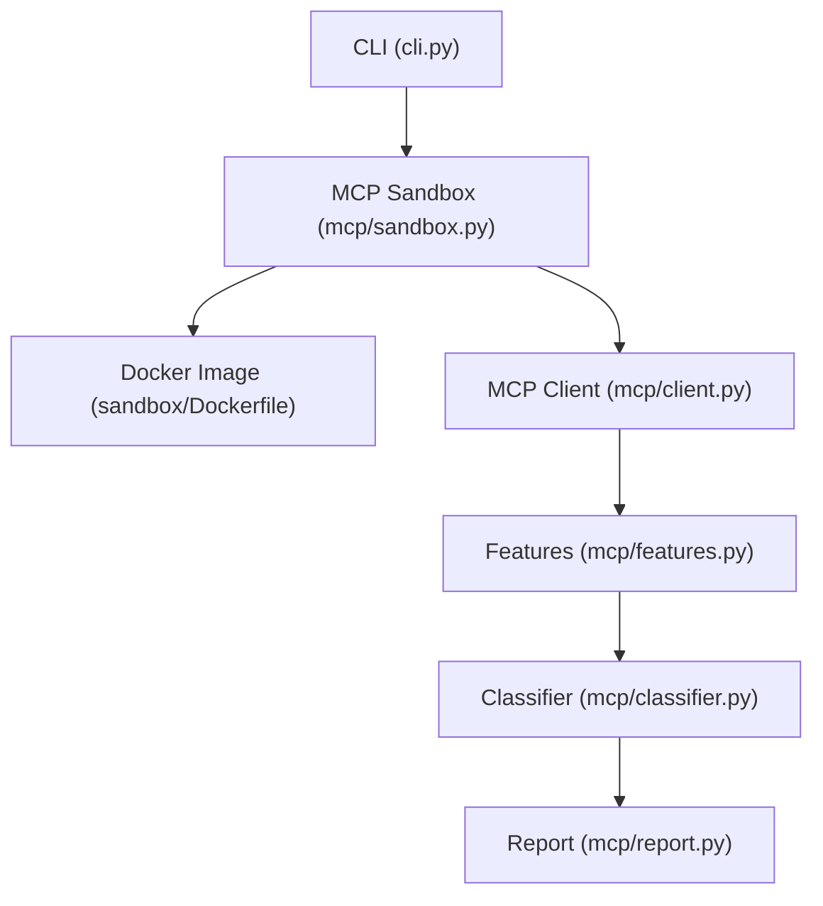
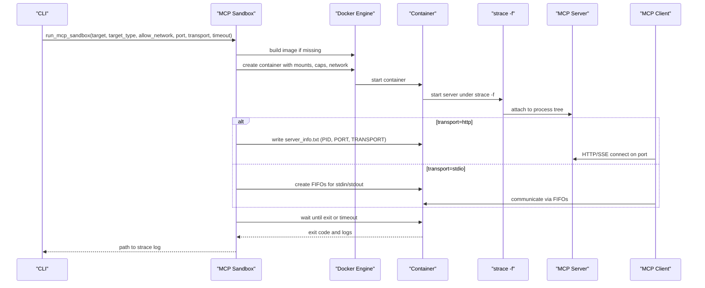
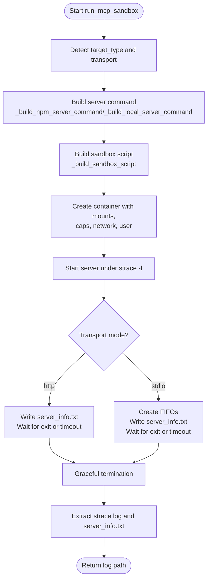
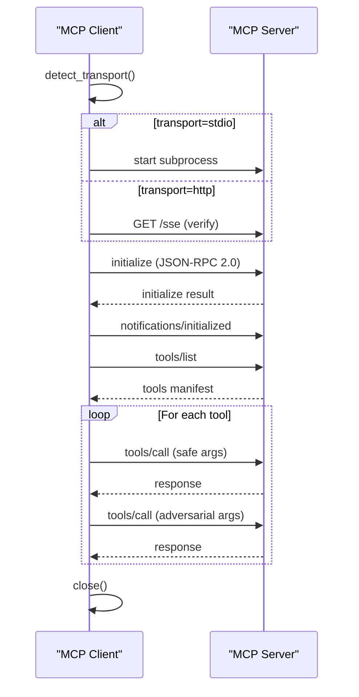
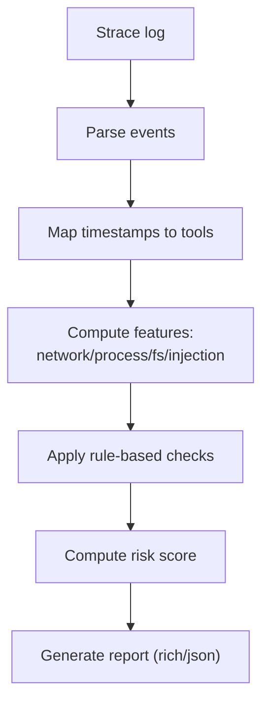
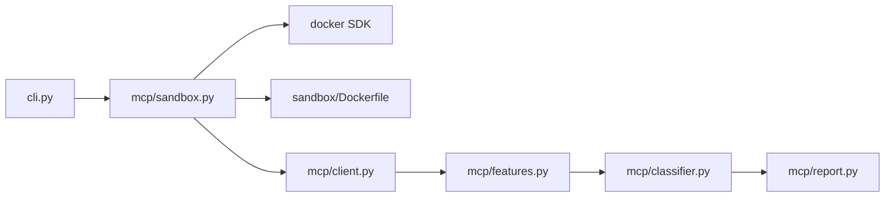

# MCP Sandbox Management

<cite>
**Referenced Files in This Document**
- [mcp/sandbox.py](file://mcp/sandbox.py)
- [mcp/client.py](file://mcp/client.py)
- [mcp/features.py](file://mcp/features.py)
- [mcp/classifier.py](file://mcp/classifier.py)
- [mcp/report.py](file://mcp/report.py)
- [cli.py](file://cli.py)
- [sandbox/Dockerfile](file://sandbox/Dockerfile)
- [tests/mcp/test_sandbox_injection.py](file://tests/mcp/test_sandbox_injection.py)
</cite>

## Table of Contents
1. [Introduction](#introduction)
2. [Project Structure](#project-structure)
3. [Core Components](#core-components)
4. [Architecture Overview](#architecture-overview)
5. [Detailed Component Analysis](#detailed-component-analysis)
6. [Dependency Analysis](#dependency-analysis)
7. [Performance Considerations](#performance-considerations)
8. [Troubleshooting Guide](#troubleshooting-guide)
9. [Conclusion](#conclusion)
10. [Appendices](#appendices)

## Introduction
This document describes the MCP-specific Docker sandbox management system used to securely execute and analyze Model Context Protocol (MCP) servers. It explains the containerized execution environment, including strace -f instrumentation, network isolation, read-only volume mounts, non-root user execution, and configurable timeouts. It documents the two transport modes (stdio and http), their command-building processes, and the server startup procedures for npm packages and local projects. It also covers MCP syscall filtering for analysis, container lifecycle management, and practical sandbox configuration examples.

## Project Structure
The MCP sandbox lives under the mcp/ package and integrates with the broader TraceTree CLI and sandbox infrastructure. Key elements:
- MCP sandbox orchestration and command building
- MCP client simulator for JSON-RPC 2.0 handshakes and tool invocation
- MCP feature extraction and threat classification
- Report generation for human-readable and JSON outputs
- CLI entrypoints for MCP analysis
- Shared Docker image definition for sandbox runtime

**Diagram sources**
- [cli.py:563-744](file://cli.py#L563-L744)
- [mcp/sandbox.py:41-146](file://mcp/sandbox.py#L41-L146)
- [mcp/client.py:18-473](file://mcp/client.py#L18-L473)
- [mcp/features.py:32-473](file://mcp/features.py#L32-L473)
- [mcp/classifier.py:61-268](file://mcp/classifier.py#L61-L268)
- [mcp/report.py:27-322](file://mcp/report.py#L27-L322)
- [sandbox/Dockerfile:1-11](file://sandbox/Dockerfile#L1-L11)

**Section sources**
- [cli.py:563-744](file://cli.py#L563-L744)
- [mcp/sandbox.py:41-146](file://mcp/sandbox.py#L41-L146)
- [mcp/client.py:18-473](file://mcp/client.py#L18-L473)
- [mcp/features.py:32-473](file://mcp/features.py#L32-L473)
- [mcp/classifier.py:61-268](file://mcp/classifier.py#L61-L268)
- [mcp/report.py:27-322](file://mcp/report.py#L27-L322)
- [sandbox/Dockerfile:1-11](file://sandbox/Dockerfile#L1-L11)

## Core Components
- MCP Sandbox orchestrator: Builds the container command, starts the server, attaches strace -f, manages network isolation, and extracts logs.
- MCP Client simulator: Connects to the server (stdio or http), performs JSON-RPC 2.0 handshake, discovers tools, invokes them with safe synthetic arguments, and runs adversarial probes.
- MCP Feature extractor: Parses strace logs and extracts MCP-specific features grouped by tool-call activity.
- Classifier and report generator: Applies rule-based threat checks and produces human-readable or JSON reports.

**Section sources**
- [mcp/sandbox.py:41-146](file://mcp/sandbox.py#L41-L146)
- [mcp/client.py:18-473](file://mcp/client.py#L18-L473)
- [mcp/features.py:32-473](file://mcp/features.py#L32-L473)
- [mcp/classifier.py:61-268](file://mcp/classifier.py#L61-L268)
- [mcp/report.py:27-322](file://mcp/report.py#L27-L322)

## Architecture Overview
The MCP sandbox creates a Docker container with:
- strace -f instrumentation capturing execve, open/openat, connect, fork, and other relevant syscalls
- Network isolation via --network none by default
- Read-only mount of the server package for local projects
- Non-root user execution
- Configurable timeout for the analysis session

Two transport modes are supported:
- stdio: The server runs under strace and communicates via named pipes; the external client uses the container’s stdin/stdout.
- http: The server runs under strace and listens on a port; the external client connects externally.

**Diagram sources**
- [mcp/sandbox.py:85-146](file://mcp/sandbox.py#L85-L146)
- [mcp/sandbox.py:148-232](file://mcp/sandbox.py#L148-L232)
- [mcp/client.py:78-96](file://mcp/client.py#L78-L96)
- [mcp/client.py:229-264](file://mcp/client.py#L229-L264)

## Detailed Component Analysis

### MCP Sandbox Orchestration
Key responsibilities:
- Build the container command based on transport and target type
- Apply network isolation and capabilities
- Mount server code (local) or install npm package globally
- Start the server under strace -f and capture syscalls
- Manage container lifecycle with timeouts and graceful shutdown
- Extract strace logs and server info metadata

Command building and transport modes:
- HTTP transport: Starts the server in the background, writes server_info.txt with PID, port, and transport, waits for completion, then terminates the server gracefully.
- Stdio transport: Creates named pipes for stdin/stdout, starts the server under strace -f, writes server_info.txt with PID and transport, waits for completion, then terminates the server gracefully.

Network isolation and security:
- By default, network is isolated via ip link set eth0 down inside the container.
- Capabilities include NET_ADMIN to enable network control when needed.
- Local projects are mounted read-only at /mcp-server.

Timeouts:
- Configurable timeout controls the maximum duration of the analysis session.

**Diagram sources**
- [mcp/sandbox.py:41-146](file://mcp/sandbox.py#L41-L146)
- [mcp/sandbox.py:148-232](file://mcp/sandbox.py#L148-L232)
- [mcp/sandbox.py:235-271](file://mcp/sandbox.py#L235-L271)

**Section sources**
- [mcp/sandbox.py:41-146](file://mcp/sandbox.py#L41-L146)
- [mcp/sandbox.py:148-232](file://mcp/sandbox.py#L148-L232)
- [mcp/sandbox.py:235-271](file://mcp/sandbox.py#L235-L271)

### MCP Client Simulator
Responsibilities:
- Auto-detect transport mode if not provided
- For stdio: spawn a subprocess with stdin/stdout/stderr
- For http: verify HTTP/SSE endpoint availability
- Perform JSON-RPC 2.0 initialize handshake and notifications
- Discover tools and invoke them with safe synthetic arguments
- Run adversarial probes and record outcomes
- Close the stdio subprocess cleanly

**Diagram sources**
- [mcp/client.py:78-96](file://mcp/client.py#L78-L96)
- [mcp/client.py:229-264](file://mcp/client.py#L229-L264)
- [mcp/client.py:265-289](file://mcp/client.py#L265-L289)
- [mcp/client.py:97-184](file://mcp/client.py#L97-L184)

**Section sources**
- [mcp/client.py:18-473](file://mcp/client.py#L18-L473)

### MCP Feature Extraction and Classification
Feature extraction parses strace logs and groups events by tool-call activity:
- Network behavior: outbound connections, DNS lookups, unexpected destinations
- Process behavior: child process spawning, shell invocation, execve targets
- Filesystem behavior: sensitive path reads, off-working-dir reads
- Injection response: adversarial syscall deltas, shell spawn on injection

Classification applies rule-based checks to derive threat categories:
- COMMAND_INJECTION
- CREDENTIAL_EXFILTRATION
- COVERT_NETWORK_CALL
- PATH_TRAVERSAL
- EXCESSIVE_PROCESS_SPAWNING
- PROMPT_INJECTION_VECTOR

**Diagram sources**
- [mcp/features.py:32-206](file://mcp/features.py#L32-L206)
- [mcp/classifier.py:61-268](file://mcp/classifier.py#L61-L268)
- [mcp/report.py:27-322](file://mcp/report.py#L27-L322)

**Section sources**
- [mcp/features.py:32-473](file://mcp/features.py#L32-L473)
- [mcp/classifier.py:61-268](file://mcp/classifier.py#L61-L268)
- [mcp/report.py:27-322](file://mcp/report.py#L27-L322)

### Container Runtime and Security Controls
- Base image: python:3.11-slim with strace, curl, iproute2, Node.js/npm, Wine, p7zip, and related tools
- Network isolation: ip link set eth0 down inside the container; default --network none unless allow_network is enabled
- Read-only mounts: Local server code mounted read-only at /mcp-server
- Non-root user: Container started with user=root
- Capabilities: NET_ADMIN added when network isolation is disabled to allow network control

**Section sources**
- [sandbox/Dockerfile:1-11](file://sandbox/Dockerfile#L1-L11)
- [mcp/sandbox.py:108-117](file://mcp/sandbox.py#L108-L117)

## Dependency Analysis
The MCP sandbox depends on Docker SDK for Python and integrates with the broader TraceTree pipeline. The CLI orchestrates the end-to-end flow, invoking the sandbox, parsing logs, and generating reports.

**Diagram sources**
- [cli.py:563-744](file://cli.py#L563-L744)
- [mcp/sandbox.py:24-27](file://mcp/sandbox.py#L24-L27)
- [mcp/client.py:18-473](file://mcp/client.py#L18-L473)
- [mcp/features.py:32-473](file://mcp/features.py#L32-L473)
- [mcp/classifier.py:61-268](file://mcp/classifier.py#L61-L268)
- [mcp/report.py:27-322](file://mcp/report.py#L27-L322)
- [sandbox/Dockerfile:1-11](file://sandbox/Dockerfile#L1-L11)

**Section sources**
- [cli.py:563-744](file://cli.py#L563-L744)
- [mcp/sandbox.py:24-27](file://mcp/sandbox.py#L24-L27)

## Performance Considerations
- strace overhead: Instrumentation captures a broad set of syscalls; consider enabling only when necessary for analysis.
- Timeout tuning: Adjust timeout based on server complexity and expected runtime.
- Network isolation: Disabling isolation increases attack surface; use only when required.
- Read-only mounts: Prevent accidental writes and improve reproducibility.
- Container reuse: Building the image on first run incurs overhead; subsequent runs reuse the image.

[No sources needed since this section provides general guidance]

## Troubleshooting Guide
Common issues and resolutions:
- Docker SDK not installed or Docker daemon unreachable: The CLI performs a preflight check and instructs the user to install/start Docker.
- Sandbox fails to produce logs: Verify the container exited and that the strace log was extracted; inspect stderr for diagnostics.
- Transport mismatch: Ensure the transport option matches the server’s actual transport mode; the client auto-detects when not provided.
- Port conflicts: For HTTP transport, ensure the chosen port is free and accessible.

**Section sources**
- [cli.py:74-111](file://cli.py#L74-L111)
- [mcp/sandbox.py:137-145](file://mcp/sandbox.py#L137-L145)
- [mcp/client.py:229-264](file://mcp/client.py#L229-L264)

## Conclusion
The MCP sandbox management system provides a secure, repeatable environment for analyzing MCP servers. It combines Docker-based isolation, targeted syscall tracing, and a comprehensive client simulator to detect potential threats. The modular design enables flexible configuration for npm packages and local projects, with support for both stdio and http transports.

[No sources needed since this section summarizes without analyzing specific files]

## Appendices

### Practical Sandbox Configuration Examples
- npm package with http transport and network isolation:
  - Target: npm package name
  - Transport: http
  - Port: 3000
  - allow_network: False
  - Timeout: default 60s
- local project with stdio transport and network isolation:
  - Target: local path
  - Transport: stdio
  - allow_network: False
  - Timeout: default 60s
- npm package with http transport and network allowed:
  - Target: npm package name
  - Transport: http
  - Port: 3000
  - allow_network: True
  - Timeout: adjust as needed

Security controls applied:
- Network isolation via ip link set eth0 down
- Read-only mount for local projects
- Non-root user execution
- strace -f syscall filtering for execve, open/openat, connect, fork, and others

**Section sources**
- [mcp/sandbox.py:41-146](file://mcp/sandbox.py#L41-L146)
- [mcp/sandbox.py:148-232](file://mcp/sandbox.py#L148-L232)
- [mcp/client.py:51-63](file://mcp/client.py#L51-L63)
- [sandbox/Dockerfile:1-11](file://sandbox/Dockerfile#L1-L11)

### MCP Syscall Filtering for Analysis
The MCP sandbox uses a focused set of syscalls for analysis:
- execve, open, openat, read, write, connect, socket, sendto, recvfrom, fork, clone, kill, unlink, rename, chmod, getdents/getdents64, stat/lstat, access, mkdir, bind, listen, accept, setsockopt/getsockopt, shutdown

These syscalls capture process execution, filesystem access, and network activity relevant to MCP server behavior.

**Section sources**
- [mcp/sandbox.py:29-36](file://mcp/sandbox.py#L29-L36)

### Container Lifecycle Management
- Creation: Build image if missing, create container with mounts, capabilities, network, and user
- Monitoring: Poll container status until exit or timeout
- Graceful shutdown: TERM then KILL if needed
- Cleanup: Remove container forcibly in finally block

**Section sources**
- [mcp/sandbox.py:108-145](file://mcp/sandbox.py#L108-L145)

### Command Building and Injection Protection
- npm server command: Global install then start via npx with sanitized package name and port
- Local server command: cd into mounted directory, attempt npm install, then try common entry points (npm start, node index.js, python -m server)
- Injection protection: Shell quoting and sanitization for package names, ports, and transport values

**Section sources**
- [mcp/sandbox.py:235-271](file://mcp/sandbox.py#L235-L271)
- [tests/mcp/test_sandbox_injection.py:4-50](file://tests/mcp/test_sandbox_injection.py#L4-L50)