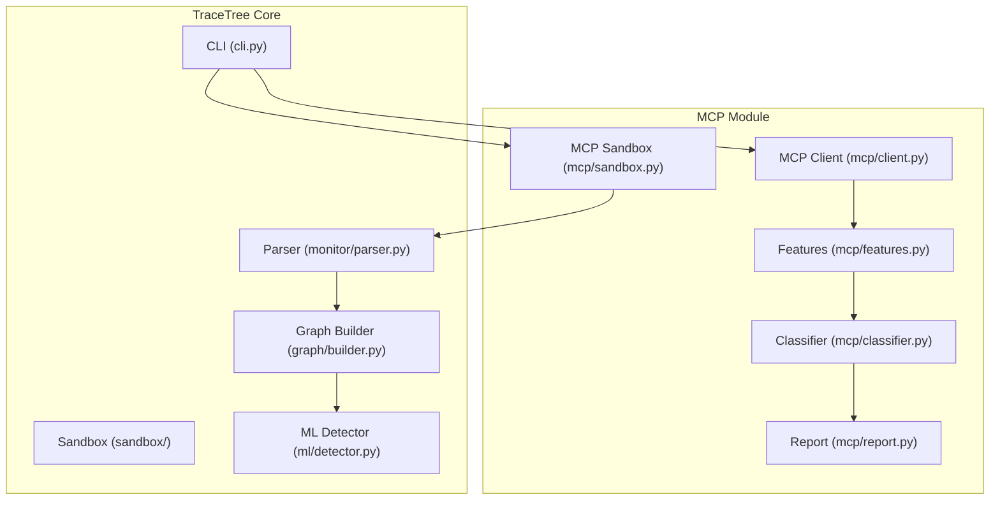
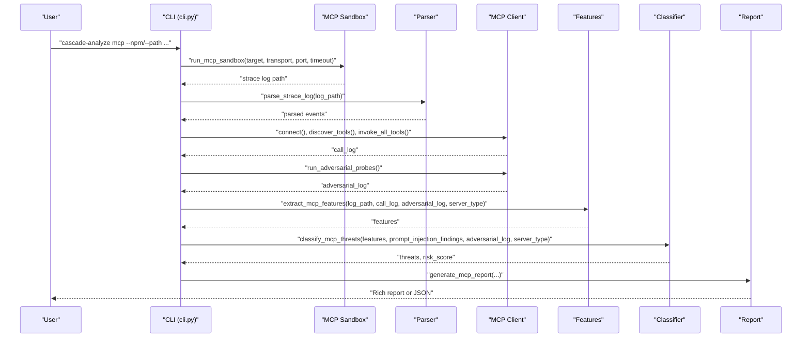
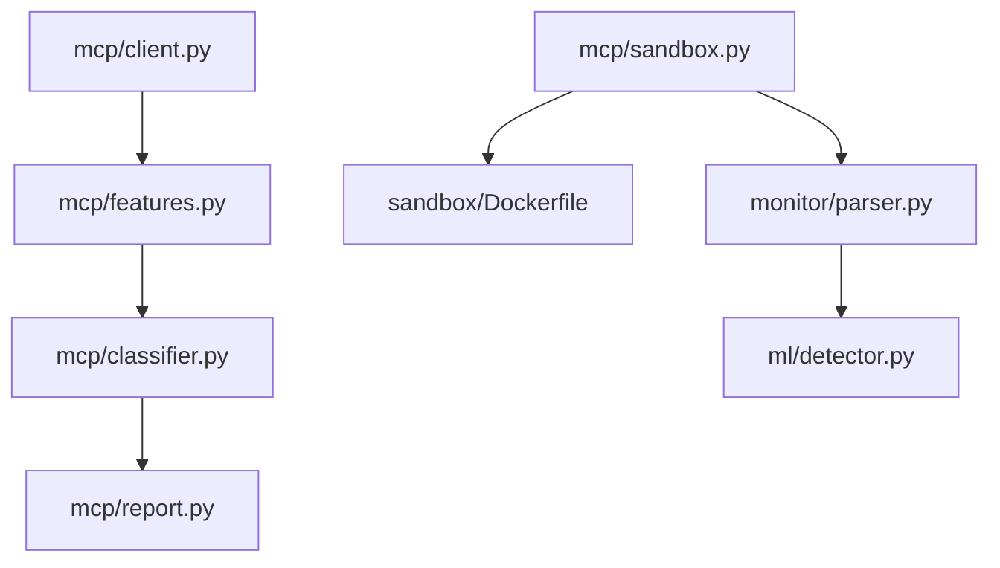

# MCP Server Security Analysis

<cite>
**Referenced Files in This Document**
- [README.md](file://README.md)
- [cli.py](file://cli.py)
- [mcp/__init__.py](file://mcp/__init__.py)
- [mcp/client.py](file://mcp/client.py)
- [mcp/features.py](file://mcp/features.py)
- [mcp/classifier.py](file://mcp/classifier.py)
- [mcp/report.py](file://mcp/report.py)
- [mcp/sandbox.py](file://mcp/sandbox.py)
- [sandbox/Dockerfile](file://sandbox/Dockerfile)
- [tests/mcp/test_sandbox_injection.py](file://tests/mcp/test_sandbox_injection.py)
- [monitor/parser.py](file://monitor/parser.py)
- [ml/detector.py](file://ml/detector.py)
</cite>

## Table of Contents
1. [Introduction](#introduction)
2. [Project Structure](#project-structure)
3. [Core Components](#core-components)
4. [Architecture Overview](#architecture-overview)
5. [Detailed Component Analysis](#detailed-component-analysis)
6. [Dependency Analysis](#dependency-analysis)
7. [Performance Considerations](#performance-considerations)
8. [Troubleshooting Guide](#troubleshooting-guide)
9. [Conclusion](#conclusion)
10. [Appendices](#appendices)

## Introduction
This document provides a comprehensive guide to TraceTree’s Model Context Protocol (MCP) server security analysis. It explains the specialized workflow for analyzing MCP servers, including sandbox execution, JSON-RPC client simulation, tool discovery and invocation, adversarial probing, and rule-based threat classification. It documents the six MCP threat categories, their severity levels, and detection criteria, along with MCP-specific feature extraction and baseline comparisons against known server types. Practical examples demonstrate how to analyze npm MCP servers and local MCP projects with various transport options.

## Project Structure
The MCP security analysis is implemented as a cohesive module within TraceTree’s broader runtime behavioral analysis framework. The MCP module integrates with the existing sandbox, parser, graph builder, and ML detector to provide a complete security assessment.

**Diagram sources**
- [cli.py:436-617](file://cli.py#L436-L617)
- [mcp/sandbox.py:41-146](file://mcp/sandbox.py#L41-L146)
- [mcp/client.py:18-473](file://mcp/client.py#L18-L473)
- [mcp/features.py:32-206](file://mcp/features.py#L32-L206)
- [mcp/classifier.py:61-268](file://mcp/classifier.py#L61-L268)
- [mcp/report.py:27-322](file://mcp/report.py#L27-L322)
- [monitor/parser.py:1-200](file://monitor/parser.py#L1-L200)
- [ml/detector.py:29-200](file://ml/detector.py#L29-L200)

**Section sources**
- [README.md:265-329](file://README.md#L265-L329)
- [cli.py:436-617](file://cli.py#L436-L617)

## Core Components
- MCP Sandbox: Runs MCP servers in a Docker container with strace -f instrumentation, network isolation, and transport-specific startup scripts.
- MCP Client: Simulates a JSON-RPC 2.0 client to perform the initialize handshake, discover tools, invoke them with safe synthetic arguments, and run adversarial probes.
- MCP Features: Parses strace logs and extracts MCP-specific features grouped by tool-call activity (network, process, filesystem, injection response).
- MCP Classifier: Applies rule-based checks to detect six threat categories and computes a risk score.
- MCP Report: Generates Rich console reports or JSON outputs summarizing tools, prompt injection findings, per-tool syscall summaries, threat detections, adversarial probe results, and baseline comparisons.

**Section sources**
- [mcp/__init__.py:9-21](file://mcp/__init__.py#L9-L21)
- [mcp/sandbox.py:41-146](file://mcp/sandbox.py#L41-L146)
- [mcp/client.py:18-473](file://mcp/client.py#L18-L473)
- [mcp/features.py:32-206](file://mcp/features.py#L32-L206)
- [mcp/classifier.py:61-268](file://mcp/classifier.py#L61-L268)
- [mcp/report.py:27-322](file://mcp/report.py#L27-L322)

## Architecture Overview
The MCP security analysis pipeline orchestrates sandbox execution, client simulation, feature extraction, and classification to produce actionable security insights.

**Diagram sources**
- [cli.py:488-617](file://cli.py#L488-L617)
- [mcp/sandbox.py:41-146](file://mcp/sandbox.py#L41-L146)
- [mcp/client.py:78-184](file://mcp/client.py#L78-L184)
- [mcp/features.py:32-206](file://mcp/features.py#L32-L206)
- [mcp/classifier.py:61-96](file://mcp/classifier.py#L61-L96)
- [mcp/report.py:27-74](file://mcp/report.py#L27-L74)

## Detailed Component Analysis

### MCP Sandbox
The MCP sandbox runs the server in a Docker container with:
- strace -f tracing the entire process tree
- Network isolation by default (ip link set eth0 down)
- Read-only mount of the server package (for local projects)
- Non-root user inside the container
- Configurable timeout and transport-specific startup scripts

Key behaviors:
- Builds or pulls the sandbox image from sandbox/Dockerfile
- Chooses between npm and local server startup based on target type
- For HTTP transport, starts the server and waits for completion
- For stdio transport, runs the server under strace with named pipes for stdin/stdout
- Extracts the strace log and server_info.txt to logs/

Security controls:
- Network blocking unless explicitly allowed
- Read-only mounts for local projects
- Process tree tracing with strace -f
- Timeout enforcement to prevent hangs

Practical examples:
- Analyzing an npm MCP server: run_mcp_sandbox(target="package", target_type="npm", transport="http", port=3000)
- Analyzing a local MCP project: run_mcp_sandbox(target="./my-mcp-server", target_type="local", transport="stdio")

**Section sources**
- [mcp/sandbox.py:41-146](file://mcp/sandbox.py#L41-L146)
- [mcp/sandbox.py:148-232](file://mcp/sandbox.py#L148-L232)
- [mcp/sandbox.py:235-271](file://mcp/sandbox.py#L235-L271)
- [mcp/sandbox.py:274-327](file://mcp/sandbox.py#L274-L327)
- [sandbox/Dockerfile:1-11](file://sandbox/Dockerfile#L1-L11)

### MCP Client Simulation
The MCP client simulates a JSON-RPC 2.0 client to:
- Auto-detect transport (stdio vs http) if not provided
- Perform the initialize handshake and send notifications
- Discover tools via tools/list and scan tool manifests for prompt injection
- Invoke tools with safe synthetic arguments derived from JSON schemas
- Run adversarial probes injecting payloads like "; ls /etc", "../../../etc/passwd", and ""
- Record call logs, adversarial logs, and prompt injection findings

Security features:
- Safe argument generation ensures required fields are populated without unsafe values
- Adversarial payloads injected into the first string-typed parameter of each tool
- Prompt injection scan checks for zero-width characters and injection language patterns
- Transport abstraction supports both stdio and HTTP/SSE endpoints

Practical examples:
- Connect to an HTTP server: MCPClient(transport="http", host="localhost", port=3000)
- Connect to a stdio server: MCPClient(transport="stdio", command="npx @modelcontextprotocol/server-github")
- Run adversarial probes: mcp_client.run_adversarial_probes()

**Section sources**
- [mcp/client.py:18-473](file://mcp/client.py#L18-L473)

### MCP Feature Extraction
The feature extractor parses strace logs and builds MCP-specific features:
- Network behavior: unexpected outbound connections, DNS lookups during tool calls, per-tool connection counts
- Process behavior: child processes spawned, shell invocations, unexpected binary executions
- Filesystem behavior: reads outside working directory, sensitive path accesses, writes during read-only tool calls
- Injection response: behavior change under adversarial input, shell spawned during injection, syscall delta comparison
- General: total syscalls, syscall counts, events attributed to tools

Baseline comparison:
- Detects server type from package name and tool descriptions
- Compares observed behavior against known baselines for filesystem, github, postgres, fetch, and shell servers
- Flags deviations such as unexpected network connections, process spawning, sensitive reads, or shell invocations

Practical examples:
- Extract features from a strace log: extract_mcp_features(log_path, call_log, adversarial_log, server_type)
- Compare to baseline: features["baseline_comparison"] contains deviations

**Section sources**
- [mcp/features.py:32-206](file://mcp/features.py#L32-L206)
- [mcp/features.py:209-238](file://mcp/features.py#L209-L238)
- [mcp/features.py:337-473](file://mcp/features.py#L337-L473)

### Rule-Based Threat Classification
The classifier evaluates extracted features against six threat categories:
- COMMAND_INJECTION: Shell process spawned during adversarial probes, significant syscall pattern changes, crashes under injection
- CREDENTIAL_EXFILTRATION: Access to credential-related files followed by network connections
- COVERT_NETWORK_CALL: Unexpected outbound connections during tool calls, DNS lookups during tool calls
- PATH_TRAVERSAL: Reads outside working directory, sensitive path accesses
- EXCESSIVE_PROCESS_SPAWNING: Many child processes relative to tool invocations
- PROMPT_INJECTION_VECTOR: Zero-width characters or prompt injection language in tool descriptions

Risk scoring:
- Computes a risk score from the list of triggered threats using severity thresholds and counts

Practical examples:
- Classify threats: classify_mcp_threats(features, prompt_injection_findings, adversarial_log, server_type)
- Compute risk: compute_risk_score(threats)

**Section sources**
- [mcp/classifier.py:21-58](file://mcp/classifier.py#L21-L58)
- [mcp/classifier.py:61-96](file://mcp/classifier.py#L61-L96)
- [mcp/classifier.py:129-236](file://mcp/classifier.py#L129-L236)
- [mcp/classifier.py:239-268](file://mcp/classifier.py#L239-L268)

### MCP Report Generation
The report generator creates:
- Rich console reports or JSON outputs
- Tool manifest with names, descriptions, and parameters
- Prompt injection scan results
- Per-tool syscall summaries
- Threat detections with evidence
- Adversarial probe results
- Overall risk score
- Baseline comparison deviations

Practical examples:
- Generate Rich report: generate_mcp_report(..., output_format="report")
- Generate JSON report: generate_mcp_report(..., output_format="json")

**Section sources**
- [mcp/report.py:27-322](file://mcp/report.py#L27-L322)

### MCP Analysis Workflow
The CLI orchestrates the entire MCP analysis:
- Resolves target (npm package or local path)
- Runs MCP sandbox and parses strace logs
- Builds graph and runs ML detector for baseline anomaly
- Simulates MCP client, discovers tools, invokes them, and runs adversarial probes
- Extracts MCP-specific features and classifies threats
- Generates report in Rich or JSON format

Practical examples:
- Analyze npm MCP server: cascade-analyze mcp --npm @modelcontextprotocol/server-github
- Analyze local MCP project: cascade-analyze mcp --path ./my-mcp-server --transport http --port 3000
- Allow network: cascade-analyze mcp --npm @modelcontextprotocol/server-github --allow-network
- JSON output: cascade-analyze mcp --npm @modelcontextprotocol/server-github --output json

**Section sources**
- [cli.py:436-617](file://cli.py#L436-L617)
- [README.md:265-305](file://README.md#L265-L305)

## Dependency Analysis
The MCP module depends on the broader TraceTree pipeline for sandboxing, parsing, graphing, and ML detection. It also relies on Docker for containerization and strace for syscall tracing.

**Diagram sources**
- [mcp/sandbox.py:41-146](file://mcp/sandbox.py#L41-L146)
- [mcp/client.py:18-473](file://mcp/client.py#L18-L473)
- [mcp/features.py:32-206](file://mcp/features.py#L32-L206)
- [mcp/classifier.py:61-268](file://mcp/classifier.py#L61-L268)
- [mcp/report.py:27-322](file://mcp/report.py#L27-L322)
- [sandbox/Dockerfile:1-11](file://sandbox/Dockerfile#L1-L11)
- [monitor/parser.py:1-200](file://monitor/parser.py#L1-L200)
- [ml/detector.py:29-200](file://ml/detector.py#L29-L200)

**Section sources**
- [mcp/__init__.py:9-21](file://mcp/__init__.py#L9-L21)
- [cli.py:488-535](file://cli.py#L488-L535)

## Performance Considerations
- Container startup and strace overhead: The sandbox introduces containerization and syscall tracing latency. Use timeouts appropriately to balance completeness and speed.
- Transport selection: HTTP transport allows external client connectivity; stdio transport simplifies local testing but requires careful handling of stdin/stdout.
- Adversarial probe volume: Running probes across all tools with multiple payloads increases runtime. Adjust tool_delay and payload sets as needed.
- Baseline comparison: Server type detection and baseline comparison add minimal overhead compared to the cost of sandbox execution and parsing.

[No sources needed since this section provides general guidance]

## Troubleshooting Guide
Common issues and resolutions:
- Docker not installed or not running: The CLI checks for Docker and provides OS-specific installation and startup instructions.
- Sandbox image build failures: The MCP sandbox image is built from sandbox/Dockerfile. Ensure Docker has access to build context and network.
- Transport detection: If transport is not provided, the client auto-detects based on presence of command or port. For HTTP, ensure the endpoint responds to SSE.
- Injection and port handling: Tests confirm safe quoting and sanitization of inputs to prevent command injection in sandbox scripts.
- Timeout exceeded: The MCP sandbox enforces a timeout. Increase timeout if legitimate analysis requires more time.

**Section sources**
- [cli.py:74-111](file://cli.py#L74-L111)
- [mcp/sandbox.py:63-72](file://mcp/sandbox.py#L63-L72)
- [tests/mcp/test_sandbox_injection.py:1-57](file://tests/mcp/test_sandbox_injection.py#L1-L57)

## Conclusion
TraceTree’s MCP server security analysis provides a robust, rule-based approach to identifying security risks in MCP servers. By combining sandbox execution, JSON-RPC client simulation, adversarial probing, and MCP-specific feature extraction, it detects command injection, credential theft, covert network calls, path traversal, excessive process spawning, and prompt injection vectors. The integration with TraceTree’s broader behavioral analysis pipeline enhances detection through baseline comparisons and ML anomaly detection.

[No sources needed since this section summarizes without analyzing specific files]

## Appendices

### MCP Threat Categories and Detection Criteria
- COMMAND_INJECTION: Shell spawned during adversarial probes, significant syscall pattern changes, server crashes under injection
- CREDENTIAL_EXFILTRATION: Access to credential-related files followed by network connections
- COVERT_NETWORK_CALL: Unexpected outbound connections during tool calls, DNS lookups during tool calls
- PATH_TRAVERSAL: Reads outside working directory, sensitive path accesses
- EXCESSIVE_PROCESS_SPAWNING: Child processes spawned disproportionately relative to tool invocations
- PROMPT_INJECTION_VECTOR: Zero-width characters or prompt injection language in tool descriptions

**Section sources**
- [mcp/classifier.py:21-58](file://mcp/classifier.py#L21-L58)
- [mcp/classifier.py:129-236](file://mcp/classifier.py#L129-L236)

### MCP-Specific Feature Extraction Details
- Network: Unexpected outbound connections, DNS lookups during tool calls, per-tool connection counts
- Process: Child processes spawned, shell invocations, unexpected binary executions
- Filesystem: Reads outside working directory, sensitive path accesses, writes during read-only tool calls
- Injection response: Behavior change under adversarial input, shell spawned during injection, syscall delta comparison
- Baseline comparison: Deviations from known server type baselines for filesystem, github, postgres, fetch, and shell

**Section sources**
- [mcp/features.py:64-92](file://mcp/features.py#L64-L92)
- [mcp/features.py:125-197](file://mcp/features.py#L125-L197)
- [mcp/features.py:337-473](file://mcp/features.py#L337-L473)

### Practical Examples
- Analyze npm MCP server: cascade-analyze mcp --npm @modelcontextprotocol/server-github
- Analyze local MCP project: cascade-analyze mcp --path ./my-mcp-server --transport http --port 3000
- Allow network: cascade-analyze mcp --npm @modelcontextprotocol/server-github --allow-network
- JSON output: cascade-analyze mcp --npm @modelcontextprotocol/server-github --output json

**Section sources**
- [README.md:269-285](file://README.md#L269-L285)
- [cli.py:436-617](file://cli.py#L436-L617)