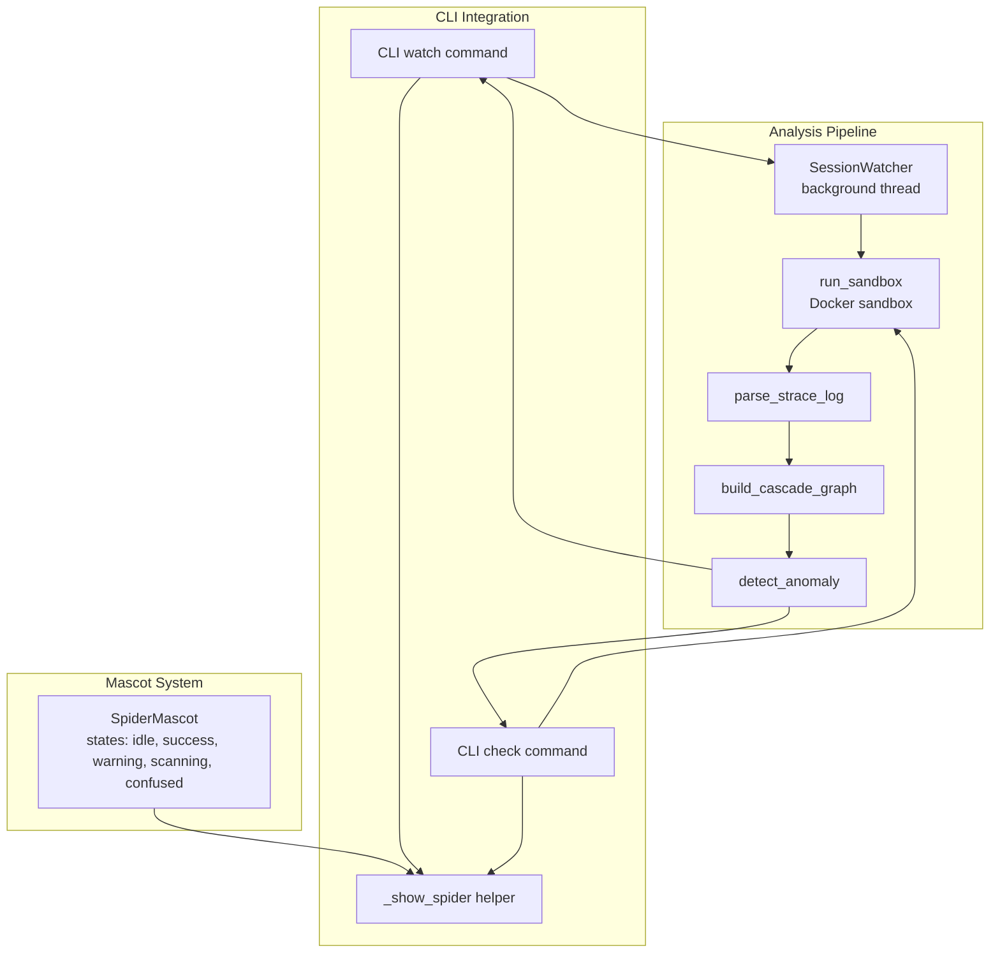
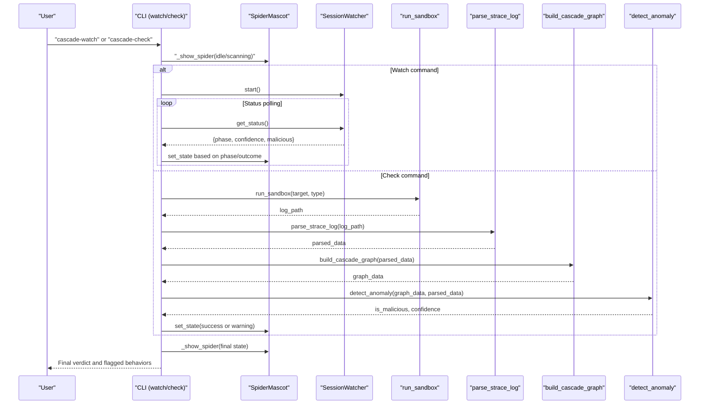
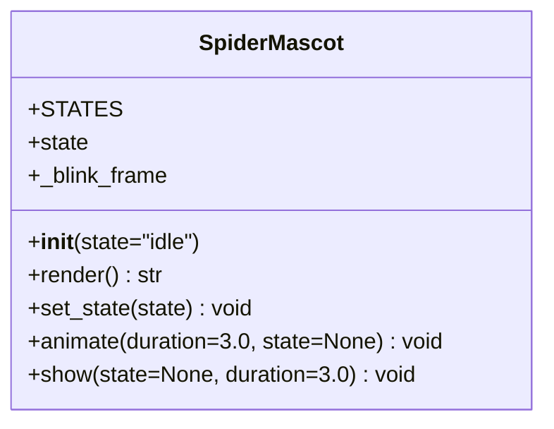
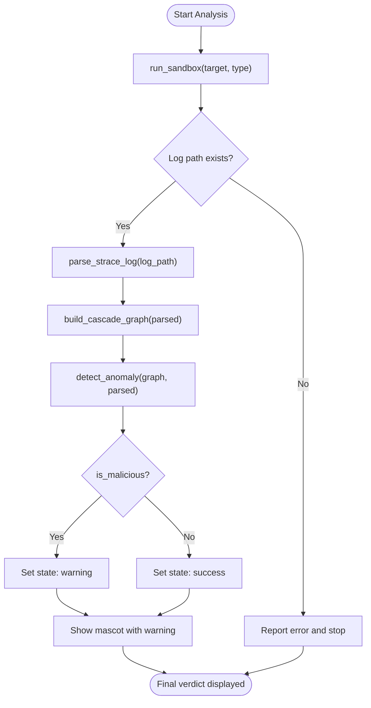
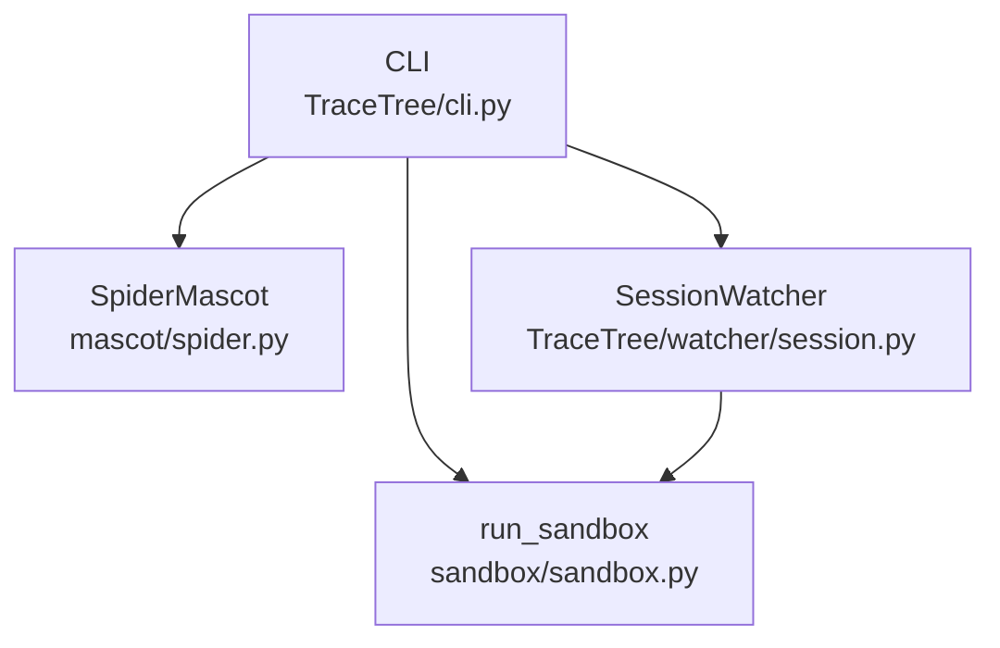

# ASCII Mascot System

<cite>
**Referenced Files in This Document**
- [spider.py](file://mascot/spider.py)
- [cli.py](file://TraceTree/cli.py)
- [session.py](file://TraceTree/watcher/session.py)
- [sandbox.py](file://sandbox/sandbox.py)
- [README.md](file://README.md)
- [QWEN.md](file://QWEN.md)
</cite>

## Table of Contents
1. [Introduction](#introduction)
2. [Project Structure](#project-structure)
3. [Core Components](#core-components)
4. [Architecture Overview](#architecture-overview)
5. [Detailed Component Analysis](#detailed-component-analysis)
6. [Dependency Analysis](#dependency-analysis)
7. [Performance Considerations](#performance-considerations)
8. [Troubleshooting Guide](#troubleshooting-guide)
9. [Conclusion](#conclusion)

## Introduction
This document describes the ASCII mascot system centered on the SpiderMascot class, which provides visual feedback and user engagement during TraceTree operations. The mascot offers five distinct states (idle, success, warning, scanning, confused) with ASCII art representations, enabling intuitive status communication during sandbox execution, threat detection visualization, and completion notifications. The system integrates with the analysis pipeline to reflect operational phases and outcomes, and supports customization for terminal compatibility and appearance.

## Project Structure
The mascot system is implemented as a standalone module and integrated into the CLI and session watcher components. The key files are:
- mascot/spider.py: Implements the SpiderMascot class with state definitions and rendering logic
- TraceTree/cli.py: Integrates the mascot into the watch and check commands, updating states based on analysis outcomes
- TraceTree/watcher/session.py: Provides background analysis orchestration and status reporting used by the CLI
- sandbox/sandbox.py: Executes sandbox runs that drive the analysis pipeline and influence mascot states
- README.md and QWEN.md: Document the mascot’s role and states in the broader system

**Diagram sources**
- [spider.py:4-60](file://mascot/spider.py#L4-L60)
- [cli.py:657-834](file://TraceTree/cli.py#L657-L834)
- [session.py:29-200](file://TraceTree/watcher/session.py#L29-L200)
- [sandbox.py:184-428](file://sandbox/sandbox.py#L184-L428)

**Section sources**
- [spider.py:1-77](file://mascot/spider.py#L1-L77)
- [cli.py:657-834](file://TraceTree/cli.py#L657-L834)
- [session.py:29-200](file://TraceTree/watcher/session.py#L29-L200)
- [sandbox.py:184-428](file://sandbox/sandbox.py#L184-L428)
- [README.md:324-324](file://README.md#L324-L324)
- [QWEN.md:111-122](file://QWEN.md#L111-L122)

## Core Components
- SpiderMascot class: Defines five states with ASCII art frames, state transitions, rendering logic, and animation controls
- CLI integration: Uses the mascot to reflect operational phases and final outcomes in watch and check commands
- SessionWatcher: Manages background analysis and exposes status consumed by the CLI to update mascot states
- Sandbox execution: Drives the analysis pipeline and influences final mascot states based on detection results

Key responsibilities:
- State management: idle (default, blinking), success (clean), warning (malicious), scanning (on-demand), confused (fallback)
- Rendering: Single-frame or blinking frames depending on state
- Animation: Controlled duration and refresh rate for visual feedback
- Integration: Updating states based on analysis outcomes and pipeline progress

**Section sources**
- [spider.py:4-60](file://mascot/spider.py#L4-L60)
- [cli.py:657-834](file://TraceTree/cli.py#L657-L834)
- [session.py:116-127](file://TraceTree/watcher/session.py#L116-L127)

## Architecture Overview
The mascot system operates as a lightweight visualizer layered atop the analysis pipeline. The CLI commands coordinate with the SessionWatcher or direct sandbox execution, and the SpiderMascot reflects the current phase and outcome.

**Diagram sources**
- [cli.py:669-834](file://TraceTree/cli.py#L669-L834)
- [session.py:96-127](file://TraceTree/watcher/session.py#L96-L127)
- [sandbox.py:184-428](file://sandbox/sandbox.py#L184-L428)

## Detailed Component Analysis

### SpiderMascot Class
The SpiderMascot class encapsulates state definitions, rendering, and animation behaviors.

- States and frames:
  - idle: Two-frame blinking animation
  - success: Single-frame success pose
  - warning: Single-frame warning pose
  - scanning: Single-frame scanning pose
  - confused: Single-frame fallback pose
- Rendering logic:
  - For idle, toggles between two frames to create a blinking effect
  - For other states, returns the first frame in the state’s list or the state itself if not a list
- Animation control:
  - animate(duration, state): Prints the current or specified state for the given duration, refreshing every half second
  - show(state, duration): Convenience wrapper combining state setting and animation
- Error handling:
  - set_state validates input and defaults to confused for invalid states

**Diagram sources**
- [spider.py:4-60](file://mascot/spider.py#L4-L60)

**Section sources**
- [spider.py:4-60](file://mascot/spider.py#L4-L60)

### State Transitions and Visual Feedback Timing
- Idle state: Default, blinking animation to convey ongoing observation
- Scanning state: Used during on-demand checks to indicate active analysis
- Success state: Shown upon clean analysis completion
- Warning state: Shown upon malicious analysis completion
- Confused state: Fallback for invalid state inputs

Timing characteristics:
- Animation refresh interval: 0.5 seconds
- Duration control: Configurable via animate/show parameters
- Keyboard interruption: animate handles KeyboardInterrupt gracefully

Integration points:
- CLI watch command: Updates mascot state based on watcher phases and final verdict
- CLI check command: Sets scanning during on-demand checks and success/warning based on detection results

**Section sources**
- [spider.py:25-60](file://mascot/spider.py#L25-L60)
- [cli.py:736-834](file://TraceTree/cli.py#L736-L834)

### Integration with Analysis Pipeline
- SessionWatcher:
  - Exposes status via get_status(), including phase, confidence, and malicious flags
  - CLI consumes these to update mascot states during watch sessions
- Sandbox execution:
  - run_sandbox drives the pipeline and returns log paths used by CLI check
  - Detection results inform final mascot state in check command
- Threat detection visualization:
  - Final verdict and flagged behaviors are displayed alongside the mascot

**Diagram sources**
- [sandbox.py:184-428](file://sandbox/sandbox.py#L184-L428)
- [cli.py:885-934](file://TraceTree/cli.py#L885-L934)

**Section sources**
- [session.py:116-127](file://TraceTree/watcher/session.py#L116-L127)
- [cli.py:885-934](file://TraceTree/cli.py#L885-L934)
- [sandbox.py:184-428](file://sandbox/sandbox.py#L184-L428)

### Display Formatting Options and Terminal Compatibility
- Panel and alignment:
  - The CLI renders the mascot within a centered Rich Panel with a green border and cyan text styling
  - Alignment is center-aligned for prominent visibility
- Terminal compatibility:
  - The mascot uses standard ASCII art and avoids color codes beyond Rich styles
  - Rendering occurs via stdout carriage return and flush for smooth animation
- Customization possibilities:
  - ASCII art frames can be edited in the STATES dictionary
  - State transitions can be extended or customized by modifying the CLI integration logic
  - Animation duration and refresh intervals can be adjusted in the SpiderMascot methods

**Section sources**
- [cli.py:657-666](file://TraceTree/cli.py#L657-L666)
- [spider.py:25-60](file://mascot/spider.py#L25-L60)

### Examples of Mascot Usage in Analysis Scenarios
- Watch command:
  - Initial idle state while monitoring
  - Scanning state during on-demand checks
  - Success or warning state based on final verdict
- Check command:
  - Scanning state during on-demand analysis
  - Success or warning state reflecting detection outcome
- Session phases:
  - Cloning, sandboxing, analyzing phases reflected via status updates and mascot state changes

**Section sources**
- [cli.py:736-834](file://TraceTree/cli.py#L736-L834)
- [session.py:116-127](file://TraceTree/watcher/session.py#L116-L127)

## Dependency Analysis
The mascot system has minimal dependencies and integrates cleanly with the CLI and analysis pipeline.

**Diagram sources**
- [spider.py:1-77](file://mascot/spider.py#L1-L77)
- [cli.py:657-834](file://TraceTree/cli.py#L657-L834)
- [session.py:29-200](file://TraceTree/watcher/session.py#L29-L200)
- [sandbox.py:184-428](file://sandbox/sandbox.py#L184-L428)

**Section sources**
- [spider.py:1-77](file://mascot/spider.py#L1-L77)
- [cli.py:657-834](file://TraceTree/cli.py#L657-L834)
- [session.py:29-200](file://TraceTree/watcher/session.py#L29-L200)
- [sandbox.py:184-428](file://sandbox/sandbox.py#L184-L428)

## Performance Considerations
- Animation refresh interval: 0.5 seconds strikes a balance between responsiveness and CPU usage
- Duration control: Short durations for brief feedback, longer durations for sustained emphasis
- Real-time updates: The watch command polls status every 2 seconds, allowing timely mascot state changes without heavy polling
- Long-running analyses: The mascot remains lightweight; animation overhead is negligible compared to sandbox execution and ML inference

Optimization recommendations:
- Keep ASCII art compact to minimize rendering cost
- Avoid excessive state transitions during short-lived operations
- Use controlled durations to prevent unnecessary redraw cycles

[No sources needed since this section provides general guidance]

## Troubleshooting Guide
Common issues and resolutions:
- Invalid state input:
  - set_state defaults to confused for unknown states
- Interrupted animations:
  - animate handles KeyboardInterrupt gracefully and prints a newline
- Missing Docker:
  - Preflight checks ensure Docker availability; failures halt analysis and prevent mascot misuse
- Terminal rendering:
  - Ensure stdout flushing and carriage return are supported; Rich panels handle layout consistently

**Section sources**
- [spider.py:35-60](file://mascot/spider.py#L35-L60)
- [cli.py:75-110](file://TraceTree/cli.py#L75-L110)

## Conclusion
The SpiderMascot system enhances TraceTree’s user experience by providing clear, animated visual feedback aligned with analysis phases and outcomes. Its integration with the CLI and SessionWatcher ensures timely state updates, while its simple design and customizable ASCII art enable easy adaptation. The system’s performance characteristics and terminal compatibility make it suitable for real-time feedback during both short and long-running analyses.