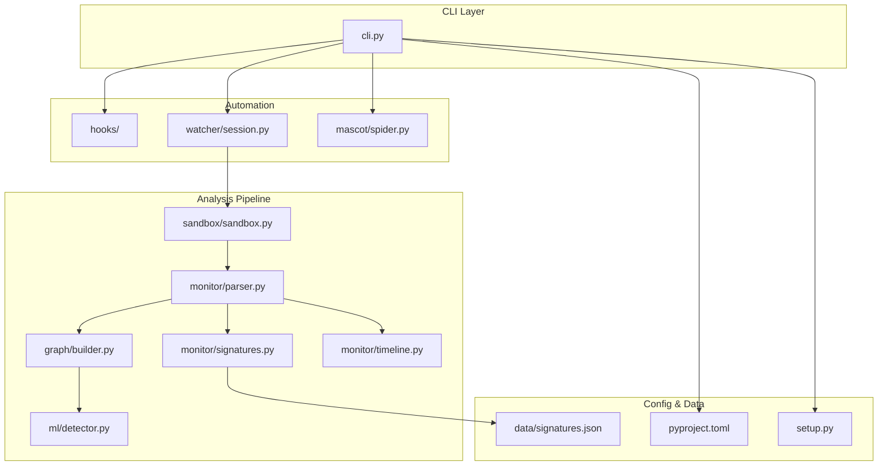
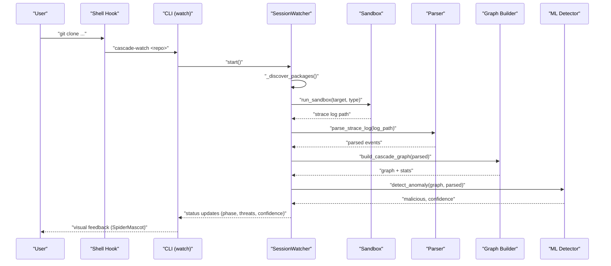
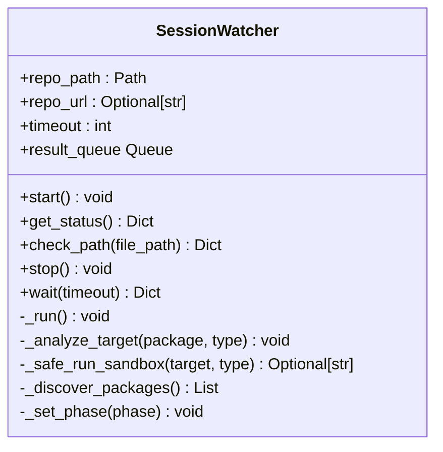
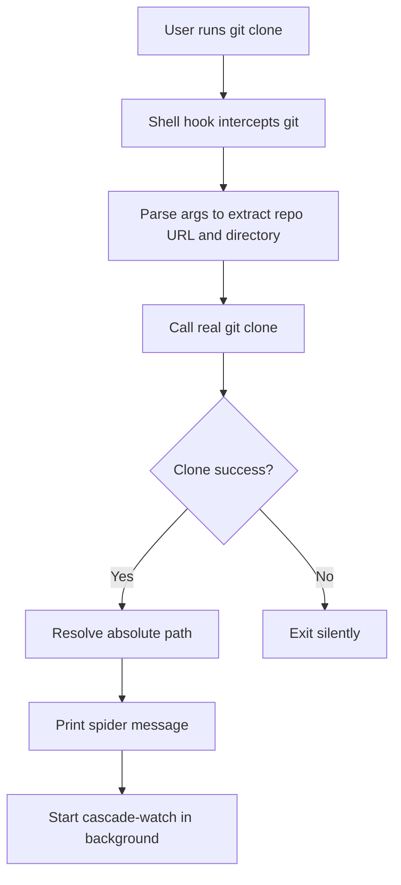
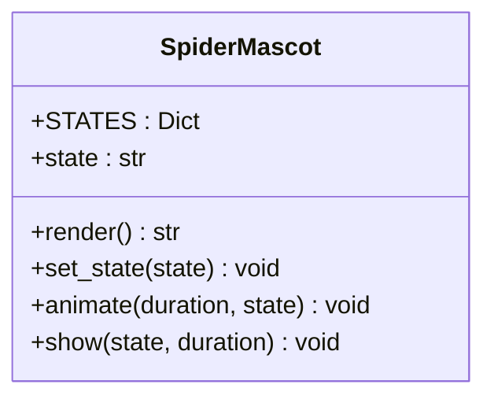
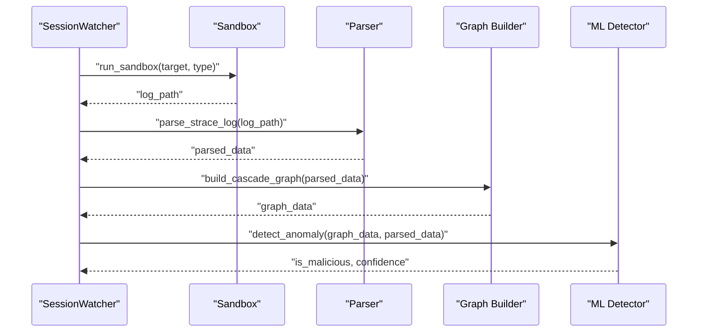
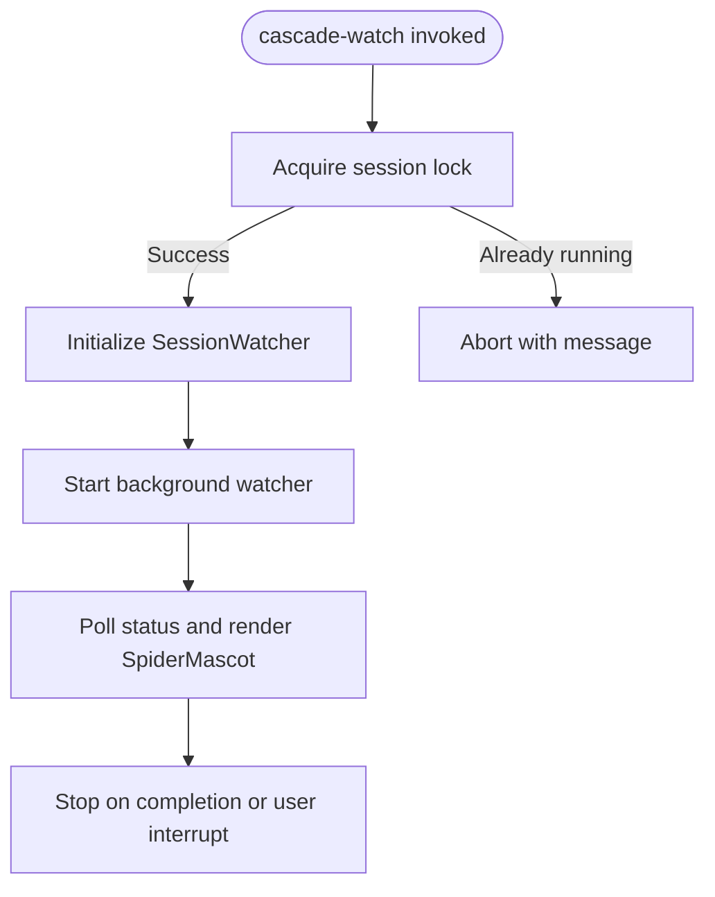
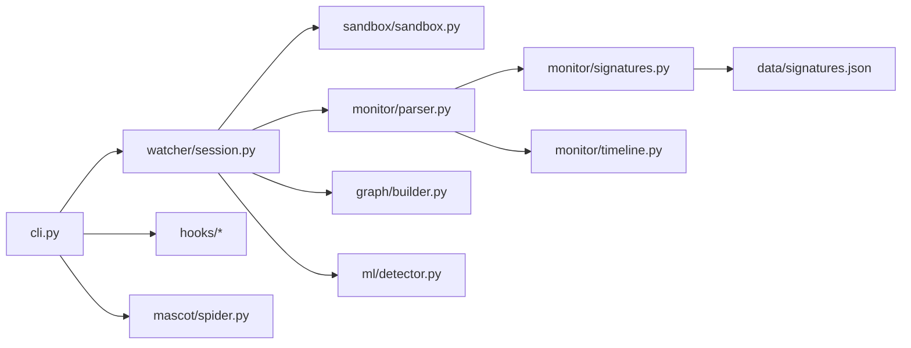

# Monitoring and Automation

<cite>
**Referenced Files in This Document**
- [session.py](file://TraceTree/watcher/session.py)
- [spider.py](file://TraceTree/mascot/spider.py)
- [shell_hook.sh](file://TraceTree/hooks/shell_hook.sh)
- [install_hook.py](file://TraceTree/hooks/install_hook.py)
- [install_hook.sh](file://TraceTree/hooks/install_hook.sh)
- [sandbox.py](file://TraceTree/sandbox/sandbox.py)
- [parser.py](file://TraceTree/monitor/parser.py)
- [builder.py](file://TraceTree/graph/builder.py)
- [detector.py](file://TraceTree/ml/detector.py)
- [signatures.py](file://TraceTree/monitor/signatures.py)
- [timeline.py](file://TraceTree/monitor/timeline.py)
- [cli.py](file://TraceTree/cli.py)
- [signatures.json](file://TraceTree/data/signatures.json)
- [pyproject.toml](file://TraceTree/pyproject.toml)
- [setup.py](file://TraceTree/setup.py)
- [README.md](file://TraceTree/README.md)
</cite>

## Table of Contents
1. [Introduction](#introduction)
2. [Project Structure](#project-structure)
3. [Core Components](#core-components)
4. [Architecture Overview](#architecture-overview)
5. [Detailed Component Analysis](#detailed-component-analysis)
6. [Dependency Analysis](#dependency-analysis)
7. [Performance Considerations](#performance-considerations)
8. [Troubleshooting Guide](#troubleshooting-guide)
9. [Conclusion](#conclusion)
10. [Appendices](#appendices)

## Introduction
This document explains TraceTree’s monitoring and automation capabilities with a focus on:
- Continuous repository monitoring via the SessionWatcher class
- Shell hook integration for automatic monitoring after git clone
- Visual feedback through the SpiderMascot ASCII mascot
- Configuration options, session locking, and integration with the broader analysis pipeline
- Automation workflows and continuous security monitoring patterns

The goal is to help both developers and operators understand how TraceTree watches repositories, discovers packages from common manifests, runs sandboxed analyses, and presents actionable results with visual cues.

## Project Structure
TraceTree organizes monitoring and automation across several modules:
- watcher/session.py: Repository monitoring and background analysis orchestration
- hooks/: Shell hook installation and git clone interception
- mascot/spider.py: ASCII mascot with animated states for visual feedback
- sandbox/sandbox.py: Docker-based sandbox execution and strace capture
- monitor/: Parser, signatures, and temporal analysis
- graph/builder.py: NetworkX graph construction from syscall traces
- ml/detector.py: Machine learning anomaly detection and severity boosting
- cli.py: CLI entry points and session management
- data/signatures.json: Behavioral signatures for rule-based matching
- pyproject.toml/setup.py: CLI entry points and package configuration

**Diagram sources**
- [cli.py:617-800](file://TraceTree/cli.py#L617-L800)
- [session.py:29-418](file://TraceTree/watcher/session.py#L29-L418)
- [spider.py:4-77](file://TraceTree/mascot/spider.py#L4-L77)
- [sandbox.py:175-376](file://TraceTree/sandbox/sandbox.py#L175-L376)
- [parser.py:340-680](file://TraceTree/monitor/parser.py#L340-L680)
- [builder.py:8-196](file://TraceTree/graph/builder.py#L8-L196)
- [detector.py:235-300](file://TraceTree/ml/detector.py#L235-L300)
- [signatures.py:57-488](file://TraceTree/monitor/signatures.py#L57-L488)
- [timeline.py:298-353](file://TraceTree/monitor/timeline.py#L298-L353)
- [signatures.json:1-246](file://TraceTree/data/signatures.json#L1-L246)
- [pyproject.toml:26-32](file://TraceTree/pyproject.toml#L26-L32)
- [setup.py:30-39](file://TraceTree/setup.py#L30-L39)

**Section sources**
- [README.md:306-329](file://TraceTree/README.md#L306-L329)
- [pyproject.toml:26-32](file://TraceTree/pyproject.toml#L26-L32)
- [setup.py:30-39](file://TraceTree/setup.py#L30-L39)

## Core Components
- SessionWatcher: Background monitor that discovers packages from repository manifests and runs sandboxed analysis, exposing status and results via a thread-safe interface and a result queue.
- Shell Hook System: Intercepts git clone to automatically start a watcher session and integrates with bash/zsh environments.
- SpiderMascot: ASCII mascot with five states (idle, success, warning, scanning, confused) for visual feedback during analysis.
- Analysis Pipeline: Sandbox execution, syscall parsing, signature matching, temporal pattern detection, graph construction, and ML anomaly detection.

Key capabilities:
- Manifest discovery from requirements.txt, package.json, setup.py, and pyproject.toml
- On-demand and continuous analysis modes
- Session locking to prevent concurrent watchers per directory
- Visual feedback and live status polling

**Section sources**
- [session.py:29-418](file://TraceTree/watcher/session.py#L29-L418)
- [shell_hook.sh:1-93](file://TraceTree/hooks/shell_hook.sh#L1-L93)
- [install_hook.py:1-129](file://TraceTree/hooks/install_hook.py#L1-L129)
- [install_hook.sh:1-60](file://TraceTree/hooks/install_hook.sh#L1-L60)
- [spider.py:4-77](file://TraceTree/mascot/spider.py#L4-L77)
- [cli.py:617-800](file://TraceTree/cli.py#L617-L800)

## Architecture Overview
The monitoring and automation architecture ties together CLI orchestration, shell hooks, repository watching, and the analysis pipeline.

**Diagram sources**
- [shell_hook.sh:27-86](file://TraceTree/hooks/shell_hook.sh#L27-L86)
- [cli.py:669-800](file://TraceTree/cli.py#L669-L800)
- [session.py:237-327](file://TraceTree/watcher/session.py#L237-L327)
- [sandbox.py:175-335](file://TraceTree/sandbox/sandbox.py#L175-L335)
- [parser.py:340-680](file://TraceTree/monitor/parser.py#L340-L680)
- [builder.py:8-196](file://TraceTree/graph/builder.py#L8-L196)
- [detector.py:235-300](file://TraceTree/ml/detector.py#L235-L300)

## Detailed Component Analysis

### SessionWatcher: Continuous Repository Monitoring
SessionWatcher runs in a background daemon thread, discovering packages from repository manifests and orchestrating sandbox analysis. It exposes:
- start(): Launches the background thread
- get_status(): Thread-safe snapshot of current phase, threats, confidence, and error
- check_path(file_path): On-demand analysis for a specific file or manifest
- stop()/wait(): Graceful shutdown and synchronization
- result_queue: Pushes analysis results as they become available

Discovery logic scans for:
- requirements.txt: Pip packages
- package.json: NPM dependencies
- setup.py or pyproject.toml: Treats the repository root as a pip target

**Diagram sources**
- [session.py:29-418](file://TraceTree/watcher/session.py#L29-L418)

**Section sources**
- [session.py:29-418](file://TraceTree/watcher/session.py#L29-L418)

### Shell Hook System: Automatic Monitoring Setup
The shell hook system provides cross-platform integration:
- shell_hook.sh: Intercepts git clone, resolves the target directory, and starts cascade-watch in the background
- install_hook.py: Cross-platform installer for bash/zsh that detects shells and appends the source line to the appropriate RC file
- install_hook.sh: Bash-only installer that writes to ~/.bashrc or ~/.zshrc

**Diagram sources**
- [shell_hook.sh:27-86](file://TraceTree/hooks/shell_hook.sh#L27-L86)

**Section sources**
- [shell_hook.sh:1-93](file://TraceTree/hooks/shell_hook.sh#L1-L93)
- [install_hook.py:29-129](file://TraceTree/hooks/install_hook.py#L29-L129)
- [install_hook.sh:10-60](file://TraceTree/hooks/install_hook.sh#L10-L60)

### SpiderMascot: Visual Feedback During Analysis
SpiderMascot provides ASCII art states:
- idle: Blinking between two frames
- success, warning, confused: Static frames
- scanning: Temporary state during on-demand checks

It supports:
- render(): Returns current frame
- set_state(state): Switches to a valid state or defaults to confused
- animate(duration, state): Renders continuously for a duration
- show(state, duration): Convenience method combining set_state and animate

**Diagram sources**
- [spider.py:4-77](file://TraceTree/mascot/spider.py#L4-L77)

**Section sources**
- [spider.py:4-77](file://TraceTree/mascot/spider.py#L4-L77)
- [cli.py:657-667](file://TraceTree/cli.py#L657-L667)

### Analysis Pipeline Integration
SessionWatcher integrates with the broader analysis pipeline:
- Sandbox execution via sandbox.sandbox.run_sandbox
- Syscall parsing via monitor.parser.parse_strace_log
- Graph construction via graph.builder.build_cascade_graph
- ML anomaly detection via ml.detector.detect_anomaly
- Optional signature matching via monitor.signatures.match_signatures
- Optional temporal pattern detection via monitor.timeline.detect_temporal_patterns

**Diagram sources**
- [session.py:277-327](file://TraceTree/watcher/session.py#L277-L327)
- [sandbox.py:175-335](file://TraceTree/sandbox/sandbox.py#L175-L335)
- [parser.py:340-680](file://TraceTree/monitor/parser.py#L340-L680)
- [builder.py:8-196](file://TraceTree/graph/builder.py#L8-L196)
- [detector.py:235-300](file://TraceTree/ml/detector.py#L235-L300)

**Section sources**
- [session.py:277-327](file://TraceTree/watcher/session.py#L277-L327)
- [sandbox.py:175-335](file://TraceTree/sandbox/sandbox.py#L175-L335)
- [parser.py:340-680](file://TraceTree/monitor/parser.py#L340-L680)
- [builder.py:8-196](file://TraceTree/graph/builder.py#L8-L196)
- [detector.py:235-300](file://TraceTree/ml/detector.py#L235-L300)

### Configuration Options and Session Locking
CLI-driven configuration and session management:
- cascade-watch: Starts a watcher for a repository path, optionally performs an on-demand check, and prints live status
- Session locking: Prevents multiple watchers for the same directory using a lockfile in /tmp/tracetree_sessions
- CLI entry points: Defined in pyproject.toml and setup.py

**Diagram sources**
- [cli.py:669-800](file://TraceTree/cli.py#L669-L800)
- [cli.py:624-655](file://TraceTree/cli.py#L624-L655)

**Section sources**
- [cli.py:617-800](file://TraceTree/cli.py#L617-L800)
- [pyproject.toml:26-32](file://TraceTree/pyproject.toml#L26-L32)
- [setup.py:30-39](file://TraceTree/setup.py#L30-L39)

## Dependency Analysis
High-level dependencies among monitoring and automation components:

**Diagram sources**
- [cli.py:617-800](file://TraceTree/cli.py#L617-L800)
- [session.py:29-418](file://TraceTree/watcher/session.py#L29-L418)
- [sandbox.py:175-335](file://TraceTree/sandbox/sandbox.py#L175-L335)
- [parser.py:340-680](file://TraceTree/monitor/parser.py#L340-L680)
- [builder.py:8-196](file://TraceTree/graph/builder.py#L8-L196)
- [detector.py:235-300](file://TraceTree/ml/detector.py#L235-L300)
- [signatures.py:57-488](file://TraceTree/monitor/signatures.py#L57-L488)
- [timeline.py:298-353](file://TraceTree/monitor/timeline.py#L298-L353)
- [signatures.json:1-246](file://TraceTree/data/signatures.json#L1-L246)

**Section sources**
- [README.md:306-329](file://TraceTree/README.md#L306-L329)

## Performance Considerations
- Background thread model: SessionWatcher runs in a daemon thread to keep the CLI responsive
- Per-target timeouts: Sandbox execution enforces timeouts per target type to avoid hangs
- Container reuse: The sandbox image is built once and reused; subsequent runs are faster
- Severity boosting: ML confidence is adjusted by severity scores and temporal patterns, reducing false negatives for suspicious behavior
- Locking: Session locks prevent redundant watchers and wasted resources

[No sources needed since this section provides general guidance]

## Troubleshooting Guide
Common issues and resolutions:
- Docker not installed or unreachable: The CLI performs a preflight check and instructs users to install/start Docker
- Sandbox failures: run_sandbox returns empty string on failure; SessionWatcher logs errors and continues
- Missing hook installation: install_hook.py/install_hook.sh detect shells and append source lines; verify ~/.bashrc or ~/.zshrc
- Session already running: Lockfile prevents multiple watchers; stop the existing watcher or use cascade-check for on-demand analysis

**Section sources**
- [cli.py:73-110](file://TraceTree/cli.py#L73-L110)
- [sandbox.py:189-335](file://TraceTree/sandbox/sandbox.py#L189-L335)
- [install_hook.py:71-129](file://TraceTree/hooks/install_hook.py#L71-L129)
- [install_hook.sh:32-60](file://TraceTree/hooks/install_hook.sh#L32-L60)
- [cli.py:704-716](file://TraceTree/cli.py#L704-L716)

## Conclusion
TraceTree’s monitoring and automation system combines a robust SessionWatcher for continuous repository surveillance, a shell hook system for seamless git clone integration, and a visual mascot for intuitive feedback. Together with a comprehensive analysis pipeline—sandboxing, parsing, graphing, and ML anomaly detection—TraceTree enables continuous security monitoring with actionable insights and minimal operator overhead.

[No sources needed since this section summarizes without analyzing specific files]

## Appendices

### Appendix A: CLI Commands and Entry Points
- cascade-analyze: Main analyzer for packages, binaries, and bulk files
- cascade-watch: Repository watcher with live status and SpiderMascot
- cascade-check: On-demand analysis of a specific file
- cascade-install-hook: Install shell hook for automatic monitoring
- cascade-train and cascade-update: Model training and update utilities

**Section sources**
- [pyproject.toml:26-32](file://TraceTree/pyproject.toml#L26-L32)
- [setup.py:30-39](file://TraceTree/setup.py#L30-L39)
- [README.md:232-263](file://TraceTree/README.md#L232-L263)

### Appendix B: Behavioral Signatures Overview
The signatures subsystem loads patterns from data/signatures.json and matches them against parsed syscall events. Patterns include reverse shells, credential theft, crypto mining, DNS tunneling, persistence, and container escape attempts.

**Section sources**
- [signatures.py:57-488](file://TraceTree/monitor/signatures.py#L57-L488)
- [signatures.json:1-246](file://TraceTree/data/signatures.json#L1-L246)