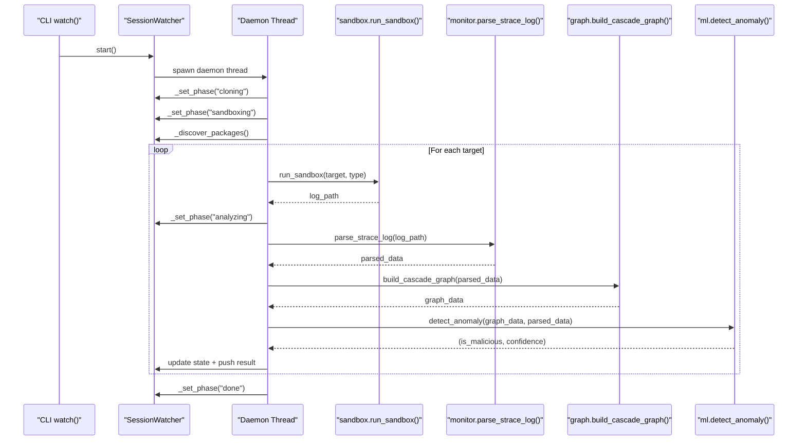
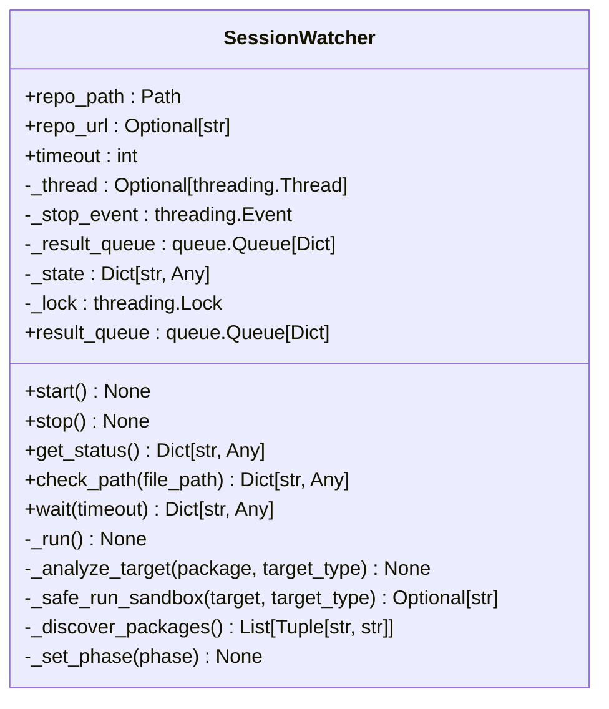
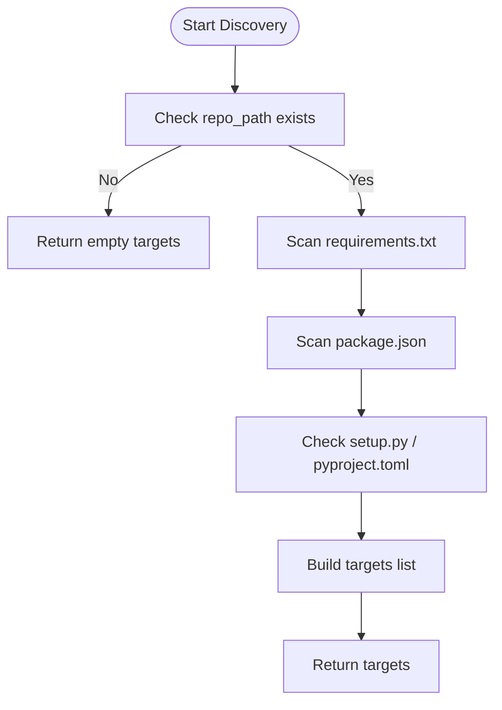
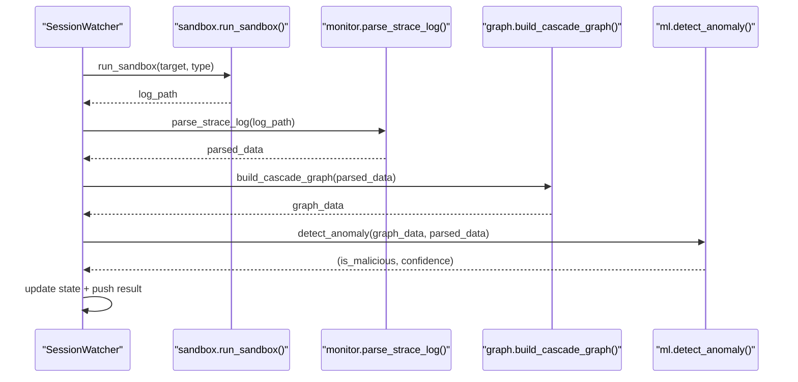
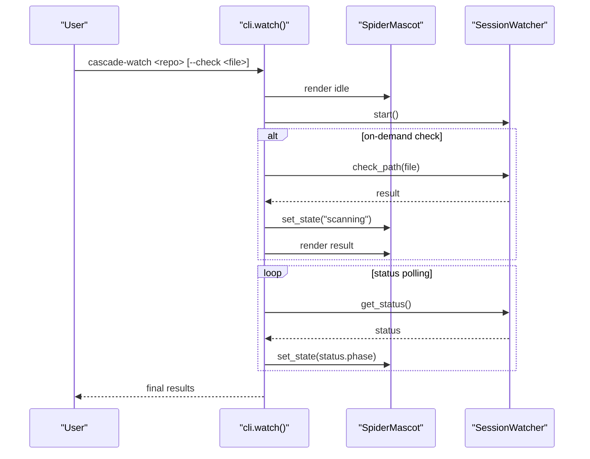
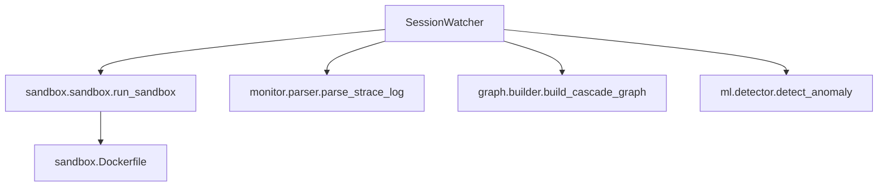

# Session Watching

<cite>
**Referenced Files in This Document**
- [session.py](file://TraceTree/watcher/session.py)
- [cli.py](file://TraceTree/cli.py)
- [sandbox.py](file://TraceTree/sandbox/sandbox.py)
- [parser.py](file://TraceTree/monitor/parser.py)
- [builder.py](file://TraceTree/graph/builder.py)
- [detector.py](file://TraceTree/ml/detector.py)
- [spider.py](file://TraceTree/mascot/spider.py)
- [Dockerfile](file://TraceTree/sandbox/Dockerfile)
- [README.md](file://TraceTree/README.md)
</cite>

## Table of Contents
1. [Introduction](#introduction)
2. [Project Structure](#project-structure)
3. [Core Components](#core-components)
4. [Architecture Overview](#architecture-overview)
5. [Detailed Component Analysis](#detailed-component-analysis)
6. [Dependency Analysis](#dependency-analysis)
7. [Performance Considerations](#performance-considerations)
8. [Troubleshooting Guide](#troubleshooting-guide)
9. [Conclusion](#conclusion)
10. [Appendices](#appendices)

## Introduction
This document provides a comprehensive guide to the SessionWatcher class, which continuously monitors a repository directory and performs background sandbox analysis on discovered packages. It covers initialization parameters, thread-safe state management, the background daemon execution model, automatic package discovery, and the integrated analysis pipeline (sandbox execution, strace log parsing, graph construction, and machine learning anomaly detection). It also documents the public API, thread-safety mechanisms, result queuing, graceful shutdown, and practical usage patterns for monitoring repositories and integrating with the broader TraceTree analysis pipeline.

## Project Structure
The SessionWatcher resides in the watcher module and orchestrates the end-to-end analysis pipeline. It integrates with the sandbox, monitor, graph, and ML modules, and is surfaced through the CLI’s watch command.

```mermaid
graph TB
subgraph "Watcher"
SW["SessionWatcher<br/>background thread"]
end
subgraph "Pipeline Modules"
SB["sandbox.sandbox<br/>run_sandbox()"]
PR["monitor.parser<br/>parse_strace_log()"]
GB["graph.builder<br/>build_cascade_graph()"]
ML["ml.detector<br/>detect_anomaly()"]
end
subgraph "CLI"
CLI["cli.watch()<br/>Typer command"]
SP["mascot.spider<br/>SpiderMascot"]
end
SW --> SB
SB --> PR
PR --> GB
GB --> ML
CLI --> SW
CLI --> SP
```

**Diagram sources**
- [session.py](file://TraceTree/watcher/session.py)
- [sandbox.py](file://TraceTree/sandbox/sandbox.py)
- [parser.py](file://TraceTree/monitor/parser.py)
- [builder.py](file://TraceTree/graph/builder.py)
- [detector.py](file://TraceTree/ml/detector.py)
- [cli.py](file://TraceTree/cli.py)
- [spider.py](file://TraceTree/mascot/spider.py)

**Section sources**
- [session.py](file://TraceTree/watcher/session.py)
- [cli.py](file://TraceTree/cli.py)
- [README.md](file://TraceTree/README.md)

## Core Components
- SessionWatcher: Background thread that discovers packages, runs sandbox analysis, parses logs, constructs graphs, and applies ML anomaly detection. Exposes status and results via thread-safe APIs.
- Pipeline modules:
  - sandbox.sandbox: Docker-based sandbox runner with target-type-specific logic and strace capture.
  - monitor.parser: Parses strace logs into structured events with severity and flags.
  - graph.builder: Builds a NetworkX graph and Cytoscape-compatible representation.
  - ml.detector: Extracts features and classifies anomalies using ML or fallback models.
- CLI integration: The watch command initializes SessionWatcher, renders a mascot, and polls status in a loop.

Key initialization parameters:
- repo_path: Local path to the repository or target directory.
- repo_url: Optional remote Git URL (future git clone support).
- timeout: Maximum seconds allowed per sandbox execution.

Thread-safe state management:
- Internal state includes phase, threats, confidence, malicious flag, log path, and error.
- Access guarded by a threading lock; phase transitions are atomic.

Background execution model:
- Daemon thread runs the main loop, transitioning phases and processing discovered targets.

**Section sources**
- [session.py](file://TraceTree/watcher/session.py)
- [sandbox.py](file://TraceTree/sandbox/sandbox.py)
- [parser.py](file://TraceTree/monitor/parser.py)
- [builder.py](file://TraceTree/graph/builder.py)
- [detector.py](file://TraceTree/ml/detector.py)
- [cli.py](file://TraceTree/cli.py)

## Architecture Overview
The SessionWatcher executes a continuous monitoring loop in a background daemon thread. It discovers packages by scanning for common manifest files, runs each target through the sandbox pipeline, and streams results through a queue while exposing status snapshots.



**Diagram sources**
- [session.py](file://TraceTree/watcher/session.py)
- [sandbox.py](file://TraceTree/sandbox/sandbox.py)
- [parser.py](file://TraceTree/monitor/parser.py)
- [builder.py](file://TraceTree/graph/builder.py)
- [detector.py](file://TraceTree/ml/detector.py)
- [cli.py](file://TraceTree/cli.py)

## Detailed Component Analysis

### SessionWatcher Class
- Responsibilities:
  - Continuous repository monitoring and background analysis.
  - Automatic package discovery from repository manifests.
  - Orchestrating sandbox execution, parsing, graph building, and anomaly detection.
  - Exposing status snapshots and streaming results.
- Initialization parameters:
  - repo_path: Local filesystem path to repository or target directory.
  - repo_url: Optional remote Git URL (reserved for future git clone integration).
  - timeout: Per-sandbox execution timeout in seconds.
- Thread-safe state:
  - Internal state dictionary with phase, threats, confidence, malicious flag, log path, and error.
  - Atomic updates protected by a threading lock.
- Background execution:
  - Daemon thread runs the main loop transitioning phases: cloning → sandboxing → analyzing → done/error/stopped.
- Public API:
  - start(): Launches the background thread (idempotent if already running).
  - stop(): Signals graceful shutdown and waits up to 10 seconds for thread termination.
  - get_status(): Returns a shallow copy of current state snapshot.
  - check_path(file_path): On-demand focused analysis for a specific file or command; blocks until completion or timeout.
  - wait(timeout): Blocks until watcher finishes or timeout expires.
  - result_queue: Queue of analysis result snapshots for push-style consumption.
- Package discovery:
  - Scans for requirements.txt, package.json, setup.py, and pyproject.toml.
  - Translates discovered manifests into analysis targets with appropriate types (pip, npm, or repo path).
- Analysis pipeline integration:
  - _safe_run_sandbox(): Wraps sandbox execution with timeout and error handling.
  - parse_strace_log(), build_cascade_graph(), detect_anomaly(): Integrated into the analysis loop.



**Diagram sources**
- [session.py](file://TraceTree/watcher/session.py)

**Section sources**
- [session.py](file://TraceTree/watcher/session.py)

### Package Discovery Mechanism
The discovery method scans the repository directory for common manifest files and converts them into analysis targets:
- requirements.txt: Each non-comment, non-hyphen line becomes a pip target.
- package.json: Dependencies and devDependencies are treated as npm targets.
- setup.py or pyproject.toml: The repository path itself is treated as a pip target.



**Diagram sources**
- [session.py](file://TraceTree/watcher/session.py)

**Section sources**
- [session.py](file://TraceTree/watcher/session.py)

### Analysis Pipeline Integration
The SessionWatcher integrates the following pipeline stages for each discovered target:
- Sandbox execution: run_sandbox(target, target_type) returns a strace log path.
- Log parsing: parse_strace_log(log_path) produces structured events with severity and flags.
- Graph construction: build_cascade_graph(parsed_data) builds a NetworkX graph and Cytoscape JSON.
- Anomaly detection: detect_anomaly(graph_data, parsed_data) classifies behavior and computes confidence.



**Diagram sources**
- [session.py](file://TraceTree/watcher/session.py)
- [sandbox.py](file://TraceTree/sandbox/sandbox.py)
- [parser.py](file://TraceTree/monitor/parser.py)
- [builder.py](file://TraceTree/graph/builder.py)
- [detector.py](file://TraceTree/ml/detector.py)

**Section sources**
- [session.py](file://TraceTree/watcher/session.py)
- [sandbox.py](file://TraceTree/sandbox/sandbox.py)
- [parser.py](file://TraceTree/monitor/parser.py)
- [builder.py](file://TraceTree/graph/builder.py)
- [detector.py](file://TraceTree/ml/detector.py)

### Public API and Thread Safety
- start(): Idempotent; launches a daemon thread if none is alive.
- stop(): Sets a stop event and waits up to 10 seconds for thread join; marks state as stopped.
- get_status(): Returns a shallow copy of internal state snapshot; protected by a lock.
- check_path(file_path): Determines target type by extension or filename, runs focused sandbox analysis, and returns a result dict with malicious flag, confidence, threats, graph stats, log path, and error.
- wait(timeout): Blocks until thread finishes or timeout expires.
- result_queue: Pushes a snapshot per analyzed target with keys: package, type, malicious, confidence, threats, log_path.

Thread-safety mechanisms:
- Internal state updates and status retrieval are guarded by a threading lock.
- Phase transitions are atomic via _set_phase().
- Stop signaling uses a threading.Event to coordinate graceful shutdown.

**Section sources**
- [session.py](file://TraceTree/watcher/session.py)

### Practical Workflows and Integration
- CLI watch command:
  - Initializes SessionWatcher with repo path and optional URL.
  - Optionally performs an on-demand check via check_path().
  - Renders a Spider mascot and polls get_status() in a loop until completion or interruption.
  - Enforces a single watcher per directory via a lockfile.



**Diagram sources**
- [cli.py](file://TraceTree/cli.py)
- [session.py](file://TraceTree/watcher/session.py)
- [spider.py](file://TraceTree/mascot/spider.py)

**Section sources**
- [cli.py](file://TraceTree/cli.py)
- [session.py](file://TraceTree/watcher/session.py)
- [spider.py](file://TraceTree/mascot/spider.py)

## Dependency Analysis
- Internal dependencies:
  - SessionWatcher depends on sandbox.sandbox for containerized execution, monitor.parser for log parsing, graph.builder for graph construction, and ml.detector for anomaly detection.
- External dependencies:
  - Docker SDK for Python to manage containers and images.
  - NetworkX for graph construction.
  - scikit-learn for ML models.
  - Rich for CLI rendering and progress reporting.
- Docker image:
  - The sandbox module builds and uses a sandbox image with strace, Node.js, Wine, and extraction tools.



**Diagram sources**
- [session.py](file://TraceTree/watcher/session.py)
- [sandbox.py](file://TraceTree/sandbox/sandbox.py)
- [parser.py](file://TraceTree/monitor/parser.py)
- [builder.py](file://TraceTree/graph/builder.py)
- [detector.py](file://TraceTree/ml/detector.py)
- [Dockerfile](file://TraceTree/sandbox/Dockerfile)

**Section sources**
- [session.py](file://TraceTree/watcher/session.py)
- [sandbox.py](file://TraceTree/sandbox/sandbox.py)
- [parser.py](file://TraceTree/monitor/parser.py)
- [builder.py](file://TraceTree/graph/builder.py)
- [detector.py](file://TraceTree/ml/detector.py)
- [Dockerfile](file://TraceTree/sandbox/Dockerfile)

## Performance Considerations
- Background daemon thread ensures responsiveness; avoid blocking operations in the main thread.
- Per-target timeouts in sandbox execution prevent hangs; adjust timeout parameter as needed.
- Result queue enables asynchronous consumption; consider batching or rate-limiting consumers.
- Graph construction and ML inference scale with event volume; large logs may increase latency.
- Docker image build occurs on first run; subsequent runs reuse the built image.

[No sources needed since this section provides general guidance]

## Troubleshooting Guide
Common issues and resolutions:
- Docker not installed or unreachable:
  - The sandbox runner checks for Docker availability and prints actionable messages. Ensure Docker is installed and the daemon is running.
- Sandbox failures or empty logs:
  - The sandbox filters known benign statuses and returns empty strings for certain failure modes. Verify target type and file existence.
- Parser errors:
  - The parser handles multi-line strace entries and malformed lines; failures are logged and do not crash the watcher.
- ML model loading:
  - The detector attempts to load a local model or fetch from GCS; on failure, it falls back to a baseline model. Check model file presence and network connectivity.
- Graceful shutdown:
  - The stop() method signals the thread and waits up to 10 seconds; if the thread does not terminate, a warning is logged.

**Section sources**
- [sandbox.py](file://TraceTree/sandbox/sandbox.py)
- [parser.py](file://TraceTree/monitor/parser.py)
- [detector.py](file://TraceTree/ml/detector.py)
- [session.py](file://TraceTree/watcher/session.py)

## Conclusion
The SessionWatcher provides a robust, thread-safe framework for continuous repository monitoring and background analysis. By combining manifest-based discovery with a comprehensive sandbox pipeline and ML-driven anomaly detection, it delivers actionable insights into potential threats. Its CLI integration and mascot rendering offer a friendly user experience, while the result queue and status API enable flexible consumption patterns.

[No sources needed since this section summarizes without analyzing specific files]

## Appendices

### API Reference Summary
- SessionWatcher(repo_path, repo_url=None, timeout=120)
  - start(): Launch background thread.
  - stop(): Signal graceful shutdown.
  - get_status(): Snapshot of current state.
  - check_path(file_path): On-demand analysis result.
  - wait(timeout): Block until completion.
  - result_queue: Queue of analysis snapshots.

**Section sources**
- [session.py](file://TraceTree/watcher/session.py)