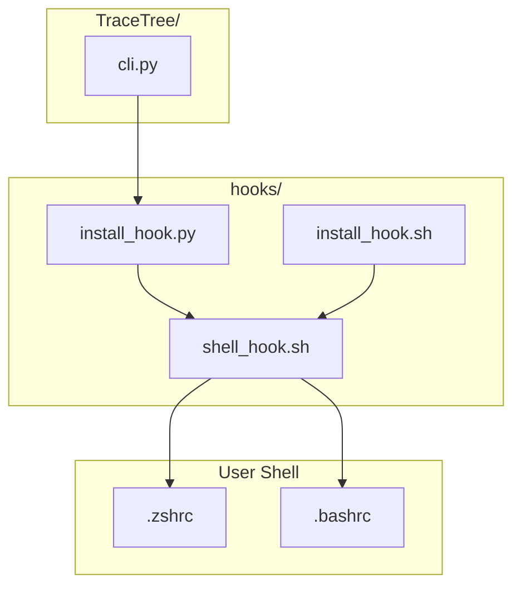
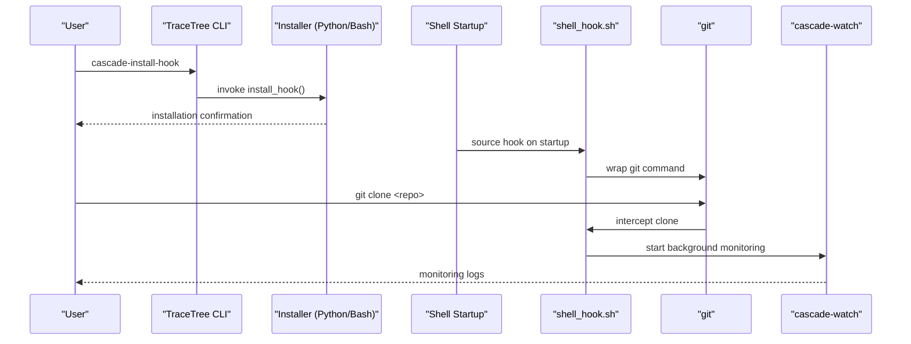
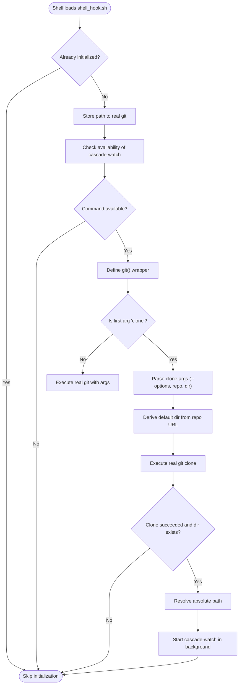
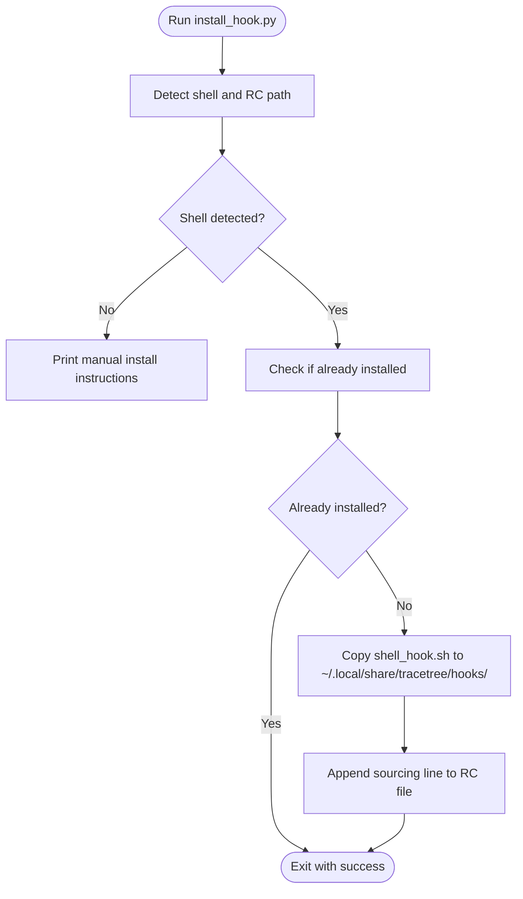
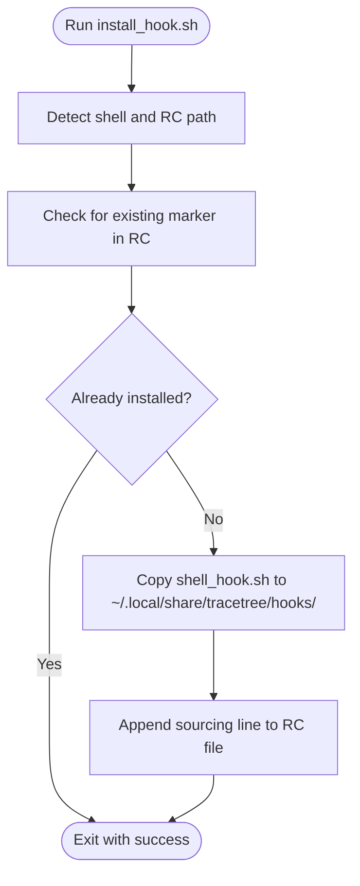
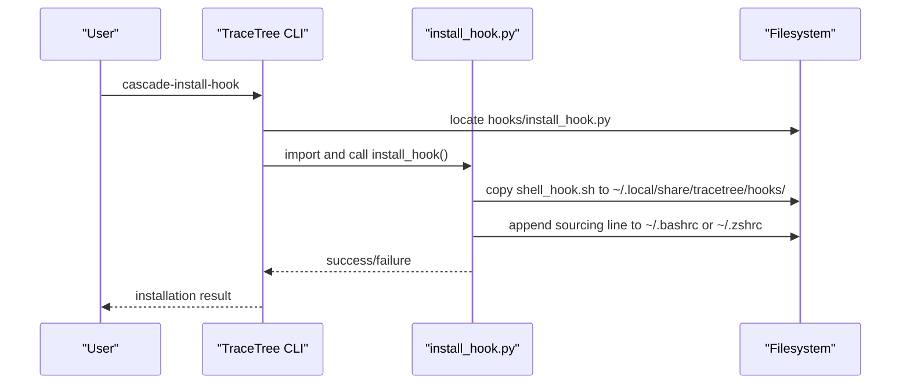
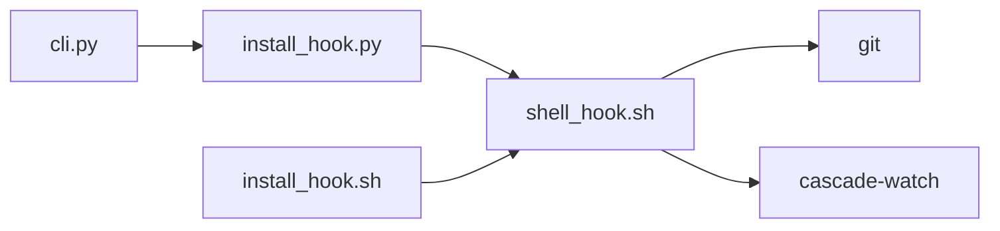

# Shell Hook Integration

<cite>
**Referenced Files in This Document**
- [install_hook.py](file://hooks/install_hook.py)
- [install_hook.sh](file://hooks/install_hook.sh)
- [shell_hook.sh](file://hooks/shell_hook.sh)
- [cli.py](file://TraceTree/cli.py)
- [README.md](file://README.md)
</cite>

## Table of Contents
1. [Introduction](#introduction)
2. [Project Structure](#project-structure)
3. [Core Components](#core-components)
4. [Architecture Overview](#architecture-overview)
5. [Detailed Component Analysis](#detailed-component-analysis)
6. [Dependency Analysis](#dependency-analysis)
7. [Performance Considerations](#performance-considerations)
8. [Troubleshooting Guide](#troubleshooting-guide)
9. [Security Considerations](#security-considerations)
10. [Practical Installation Examples](#practical-installation-examples)
11. [Integration Patterns](#integration-patterns)
12. [Conclusion](#conclusion)

## Introduction
This document explains TraceTree's shell hook system that enables automatic repository monitoring setup and git operation interception. The system consists of:
- A shell integration script that wraps the git command to intercept specific operations
- Cross-platform installation helpers that place hook files and configure shell startup
- A CLI entry point that orchestrates installation and integrates with the broader TraceTree workflow

The primary goal is to automatically start TraceTree's session guardian after successful git clone operations, enabling continuous monitoring of newly cloned repositories.

## Project Structure
The shell hook system resides in the hooks directory and integrates with the main CLI entry point:

**Diagram sources**
- [install_hook.py:1-129](file://hooks/install_hook.py#L1-L129)
- [install_hook.sh:1-60](file://hooks/install_hook.sh#L1-L60)
- [shell_hook.sh:1-93](file://hooks/shell_hook.sh#L1-L93)
- [cli.py:937-963](file://TraceTree/cli.py#L937-L963)

**Section sources**
- [install_hook.py:1-129](file://hooks/install_hook.py#L1-L129)
- [install_hook.sh:1-60](file://hooks/install_hook.sh#L1-L60)
- [shell_hook.sh:1-93](file://hooks/shell_hook.sh#L1-L93)
- [cli.py:937-963](file://TraceTree/cli.py#L937-L963)

## Core Components
- Shell integration script: wraps the git command to intercept specific operations and trigger monitoring
- Cross-platform installer (Python): detects shell, copies hook file, and appends sourcing to shell RC
- Cross-platform installer (Bash): mirrors the Python installer for environments without Python
- CLI integration: exposes a command to run the installer and integrates with the broader TraceTree workflow

Key responsibilities:
- Automatic monitoring activation when cloning repositories
- Safe handling of git operations (only intercepts specific commands)
- Cross-shell compatibility (bash/zsh)
- Idempotent installation with detection of existing configurations

**Section sources**
- [shell_hook.sh:1-93](file://hooks/shell_hook.sh#L1-L93)
- [install_hook.py:1-129](file://hooks/install_hook.py#L1-L129)
- [install_hook.sh:1-60](file://hooks/install_hook.sh#L1-L60)
- [cli.py:937-963](file://TraceTree/cli.py#L937-L963)

## Architecture Overview
The shell hook system operates through a layered approach:
- Installation layer: places the hook script and configures shell startup
- Runtime layer: intercepts specific git operations and triggers monitoring
- Orchestration layer: CLI commands coordinate installation and monitoring

**Diagram sources**
- [cli.py:937-963](file://TraceTree/cli.py#L937-L963)
- [install_hook.py:71-119](file://hooks/install_hook.py#L71-L119)
- [install_hook.sh:32-59](file://hooks/install_hook.sh#L32-L59)
- [shell_hook.sh:27-89](file://hooks/shell_hook.sh#L27-L89)

## Detailed Component Analysis

### Shell Integration Script (shell_hook.sh)
The shell integration script performs the following:
- Initializes once per shell session
- Stores a reference to the real git binary
- Checks availability of the monitoring command
- Defines a git wrapper that intercepts specific operations
- Parses git clone arguments to determine repository and destination
- Launches monitoring in the background upon successful clone

**Diagram sources**
- [shell_hook.sh:7-89](file://hooks/shell_hook.sh#L7-L89)

**Section sources**
- [shell_hook.sh:1-93](file://hooks/shell_hook.sh#L1-L93)

### Cross-Platform Installer (Python) (install_hook.py)
The Python installer:
- Detects the user's shell by checking environment variables and $SHELL
- Determines the appropriate shell RC file (.bashrc or .zshrc)
- Copies the hook script to a standard location (~/.local/share/tracetree/hooks/)
- Appends a sourcing line to the detected RC file
- Ensures idempotency by checking for existing configuration markers

**Diagram sources**
- [install_hook.py:29-119](file://hooks/install_hook.py#L29-L119)

**Section sources**
- [install_hook.py:1-129](file://hooks/install_hook.py#L1-L129)

### Cross-Platform Installer (Bash) (install_hook.sh)
The Bash installer mirrors the Python installer:
- Detects shell and RC file
- Ensures RC file exists
- Checks for existing installation marker
- Copies the hook script to the standard location
- Appends the sourcing line to the RC file

**Diagram sources**
- [install_hook.sh:10-59](file://hooks/install_hook.sh#L10-L59)

**Section sources**
- [install_hook.sh:1-60](file://hooks/install_hook.sh#L1-L60)

### CLI Integration (cli.py)
The CLI provides:
- A command to install the shell hook
- In-process execution of the Python installer
- Integration with the broader TraceTree workflow

**Diagram sources**
- [cli.py:937-963](file://TraceTree/cli.py#L937-L963)
- [install_hook.py:71-119](file://hooks/install_hook.py#L71-L119)

**Section sources**
- [cli.py:937-963](file://TraceTree/cli.py#L937-L963)

## Dependency Analysis
The shell hook system has minimal external dependencies:
- Shell integration relies on bash/zsh built-ins and standard utilities
- Installation helpers rely on standard filesystem operations
- Monitoring integration depends on the presence of the cascade-watch command

**Diagram sources**
- [shell_hook.sh:13-24](file://hooks/shell_hook.sh#L13-L24)
- [install_hook.py:77-111](file://hooks/install_hook.py#L77-L111)
- [install_hook.sh:43-52](file://hooks/install_hook.sh#L43-L52)
- [cli.py:946-958](file://TraceTree/cli.py#L946-L958)

**Section sources**
- [shell_hook.sh:13-24](file://hooks/shell_hook.sh#L13-L24)
- [install_hook.py:77-111](file://hooks/install_hook.py#L77-L111)
- [install_hook.sh:43-52](file://hooks/install_hook.sh#L43-L52)
- [cli.py:946-958](file://TraceTree/cli.py#L946-L958)

## Performance Considerations
- The shell integration adds negligible overhead because it only initializes once per shell session
- Git wrapper checks are lightweight and short-circuit when not intercepting specific operations
- Background monitoring starts asynchronously, avoiding blocking the user's shell prompt
- Installation helpers perform minimal filesystem operations and checks

## Troubleshooting Guide
Common issues and resolutions:
- Shell detection failures: ensure $SHELL points to a valid shell or set ZSH_VERSION/BASH_VERSION appropriately
- Missing cascade-watch command: install the TraceTree package so cascade-watch is available in PATH
- Permission errors: verify write permissions to home directory and shell RC files
- Existing installations: the installers check for markers and avoid duplicate entries
- Non-interactive shells: ensure the sourcing line is placed in the appropriate RC file for non-login shells

**Section sources**
- [install_hook.py:35-59](file://hooks/install_hook.py#L35-L59)
- [install_hook.sh:10-27](file://hooks/install_hook.sh#L10-L27)
- [shell_hook.sh:21-24](file://hooks/shell_hook.sh#L21-L24)

## Security Considerations
- Hook execution scope: the git wrapper only intercepts specific operations, minimizing attack surface
- Command availability checks: ensures cascade-watch is present before attempting to start monitoring
- File permissions: installer sets executable permissions on the hook script
- Idempotent installation: prevents duplicate sourcing lines and reduces configuration drift
- Environment isolation: monitoring runs in the background without affecting interactive shell sessions

**Section sources**
- [shell_hook.sh:21-24](file://hooks/shell_hook.sh#L21-L24)
- [install_hook.py:105-106](file://hooks/install_hook.py#L105-L106)

## Practical Installation Examples
- Using the CLI installer:
  - Run the command to install the shell hook
  - The installer detects your shell and appends the sourcing line to the appropriate RC file
  - Open a new terminal or source the RC file to activate the hook

- Manual installation (if needed):
  - Copy the hook script to ~/.local/share/tracetree/hooks/
  - Add a sourcing line to ~/.bashrc or ~/.zshrc
  - Ensure the script is executable

- Verification steps:
  - Confirm the sourcing line exists in your shell RC file
  - Verify the hook script is present in the standard location
  - Test by running git clone and checking for background monitoring logs

**Section sources**
- [cli.py:937-963](file://TraceTree/cli.py#L937-L963)
- [install_hook.py:109-118](file://hooks/install_hook.py#L109-L118)
- [install_hook.sh:47-59](file://hooks/install_hook.sh#L47-L59)

## Integration Patterns
- Development workflow integration: automatically monitor repositories after cloning, reducing manual steps
- CI/CD compatibility: the hook only affects interactive shells and does not interfere with automated processes
- Multi-environment support: works across bash and zsh environments with consistent behavior
- Incremental adoption: users can opt-in to shell hook monitoring without changing existing workflows

**Section sources**
- [shell_hook.sh:27-89](file://hooks/shell_hook.sh#L27-L89)
- [README.md:232-241](file://README.md#L232-L241)

## Conclusion
TraceTree's shell hook system provides seamless integration between shell environments and repository monitoring. Through cross-platform installers and a focused git wrapper, it enables automatic monitoring setup with minimal friction. The design emphasizes safety, idempotency, and compatibility across different shells and environments.