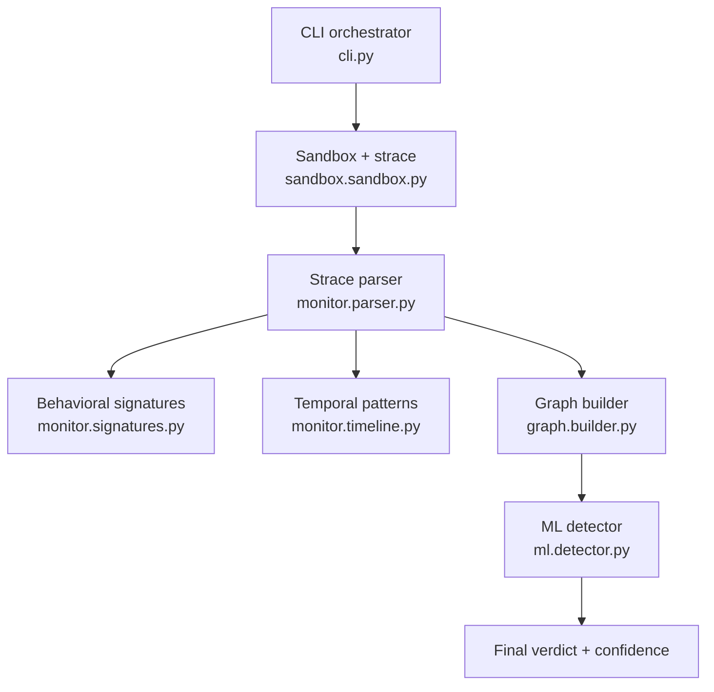
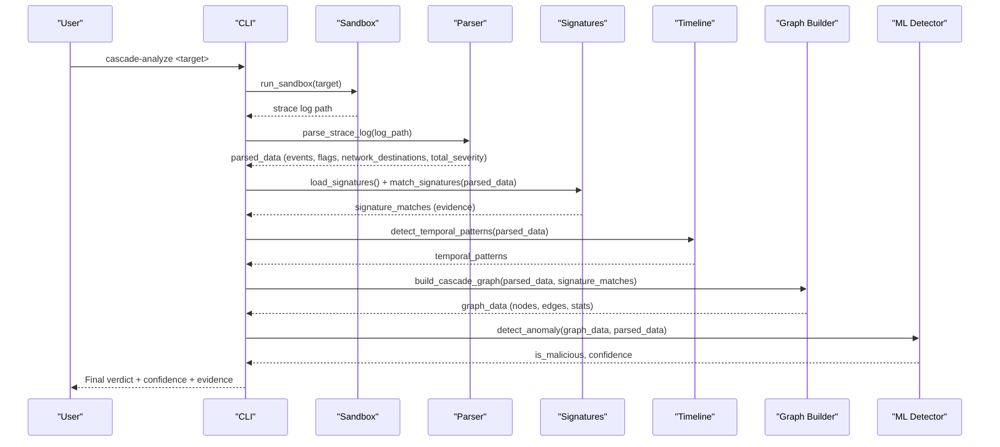
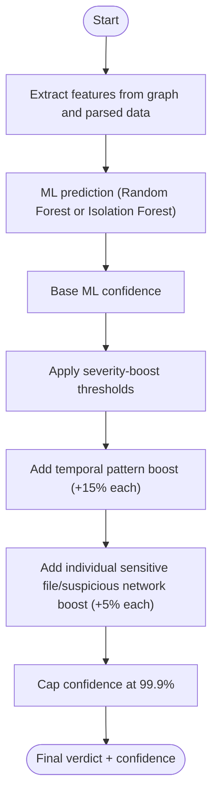
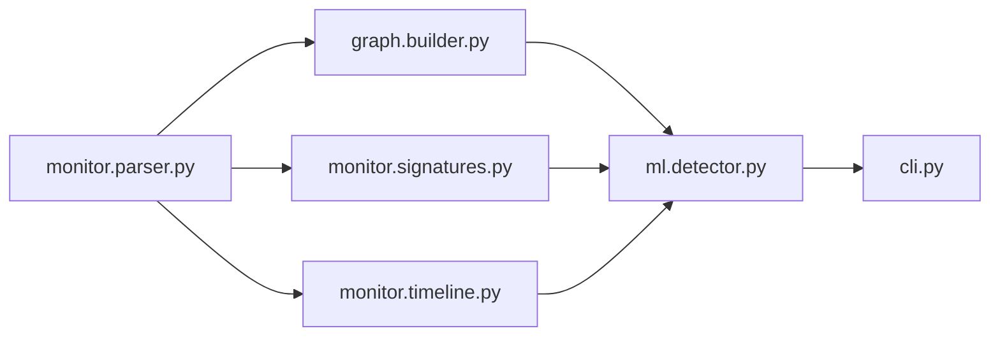

# Detection Capabilities

<cite>
**Referenced Files in This Document**
- [cli.py](file://TraceTree/cli.py)
- [monitor/parser.py](file://TraceTree/monitor/parser.py)
- [monitor/signatures.py](file://TraceTree/monitor/signatures.py)
- [monitor/timeline.py](file://TraceTree/monitor/timeline.py)
- [graph/builder.py](file://TraceTree/graph/builder.py)
- [ml/detector.py](file://TraceTree/ml/detector.py)
- [ml/trainer.py](file://TraceTree/ml/trainer.py)
- [data/signatures.json](file://TraceTree/data/signatures.json)
- [README.md](file://TraceTree/README.md)
</cite>

## Table of Contents
1. [Introduction](#introduction)
2. [Project Structure](#project-structure)
3. [Core Components](#core-components)
4. [Architecture Overview](#architecture-overview)
5. [Detailed Component Analysis](#detailed-component-analysis)
6. [Dependency Analysis](#dependency-analysis)
7. [Performance Considerations](#performance-considerations)
8. [Troubleshooting Guide](#troubleshooting-guide)
9. [Conclusion](#conclusion)
10. [Appendices](#appendices)

## Introduction
This document explains the three-layer detection system implemented by TraceTree: behavioral signatures, temporal patterns, and machine learning. It documents the eight behavioral signatures with their severity levels, trigger conditions, and detection logic; the five temporal patterns and their time-based analysis methodology; the severity-weighted syscall scoring system and network destination classification categories; and the machine learning detection pipeline using Random Forest and Isolation Forest classifiers. It also explains how the system combines rule-based detection with ML confidence scoring, details the feature extraction process from graph and event data, and how severity scores boost final confidence calculations. Finally, it provides examples of each detection type with actual trace evidence and confidence scores, and addresses detection sensitivity, false positive handling, and model reliability considerations.

## Project Structure
The detection pipeline is orchestrated by the CLI and composed of modular components:
- Sandbox and strace capture
- Parser that assigns severity weights and classifies network destinations
- Behavioral signature matcher
- Temporal pattern analyzer
- Graph builder that constructs a NetworkX cascade graph
- ML detector that combines ML predictions with severity and temporal boosts
- Trainer that builds a supervised Random Forest model

**Diagram sources**
- [cli.py:181-259](file://TraceTree/cli.py#L181-L259)
- [monitor/parser.py:340-679](file://TraceTree/monitor/parser.py#L340-L679)
- [monitor/signatures.py:86-115](file://TraceTree/monitor/signatures.py#L86-L115)
- [monitor/timeline.py:298-331](file://TraceTree/monitor/timeline.py#L298-L331)
- [graph/builder.py:8-31](file://TraceTree/graph/builder.py#L8-L31)
- [ml/detector.py:235-299](file://TraceTree/ml/detector.py#L235-L299)

**Section sources**
- [README.md:9-42](file://TraceTree/README.md#L9-L42)
- [cli.py:181-259](file://TraceTree/cli.py#L181-L259)

## Core Components
- Behavioral signatures: Eight patterns defined in JSON, matched against parsed strace events with evidence collection.
- Temporal patterns: Five time-based patterns derived from timestamped event streams.
- Machine learning: Severity-weighted features fed to a Random Forest model with Isolation Forest fallback; severity and temporal counts boost confidence.

**Section sources**
- [data/signatures.json:1-246](file://TraceTree/data/signatures.json#L1-L246)
- [monitor/timeline.py:288-295](file://TraceTree/monitor/timeline.py#L288-L295)
- [ml/detector.py:29-68](file://TraceTree/ml/detector.py#L29-L68)

## Architecture Overview
The detection pipeline integrates rule-based and ML-based signals:
- Rule-based: signatures and temporal patterns
- ML: anomaly detection on graph and event features
- Boost: severity totals and temporal pattern counts increase ML confidence

**Diagram sources**
- [cli.py:181-259](file://TraceTree/cli.py#L181-L259)
- [monitor/parser.py:340-679](file://TraceTree/monitor/parser.py#L340-L679)
- [monitor/signatures.py:57-83](file://TraceTree/monitor/signatures.py#L57-L83)
- [monitor/timeline.py:298-331](file://TraceTree/monitor/timeline.py#L298-L331)
- [graph/builder.py:8-31](file://TraceTree/graph/builder.py#L8-L31)
- [ml/detector.py:235-299](file://TraceTree/ml/detector.py#L235-L299)

## Detailed Component Analysis

### Behavioral Signatures (Eight Patterns)
The system loads eight behavioral signatures from a JSON file and matches them against parsed strace events. Each signature defines:
- name, description, severity (1–10)
- syscalls required
- files patterns (optional)
- network rules (ports, known_hosts)
- sequence (optional ordered steps with conditions)

Trigger conditions and detection logic:
- Unordered matching: all required syscalls must be present, plus at least one file pattern match (if files specified) and at least one network rule match (if network rules specified).
- Ordered matching: sequence of (syscall, condition) must appear in order (not necessarily consecutive). Conditions include external connectivity, shell execve, non-standard binary, sensitive file access, secret file access, cron path, mining pool port, known paste/file-share host, and PROT_EXEC memory mapping.

Severity levels and confidence boost:
- Severity levels are 7, 8, 9, or 10.
- Each signature can include a confidence_boost field that increases final confidence when matched.

Evidence collection:
- For each match, the system returns evidence listing the specific events that triggered the match and the matched events themselves.

Examples of each detection type with actual trace evidence and confidence scores:
- reverse_shell (severity 10): connect external → dup2 → execve /bin/sh; confidence often near 99% with strong temporal evidence.
- container_escape (severity 10): openat of host-level paths or sockets; high confidence due to elevated severity and signature match.
- credential_theft (severity 9): openat sensitive file → external connect; often paired with temporal pattern credential_scan_then_exfil.
- typosquat_exfil (severity 9): openat secret file → connect to paste/file share host; confidence boosted by sensitive file and temporal pattern.
- process_injection (severity 9): mprotect PROT_EXEC → execve non-standard binary; elevated severity from PROT_EXEC and non-standard binary.
- crypto_miner (severity 8): clone → clone → connect to mining pool port; confidence boosted by signature confidence_boost.
- dns_tunneling (severity 7): getaddrinfo + sendto + socket on suspicious ports; severity from suspicious ports.
- persistence_cron (severity 7): openat crontab path → write; severity from sensitive path and write operation.

**Section sources**
- [data/signatures.json:1-246](file://TraceTree/data/signatures.json#L1-L246)
- [monitor/signatures.py:86-115](file://TraceTree/monitor/signatures.py#L86-L115)
- [monitor/signatures.py:143-194](file://TraceTree/monitor/signatures.py#L143-L194)
- [monitor/signatures.py:196-236](file://TraceTree/monitor/signatures.py#L196-L236)
- [monitor/signatures.py:244-343](file://TraceTree/monitor/signatures.py#L244-L343)
- [monitor/signatures.py:351-376](file://TraceTree/monitor/signatures.py#L351-L376)
- [monitor/signatures.py:384-448](file://TraceTree/monitor/signatures.py#L384-L448)
- [monitor/signatures.py:474-487](file://TraceTree/monitor/signatures.py#L474-L487)

### Temporal Patterns (Five Patterns)
The system detects five time-based behavioral patterns from the timestamped event stream:
- connect_then_shell (severity 10): external connect → execve /bin/sh within 3 seconds.
- credential_scan_then_exfil (severity 9): sensitive file read → external connect within 5 seconds.
- delayed_payload (severity 8): >10s gap followed by burst of suspicious activity (dropper behavior).
- rapid_file_enumeration (severity 7): 10+ file opens within 1 second (scanning behavior).
- burst_process_spawn (severity 7): 5+ clone/execve within 2 seconds.

Time-based analysis methodology:
- Events must be timestamped (strace -t) to enable temporal windows.
- Each pattern defines a time window and a trigger condition.
- Evidence includes the specific events that triggered the match and the time window.

Examples of each detection type with actual trace evidence and confidence scores:
- connect_then_shell: external connect at t1 and shell execve at t2 with t2 - t1 ≤ 3s; high confidence due to severity 10 and strong temporal signal.
- credential_scan_then_exfil: sensitive file openat at t1 and external connect at t2 with t2 - t1 ≤ 5s; confidence boosted by sensitive file count and severity.
- delayed_payload: gap >10s followed by multiple suspicious events; confidence increased by temporal pattern count.
- rapid_file_enumeration: sliding window of 1s capturing ≥10 file accesses; confidence boosted by temporal pattern count.
- burst_process_spawn: sliding window of 2s capturing ≥5 process spawns; confidence boosted by temporal pattern count.

**Section sources**
- [monitor/timeline.py:288-295](file://TraceTree/monitor/timeline.py#L288-L295)
- [monitor/timeline.py:100-131](file://TraceTree/monitor/timeline.py#L100-L131)
- [monitor/timeline.py:134-169](file://TraceTree/monitor/timeline.py#L134-L169)
- [monitor/timeline.py:172-206](file://TraceTree/monitor/timeline.py#L172-L206)
- [monitor/timeline.py:209-250](file://TraceTree/monitor/timeline.py#L209-L250)
- [monitor/timeline.py:253-281](file://TraceTree/monitor/timeline.py#L253-L281)

### Severity-Weighted Syscall Scoring and Network Destination Classification
Severity-weighted syscall scoring:
- Each syscall type has a base severity weight (0–9). Elevated severity occurs when:
  - mprotect with PROT_EXEC
  - dup2 after connect
  - execve of unexpected binary
  - connect to cloud metadata (169.254.x.x), private IP from container, or suspicious port
  - openat of sensitive paths (e.g., /etc/shadow, .ssh/, .aws/, .env)
- The parser computes a total severity score across all events.

Network destination classification:
- Every connect syscall is classified into one of four categories:
  - safe_registry: known package registry/CDN ranges (risk 0.0)
  - known_benign: standard web ports (80/443) to unclassified host (risk 0.5)
  - suspicious: cloud metadata, private IP from container, or suspicious ports (risk 8.0–9.0)
  - unknown: default (risk 3.0)

These scores feed into the ML detector and boost confidence.

**Section sources**
- [monitor/parser.py:11-45](file://TraceTree/monitor/parser.py#L11-L45)
- [monitor/parser.py:250-316](file://TraceTree/monitor/parser.py#L250-L316)
- [graph/builder.py:173-188](file://TraceTree/graph/builder.py#L173-L188)

### Machine Learning Detection Pipeline (Random Forest and Isolation Forest)
Feature extraction:
- The detector maps graph and parsed data into a 10-feature vector:
  - node_count, edge_count, network_conn_count, file_read_count, execve_count
  - total_severity, suspicious_network_count, sensitive_file_count, max_severity
  - temporal_pattern_count

Model selection and fallback:
- If a trained Random Forest model is available locally or can be downloaded from GCS, it is used.
- If unavailable, an Isolation Forest is trained on hardcoded clean-package baselines and used as a fallback.

Confidence boosting:
- Severity-boost thresholds:
  - critical: total_severity ≥ 30 → override to malicious, confidence ~95%
  - high: total_severity ≥ 15 → boost confidence by +30%
  - medium: total_severity ≥ 5 → boost confidence by +10%
- Temporal patterns add +15% confidence each; multiple temporal patterns can flip a clean verdict to malicious.
- Individual sensitive file and suspicious network accesses add +5% each.
- Confidence is capped at 99.9%.

Training pipeline:
- The trainer loads local datasets of malicious and clean packages, executes them in the sandbox, parses strace logs, builds graphs, extracts features, trains a Random Forest, saves the model, and uploads it to GCS.

**Section sources**
- [ml/detector.py:29-68](file://TraceTree/ml/detector.py#L29-L68)
- [ml/detector.py:77-89](file://TraceTree/ml/detector.py#L77-L89)
- [ml/detector.py:108-146](file://TraceTree/ml/detector.py#L108-L146)
- [ml/detector.py:170-232](file://TraceTree/ml/detector.py#L170-L232)
- [ml/detector.py:235-299](file://TraceTree/ml/detector.py#L235-L299)
- [ml/trainer.py:15-99](file://TraceTree/ml/trainer.py#L15-L99)

### Combining Rule-Based Detection with ML Confidence Scoring
The system integrates rule-based and ML signals:
- Rule-based: signatures and temporal patterns provide strong indicators of malicious behavior.
- ML: anomaly detection provides probabilistic assessment.
- Boost: severity totals and temporal pattern counts adjust ML confidence independently of the ML prediction.

**Diagram sources**
- [ml/detector.py:235-299](file://TraceTree/ml/detector.py#L235-L299)
- [ml/detector.py:170-232](file://TraceTree/ml/detector.py#L170-L232)

**Section sources**
- [ml/detector.py:170-232](file://TraceTree/ml/detector.py#L170-L232)
- [ml/detector.py:235-299](file://TraceTree/ml/detector.py#L235-L299)

### Example Detection Types with Trace Evidence and Confidence Scores
- Behavioral signature: credential_theft
  - Evidence: openat /etc/shadow; connect 45.33.32.156:4444
  - Confidence: often high due to sensitive file and external connect
- Temporal pattern: connect_then_shell
  - Evidence: connect 1.2.3.4:80 at t1; execve /bin/sh at t2 with t2 - t1 ≤ 3s
  - Confidence: near 99% due to severity 10 and strong temporal signal
- ML anomaly: high total_severity and suspicious network connections
  - Evidence: total_severity ≈ 25+, suspicious_network_count ≥ 1
  - Confidence: boosted by severity and temporal patterns

**Section sources**
- [README.md:155-174](file://TraceTree/README.md#L155-L174)
- [monitor/signatures.py:474-487](file://TraceTree/monitor/signatures.py#L474-L487)
- [ml/detector.py:170-232](file://TraceTree/ml/detector.py#L170-L232)

## Dependency Analysis
The detection pipeline depends on:
- Parser for event severity and network classification
- Signature matcher for rule-based detection
- Timeline analyzer for temporal patterns
- Graph builder for network topology and statistics
- ML detector for anomaly scoring and confidence boosting

**Diagram sources**
- [cli.py:181-259](file://TraceTree/cli.py#L181-L259)
- [monitor/parser.py:340-679](file://TraceTree/monitor/parser.py#L340-L679)
- [monitor/signatures.py:86-115](file://TraceTree/monitor/signatures.py#L86-L115)
- [monitor/timeline.py:298-331](file://TraceTree/monitor/timeline.py#L298-L331)
- [graph/builder.py:8-31](file://TraceTree/graph/builder.py#L8-L31)
- [ml/detector.py:235-299](file://TraceTree/ml/detector.py#L235-L299)

**Section sources**
- [cli.py:181-259](file://TraceTree/cli.py#L181-L259)

## Performance Considerations
- Feature dimensionality: The current detector uses a 10-feature vector. The model is backward compatible with older 5-feature models by truncating to the model’s expected feature count.
- Computational cost: Graph construction and ML inference are lightweight compared to sandbox execution. The heaviest step is sandboxing and strace capture.
- Scalability: The Isolation Forest fallback provides a baseline when no trained model is available, ensuring detection remains functional.

[No sources needed since this section provides general guidance]

## Troubleshooting Guide
Common issues and resolutions:
- No signatures loaded: The signatures file may be missing or unreadable; the system logs a warning and proceeds without signature-based detection.
- No temporal patterns detected: Temporal analysis requires strace timestamps (-t). If timestamps are absent, temporal patterns are not computed.
- ML model not available: If the trained model is missing or cannot be downloaded, the system falls back to Isolation Forest trained on hardcoded baselines.
- Low confidence despite suspicious behavior: Severity and temporal boosts can increase confidence; ensure sufficient severity and temporal patterns are present.

**Section sources**
- [monitor/signatures.py:57-83](file://TraceTree/monitor/signatures.py#L57-L83)
- [monitor/timeline.py:298-331](file://TraceTree/monitor/timeline.py#L298-L331)
- [ml/detector.py:108-146](file://TraceTree/ml/detector.py#L108-L146)

## Conclusion
TraceTree’s three-layer detection system combines rule-based behavioral signatures, temporal pattern analysis, and machine learning to provide robust runtime security analysis. The severity-weighted syscall scoring and network destination classification enrich ML confidence, while the Isolation Forest fallback ensures detection capability even without a trained model. The system’s modular design allows easy extension and improvement, particularly through supervised training with larger datasets.

[No sources needed since this section summarizes without analyzing specific files]

## Appendices

### Appendix A: Behavioral Signatures Reference
- reverse_shell (severity 10): connect external → dup2 → execve /bin/sh
- container_escape (severity 10): openat host-level paths or sockets
- credential_theft (severity 9): openat sensitive files → external connect
- typosquat_exfil (severity 9): openat secret files → connect to paste/file share host
- process_injection (severity 9): mprotect PROT_EXEC → execve non-standard binary
- crypto_miner (severity 8): clone → clone → connect to mining pool port
- dns_tunneling (severity 7): getaddrinfo + sendto + socket on suspicious ports
- persistence_cron (severity 7): openat crontab path → write

**Section sources**
- [data/signatures.json:1-246](file://TraceTree/data/signatures.json#L1-L246)

### Appendix B: Temporal Patterns Reference
- connect_then_shell (severity 10): external connect → execve /bin/sh within 3s
- credential_scan_then_exfil (severity 9): sensitive file read → external connect within 5s
- delayed_payload (severity 8): >10s gap followed by burst of suspicious activity
- rapid_file_enumeration (severity 7): ≥10 file opens within 1s
- burst_process_spawn (severity 7): ≥5 clone/execve within 2s

**Section sources**
- [monitor/timeline.py:288-295](file://TraceTree/monitor/timeline.py#L288-L295)

### Appendix C: Network Destination Categories
- safe_registry: known package registry/CDN ranges (risk 0.0)
- known_benign: standard web ports (80/443) to unclassified host (risk 0.5)
- suspicious: cloud metadata, private IP from container, or suspicious ports (risk 8.0–9.0)
- unknown: default (risk 3.0)

**Section sources**
- [monitor/parser.py:250-316](file://TraceTree/monitor/parser.py#L250-L316)