# Project Overview

<cite>
**Referenced Files in This Document**
- [README.md](file://README.md)
- [cli.py](file://cli.py)
- [sandbox/sandbox.py](file://sandbox/sandbox.py)
- [mcp/sandbox.py](file://mcp/sandbox.py)
- [monitor/parser.py](file://monitor/parser.py)
- [monitor/signatures.py](file://monitor/signatures.py)
- [monitor/timeline.py](file://monitor/timeline.py)
- [graph/builder.py](file://graph/builder.py)
- [ml/detector.py](file://ml/detector.py)
- [mcp/client.py](file://mcp/client.py)
- [mcp/features.py](file://mcp/features.py)
- [mcp/classifier.py](file://mcp/classifier.py)
- [mcp/report.py](file://mcp/report.py)
- [watcher/session.py](file://watcher/session.py)
- [mascot/spider.py](file://mascot/spider.py)
- [data/signatures.json](file://data/signatures.json)
</cite>

## Table of Contents
1. [Introduction](#introduction)
2. [Project Structure](#project-structure)
3. [Core Components](#core-components)
4. [Architecture Overview](#architecture-overview)
5. [Detailed Component Analysis](#detailed-component-analysis)
6. [Dependency Analysis](#dependency-analysis)
7. [Performance Considerations](#performance-considerations)
8. [Troubleshooting Guide](#troubleshooting-guide)
9. [Conclusion](#conclusion)

## Introduction
TraceTree is a runtime behavioral analysis platform designed to evaluate the safety of software dependencies and executables by observing their system-level behavior in isolation. It executes targets in sandboxed containers, traces system calls with strace, and classifies behavior using a multi-layered detection approach combining rule-based signature matching, temporal pattern analysis, and machine learning. The platform supports Python packages, npm packages, DMG files, and Windows EXE files, and integrates advanced features like MCP (Model Context Protocol) server security analysis.

At its core, TraceTree transforms raw system call traces into actionable insights through:
- Behavioral signatures that detect known malicious patterns
- Temporal analysis that identifies suspicious timing relationships
- Graph-based representation of process, file, and network interactions
- Machine learning anomaly detection with severity-weighted boosting

This makes it a powerful tool for security teams, DevSecOps practitioners, and researchers who need to assess the risk of third-party dependencies and binaries before deployment.

## Project Structure
The repository is organized into modular components that handle sandboxing, parsing, detection, and reporting. Key directories and files include:
- CLI orchestration and user-facing commands
- Sandbox management for different target types
- Monitor modules for parsing, signatures, and temporal analysis
- Graph construction and ML classification
- MCP-specific modules for protocol server analysis
- Watcher for continuous repository monitoring
- Mascot for terminal feedback

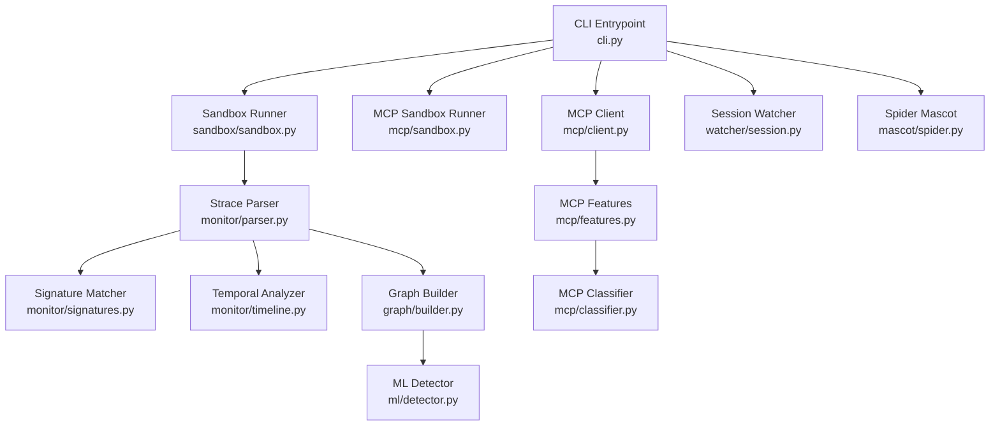

**Diagram sources**
- [cli.py:196-303](file://cli.py#L196-L303)
- [sandbox/sandbox.py:184-428](file://sandbox/sandbox.py#L184-L428)
- [mcp/sandbox.py:41-146](file://mcp/sandbox.py#L41-L146)
- [monitor/parser.py:342-681](file://monitor/parser.py#L342-L681)
- [monitor/signatures.py:86-115](file://monitor/signatures.py#L86-L115)
- [monitor/timeline.py:298-331](file://monitor/timeline.py#L298-L331)
- [graph/builder.py:8-195](file://graph/builder.py#L8-L195)
- [ml/detector.py:235-299](file://ml/detector.py#L235-L299)
- [mcp/client.py:18-96](file://mcp/client.py#L18-L96)
- [mcp/features.py:32-206](file://mcp/features.py#L32-L206)
- [mcp/classifier.py:61-96](file://mcp/classifier.py#L61-L96)
- [watcher/session.py:29-114](file://watcher/session.py#L29-L114)
- [mascot/spider.py:4-39](file://mascot/spider.py#L4-L39)

**Section sources**
- [README.md:1-120](file://README.md#L1-L120)
- [cli.py:1-120](file://cli.py#L1-L120)

## Core Components
This section introduces the essential building blocks of TraceTree and how they work together to deliver runtime behavioral analysis.

- Sandbox execution
  - Pipelines target execution inside isolated Docker containers with network dropping and strace instrumentation. It supports multiple target types (pip, npm, dmg, exe) and captures resource usage for post-run analysis.
  - Key responsibilities include container lifecycle management, strace log collection, and filtering of noise (e.g., Wine initialization for EXE analysis).

- Strace parsing
  - Parses multi-line strace logs, reconstructs syscall entries, and extracts structured events with timestamps, severity weights, and contextual metadata (e.g., sensitive file access, network destinations).
  - Provides severity scoring and flags suspicious activities such as unexpected binary execution, reverse shell patterns, and memory mapping anomalies.

- Signature matching
  - Loads behavioral signatures from a JSON configuration and matches parsed events against both unordered and ordered patterns. Evidence is collected for each match to aid triage.

- Temporal analysis
  - Detects time-based patterns from timestamped event streams, including credential theft chains, rapid file enumeration, burst process spawning, delayed payload behavior, and reverse shell setup.

- Graph construction
  - Builds a NetworkX directed graph representing processes, files, and network destinations, with edges capturing syscall relationships and temporal edges between consecutive events from the same PID.

- Machine learning classification
  - Extracts a feature vector from the graph and parsed data, applies a supervised RandomForest or an IsolationForest baseline, and boosts confidence using severity scores and temporal pattern counts.

- MCP server analysis
  - Extends the pipeline to Model Context Protocol servers by simulating client interactions, injecting adversarial probes, extracting MCP-specific features, and applying rule-based threat classification.

- Session watcher
  - Monitors repositories for package manifests and continuously runs sandbox analysis in the background, exposing status and results via a queue.

- Mascot
  - Provides ASCII spider feedback during CLI operations to enhance user experience.

**Section sources**
- [sandbox/sandbox.py:184-428](file://sandbox/sandbox.py#L184-L428)
- [monitor/parser.py:342-681](file://monitor/parser.py#L342-L681)
- [monitor/signatures.py:57-115](file://monitor/signatures.py#L57-L115)
- [monitor/timeline.py:298-331](file://monitor/timeline.py#L298-L331)
- [graph/builder.py:8-195](file://graph/builder.py#L8-L195)
- [ml/detector.py:29-299](file://ml/detector.py#L29-L299)
- [mcp/sandbox.py:41-146](file://mcp/sandbox.py#L41-L146)
- [mcp/client.py:18-96](file://mcp/client.py#L18-L96)
- [mcp/features.py:32-206](file://mcp/features.py#L32-L206)
- [mcp/classifier.py:61-96](file://mcp/classifier.py#L61-L96)
- [watcher/session.py:29-114](file://watcher/session.py#L29-L114)
- [mascot/spider.py:4-39](file://mascot/spider.py#L4-L39)

## Architecture Overview
The TraceTree pipeline orchestrates sandbox execution, strace logging, parsing, detection, and reporting. The diagram below maps the end-to-end workflow and key integrations.

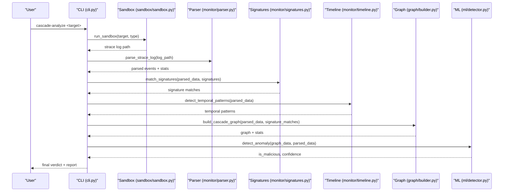

**Diagram sources**
- [cli.py:196-303](file://cli.py#L196-L303)
- [sandbox/sandbox.py:184-428](file://sandbox/sandbox.py#L184-L428)
- [monitor/parser.py:342-681](file://monitor/parser.py#L342-L681)
- [monitor/signatures.py:86-115](file://monitor/signatures.py#L86-L115)
- [monitor/timeline.py:298-331](file://monitor/timeline.py#L298-L331)
- [graph/builder.py:8-195](file://graph/builder.py#L8-L195)
- [ml/detector.py:235-299](file://ml/detector.py#L235-L299)

## Detailed Component Analysis

### Sandbox Execution
The sandbox subsystem encapsulates target execution in a controlled environment. It builds or pulls the sandbox image, drops network connectivity, runs the target under strace, and collects logs and resource usage.

Key capabilities:
- Pipelines for PyPI and npm targets with offline installation and network blocking
- DMG extraction and execution of scripts, binaries, and app bundles
- Wine-based EXE execution with noise filtering and timeouts
- Resource monitoring and tagging of strace logs with execution statistics

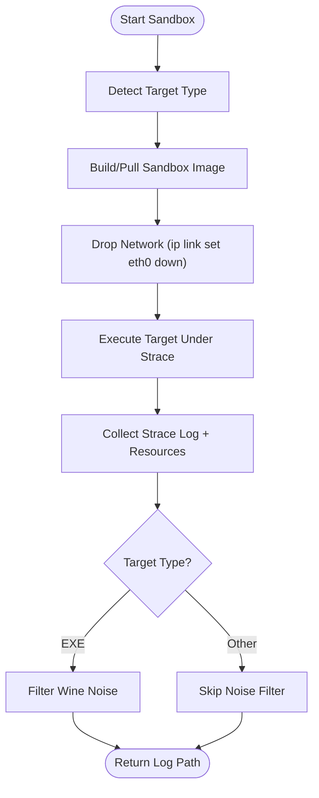

**Diagram sources**
- [sandbox/sandbox.py:184-428](file://sandbox/sandbox.py#L184-L428)

**Section sources**
- [sandbox/sandbox.py:184-428](file://sandbox/sandbox.py#L184-L428)

### Strace Parsing and Severity Scoring
The parser reconstructs multi-line syscall entries, normalizes timestamps, and assigns severity weights to each event. It classifies network destinations, flags sensitive file access, and detects suspicious chains such as reverse shells and credential theft.

Highlights:
- Severity weights for syscall categories (e.g., mprotect with PROT_EXEC, dup2 after connect)
- Network destination classification into safe, benign, suspicious, or unknown categories
- Sensitive file pattern detection and benign binary whitelisting
- Event enrichment with timestamps, relative milliseconds, and sequence IDs

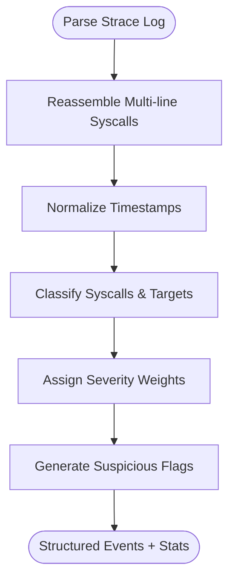

**Diagram sources**
- [monitor/parser.py:342-681](file://monitor/parser.py#L342-L681)

**Section sources**
- [monitor/parser.py:11-681](file://monitor/parser.py#L11-L681)

### Behavioral Signature Matching
Signature matching evaluates parsed events against predefined behavioral patterns. It supports both unordered presence checks and ordered sequence matching, returning evidence for each match.

Patterns include:
- Reverse shell, container escape, credential theft, typosquat exfiltration
- Process injection, crypto miner spawning, DNS tunneling, persistence via cron

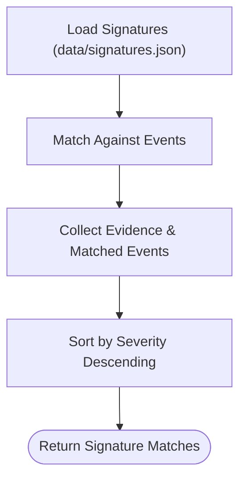

**Diagram sources**
- [monitor/signatures.py:57-115](file://monitor/signatures.py#L57-L115)
- [data/signatures.json:1-246](file://data/signatures.json#L1-L246)

**Section sources**
- [monitor/signatures.py:86-487](file://monitor/signatures.py#L86-L487)
- [data/signatures.json:1-246](file://data/signatures.json#L1-L246)

### Temporal Pattern Detection
Temporal analysis identifies suspicious time-based sequences in the event stream, leveraging strace timestamps. It detects patterns such as credential theft chains, rapid file enumeration, burst process spawning, delayed payloads, and reverse shell setup.

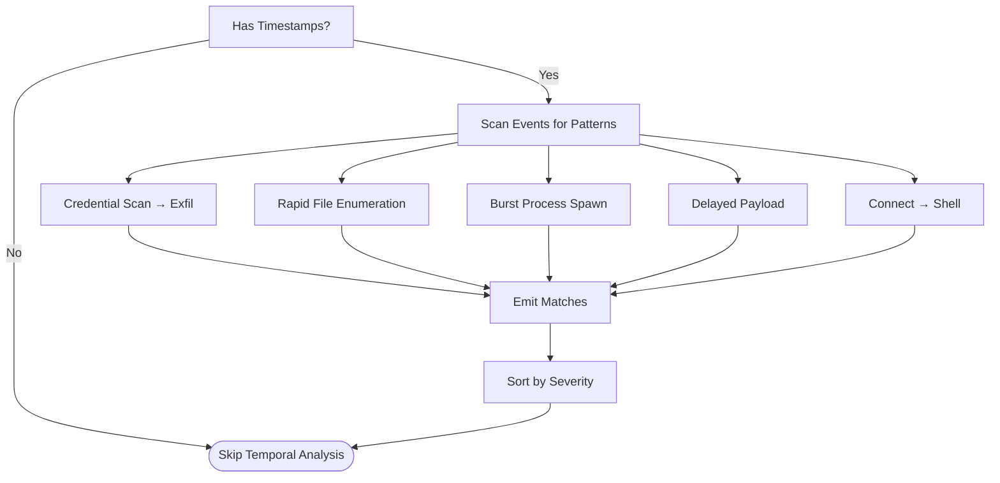

**Diagram sources**
- [monitor/timeline.py:298-331](file://monitor/timeline.py#L298-L331)

**Section sources**
- [monitor/timeline.py:298-353](file://monitor/timeline.py#L298-L353)

### Graph Construction and Feature Extraction
The graph builder constructs a NetworkX directed graph from parsed events, adding nodes for processes, files, and network destinations, and edges for syscall relationships and temporal proximity. Graph statistics feed the ML detector.

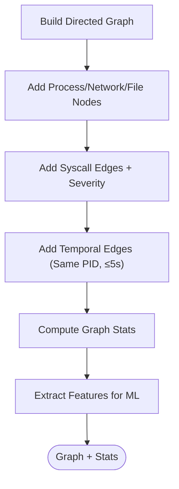

**Diagram sources**
- [graph/builder.py:8-195](file://graph/builder.py#L8-L195)

**Section sources**
- [graph/builder.py:8-195](file://graph/builder.py#L8-L195)

### Machine Learning Classification
The ML detector maps graph and parsed data into a feature vector and applies either a trained RandomForest or an IsolationForest baseline. Confidence is adjusted using severity scores and temporal pattern counts.

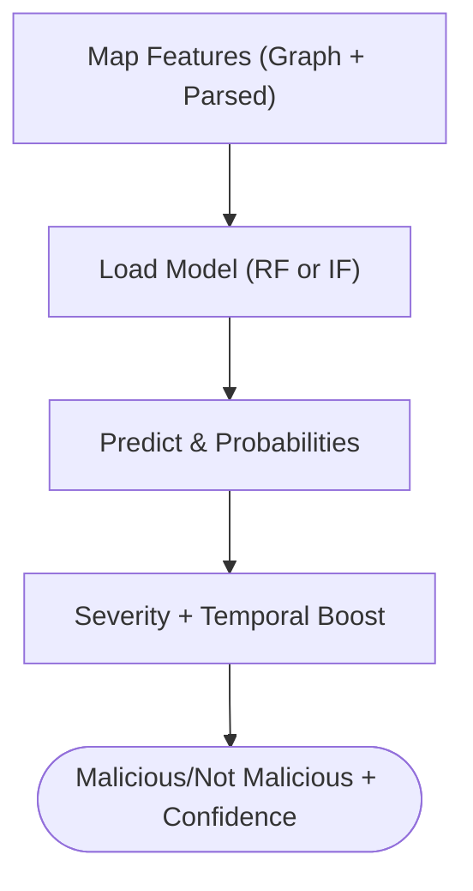

**Diagram sources**
- [ml/detector.py:29-299](file://ml/detector.py#L29-L299)

**Section sources**
- [ml/detector.py:29-299](file://ml/detector.py#L29-L299)

### MCP Server Security Analysis
TraceTree extends its pipeline to Model Context Protocol servers by simulating client interactions, invoking tools with safe and adversarial inputs, extracting MCP-specific features, and applying rule-based threat classification.

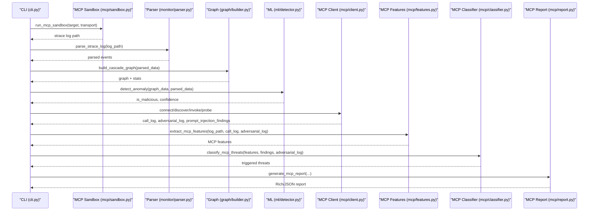

**Diagram sources**
- [cli.py:563-743](file://cli.py#L563-L743)
- [mcp/sandbox.py:41-146](file://mcp/sandbox.py#L41-L146)
- [mcp/client.py:18-96](file://mcp/client.py#L18-L96)
- [mcp/features.py:32-206](file://mcp/features.py#L32-L206)
- [mcp/classifier.py:61-96](file://mcp/classifier.py#L61-L96)
- [mcp/report.py:27-74](file://mcp/report.py#L27-L74)

**Section sources**
- [cli.py:563-743](file://cli.py#L563-L743)
- [mcp/sandbox.py:41-146](file://mcp/sandbox.py#L41-L146)
- [mcp/client.py:18-96](file://mcp/client.py#L18-L96)
- [mcp/features.py:32-206](file://mcp/features.py#L32-L206)
- [mcp/classifier.py:61-96](file://mcp/classifier.py#L61-L96)
- [mcp/report.py:27-74](file://mcp/report.py#L27-L74)

### Session Watcher
The session watcher monitors a repository directory for package manifests and continuously runs sandbox analysis in the background, exposing status and results via a queue.

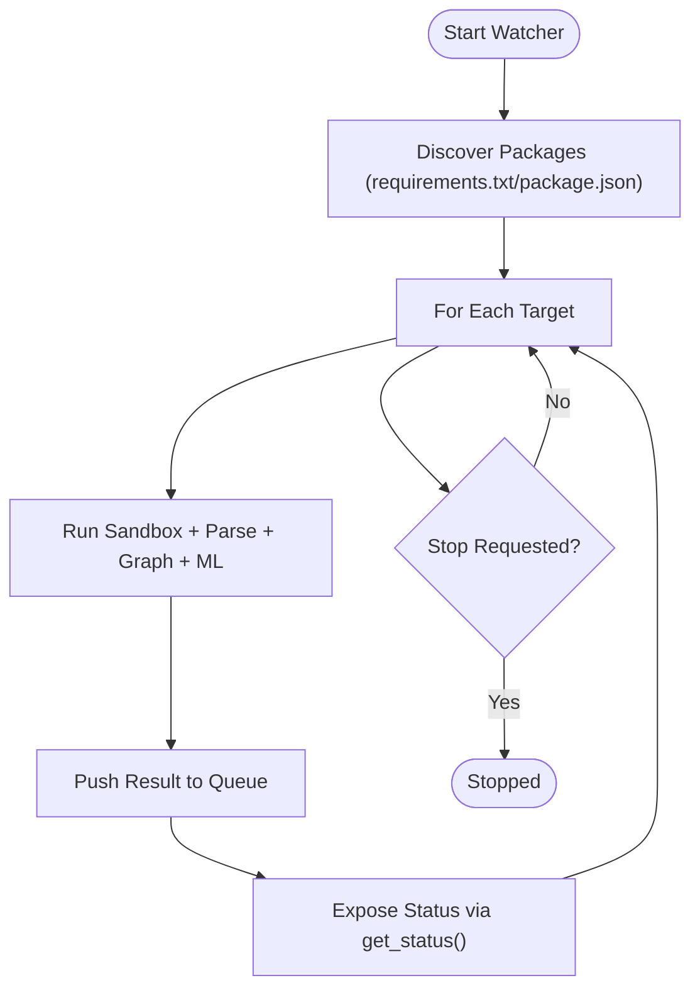

**Diagram sources**
- [watcher/session.py:237-395](file://watcher/session.py#L237-L395)

**Section sources**
- [watcher/session.py:29-418](file://watcher/session.py#L29-L418)

### Mascot Integration
The spider mascot enhances user experience by rendering ASCII art states during CLI operations, providing visual feedback for different phases of analysis.

**Section sources**
- [mascot/spider.py:4-77](file://mascot/spider.py#L4-L77)

## Dependency Analysis
TraceTree’s modules exhibit clear separation of concerns with well-defined interfaces. The CLI orchestrates the pipeline, while specialized modules handle sandboxing, parsing, detection, and reporting. The MCP stack extends the core pipeline with protocol-specific logic.

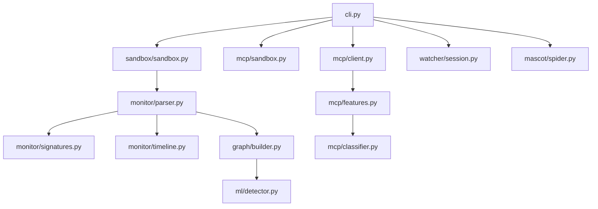

**Diagram sources**
- [cli.py:196-303](file://cli.py#L196-L303)
- [sandbox/sandbox.py:184-428](file://sandbox/sandbox.py#L184-L428)
- [mcp/sandbox.py:41-146](file://mcp/sandbox.py#L41-L146)
- [monitor/parser.py:342-681](file://monitor/parser.py#L342-L681)
- [monitor/signatures.py:86-115](file://monitor/signatures.py#L86-L115)
- [monitor/timeline.py:298-331](file://monitor/timeline.py#L298-L331)
- [graph/builder.py:8-195](file://graph/builder.py#L8-L195)
- [ml/detector.py:235-299](file://ml/detector.py#L235-L299)
- [mcp/client.py:18-96](file://mcp/client.py#L18-L96)
- [mcp/features.py:32-206](file://mcp/features.py#L32-L206)
- [mcp/classifier.py:61-96](file://mcp/classifier.py#L61-L96)
- [watcher/session.py:29-114](file://watcher/session.py#L29-L114)
- [mascot/spider.py:4-39](file://mascot/spider.py#L4-L39)

**Section sources**
- [cli.py:196-303](file://cli.py#L196-L303)
- [sandbox/sandbox.py:184-428](file://sandbox/sandbox.py#L184-L428)
- [monitor/parser.py:342-681](file://monitor/parser.py#L342-L681)
- [graph/builder.py:8-195](file://graph/builder.py#L8-L195)
- [ml/detector.py:235-299](file://ml/detector.py#L235-L299)
- [mcp/client.py:18-96](file://mcp/client.py#L18-L96)
- [mcp/features.py:32-206](file://mcp/features.py#L32-L206)
- [mcp/classifier.py:61-96](file://mcp/classifier.py#L61-L96)
- [watcher/session.py:29-114](file://watcher/session.py#L29-L114)
- [mascot/spider.py:4-39](file://mascot/spider.py#L4-L39)

## Performance Considerations
- Containerization overhead: Building and running Docker containers introduces latency. Optimize by reusing images and minimizing unnecessary rebuilds.
- Strace verbosity: Large strace logs increase parsing and graph construction time. Use targeted syscall filtering and noise reduction (e.g., Wine noise filtering) where applicable.
- ML model caching: The ML detector caches the model in memory to avoid repeated I/O and unpickling. Clear the cache when updating models.
- Temporal analysis cost: Sliding-window pattern detection scales with event count. Ensure strace timestamps are present for accurate temporal windows.
- MCP analysis: HTTP/stdio transport selection affects responsiveness. Prefer stdio for deterministic behavior and HTTP for server introspection.

[No sources needed since this section provides general guidance]

## Troubleshooting Guide
Common issues and resolutions:
- Docker not installed or unreachable: The CLI performs a preflight check and instructs users to install and start Docker based on the operating system.
- Sandbox failures: Inspect container exit codes and stderr logs for DMG/EXE targets. Verify file existence and permissions.
- Empty or minimal strace logs: For EXE analysis, Wine initialization noise is filtered; ensure the target is valid and not immediately crashing.
- Model loading errors: The ML detector attempts to download a model from Google Cloud Storage; if unavailable, it falls back to an IsolationForest baseline.
- MCP server connectivity: For HTTP transport, verify the endpoint is reachable; for stdio, ensure the command is provided and the server responds to JSON-RPC messages.

**Section sources**
- [cli.py:74-110](file://cli.py#L74-L110)
- [sandbox/sandbox.py:345-356](file://sandbox/sandbox.py#L345-L356)
- [ml/detector.py:108-146](file://ml/detector.py#L108-L146)
- [mcp/sandbox.py:63-71](file://mcp/sandbox.py#L63-L71)

## Conclusion
TraceTree delivers a robust, extensible runtime behavioral analysis platform that combines sandbox execution, strace instrumentation, and multi-layered detection to assess the safety of diverse targets. Its modular architecture enables seamless integration of rule-based signatures, temporal analysis, graph construction, and machine learning classification. The MCP extension further broadens its applicability to modern protocol servers. By providing actionable insights and visual feedback, TraceTree empowers teams to make informed decisions about dependencies and binaries in CI/CD and development workflows.