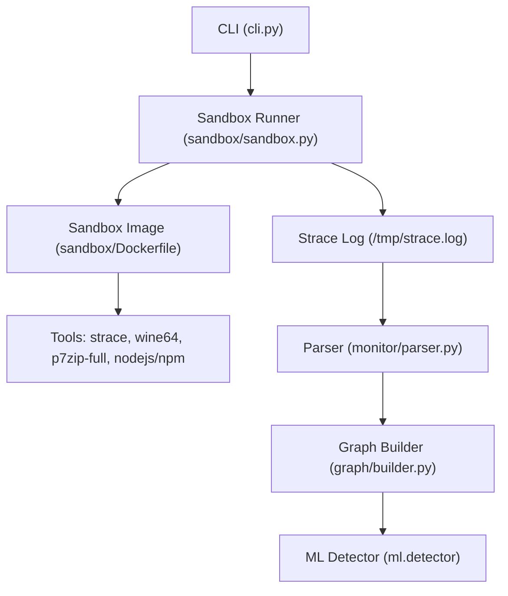
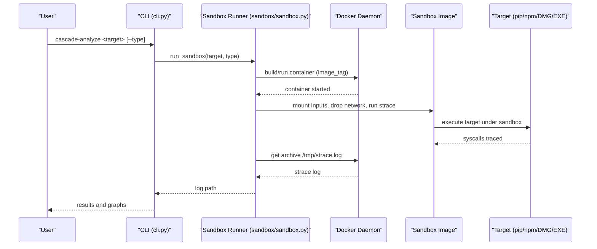
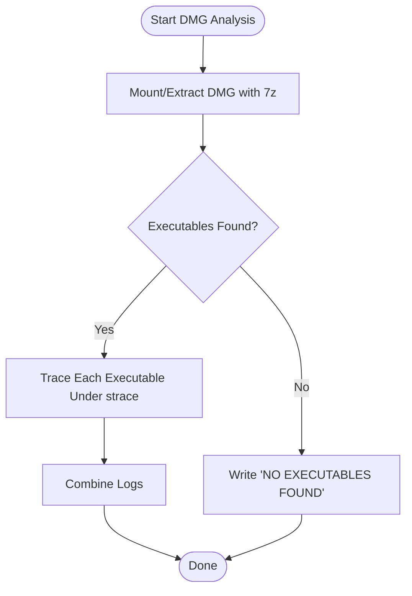
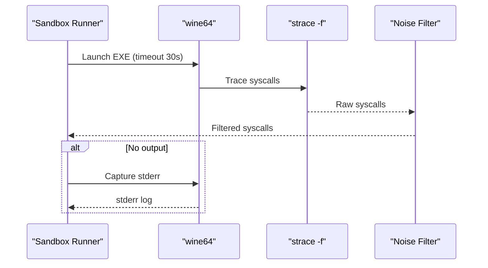
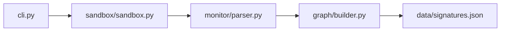

# Supported Target Types

<cite>
**Referenced Files in This Document**
- [README.md](file://README.md)
- [sandbox/sandbox.py](file://sandbox/sandbox.py)
- [sandbox/Dockerfile](file://sandbox/Dockerfile)
- [cli.py](file://cli.py)
- [monitor/parser.py](file://monitor/parser.py)
- [graph/builder.py](file://graph/builder.py)
- [data/signatures.json](file://data/signatures.json)
</cite>

## Table of Contents
1. [Introduction](#introduction)
2. [Project Structure](#project-structure)
3. [Core Components](#core-components)
4. [Architecture Overview](#architecture-overview)
5. [Detailed Component Analysis](#detailed-component-analysis)
6. [Dependency Analysis](#dependency-analysis)
7. [Performance Considerations](#performance-considerations)
8. [Troubleshooting Guide](#troubleshooting-guide)
9. [Conclusion](#conclusion)

## Introduction
This document explains the supported target types and how TraceTree executes and analyzes them in a sandboxed environment. It covers four analysis modes:
- PyPI packages (pip)
- npm packages (npm)
- macOS DMG files
- Windows EXE files (via wine64)

For each target type, it documents:
- Execution methodology
- Sandbox preparation and network dropping
- Analysis approach and fidelity
- Prerequisites and required system packages in the sandbox image
- Platform-specific considerations and limitations
- Practical examples and use cases
- Workarounds for known issues

## Project Structure
The analysis pipeline is orchestrated by the CLI, which delegates to the sandbox runner. The sandbox builds and uses a Docker image that includes strace, Node.js/npm, Wine, p7zip-full, and other tools. The strace logs are parsed, transformed into a graph, and scored by signatures and temporal analysis.

**Diagram sources**
- [cli.py:305-320](file://cli.py#L305-L320)
- [sandbox/sandbox.py:184-428](file://sandbox/sandbox.py#L184-L428)
- [sandbox/Dockerfile:1-11](file://sandbox/Dockerfile#L1-L11)
- [monitor/parser.py:1-200](file://monitor/parser.py#L1-L200)
- [graph/builder.py:1-196](file://graph/builder.py#L1-L196)

**Section sources**
- [README.md:95-103](file://README.md#L95-L103)
- [cli.py:305-320](file://cli.py#L305-L320)
- [sandbox/sandbox.py:184-428](file://sandbox/sandbox.py#L184-L428)
- [sandbox/Dockerfile:1-11](file://sandbox/Dockerfile#L1-L11)

## Core Components
- Sandbox runner: Selects target type, prepares the sandbox image, mounts inputs, drops network, runs strace, and retrieves logs.
- Parser: Converts strace logs into structured events with timestamps and severity.
- Graph builder: Produces a NetworkX graph with process, file, and network nodes and temporal edges.
- Signatures: Matches behavioral patterns against parsed events.
- MCP sandbox (additional): Runs MCP servers in a sandbox with targeted syscall tracing.

**Section sources**
- [sandbox/sandbox.py:184-428](file://sandbox/sandbox.py#L184-L428)
- [monitor/parser.py:1-200](file://monitor/parser.py#L1-L200)
- [graph/builder.py:1-196](file://graph/builder.py#L1-L196)
- [data/signatures.json:1-246](file://data/signatures.json#L1-L246)

## Architecture Overview
The sandbox enforces network isolation by disabling the container’s network interface before execution. It traces syscalls with strace -f and captures resource usage for pip/npm targets. For DMG and EXE targets, it executes extracted or emulated binaries under strace with timeouts and noise filtering.

**Diagram sources**
- [cli.py:305-320](file://cli.py#L305-L320)
- [sandbox/sandbox.py:184-428](file://sandbox/sandbox.py#L184-L428)

## Detailed Component Analysis

### PyPI Packages (pip)
- Execution methodology:
  - Download package metadata and artifacts with pip download (network allowed).
  - Drop network interface, then install with pip install --no-index using the downloaded artifacts.
  - Trace the entire install process with strace -f.
- Sandbox preparation:
  - The sandbox image includes Python, pip, and strace.
  - Network is disabled via ip link set eth0 down before install.
- Analysis approach:
  - Resource monitoring: peak memory and disk usage deltas, file count installed.
  - Behavioral signals: process spawns, file writes, network connections (filtered to benign ranges).
- Prerequisites and packages:
  - Python 3.11-slim base image with strace and Python tooling.
- Platform-specific considerations:
  - Executed on Linux; native macOS syscalls are not traceable.
- Fidelity and limitations:
  - Highest fidelity among supported targets because it runs the actual pip install process.
  - Limitations include lack of Windows/macOS-specific behavior and potential false positives from benign package toolchains.
- Practical examples:
  - Analyze a known clean package and a typosquatted package to observe signature matches.
- Workarounds:
  - Use --type pip to force pip mode when passing a file path that would otherwise be inferred as DMG/EXE.

**Section sources**
- [sandbox/sandbox.py:226-252](file://sandbox/sandbox.py#L226-L252)
- [sandbox/Dockerfile:1-11](file://sandbox/Dockerfile#L1-L11)
- [README.md:99](file://README.md#L99)
- [cli.py:112-124](file://cli.py#L112-L124)

### npm Packages
- Execution methodology:
  - Dry-run npm install to resolve dependencies, then drop network.
  - Execute npm install under strace with no audit/funding prompts.
- Sandbox preparation:
  - The sandbox image includes Node.js and npm.
  - Network is disabled before install.
- Analysis approach:
  - Resource monitoring: peak memory and disk usage deltas, file count installed under node_modules.
  - Behavioral signals: process spawns, file writes, network connections (filtered to benign ranges).
- Prerequisites and packages:
  - Node.js and npm included in the sandbox image.
- Platform-specific considerations:
  - Executed on Linux; npm’s native binaries are executed in a Linux environment.
- Fidelity and limitations:
  - Good fidelity for typical npm installs; some platform-specific binaries may behave differently.
- Practical examples:
  - Analyze a popular npm package and a malicious package that reads secrets and connects to exfil sites.
- Workarounds:
  - Use --type npm to force npm mode when passing a file path.

**Section sources**
- [sandbox/sandbox.py:253-279](file://sandbox/sandbox.py#L253-L279)
- [sandbox/Dockerfile:1-11](file://sandbox/Dockerfile#L1-L11)
- [README.md:100](file://README.md#L100)
- [cli.py:112-124](file://cli.py#L112-L124)

### macOS DMG Files
- Execution methodology:
  - Mount/extract DMG using 7z inside the container.
  - Discover executables: shell scripts, Python scripts, .command files, .pkg/.mpkg installers, .app bundles, and bare Mach-O binaries.
  - Execute each under strace; if no direct syscalls are captured, trace the extraction process itself.
- Sandbox preparation:
  - The sandbox image includes p7zip-full and related tools for extraction.
- Analysis approach:
  - Trace each discovered executable; collect strace logs and combine them.
  - If no executables are found, log a “NO EXECUTABLES FOUND” indicator.
- Prerequisites and packages:
  - p7zip-full and related tools in the sandbox image.
- Platform-specific considerations:
  - Executed on Linux; macOS-specific behavior (launchd, Keychain, etc.) will not execute.
  - Encrypted or uncommon DMG formats may fail to extract.
- Fidelity and limitations:
  - Lower fidelity due to emulation layer; scripts run in a Linux container.
- Practical examples:
  - Analyze a DMG containing a .app bundle with embedded binaries and a .pkg installer.
- Workarounds:
  - If extraction fails, verify the DMG is not encrypted and try a different extraction tool if available.

**Diagram sources**
- [sandbox/sandbox.py:20-121](file://sandbox/sandbox.py#L20-L121)

**Section sources**
- [sandbox/sandbox.py:298-312](file://sandbox/sandbox.py#L298-L312)
- [sandbox/sandbox.py:20-121](file://sandbox/sandbox.py#L20-L121)
- [sandbox/Dockerfile:1-11](file://sandbox/Dockerfile#L1-L11)
- [README.md:101](file://README.md#L101)

### Windows EXE Files (wine64)
- Execution methodology:
  - Run EXE under wine64 with strace -f and a 30-second timeout.
  - Filter out wine initialization noise from the strace log while preserving suspicious syscalls.
- Sandbox preparation:
  - The sandbox image includes wine64 and related tools.
- Analysis approach:
  - Trace the EXE and its children; if no output, capture wine stderr for diagnostics.
  - Filter wine-specific noise (e.g., loading wine DLLs, creating wine prefix directories).
- Prerequisites and packages:
  - wine64 and related libraries in the sandbox image.
- Platform-specific considerations:
  - Wine translates Windows syscalls to Linux syscalls; some Windows-specific behavior may not be visible.
  - GUI applications that wait for user input will timeout after 30 seconds.
- Fidelity and limitations:
  - Best-effort fidelity; Windows-specific APIs and registry access are not directly observable.
- Practical examples:
  - Analyze a Windows EXE that spawns a reverse shell or performs credential theft.
- Workarounds:
  - For GUI apps, consider headless alternatives or manual intervention if feasible.
  - If wine is missing, ensure the sandbox image is rebuilt with wine64.

**Diagram sources**
- [sandbox/sandbox.py:127-177](file://sandbox/sandbox.py#L127-L177)
- [sandbox/sandbox.py:431-468](file://sandbox/sandbox.py#L431-L468)

**Section sources**
- [sandbox/sandbox.py:306-312](file://sandbox/sandbox.py#L306-L312)
- [sandbox/sandbox.py:127-177](file://sandbox/sandbox.py#L127-L177)
- [sandbox/sandbox.py:431-468](file://sandbox/sandbox.py#L431-L468)
- [sandbox/Dockerfile:1-11](file://sandbox/Dockerfile#L1-L11)
- [README.md:102](file://README.md#L102)

## Dependency Analysis
The sandbox runner orchestrates target-specific execution and strace collection. The CLI determines target type and invokes the sandbox. The parser and graph builder consume strace logs to produce actionable insights.

**Diagram sources**
- [cli.py:305-320](file://cli.py#L305-L320)
- [sandbox/sandbox.py:184-428](file://sandbox/sandbox.py#L184-L428)
- [monitor/parser.py:1-200](file://monitor/parser.py#L1-200)
- [graph/builder.py:1-196](file://graph/builder.py#L1-196)
- [data/signatures.json:1-246](file://data/signatures.json#L1-L246)

**Section sources**
- [cli.py:196-303](file://cli.py#L196-L303)
- [sandbox/sandbox.py:184-428](file://sandbox/sandbox.py#L184-L428)
- [monitor/parser.py:1-200](file://monitor/parser.py#L1-L200)
- [graph/builder.py:1-196](file://graph/builder.py#L1-196)
- [data/signatures.json:1-246](file://data/signatures.json#L1-L246)

## Performance Considerations
- Timeouts:
  - EXE: 180 seconds for DMG, 120 seconds for EXE, 60 seconds for pip/npm.
- Network dropping:
  - ip link set eth0 down prevents outbound connections; any attempts are logged.
- Resource monitoring:
  - Pip/npm targets record peak memory, disk usage, and file counts.
- Filtering:
  - Wine noise is filtered from EXE traces to reduce false positives.

**Section sources**
- [sandbox/sandbox.py:329-340](file://sandbox/sandbox.py#L329-L340)
- [sandbox/sandbox.py:431-468](file://sandbox/sandbox.py#L431-L468)
- [sandbox/sandbox.py:226-252](file://sandbox/sandbox.py#L226-L252)
- [sandbox/sandbox.py:253-279](file://sandbox/sandbox.py#L253-L279)

## Troubleshooting Guide
- Docker not available:
  - Ensure Docker is installed and running; the CLI checks for Docker SDK and daemon connectivity.
- Sandbox image not found:
  - The runner builds the sandbox image on first run; subsequent runs reuse it.
- Target not found:
  - For DMG/EXE, ensure the file exists and is accessible inside the container.
- Empty or minimal strace logs:
  - For DMG: “NO EXECUTABLES FOUND” indicates extraction succeeded but no runnable targets were found.
  - For EXE: “WINE64 NOT AVAILABLE” indicates wine64 is missing; rebuild the image with wine64.
  - For EXE: “NO STRACE OUTPUT” suggests immediate crash or GUI app timeout; review wine stderr.
- GUI application timeouts:
  - Wine-based EXEs are subject to a 30-second timeout; GUI apps that wait for user input will terminate early.
- Encrypted DMG failures:
  - Extraction may fail on encrypted or uncommon DMG formats; verify the DMG integrity and format.
- Behavioral analysis fidelity:
  - strace runs on Linux; Windows/macOS syscalls are translated or unavailable, reducing fidelity.

**Section sources**
- [cli.py:74-111](file://cli.py#L74-L111)
- [sandbox/sandbox.py:198-221](file://sandbox/sandbox.py#L198-L221)
- [sandbox/sandbox.py:300-312](file://sandbox/sandbox.py#L300-L312)
- [sandbox/sandbox.py:400-407](file://sandbox/sandbox.py#L400-L407)
- [README.md:330-339](file://README.md#L330-L339)

## Conclusion
TraceTree supports four analysis modes—pip, npm, DMG, and wine64 EXE—each tailored to its platform and execution model. The sandbox enforces network isolation, traces syscalls with strace -f, and collects resource usage for pip/npm. DMG and EXE analyses leverage extraction and emulation respectively, with caveats around fidelity due to the Linux-only environment. The CLI integrates seamlessly with the sandbox, and the parser/graph/signatures pipeline provides robust behavioral insights.