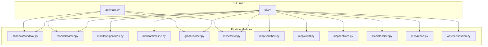
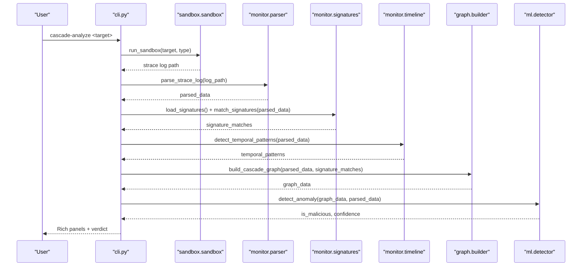
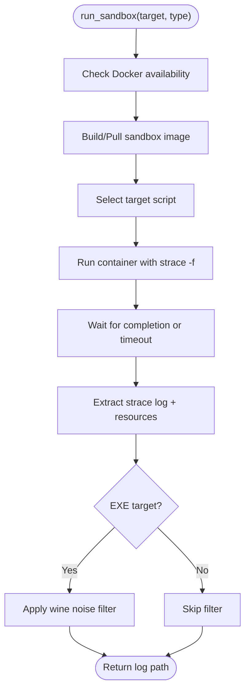
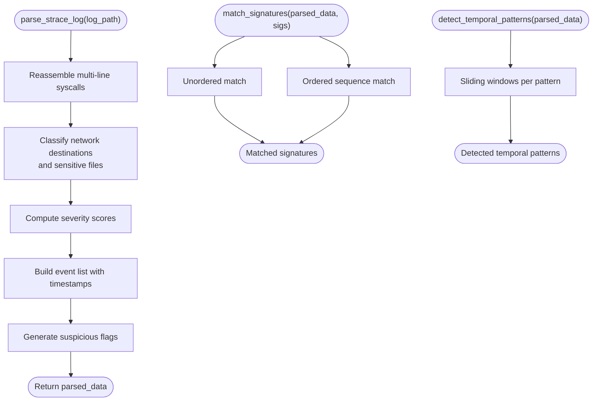
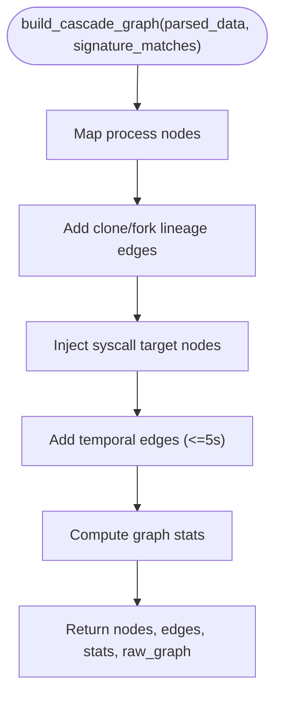
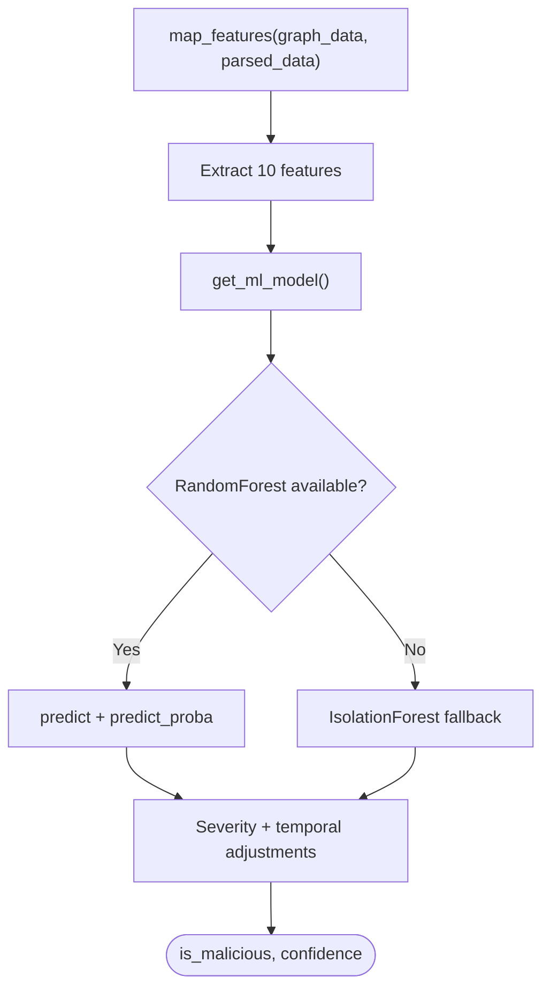
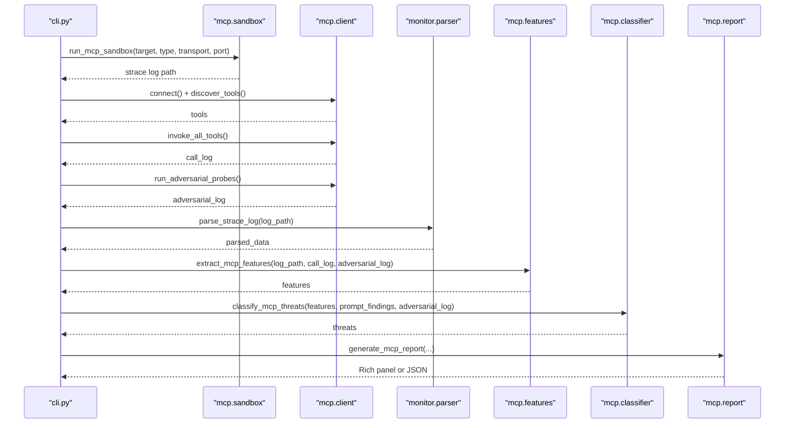
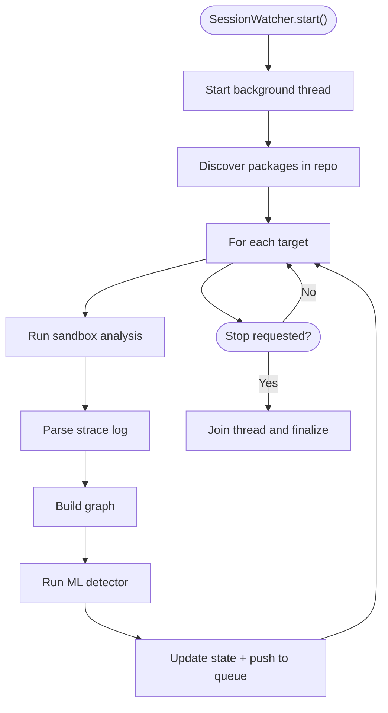
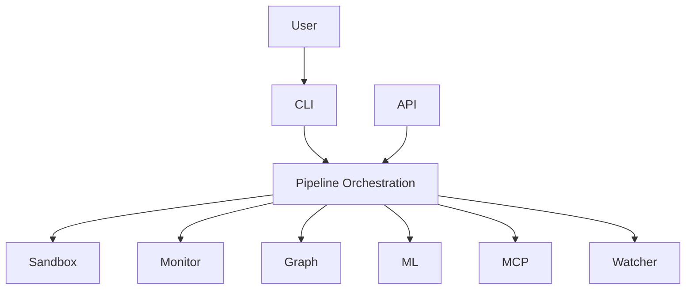
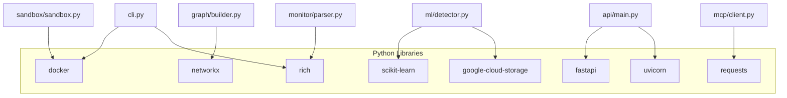

# System Architecture

<cite>
**Referenced Files in This Document**
- [README.md](file://README.md)
- [cli.py](file://cli.py)
- [setup.py](file://setup.py)
- [pyproject.toml](file://pyproject.toml)
- [api/main.py](file://api/main.py)
- [sandbox/sandbox.py](file://sandbox/sandbox.py)
- [mcp/sandbox.py](file://mcp/sandbox.py)
- [monitor/parser.py](file://monitor/parser.py)
- [monitor/signatures.py](file://monitor/signatures.py)
- [monitor/timeline.py](file://monitor/timeline.py)
- [graph/builder.py](file://graph/builder.py)
- [ml/detector.py](file://ml/detector.py)
- [mcp/client.py](file://mcp/client.py)
- [mcp/features.py](file://mcp/features.py)
- [mcp/classifier.py](file://mcp/classifier.py)
- [mcp/report.py](file://mcp/report.py)
- [watcher/session.py](file://watcher/session.py)
</cite>

## Table of Contents
1. [Introduction](#introduction)
2. [Project Structure](#project-structure)
3. [Core Components](#core-components)
4. [Architecture Overview](#architecture-overview)
5. [Detailed Component Analysis](#detailed-component-analysis)
6. [Dependency Analysis](#dependency-analysis)
7. [Performance Considerations](#performance-considerations)
8. [Troubleshooting Guide](#troubleshooting-guide)
9. [Conclusion](#conclusion)
10. [Appendices](#appendices)

## Introduction
This document describes the TraceTree system architecture, focusing on the modular pipeline design that analyzes runtime behavior of Python packages, npm packages, DMG images, and Windows EXE files. The system integrates Docker-based sandboxing, strace-based syscall tracing, event parsing, behavioral signature matching, temporal pattern detection, graph construction, and machine learning anomaly detection. It also supports Model Context Protocol (MCP) server security analysis with a simulated client, adversarial probes, and rule-based threat classification.

## Project Structure
The repository is organized into six core modules that compose the pipeline:
- sandbox: Docker-based sandbox lifecycle management for multiple target types
- monitor: strace parsing, behavioral signatures, temporal patterns
- graph: NetworkX graph construction and statistics
- ml: Machine learning anomaly detection with model caching and fallback
- mcp: MCP server analysis (sandbox, client simulation, features, classification, reporting)
- watcher: Background session guardian for repository monitoring

Additional entry points and supporting components:
- cli.py: Typer CLI orchestrating the pipeline and Rich UI
- api/main.py: FastAPI mock service for analysis orchestration
- setup.py and pyproject.toml: Packaging and dependency declarations

**Diagram sources**
- [cli.py:196-303](file://cli.py#L196-L303)
- [api/main.py:83-100](file://api/main.py#L83-L100)
- [sandbox/sandbox.py:184-428](file://sandbox/sandbox.py#L184-L428)
- [monitor/parser.py:342-681](file://monitor/parser.py#L342-L681)
- [monitor/signatures.py:86-115](file://monitor/signatures.py#L86-L115)
- [monitor/timeline.py:298-331](file://monitor/timeline.py#L298-L331)
- [graph/builder.py:8-195](file://graph/builder.py#L8-L195)
- [ml/detector.py:235-299](file://ml/detector.py#L235-L299)
- [mcp/sandbox.py:41-146](file://mcp/sandbox.py#L41-L146)
- [mcp/client.py:18-95](file://mcp/client.py#L18-L95)
- [mcp/features.py:32-206](file://mcp/features.py#L32-L206)
- [mcp/classifier.py:61-96](file://mcp/classifier.py#L61-L96)
- [mcp/report.py:27-73](file://mcp/report.py#L27-L73)
- [watcher/session.py:29-417](file://watcher/session.py#L29-L417)

**Section sources**
- [README.md:306-327](file://README.md#L306-L327)
- [cli.py:196-303](file://cli.py#L196-L303)
- [api/main.py:83-100](file://api/main.py#L83-L100)

## Core Components
- Sandbox management: Builds and runs Docker containers for pip, npm, DMG, and EXE targets; drops network interfaces; captures strace logs; filters wine noise for EXE analysis; exposes resource usage metadata.
- Event processing: Parses strace logs into structured events, classifies network destinations, flags sensitive files, computes severity scores, and supports signature and temporal pattern detection.
- Graph construction: Builds NetworkX directed graphs with process, file, and network nodes; adds edges for relationships and temporal proximity; aggregates statistics for ML consumption.
- Machine learning detection: Extracts features from parsed data and graphs; selects a trained RandomForest or falls back to IsolationForest baseline; applies severity-boost adjustments; returns verdict and confidence.
- MCP analysis: Runs MCP servers in a sandbox, simulates a client to discover and invoke tools, injects adversarial probes, extracts MCP-specific features, classifies threats, and generates reports.
- Watcher: Background session guardian that monitors repositories, discovers package manifests, runs sandbox analyses, and streams results.

**Section sources**
- [sandbox/sandbox.py:184-428](file://sandbox/sandbox.py#L184-L428)
- [monitor/parser.py:342-681](file://monitor/parser.py#L342-L681)
- [graph/builder.py:8-195](file://graph/builder.py#L8-L195)
- [ml/detector.py:235-299](file://ml/detector.py#L235-L299)
- [mcp/sandbox.py:41-146](file://mcp/sandbox.py#L41-L146)
- [mcp/client.py:18-95](file://mcp/client.py#L18-L95)
- [mcp/features.py:32-206](file://mcp/features.py#L32-L206)
- [mcp/classifier.py:61-96](file://mcp/classifier.py#L61-L96)
- [mcp/report.py:27-73](file://mcp/report.py#L27-L73)
- [watcher/session.py:29-417](file://watcher/session.py#L29-L417)

## Architecture Overview
The system follows a modular pipeline with clear component separation:
- Input: Target identifiers (pip package name, npm package, DMG/EXE file, or repository path)
- Execution: Docker sandbox with strace tracing and network isolation
- Processing: Parser → Signature matcher → Temporal analyzer → Graph builder
- Decision: ML detector combining supervised and unsupervised models with severity boosting
- Output: Rich CLI panels, JSON SARIF, MCP reports, or API responses

**Diagram sources**
- [cli.py:196-303](file://cli.py#L196-L303)
- [sandbox/sandbox.py:184-428](file://sandbox/sandbox.py#L184-L428)
- [monitor/parser.py:342-681](file://monitor/parser.py#L342-L681)
- [monitor/signatures.py:86-115](file://monitor/signatures.py#L86-L115)
- [monitor/timeline.py:298-331](file://monitor/timeline.py#L298-L331)
- [graph/builder.py:8-195](file://graph/builder.py#L8-L195)
- [ml/detector.py:235-299](file://ml/detector.py#L235-L299)

## Detailed Component Analysis

### Sandbox Management
- Purpose: Execute targets in isolated Docker containers, drop network interfaces, trace syscalls with strace, and collect resource usage.
- Key responsibilities:
  - Image build and pull for cascade-sandbox:latest
  - Target-specific execution scripts for pip, npm, DMG, EXE
  - Resource monitoring and annotation of strace logs
  - Wine noise filtering for EXE analysis
  - Timeout enforcement and container cleanup
- Integration patterns:
  - Uses Docker SDK for container lifecycle
  - Writes strace logs and resource metadata to host logs directory
  - Supports MCP-specific sandbox with configurable transport and network policy

**Diagram sources**
- [sandbox/sandbox.py:184-428](file://sandbox/sandbox.py#L184-L428)

**Section sources**
- [sandbox/sandbox.py:184-428](file://sandbox/sandbox.py#L184-L428)

### Event Processing
- Parser: Multi-line strace reassembly, timestamp handling, syscall categorization, severity scoring, sensitive file detection, network destination classification.
- Signatures: Loads behavioral patterns and matches against parsed events with ordered and unordered modes.
- Timeline: Detects time-based patterns (credential theft, rapid enumeration, burst spawning, delayed payload, reverse shell).

**Diagram sources**
- [monitor/parser.py:342-681](file://monitor/parser.py#L342-L681)
- [monitor/signatures.py:86-115](file://monitor/signatures.py#L86-L115)
- [monitor/timeline.py:298-331](file://monitor/timeline.py#L298-L331)

**Section sources**
- [monitor/parser.py:342-681](file://monitor/parser.py#L342-L681)
- [monitor/signatures.py:86-115](file://monitor/signatures.py#L86-L115)
- [monitor/timeline.py:298-331](file://monitor/timeline.py#L298-L331)

### Graph Construction
- Builds a NetworkX directed graph from parsed events:
  - Nodes: process, file, network
  - Edges: syscall relationships, temporal edges within 5 seconds
  - Tags: signature matches, severity weights
- Produces Cytoscape-compatible JSON and internal statistics for ML consumption.

**Diagram sources**
- [graph/builder.py:8-195](file://graph/builder.py#L8-L195)

**Section sources**
- [graph/builder.py:8-195](file://graph/builder.py#L8-L195)

### Machine Learning Detection
- Feature extraction: node/edge counts, network/file counts, execve count, severity sums, temporal pattern counts.
- Model selection: RandomForest if available; otherwise IsolationForest baseline trained on clean baselines.
- Severity boosting: Adjusts ML confidence based on total severity, temporal patterns, sensitive files, and suspicious network connections.

**Diagram sources**
- [ml/detector.py:29-68](file://ml/detector.py#L29-L68)
- [ml/detector.py:108-146](file://ml/detector.py#L108-L146)
- [ml/detector.py:180-232](file://ml/detector.py#L180-L232)
- [ml/detector.py:235-299](file://ml/detector.py#L235-L299)

**Section sources**
- [ml/detector.py:29-68](file://ml/detector.py#L29-L68)
- [ml/detector.py:108-146](file://ml/detector.py#L108-L146)
- [ml/detector.py:180-232](file://ml/detector.py#L180-L232)
- [ml/detector.py:235-299](file://ml/detector.py#L235-L299)

### MCP Analysis Module
- MCP Sandbox: Runs servers in containers with strace -f, optional network, and transport-specific startup.
- MCP Client: JSON-RPC 2.0 handshake, tool discovery, safe invocation, adversarial probes, prompt injection scan.
- Features: Extracts per-tool syscall summaries, network behavior, process spawning, filesystem access, and injection response metrics.
- Classifier: Rule-based threats (command injection, credential exfiltration, covert network calls, path traversal, excessive spawning, prompt injection vectors).
- Report: Rich console or JSON output with tool manifest, per-tool syscall summary, threat detections, adversarial probe results, and baseline comparison.

**Diagram sources**
- [cli.py:563-743](file://cli.py#L563-L743)
- [mcp/sandbox.py:41-146](file://mcp/sandbox.py#L41-L146)
- [mcp/client.py:18-95](file://mcp/client.py#L18-L95)
- [mcp/features.py:32-206](file://mcp/features.py#L32-L206)
- [mcp/classifier.py:61-96](file://mcp/classifier.py#L61-L96)
- [mcp/report.py:27-73](file://mcp/report.py#L27-L73)

**Section sources**
- [mcp/sandbox.py:41-146](file://mcp/sandbox.py#L41-L146)
- [mcp/client.py:18-95](file://mcp/client.py#L18-L95)
- [mcp/features.py:32-206](file://mcp/features.py#L32-L206)
- [mcp/classifier.py:61-96](file://mcp/classifier.py#L61-L96)
- [mcp/report.py:27-73](file://mcp/report.py#L27-L73)

### Watcher Session Guardian
- Background daemon thread that:
  - Discovers package manifests in a repository
  - Runs sandbox → parse → graph → ML pipeline
  - Exposes status via get_status() and streams results via Queue
  - Implements session locking to prevent concurrent watchers

**Diagram sources**
- [watcher/session.py:29-417](file://watcher/session.py#L29-L417)

**Section sources**
- [watcher/session.py:29-417](file://watcher/session.py#L29-L417)

### Conceptual Overview
The system emphasizes:
- Separation of concerns across sandbox, parser, graph, and ML modules
- Extensibility via signature and pattern libraries
- Robustness through fallback models and best-effort processing
- Observability via Rich UI and JSON reports

[No sources needed since this diagram shows conceptual workflow, not actual code structure]

## Dependency Analysis
External dependencies and integration patterns:
- Docker SDK: Container lifecycle management for sandbox execution
- strace: System call tracing with multi-process support and timestamping
- NetworkX: Directed graph construction and statistics
- scikit-learn: Supervised and unsupervised anomaly detection
- Rich: Console UI rendering and progress bars
- FastAPI/Uvicorn: Optional API service (mock implementation)
- Google Cloud Storage: Model synchronization for ML module

**Diagram sources**
- [setup.py:19-29](file://setup.py#L19-L29)
- [pyproject.toml:14-24](file://pyproject.toml#L14-L24)
- [cli.py:15-26](file://cli.py#L15-L26)
- [api/main.py:1-14](file://api/main.py#L1-L14)

**Section sources**
- [setup.py:19-29](file://setup.py#L19-L29)
- [pyproject.toml:14-24](file://pyproject.toml#L14-L24)

## Performance Considerations
- Pipeline stages are designed to be resilient and best-effort to avoid blocking on failures (e.g., signature matching, temporal analysis, YARA scanning, n-gram fingerprinting).
- Model caching avoids repeated disk I/O and unpickling of ML models.
- Resource usage collection (memory, disk, file counts) is embedded in sandbox logs for visibility.
- strace -f enables capturing child processes; timeouts prevent hangs (e.g., EXE with GUI requiring user input).
- Graph construction uses efficient adjacency and node tagging; temporal edges constrained by 5-second windows.

[No sources needed since this section provides general guidance]

## Troubleshooting Guide
- Docker preflight checks: CLI validates Docker availability and connectivity; provides OS-specific guidance if Docker is missing or unreachable.
- Sandbox failures: Logs include stderr and diagnostic messages; returns empty string on failure to abort pipeline gracefully.
- MCP sandbox readiness: HTTP/SSE verification and server_info extraction aid in diagnosing transport issues.
- Watcher concurrency: Lockfile prevents multiple watchers for the same repository; stale locks are cleaned up atomically.

**Section sources**
- [cli.py:74-110](file://cli.py#L74-L110)
- [sandbox/sandbox.py:198-206](file://sandbox/sandbox.py#L198-L206)
- [mcp/sandbox.py:154-163](file://mcp/sandbox.py#L154-L163)
- [watcher/session.py:775-799](file://watcher/session.py#L775-L799)

## Conclusion
TraceTree employs a robust, modular pipeline architecture integrating Docker sandboxing, strace-based syscall tracing, structured event processing, graph construction, and machine learning anomaly detection. The system supports both general package analysis and specialized MCP server security assessment, with clear component boundaries, observable outputs, and resilient best-effort processing.

## Appendices

### Technology Stack
- Python 3.9+ runtime
- Docker SDK for Python
- NetworkX for graph construction
- scikit-learn for ML models
- Rich for console UI
- FastAPI/Uvicorn for optional API
- Google Cloud Storage for model sync

**Section sources**
- [pyproject.toml:10-24](file://pyproject.toml#L10-L24)
- [setup.py:19-29](file://setup.py#L19-L29)

### Architectural Patterns
- Pipeline Pattern: Sequential stages (sandbox → parse → graph → ML) with structured data passing
- Strategy Pattern: Pluggable signature and pattern matching strategies
- Observer Pattern: Watcher background thread emitting results via Queue

**Section sources**
- [watcher/session.py:79-80](file://watcher/session.py#L79-L80)
- [cli.py:196-303](file://cli.py#L196-L303)