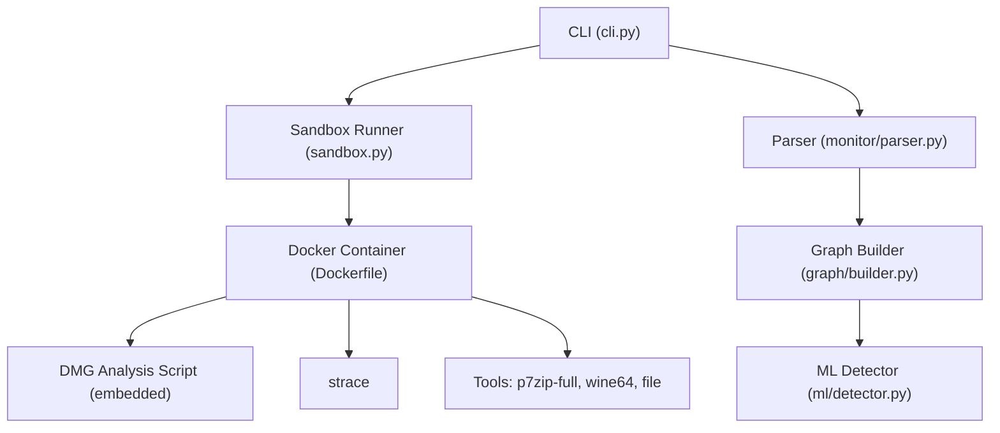
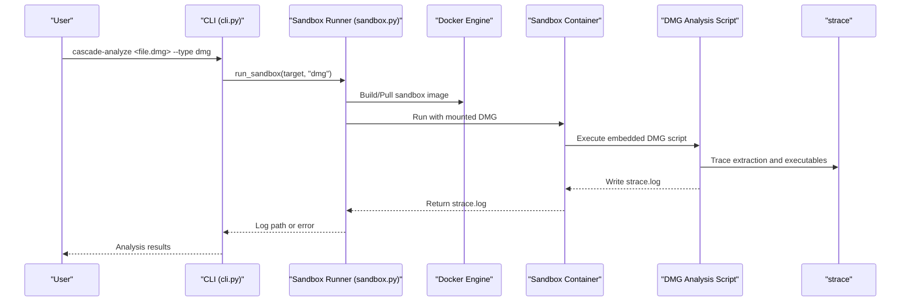
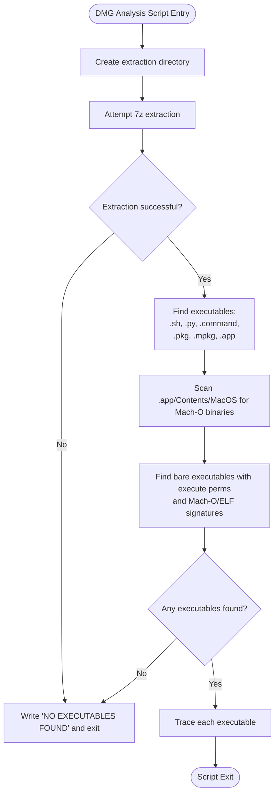
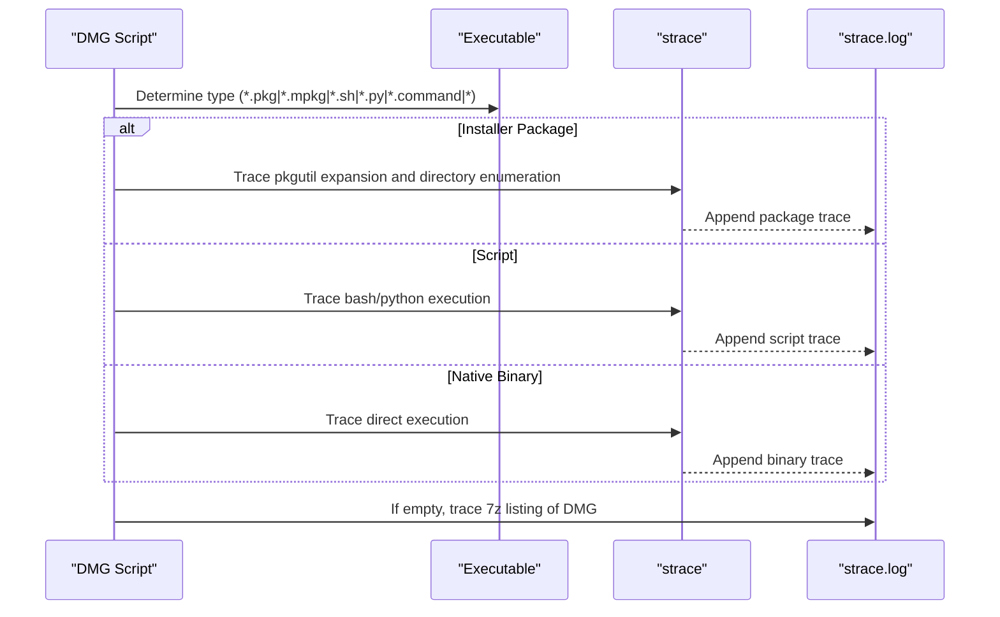
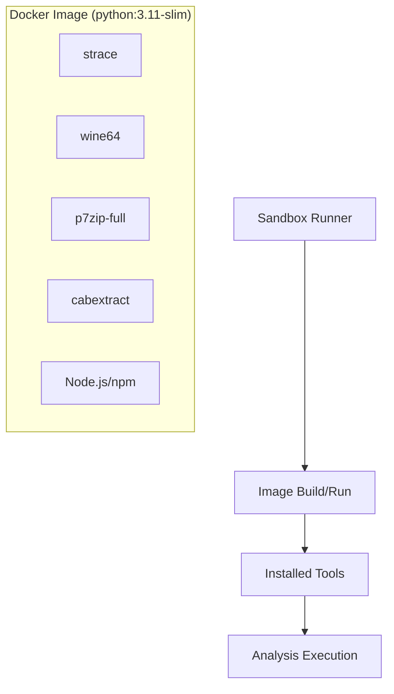
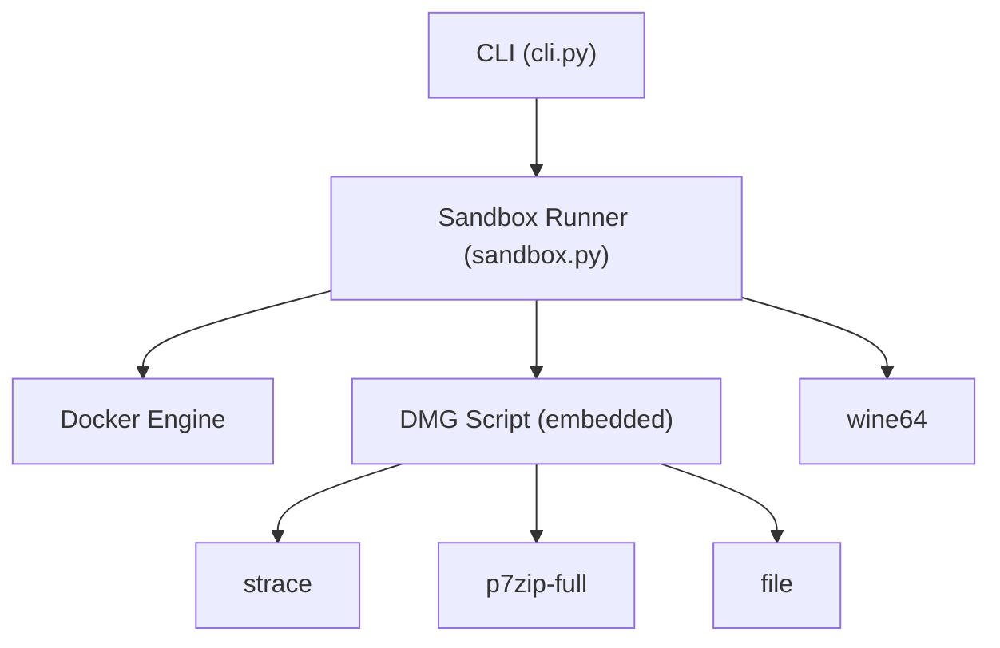

# DMG File Analysis

<cite>
**Referenced Files in This Document**
- [sandbox.py](file://TraceTree/sandbox/sandbox.py)
- [Dockerfile](file://TraceTree/sandbox/Dockerfile)
- [cli.py](file://TraceTree/cli.py)
- [README.md](file://TraceTree/README.md)
</cite>

## Table of Contents
1. [Introduction](#introduction)
2. [Project Structure](#project-structure)
3. [Core Components](#core-components)
4. [Architecture Overview](#architecture-overview)
5. [Detailed Component Analysis](#detailed-component-analysis)
6. [Dependency Analysis](#dependency-analysis)
7. [Performance Considerations](#performance-considerations)
8. [Troubleshooting Guide](#troubleshooting-guide)
9. [Conclusion](#conclusion)

## Introduction
This document provides comprehensive technical documentation for DMG (Disk Image) file analysis within the TraceTree framework. It explains the 7z-based extraction methodology for handling various DMG formats, including compressed and uncompressed images. It documents the executable discovery process for shell scripts (.sh, .command), Python scripts (.py), package installers (.pkg, .mpkg), and application bundles (.app). Special handling of Mach-O binary detection within .app bundles and bare executable files is detailed. The strace tracing methodology for each executable type, including installer command usage and direct binary execution, is covered. Cross-platform limitations are addressed, noting that DMG analysis requires macOS-specific tools and cannot be fully executed on Linux systems. Troubleshooting guidance for extraction failures, missing executables, and unsupported DMG formats is provided.

## Project Structure
The DMG analysis functionality is implemented within the sandbox module and integrates with the broader TraceTree pipeline. The key components include:
- DMG extraction and analysis script embedded in the sandbox runtime
- Docker container configuration providing strace, p7zip-full, wine64, and other analysis tools
- CLI orchestration that routes DMG targets through the sandbox
- README documentation outlining supported targets and limitations

**Diagram sources**
- [cli.py:181-259](file://TraceTree/cli.py#L181-L259)
- [sandbox.py:175-335](file://TraceTree/sandbox/sandbox.py#L175-L335)
- [Dockerfile:1-11](file://TraceTree/sandbox/Dockerfile#L1-L11)

**Section sources**
- [cli.py:181-259](file://TraceTree/cli.py#L181-L259)
- [sandbox.py:175-335](file://TraceTree/sandbox/sandbox.py#L175-L335)
- [Dockerfile:1-11](file://TraceTree/sandbox/Dockerfile#L1-L11)

## Core Components
This section details the core components involved in DMG analysis, focusing on extraction, executable discovery, and tracing methodology.

- DMG Extraction and Analysis Script
  - Embedded shell script performs DMG extraction using 7z, discovers executables, and traces them with strace.
  - Handles compressed and uncompressed DMG formats via 7z extraction.
  - Identifies executables across multiple categories: shell scripts, Python scripts, command scripts, package installers, application bundles, and bare executables.

- Executable Discovery Logic
  - Searches for files with extensions .sh, .py, .command, .pkg, .mpkg, and .app directories.
  - Recursively locates Mach-O binaries within .app bundle Contents/MacOS directories.
  - Identifies bare executables with execute permissions and Mach-O/ELF binary signatures using the file command.

- Tracing Methodology
  - Installer packages (.pkg, .mpkg): Uses pkgutil expansion and strace tracing of directory enumeration.
  - Scripts (.sh, .py, .command): Executes under bash or python3 and traces syscalls.
  - Native binaries: Direct execution under strace with chmod +x for executables.
  - Fallback: If no syscalls are captured from executables, traces the extraction process itself using strace on 7z listing.

- Sandbox Environment
  - Docker image based on python:3.11-slim with strace, p7zip-full, wine64, cabextract, Node.js, and npm.
  - Network isolation via ip link set eth0 down before execution.
  - Container lifecycle management, volume mounting for DMG files, and log extraction.

**Section sources**
- [sandbox.py:20-112](file://TraceTree/sandbox/sandbox.py#L20-L112)
- [sandbox.py:238-245](file://TraceTree/sandbox/sandbox.py#L238-L245)
- [Dockerfile:1-11](file://TraceTree/sandbox/Dockerfile#L1-L11)

## Architecture Overview
The DMG analysis architecture follows a containerized sandbox approach. The CLI determines the target type and delegates to the sandbox runner, which builds or pulls the sandbox image, mounts the DMG file, executes the embedded DMG analysis script, and extracts the strace log for downstream processing.

**Diagram sources**
- [cli.py:261-371](file://TraceTree/cli.py#L261-L371)
- [sandbox.py:175-335](file://TraceTree/sandbox/sandbox.py#L175-L335)

## Detailed Component Analysis

### DMG Extraction and Executable Discovery
The DMG analysis script performs the following steps:
- Creates a destination directory for extraction.
- Attempts 7z extraction with two fallback checks to handle various DMG formats.
- If extraction fails, writes a placeholder indicating no executables found and exits gracefully.
- Discovers executables using find with multiple patterns for scripts, installers, and app bundles.
- Recursively scans .app bundle Contents/MacOS directories for Mach-O binaries.
- Identifies bare executables with execute permissions and Mach-O/ELF signatures using the file command.
- Logs a warning and exits if no executables are found.

**Diagram sources**
- [sandbox.py:20-112](file://TraceTree/sandbox/sandbox.py#L20-L112)

**Section sources**
- [sandbox.py:20-112](file://TraceTree/sandbox/sandbox.py#L20-L112)

### Executable Tracing Methodology
The tracing methodology varies by executable type:
- Installer Packages (.pkg, .mpkg)
  - Uses pkgutil to expand the package to a temporary directory.
  - Traces directory enumeration of the expanded package using strace.
  - Concatenates the strace output into the main log file.

- Scripts (.sh, .py, .command)
  - Python scripts are executed with python3; shell/command scripts are executed with bash.
  - Output redirection suppresses noise while capturing syscalls.

- Native Binaries
  - Ensures executability with chmod +x.
  - Executes directly under strace to capture syscalls.

- Fallback Tracing
  - If the initial tracing yields no syscalls, the script traces the extraction process itself using strace on 7z listing of the DMG.

**Diagram sources**
- [sandbox.py:77-112](file://TraceTree/sandbox/sandbox.py#L77-L112)

**Section sources**
- [sandbox.py:77-112](file://TraceTree/sandbox/sandbox.py#L77-L112)

### Sandbox Environment and Containerization
The sandbox environment is defined by the Dockerfile and orchestrated by the sandbox runner:
- Base Image: python:3.11-slim
- Installed Tools: strace, curl, iproute2, Node.js, npm, wine64, p7zip-full, cabextract
- Network Isolation: ip link set eth0 down before target execution
- Volume Mounting: DMG file mounted read-only into the container
- Timeout Management: Different timeouts for different target types (DMG: 120s, EXE: 180s, others: 60s)
- Log Extraction: strace log is extracted from the container and post-processed

**Diagram sources**
- [Dockerfile:1-11](file://TraceTree/sandbox/Dockerfile#L1-L11)
- [sandbox.py:175-335](file://TraceTree/sandbox/sandbox.py#L175-L335)

**Section sources**
- [Dockerfile:1-11](file://TraceTree/sandbox/Dockerfile#L1-L11)
- [sandbox.py:175-335](file://TraceTree/sandbox/sandbox.py#L175-L335)

### Cross-Platform Limitations
- Linux Container Environment
  - The sandbox runs on Linux inside Docker, which limits the behavioral fidelity of DMG scripts and EXE binaries.
  - DMG scripts execute in a Linux container; macOS-specific behavior (launchd, Keychain, etc.) will not execute.
  - EXE binaries run under wine64; Windows syscalls are translated to Linux syscalls, potentially masking Windows-specific behavior.

- Unsupported Formats
  - DMG extraction relies on 7z; encrypted or uncommon DMG formats may fail to extract.
  - The analysis script writes a placeholder log when extraction fails or no executables are found.

**Section sources**
- [README.md:330-339](file://TraceTree/README.md#L330-L339)
- [sandbox.py:29-39](file://TraceTree/sandbox/sandbox.py#L29-L39)

## Dependency Analysis
The DMG analysis pipeline depends on several components and external tools:
- CLI orchestrates target type determination and delegates to the sandbox runner.
- Sandbox runner manages Docker lifecycle, image building/pulling, container execution, and log extraction.
- Embedded DMG script performs extraction, discovery, and tracing.
- External tools: strace for syscall tracing, p7zip-full for DMG extraction, wine64 for EXE analysis, file for binary signature detection.

**Diagram sources**
- [cli.py:181-259](file://TraceTree/cli.py#L181-L259)
- [sandbox.py:175-335](file://TraceTree/sandbox/sandbox.py#L175-L335)
- [Dockerfile:1-11](file://TraceTree/sandbox/Dockerfile#L1-L11)

**Section sources**
- [cli.py:181-259](file://TraceTree/cli.py#L181-L259)
- [sandbox.py:175-335](file://TraceTree/sandbox/sandbox.py#L175-L335)
- [Dockerfile:1-11](file://TraceTree/sandbox/Dockerfile#L1-L11)

## Performance Considerations
- Extraction Efficiency: 7z extraction is fast and handles most DMG formats. Two fallback checks improve robustness.
- Tracing Overhead: strace -f captures child processes, which can increase overhead. The -s 1000 flag increases buffer size for long syscall arguments.
- Container Timeouts: Appropriate timeouts prevent indefinite hangs, especially for EXE analysis under wine64.
- Log Filtering: For EXE analysis, wine initialization noise is filtered from strace logs to reduce false positives.

## Troubleshooting Guide
Common issues and resolutions during DMG analysis:

- Extraction Failures
  - Symptom: "ERROR: Could not extract DMG with 7z" followed by "NO EXECUTABLES FOUND".
  - Causes: Encrypted DMG, unsupported format, corrupted archive.
  - Resolution: Verify DMG integrity and format. The analysis script writes a placeholder log; no further tracing occurs.

- Missing Executables
  - Symptom: "No executables found in DMG" followed by "NO EXECUTABLES FOUND".
  - Causes: Scripts not marked executable, .app bundles without Mach-O binaries, incorrect permissions.
  - Resolution: Ensure scripts have execute permissions. Verify .app bundle structure and Contents/MacOS presence. Re-extract and re-analyze.

- Unsupported DMG Formats
  - Symptom: Extraction succeeds but no executables are discovered.
  - Causes: Non-standard DMG layout, unusual compression, or protected content.
  - Resolution: Manually inspect the extracted directory structure. Consider alternative extraction tools outside the sandbox.

- Cross-Platform Limitations
  - Symptom: DMG scripts behave differently than on macOS.
  - Explanation: Scripts run in a Linux container; macOS-specific APIs and services are unavailable.
  - Mitigation: Interpret results cautiously; focus on observable syscalls rather than macOS-specific behavior.

- Docker and Environment Issues
  - Symptom: Sandbox fails to start or Docker errors.
  - Resolution: Ensure Docker is installed and running. Confirm the sandbox image is built or available. Check volume mounting permissions.

**Section sources**
- [sandbox.py:29-39](file://TraceTree/sandbox/sandbox.py#L29-L39)
- [sandbox.py:69-73](file://TraceTree/sandbox/sandbox.py#L69-L73)
- [README.md:330-339](file://TraceTree/README.md#L330-L339)

## Conclusion
The DMG analysis component of TraceTree provides a robust, containerized approach to extracting and tracing macOS disk images. The 7z-based extraction methodology accommodates various DMG formats, while the executable discovery logic identifies scripts, installers, application bundles, and bare binaries. The strace tracing methodology ensures comprehensive syscall capture across different executable types, with a fallback to extraction tracing when direct execution yields no syscalls. Cross-platform limitations are acknowledged, particularly the Linux container environment affecting macOS-specific behavior. The troubleshooting guidance addresses common extraction failures, missing executables, and unsupported formats, enabling practitioners to diagnose and resolve issues effectively.